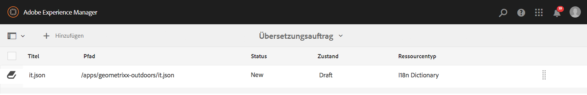

# Verwalten von Übersetzungsprojekten{#managing-translation-projects}

Nach dem Sie den Inhalt für die Übersetzung vorbereitet haben, müssen Sie die Sprachstruktur abschließen, indem Sie fehlende Sprachkopien sowie Übersetzungsprojekte erstellen.

Mithilfe von Übersetzungsprojekten können Sie die Übersetzung von AEM-Inhalten verwalten. Ein Übersetzungsprojekt ist eine Art AEM [Projekt](/help/sites-authoring/projects.md), das Ressourcen enthält, die in andere Sprachen übersetzt werden sollen. Bei diesen Ressourcen handelt es sich um Seiten und Assets der [Sprachkopien](/help/sites-administering/tc-prep.md), die vom Sprach-Master erstellt werden.

Wenn einem Übersetzungsprojekt Ressourcen hinzugefügt werden, wird ein Übersetzungsauftrag für sie erstellt. Aufträge beinhalten Befehle und Statusinformationen, mit denen Sie die Workflows für menschliche und maschinelle Übersetzungen, die für die Ressourcen ausgeführt werden, verwalten.

>[!NOTE]
>
>Ein Übersetzungsprojekt kann mehrere Übersetzungsaufträge enthalten.

Übersetzungsprojekte sind langfristige Elemente, die durch die Sprache und die Übersetzungsmethode/den Provider entsprechend den Grundsätzen der Organisationsführung hinsichtlich der Globalisierung definiert sind. Sie sollten einmal während der Erstübersetzung oder manuell initiiert werden und so lange gültig bleiben, wie Inhalts- und Übersetzungsaktualisierungsaktivitäten ausgeführt werden.

Übersetzungsprojekte und -aufträge werden in Übersetzungsvorbereitungs-Workflows erstellt. Diese Workflows umfassen drei Optionen für die Erstübersetzung (Erstellen und übersetzen) und für Aktualisierungen (Übersetzung aktualisieren):

1. [Neues Projekt erstellen](#creating-translation-projects-using-the-references-panel)
1. [Zu vorhandenem Projekt hinzufügen](#adding-pages-to-a-translation-project)
1. [Nur Inhaltsstruktur](#creating-the-structure-of-a-language-copy)

>[!NOTE]
>
>Die Option 3 bezieht sich nicht auf ein Übersetzungsauftrag/-projekt. Sie bietet Ihnen die Möglichkeit, Inhalte und Strukturänderungen im Sprach-Master in (nicht übersetzte) Sprachkopien zu kopieren. Sie können diese Option verwenden, um Ihre Sprach-Master auch ohne Übersetzung zu synchronisieren.

## Durchführen von Erstübersetzungen und Aktualisieren von vorhandenen Übersetzungen {#performing-initial-translations-and-updating-existing-translations}

AEM erkennt, ob ein Übersetzungsprojekt zur Erstübersetzung des Inhalts oder zur Aktualisierung von bereits übersetzten Sprachkopien erstellt werden soll. Wenn Sie ein Übersetzungsprojekt für eine Seite erstellen und die Sprachkopien angeben, für die Sie eine Übersetzung benötigen, erkennt AEM, ob die Quellseite bereits in den Zielsprachkopien vorhanden ist:

* **Die Sprachkopie enthält keine Seite:** AEM behandelt diese Situation als Ausgangsübersetzung. Die Seite wird sofort in die Sprachkopie kopiert und in das Projekt eingefügt. Wenn die übersetzte Seite in AEM importiert wird, kopiert AEM diese direkt in die Sprachkopie.
* **Die Sprachkopie enthält bereits die Seite:** AEM behandelt diese Situation als aktualisierte Übersetzung. Es wird ein Lauch erstellt, eine Kopie der Seite dem Launch hinzugefügt und dieser in das Projekt eingefügt. Mithilfe von Launches können Sie aktualisierte Übersetzungen vor dem Einfügen in die Sprachkopie überprüfen:

   * Wenn die übersetzte Seite in AEM importiert wird, wird die Seite im Launch überschrieben.
   * Die übersetzte Seite überschreibt die Sprachkopie nur, wenn der Launch weitergeleitet (beworben) wird.

Beispiel: Der Sprach-Stamm /content/geometrixx/fr wurde für die französische Übersetzung der Mastersprache /content/geometrixx/en erstellt. Es gibt keine anderen Seiten in der französischen Sprachkopie.

* Es wird ein Übersetzungsprojekt für die Seite /content/geometrixx/en/products und alle untergeordneten Seiten erstellt, das mit der französischen Sprachkopie verknüpft ist. Da die Sprachkopie nicht die Seite &quot;/content/geometrixx/fr/products&quot;enthält, kopiert AEM sofort die Seite &quot;/content/geometrixx/en/products&quot;und alle untergeordneten Seiten in die französische Sprachkopie. Die Kopien werden auch in das Übersetzungsprojekt eingefügt.
* Ein Übersetzungsprojekt wird für die Seite &quot;/content/geometrixx/en&quot;und alle untergeordneten Seiten erstellt, wobei die französische Sprachkopie verwendet wird. Da die Sprachkopie die Seite enthält, die der Seite &quot;/content/geometrixx/en&quot;entspricht (der Sprachstamm), kopiert AEM die Seite &quot;/content/geometrixx/en&quot;und alle untergeordneten Seiten und fügt sie einem Start hinzu. Die Kopien werden auch in das Übersetzungsprojekt eingefügt.

## Erstellen von Übersetzungsprojekten mithilfe des Bedienfelds „Verweise“ {#creating-translation-projects-using-the-references-panel}

Erstellen Sie Übersetzungsprojekte so, dass Sie den Workflow zur Übersetzung der Ressourcen Ihres Sprach-Masters ausführen und verwalten können. Wenn Sie Projekte erstellen, legen Sie die Seite im Sprach-Master, die Sie übersetzen wollen, und die Sprachkopien, für die Sie die Übersetzung durchführen wollen, fest:

* Die Cloud-Konfiguration des Übersetzungsintegrations-Frameworks, das mit der ausgewählten Seite verknüpft ist, bestimmt viele Eigenschaften der Übersetzungsprojekte, z. B. die zu verwendenden Übersetzungs-Workflows.
* Es wird ein Projekt für jede ausgewählte Sprachkopie erstellt.
* Es wird eine Kopie der ausgewählten Seite und der zugehörigen Assets erstellt und jedem Projekt hinzugefügt. Diese Kopien werden später zum Übersetzen an den Übersetzungsanbieter gesendet.

Sie können festlegen, dass die untergeordneten Seiten der ausgewählten Seite ebenfalls ausgewählt werden. In diesem Fall werden jedem Projekt auch die Kopien der untergeordneten Seiten hinzugefügt, sodass sie übersetzt werden. Wenn untergeordnete Seiten unterschiedlichen Konfigurationen des Translation-Integration-Frameworks zugeordnet sind, erstellt AEM zusätzliche Projekte.

Sie können auch [Übersetzungsprojekte manuell erstellen](#creating-a-translation-project-using-the-projects-console).

>[!NOTE]
>
>Um ein Projekt zu erstellen, muss Ihr Konto Mitglied der Gruppe `project-administrators` sein.

**Erstübersetzungen und Aktualisieren von Übersetzungen**

Das Bedienfeld „Verweise“ zeigt an, ob Sie vorhandene Sprachkopien aktualisieren oder die erste Version der Sprachkopien erstellen. Falls eine Sprachkopie für die ausgewählte Seite vorhanden ist, wird die Registerkarte „Sprachkopien aktualisieren“ angezeigt, auf der Sie auf projektspezifische Befehle zugreifen können.

Nach der Übersetzung können Sie [die Übersetzung überprüfen](#reviewing-and-promoting-updated-content), bevor Sie die Sprachkopie damit überschreiben. Wenn keine Sprachkopie für die ausgewählte Seite vorhanden ist, wird die Registerkarte „Erstellen und übersetzen“ angezeigt, auf der Sie auf projektspezifische Befehle zugreifen können.

### Erstellen von Übersetzungsprojekten für eine neue Sprachkopie {#create-translation-projects-for-a-new-language-copy}

1. Verwenden Sie die Sites-Konsole, um die Seite auszuwählen, die Sie den Übersetzungsprojekten hinzufügen.

   Wählen Sie beispielsweise „Geometrixx Demo Site“ > „Englisch“ aus, um die englischen Seiten der Geometrixx-Demo-Website zu übersetzen.

1. Klicken Sie in der Symbolleiste auf „Verweise“.

   

1. Wählen Sie die Option „Sprachkopien“ und dann die Sprachkopien aus, für die Sie die Quellseiten übersetzen.
1. Klicken oder tippen Sie auf „Erstellen und übersetzen“ und konfigurieren Sie dann den Übersetzungsauftrag:

   * Wählen Sie mithilfe des Dropdown-Menüs „Sprache“ eine Sprachkopie aus, für die Sie eine Übersetzung durchführen möchten. Wählen Sie bei Bedarf weitere Sprachen aus. Die in der Liste angezeigten Sprachen entsprechen den [Sprach-Stämmen, die Sie erstellt haben](/help/sites-administering/tc-prep.md#creating-a-language-root).
   * Wählen Sie zur Übersetzung der von Ihnen ausgewählten Seite und allen untergeordneten Seiten die Option „Alle Unterseiten auswählen“ aus. Um nur die von Ihnen ausgewählten Seiten zu übersetzen, wählen Sie diese Option ab.
   * Wählen Sie für das Projekt die Option „Neues Übersetzungsprojekt erstellen“ aus.
   * Geben Sie einen Namen für das Projekt ein.

   

1. Klicken oder tippen Sie auf „Erstellen“.

### Erstellen von Übersetzungsprojekten für vorhandene Sprachkopien  {#create-translation-projects-for-an-existing-language-copy}

1. Verwenden Sie die Sites-Konsole, um die Seite auszuwählen, die Sie den Übersetzungsprojekten hinzufügen.

   Wählen Sie beispielsweise „Geometrixx Demo Site“ > „Englisch“ aus, um die englischen Seiten der Geometrixx-Demo-Website zu übersetzen.

1. Klicken Sie in der Symbolleiste auf „Verweise“.

   

1. Wählen Sie die Option „Sprachkopien“ und dann die Sprachkopien aus, für die Sie die Quellseiten übersetzen.
1. Klicken Sie auf oder tippen Sie auf Sprachkopien aktualisieren und konfigurieren Sie dann den Übersetzungsauftrag:

   * Wählen Sie zur Übersetzung der von Ihnen ausgewählten Seite und allen untergeordneten Seiten die Option „Alle Unterseiten auswählen“ aus. Um nur die von Ihnen ausgewählten Seiten zu übersetzen, wählen Sie diese Option ab.
   * Wählen Sie für das Projekt die Option „Neues Übersetzungsprojekt erstellen“ aus.
   * Geben Sie einen Namen für das Projekt ein.

   

1. Klicken oder tippen Sie auf „Starten“.

## Hinzufügen von Seiten zu einem Übersetzungsprojekt  {#adding-pages-to-a-translation-project}

Nachdem Sie ein Übersetzungsprojekt erstellt haben, können Sie das Bedienfeld „Ressourcen“ verwenden, um Seiten zum Projekt hinzuzufügen. Das Hinzufügen von Seiten ist dann hilfreich, wenn Sie Seiten von verschiedenen Verzweigungen in dasselbe Projekt einfügen.

Wenn Sie einem Übersetzungsprojekt Seiten hinzufügen, werden die Seiten in einen neuen Übersetzungsauftrag eingefügt. Sie können also [Seiten zu einem vorhandenen Auftrag hinzufügen](#adding-pages-assets-to-a-translation-job).

So wie beim Erstellen eines neuen Projekts werden beim Hinzufügen von Seiten bei Bedarf Kopien der Seiten zu einem Launch hinzugefügt, um zu verhindern, dass vorhandene Sprachkopien überschrieben werden. (Siehe [Erstellen von Übersetzungsprojekten für vorhandene Sprachkopien](#performing-initial-translations-and-updating-existing-translations).)

1. Verwenden Sie die Sites-Konsole, um die Seite auszuwählen, die Sie dem Übersetzungsprojekt hinzufügen.

   Wählen Sie beispielsweise „Geometrixx Demo Site“ > „Englisch“ aus, um die englischen Seiten der Geometrixx-Demo-Website zu übersetzen.

1. Klicken Sie in der Symbolleiste auf „Verweise“.

   

1. Wählen Sie die Option „Sprachkopien“ und dann die Sprachkopien aus, für die Sie die Quellseiten übersetzen.

   

1. Klicken Sie auf oder tippen Sie auf Sprachkopien aktualisieren und konfigurieren Sie dann die Eigenschaften:

   * Wählen Sie zur Übersetzung der von Ihnen ausgewählten Seite und allen untergeordneten Seiten die Option „Alle Unterseiten auswählen“ aus. Um nur die von Ihnen ausgewählten Seiten zu übersetzen, wählen Sie diese Option ab.
   * Wählen Sie für das Projekt die Option „Zu vorhandenem Übersetzungsprojekt hinzufügen“ aus.
   * Wählen Sie das Projekt aus.

   >[!NOTE]
   >
   >Die im Übersetzungsprojekt festgelegte Sprache muss dem Pfad der Sprachkopie, der im Bedienfeld „Verweise“ angezeigt wird, entsprechen.

   

1. Klicken oder tippen Sie auf „Starten“.

## Hinzufügen von Seiten/Assets zu einem Übersetzungsauftrag  {#adding-pages-assets-to-a-translation-job}

Sie können Seiten, Assets, Tags oder i18n-Wörterbücher dem Übersetzungsauftrag Ihres Übersetzungsprojektes hinzufügen. So fügen Sie Seiten oder Assets hinzu:

1. Klicken oder tippen Sie unten in der Kachel „Übersetzungsauftrag“ Ihres Übersetzungsprojekts auf die Ellipse.

   

1. Klicken oder tippen Sie auf „Hinzufügen“ und anschließend auf „Seiten/Assets“.

   

1. Wählen Sie das oberste Element der Verzweigung aus, das Sie hinzufügen wollen, und klicken oder tippen Sie dann auf das Häkchen-Symbol. Sie können mehrere Objekte auswählen.

   

1. Alternativ können Sie das Symbol „Suchen“ auswählen, um schnell und einfach nach Seiten oder Assets zu suchen, die Sie Ihrem Übersetzungsauftrag hinzufügen möchten.

   

Die Seiten und/oder Assets werden dem Übersetzungsauftrag hinzugefügt.

## Hinzufügen von i18n-Wörterbüchern zu einem Übersetzungsauftrag  {#adding-i-n-dictionaries-to-a-translation-job}

Sie können Seiten, Assets, Tags oder i18n-Wörterbücher dem Übersetzungsauftrag Ihres Übersetzungsprojektes hinzufügen. So fügen Sie ein i18n-Wörterbuch hinzu:

1. Klicken oder tippen Sie unten in der Kachel „Übersetzungsauftrag“ Ihres Übersetzungsprojekts auf die Ellipse.

   

1. Klicken bzw. tippen Sie auf „I18N-Wörterbuch“.

   

1. Wählen Sie das Wörterbuch aus, das Sie hinzufügen möchten, und klicken oder tippen Sie dann auf die Schaltfläche „Hinzufügen“.

   

Ihr Wörterbuch befindet sich nun in Ihrem Übersetzungsauftrag.

>[!NOTE]
>
>Weitere Informationen zu i18n-Wörterbüchern finden Sie unter [Verwenden von Translator zum Verwalten von Wörterbüchern](/help/sites-developing/i18n-translator.md).

## Hinzufügen von Tags zu einem Übersetzungsauftrag {#adding-tags-to-a-translation-job}

Sie können Seiten, Assets, Tags oder i18n-Wörterbücher dem Übersetzungsauftrag Ihres Übersetzungsprojektes hinzufügen. So fügen Sie Tags hinzu:

1. Klicken oder tippen Sie unten in der Kachel „Übersetzungsauftrag“ Ihres Übersetzungsprojekts auf die Ellipse.

   

1. Klicken oder tippen Sie auf „Hinzufügen“ und dann auf „Tags“.

   

1. Wählen Sie die Tags aus, die Sie hinzufügen möchten, und klicken oder tippen Sie dann auf das Häkchen-Symbol. Sie können mehrere Objekte auswählen.

   

Ihre Tags werden nun in Ihrem Übersetzungsauftrag hinzugefügt.

## Anzeigen von Details eines Übersetzungsprojekts {#seeing-translation-project-details}

Die Kachel „Zusammenfassung der Übersetzung“ enthält die Eigenschaften, die für ein Übersetzungsprojekt konfiguriert sind. Auf der Registerkarte „Übersetzung“ finden Sie zusätzlich zu den generischen [Projektinformationen](/help/sites-authoring/projects.md#project-info) übersetzungsspezifische Eigenschaften:

* Ausgangssprache: Die Sprache der Seiten, die übersetzt werden
* Zielsprache: Die Sprache, in die die Seiten übersetzt werden
* Übersetzungsmethode: Der Übersetzungs-Workflow. „Menschliche Übersetzung“ oder „Maschinelle Übersetzung“ wird unterstützt.
* Übersetzungsanbieter: Der Übersetzungsdienstanbieter, der die Übersetzung ausführt
* Inhaltskategorie: (Maschinelle Übersetzung) Die Inhaltskategorie, die für die Übersetzung verwendet wird
* Cloud-Konfiguration: Die Cloud-Konfiguration für den Übersetzungsdienst-Connector, der für das Projekt verwendet wird.

Wenn ein Projekt unter Verwendung des Bedienfelds „Ressourcen“ auf einer Seite erstellt wurde, werden diese Eigenschaften automatisch basierend auf den Eigenschaften der Quellseite konfiguriert.

## Überwachen des Status von Übersetzungsaufträgen {#monitoring-the-status-of-a-translation-job}

Die Kachel „Übersetzungsauftrag“ zeigt den Status eines Übersetzungsauftrags sowie die Anzahl an Seiten und Assets im Auftrag an.

Die folgende Tabelle beschreibt die einzelnen Status, die ein Auftrag oder ein Element im Auftrag haben kann:

| Status | Beschreibung |
|---|---|
| Draft | Der Übersetzungsauftrag wurde noch nicht gestartet. Übersetzungsaufträge haben den Status ENTWURF, wenn sie erstellt werden. |
| Übermittelt | Dateien im Übersetzungsauftrag erhalten diesen Status, wenn sie erfolgreich an den Übersetzungsdienst gesendet wurden. Dieser Status kann nach der Ausgabe des Befehls &quot;Anforderungsbereich&quot;oder des Befehls &quot;Beginn&quot;auftreten. |
| Berechnung angefragt | Für den Arbeitsablauf der menschlichen Übersetzung wurden die Dateien im Auftrag zum Scoping an den Übersetzungsanbieter übermittelt. Er wird nach Ausgabe des Befehls „Berechnung anfordern“ angezeigt. |
| Berechnung abgeschlossen | Der Verkäufer hat den Übersetzungsauftrag abgespielt. |
| Übersetzungsauftrag | Der Projekteigentümer hat den Anwendungsbereich akzeptiert. Dieser Status zeigt an, dass der Übersetzungsanbieter mit der Übersetzung der Dateien im Auftrag beginnen soll. |
| Übersetzung läuft | Bei einem Auftrag ist die Übersetzung einer oder mehrerer Dateien im Auftrag noch nicht abgeschlossen. Hinsichtlich eines Elements im Auftrag besagt der Status, dass das Element übersetzt wird. |
| Übersetzt | Bei einem Auftrag ist die Übersetzung aller Dateien im Auftrag abgeschlossen. Hinsichtlich eines Elements im Auftrag besagt der Status, dass das Element übersetzt ist. |
| Bereit für Review | Das Element im Auftrag wird übersetzt und die Datei wurde in AEM importiert. |
| Fertig stellen | Der Projekteigentümer hat mitgeteilt, dass der Übersetzungsvertrag abgeschlossen ist. |
| Abbrechen | Gibt an, dass der Übersetzungsanbieter die Arbeit an einem Übersetzungsauftrag beenden soll. |
| Fehler-Aktualisierung | Beim Übertragen von Dateien zwischen AEM und dem Übersetzungsdienst ist ein Fehler aufgetreten. |
| Unbekannter Status | Es ist ein unbekannter Fehler aufgetreten. |

Klicken oder tippen Sie auf die Ellipse am unteren Rand der Kachel, um den Status der einzelnen Dateien im Auftrag anzuzeigen.

## Festlegen des Fälligkeitsdatums von Übersetzungsaufträgen  {#setting-the-due-date-of-translation-jobs}

Geben Sie das Datum an, bis zu dem Ihr Übersetzungsanbieter die übersetzten Dateien zurückgeben muss. Sie können das Fälligkeitsdatum für ein Projekt oder für einen bestimmten Auftrag festlegen:

* **Projekt:** Die Übersetzungsaufträge im Projekt übernehmen das Fälligkeitsdatum.
* **Auftrag:** Das von Ihnen für den Auftrag festgelegte Fälligkeitsdatum überschreibt das Fälligkeitsdatum, das für das Projekt festgelegt wurde.

Die Festlegung eines Fälligkeitsdatums funktioniert nur dann richtig, wenn der Übersetzungsanbieter diese Funktion unterstützt.

Im folgenden Verfahren wird das Fälligkeitsdatum für ein Projekt festgelegt.

1. Klicken oder tippen Sie am unteren Rand der Kachel „Zusammenfassung der Übersetzung“ auf die Ellipse.

   

1. Wählen Sie auf der Registerkarte „Allgemein“ mithilfe der Datumsauswahl der Eigenschaft „Fälligkeitsdatum“ das Fälligkeitsdatum aus.

   

1. Klicken oder tippen Sie auf „Fertig“.

Im folgenden Verfahren wird das Fälligkeitsdatum für einen Übersetzungsauftrag festgelegt.

1. Klicken oder tippen Sie in der Kachel „Übersetzungsauftrag“ auf das Befehlsmenü und dann auf „Fälligkeitsdatum“.

   

1. Klicken oder tippen Sie im Dialogfeld auf das Kalender-Symbol, wählen Sie dann das Datum und die Uhrzeit für das Fälligkeitsdatum aus und klicken Sie abschließend auf „Speichern“.

   

## Berechnen des Umfangs eines Übersetzungsauftrags {#scoping-a-translation-job}

Berechnen Sie den Umfang eines Übersetzungsauftrags, um eine Kostenschätzung für die Übersetzung von Ihrem Übersetzungsdienstanbieter zu erhalten. Wenn Sie den Umfang eines Auftrags berechnen, werden die Quelldateien an den Übersetzungsanbieter übermittelt, der den Text mit seinem Pool an gespeicherten Übersetzungen (Translation Memory) vergleicht. Normalerweise ist der Umfang die Anzahl an Wörtern, die übersetzt werden müssen.

Weitere Informationen zu den Umfangsberechnungsergebnissen erhalten Sie von Ihrem Übersetzungsanbieter.

>[!NOTE]
>
>Die Berechnung des Umfangs ist optional. Sie können einen Übersetzungsauftrag auch ohne Berechnung des Umfangs starten.

Wenn Sie einen Übersetzungsauftrag einbeziehen, ist der Status des Auftrags `Scope Requested`. Wenn der Übersetzungsanbieter den Gültigkeitsbereich zurückgibt, wird der Status in `Scope Completed` geändert. Ist die Berechnung des Umfangs abgeschlossen, können Sie den Befehl „Berechnung anzeigen“ zur Überprüfung der Ergebnisse der Umfangsberechnung verwenden.

Die Umfangsberechnung funktioniert nur dann richtig, wenn der Übersetzungsanbieter diese Funktion unterstützt.

1. Öffnen Sie in der Projektekonsole das Übersetzungsprojekt.
1. Klicken oder tippen Sie in der Kachel „Übersetzungsauftrag“ auf das Menü „Befehle“ und dann auf „Berechnung anfordern“.

   

1. Wenn der Auftragsstatus zu BERECHNUNG_ABGESCHLOSSEN wechselt, klicken oder tippen Sie in der Kachel „Übersetzungsauftrag“ auf das Menü „Befehle“ und dann auf „Berechnung anzeigen“.

## Starten von Übersetzungsaufträgen  {#starting-a-translation-job}

Starten Sie einen Übersetzungsauftrag, um die Quellseiten in die Zielsprache zu übersetzen. Die Übersetzung wird gemäß den Eigenschaftswerten der Kachel „Zusammenfassung der Übersetzung“ durchgeführt.

Nachdem Sie den Übersetzungsauftrag gestartet haben, wird in der Kachel „Übersetzungsauftrag“ der Status „Übersetzung läuft“ angezeigt.

1. Öffnen Sie in der Projektekonsole das Übersetzungsprojekt.
1. Klicken oder tippen Sie in der Kachel „Übersetzungsauftrag“ auf das Befehlsmenü und dann auf „Starten“.

   

1. Klicken Sie im Dialogfeld „Aktion“, das den Start der Übersetzung bestätigt, auf „Schließen“.

## Abbrechen von Übersetzungsaufträgen  {#canceling-a-translation-job}

Brechen Sie einen Übersetzungsauftrag ab, um den Übersetzungsprozess anzuhalten und den Übersetzungsanbieter daran zu hindern, weitere Übersetzungen auszuführen. Sie können einen Auftrag stornieren, wenn der Auftrag den Status `Committed For Translation` oder `Translation In Progress` hat.

1. Öffnen Sie in der Projektekonsole das Übersetzungsprojekt.
1. Klicken oder tippen Sie in der Kachel „Übersetzungsauftrag“ auf das Menü „Befehle“ und dann auf „Abbrechen“.
1. Klicken Sie im Dialogfeld „Aktion“, das den Abbruch der Übersetzung bestätigt, auf „OK“.

## Workflow für das Akzeptieren/Ablehnen  {#accept-reject-workflow}

Wenn die Inhalte nach der Übersetzung zurückgegeben werden und den Status „Bereit für Überprüfung“ aufweisen, können Sie den Übersetzungsauftrag aufrufen und die Inhalte akzeptieren bzw. ablehnen.

Falls Sie die Option „Übersetzung ablehnen“ auswählen, haben Sie die Möglichkeit, einen Kommentar hinzuzufügen.

Bei Ablehnung der Inhalte werden diese an den Übersetzungsanbieter zurückgesendet und der Anbieter kann dann den Kommentar einsehen.

## Überprüfen und Weiterleiten von aktualisierten Inhalten  {#reviewing-and-promoting-updated-content}

Wenn Inhalte für eine vorhandene Sprachkopie übersetzt werden, überprüfen Sie die Übersetzungen, nehmen Sie bei Bedarf Änderungen vor und leiten Sie dann die Übersetzungen weiter, um die Übersetzungen in die Sprachkopie zu verschieben. Sie können übersetzte Dateien überprüfen, wenn der Übersetzungsauftrag den Status „Bereit für Überprüfung“ aufweist.

1. Wählen Sie die Seite im Sprach-Master aus, klicken oder tippen Sie auf „Verweise“ und dann auf „Sprachkopien“.
1. Klicken bzw. tippen Sie auf die zu überprüfende Sprachkopie.

   

1. Klicken oder tippen Sie auf „Launch“, um die Launch-Befehle anzuzeigen.

   

1. Klicken Sie auf „Seite öffnen“, um die Launch Copy der zu überprüfenden Seite zu öffnen und die Inhalte zu bearbeiten.
1. Nachdem Sie die Inhalte überprüft und alle notwendigen Änderungen vorgenommen haben, klicken Sie auf „Bewerben“, um die Launch Copy zu bewerben.
1. Legen Sie auf der Seite „Launch bewerben“ fest, welche Seiten beworben werden sollen, und klicken oder tippen Sie dann auf „Bewerben“.

## Vergleichen von Sprachkopien  {#comparing-language-copies}

So vergleichen Sie Sprachkopien mit dem Sprach-Master:

1. Navigieren Sie in der **Sites-Konsole** zur Sprachkopie, die Sie vergleichen wollen.
1. Öffnen Sie das Bedienfeld **[Verweise](/help/sites-authoring/basic-handling.md#references)**.
1. Wählen Sie unter der Überschrift **Kopien** **Sprachkopien.**
1. Wählen Sie die gewünschte Sprachkopie aus und klicken Sie dann auf **Mit Übergeordnet vergleichen **oder **Mit vorherigen **vergleichen.

   

1. Die beiden Seiten (Launch und Quelle) werden nebeneinander geöffnet.

   Weitere Informationen zur Verwendung dieser Funktion finden Sie unter [Seitenvergleich](/help/sites-authoring/page-diff.md).

## Abschließen und Archivieren von Übersetzungsaufträgen  {#completing-and-archiving-translation-jobs}

Schließen Sie einen Übersetzungsauftrag ab, nachdem Sie die übersetzten Dateien vom Anbieter überprüft haben. Beim Workflow „Menschliche Übersetzung“ signalisiert der Abschluss einer Übersetzung dem Anbieter, dass der Übersetzungsauftrag erfüllt wurde und er die Übersetzung in seinem Translation Memory speichern sollte.

Nachdem Sie den Auftrag abgeschlossen haben, lautet der Status des Auftrags „Abgeschlossen“.

Archivieren Sie einen Übersetzungsauftrag, nachdem er abgeschlossen ist und Sie die Auftragsstatusdetails nicht länger einsehen müssen. Wenn Sie den Auftrag archivieren, wird die Kachel „Übersetzungsauftrag“ aus dem Projekt entfernt.

## Erstellen der Struktur einer Sprachkopie  {#creating-the-structure-of-a-language-copy}

Füllen Sie Ihre Sprachkopie so, dass sie Inhalte aus der Master-Sprache enthält, die Sie übersetzen. Bevor Sie Ihre Sprachkopie ausfüllen, müssen Sie [den Sprachstamm](/help/sites-administering/tc-prep.md#creating-a-language-root) der Sprachkopie erstellt haben.

1. Wählen Sie über die Sites-Konsole den Sprach-Stamm der Master-Sprache aus, die Sie als Quelle verwenden. Wählen Sie beispielsweise „Inhalt“ > „Geometrixx Demo Site“ > „Englisch“ aus, um die englischen Seiten der Geometrixx-Demo-Website zu übersetzen.
1. Klicken Sie in der Symbolleiste auf „Verweise“.

   

1. Wählen Sie die Option „Sprachkopien“ und dann die Sprachkopien aus, die Sie füllen möchten.

   

1. Klicken bzw. tippen Sie auf „Sprachkopien aktualisieren“, um die Übersetzungstools anzuzeigen, und konfigurieren Sie die Eigenschaften:

   * Wählen Sie die Option „Alle Unterseiten auswählen“ aus.
   * Wählen Sie für das Projekt die Option „Nur Struktur erstellen“ aus.

   

1. Klicken oder tippen Sie auf „Starten“.

## Erstellen von Übersetzungsprojekten mithilfe der Projektekonsole  {#creating-a-translation-project-using-the-projects-console}

Sie können ein Übersetzungsprojekt manuell erstellen, wenn Sie es vorziehen, die Projektekonsole zu verwenden.

>[!NOTE]
>
>Um ein Projekt zu erstellen, muss Ihr Konto Mitglied der Gruppe `project-administrators` sein.

Wenn Sie ein Übersetzungsprojekt manuell erstellen, müssen Sie neben den [grundlegenden Eigenschaften](/help/sites-authoring/touch-ui-managing-projects.md#creating-a-project) Werte für die folgenden übersetzungsspezifischen Eigenschaften angeben:

* **Name:** Projektname
* **Ausgangssprache:** Die Sprache der Quellinhalte
* **Zielsprache:** Die Sprache, in die die Inhalte übersetzt werden
* **Übersetzungsmethode:** Wählen Sie „Menschliche Übersetzung“ aus, um anzugeben, dass die Übersetzung manuell durchgeführt werden soll.

1. Klicken oder tippen Sie in der Symbolleiste der Projektekonsole auf „Erstellen“.
1. Wählen Sie dann die Vorlage „Übersetzungsprojekt“ aus und klicken oder tippen Sie auf „Weiter“.
1. Geben Sie Werte für die grundlegenden Eigenschaften ein.
1. Klicken oder tippen Sie auf „Erweitert“ und geben Sie Werte für die übersetzungsspezifischen Eigenschaften an.
1. Klicken oder tippen Sie auf Erstellen. Klicken oder tippen Sie im Bestätigungsfeld auf „Fertig“, um zur Projektekonsole zurückzukehren, oder auf „Projekt öffnen“, um das Projekt zu öffnen und mit der Verwaltung des Projekts zu beginnen.

## Exportieren von Übersetzungsaufträgen  {#exporting-a-translation-job}

Sie können die Inhalte eines Übersetzungsauftrags herunterladen, um sie z. B. an einen Übersetzungsanbieter zu senden, der nicht über einen Connector in AEM integriert ist, oder um die Inhalte zu überprüfen.

1. Klicken oder tippen Sie im Dropdown-Menü der Kachel „Übersetzungsauftrag“ auf „Exportieren“.
1. Klicken oder tippen Sie im Dialogfeld „Exportieren“ auf „Exportierte Datei herunterladen“ und speichern Sie die Datei ggf. über das Dialogfeld des Webbrowsers.
1. Klicken oder tippen Sie im Dialogfeld „Exportieren“ auf „Schließen“.

## Importieren von Übersetzungsaufträgen  {#importing-a-translation-job}

Sie können übersetzte Inhalte in AEM importieren, zum Beispiel wenn Ihr Übersetzungsanbieter die Inhalte an Sie sendet, da er nicht über einen Connector in AEM integriert ist.

1. Klicken oder tippen Sie im Dropdown-Menü der Kachel „Übersetzungsauftrag“ auf „Importieren“.
1. Wählen Sie im Dialogfeld des Webbrowsers die zu importierende Datei aus.
1. Klicken oder tippen Sie im Dialogfeld „Importieren“ auf „Schließen“.

