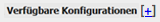
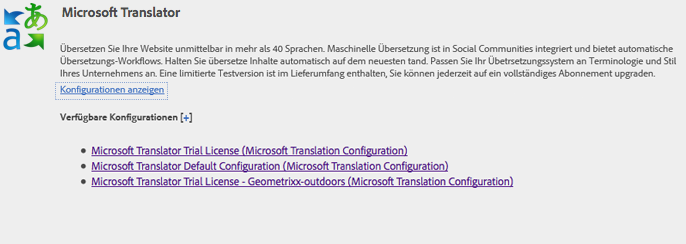
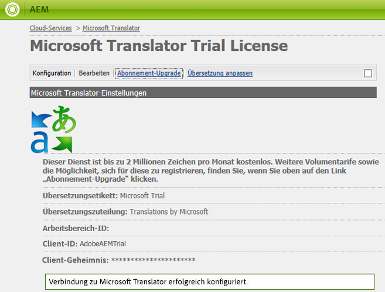

# Herstellen einer Verbindung mit Microsoft Translator{#connecting-to-microsoft-translator}

Erstellen Sie eine Konfiguration für den Microsoft Translator-Cloud-Service, um Ihr Microsoft Translation-Konto zum Übersetzen von AEM-Seiteninhalten, -Community-Inhalten oder -Assets zu nutzen.

| Eigenschaft | Beschreibung |
|---|---|
| Übersetzungsetikett | Der Anzeigename für den Übersetzungsdienst. |
| Übersetzungszuteilung | (Optional) Bei benutzergenerierten Inhalten die Zuordnung, die neben dem übersetzten Text angezeigt wird, z. B. `Translations by Microsoft`. |
| Workspace-ID | (Optional) Die ID Ihrer angepassten Microsoft Translator-Engine, die verwendet werden soll. |
| Mitgliedschaftsschlüssel | Ihr Mitgliedschaftsschlüssel für Microsoft Translator. |

Nachdem Sie die Konfiguration erstellt haben, müssen Sie [sie aktivieren](/help/sites-administering/tc-msconf.md#activating-the-translator-service-configurations).

Beim folgenden Verfahren wird die Touch-optimierte Benutzeroberfläche verwendet, um eine Microsoft Translator-Konfiguration zu erstellen.

1. Klicken oder tippen Sie in der Leiste auf „Tools“ > „Cloud-Services“.
1. Klicken oder tippen Sie im Microsoft Translator-Bereich dann auf „Konfigurationen anzeigen“.
1. Klicken Sie auf den Link „+“ neben „Verfügbare Konfigurationen“.

   

1. Geben Sie einen Titel für Ihre Konfiguration ein. Mit dem Titel wird die Konfiguration auf der Cloud-Services-Konsole und in Dropdown-Listen mit den Seiteneigenschaften identifiziert. Der Standardname basiert auf dem Titel. Geben Sie optional einen Namen für den Repository-Knoten ein, auf dem die Konfiguration gespeichert wird. Sie sollten den Standardwert für die Eigenschaft „Übergeordnete Konfiguration“ verwenden. Dies ist der Pfad des Repository-Knotens.
1. Klicken Sie auf Erstellen.
1. Geben Sie im angezeigten Dialogfeld die Werte für die Eigenschaften ein und klicken Sie auf „OK“.

## Beispielkonfigurationen für Microsoft Translator-Cloud-Service {#sample-microsoft-translator-cloud-service-configurations}

Die folgenden Konfigurationen für den Microsoft Translator-Cloud-Service werden mit den Geometrixx-Beispielen installiert. Einige Beispielkonfigurationen verwenden ein Microsoft Translation-Testkonto, das maximal 2 000 000 kostenlose übersetzte Zeichen pro Monat zulässt.

### Microsoft Translator-Testlizenz {#microsoft-translator-trial-license}

Die Konfiguration „Microsoft Translator-Testlizenz“ ist eine Beispielkonfiguration, die mit dem Geometrixx Outdoors-Beispielpaket installiert wird. Diese Konfiguration verwendet ein Microsoft Translator-Konto mit einem kostenlosen Abonnement, das 2 000 000 übersetzte Zeichen pro Monat erlaubt.

### Microsoft Translator-Testlizenz – Geometrixx-Outdoors {#microsoft-translator-trial-license-geometrixx-outdoors}

Die Konfiguration „Microsoft Translator-Testlizenz – Geometrixx-Outdoors“ ist eine Beispielkonfiguration, die mit Geometrixx Outdoors installiert wird. Bei dieser Konfiguration wird dasselbe kostenlose Microsoft Translator-Konto wie für die Konfiguration „Microsoft Translator-Testlizenz“ verwendet. Das Konto hat ein kostenloses Abonnement, das 2 000 000 übersetzte Zeichen pro Monat erlaubt.

Diese Microsoft Translator-Konfiguration ist für die Verwendung mit den Inhaltstypen optimiert, die auf der Geometrixx Outdoors-Beispiel-Website vorkommen.

### Durchführen eines Upgrades für die Konfiguration „Microsoft Translator-Testlizenz“  {#upgrading-the-microsoft-translator-trial-license-configuration}

Die Seiten der Microsoft Translation-Konfiguration enthalten einen direkten Link zur Microsoft-Website, über den Sie ein für Produktionssysteme geeignetes Kontoabonnement erhalten können.

1. Klicken oder tippen Sie auf der Leiste auf „Tools“ > „Vorgänge“ > „Cloud“ > „Cloud-Services“.
1. Klicken oder tippen Sie im Microsoft Translator-Bereich auf „Konfigurationen anzeigen“ und dann auf „Microsoft Translator-Testlizenz“ (Microsoft Translation-Konfiguration).

   

1. Klicken Sie auf der Seite „Konfiguration“ auf „Abonnement-Upgrade“. Verwenden Sie die Microsoft-Webseite, die geöffnet wird, um Ihr Konto zu konfigurieren.

   

### Anpassen der Microsoft Translator-Engine {#customizing-your-microsoft-translator-engine}

Die Seiten der Microsoft Translation-Konfiguration enthalten einen direkten Link zur Microsoft-Website, auf der die Microsoft Translator-Engine angepasst werden kann. ([https://hub.microsofttranslator.com](https://hub.microsofttranslator.com/))

1. Klicken oder tippen Sie auf der Leiste auf „Tools“ > „Vorgänge“ > „Cloud“ > „Cloud-Services“.
1. Klicken oder tippen Sie im Microsoft Translator-Bereich auf „Konfigurationen anzeigen“ und dann auf die Konfiguration, die Sie anpassen möchten.
1. Klicken Sie auf der Seite der Konfiguration auf „Übersetzung anpassen“. Verwenden Sie die Microsoft-Webseite, die geöffnet wird, um Ihren Dienst anzupassen.

## Aktivieren der Übersetzungsdienstkonfigurationen  {#activating-the-translator-service-configurations}

Sie müssen Ihre Cloud Service-Konfigurationen aktivieren, um übersetzte Inhalte zu unterstützen, die auf der Veröffentlichungsinstanz repliziert werden. Verwenden Sie die Methode [Aktivieren eines vollständigen Abschnitts (tree)](/help/sites-authoring/publishing-pages.md#publishing-and-unpublishing-a-tree), um die Repository-Knoten zu aktivieren, die die Microsoft Translator- oder Drittanbieter-Cloud-Dienstkonfigurationen speichern. Die Knoten befinden sich unter den folgenden übergeordneten Knoten:

* Microsoft Translation Service: /libs/settings/cloudconfigs/translation/msft-translation
* Übersetzung von Drittanbietern: /etc/cloudservices/machine-translation

