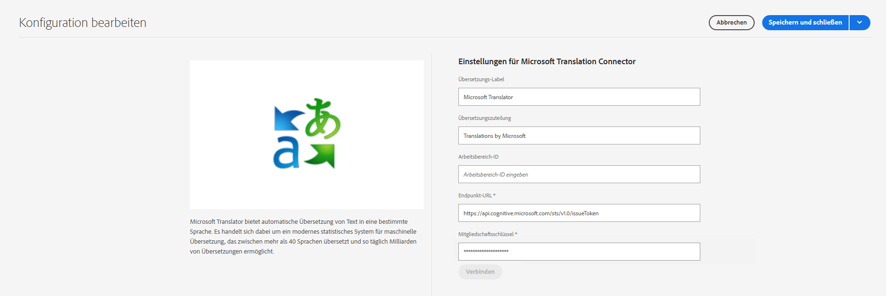

# Herstellen einer Verbindung mit Microsoft Translator {#connecting-to-microsoft-translator}

AEM bietet einen integrierten Connector für [Microsoft Translator](https://www.microsoft.com/de-de/translator/business/) zur Übersetzung von Seiteninhalten oder Assets. Nachdem Sie eine Lizenz von Microsoft für die Verwendung von Microsoft Translator erhalten haben, konfigurieren Sie den Connector entsprechend den Anweisungen auf dieser Seite.

| Eigenschaft | Beschreibung |
|---|---|
| Übersetzungsetikett | Der Anzeigename für den Übersetzungs-Service |
| Übersetzungszuteilung | (Optional) Bei nutzergenerierten Inhalten die Zuteilung, die neben übersetzten Texten angezeigt wird, beispielsweise `Translations by Microsoft` |
| Workspace-ID | (Optional) Die ID Ihrer angepassten Microsoft Translator-Engine, die verwendet werden soll |
| Mitgliedschaftsschlüssel | Ihr Mitgliedschaftsschlüssel für Microsoft Translator |

Mit dem folgenden Verfahren wird eine Microsoft Translator-Konfiguration erstellt.

1. Klicken Sie im [Navigationsbereich](/help/sites-authoring/basic-handling.md#first-steps) auf **Tools** > **Cloud-Services** > **Übersetzungs-Cloud-Services**.
1. Navigieren Sie zu dem Ort, an dem Sie die Konfiguration erstellen möchten. Normalerweise ist dies in Ihrem Site-Stammverzeichnis oder es kann eine globale Standardkonfiguration sein.
1. Klicken Sie auf die Schaltfläche **Erstellen**.
1. Legen Sie Ihre Konfiguration fest.
   1. Wählen Sie **Microsoft Translator** in der Dropdown-Liste aus.
   1. Geben Sie einen Titel für Ihre Konfiguration ein. Durch den Titel wird die Konfiguration in der Cloud Services-Konsole und in Dropdown-Listen mit den Seiteneigenschaften identifiziert.
   1. Geben Sie optional einen Namen für den Repository-Knoten ein, auf dem die Konfiguration gespeichert wird.

   

1. Klicken Sie auf **Erstellen**.
1. Geben Sie im Fenster **Konfiguration bearbeiten** die in der vorherigen Tabelle beschriebenen Werte für den Übersetzungs-Service ein.

   

1. Klicken Sie auf **Verbinden**, um die Verbindung zu überprüfen.
1. Klicken Sie auf **Speichern und schließen**.

## Veröffentlichen der Übersetzungs-Service-Konfigurationen {#publishing-the-translator-service-configurations}

Veröffentlichen Sie als letzten Schritt Ihre Microsoft Translator-Konfigurationen, um veröffentlichte übersetzte Inhalte zu unterstützen. Verwenden Sie dazu die Aktion [Veröffentlichen eines Baums](/help/sites-authoring/publishing-pages.md#publishing-and-unpublishing-a-tree).
