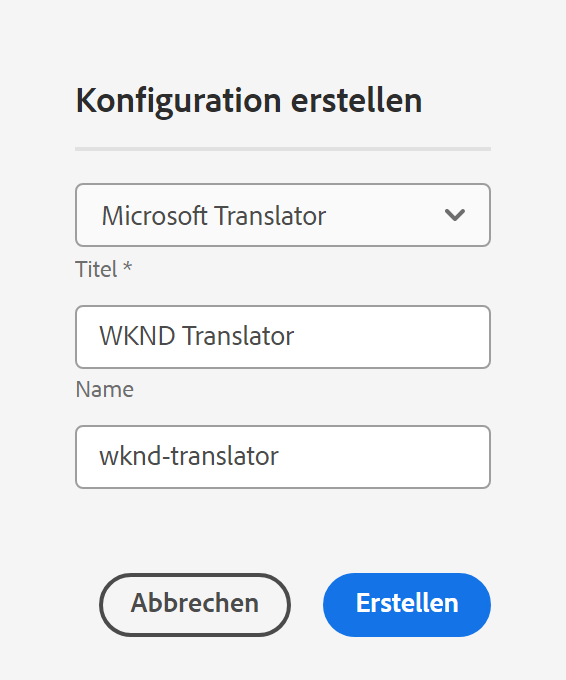
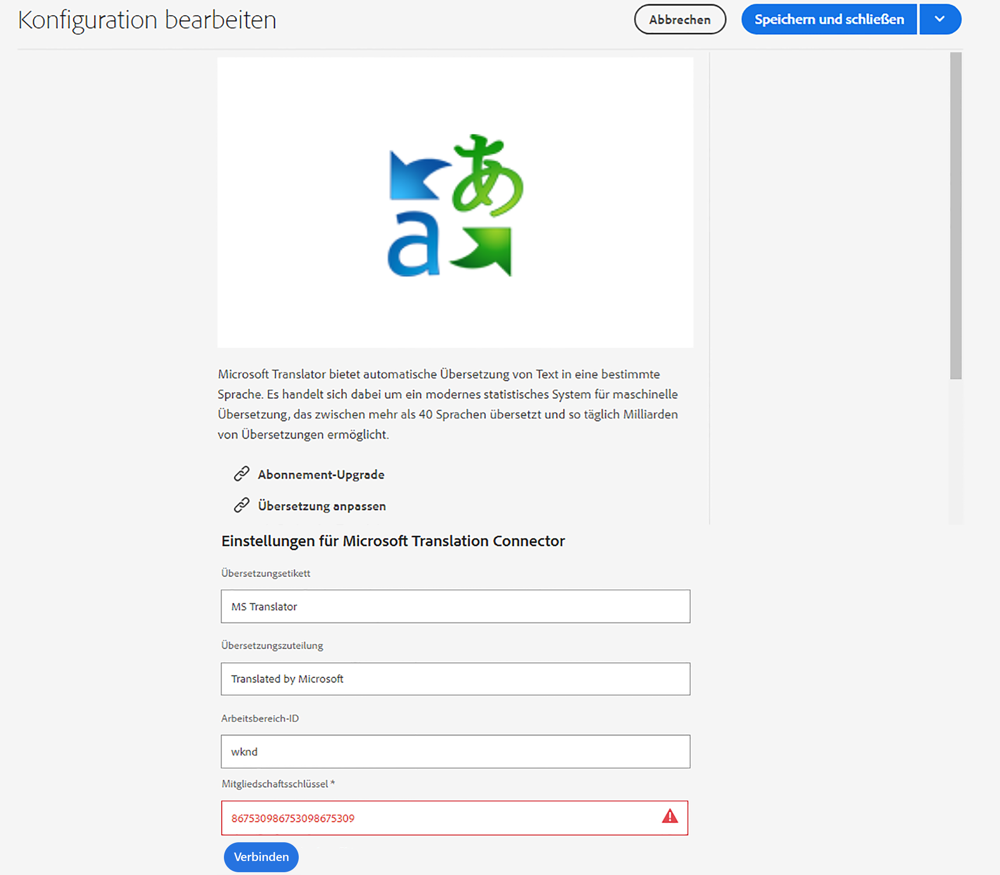

# Herstellen einer Verbindung mit Microsoft Translator {#connecting-to-microsoft-translator}

Erstellen Sie eine Konfiguration für den [Microsoft Translator](https://www.microsoft.com/de-de/translator/business/)-Cloud-Service, um Ihr Microsoft Translation-Konto zum Übersetzen von AEM-Seiteninhalten, -Community-Inhalten oder -Assets zu nutzen.

>[!NOTE]
>
>Für AEM wird ein Microsoft Translation-Testkonto verwendet, mit dem pro Monat kostenlos maximal 2.000.000 Zeichen übersetzt werden können. Informationen zum Erhalt eines Kontoabonnements, das für Produktionssysteme geeignet ist, finden Sie unter [Durchführen eines Upgrades für die Konfiguration „Microsoft Translator-Testlizenz“](#upgrading-the-microsoft-translator-trial-license-configuration).

| Eigenschaft | Beschreibung |
|---|---|
| Übersetzungsetikett | Der Anzeigename für den Übersetzungs-Service |
| Übersetzungszuteilung | (Optional) Bei nutzergenerierten Inhalten die Zuteilung, die neben übersetzten Texten angezeigt wird, beispielsweise `Translations by Microsoft` |
| Workspace-ID | (Optional) Die ID Ihrer angepassten Microsoft Translator-Engine, die verwendet werden soll |
| Mitgliedschaftsschlüssel | Ihr Mitgliedschaftsschlüssel für Microsoft Translator |

Nachdem Sie die Konfiguration erstellt haben, müssen Sie sie [aktivieren](#activating-the-translator-service-configurations).

Mit dem folgenden Verfahren wird eine Microsoft Translator-Konfiguration erstellt.

1. Klicken Sie im [Navigationsbereich](/help/sites-authoring/basic-handling.md#first-steps) auf **Tools** > **Cloud-Services** > **Übersetzungs-Cloud-Services**.
1. Navigieren Sie zu dem Ort, an dem Sie die Konfiguration erstellen möchten. Normalerweise ist dies in Ihrem Site-Stammverzeichnis oder es kann eine globale Standardkonfiguration sein.
1. Klicken Sie auf die Schaltfläche **Erstellen**.
1. Legen Sie Ihre Konfiguration fest.
   1. Wählen Sie **Microsoft Translator** in der Dropdown-Liste aus.
   1. Geben Sie einen Titel für Ihre Konfiguration ein. Durch den Titel wird die Konfiguration in der Cloud Services-Konsole und in Dropdown-Listen mit den Seiteneigenschaften identifiziert.
   1. Geben Sie optional einen Namen für den Repository-Knoten ein, auf dem die Konfiguration gespeichert wird.

   

1. Klicken Sie auf **Erstellen**.
1. Geben Sie im Fenster **Konfiguration bearbeiten** die in der vorherigen Tabelle beschriebenen Werte für den Übersetzungs-Service ein.

   

1. Klicken Sie auf **Verbinden**, um die Verbindung zu überprüfen.
1. Klicken Sie auf **Speichern und schließen**.

## Durchführen eines Upgrades für die Konfiguration „Microsoft Translator-Testlizenz“ {#upgrading-the-microsoft-translator-trial-license-configuration}

Die Seiten der Microsoft Translation-Konfiguration enthalten einen direkten Link zur Microsoft-Website, über den Sie ein für Produktionssysteme geeignetes Kontoabonnement erhalten können.

1. Klicken Sie im [Navigationsbereich](/help/sites-authoring/basic-handling.md#first-steps) auf **Tools** > **Cloud-Services** > **Übersetzungs-Cloud-Services**.
1. Klicken Sie auf Ihre vorhandene Microsoft Translator-Konfiguration.
1. Klicken Sie auf **Bearbeiten**.
1. Klicken Sie im Fenster **Konfiguration bearbeiten** auf **Abonnement-Upgrade**. Eine Microsoft-Webseite mit weiteren Details zum Service wird geöffnet.

## Anpassen der Microsoft Translator-Engine {#customizing-your-microsoft-translator-engine}

Die Seiten der Microsoft Translation-Konfiguration enthalten einen direkten Link zur Microsoft-Website, auf der die Microsoft Translator-Engine angepasst werden kann.

1. Klicken Sie im [Navigationsbereich](/help/sites-authoring/basic-handling.md#first-steps) auf **Tools** > **Cloud-Services** > **Übersetzungs-Cloud-Services**.
1. Klicken Sie auf Ihre vorhandene Microsoft Translator-Konfiguration.
1. Klicken Sie auf **Bearbeiten**.
1. Klicken Sie im Fenster **Konfiguration bearbeiten** auf **Übersetzung anpassen**. Verwenden Sie die Microsoft-Webseite, die geöffnet wird, um Ihren Service anzupassen.

## Aktivieren der Übersetzungs-Service-Konfigurationen {#activating-the-translator-service-configurations}

Sie müssen Ihre Cloud Service-Konfigurationen aktivieren, um übersetzte Inhalte zu unterstützen, die auf der Veröffentlichungsinstanz repliziert werden. Verwenden Sie die Methode [Veröffentlichen eines Baums](/help/sites-authoring/publishing-pages.md#publishing-and-unpublishing-a-tree), um die Repository-Knoten zu aktivieren, die die Microsoft Translator-Konfigurationen speichern. Die Knoten befinden sich unter den folgenden übergeordneten Knoten:

* `/libs/settings/cloudconfigs/translation/msft-translation`
