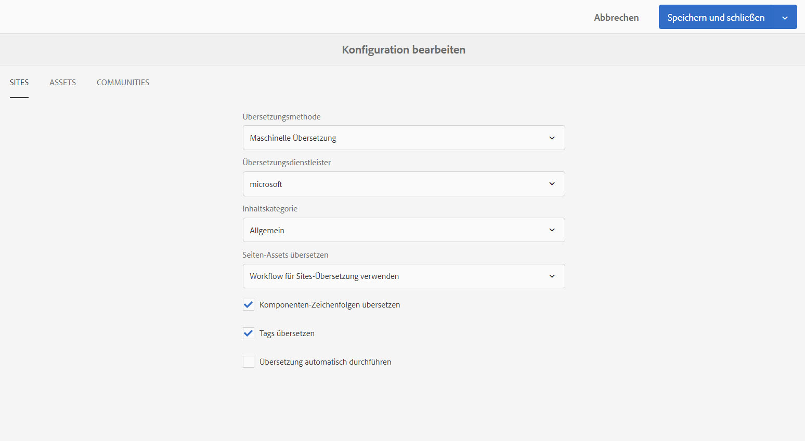

# Konfigurieren des Frameworks für die Übersetzungsintegration{#configuring-the-translation-integration-framework}

Das Framework für die Übersetzungsintegration integriert Übersetzungsdienstleistungen von Drittanbietern, um die Übersetzung von AEM-Inhalten zu orchestrieren.

* Verbinden Sie sich mit Ihrem Übersetzungsdienstleister.
* Erstellen Sie eine Framework-Konfiguration für die Übersetzungsintegration.
* Verknüpfen Sie die Cloud-Konfigurationen mit Ihren Seiten.

Einen Überblick über die Funktionen zur Übersetzung von Inhalten in AEM erhalten Sie unter [Übersetzen von Inhalten für mehrsprachige Sites](/help/sites-administering/translation.md).

## Herstellen einer Verbindung zu einem Übersetzungsdienstleister {#connecting-to-a-translation-service-provider}

Erstellen Sie eine Cloud-Konfiguration, die AEM an Ihren Übersetzungsdienstleister anbindet. AEM enthält die Funktion, standardmäßig eine Verbindung zu Microsoft Translator herzustellen.
Die folgenden Übersetzungsdienstleister bieten eine Implementierung der neuen API für Übersetzungsprojekte. Links für weitere Informationen zur Integration:

* [Translations.com](https://exchange.adobe.com/experiencecloud.details.90104.globallink-connect-plus-for-aem.html) (Adobe Exchange Premier Partner)
* [Clay Tablet Technologies](https://exchange.adobe.com/experiencecloud.details.90064.clay-tablet-translation-for-experience-manager.html)
* [Lionbridge](https://exchange.adobe.com/experiencecloud.details.100064.lionbridge-connector-for-experience-manager-63.html)
* [Memsource](https://exchange.adobe.com/experiencecloud.details.103166.memsource-connector-for-adobe-experience-manager.html)
* [Cloudwords](https://exchange.adobe.com/experiencecloud.details.90019.html)
* [XTM Cloud](https://exchange.adobe.com/experiencecloud.details.105037.xtm-connect-for-adobe-experience-manager.html)
* [Lingotek](https://exchange.adobe.com/experiencecloud.details.90088.lingotek-collaborative-translation-platform.html)
* [RWS](https://partners.adobe.com/exchangeprogram/experiencecloud/exchange.details.108277.html)
* [Smartling](https://exchange.adobe.com/experiencecloud.details.90101.smartling-connector-for-adobe-experience-manager.html)
* [Systran](https://exchange.adobe.com/experiencecloud.details.90233.systran-for-adobe-experience-manager.html)
* [Altlang](https://exchange.adobe.com/experiencecloud.details.90222.altlang.html)
* Microsoft (Microsoft Translator ist in AEM vorinstalliert)

>[!NOTE]
>
>Eine aktuelle Liste der Anbieter von menschlichen und maschinellen Übersetzungen finden Sie auf den folgenden Seiten:
>
>
>* [AEM – Übersetzung durch Menschen](https://www.adobe.com/go/aem-human-translation-connectors)
>* [AEM – maschinelle Übersetzung](https://www.adobe.com/go/aem-machine-translation-connectors)
>

Wenn Sie ein Connector-Paket installiert haben, können Sie eine Cloud-Konfiguration für den Connector erstellen. In der Regel müssen Sie Ihre Anmeldedaten für die Authentifizierung beim Übersetzungs-Service angeben. Weitere Informationen zum Hinzufügen einer Cloud-Konfiguration für den Microsoft Translator-Connector finden Sie unter [Integrieren mit Microsoft Translator](/help/sites-administering/tc-msconf.md).

Sie können mehrere Cloud-Konfigurationen für denselben Connector erstellen, falls erforderlich. Beispielsweise können Sie eine Konfiguration für jedes Konto oder Projekt erstellen, das Sie bei einem Anbieter haben.

Nach der Konfiguration einer Verbindung können Sie die Framework-Konfiguration für die Übersetzungsintegration erstellen, von der diese Verbindung genutzt wird.

## Erstellen einer Konfiguration für die Übersetzungsintegration {#creating-a-translation-integration-configuration}

Erstellen Sie eine Framework-Konfiguration für die Übersetzungsintegration, um festzulegen, wie Ihre Inhalte übersetzt werden sollen. Die Konfiguration enthält die folgenden Informationen:

* welcher Übersetzungsanbieter eingesetzt werden soll.
* ob eine menschliche oder maschinelle Übersetzung erfolgen soll.
* ob andere Inhalte, die mit einer Seite oder einem Asset verknüpft sind, z. B. Tags, übersetzt werden sollen.

Nachdem Sie eine Framework-Konfiguration erstellt haben, verknüpfen Sie die Cloud-Konfiguration mit den Seiten, die Sie gemäß der Konfiguration übersetzen möchten. Wenn der Übersetzungsvorgang gestartet wird, geht der Übersetzungsworkflow entsprechend der verknüpften Framework-Konfiguration vor.

Wenn für verschiedene Bereiche Ihrer Website unterschiedliche Übersetzungsanforderungen vorliegen, erstellen Sie entsprechend mehrere Framework-Konfigurationen. Beispielsweise enthält eine mehrsprachige Website deutsche, englische und japanische Sprachkopien. Der Website-Eigentümer nutzt zwei verschiedene Übersetzungsdienstleister für die englische und die deutsche Übersetzung. Daher werden zwei verschiedene Konfigurationen des Frameworks erstellt. Jede Konfiguration nutzt einen anderen Übersetzungsdienstleister.

Nachdem Sie ein Framework für die Übersetzungsintegration erstellt haben, können Sie es [mit den Seiten verknüpfen](/help/sites-administering/tc-prep.md), die es verwenden.

**Hinweis:** Einen Überblick über die AEM-Funktionen zur Inhaltsübersetzung finden Sie unter [Übersetzen von Inhalten für mehrsprachige Sites](/help/sites-administering/translation.md).

Eine einzelne Framework-Konfiguration steuert, wie Seiten- und Community-Inhalte und Assets übersetzt werden.

### Website-Konfigurationseigenschaften {#sites-configuration-properties}

Die Website-Eigenschaften steuern, wie die Übersetzung von Seiteninhalten durchgeführt wird.

<table>
 <tbody>
  <tr>
   <th>Eigenschaft</th>
   <th>Beschreibung</th>
  </tr>
  <tr>
   <td>Übersetzungs-Workflow</td>
   <td>
Wählen Sie die Übersetzungsmethode aus, die das Framework für den Site-Inhalt durchführt:

    <ul>
     <li>Maschinelle Übersetzung: Der Übersetzungsanbieter führt die Übersetzung mithilfe der maschinellen Übersetzung in Echtzeit durch.</li>
     <li>Menschliche Übersetzung: Der Übersetzungsdienstleister bekommt die Inhalte zugesendet und lässt sie durch Übersetzer übersetzen. </li>
     <li>Nicht übersetzen: Inhalte werden nicht zur Übersetzung versendet. Damit können Sie bestimmte Inhaltszweige überspringen, die nicht übersetzt, aber mit den neuesten Inhalten aktualisiert werden sollen.</li>
    </ul> </td>
  </tr>
  <tr>
   <td>Übersetzungsanbieter</td>
   <td>Wählen Sie den Übersetzungsanbieter aus, um die Übersetzung durchzuführen. Ein Anbieter wird in der Liste angezeigt, wenn sein entsprechender Connector installiert ist.</td>
  </tr>
  <tr>
   <td>Inhaltskategorie</td>
   <td>(Nur maschinelle Übersetzung) Eine Kategorie, die den zu übersetzenden Inhalt beschreibt. Die Kategorie kann beeinflussen, welche Terminologie und welche Formulierungen bei der Übersetzung von Inhalten verwendet werden.</td>
  </tr>
  <tr>
   <td>Tags übersetzen</td>
   <td>Wählen Sie diese Option aus, um Tags zu übersetzen, die mit der Seite verknüpft sind.</td>
  </tr>
  <tr>
   <td>Seiten-Assets übersetzen</td>
   <td>
Wählen Sie aus, wie Assets übersetzt werden sollen, die Komponenten aus dem Dateisystem hinzugefügt oder aus Assets referenziert werden:

    <ul>
     <li>Nicht übersetzen: Seiten-Assets werden nicht übersetzt.</li>
     <li>Workflow für Sites-Übersetzung verwenden: Assets werden entsprechend der Konfigurationseigenschaften auf der Registerkarte „Sites“ bearbeitet.</li>
     <li>Workflow für Asset-Übersetzung verwenden: Assets werden entsprechend der Konfigurationseigenschaften auf der Registerkarte „Assets“ bearbeitet.</li>
    </ul> </td>
  </tr>
  <tr>
   <td>Übersetzung automatisch durchführen</td>
   <td>Wählen Sie diese Option, um Übersetzungsaufträge nach der Erstellung von Übersetzungsprojekten automatisch auszuführen. Bei dieser Option haben Sie keine Möglichkeit, den Übersetzungsauftrag zu prüfen und seinen Umfang zu ermitteln.</td>
  </tr>
 </tbody>
</table>

### Communities-Konfigurationseigenschaften {#communities-configuration-properties}

Die Communities-Eigenschaften steuern, wie die Übersetzung von benutzergenerierten Inhalten durchgeführt wird. Für die Übersetzung von benutzergenerierten Inhalten wird immer maschinelle Übersetzung genutzt. Weitere Informationen finden Sie unter [Übersetzen benutzergenerierter Inhalte](/help/communities/translate-ugc.md)

| Eigenschaft | Beschreibung |
|---|---|
| Übersetzungsanbieter | Wählen Sie den Übersetzungsanbieter aus, um die Übersetzung durchzuführen. Die Anbieter, für die Cloudkonfigurationen erstellt wurden, werden in der Liste angezeigt. |
| Inhaltskategorie | Eine Kategorie, die den zu übersetzenden Inhalt beschreibt. Die Kategorie kann beeinflussen, welche Terminologie und welche Formulierungen bei der Übersetzung von Inhalten verwendet werden. |
| Auswählen eines Gebietsschemas zur Verwendung als globaler Freigabespeicher | (Optional) Wenn Sie ein Gebietsschema zum Speichern von benutzergenerierten Inhalten auswählen, werden Beiträge aus allen Sprachkopien in einer globalen Konversation angezeigt. Standardmäßig wählen Sie das Gebietsschema für die [Basissprache](/help/communities/sites-console.md#translation) für die Website. Wenn Sie Kein gemeinsamer Speicher auswählen, wird die globale Übersetzung deaktiviert. Standardmäßig ist die globale Übersetzung deaktiviert. |

### Assets-Konfigurationseigenschaften {#assets-configuration-properties}

Asset-Eigenschaften steuern, wie Assets konfiguriert werden. Weitere Informationen zur Übersetzung von Assets finden Sie unter [Erstellen von Sprachkopien für Assets](/help/assets/translation-projects.md).

<table>
 <tbody>
  <tr>
   <th>Eigenschaft</th>
   <th>Beschreibung</th>
  </tr>
  <tr>
   <td>Übersetzungs-Workflow</td>
   <td>
Wählen Sie den Übersetzungstyp aus, den das Framework für Assets durchführt:

    <ul>
     <li>Maschinelle Übersetzung: Der Übersetzungsanbieter führt die Übersetzung mithilfe der maschinellen Übersetzung sofort durch.</li>
     <li>Menschliche Übersetzung: Der Übersetzungsdienstleister bekommt die Inhalte automatisch zugesendet und lässt sie durch Übersetzer übersetzen. </li>
     <li>Nicht übersetzen: Assets werden nicht zur Übersetzung gesendet.</li>
    </ul> </td>
  </tr>
  <tr>
   <td>Übersetzungsanbieter</td>
   <td>Wählen Sie den Übersetzungsanbieter aus, um die Übersetzung durchzuführen. Ein Anbieter wird in der Liste angezeigt, wenn sein entsprechender Connector installiert ist.</td>
  </tr>
  <tr>
   <td>Inhaltskategorie</td>
   <td>(Nur maschinelle Übersetzung) Eine Kategorie, die den zu übersetzenden Inhalt beschreibt. Die Kategorie kann beeinflussen, welche Terminologie und welche Formulierungen bei der Übersetzung von Inhalten verwendet werden.</td>
  </tr>
  <tr>
   <td>Assets übersetzen</td>
   <td>Wählen Sie diese Option aus, um Assets in das Übersetzungsprojekt aufzunehmen. </td>
  </tr>
  <tr>
   <td>Metadaten übersetzen</td>
   <td>Wählen Sie aus, um Asset-Metadaten zu übersetzen.</td>
  </tr>
  <tr>
   <td>Tags übersetzen</td>
   <td>Wählen Sie diese Option aus, um Tags zu übersetzen, die mit dem Asset verknüpft sind.</td>
  </tr>
  <tr>
   <td>Übersetzung automatisch durchführen</td>
   <td>Wählen Sie diese Option, um Übersetzungsaufträge nach der Erstellung von Übersetzungsprojekten automatisch auszuführen. Bei dieser Option haben Sie keine Möglichkeit, den Übersetzungsauftrag zu prüfen oder seinen Umfang zu ermitteln.</td>
  </tr>
 </tbody>
</table>

1. Klicken oder tippen Sie in der Seitenleiste auf „Tools“ > „Vorgänge“ > „Cloud“ > „Cloud-Services“.
1. Welche Links im Übersetzungsintegrations-Bereich angezeigt werden, hängt davon ab, ob Konfigurationen erstellt wurden:

   * Wenn keine Konfigurationen erstellt wurden, klicken oder tippen Sie auf „Jetzt konfigurieren“.
   * Wenn bereits Konfigurationen vorhanden sind, klicken oder tippen Sie auf „Konfigurationen anzeigen“ und anschließend auf den Link mit dem Pluszeichen (+), der neben „Verfügbare Konfigurationen“ angezeigt wird.

1. Geben Sie einen Namen für die Konfiguration an und klicken oder tippen Sie anschließend auf „Erstellen“.
1. Konfigurieren Sie die Eigenschaften auf den Registerkarten „Sites“, „Communities“ und „Assets“ und klicken oder tippen Sie anschließend auf „OK“.

## Konfigurieren von Seiten für Übersetzungen {#configuring-pages-for-translation}

Um die Übersetzung Ihrer Quellseiten in andere Sprachen zu konfigurieren, verknüpfen Sie die Seiten mit den folgenden Cloud-Konfigurationen:

* mit der Cloud-Konfiguration, die AEM an Ihren Übersetzungsdienstleister anbindet
* mit dem Framework für die Übersetzungsintegration, das die Details der Übersetzung konfiguriert

Beachten Sie, dass die Cloud-Konfiguration des Frameworks für die Übersetzungsintegration festlegt, mit welcher Cloud-Konfiguration die Verbindung mit dem Dienstleister hergestellt wird. Wenn Sie eine Quellseite mit der Cloud-Konfiguration eines Frameworks verknüpfen, muss die Seite mit der Cloud-Konfiguration des Dienstleisters verknüpft sein, die die Cloud-Konfiguration des Frameworks nutzt.

Wenn Sie eine Seite mit einer Cloud-Konfiguration verknüpfen, erben die untergeordneten Elemente der Seite diese Verknüpfung. Wenn Sie beispielsweise die Seite /content/geometrixx/en/products mit einem Übersetzungsintegrations-Framework verknüpfen, werden die Seite Produkte und alle darunter liegenden Seiten gemäß dem Framework übersetzt.

Bei Bedarf können Sie die Verknüpfung auf einer untergeordneten Seite überschreiben. Beispiel: Die Inhalte einer Website drehen sich größtenteils um das Thema Bekleidung. Ein Zweig an Seiten beschreibt dagegen das Unternehmen. Die Stammseite der Website ist mit einem Framework für die Übersetzungsintegration verknüpft, das vorgibt, dass maschinelle Übersetzung mit der Kategorie „Bekleidung“ angewendet werden soll. Der Zweig, der das Unternehmen beschreibt, nutzt dagegen ein Framework, bei dem maschinelle Übersetzung mit der Kategorie „Allgemein“ angewendet wird.

Für alle Gemeinden [SCF-Komponenten](/help/communities/scf.md) Auf den Seiten bietet der benutzergenerierte Inhalt (UGC) Benutzern die Möglichkeit, Inhalte zu übersetzen. Weitere Informationen finden Sie unter [Übersetzung benutzergenerierter Inhalte](/help/communities/translate-ugc.md).

### Verknüpfen einer Seite mit einem Übersetzungsdienstleister {#associating-a-page-with-a-translation-provider}

Verknüpfen Sie eine Seite mit Ihrem Übersetzungsdienstleister, um die Seite und ihre untergeordneten Seiten zu übersetzen.

1. Wählen Sie in der Sites-Konsole die zu konfigurierende Seite aus und klicken oder tippen Sie auf „Eigenschaften anzeigen“.
1. Klicken oder tippen Sie auf „Bearbeiten“ und anschließend auf die Registerkarte „Cloud-Services“.
1. Klicken oder tippen Sie auf „Konfiguration hinzufügen“ > „Übersetzungsintegration“.
1. Wählen Sie den gewünschten Übersetzungsdienstleister aus und klicken oder tippen Sie auf „Fertig“.

### Verknüpfen von Seiten mit einem Framework für die Übersetzungsintegration {#associating-pages-with-a-translation-integration-framework}

Verknüpfen Sie eine Seite mit dem Framework für die Übersetzungsintegration, das festlegt, wie die Übersetzung der Seite und der untergeordneten Seiten durchgeführt werden soll.

1. Wählen Sie in der Sites-Konsole die zu konfigurierende Seite aus und klicken oder tippen Sie auf „Eigenschaften anzeigen“.
1. Klicken oder tippen Sie auf „Bearbeiten“ und anschließend auf die Registerkarte „Cloud-Services“.
1. Klicken oder tippen Sie auf „Konfiguration hinzufügen“ > „Übersetzungsintegration“.
1. Wählen Sie das gewünschte Framework für die Übersetzungsintegration aus und klicken oder tippen Sie auf „Fertig“.
