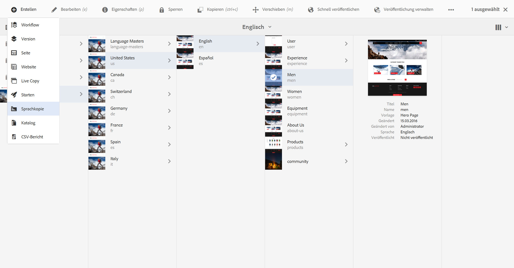

# Assistent „Sprachkopie erstellen“{#language-copy-wizard}

Der Sprachkopie-Assistent ist ein geführtes Erlebnis zum Erstellen und Verwenden einer mehrsprachigen Inhaltsstruktur. Es ist jetzt viel einfacher und schneller, eine Sprachkopie zu erstellen.

>[!NOTE]
>
>Anwendende müssen Mitglieder der Gruppe „Projekt-Admins“ sein, um eine Sprachkopie einer Seite zu erstellen.

So greifen Sie auf diesen Assistenten zu:

1. Wählen Sie in Sites eine Seite aus und tippen/klicken Sie auf Erstellen .

   

1. Wählen Sie eine Sprachkopie aus und der Assistent wird geöffnet.

   

1. Die **Quelle auswählen** im Schritt des Assistenten können Sie Seiten hinzufügen/entfernen. Sie haben außerdem die Option, die Unterseiten ein- oder auszuschließen.

   

1. Über die Schaltfläche **Weiter** gelangen Sie zum Schritt **Konfigurieren** des Assistenten. Hier können Sie Sprachen hinzufügen/entfernen und die Übersetzungsmethode auswählen.

   

   >[!NOTE]
   >
   >Standardmäßig gibt es nur eine Übersetzungs-Einstellung. Um die Auswahl anderer Einstellungen zu ermöglichen, müssen Sie zuerst die Cloud-Einstellungen konfigurieren. Siehe [Konfigurieren des Übersetzungsintegrations-Frameworks](/help/sites-administering/tc-tic.md).

1. Über die Schaltfläche **Weiter** gelangen Sie zum Schritt **Übersetzen** des Assistenten. Hier können Sie zwischen der Erstellung der Struktur, der Erstellung eines neuen Übersetzungsprojekts oder dem Hinzufügen zu einem vorhandenen Übersetzungsprojekt wählen.

   >[!NOTE]
   >
   >Wenn Sie im vorherigen Schritt mehrere Sprachen ausgewählt haben, werden mehrere Übersetzungsprojekte erstellt.

   

1. Mit der Schaltfläche **Erstellen** wird der Assistent beendet.

   
