# Prinzipalansicht für die Berechtigungsverwaltung{#principal-view-for-permissions-management}

## Überblick {#overview}

AEM 6.5 führt die Berechtigungsverwaltung für Benutzer und Gruppen ein. Die Hauptfunktionalität bleibt mit der klassischen Benutzeroberfläche identisch, ist jedoch benutzerfreundlicher und effizienter.

## Verwendung {#how-to-use}

### Zugriff auf die Benutzeroberfläche {#accessing-the-ui}

Die Berechtigungsverwaltung, die auf der neuen Benutzeroberfläche basiert, wird wie unten dargestellt unter „Sicherheit“ auf der Karte für Berechtigungen aufgerufen:

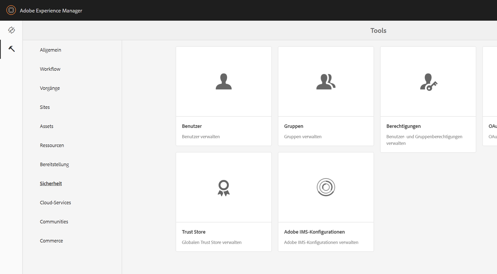

Die neue Ansicht erleichtert die Übersicht über die gesamten Berechtigungen und Einschränkungen für einen bestimmten Prinzipal in allen Pfaden, in denen die Berechtigungen explizit gewährt wurden. Dadurch müssen Sie nicht mehr zu

CRXDE wechseln, um erweiterte Berechtigungen und Einschränkungen zu verwalten. Diese wurden in derselben Ansicht konsolidiert. Standardmäßig wird die Gruppe „alle“ angezeigt.

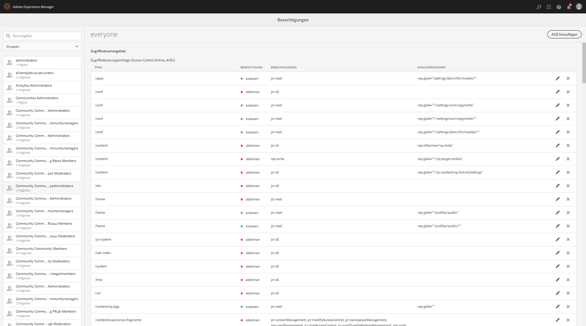

Es gibt einen Filter, mit dem der Benutzer die Art der Prinzipale auswählen kann, um **Benutzer**, **Gruppen** oder **Alle** anzuzeigen und zu suchen **.**

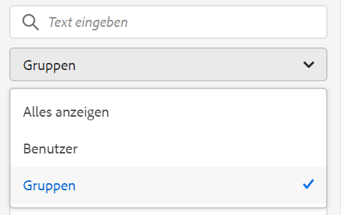

### Anzeigen von Berechtigungen für einen Prinzipal  {#viewing-permissions-for-a-principal}

Im Bereich auf der linken Seite können Benutzer nach unten blättern, um einen Prinzipal zu finden oder über den ausgewählten Filter nach einer Gruppe oder einem Benutzer zu suchen:

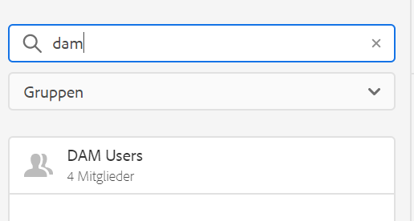

Wenn Sie auf den Namen klicken, werden die zugewiesenen Berechtigungen auf der rechten Seite angezeigt. Der Berechtigungsbereich zeigt die Liste der Zugriffssteuerungseinträge für bestimmte Pfade sowie konfigurierte Einschränkungen an.

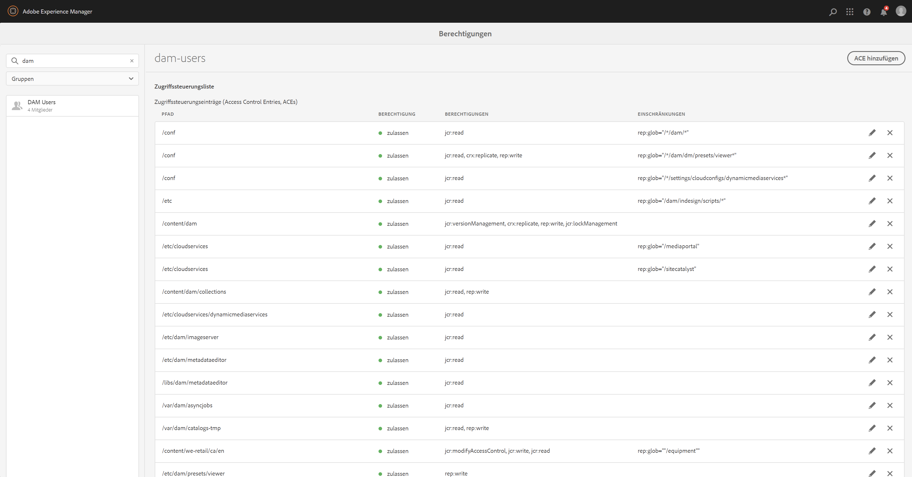

### Hinzufügen neuer Zugriffssteuerungseinträge für einen Prinzipal  {#adding-new-access-control-entry-for-a-principal}

Sie können neue Berechtigungen hinzufügen, indem Sie mit einem Klick auf die Schaltfläche „ACE hinzufügen“ einen neuen Zugriffssteuerungseintrag hinzufügen.

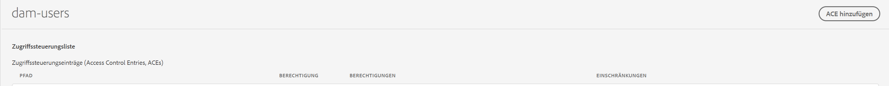

Dadurch wird das unten dargestellte Fenster angezeigt. Der nächste Schritt besteht in der Auswahl eines Pfades, in dem die Berechtigung konfiguriert werden muss.

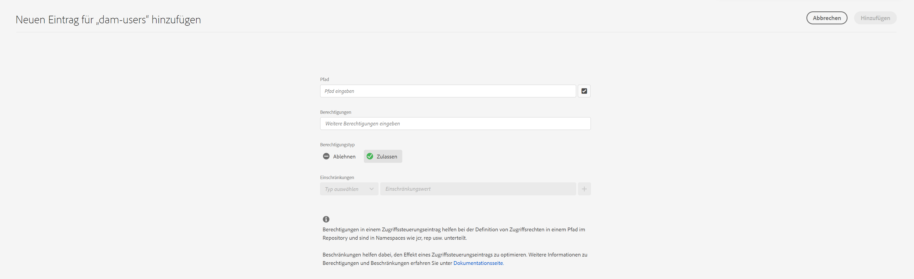

Hier wählen wir einen Pfad aus, in dem wir eine Berechtigung für **dam-users** konfigurieren möchten:

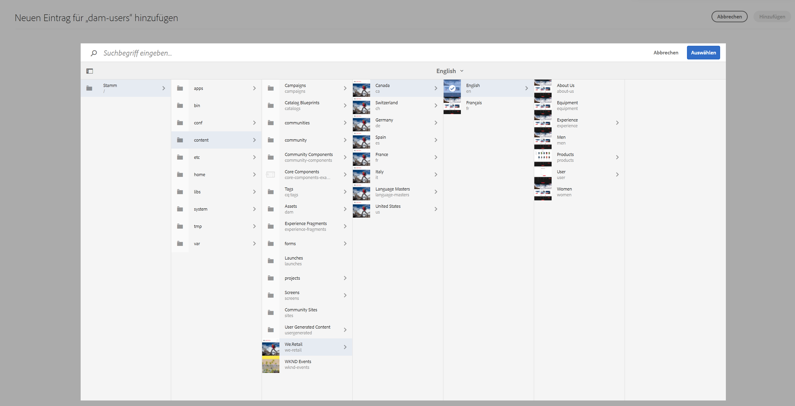

Nachdem der Pfad ausgewählt wurde, kehrt der Workflow zu diesem Bildschirm zurück, wo der Benutzer eine oder mehrere der Berechtigungen aus den verfügbaren Namespaces auswählen kann (z. B. `jcr`, `rep` oder `crx`), wie unten dargestellt.

Berechtigungen können hinzugefügt werden, indem Sie mit dem Textfeld suchen und dann aus der Liste auswählen.

>[!NOTE]
>
>Eine vollständige Liste der Berechtigungen und Beschreibungen finden Sie [auf dieser Seite](/help/sites-administering/user-group-ac-admin.md#access-right-management).

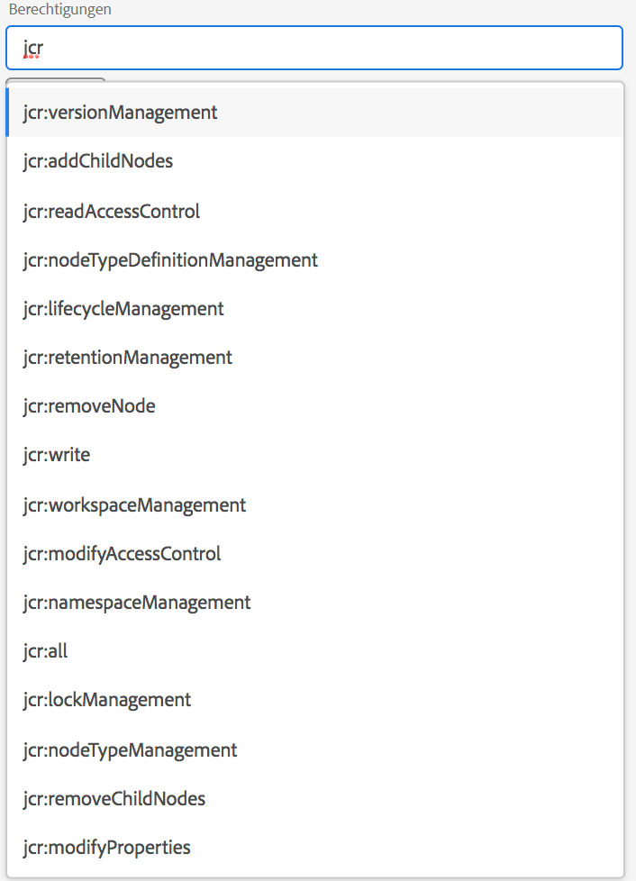 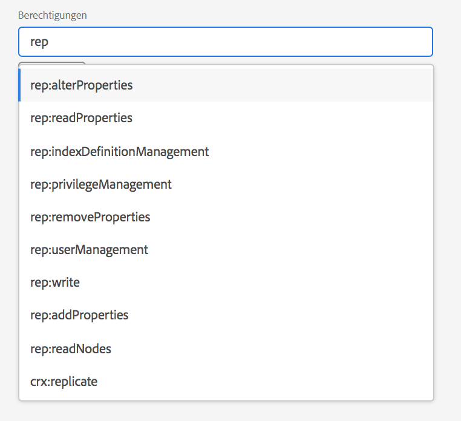

Nachdem die Liste der Berechtigungen ausgewählt wurde, kann der Benutzer den Berechtigungstyp auswählen: „Ablehnen“ oder „Zulassen“, wie unten dargestellt.

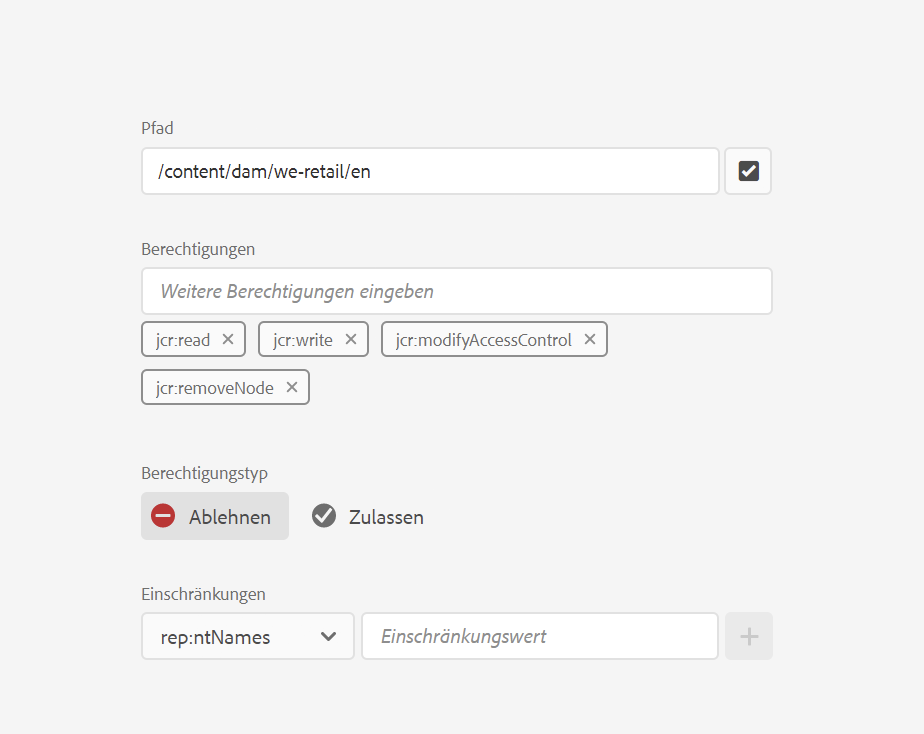 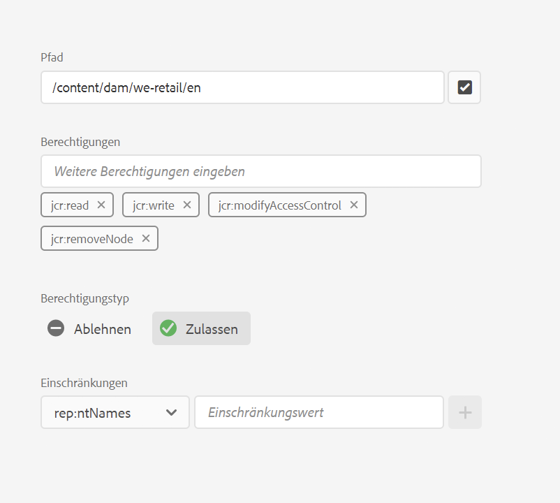

### Verwendung von Einschränkungen  {#using-restrictions}

Zusätzlich zur Liste der Berechtigungen und dem Berechtigungstyp für einen bestimmten Pfad können auf diesem Bildschirm auch Einschränkungen für fein abgestufte Zugriffssteuerungsmöglichkeiten hinzugefügt werden:

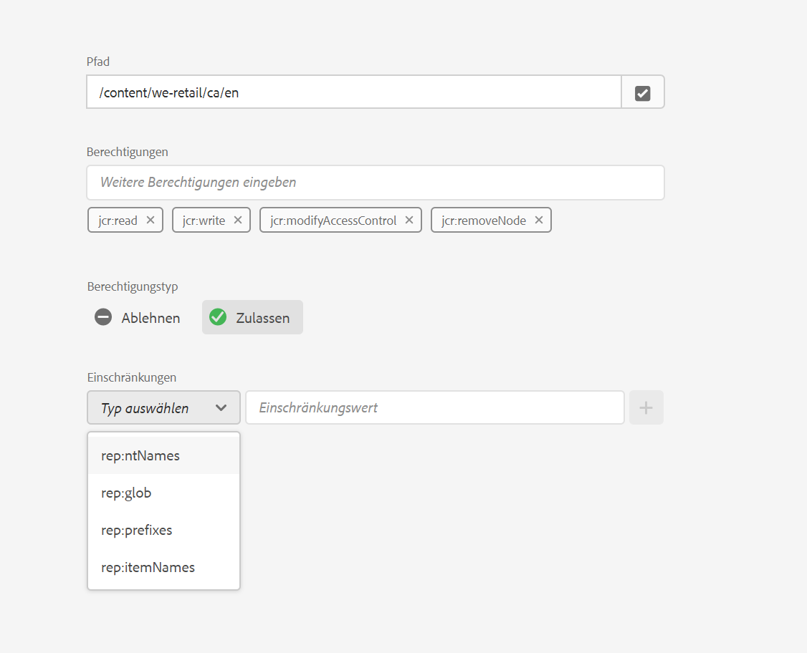

>[!NOTE]
>
>Weitere Informationen zu den einzelnen Einschränkungen finden Sie [auf dieser Seite](/help/sites-administering/user-group-ac-admin.md#restrictions).

Einschränkungen können wie unten dargestellt hinzugefügt werden, indem Sie den Einschränkungstyp auswählen, den Wert eingeben und auf das **Pluszeichen** klicken. 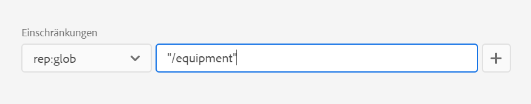 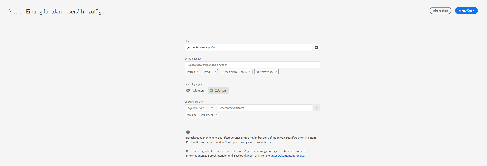

Der neue ACE wird wie unten dargestellt in der Zugriffsteuerungsliste angezeigt. Beachten Sie, dass `jcr:write` eine aggregierte Berechtigung ist, die `jcr:removeNode` enthält, die oben hinzugefügt wurde, aber unten nicht angezeigt wird, da sie unter `jcr:write` erfasst wird.

### Bearbeiten von ACEs {#editing-aces}

Zugriffssteuerungseinträge können bearbeitet werden, indem Sie einen Prinzipal auswählen und den zu bearbeitenden ACE auswählen.

Hier können wir beispielsweise den unten stehenden Eintrag für **dam-users** bearbeiten, indem wir auf das Stiftsymbol rechts klicken:

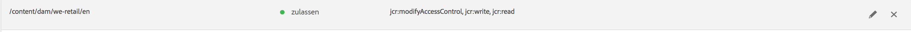

Der Bearbeitungsbildschirm wird mit vorausgewählten konfigurierten ACEs-Voreinstellungen angezeigt. Diese können gelöscht werden, indem Sie auf das Kreuzsymbol neben ihnen klicken. Sie können auch neue Berechtigungen für den angegebenen Pfad hinzufügen, wie unten dargestellt.

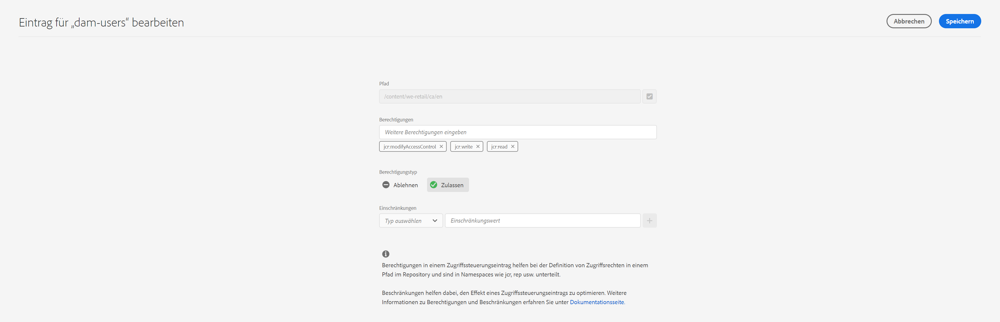

Hier fügen wir die Berechtigung `addChildNodes` für **dam-users** im angegebenen Pfad hinzu.

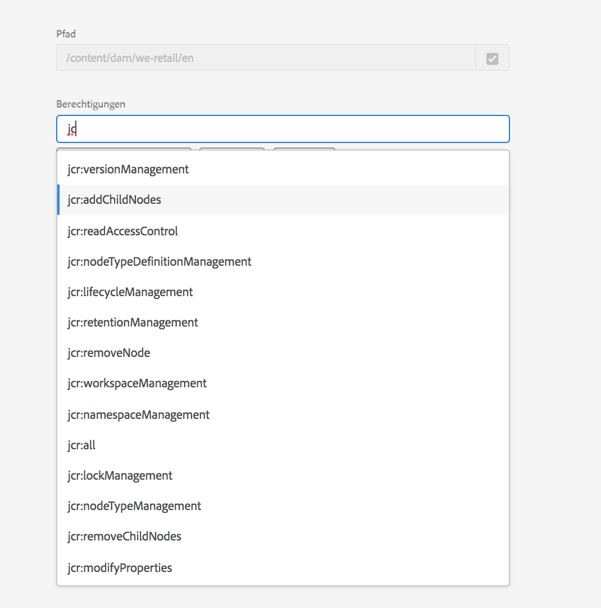

Änderungen können gespeichert werden, indem Sie oben rechts auf die Schaltfläche **Speichern** klicken. Die Änderungen werden in den neuen Berechtigungen für **dam-users** übernommen, wie unten dargestellt:

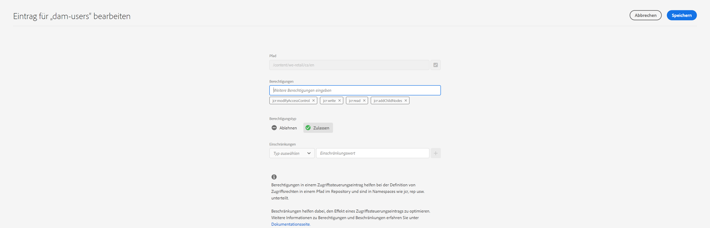

### Löschen von ACEs {#deleting-aces}

Zugriffssteuerungseinträge können gelöscht werden, um alle Berechtigungen für einen Prinzipal in einem bestimmten Pfad zu entfernen. Mit dem X-Symbol neben dem ACE kann der Zugriffssteuerungseintrag wie dargestellt gelöscht werden:

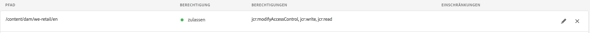 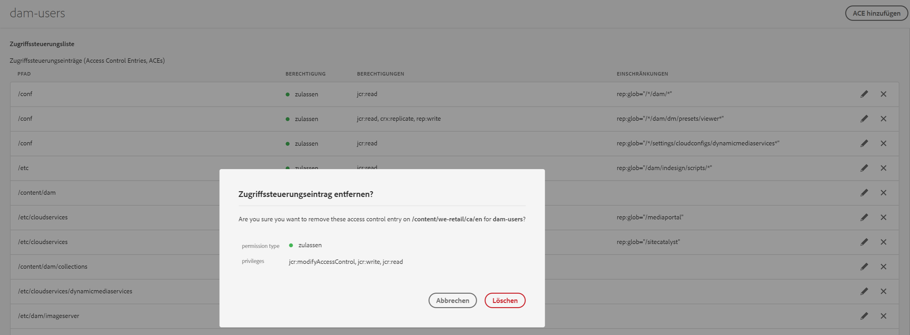

### Berechtigungskombinationen der klassischen Benutzeroberfläche  {#classic-ui-privilege-combinations}

Beachten Sie, dass die neue Benutzeroberfläche für Berechtigungen explizit den grundlegenden Satz von Berechtigungen anstelle vordefinierter Kombinationen verwendet, die nicht immer exakt die gewährten Berechtigungen wiedergegeben haben.

Das führte zu Unklarheit, was genau konfiguriert wird. In der folgenden Tabelle ist die Zuordnung zwischen den Berechtigungen aus der klassischen Benutzeroberfläche zu den tatsächlichen Berechtigungen aufgeführt, die sie darstellen:

<table>
 <tbody>
  <tr>
   <th>Berechtigungskombinationen der klassischen Benutzeroberfläche</th>
   <th>Berechtigungen der Benutzeroberfläche für Berechtigungen</th>
  </tr>
  <tr>
   <td>Lesen</td>
   <td><code>jcr:read</code></td>
  </tr>
  <tr>
   <td>Ändern</td>
   <td>
<code>jcr:modifyProperties</code>
 
<code>jcr:lockManagement</code>
 
<code>jcr:versionManagement</code>
 </td>
  </tr>
  <tr>
   <td>Erstellen</td>
   <td>
<code>jcr:addChildNodes</code>
 
<code>jcr:nodeTypeManagement</code>
 </td>
  </tr>
  <tr>
   <td>Löschen</td>
   <td>
<code>jcr:removeNode</code>
 
<code>jcr:removeChildNodes</code>
 </td>
  </tr>
  <tr>
   <td>ACL lesen</td>
   <td><code>jcr:readAccessControl</code></td>
  </tr>
  <tr>
   <td>ACL bearbeiten</td>
   <td><code>jcr:modifyAccessControl</code></td>
  </tr>
  <tr>
   <td>Replizieren</td>
   <td><code>crx:replicate</code></td>
  </tr>
 </tbody>
</table>
