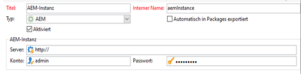

# Fehlerbehebung bei der Adobe Campaign-Integration{#troubleshooting-your-adobe-campaign-integration}

>[!NOTE]
>
>Diese Seite gilt für Campaign Classic.

Die folgenden Problembehebungstipps helfen bei der Lösung der gängigsten Probleme, die bei der Integration von AEM mit Adobe Campaign auftreten können:

## Allgemeine Tipps zur Problembehebung {#general-troubleshooting-tips}

Bezüglich beider Integrationen können Sie überprüfen, ob HTTP-Aufrufe versendet werden (AEM > Adobe Campaign, Adobe Campaign > AEM):

* Wenn Integrationen fehlschlagen, müssen Sie überprüfen, ob diese Aufrufe am anderen Ende eingehen (um Firewall-/SSL-Probleme auszuschließen).
* Für AEM-Funktionen werden JSON-Aufrufe von der AEM-Autorenschnittstelle angefordert. Diese sollten keinen HTTP-500-Fehler verursachen. Wenn HTTP-500-Fehler auftreten, überprüfen Sie die Datei `error.log`, um weitere Informationen zu erhalten.
* Das Erhöhen der Debugging-Stufe für „campaign-classes“ in AEM hilft ebenfalls bei der Problembehebung.

## Falls die Verbindung fehlschlägt {#if-the-connection-fails}

Überprüfen Sie, ob Sie den Operator **aemserver** in Adobe Campaign konfiguriert haben.

## Falls in der Adobe Campaign-Konsole keine Bilder angezeigt werden {#if-images-do-not-appear-in-the-adobe-campaign-console}

Überprüfen Sie die HTML-Quelle und bestätigen Sie, dass Sie die URL vom Clientcomputer aus öffnen können. Wenn die URL localhost:4503 enthält, ändern Sie die Konfiguration von Day CQ Link Externalizer in Ihrer Autoreninstanz, um auf eine Veröffentlichungsinstanz zu verweisen, die vom Adobe Campaign-Konsolencomputer aus erreicht werden kann.

Siehe [Konfigurieren des Externalisierers.](/help/sites-administering/campaignstandard.md#configuring-the-externalizer)

## Wenn Sie keine Verbindung zwischen AEM und Adobe Campaign herstellen können.{#if-you-cannot-connect-from-aem-to-adobe-campaign}

Suchen Sie nach folgender Fehlermeldung in Adobe Campaign:

`No datasource defined in the instance 'default'.`

`Make sure the DNS alias used to access the server is correct (for example, avoid hard-coded IP addresses). (iRc=16384)`

Um dieses Problem zu beheben, ändern Sie Folgendes in **$KAMPAGNE_HOME/conf/config-&lt;instance-name>.xml**:

`<dataStore hosts="*" lang="en_GB">`

## Falls im Adobe Campaign-Dialogfeld keine Daten angezeigt werden {#if-no-data-displays-in-the-adobe-campaign-dialog}

Überprüfen Sie in Adobe Campaign, dass nach der Port-Nummer kein Schrägstrich (/) steht.



## Falls Sie eine Warnung zu Ihrer „setlocale“ erhalten {#if-you-get-a-warning-about-your-setlocale}

Wenn Sie den Apache HTTPD-Dienst starten und den Fehler `"Warning: setlocale: LC_CTYPE cannot change locale"` sehen, stellen Sie sicher, dass das Gebietsschema **en_CA.ISO-8859-15** auf Ihrem System installiert ist.

Mit `local -a` können Sie überprüfen, ob es installiert ist. Wenn es nicht installiert ist, können Sie das Skript **/usr/local/neolane/nl6/env.sh** patchen und ein installiertes Eingabegebietsschema festlegen.

## Falls bei der Kompilierung des Skripts „get_nms_amcGetSeedMetaData_jssp“ ein Fehler auftritt  {#if-you-get-an-error-while-compiling-script-get-nms-amcgetseedmetadata-jssp}

Falls folgende Fehlermeldung in der AEM-Protokolldatei angezeigt wird:

`com.day.cq.mcm.campaign.impl.CampaignConnectorImpl Internal Adobe Campaign error: response body is Error while compiling script 'get_nms_amcGetSeedMetaData_jssp' line 45: String.prototype.toJSON called on incompatible XML.`

Verwenden Sie folgende Problemumgehung:

1. Öffnen Sie die Datei **$CAMPAIGN_HOME/datakit/nms/fra/js/amcIntegration.js**.
1. Zeile 467 der Methode &quot;amcGetSeedMetaData&quot;ändern
1. `label : [inclView.@label](mailto:inclView.@label)` in `label : String([inclView.@label](mailto:inclView.@label))` ändern

1. Speichern.
1. Starten Sie den Server neu.

## Falls Adobe Campaign einen Fehler ausgibt, wenn Sie auf die Schaltfläche zum Synchronisieren klicken  {#if-adobe-campaign-displays-an-error-when-clicking-the-synchronize-button}

Wenn Sie in Adobe Campaign Classic auf die Schaltfläche **Synchronisieren** klicken, wird der folgende Fehler angezeigt:

`Error while executing the method ‘aemListContent' of service [nms:delivery](https://nmsdelivery/)`

Zur Behebung dieses Problems überprüfen Sie, ob die unter „Externe Konten“ konfigurierte AEM-connection-url vom Computer aus erreichbar ist.

Ein Wechsel von **localhost** zu einer IP-Adresse behebt dieses Problem.

## Falls der Fehler „Cannot parse XTK Date+Time &#39;undefined&#39;“ auftritt  {#if-you-get-a-cannot-parse-xtk-date-time-undefined-error}

Nach dem Klicken auf „Synchronisieren“ wird eine Fehlermeldung ausgegeben, die ein Skript auf den Seiten verursacht hat: „Cannot parse XTK Date+Time &#39;undefined&#39;: not a valid XTK value“.

Das passiert, wenn noch veraltete Adobe Campaign-Daten auf der AEM-Instanz vorhanden sind. Lösen Sie dieses Problem, indem Sie alle Campaign-Integrationskonfigurationen aus AEM entfernen und sie neu erstellen. Erstellen Sie dann eine neue Vorlage.

## Falls eine Verbindung mit SSL bei der Einrichtung des Cloud-Service einen Fehler ausgibt  {#if-a-connection-to-ssl-displays-an-error-when-setting-up-the-cloud-service}

Falls in der Datei „error.log“ von AEM Folgendes angezeigt wird:

```xml
javax.net.ssl.SSLProtocolException: handshake alert:  unrecognized_name
at sun.security.ssl.ClientHandshaker.handshakeAlert(Unknown Source)
at sun.security.ssl.SSLSocketImpl.recvAlert(Unknown Source)
at sun.security.ssl.SSLSocketImpl.readRecord(Unknown Source)
at sun.security.ssl.SSLSocketImpl.performInitialHandshake(Unknown Source)
at sun.security.ssl.SSLSocketImpl.writeRecord(Unknown Source)
at sun.security.ssl.AppOutputStream.write(Unknown Source)
```

Senden Sie ein Ticket an den Adobe Campaign-Support.

## Falls im Synchronisierungsdialogfeld „http://“ angezeigt wird anstatt der erwarteten „https://“-Adressen  {#if-you-see-http-instead-of-an-expected-https-links-in-the-synchronization-dialog}

Mit den folgenden Einstellungen:

* Gehostetes Adobe Campaign, das mittels „https://“ mit AEM Author kommuniziert
* Reverse-Proxy, der SSL beendet
* On-Premise-AEM Author-Instanz

Beim Versuch, Inhalt in der Adobe Campaign-Bereitstellung zu synchronisieren, gibt AEM eine Liste von Newslettern zurück. Allerdings sind die URLs für die Newsletters in der Liste „http://“-Adressen. Bei der Auswahl eines der Elemente in der Liste tritt ein Fehler auf.

Das Problem beheben Sie wie folgt:

* Entweder der Dispatcher oder der Reverse-Proxy muss so konfiguriert werden, dass er das ursprüngliche Protokoll als Kopfzeile übergibt.
* Der *Apache Felix HTTP-Dienst-SSL-Filter* in der OSGi-Konfiguration ([https://&lt;Host>:&lt;Anschluss>/system/console/configMgr](http://localhost:4502/system/console/configMgr)) muss mit den entsprechenden Header-Einstellungen konfiguriert werden. Siehe [https://felix.apache.org/documentation/subprojects/apache-felix-http-service.html#using-the-ssl-filter](https://felix.apache.org/documentation/subprojects/apache-felix-http-service.html#using-the-ssl-filter)

## Falls die selbst erstellte benutzerdefinierte Vorlage unter Seiteneigenschaften nicht ausgewählt werden kann {#if-the-custom-template-i-created-cannot-be-selected-in-page-properties}

Beim Erstellen einer E-Mail-Vorlage für Adobe Campaign müssen Sie die Eigenschaft **acMapping** mit dem Wert **mapRecipient** in den **jcr:content**-Knoten der Vorlage einschließen, oder Sie können die Vorlage für das Adobe Campaign nicht in **Seiteneigenschaften** von AEM (deaktiviert ist) auswählen ).

## Falls in den Protokollen der Fehler „com.day.cq.mcm.campaign.servlets.util.ParameterMapper“ auftritt {#if-you-get-the-error-com-day-cq-mcm-campaign-servlets-util-parametermapper-in-your-logs}

Wenn Sie Ihre benutzerdefinierte Vorlage verwenden, erhalten Sie den Fehler &quot;com.day.cq.mcm.Kampagne.servlets.util.ParameterMapper&quot;in Ihren Protokollen. In diesem Fall müssen Sie das Feature Pack 6576 von [Package Share](/help/sites-administering/package-manager.md#package-share) installieren. Wenn die Eigenschaft acMapping auf einen anderen Wert als Empfänger.firstName gesetzt ist, wird auf der Seite des Adobe Campaign-Managers ein leerer Wert erstellt.
