# Verwaltung von Benutzern, Gruppen und Zugriffsrechten{#user-group-and-access-rights-administration}

Die Aktivierung des Zugriffs auf ein CRX-Repository umfasst mehrere Themen:

* [Zugriffsrechte](#how-access-rights-are-evaluated): die Konzepte, wie sie definiert und ausgewertet werden
* [Benutzerverwaltung](#user-administration): Verwaltung der einzelnen für den Zugriff verwendeten Konten
* [Gruppenverwaltung](#group-administration): vereinfacht die Benutzerverwaltung durch die Bildung von Gruppen
* [Zugriffsrechteverwaltung](#access-right-management): Definition von Richtlinien, die steuern, wie diese Benutzer und Gruppen auf Ressourcen zugreifen können

Nachfolgend sind die grundlegenden Elemente aufgeführt:

**Benutzerkonten** CRX authentifiziert den Zugriff durch Identifizieren und Überprüfen eines Benutzers (durch die betreffende Person oder eine andere Anwendung) gemäß den im Benutzerkonto gespeicherten Details.

In CRX stellt jedes Benutzerkonto einen Knoten im Workspace dar. Ein CRX-Benutzerkonto weist die folgenden Eigenschaften auf:

* Es repräsentiert einen Benutzer von CRX.
* In ihm sind ein Benutzername und ein Kennwort gespeichert.
* Es gilt für diesen Workspace.
* Es kann keine Unterbenutzer haben. Verwenden Sie für hierarchische Zugriffsrechte Gruppen.

* Sie können Zugriffsrechte für das Benutzerkonto festlegen.

   Zur Vereinfachung der Verwaltung raten wir jedoch, (in der Mehrzahl der Fälle) Zugriffsrechte zu Gruppenkonten zuzuweisen. Bei der Zuweisung von Zugriffsrechten zu jedem einzelnen Benutzer kann die Verwaltung schnell sehr schwierig werden (Ausnahmen sind bestimmte Systembenutzer, wenn nur ein oder zwei Instanzen vorhanden sind).

**Gruppenkonten** Gruppenkonten sind Sammlungen von Benutzern und/oder anderen Gruppen. Sie dienen zur Vereinfachung der Verwaltung, da eine Änderung der einer Gruppe zugewiesenen Zugriffsrechte automatisch auf alle Benutzer in dieser Gruppe angewendet wird. Ein Benutzer muss nicht unbedingt Mitglied einer Gruppe sein, gehört aber häufig zu mehreren.

In CRX verfügt eine Gruppe über die folgenden Eigenschaften:

* Sie repräsentiert eine Gruppe von Benutzern mit gemeinsamen Zugriffsrechten. Beispiel: Autoren oder Entwickler
* Sie gilt für diesen Workspace.
* Sie kann Mitglieder enthalten. Dabei kann es sich um einzelne Benutzer oder andere Gruppen handeln.
* Eine hierarchische Gruppierung kann mithilfe von Mitgliedsbeziehungen erzielt werden. Sie können eine Gruppe nicht direkt unter einer anderen Gruppe im Repository platzieren.
* Sie können die Zugriffsrechte für alle Gruppenmitglieder definieren.

**Zugriff** RightsCRX verwendet Zugriffsrechte, um den Zugriff auf bestimmte Bereiche des Repositorys zu steuern.

Dies erfolgt über die Zuweisung von Berechtigungen, um den Zugriff auf eine Ressource (Knoten oder Pfad) im Repository zuzulassen oder abzulehnen. Da zahlreiche Berechtigungen zugewiesen werden können, müssen sie ausgewertet werden, um festzustellen, welche Kombination für die aktuelle Anfrage relevant ist.

CRX ermöglicht es Ihnen, die Zugriffsrechte für Benutzer- und Gruppenkonten zu konfigurieren. Es werden dann dieselben grundlegenden Auswertungsprinzipien auf beide angewendet.

## Auswerten von Zugriffsrechten {#how-access-rights-are-evaluated}

>[!NOTE]
>
>In CRX wird die [Zugriffssteuerung gemäß der Definition in JSR-283](https://docs.adobe.com/content/docs/en/spec/jcr/2.0/16_Access_Control_Management.html) implementiert.
>
>Die Standardinstallation eines CRX-Repositorys ist so konfiguriert, dass sie die ressourcenbasierten Zugriffssteuerungslisten verwendet. Dies ist eine mögliche Implementierung der JSR-283-Zugriffssteuerung und eine der Implementierungen in Jackrabbit.

### Objekte und Prinzipale {#subjects-and-principals}

CRX verwendet zwei Hauptkonzepte zur Bewertung der Zugriffsrechte:

* Ein **Prinzipal** ist eine Entität, die die Zugriffsrechte enthält. Prinzipale beinhalten:

   * Ein Benutzerkonto
   * Ein Gruppenkonto

      Wenn ein Benutzerkonto zu einer oder mehreren Gruppen gehört, ist es auch mit jedem dieser Gruppenprinzipale verknüpft.

* Ein **Objekt** repräsentiert die Quelle einer Anfrage.

   Es dient zur Konsolidierung der für diese Anfrage relevanten Zugriffsrechte. Diese stammen von:

   * Benutzerprinzipal

      Die Rechte, die Sie direkt dem Benutzerkonto zuweisen.

   * Alle diesem Benutzer zugeordneten Gruppen-Prinzipale

      Alle Rechte, die einer der Gruppen zugewiesen sind, denen der Benutzer angehört.
   Das Ergebnis wird anschließend verwendet, um den Zugriff auf die angeforderte Ressource zuzulassen oder abzulehnen.

#### Kompilieren der Liste der Zugriffsrechte für ein Objekt  {#compiling-the-list-of-access-rights-for-a-subject}

In CRX ist das Objekt abhängig von:

* dem Benutzerprinzipal
* allen Gruppenprinzipalen, die mit diesem Benutzer verknüpft sind

Die Liste der Zugriffsrechte, die für das Objekt relevant sind, wird erstellt aus:

* den Rechten, die Sie dem Benutzerkonto direkt zuweisen
* sowie allen Rechten, die Sie jeder der Gruppen zugewiesen haben, zu denen der Benutzer gehört

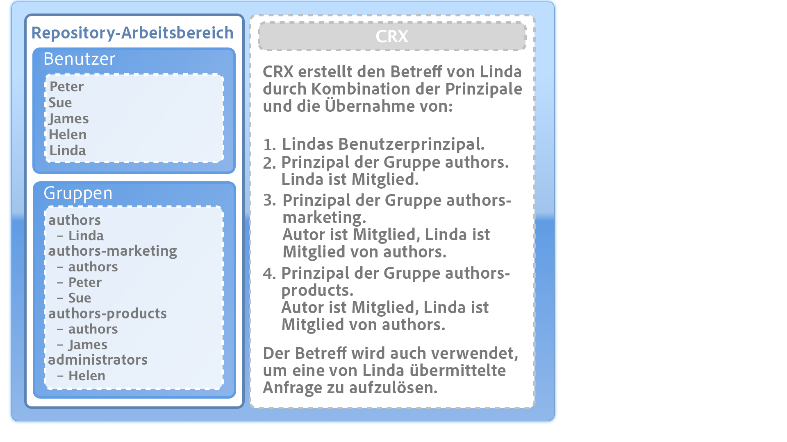

>[!NOTE]
>
>* CRX berücksichtigt keine Benutzerhierarchie bei der Kompilierung der Liste.
>* CRX verwendet nur dann eine Gruppenhierarchie, wenn Sie eine Gruppe als Mitglied einer anderen Gruppe einfügen. Es gibt keine automatische Vererbung (Übernahme) von Gruppenberechtigungen.
>* Die Reihenfolge, in der Sie die Gruppen festlegen, hat keinen Einfluss auf die Zugriffsrechte.

>


### Auflösen von Anfragen und Zugriffsrechten  {#resolving-request-and-access-rights}

Wenn CRX die Anfrage verarbeitet, vergleicht es die Zugriffsanfrage des Objekts mit der Liste der Zugriffssteuerung im Repository-Knoten:

Wenn Linda also den Knoten `/features` in der folgenden Repository-Struktur aktualisieren möchte:

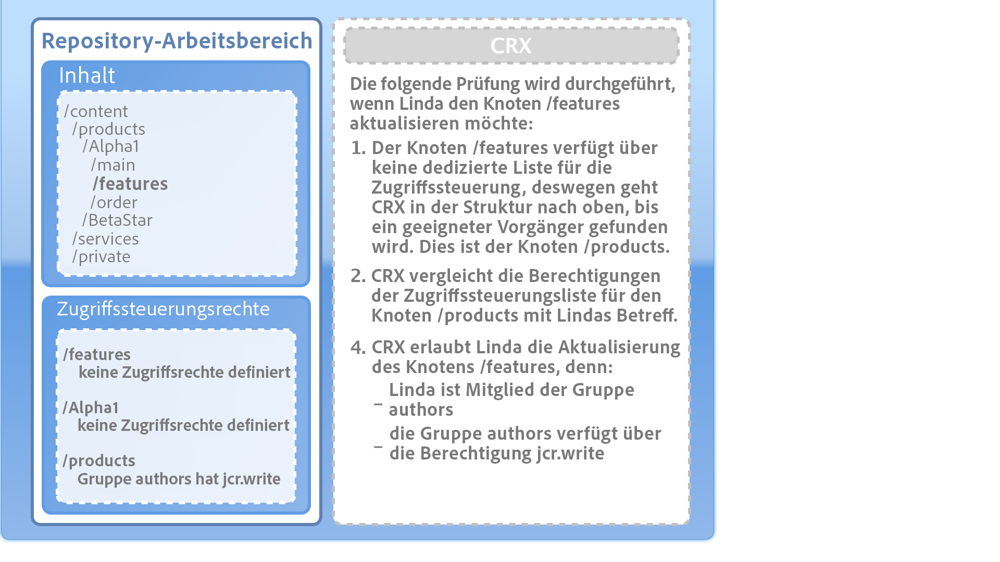

### Rangfolge {#order-of-precedence}

Zugriffsrechte in CRX werden wie folgt bewertet:

* Benutzerprinzipale haben stets Vorrang vor Gruppenprinzipalen – unabhängig von:

   * ihrer Reihenfolge in der Zugriffsteuerungsliste
   * ihrer Position in der Knotenhierarchie

* Bei einem gegebenen Prinzipal ist (maximal) 1 Ablehnungs- und 1 Zulassungseintrag in einem gegebenen Knoten vorhanden. Die Implementierung löscht immer redundante Einträge und stellt sicher, dass dieselbe Berechtigung nicht sowohl in den Zulassungs- als auch in den Ablehnungseinträgen aufgeführt wird.

>[!NOTE]
>
>Dieser Bewertungsprozess ist für die ressourcenbasierte Zugriffssteuerung einer CRX-Standardinstallation geeignet.

Nachfolgend sehen Sie zwei Beispiele, in denen der Benutzer `aUser` Mitglied der Gruppe `aGroup` ist:

```xml
   + parentNode
     + acl
       + ace: aUser - deny - write
     + childNode
       + acl
         + ace: aGroup - allow - write
       + grandChildNode
```

Im obigen Fall:

* `aUser` keine Schreibberechtigung für  `grandChildNode`.

```xml
   + parentNode
     + acl
       + ace: aUser - deny - write
     + childNode
       + acl
         + ace: aGroup - allow - write
         + ace: aUser - deny - write
       + grandChildNode
```

In diesem Fall:

* `aUser` keine Schreibberechtigung für  `grandChildNode`.
* Der zweite ACE-Eintrag für den Benutzer `aUser` ist redundant.

Zugriffsrechte von mehreren Gruppenprinzipalen werden basierend auf ihrer Reihenfolge innerhalb der Hierarchie und innerhalb einer einzigen Zugriffssteuerungsliste bewertet.

### Best Practices {#best-practices}

Die nachfolgende Tabelle enthält einige Empfehlungen und Best Practices:

<table>
 <tbody>
  <tr>
   <td>Empfehlung...</td>
   <td>Grund...</td>
  </tr>
  <tr>
   <td><i>Gruppen verwenden</i></td>
   <td><p>Vermeiden Sie die Zuweisung von Zugriffsrechten für jeden Benutzer. Dafür gibt es mehrere Gründe:</p>
    <ul>
     <li>Es gibt viel mehr Benutzer als Gruppen, sodass Gruppen die Struktur vereinfachen.</li>
     <li>Gruppen bieten einen Überblick über alle Konten.</li>
     <li>Die Vererbung ist bei Gruppen einfacher.</li>
     <li>Benutzer kommen und gehen. Gruppen sind auf Langfristigkeit ausgelegt.</li>
    </ul> </td>
  </tr>
  <tr>
   <td><i>Positiv sein</i></td>
   <td><p>Verwenden Sie immer Anweisungen zum Zulassen, um die Zugriffsrechte des Gruppenprinzips anzugeben (wo immer möglich). Vermeiden Sie Anweisungen vom Typ „Ablehnen“.</p> <p>Gruppenprinzipale werden der Reihenfolge nach innerhalb der Hierarchie und innerhalb einer einzelnen Zugriffssteuerungsliste bewertet.</p> </td>
  </tr>
  <tr>
   <td><i>Einfach</i></td>
   <td><p>Wenn Sie etwas Zeit investieren und denken, wenn Sie eine neue Installation konfigurieren, werden Sie gut bezahlt.</p> <p>Eine klare Struktur vereinfacht die fortlaufende Wartung und Verwaltung, sodass sowohl aktuelle Kollegen als auch Nachfolger die Implementierung problemlos verstehen können.</p> </td>
  </tr>
  <tr>
   <td><i>Testen</i></td>
   <td>Verwenden Sie eine Testinstallation, um zu praktizieren und sicherzustellen, dass Sie die Beziehungen zwischen den verschiedenen Benutzern und Gruppen verstehen.</td>
  </tr>
  <tr>
   <td><i>Standardbenutzer/Gruppen</i></td>
   <td>Aktualisieren Sie die Standardbenutzer und -gruppen immer sofort nach der Installation, um Sicherheitsprobleme zu vermeiden.</td>
  </tr>
 </tbody>
</table>

## Benutzerverwaltung {#user-administration}

Für die **Benutzerverwaltung** wird ein Standard-Dialogfeld verwendet.

Sie müssen sich beim jeweiligen Workspace anmelden und können dann wie folgt auf das Dialogfeld zugreifen:

* über den Link **Benutzerverwaltung** in der Hauptkonsole von CRX
* über das Menü **Sicherheit** des CRX Explorers


**Eigenschaften**

* **UserID**

   Kurzer Name des Kontos, der beim Zugriff auf CRX verwendet wird.

* **Prinzipalname**

   Ein vollständiger Textname für das Konto.

* **Kennwort**

   Wird benötigt, wenn Sie mit diesem Konto auf CRX zugreifen.

* **ntlmhash**

    Wird automatisch jedem neuen Konto zugewiesen und bei Änderung des Kennworts aktualisiert

* Sie können neue Eigenschaften hinzufügen, indem Sie einen Namen, einen Typ und den Wert definieren. Klicken Sie auf „Speichern“ (grünes Häkchen-Symbol) für jede neue Eigenschaft.

**Gruppenmitgliedschaft**

Hier werden alle Gruppen angezeigt, die zu diesem Konto gehören. Die Spalte Übernommen zeigt Mitgliedschaften an, die durch eine Mitgliedschaft bei einer anderen Gruppe übernommen wurden.

Durch Klicken auf eine Gruppen-ID (falls verfügbar) wird die [Gruppenverwaltung](#group-administration) für diese Gruppe geöffnet.

**Darsteller**

Mit der Funktion „Stellvertretend agieren“ kann ein Benutzer im Auftrag eines anderen Benutzers arbeiten.

Dies bedeutet, dass über ein Benutzerkonto andere Konten (Benutzer oder Gruppe) festgelegt werden können, die mit ihrem Konto arbeiten können. Anders ausgedrückt: Wenn Benutzer B stellvertretend für Benutzer A agieren darf, kann Benutzer B Aktionen unter Verwendung aller Kontodetails des Benutzers A (einschließlich ID, Name und Zugriffsrechte) ausführen.

Hierdurch kann der Stellvertreter (Darsteller) Aufgaben so abschließen, als würde er das Konto verwenden, für das er stellvertretend agiert, etwa bei Abwesenheit oder zur kurzfristigen Entlastung anderer überlasteter Benutzer.

Wenn ein Konto stellvertretend für ein anderes agiert, ist dies sehr schwierig zu erkennen. In den Protokolldateien werden keine Informationen dazu gespeichert, ob bei den Ereignissen jemand stellvertretend agiert hat. Wenn also Benutzer B stellvertretend für Benutzer A agiert, sehen alle Ereignisse so aus, als ob sie von Benutzer A persönlich ausgeführt wurden.

### Erstellen von Benutzerkonten {#creating-a-user-account}

1. Öffnen Sie das Dialogfeld **Benutzerverwaltung**.
1. Klicken Sie auf **Benutzer erstellen**.
1. Sie können dann die Eigenschaften eingeben:

   * **Benutzer-ID** – wird als Kontoname verwendet
   * **Kennwort** – wird bei der Anmeldung benötigt
   * **Prinzipalname** – dient zur Eingabe des vollständigen Textnamens
   * **Zwischenpfad** – kann zum Erstellen einer hierarchischen Struktur verwendet werden

1. Klicken Sie auf die Schaltfläche „Speichern“ (grünes Häkchen-Symbol).
1. Daraufhin wird das Dialogfeld erweitert und Sie können Folgendes tun:

   1. Konfigurieren Sie **Eigenschaften**.
   1. Zeigen Sie die **Gruppenmitgliedschaft** an.
   1. Definieren Sie **Darsteller**.

>[!NOTE]
>
>Es kann manchmal zu einer Beeinträchtigung der Leistung kommen, wenn neue Benutzer in Installationen registriert werden, die eine hohe Anzahl haben an:
>
>* Benutzer
>* Gruppen mit vielen Mitgliedern

>


### Aktualisieren von Benutzerkonten  {#updating-a-user-account}

1. Öffnen Sie mithilfe des Dialogfelds **Benutzerverwaltung** die Listenansicht aller Konten.
1. Navigieren Sie in der hierarchischen Struktur nach oben.
1. Klicken Sie auf das gewünschte Konto, um es zur Bearbeitung zu öffnen.
1. Nehmen Sie eine Änderung vor und klicken Sie anschließend auf „Speichern“ (grünes Häkchen-Symbol) für diesen Eintrag.
1. Klicken Sie zum Fertigstellen auf **Schließen** oder auf **Liste…**, um zur Liste aller Benutzerkonten zurückzukehren.

### Entfernen von Benutzerkonten  {#removing-a-user-account}

1. Öffnen Sie mithilfe des Dialogfelds **Benutzerverwaltung** die Listenansicht aller Konten.
1. Navigieren Sie in der hierarchischen Struktur nach oben.
1. Wählen Sie das gewünschte Konto aus und klicken Sie auf **Benutzer entfernen**. Das Konto wird sofort gelöscht.

>[!NOTE]
>
>Dadurch wird der Knoten für diesen Prinzipal aus dem Repository entfernt.
>
>Zugriffsrechte-Einträge werden hingegen nicht entfernt. So wird die historische Integrität gesichert.

### Definieren von Eigenschaften {#defining-properties}

Sie können **Eigenschaften** für neue oder vorhandene Konten definieren:

1. Öffnen Sie das Dialogfeld **Benutzerverwaltung** für das entsprechende Konto.
1. Geben Sie einen Namen für die **Eigenschaft** an.
1. Wählen Sie den **Typ** aus der Dropdown-Liste aus.
1. Legen Sie einen **Wert** fest.
1. Klicken Sie auf „Speichern“ (grünes Häkchen-Symbol) für die neue Eigenschaft.

Vorhandene Eigenschaften können mit dem Papierkorb-Symbol gelöscht werden.

Mit Ausnahme des Kennworts können Eigenschaften nicht bearbeitet werden, sie müssen gelöscht und neu erstellt werden.

#### Ändern von Kennwörtern  {#changing-the-password}

Das **Kennwort** ist eine spezielle Eigenschaft, die durch Klicken auf den Link **Kennwort ändern** geändert werden kann.

Sie können über das Menü **Sicherheit** im CRX Explorer auch das Kennwort für Ihr eigenes Benutzerkonto ändern.

### Definieren von Darstellern  {#defining-an-impersonator}

Sie können Darsteller für neue oder vorhandene Konten definieren:

1. Öffnen Sie das Dialogfeld **Benutzerverwaltung** für das entsprechende Konto.
1. Geben Sie das Konto an, dem es gestattet sein soll, stellvertretend für dieses Konto zu agieren.

   Sie können &quot;Durchsuchen&quot;verwenden... , um ein vorhandenes Konto auszuwählen.

1. Klicken Sie auf „Speichern“ (grünes Häkchen-Symbol) für die neue Eigenschaft.

## Gruppenverwaltung {#group-administration}

Für die **Gruppenverwaltung** wird ein Standard-Dialogfeld verwendet.

Sie müssen sich beim jeweiligen Workspace anmelden und können dann wie folgt auf das Dialogfeld zugreifen:

* über den Link **Gruppenverwaltung** in der Hauptkonsole von CRX
* über das Menü **Sicherheit** des CRX Explorers


**Eigenschaften**

* **GroupID**

   Kurzname für das Gruppenkonto.

* **Prinzipalname**

   Ein vollständiger Textname für das Gruppenkonto.

* Sie können neue Eigenschaften hinzufügen, indem Sie einen Namen, einen Typ und den Wert definieren. Klicken Sie auf „Speichern“ (grünes Häkchen-Symbol) für jede neue Eigenschaft.

* **Mitglieder**

   Sie können Benutzer oder andere Gruppen als Mitglieder dieser Gruppe hinzufügen.

**Gruppenmitgliedschaft**

Hier werden alle Gruppen angezeigt, die zu diesem aktuellen Gruppenkonto gehören. Die Spalte Übernommen zeigt Mitgliedschaften an, die durch eine Mitgliedschaft bei einer anderen Gruppe übernommen wurden.

Wenn Sie auf eine Gruppen-ID klicken, wird das Dialogfeld für diese Gruppe geöffnet.

**Mitglieder**

Hier werden alle Konten (Benutzer und/oder Gruppen) aufgelistet, die Mitglieder der aktuellen Gruppe sind.

Die Spalte **Übernommen** zeigt Mitgliedschaften an, die durch eine Mitgliedschaft bei einer anderen Gruppe übernommen wurden.

>[!NOTE]
>
>Wenn die Eigentümer-, Bearbeiter- oder Betrachterrolle einem Benutzer in einem beliebigen Asset-Ordner zugewiesen wird, wird eine neue Gruppe erstellt. Der Gruppenname hat das Format `mac-default-<foldername>` für jeden Ordner, für den die Rollen definiert sind.

### Erstellen von Gruppenkonten {#creating-a-group-account}

1. Öffnen Sie das Dialogfeld **Gruppenverwaltung**.
1. Klicken Sie auf **Gruppe erstellen**.
1. Sie können dann die Eigenschaften eingeben:

   * **Prinzipalname** – dient zur Eingabe des vollständigen Textnamens
   * **Zwischenpfad** – kann zum Erstellen einer hierarchischen Struktur verwendet werden

1. Klicken Sie auf die Schaltfläche „Speichern“ (grünes Häkchen-Symbol).
1. Daraufhin wird das Dialogfeld erweitert und Sie können Folgendes tun:

   1. Konfigurieren Sie **Eigenschaften**.
   1. Zeigen Sie die **Gruppenmitgliedschaft** an.
   1. Verwalten Sie die **Mitglieder**.

### Aktualisieren von Gruppenkonten  {#updating-a-group-account}

1. Öffnen Sie mithilfe des Dialogfelds **Gruppenverwaltung** die Listenansicht aller Konten.
1. Navigieren Sie in der hierarchischen Struktur nach oben.
1. Klicken Sie auf das gewünschte Konto, um es zur Bearbeitung zu öffnen.
1. Nehmen Sie eine Änderung vor und klicken Sie anschließend auf „Speichern“ (grünes Häkchen-Symbol) für diesen Eintrag.
1. Klicken Sie zum Fertigstellen auf **Schließen** oder auf **Liste…**, um zur Liste aller Gruppenkonten zurückzukehren.

### Entfernen von Gruppenkonten  {#removing-a-group-account}

1. Öffnen Sie mithilfe des Dialogfelds **Gruppenverwaltung** die Listenansicht aller Konten.
1. Navigieren Sie in der hierarchischen Struktur nach oben.
1. Wählen Sie das gewünschte Konto aus und klicken Sie auf **Gruppe entfernen**. Das Konto wird sofort gelöscht.

>[!NOTE]
>
>Dadurch wird der Knoten für diesen Prinzipal aus dem Repository entfernt.
>
>Zugriffsrechte-Einträge werden hingegen nicht entfernt. So wird die historische Integrität gesichert.

### Definieren von Eigenschaften {#defining-properties-1}

Sie können Eigenschaften für neue oder vorhandene Konten definieren:

1. Öffnen Sie das Dialogfeld **Gruppenverwaltung** für das entsprechende Konto.
1. Geben Sie einen Namen für die **Eigenschaft** an.
1. Wählen Sie den **Typ** aus der Dropdown-Liste aus.
1. Legen Sie einen **Wert** fest.
1. Klicken Sie auf „Speichern“ (grünes Häkchen-Symbol) für die neue Eigenschaft.

Vorhandene Eigenschaften können mit dem Papierkorb-Symbol gelöscht werden.

### Mitglieder  {#members}

Sie können der aktuellen Gruppe Mitglieder hinzufügen:

1. Öffnen Sie das Dialogfeld **Gruppenverwaltung** für das entsprechende Konto.
1. Führen Sie einen der folgenden Schritte durch:

   * Geben Sie den Namen des gewünschten Mitglieds (Benutzer- oder Gruppenkonto) ein.
   * Alternativ können Sie über die Option **Durchsuchen…** nach dem hinzuzufügenden Prinzipal (Benutzer- oder Gruppenkonto) suchen und diesen auswählen.

1. Klicken Sie auf „Speichern“ (grünes Häkchen-Symbol) für die neue Eigenschaft.

Alternativ können Sie ein vorhandenes Mitglied über das Papierkorb-Symbol löschen.

## Verwalten von Zugriffsrechten  {#access-right-management}

Mit dem Register **Zugriffskontrolle** der CRXDE Lite können Sie die Richtlinien für die Zugriffskontrolle definieren und die entsprechenden Berechtigungen zuweisen.

Wählen Sie beispielsweise auf der Registerkarte „Zugangssteuerung“ im unteren rechten Bereich für die Option **Aktueller Pfad** die gewünschte Ressource im linken Bereich aus:

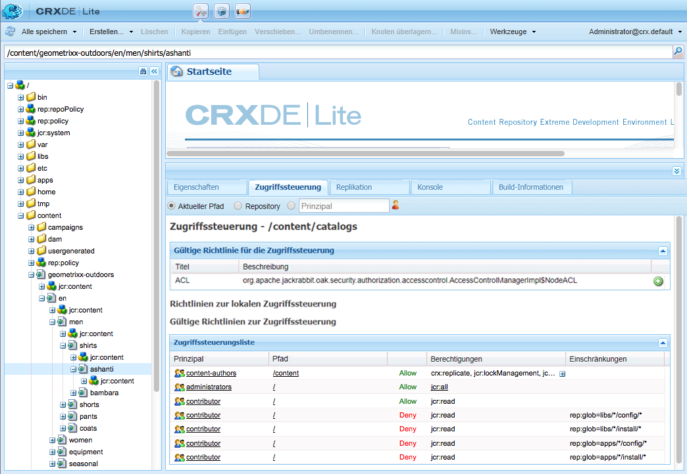

Die Richtlinien sind wie folgt kategorisiert:

* **Anwendbare Zugriffskontrollen**

   Diese Richtlinien können angewendet werden.

   Dies sind Richtlinien, die für die Erstellung einer lokalen Richtlinie zur Verfügung stehen. Nachdem Sie eine gültige Richtlinie ausgewählt und hinzugefügt haben, wird sie zu einer lokalen Richtlinie.

* **Lokale Zugriffskontrollen**

   Dies sind Richtlinien für Zugriffskontrollen, die Sie angewendet haben. Sie können sie dann aktualisieren, sortieren oder entfernen.

   Eine lokale Richtlinie überschreibt jedwede Richtlinien, die vom übergeordneten Element übernommen werden.

* **Effektive Zugriffskontrolle**

   Dies sind die Richtlinien zur Zugriffskontrolle, die jetzt für alle Zugriffsanforderungen gelten. Sie zeigen die aggregierten Richtlinien an, die von den lokalen Richtlinien abgeleitet bzw. vom übergeordneten Element übernommenen werden.

### Auswählen von Richtlinien {#policy-selection}

Sie können Richtlinien für Folgendes auswählen:

* **Aktueller Pfad**

   Wie im Beispiel oben, wählen Sie eine Ressource im Repository aus. Die Richtlinien für diesen aktuellen Pfad werden angezeigt.

* **Repository**

   Wählt die Zugriffskontrolle auf Repository-Ebene aus. Beispiel: Wenn Sie die Berechtigung `jcr:namespaceManagement` festlegen, die nur für das Repository und nicht für einen Knoten relevant ist.

* **Prinzipal**

   Ein Prinzipal, der im Repository registriert ist.

   Sie können entweder den **Prinzipal**-Namen eingeben oder auf das Symbol rechts neben dem Feld klicken, um das Dialogfeld **Prinzipal auswählen** zu öffnen.

   Dort können Sie nach einem **Benutzer** oder einer **Gruppe** **suchen**. Wählen Sie den gewünschten Prinzipal aus der angezeigten Liste aus und klicken Sie dann auf **OK**, um den Wert in das vorherige Dialogfeld zu übernehmen.

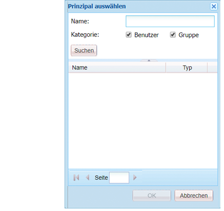

>[!NOTE]
>
>Zur Vereinfachung der Verwaltung empfehlen wir, dass Sie Gruppenkonten und nicht einzelnen Benutzerkonten Zugriffsrechte zuweisen.
>
>Es ist einfacher, einige wenige Gruppen anstatt vieler Benutzerkonten zu verwalten. 

### Berechtigungen  {#privileges}

Die folgenden Berechtigungen können beim Hinzufügen eines Zugangssteuerungseintrags ausgewählt werden (umfassende Details finden Sie in [Sicherheits-API](https://docs.adobe.com/docs/en/spec/javax.jcr/javadocs/jcr-2.0/javax/jcr/security/Privilege.html)).

<table>
 <tbody>
  <tr>
   <th><strong>Berechtigungsname</strong></th>
   <th><strong>Welche das Privileg kontrolliert...</strong></th>
  </tr>
  <tr>
   <td><code>jcr:read</code></td>
   <td>Rufen Sie eine Node ab und lesen Sie deren Eigenschaften und deren Werte.</td>
  </tr>
  <tr>
   <td><code>rep:write</code></td>
   <td>Dies ist ein Jackrabbit-spezifisches Aggregat-Privileg von jcr:write und jcr:nodeTypeManagement.<br /> </td>
  </tr>
  <tr>
   <td><code>jcr:all</code></td>
   <td>Dies ist eine Aggregat-Berechtigung, die alle anderen vordefinierten Berechtigungen enthält.</td>
  </tr>
  <tr>
   <td><strong>Erweitert</strong></td>
   <td> </td>
  </tr>
  <tr>
   <td><code>crx:replicate</code></td>
   <td>Führen Sie die Replikation einer Node durch.</td>
  </tr>
  <tr>
   <td><code>jcr:addChildNodes</code></td>
   <td>Erstellen Sie untergeordnete Knoten einer Node.</td>
  </tr>
  <tr>
   <td><code>jcr:lifecycleManagement</code></td>
   <td>Führen Sie Lebenszyklusoperationen auf einem Knoten durch.</td>
  </tr>
  <tr>
   <td><code>jcr:lockManagement</code></td>
   <td>Sperren und Entsperren einer Node; Sperren aktualisieren.</td>
  </tr>
  <tr>
   <td><code>jcr:modifyAccessControl</code></td>
   <td>Ändern Sie die Zugriffskontrollen einer Node.</td>
  </tr>
  <tr>
   <td><code>jcr:modifyProperties</code></td>
   <td>Erstellen, ändern und entfernen Sie die Eigenschaften eines Knotens.</td>
  </tr>
  <tr>
   <td><code>jcr:namespaceManagement</code></td>
   <td>Registrieren, heben Sie die Registrierung auf und ändern Sie die Namensraum-Definitionen.</td>
  </tr>
  <tr>
   <td><code>jcr:nodeTypeDefinitionManagement</code></td>
   <td>Importieren Sie Knotentypdefinitionen in das Repository.</td>
  </tr>
  <tr>
   <td><code>jcr:nodeTypeManagement</code></td>
   <td>hinzufügen und entfernen Sie mixin-Knotentypen und ändern Sie den primären Knotentyp einer Node. Dies schließt auch alle Aufrufe der Node.addNode- und XML-Importmethoden ein, bei denen der Mixin-Typ oder primäre Typ des neuen Knotens explizit festgelegt ist.</td>
  </tr>
  <tr>
   <td><code>jcr:readAccessControl</code></td>
   <td>Lesen Sie die Richtlinie zur Zugriffskontrolle einer Node.</td>
  </tr>
  <tr>
   <td><code>jcr:removeChildNodes</code></td>
   <td>Entfernen Sie untergeordnete Knoten einer Node.</td>
  </tr>
  <tr>
   <td><code>jcr:removeNode</code></td>
   <td>Entfernen Sie eine Node.</td>
  </tr>
  <tr>
   <td><code>jcr:retentionManagement</code></td>
   <td>Führen Sie Speicherverwaltungsvorgänge auf einer Node durch.</td>
  </tr>
  <tr>
   <td><code>jcr:versionManagement</code></td>
   <td>Führen Sie Versionsverwaltungsvorgänge für einen Knoten durch.</td>
  </tr>
  <tr>
   <td><code>jcr:workspaceManagement</code></td>
   <td>Erstellen und Löschen von Arbeitsbereichen mit der JCR-API.</td>
  </tr>
  <tr>
   <td><code>jcr:write</code></td>
   <td>Dies ist eine Aggregat-Berechtigung, die Folgendes enthält:<br /> - jcr:modifyProperties<br /> - jcr:addChildNodes<br /> - jcr:removeNode<br /> - jcr:removeChildNodes</td>
  </tr>
  <tr>
   <td><code>rep:privilegeManagement</code></td>
   <td>Registrieren Sie neue Berechtigung.</td>
  </tr>
 </tbody>
</table>

### Registrieren von neuen Berechtigungen {#registering-new-privileges}

Sie können auch neue Berechtigungen registrieren:

1. Wählen Sie in der Symbolleiste **Tools** und dann **Berechtigungen** aus, um die aktuell registrierten Berechtigungen anzuzeigen.

   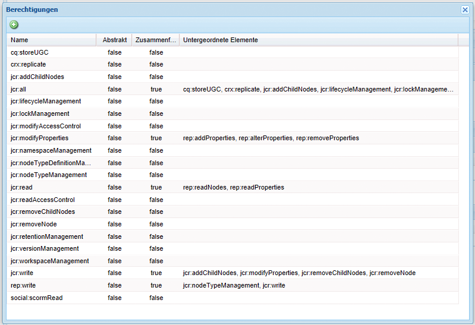

1. Öffnen Sie mithilfe des Symbols **Berechtigung registrieren** (**+**) das entsprechende Dialogfeld und legen Sie eine neue Berechtigung fest:

   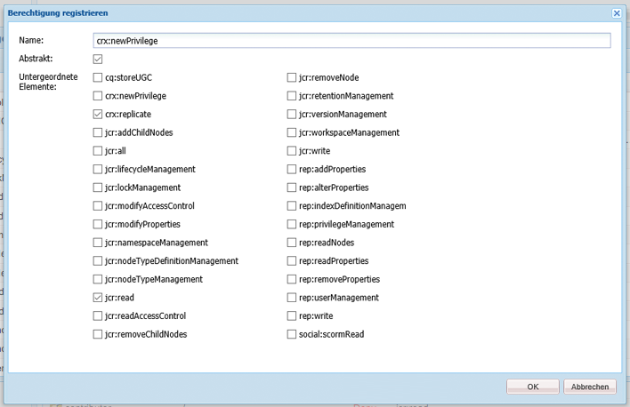

1. Klicken Sie zum Speichern auf **OK**. Die Berechtigung steht jetzt zur Auswahl zur Verfügung.

### Hinzufügen von Zugriffssteuerungseinträgen {#adding-an-access-control-entry}

1. Wählen Sie die Ressource aus und öffnen Sie die Registerkarte **Zugriffssteuerung**.

1. Um neue **Richtlinien zur lokalen Zugriffssteuerung** hinzuzufügen, klicken Sie auf das **+**-Symbol rechts neben der Liste **Gültige Richtlinie für die Zugriffssteuerung**:

   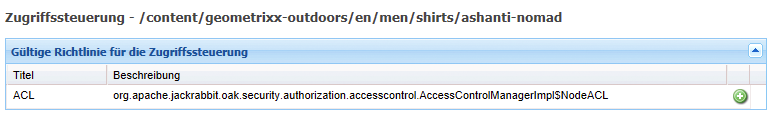

1. Es wird ein neuer Eintrag unter **Richtlinien zur lokalen Zugriffssteuerung** angezeigt:

   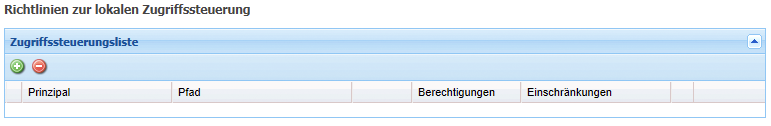

1. Klicken Sie auf das **+**-Symbol, um einen neuen Eintrag hinzuzufügen:

   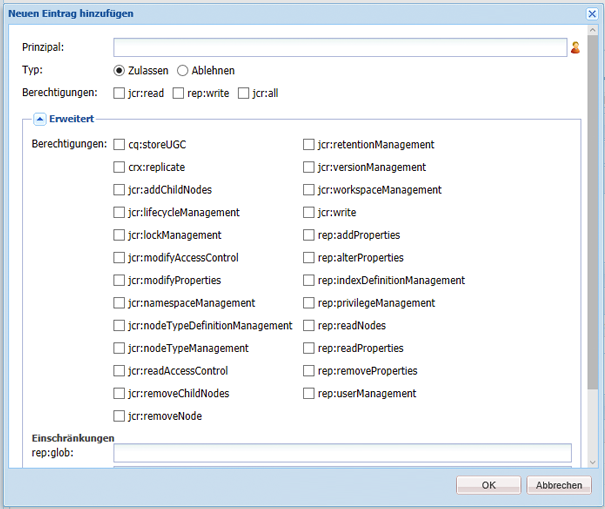

   >[!NOTE]
   >
   >Derzeit ist es nur mithilfe einer Übergangslösung möglich, eine leere Zeichenfolge festzulegen.
   >
   >Geben Sie einfach &quot;&quot; ein.

1. Definieren Sie Ihre Richtlinie zur Zugriffssteuerung und klicken Sie dann zum Speichern auf **OK**. Die neue Richtlinie:

   * wird unter **Richtlinien zur lokalen Zugriffssteuerung** aufgeführt; 
   * reflektiert die Änderungen unter **Gültige Richtlinien zur Zugriffssteuerung**.

CRX überprüft Ihre Auswahl. Bei einem gegebenen Prinzipal ist (maximal) 1 Ablehnungs- und 1 Zulassungseintrag in einem gegebenen Knoten vorhanden. Die Implementierung löscht immer redundante Einträge und stellt sicher, dass dieselbe Berechtigung nicht sowohl in den Zulassungs- als auch in den Ablehnungseinträgen aufgeführt wird.

### Sortieren von Richtlinien zur lokalen Zugriffssteuerung  {#ordering-local-access-control-policies}

Die Reihenfolge in der Liste zeigt die Reihenfolge an, in der die Richtlinien angewendet werden.

1. Wählen Sie in der Tabelle **Richtlinien zur lokalen Zugriffssteuerung** den gewünschten Eintrag aus und ziehen Sie ihn an die neue Position in der Tabelle.

   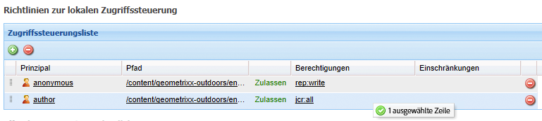

1. Die Änderungen werden in den Tabellen **Richtlinien zur lokalen Zugriffssteuerung** und **Gültige Richtlinien zur Zugriffssteuerung** angezeigt.

### Entfernen von Richtlinien zur Zugriffssteuerung {#removing-an-access-control-policy}

1. Klicken Sie in der Tabelle **Richtlinien zur lokalen Zugriffssteuerung** auf das rote Symbol (-) rechts neben dem Eintrag.
1. Der Eintrag wird aus den Tabellen **Richtlinien zur lokalen Zugriffssteuerung** und **Gültige Richtlinien zur Zugriffssteuerung** entfernt.

### Testen von Richtlinien zur Zugriffssteuerung {#testing-an-access-control-policy}

1. Wählen Sie in der CRXDE Lite-Symbolleiste **Tools** und dann **Zugriffssteuerung testen...** aus.
1. Daraufhin wird ein neues Dialogfeld im Bereich rechts oben geöffnet. Wählen Sie den **Pfad** und/oder den **Prinzipal** aus, den Sie testen möchten.
1. Klicken Sie auf **Testen**, um die Ergebnisse für Ihre Auswahl zu sehen:

   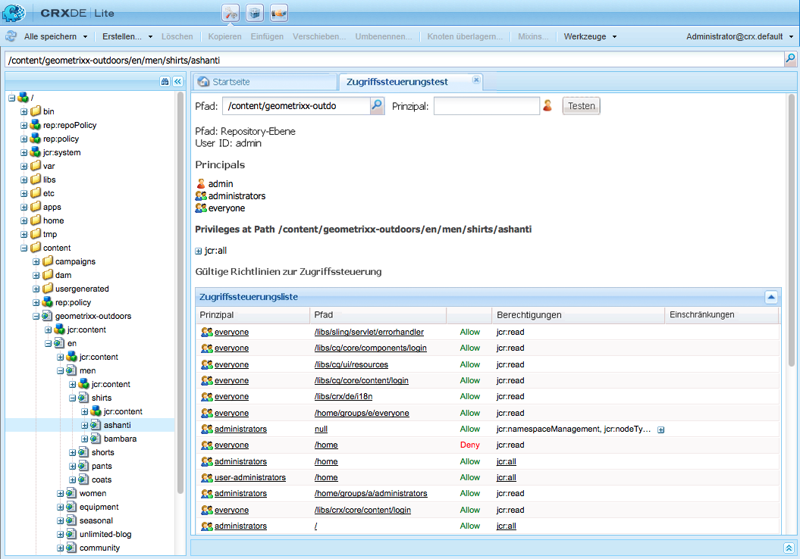
