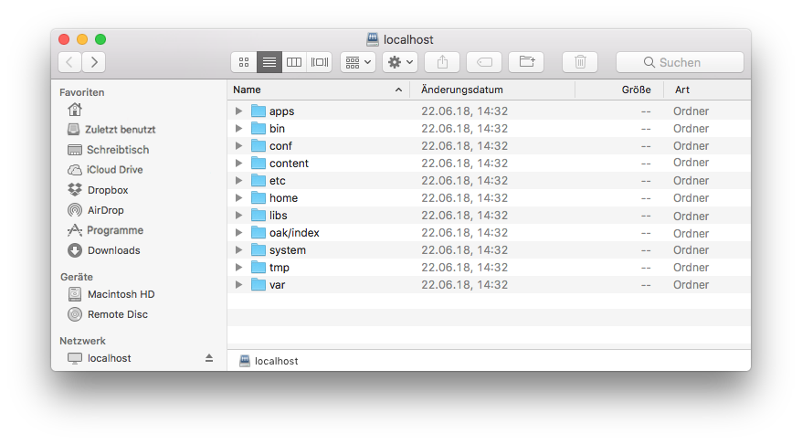
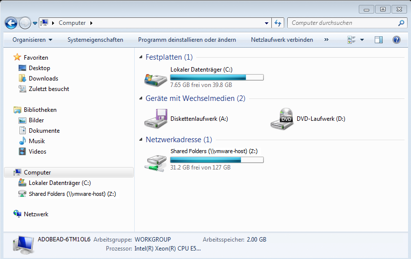
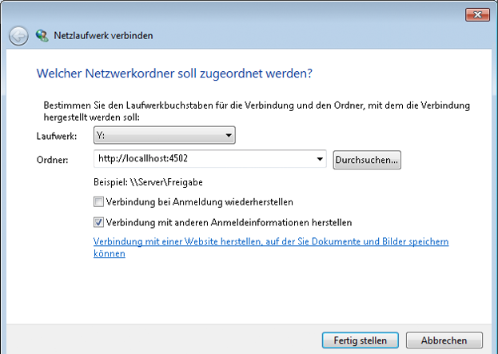
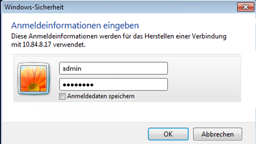
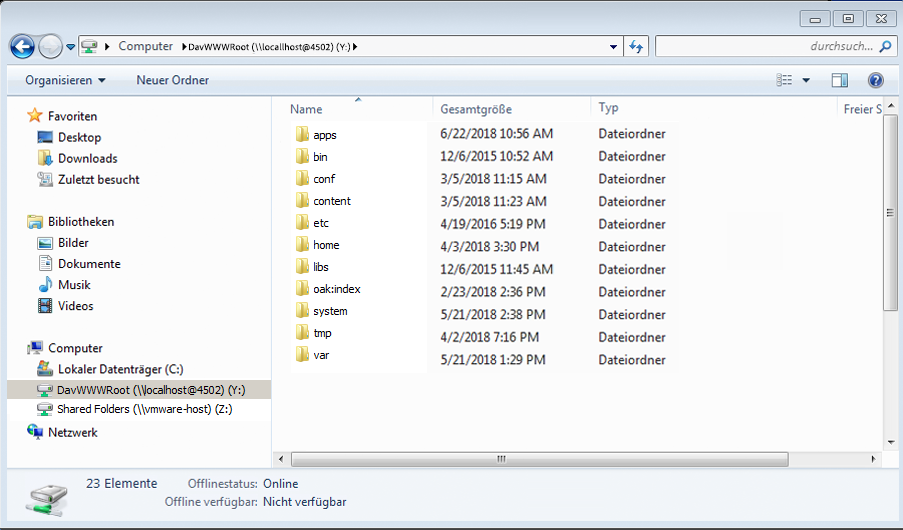

# WebDAV-Zugriff{#webdav-access}

So stellen Sie mit KDE eine Verbindung zu AEM über WebDAV her:

AEM bietet WebDAV-Unterstützung, mit der Sie Repository-Inhalte anzeigen und bearbeiten können. Durch die Verbindung über WebDAV können Sie direkt über Ihren Desktop auf das Repository zugreifen. Text- und PDF-Dateien, die über die WebDAV-Verbindung zum Repository hinzugefügt werden, werden automatisch vollständig indiziert und lassen sich mit den standardmäßigen Suchschnittstellen und über die Standard-Java-APIs suchen.

## Allgemein {#general}

[Detaillierte Anleitungen je nach Betriebssystem](/help/sites-administering/webdav-access.md#connecting-via-webdav) sind in diesem Dokument enthalten. Grundsätzlich müssen Sie für die Verbindung zu Ihrem Repository mit dem WebDAV-Protokoll Ihren WebDAV-Client auf den folgenden Ort ausrichten:

```xml
http://localhost:4502
```



Bei der Verbindung auf Betriebssystemebene bietet diese URL WebDAV-Zugriff auf den Standard-Workspace ( `crx.default`). Diese Methode ist zwar einfacher für den Benutzer, bietet aber nicht die zusätzliche Möglichkeit, Namen für Workspaces festzulegen, was durch die Verwendung zusätzlicher [WebDAV-URLs](/help/sites-administering/webdav-access.md#webdav-urls) möglich ist.

AEM zeigt den Repository-Inhalt wie folgt an:

* Ein Knoten des Typs `nt:folder` wird als Ordner angezeigt. Knoten unterhalb des Knotens `nt:folder` werden als Ordnerinhalte angezeigt.

* Ein Knoten des Typs `nt:file` wird als Datei angezeigt. Knoten unterhalb des Knotens `nt:file` werden nicht angezeigt, sondern bilden den Inhalt der Datei.

Wenn Sie mit WebDAV Ordner und Dateien erstellen und bearbeiten, erstellt und bearbeitet AEM die erforderlichen `nt:folder`- und `nt:file`-Knoten. Wenn Sie mit WebDAV Inhalte importieren und exportieren möchten, versuchen Sie, so häufig wie möglich mit den Knotentypen `nt:file` und `nt:folder` zu arbeiten.

>[!NOTE]
>
>Lesen Sie sich vor der Einrichtung von WebDAV die [technischen Voraussetzungen](/help/sites-deploying/technical-requirements.md#webdav-clients) durch.

## WebDAV-URLs  {#webdav-urls}

Die URL für den WebDAV-Server weist die folgende Struktur auf:

<table>
 <colgroup>
  <col width="100" />
  <col width="100" />
  <col width="100" />
  <col width="100" />
  <col width="100" />
 </colgroup>
 <tbody>
  <tr>
   <td>
    <code>
     <strong>URL Component</strong>
    </code></td>
   <td><code>https://&lt;host&gt;:&lt;port&gt;</code></td>
   <td><code>/&lt;crx-webapp-path&gt;</code></td>
   <td><code>/repository</code></td>
   <td><code>/&lt;workspace&gt;</code></td>
  </tr>
  <tr>
   <td>
    <code>
     <strong>Example</strong>
    </code></td>
   <td><code>http://localhost:4502</code></td>
   <td><code>/crx</code></td>
   <td><code>/repository</code></td>
   <td><code>/crx.default</code></td>
  </tr>
  <tr>
   <td><strong>Beschreibung</strong></td>
   <td>Host und Port, auf dem AEM ausgeführt wird</td>
   <td>Pfad für die AEM Repository-Webapp</td>
   <td>Pfad, dem das WebDAV-Servlet zugeordnet ist</td>
   <td>Name des Arbeitsbereichs</td>
  </tr>
 </tbody>
</table>

Um Workspaces abweichend vom Standard (`crx.default`) zuzuordnen, ändern Sie die Workspace-Elemente im Pfad. Für die Zuordnung eines Workspace namens `staging` verwenden Sie z. B. die folgende URL:

```xml
http://localhost:4502/crx/repository/staging
```

## Verbinden über WebDAV {#connecting-via-webdav}

[Wie oben](/help/sites-administering/webdav-access.md#general) erwähnt, verweisen Sie zur Verbindung mit Ihrem Repository mithilfe des WebDAV-Protokolls Ihren WebDAV-Client auf Ihren Repository-Speicherort. Je nach Betriebssystem sind jedoch unterschiedliche Schritte zur Verbindung des Clients nötig; ggf. muss auch das Betriebssystem konfiguriert werden.

In diesem Dokument finden Sie Anweisungen für die folgenden Betriebssysteme:

* [Windows](/help/sites-administering/webdav-access.md#windows)
* [macOS](/help/sites-administering/webdav-access.md#macos)
* [Linux](/help/sites-administering/webdav-access.md#linux)

### Windows {#windows}

Um ein System mit Microsoft Windows 7 (oder höher) mit einer AEM-Instanz zu verbinden, die nicht mit SSL gesichert ist, müssen Sie die Option, eine grundlegende Authentifizierung über ein ungesichertes Netzwerk durchzuführen, explizit in Windows aktivieren. Dafür muss in der Windows-Registrierung des WebClients eine Änderung vorgenommen werden.

Nach Aktualisierung der Registrierung lässt sich die AEM-Instanz als Laufwerk einbinden.

#### Konfiguration unter Windows 7 und höher  {#windows-and-greater-configuration}

So aktualisieren Sie die Registrierung, um die grundlegende Authentifizierung über ein ungesichertes Netzwerk zuzulassen:

1. Suchen Sie den folgenden Registrierungs-Unterschlüssel:

   ```xml
   HKEY_LOCAL_MACHINE\SYSTEM\CurrentControlSet\Services\WebClient\Parameters
   ```

1. Setzen Sie den Registrierungseintrag-Unterschlüssel `BasicAuthLevel` auf den Wert `2` oder höher.

   Wenn der Unterschlüssel nicht vorhanden ist, fügen Sie ihn hinzu.

1. Sie müssen das System neu starten, damit die Änderung der Registrierung übernommen wird.

Weitere Informationen zu dieser Registrierungsänderung finden Sie unter [Microsoft Support KB 841215](https://support.microsoft.com/default.aspx/kb/841215).

Informationen zur Verbesserung der Reaktionsfähigkeit des WebDav-Clients unter Windows finden Sie unter [Microsoft Support KB 2445570](https://support.microsoft.com/kb/2445570) .

>[!NOTE]
>
>Adobe empfiehlt, einen Windows-Benutzer zu erstellen, der dieselben Anmeldedaten hat wie der Repository-Benutzer, um Berechtigungskonflikte zu vermeiden.

#### Konfiguration von Windows 8 {#windows-configuration}

Auch bei Windows 8 müssen Sie den Registrierungs-Eintrag ändern, [wie für Windows 7 und höher beschrieben](/help/sites-administering/webdav-access.md#windows-and-greater-configuration). Zuvor müssen Sie jedoch die Desktop Experience aktivieren, um den Registrierungs-Eintrag sehen zu können.

Um das Desktop-Erlebnis zu aktivieren, öffnen Sie **Server-Manager**, dann **Funktionen**, dann **Funktionen hinzufügen** und dann **Desktop-Erlebnis**.

Nach dem Neustart ist der Registrierungs-Eintrag (wie für Windows 7 beschrieben) verfügbar. Bearbeiten Sie ihn so, wie für Windows 7 oder höher beschrieben.

#### Herstellen der Verbindung unter Windows  {#connecting-in-windows}

So stellen Sie unter Windows eine Verbindung über WebDAV zu AEM her:

1. Öffnen Sie **Windows Explorer** oder **Datei-Explorer** und klicken Sie auf **Computer** oder **Dieser PC**.

   

1. Klicken Sie auf **Netzlaufwerk verbinden**, um den Assistenten zu starten.
1. Geben Sie die Verbindungsdaten ein:

   * **Laufwerk**: Wählen Sie einen der verfügbaren Buchstaben aus.
   * **Ordner**: `http://localhost:4502`
   * Klicken Sie auf **Verbindung mit anderen Anmeldeinformationen herstellen**.

   Klicken Sie auf Beenden

   

   >[!NOTE]
   >
   >Wenn sich AEM an einem anderen Port befindet, verwenden Sie diese Portnummer anstelle von 4502. Wenn Sie das Inhalts-Repository nicht auf dem lokalen Rechner ausführen, ersetzen Sie `localhost` durch den entsprechen Servernamen bzw. die IP-Adresse.

1. Geben Sie den Benutzernamen `admin` und das Kennwort `admin` ein. Adobe empfiehlt, das vorkonfigurierte Admin-Konto zum Testen zu nutzen.

   

1. Der Assistent wird geschlossen und das neu eingebundene Laufwerk wird in einem Windows-Explorer- oder Datei-Explorer-Fenster geöffnet.

   

AEM wurde nun von Windows als Laufwerk über WebDAV eingebunden und kann als weiteres Laufwerk genutzt werden.

### macOS {#macos}

Für eine Verbindung über WebDAV sind bei macOS keine Konfigurationsschritte erforderlich. Sie müssen lediglich eine Verbindung zum WebDAV-Server herstellen.

1. Navigieren Sie zu einem beliebigen **Finder**-Fenster und klicken Sie auf **Gehe zu** und **Mit Server verbinden** oder drücken Sie **Befehlstaste+K**.
1. Geben Sie im Fenster **Mit Server verbinden** den AEM-Ort ein:

   * `http://localhost:4502`
   >[!NOTE]
   >
   >Wenn sich AEM an einem anderen Port befindet, verwenden Sie diese Portnummer anstelle von 4502. Wenn Sie das Inhalts-Repository nicht auf dem lokalen Rechner ausführen, ersetzen Sie `localhost` durch den entsprechen Servernamen bzw. die IP-Adresse.

1. Wenn Sie zur Authentifizierung aufgefordert werden, geben Sie den Benutzernamen `admin` und das Kennwort `admin` ein. Adobe empfiehlt, das vorkonfigurierte Admin-Konto zum Testen zu nutzen.

AEM wurde nun von macOS über WebDAV eingebunden und kann als Ordner genutzt werden.

### Linux {#linux}

Für die Verbindung über WebDAV ist unter Linux keine Konfiguration erforderlich. Für die Herstellung der Verbindung sind jedoch einige Schritte nötig, die je nach Desktopumgebung unterschiedlich ausfallen.

#### GNOME {#gnome}

So stellen Sie mit GNOME eine Verbindung zu AEM über WebDAV her:

1. Wählen Sie in Nautilus (Dateimanager) **Orte** und dann **Mit Server verbinden** aus.
1. Wählen Sie im Fenster **Mit Server verbinden** unter „Dienste-Typ“ die Option „WebDAV (HTTP)“ aus.

1. Geben Sie unter **Server** `http://localhost:4502/crx/repository/crx.default` ein.

   >[!NOTE]
   >
   >Wenn sich AEM an einem anderen Port befindet, verwenden Sie diese Portnummer anstelle von 4502. Wenn Sie das Inhalts-Repository nicht auf dem lokalen Rechner ausführen, ersetzen Sie `localhost` durch den entsprechen Servernamen bzw. die IP-Adresse.

1. Geben Sie unter **Ordner** `/dav` ein.
1. Geben Sie den Benutzernamen `admin` ein. Adobe empfiehlt, das vorkonfigurierte Admin-Konto zum Testen zu nutzen.
1. Lassen Sie den Port leer und geben Sie einen Beliebigen Namen für die Verbindung ein.
1. Klicken Sie auf „Verknüpfen“.**** AEM fordert Sie auf, Ihr Kennwort einzugeben.
1. Geben Sie das Kennwort `admin` ein und klicken Sie auf **Verbinden**.

GNOME hat jetzt AEM als Volume bereitgestellt und kann wie jedes andere Volume verwendet werden.

#### KDE {#kde}

1. Öffnen Sie den Assistenten „Netzwerkordner“.
1. Wählen Sie **Webordner** aus und klicken Sie auf „Weiter“.
1. Geben Sie unter **Name** den Verbindungsnamen ein.
1. Geben Sie unter **Benutzer** die Adobe `admin.` ein und empfehlen Sie die Verwendung des vorkonfigurierten Administratorkontos.
1. Geben Sie unter **Server** `http://localhost:4502/crx/repository/crx.default` ein.

   >[!NOTE]
   >
   >Wenn sich AEM an einem anderen Port befindet, verwenden Sie diese Portnummer anstelle von 4502. Wenn Sie das Inhalts-Repository nicht auf dem lokalen Rechner ausführen, ersetzen Sie `localhost` durch den entsprechen Servernamen bzw. die IP-Adresse.

1. Geben Sie unter **Ordner** `dav` ein.

1. Klicken Sie auf **Speichern und Verbinden**.
1. Wenn Sie nach dem Kennwort gefragt werden, geben Sie das Kennwort `admin` ein und klicken Sie auf **Verbinden**

KDE hat jetzt AEM als Volume bereitgestellt und kann wie jedes andere Volume verwendet werden.
