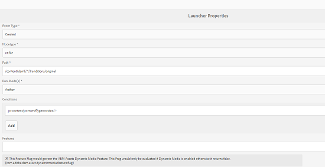

# Offloader für Assets-Workflows{#assets-workflow-offloader}

Mit dem Offloader für Assets-Workflows können Sie es ermöglichen, dass mehrere Instanzen von Adobe Experience Manager (AEM) Assets die Verarbeitungslast auf der primären (führenden) Instanz reduzieren. Die Verarbeitungslast wird unter der führenden Instanz und den verschiedenen Offloader-Instanzen (Arbeiterinstanzen), die Sie hinzufügen, aufgeteilt. Die Verteilung der Verarbeitungslast von Assets erhöht die Effizienz und Geschwindigkeit, mit der Assets in AEM Assets verarbeitet werden. Darüber hinaus unterstützt dieser Ansatz die Zuteilung von dedizierten Ressourcen, um Assets eines bestimmten MIME-Typs zu verarbeiten. Beispielsweise können Sie festlegen, dass ein bestimmter Knoten in Ihrer Topologie ausschließlich InDesign-Assets verarbeitet.

## Konfigurieren der Offloader-Topologie {#configure-offloader-topology}

Verwenden Sie Configuration Manager, um die URL für die Füllzeicheninstanz und die Hostnamen von offloader-Instanzen für Verbindungsanforderungen in der Füllzeicheninstanz hinzuzufügen.

1. Tap/click the AEM logo, and choose **Tools** > **Operations** > **Web Console** to open Configuration Manager.
1. From the Web Console, select **Sling** >  **Topology Management**.

   

1. In the Topology Management page, tap/click the **Configure Discovery.Oak Service** link.

   

1. In the Discovery Service Configuration page, specify the connector URL for the leader instance in the **Topology Connector URLs** field.

   

1. In the **Topology Connector Whitelist** field, specify IP address or host names of offloader instances that are allowed to connect with the leader instance. Tippen/Klicken Sie auf **Speichern**.

   

1. Um die Offloader-Instanzen anzuzeigen, die mit der führenden Instanz verbunden sind, gehen Sie zu **Tools** > **Bereitstellung** > **Topologie** und tippen oder klicken Sie auf die Cluster-Ansicht.

## Deaktivieren des Abladens {#disable-offloading}

1. Tap/click the AEM logo, and choose **Tools** > **Deployment** > **Offloading**. The **Offloading Browser** page displays topics and the server instances that can consume the topics.

   

1. Disable the *com/adobe/granite/workflow/offloading* topic on the leader instances with which users interact to upload or change AEM assets.

   

## Konfigurieren von Workflow-Startern auf der führenden Instanz {#configure-workflow-launchers-on-the-leader-instance}

Configure workflow launchers to use the [!UICONTROL DAM Update Asset Offloading] workflow on the leader instance instead of the **Dam Update Asset** workflow.

1. Tap/click the AEM logo, and choose, **Tools** > **Workflow** > **Launchers** to open the **Workflow Launchers** console.

   

1. Locate the two Launcher configurations with event type **Node Created** and **Node Modified** respectively, which run the **DAM Update Asset** workflow.
1. For each configuration, select the checkbox before it and tap/click the **View Properties** icon from the toolbar to display the **Launcher Properties** dialog.

   

1. From the **Workflow** list, choose [!UICONTROL DAM Update Asset Offloading] and tap/click **Save**.

   

1. Tap/click the AEM logo, and choose, **Tools** > **Workflow** > **Models** to open the **Workflow Models** page.
1. Select the [!UICONTROL DAM Update Asset Offloading] workflow, and tap/click **Edit** from the toolbar to display its details.

   

1. Display the context menu for the **DAM Workflow Offloading** step, and choose **Edit**. Überprüfen Sie den Eintrag im Feld **Auftragsthema** auf der Registerkarte **Generische Argumente** des Konfigurationsdialogfelds.

   

## Deaktivieren der Workflow-Starter auf den Offloader-Instanzen {#disable-the-workflow-launchers-on-the-offloader-instances}

Disable the workflow launchers that run the **DAM Update Asset** workflow on the leader instance.

1. Tap/click the AEM logo, and choose, **Tools** > **Workflow** > **Launchers** to open the **Workflow Launchers** console.

   

1. Locate the two Launcher configurations with event type **Node Created** and **Node Modified** respectively, which run the **DAM Update Asset** workflow.
1. For each configuration, select the checkbox before it and tap/click the **View Properties** icon from the toolbar to display the **Launcher Properties** dialog.

   

1. In the **Activate** section, drag the slider to disable the workflow launcher and tap/click **Save** to disable it.

   

1. Laden Sie alle Assets vom Typ image in die Füllzeicheninstanz hoch. Überprüfen Sie, welche Miniaturansichten für das Asset von der abgeladenen Instanz generiert und zurückportiert wurden.

