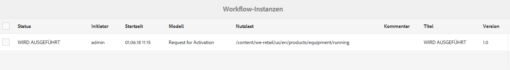
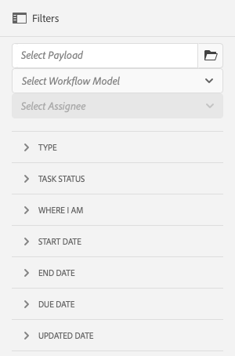
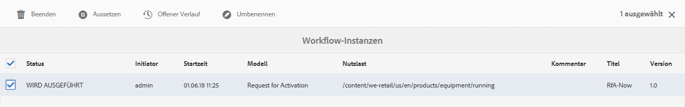
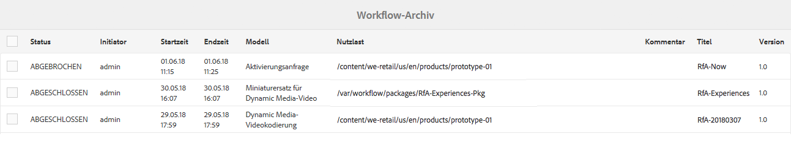
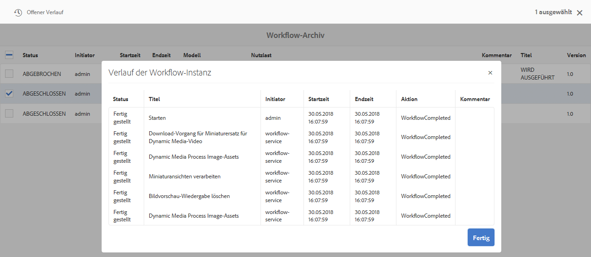
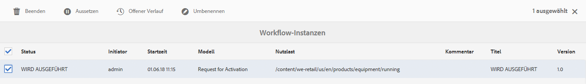
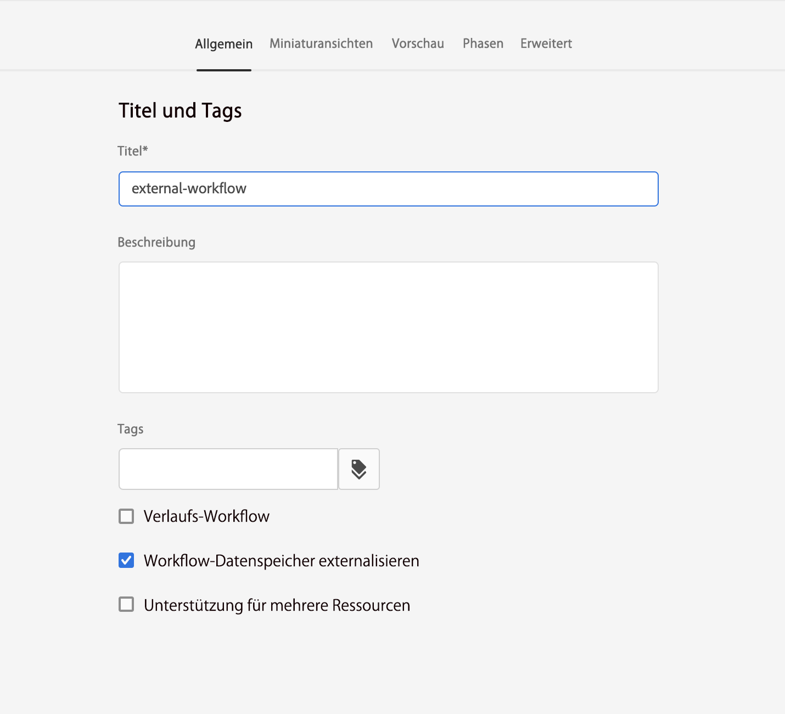

# Verwalten der Workflow-Instanzen{#administering-workflow-instances}

Die Workflow-Konsole stellt mehrere Tools für die Verwaltung von Workflow-Instanzen bereit, um sicherzustellen, dass sie wie erwartet ausgeführt werden.

>[!NOTE]
>
>Die [JMX-Konsole](/help/sites-administering/jmx-console.md#workflow-maintenance) stellt zusätzliche Workflow-Wartungsvorgänge bereit.

Für die Verwaltung Ihrer Workflows steht eine Reihe von Konsolen bereit. Verwenden Sie die [globale Navigation](/help/sites-authoring/basic-handling.md#global-navigation), um das Bedienfeld **Tools** zu öffnen, und wählen Sie dann **Workflow** aus:

* **Modelle**: Workflow-Definitionen verwalten
* **Instanzen**: Laufende Workflow-Instanzen anzeigen und verwalten
* **Starter**: Launches von Workflows verwalten
* **Archiv**: Protokoll der erfolgreich abgeschlossenen Workflows anzeigen
* **Fehler**: Protokoll der mit Fehlern abgeschlossenen Workflows anzeigen
* **Automatisch zuweisen**: Automatische Zuweisung von Workflows zu Vorlagen konfigurieren

## Überwachen des Status von Workflow-Instanzen {#monitoring-the-status-of-workflow-instances}

1. Wählen Sie über die Navigation **Tools** und dann **Workflow** aus.
1. Wählen Sie **Instanzen** aus, um die Liste der aktuell laufenden Workflow-Instanzen anzuzeigen.

   

<!--
## Search Workflow Instances {#search-workflow-instances}

1. Using Navigation select **Tools**, then **Workflow**.
1. Select **Instances** to display the list of workflow instances currently in progress. On the top rail, in the left corner, select **Filters**. Alternatively, you can use the keystrokes alt+1. The following dialog is displayed:

   

1. In the Filter dialog, select the workflow search criteria. You can search based on these inputs:

   * Payload path: Select a specific path
   * Workflow model: Select a workflow model
   * Assignee: Select a workflow Assignee
   * Type: Task, Workflow item, or Workflow Failure
   * Task Status: Active, Complete, or Terminated
   * Where I Am: Owner AND Assignee, Owner only, Assignee only
   * Start Date: Start date before or after a specified date
   * End Date: End date before or after a specified date
   * Due Date: Due date before or after a specified date
   * Updated Date: Updated date before or after a specified date
-->

## Aussetzen, Fortsetzen und Beenden einer Workflow-Instanz {#suspending-resuming-and-terminating-a-workflow-instance}

1. Wählen Sie über die Navigation **Tools** und dann **Workflow** aus.
1. Wählen Sie **Instanzen** aus, um die Liste der aktuell laufenden Workflow-Instanzen anzuzeigen.

   

1. Wählen Sie ein spezifisches Element aus und verwenden Sie dann je nachdem **Beenden**, **Aussetzen** oder **Fortsetzen**. Eine Bestätigung und/oder weitere Details sind erforderlich:

   

## Anzeigen archivierter Workflows {#viewing-archived-workflows}

1. Wählen Sie über die Navigation **Tools** und dann **Workflow** aus.
1. Wählen Sie **Archiv** aus, um die Liste der erfolgreich abgeschlossenen Workflow-Instanzen anzuzeigen.

   

   >[!NOTE]
   >
   >Der Abbruchstatus wird als erfolgreiches Beenden betrachtet, da er infolge der Benutzeraktion auftritt, wie zum Beispiel:
   >
   >* nach der Verwendung der Aktion **Beenden** oder
   >* wenn eine Seite, die Gegenstand eines Workflows ist, (zwangsweise) gelöscht wird, dann wird der Workflow beendet.

1. Wählen Sie ein spezifisches Element und dann **Offener Verlauf** aus, um mehr Details anzuzeigen:

   

## Beheben von Workflow-Instanzfehlern {#fixing-workflow-instance-failures}

Schlägt ein Workflow fehl, ermöglicht Ihnen AEM mit der **Fehler-Konsole** die Untersuchung und das Ergreifen entsprechender Maßnahmen, sobald die ursprüngliche Ursache behoben wurde:

* **Fehlerdetails**
Öffnet ein Fenster zum Anzeigen von **Fehlermeldung**, **Schritt**, und **Fehlerstapel**.

* **Verlauf öffnen**
Die Details des Workflow-Verlaufs werden angezeigt.

* **Schritt erneut ausführen** – Führt die Instanz der Komponente „Script Step“ erneut aus. Verwenden Sie den Befehl „Schritt erneut ausführen“, nachdem Sie die Ursache des ursprünglichen Fehlers behoben haben. Wiederholen Sie zum Beispiel den Schritt nach der Behebung eines Bugs in dem Skript, das vom Prozessschritt ausgeführt wird.
* **Beenden** – Beendet den Workflow, wenn der Fehler eine nicht mit dem Workflow zu vereinbarende Situation verursacht hat. So kann der Workflow beispielsweise von Umgebungsbedingungen abhängen, wie etwa von Informationen im Repository, die nicht mehr für die Workflow-Instanz gelten.
* **Beenden und erneut versuchen** – Dies hat ähnliche Auswirkungen wie **Beenden**, außer dass eine neue Workflow-Instanz mit der ursprünglichen Payload und Beschreibung sowie dem ursprünglichen Titel gestartet wird.

Setzen Sie den Workflow anschließend zur Untersuchung von Fehlern fort oder beenden Sie ihn. Gehen Sie hierzu wie folgt vor:

1. Wählen Sie über die Navigation **Tools** und dann **Workflow** aus.
1. Wählen Sie **Fehler** aus, um die Liste der Workflow-Instanzen anzuzeigen, die nicht erfolgreich abgeschlossen wurden.
1. Wählen Sie ein spezifisches Element und dann die entsprechende Aktion aus:

   

## Regelmäßiges Bereinigen von Workflow-Instanzen {#regular-purging-of-workflow-instances}

Die Minimierung der Anzahl von Workflow-Instanzen steigert die Leistung der Workflow-Engine, sodass Sie regelmäßig abgeschlossene oder laufende Workflow-Instanzen aus dem Repository löschen können.

Konfigurieren Sie die **Adobe Granite Workflow-Bereinigungskonfiguration**, um Workflow-Instanzen je nach ihrem Alter und Status zu löschen. Darüber hinaus können Sie Workflow-Instanzen aller Modelle oder eines bestimmten Modells löschen.

Sie können auch mehrere Konfigurationen des Service erstellen, um Workflow-Instanzen zu löschen, die andere Kriterien erfüllen. Erstellen Sie zum Beispiel eine Konfiguration, mit der die Instanzen eines bestimmten Workflow-Modells gelöscht werden, wenn sie länger als erwartet ausgeführt werden. Erstellen Sie eine weitere Konfiguration, die alle abgeschlossenen Workflows nach einer bestimmten Anzahl von Tagen löscht, um die Größe des Repositorys zu minimieren.

Zum Konfigurieren des Dienstes können Sie die [Web-Konsole](/help/sites-deploying/configuring-osgi.md#osgi-configuration-with-the-web-console) verwenden oder [eine OSGi-Konfiguration zum Repository hinzufügen](/help/sites-deploying/configuring-osgi.md#osgi-configuration-in-the-repository). In der folgenden Tabelle werden die Eigenschaften beschrieben, die für beide Methoden erforderlich sind.

>[!NOTE]
>
>Für das Hinzufügen der Konfiguration zum Repository lautet die Service-PID:
>
>`com.adobe.granite.workflow.purge.Scheduler`
>
>Da der Service ein Factory-Service ist, erfordert der Name des `sling:OsgiConfig`-Knotens einen ein Kennungssuffix, wie zum Beispiel:
>
>`com.adobe.granite.workflow.purge.Scheduler-myidentifier`

<table>
 <tbody>
  <tr>
   <th>Eigenschaftsname (Web-Konsole)</th>
   <th>OSGi-Eigenschaftsname</th>
   <th>Beschreibung</th>
  </tr>
  <tr>
   <td>Auftragsname</td>
   <td>scheduledpurge.name</td>
   <td>Dies ist ein beschreibender Name für die geplante Bereinigung.</td>
  </tr>
  <tr>
   <td>Workflow-Status</td>
   <td>scheduledpurge.workflowStatus</td>
   <td><p>Dies ist der Status der zu bereinigenden Workflow-Instanz. Die folgenden Werte sind gültig:</p>
    <ul>
     <li>ABGESCHLOSSEN: Abgeschlossene Workflow-Instanzen werden gelöscht.</li>
     <li>WIRD AUSGEFÜHRT: Aktuell ausgeführte Workflow-Instanzen werden gelöscht.</li>
    </ul> </td>
  </tr>
  <tr>
   <td>Zu bereinigende Modelle</td>
   <td>scheduledpurge.modelIds</td>
   <td><p>Dies ist die ID der zu bereinigenden Workflow-Modelle. Die ID ist der Pfad zum Modellknoten, zum Beispiel:<br /> /conf/global/settings/workflow/models/dam/update_asset/<br />. </p> <p>Klicken Sie zum Angeben mehrerer Modelle auf die „+“-Schaltfläche innerhalb der Web-Konsole. </p> <p>Geben Sie keinen Wert an, wenn die Instanzen aller Workflow-Modelle bereinigt werden sollen.</p> </td>
  </tr>
  <tr>
   <td>Workflow-Alter</td>
   <td>scheduledpurge.daysold</td>
   <td>Dies gibt das Alter der zu bereinigenden Workflow-Instanz in Tagen an.</td>
  </tr>
 </tbody>
</table>

## Einstellen der maximalen Größe des Posteingangs {#setting-the-maximum-size-of-the-inbox}

Sie können die maximale Größe des Posteingangs durch die Konfiguration des **Adobe Granite Workflow-Services** mithilfe der [Web-Konsole](/help/sites-deploying/configuring-osgi.md#osgi-configuration-with-the-web-console) oder durch das [Hinzufügen einer OSGi-Konfiguration zum Repository](/help/sites-deploying/configuring-osgi.md#osgi-configuration-in-the-repository) einstellen. In der folgenden Tabelle ist die Eigenschaft beschrieben, die Sie für jede Methode konfigurieren.

>[!NOTE]
>
>Für das Hinzufügen der Konfiguration zum Repository lautet die Service-PID:
>
>`com.adobe.granite.workflow.core.WorkflowSessionFactory`.

| Eigenschaftsname (Web-Konsole) | OSGi-Eigenschaftsname |
|---|---|
| Max. Größe für Posteingangsabfrage | granite.workflow.inboxQuerySize |

## Verwenden von Workflow-Variablen für kundeneigene Datenspeicher {#using-workflow-variables-customer-datastore}

Von Workflows verarbeitete Daten werden im von Adobe bereitgestellten Speicher (JCR) gespeichert. Diese Daten können von sensibler Natur sein. Sie können alle benutzerdefinierten Metadaten/Daten in Ihrem eigenen verwalteten Speicher speichern, anstatt die von Adobe bereitgestellte Datenspeicherung zu verwenden. In diesen Abschnitten wird beschrieben, wie Sie diese Variablen für die externe Speicherung einrichten.

### Festlegen des Modells für die Verwendung der externen Datenspeicherung von Metadaten {#set-model-for-external-storage}

Auf der Ebene des Workflow-Modells wird ein Flag bereitgestellt, das angibt, dass das Modell (und seine Laufzeitinstanzen) über eine externe Datenspeicherung von Metadaten verfügt. Workflow-Variablen werden in JCR nicht für die Workflow-Instanzen der Modelle persistiert, die für die externe Speicherung markiert sind.

Die Eigenschaft *userMetadataPersistenceEnabled* wird im *jcr:content-Knoten* des Workflow-Modells gespeichert. Dieses Flag wird in Workflow-Metadaten als *cq:userMetaDataCustomPersistenceEnabled* beibehalten.

Die folgende Illustration zeigt, wie Sie die Hervorhebung in einem Workflow festlegen.



### APIs für Metadaten in der externen Datenspeicherung {#apis-for-metadata-external-storage}

Um die Variablen extern zu speichern, implementieren Sie die APIs, die der Workflow bereitstellt.

UserMetaDataPersistenceContext

Die folgenden Beispiele zeigen die Verwendung der API.

```
@ProviderType
public interface UserMetaDataPersistenceContext {
 
    /**
     * Gets the workflow for persistence
     * @return workflow
     */
    Workflow getWorkflow();
 
    /**
     * Gets the workflow id for persistence
     * @return workflowId
     */
    String getWorkflowId();
 
    /**
     * Gets the user metadata persistence id
     * @return userDataId
     */
    String getUserDataId();
}
```

UserMetaDataPersistenceProvider

```
/**
 * This provider can be implemented to store the user defined workflow-data metadata in a custom storage location
 */
@ConsumerType
public interface UserMetaDataPersistenceProvider {
 
   /**
    * Retrieves the metadata using a unique identifier
    * @param userMetaDataPersistenceContext
    * @param metaDataMap of user defined workflow data metaData
    * @throws WorkflowException
    */
   void get(UserMetaDataPersistenceContext userMetaDataPersistenceContext, MetaDataMap metaDataMap) throws WorkflowException;
 
   /**
    * Stores the given metadata to the custom storage location
    * @param userMetaDataPersistenceContext
    * @param metaDataMap metadata map
    * @return the unique identifier that can be used to retrieve metadata. If null is returned, then workflowId is used.
    * @throws WorkflowException
    */
   String put(UserMetaDataPersistenceContext userMetaDataPersistenceContext, MetaDataMap metaDataMap) throws WorkflowException;
} 
```
