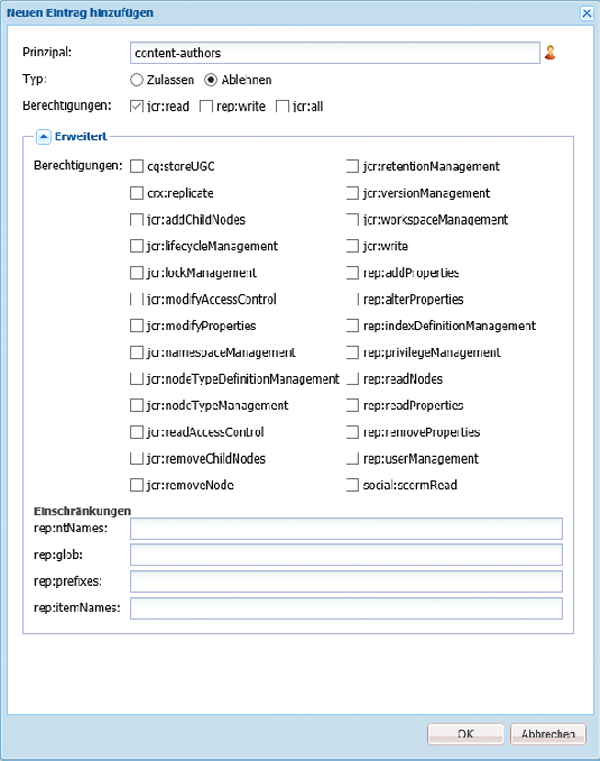

# Verwalten des Zugriffs auf Workflows{#managing-access-to-workflows}

Konfigurieren Sie ACLs entsprechend den Benutzerkonten, um den Start von und die Teilnahme an Workflows zu aktivieren (oder zu deaktivieren).

## Erforderliche Benutzerberechtigungen für Workflows {#required-user-permissions-for-workflows}

Sie können Aktionen für Workflows ausführen, wenn:

* Sie mit dem `admin`-Konto arbeiten;
* das Konto der Standardgruppe `workflow-users` zugewiesen wurde:

   * Diese Gruppe verfügt über alle Berechtigungen, die für den Benutzer zur Ausführung von Workflow-Aktionen erforderlich sind.
   * Wenn sich das Konto in dieser Gruppe befindet, hat es nur Zugriff auf von ihm initiierte Workflows.

* das Konto der Standardgruppe `workflow-administrators` zugewiesen wurde:

   * Diese Gruppe verfügt über alle Berechtigungen, die von den berechtigten Benutzern zur Überwachung und Verwaltung von Workflows erforderlich sind.
   * Wenn sich das Konto in dieser Gruppe befindet, hat es Zugriff auf alle Workflows.

>[!NOTE]
>
>Dies sind die Mindestanforderungen. Das Konto muss zudem der zugewiesene Teilnehmer oder ein Mitglied der zugewiesenen Gruppe sein, um bestimmte Schritte ausführen zu können.

## Konfigurieren des Zugriffs auf Workflows  {#configuring-access-to-workflows}

Workflow-Modelle übernehmen (erben) die Standard-Zugriffssteuerungsliste (ACL, Access Control List), um zu steuern, wie Benutzer mit Workflows interagieren können. Zum Anpassen des Benutzerzugriffs auf einen Workflow bearbeiten Sie die Zugriffssteuerungsliste (ACL) im Repository für den Ordner, der den Knoten des Workflow-Modells enthält:

* [Anwenden einer ACL für das spezifische Workflow-Modell unter /var/workflow/models](/help/sites-administering/workflows-managing.md#apply-an-acl-for-the-specific-workflow-model-to-var-workflow-models)
* [Erstellen eines Unterordners in /var/workflow/models und Anwenden der ACL auf diesen Ordner](/help/sites-administering/workflows-managing.md#create-a-subfolder-in-var-workflow-models-and-apply-the-acl-to-that)

>[!NOTE]
>
>Weitere Informationen zur Verwendung von CRXDE Lite, um ACLs zu konfigurieren, finden Sie in [Verwalten von Zugriffsrechten](/help/sites-administering/user-group-ac-admin.md#access-right-management).

### Anwenden einer ACL für das spezifische Workflow-Modell unter /var/workflow/models  {#apply-an-acl-for-the-specific-workflow-model-to-var-workflow-models}

Wenn das Workflow-Modell in `/var/workflow/models` gespeichert ist, können Sie dem Ordner eine spezifische ACL zuweisen, die nur für diesen Workflow relevant ist:

1. Öffnen Sie CRXDE Lite im Webbrowser ([http://localhost:4502/crx/de](http://localhost:4502/crx/de)).
1. Wählen Sie in der Knotenstruktur den Knoten für den Ordner der Workflow-Modelle aus:

   `/var/workflow/models`

1. Klicken Sie auf die Registerkarte **Zugriffssteuerung**.
1. Klicken Sie in der Tabelle **Richtlinien zur lokalen Zugriffssteuerung** (**Zugriffssteuerungsliste**) auf das Plussymbol, um einen Eintrag hinzuzufügen ****.
1. Fügen Sie im Dialogfeld **Neuen Eintrag hinzufügen** einen neuen ACE mit folgenden Eigenschaften hinzu:

   * **Prinzipal**:  `content-authors`
   * **Typ**: `Deny`
   * **Berechtigungen**:  `jcr:read`
   * **rep:glob**: Verweis auf den spezifischen Workflow

   

   Die Tabelle **Zugriffssteuerungsliste** enthält jetzt die Beschränkung für `content-authors` auf das Workflow-Modell `prototype-wfm-01` .

   

1. Klicken Sie auf **Alle speichern**.

   Der Workflow `prototype-wfm-01` ist nicht länger für Mitglieder der Gruppe `content-authors` verfügbar.

### Erstellen eines Unterordners in /var/workflow/models und Anwenden der ACL auf diesen Ordner {#create-a-subfolder-in-var-workflow-models-and-apply-the-acl-to-that}

Das [Entwicklerteam kann die Workflows in einem Unterordner von folgendem Ordner erstellen](/help/sites-developing/workflows-models.md#creating-a-new-workflow):

`/var/workflow/models`

Vergleichbar mit den DAM-Workflows, die im folgenden Ordner gespeichert sind:

`/var/workflow/models/dam/`

Sie können dann dem Ordner selbst eine ACL hinzufügen.

1. Öffnen Sie CRXDE Lite im Webbrowser ([http://localhost:4502/crx/de](http://localhost:4502/crx/de)).
1. Wählen Sie in der Knotenstruktur den Knoten für den einzelnen Ordner im Ordner für die Workflow-Modelle aus. Beispiel:

   `/var/workflow/models/prototypes`

1. Klicken Sie auf die Registerkarte **Zugriffssteuerung**.
1. Klicken Sie in der Tabelle **Gültige Richtlinie für die Zugriffssteuerung** auf das Pluszeichen, um einen Eintrag **hinzuzufügen**.
1. Klicken Sie in der Tabelle **Richtlinien zur lokalen Zugriffssteuerung** (**Zugriffssteuerungsliste**) auf das Plussymbol, um einen Eintrag hinzuzufügen ****.
1. Fügen Sie im Dialogfeld **Neuen Eintrag hinzufügen** einen neuen ACE mit folgenden Eigenschaften hinzu:

   * **Prinzipal**:  `content-authors`
   * **Typ**: `Deny`
   * **Berechtigungen**:  `jcr:read`

   >[!NOTE]
   >
   >Wie im Abschnitt [Anwenden einer ACL für das spezifische Workflow-Modell unter /var/workflow/models](/help/sites-administering/workflows-managing.md#apply-an-acl-for-the-specific-workflow-model-to-var-workflow-models) können Sie ein „rep:glob“ einfügen, um den Zugriff auf einen spezifischen Workflow zu beschränken.

   

   Die Tabelle **Zugriffssteuerungsliste** enthält jetzt die Beschränkung für `content-authors` auf den Ordner `prototypes` .

   

1. Klicken Sie auf **Alle speichern**.

   Die Modelle im `prototypes`-Ordner sind nicht länger für Mitglieder der Gruppe `content-authors` verfügbar.
