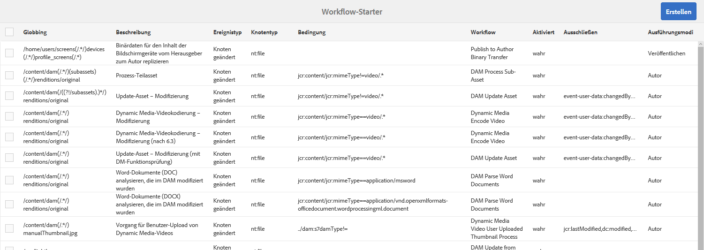
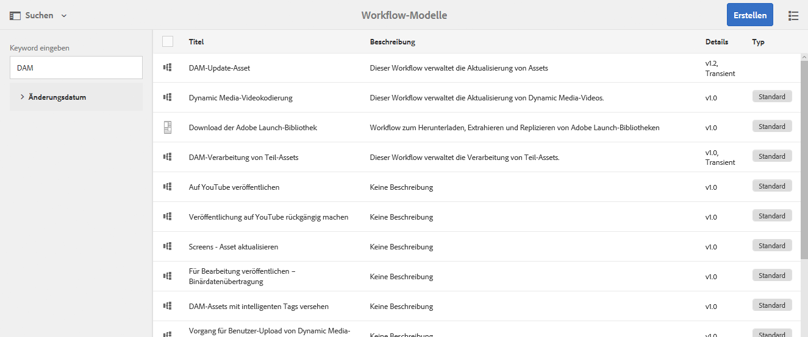
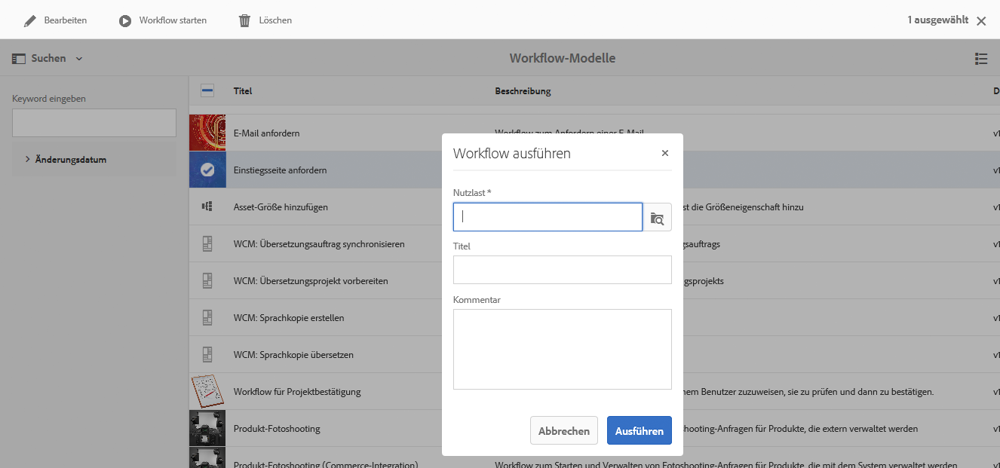
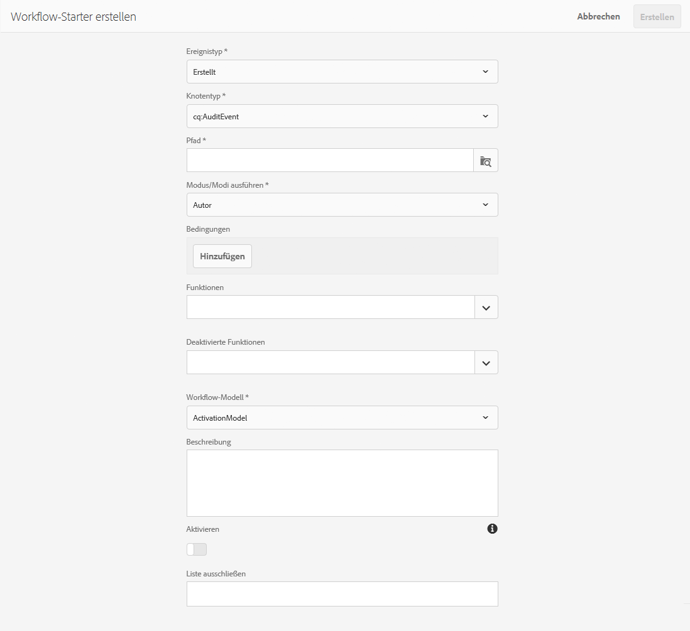

# Starten von Workflows{#starting-workflows}

Bei der Verwaltung von Workflows können Sie sie mit unterschiedlichen Methoden starten:

* manuell:

   * über ein [Workflow-Modell](#workflow-models)
   * mit einem Workflow-Paket für die [Stapelverarbeitung](#workflow-packages-for-batch-processing)

* automatisch:

   * als Reaktion auf Knotenänderungen, [mit einem Starter](#workflows-launchers)

>[!NOTE]
>
>Autoren stehen noch weitere Methoden zur Verfügung. Weitere Informationen finden Sie unter:
>
>* [Anwenden von Workflows auf Seiten](/help/sites-authoring/workflows-applying.md)
>* [Anwenden von Workflows auf DAM-Assets](/help/assets/assets-workflow.md)
>* [AEM Forms](https://helpx.adobe.com/aem-forms/6-2/aem-workflows-submit-process-form.html)
>* [Übersetzungsprojekte](/help/sites-administering/tc-manage.md)

>

## Workflow-Modelle {#workflow-models}

Sie können einen Workflow [basierend auf einem der Modelle](/help/sites-administering/workflows.md#workflow-models-and-instances) starten, die in der Workflow-Modelle-Konsole aufgeführt sind. Die einzige erforderliche Angabe ist die Nutzlast. Sie können aber auch einen Titel und/oder einen Kommentar hinzufügen.

## Workflow-Starter {#workflows-launchers}

Der Workflow-Starter überwacht Änderungen im Inhalts-Repository, um Workflows abhängig vom Speicherort und Ressourcentyp des geänderten Knotens zu starten.

Mit dem **Starter** haben Sie folgende Möglichkeiten:

* die Workflows anzeigen, die bereits für spezifische Knoten gestartet wurden
* einen Workflow auswählen, der gestartet werden soll, wenn ein bestimmter Knoten/Knotentyp erstellt, bearbeitet oder gelöscht wurde
* eine vorhandene Beziehung zwischen einem Workflow und einem Knoten entfernen

Ein Starter kann für jeden beliebigen Knoten erstellt werden. Bei Änderungen an bestimmten Knoten werden jedoch keine Workflows gestartet. Änderungen an Knoten unter den folgenden Pfaden führen nicht zum Start von Workflows:

* `/var/workflow/instances`
* Jeder Workflow-Posteingangsknoten, der sich an einer beliebigen Stelle im Zweig `/home/users` befindet
* `/tmp`
* `/var/audit`
* `/var/classes`
* `/var/eventing`
* `/var/linkchecker`
* `/var/mobile`
* `/var/statistics`

   * Ausnahme: Änderungen an Knoten unter `/var/statistics/tracking` *do* führen dazu, dass Workflows gestartet werden.

In der Standardinstallation sind verschiedene Definitionen enthalten. Sie werden für Aufgaben aus den Bereichen Digital Asset Management und Social Collaboration verwendet:

## Workflow-Pakete für die Stapelverarbeitung {#workflow-packages-for-batch-processing}

Workflow-Pakete sind Pakete, die als Nutzlast zur Verarbeitung an einen Workflow übergeben werden können. Auf diese Weise können mehrere Ressourcen verarbeitet werden.

Ein Workflow-Paket:

* enthält Links zu einer Gruppe von Ressourcen (z. B. Seiten, Assets)
* enthält Paketinformationen, beispielsweise zum Erstellungsdatum, zum Benutzer, der das Paket erstellt hat, und eine kurze Beschreibung
* wird anhand einer speziellen Seitenvorlage definiert; mit solchen Seiten kann der Benutzer die Ressourcen im Paket angeben
* kann mehrfach verwendet werden
* kann vom Benutzer geändert werden (Ressourcen hinzufügen oder entfernen), während die Workflow-Instanz gerade ausgeführt wird

## Starten eines Workflows über die Modelle-Konsole {#starting-a-workflow-from-the-models-console}

1. Navigieren Sie zur Konsole **Modelle** mit **Tools**, **Workflow** und dann **Modelle**.
1. Wählen Sie den Workflow aus (entsprechend der Konsolenansicht). Bei Bedarf können Sie auch die Suche (links oben) verwenden:

   

   >[!NOTE]
   >
   >Der Indikator **[Übergang](/help/sites-developing/workflows.md#transient-workflows)** zeigt Workflows an, für die der Workflow-Verlauf nicht beibehalten wird.

1. Wählen Sie in der Symbolleiste **Workflow starten** aus.
1. Das Dialogfeld „Workflow ausführen“ wird geöffnet. Darin können Sie Folgendes festlegen:

   * **Nutzlast**

      Dabei kann es sich um eine Seite, einen Knoten, ein Asset, ein Paket usw. handeln.

   * **Titel**

      Ein optionaler Titel zur Identifizierung dieser Instanz.

   * **Kommentar**

      Ein optionaler Kommentar, der Details zu dieser Instanz angibt.
   

## Erstellen einer Starter-Konfiguration {#creating-a-launcher-configuration}

1. Navigieren Sie zur Konsole **Workflow-Starter** mit **Tools**, **Workflow** und **Starter**.
1. Wählen Sie **Create** und dann **Add Launcher** aus, um das Dialogfeld zu öffnen:

   

   * **Ereignistyp**

      Der Ereignistyp, der den Workflow startet:

      * Erstellt
      * Geändert
      * Entfernt
   * **Knotentyp**

      Der Typ des Knotens, für den der Workflow-Starter gilt.

   * **Pfad**

      Der Pfad, auf den der Workflow-Starter angewendet wird.

   * **Modus/Modi ausführen**

      Der Servertyp, für den der Workflow-Starter gilt. Wählen Sie **Autor**, **Veröffentlichen** oder **Autor und Veröffentlichen** aus.

   * **Bedingungen**

      Eine Liste der Bedingungen für Knotenwerte, die bei der Auswertung bestimmen, ob der Workflow gestartet wird. Beispielsweise führt die folgende Bedingung zum Start des Workflows, wenn für den Knoten als name-Eigenschaft der Wert „User“ festgelegt wurde:

      name==User

   * **Funktionen**

      Eine Liste der zu aktivierenden Funktionen. Wählen Sie die benötigte(n) Funktion(en) über den Dropdown-Selektor aus.

   * **Deaktivierte Funktionen**

   Eine Liste der zu deaktivierenden Funktionen. Wählen Sie die benötigte(n) Funktion(en) über den Dropdown-Selektor aus.

   * **Workflow-Modell**

      Der Workflow, der gestartet wird, wenn der Ereignistyp auf dem Knotentyp und/oder Pfad unter der definierten Bedingung auftritt.

   * **Beschreibung**

      Ihr eigener Text zur Beschreibung und Identifizierung der Starter-Konfiguration.

   * **Aktivieren**

      Steuert, ob der Workflow-Starter aktiviert ist:

      * Wählen Sie **Aktivieren** aus, um Workflows zu starten, wenn die Konfigurationseigenschaften erfüllt sind.
      * Wählen Sie **Deaktivieren** aus, wenn der Workflow nicht ausgeführt werden soll (selbst dann nicht, wenn die Konfigurationseigenschaften erfüllt sind).
   * **Liste ausschließen**

      Gibt alle JCR-Ereignisse an, die ausgeschlossen werden sollen (d. h. ignorieren), wenn bestimmt wird, ob ein Workflow ausgelöst werden soll.

      Bei dieser Startereigenschaft handelt es sich um eine Reihe von kommagetrennten Elementen: ``

      * `property-name` ignoriert alle `jcr`-Ereignisse, die beim festgelegten Eigenschaftsnamen ausgelöst werden. ``
      * `event-user-data:<*someValue*>` ignoriert alle Ereignisse, die das  `*<someValue*`>- `user-data` Set über die  [ `ObservationManager` API] enthalten (https://www.adobe.io/experience-manager/reference-materials/spec/jsr170/javadocs/jcr-2.0/javax/jcr/observation/ObservationManager.html#setUserData(java.lang.String).

      Zum Beispiel:

      `jcr:lastModified,dc:modified,dc:format,jcr:lastModifiedBy,imageMap,event-user-data:changedByWorkflowProcess`

      Diese Funktion kann verwendet werden, um alle Änderungen zu ignorieren, die von einem anderen Workflow-Prozess ausgelöst werden, indem das Ausschlusselement hinzugefügt wird:

      `event-user-data:changedByWorkflowProcess`

1. Wählen Sie **Erstellen** aus, um den Starter zu erstellen, und kehren Sie zur Konsole zurück.

   Sobald das entsprechende Ereignis auftritt, wird der Starter ausgelöst und der Workflow wird gestartet.

## Verwalten einer Starter-Konfiguration {#managing-a-launcher-configuration}

Nachdem Sie Ihre Starter-Konfiguration erstellt haben, können Sie dieselbe Konsole verwenden, um die Instanz auszuwählen, dann **Eigenschaften anzeigen** (und sie bearbeiten) oder **Löschen**.
