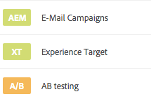

# Verwalten von Aktivitäten{#managing-activities}

Mithilfe der Aktivitätskonsole können Sie die Marketing-[Aktivitäten](/help/sites-authoring/personalization.md#activities) Ihrer Marken erstellen, organisieren und verwalten:

* Fügen Sie Marken hinzu.
* Fügen Sie für jede Marke Aktivitäten hinzu und konfigurieren Sie diese.
* Verwalten Sie Aktivitäten.

>[!NOTE]
>
>Verwenden Sie Adobe Target als Targeting-Engine, können Sie die [Leistungsdaten Ihrer Aktivitäten anzeigen](#viewing-performance-and-converting-winning-experiences-a-b-test). Wenn Sie mit A/B-Tests arbeiten, können Sie die [Gewinner konvertieren](#viewing-performance-and-converting-winning-experiences-a-b-test).

Aktivitäten lassen sich in der Aktivitätskonsole nach Marke sortieren. Verwenden Sie Marken und Ordner, um Aktivitäten zu strukturieren und organisieren. Navigieren Sie durch die Aktivitätskonsole, indem Sie auf **Personalisierung** klicken oder tippen und **Aktivitäten** auswählen.

Activities are available in Targeting mode for [authoring targeted content](/help/sites-authoring/content-targeting-touch.md), where you can also create activities. Im Targeting-Modus erstellte Aktivitäten werden in der Aktivitätskonsole aufgeführt.

Aktivitäten werden mit einer Beschriftung versehen, die beschreibt, um welche Aktivitätsart es sich handelt:

* XT – Erlebnis-Targeting in Adobe Target
* A/B – A/B-Tests in Adobe Target
* AEM – Targeting des Adobe Experience Manager (Grundlage: ContextHub oder Client Context)

>[!NOTE]
>
>Welche Aktivitätstypen zur Verfügung stehen, hängt von folgenden Faktoren ab:

>* Bei Aktivierung der Option **xt_only** im Adobe Target-Mandanten (Client-Code), der auf AEM-Seite für die Verbindung zu Adobe Target verwendet wird, können Sie in AEM ausschließlich **XT-Aktivitäten** erstellen.
   >
* Ist die Option **xt_only** **nicht** im Adobe Target-Mandanten (Client-Code) aktiviert, können Sie in AEM **sowohl** XT- als auch A/B-Aktivitäten erstellen.

**Zusätzlicher Hinweis:** Bei der Option **xt_only** handelt es sich um eine Einstellung, die auf einen bestimmten Target-Mandanten (Clientcode) angewendet wird und nur in Adobe Target bearbeitet werden kann. Die Option kann nicht in AEM aktiviert oder deaktiviert werden.

>[!CAUTION]
Sie müssen den Aktivitätseinstellungsknoten **cq:ActivitySettings** auf der Veröffentlichungsinstanz sichern, sodass dieser für normale Benutzer nicht zugänglich ist. Der Aktivitätseinstellungsknoten sollte ausschließlich für den Dienst zur Verfügung stehen, mit dem die Aktivitätssynchronisierung mit Adobe Target durchgeführt wird.
Detaillierte Informationen finden Sie unter [Voraussetzungen für die Integration in Adobe Target](/help/sites-administering/target-requirements.md#securingtheactivitysettings).

## Erstellen von Marken mithilfe der Aktivitätskonsole {#creating-a-brand-using-the-activities-console}

Erstellen Sie eine Marke, deren Marketingaktivitäten Sie verwalten möchten.

When you create a brand using the Activities console, it also appears in the [Offers console](/help/sites-authoring/offerlib.md) where you can create offers for the experiences of your activities.

1. Klicken oder tippen Sie in der Navigationskonsole auf **Personalisierung**. Klicken oder tippen Sie auf **Aktivitäten**.

   

1. Klicken oder tippen Sie in der Aktivitätskonsole auf **Erstellen** und anschließend auf **Marke erstellen**.
1. Wählen Sie die Markenvorlage aus und klicken oder tippen Sie auf **Weiter**.
1. Geben Sie den Namen der Marke an, der in den Konsolen „Aktivitäten“ und „Angebote“ angezeigt werden soll. Wenn gewünscht, können Sie zudem einen oder mehrere Tags auswählen, um diese mit der Marke zu verknüpfen.
1. Klicken oder tippen Sie auf **Erstellen**. Die Marke erscheint nun in der Aktivitätskonsole.

## Hinzufügen/Bearbeiten von Aktivitäten mithilfe der Aktivitätskonsole {#adding-editing-an-activity-using-the-activities-console}

Fügen Sie eine Aktivität hinzu oder bearbeiten Sie eine bestehende Aktivität, um Ihre Marketinganstrengungen auf bestimmte Zielgruppen abzustimmen. Beim Erstellen oder Bearbeiten von Aktivitäten werden folgende Daten festgelegt:

* **Name:** der Name der Aktivität.
* **Targeting-Engine:** Wählen Sie [AEM](/help/sites-authoring/personalization.md#aem) oder [Adobe Target](/help/sites-authoring/personalization.md#adobe-target) als Engine für zielgerichtete Inhalte aus.

* **Wählen Sie eine Target-Konfiguration aus** (nur Adobe Target): die Cloud-Konfiguration, mit deren Hilfe sich diese Aktivität mit Adobe Target verbindet. Diese Option ist nur verfügbar, wenn Adobe Target als Targeting-Engine ausgewählt wurde.
* **Aktivitätstyp: **Der Aktivitätstyp - A/B-Test oder Erlebnis-Targeting
* **Vorgabe** (optional): Geben Sie eine Beschreibung der Aktivität ein.
* **Erlebnisse:** Zuordnungen der Zielgruppennamen und Marketingsegmente, die angesprochen werden sollen.
* **** Traffic-Prozentwerte: Wenn A/B-Test ausgewählt ist, können Sie ändern, wie viel Traffic (in Prozent) zu jedem Erlebnis geleitet wird.
* **Dauer:** Zeitraum, in dem die Aktivität aktiv ist.
* **Priorität:** relative Wichtigkeit der Aktivität. Stellen verschiedene Aktivitäten Inhalte für die gleichen Benutzersegmente bereit, wird eine Aktivität mit höherer Priorität bevorzugt.
* **** Zielmetrik: Wenn Adobe Target als Targeting-Engine ausgewählt ist, können Sie der Aktivität Erfolgsmetriken hinzufügen. Es muss mindestens eine Erfolgsmetrik festgelegt werden.

>[!NOTE]
Neue Adobe Target-Aktivitäten müssen im Editor für zielgerichtete Inhalte ***erstellt*** werden, nicht in der Konsole **Aktivitäten**, da die Synchronisierung mit Adobe Target in diesem Fall fehlschlägt.
Bestehende Adobe Target-Aktivitäten können jedoch in der Konsole bearbeitet werden.

So fügen Sie eine Aktivität hinzu:

1. Click or tap the brand for which you are creating the activity, and then click or tap **Create **then** Create Activity. **If editing, select the activity in the Master Area screen and clicking or tapping **Edit Activity**.
1. Machen Sie folgende Angaben und klicken oder tippen Sie dann auf **Weiter**:

   * Der Name der Aktivität.
   * Die zu verwendende Targeting-Engine. Standardmäßig ist ContextHub (AEM) ausgewählt. Sollten Sie Adobe Target verwenden, erstellen Sie die Aktivität im Editor für zielgerichtete Inhalte.
   * Haben Sie Adobe Target als Targeting-Engine ausgewählt, wählen Sie die Cloud-Konfiguration aus, die für die Verbindung mit Adobe Target verwendet werden soll, oder bearbeiten Sie diese. (Achten Sie darauf, kein Framework auszuwählen, das für die Cloud-Konfiguration erstellt wurde.)
   * (Optional) Das Ziel oder die Beschreibung der Aktivität.
   * Wählen Sie den Aktivitätstyp aus.

1. Fügen Sie der Aktivität eines oder mehr Erlebnisse hinzu. Klicken oder tippen Sie auf **Erlebnis hinzufügen**.
1. Wenn Sie AEM-Targeting oder Adobe Target (Erlebnis-Targeting) verwenden:

   1. Klicken Sie auf oder tippen Sie auf **Zielgruppe auswählen **und wählen Sie das Segment aus, das Ihr Erlebnis als Ziel hat.
   1. Klicken oder tippen Sie auf **Erlebnis hinzufügen**, geben Sie einen Namen ein und klicken oder tippen Sie auf **OK**. 

   1. Klicken oder tippen Sie auf **Weiter**.
   Wenn Sie A/B-Tests in Adobe Target verwenden:

   1. Klicken oder tippen Sie auf den Stift im Zielgruppenfeld, um eine Zielgruppe auszuwählen.
   1. Klicken oder tippen Sie auf **Erlebnis hinzufügen**, geben Sie einen Namen ein und klicken oder tippen Sie auf **OK**. 

   1. Geben Sie den prozentualen Anteil des Traffics ein, der auf die jeweiligen Erlebnisse umgelenkt wird.
   1. Klicken oder tippen Sie auf **Weiter**.

1. Verwenden Sie das Dropdown-Menü **Start**, um festzulegen, wann die Aktivität beginnen soll. Wählen Sie einen der folgenden Werte aus:

   * **Ist diese Option aktiviert**, beginnt die Aktivität, sobald die Seite aktiviert wird, auf der sich der zielgerichtete Inhalt befindet.
   * **Angegeb. Datum und Zeit**: ein bestimmter Zeitpunkt. Wurde diese Option ausgewählt, klicken oder tippen Sie auf das Kalendersymbol, wählen Sie ein Datum aus und geben Sie die Uhrzeit an, zu der die Aktivität online gehen soll.

1. Verwenden Sie das Dropdown-Menü „Ende“, um festzulegen, wann die Aktivität beendet werden soll. Wählen Sie einen der folgenden Werte aus:

   * **Ist diese Option deaktiviert**, endet die Aktivität, sobald die Seite deaktiviert wird, auf der sich der Targeting-Inhalt befindet.
   * **Angegeb. Datum und Zeit**: ein bestimmter Zeitpunkt. Wurde diese Option ausgewählt, klicken oder tippen Sie auf das Kalendersymbol, wählen Sie ein Datum aus und geben Sie die Uhrzeit an, zu der die Aktivität beendet werden soll.

1. Soll die Aktivität eine Priorität erhalten, wählen Sie mit dem Schieberegler entweder **Niedrig**, **Normal** oder **Hoch** aus.
1. Verwenden Sie Adobe Target als Targeting-Engine, wählen Sie aus, welche Metriken mit dieser Aktivität gemessen werden sollen. See [Configuring the Activity and Setting Goals](/help/sites-authoring/content-targeting-touch.md) for more information on the success metrics available. Sie müssen mindestens ein Ziel auswählen.
1. Klicken oder tippen Sie auf **Speichern**.

   >[!NOTE]
   Nach dem Erstellen einer Aktivität muss diese zunächst veröffentlicht werden, damit sie verfügbar ist.

## Aktivitäten veröffentlichen und Veröffentlichungen rückgängig machen {#publishing-and-unpublishing-activities}

Sollen Aktivitäten verfügbar sein, müssen diese zunächst veröffentlicht werden. Auf der anderen Seite möchten Sie die Verfügbarkeit von Aktivitäten möglicherweise verhindern, was durch das Rückgängigmachen einer Veröffentlichung erzielt wird.

>[!NOTE]
Wenn Sie die Veröffentlichung einer Aktivität rückgängig machen,

So veröffentlichen Sie Aktivitäten oder machen deren Veröffentlichung rückgängig:

1. Klicken oder tippen Sie auf die Marke und anschließend auf das Gebiet, das die Aktivität enthält, die veröffentlicht bzw. deren Veröffentlichung rückgängig gemacht werden soll.
1. Klicken oder tippen Sie auf das Symbol neben der Aktivität oder den Aktivitäten, die Sie veröffentlichen bzw. deren Veröffentlichung Sie rückgängig machen möchten.

   

1. Soll die Aktivität veröffentlicht werden, klicken oder tippen Sie auf **Veröffentlichen**. Soll die Veröffentlichung der Aktivität rückgängig gemacht werden, klicken oder tippen Sie auf **Veröffentlichung rückgängig machen**. Die jeweilige Aktion wird durchgeführt und der Status der Aktivitäten in der Aktivitätskonsole angepasst (möglicherweise muss die Seite hierzu aktualisiert werden).

## Aktivitäten in den Autoren- und Veröffentlichungsinstanzen {#activities-on-author-and-publish-instances}

Wird eine Aktivität aktiviert, deren Targeting-Engine Adobe Target ist, wird in der Autoreninstanz eine zweite Aktivität erstellt:

* Mit der Aktivität in der Autoreninstanz wird die Aktivität in der Autoreninstanz verfolgt, was sich für die Simulation des Besuchererlebnisses oft als sehr nützlich erweist. Die für diese Aktivität aufgezeichneten Analysedaten spiegeln lediglich wider, was in der Autoreninstanz geschieht.
* Die Aktivität in der Veröffentlichungsinstanz spiegelt die Aktivität auf dem Veröffentlichungsserver wider und reagiert auf Serveranfragen. Hierbei handelt es sich um die Aktivität, die auf der öffentlichen Website angezeigt wird. Für die Verfolgung und Analyse der Verwendung der online befindlichen Site wird nur die Aktivität der Veröffentlichungsinstanz benötigt.

## Anzeigen der Performance und Konvertieren von Gewinnererlebnissen (A/B-Tests) {#viewing-performance-and-converting-winning-experiences-a-b-test}

Sie können die Leistung beliebiger Adobe Target-Aktivitäten (XT oder A/B) anzeigen. Wenn Sie A/B-Tests verwenden, können Sie zudem die Gewinnererlebnisse in Standarderlebnisse konvertieren.

So sehen Sie die Leistung ein und konvertieren Gewinnererlebnisse:

1. In **Personalization**, click or tap **Activities** to navigate to the **Activities** console.
1. Klicken oder tippen Sie auf die Marke, deren Aktivitäten Sie anzeigen möchten.
1. Select the activity and click or tap **View Properties** and click the **Reports** tab and select the activity that you want to view performance for/convert winning experiences for. Die Leistungsdaten werden nun angezeigt.

   

1. Click or tap the **Push winner** link to push that experience as the default experience.

   Durch die Konvertierung des Gewinners geschieht Folgendes:

   * Die aktuelle Aktivität wird deaktiviert
   * Es werden alle Seiten modifiziert und zielgerichtete Inhalte durch die Inhalte des Gewinnererlebnisses ersetzt. The content of the winning experience becomes part of the normal page **without** targeting.
   

   Gewinnererlebnisse sind diejenigen Erlebnisse, die in den Berichten größere Steigerungen als andere erzielen. Diese Steigerungen werden aus der Konversionsrate errechnet.

1. Klicken oder tippen Sie auf **Ja**, um zu bestätigen, dass das Gewinnererlebnis konvertiert werden soll. Dies führt zur Deaktivierung der aktuellen Aktivität, die durch die Inhalte des Gewinnererlebnisses ersetzt wird.

## Synchronisieren von Aktivitäten mit Adobe Target {#synchronizing-activities-with-adobe-target}

Aktivitäten, deren Targeting-Engine Adobe Target ist, werden mit Adobe Target-Kampagnen synchronisiert. Eine Aktivität wird automatisch mit Adobe Target synchronisiert, wenn folgende Bedingungen erfüllt sind:

* Die Aktivität weist mindestens ein Erlebnis auf.
* Mindestens ein Erlebnis enthält ein ihm zugewiesenes Segment und ein Angebot.
* Jedes Erlebnis der Aktivität muss die gleiche Anzahl Angebote enthalten.

Diese Bedingungen gelten für Aktivitäten in den Autoren- und Veröffentlichungsinstanzen.

Bei der Synchronisierung einer Aktivität wird in Adobe Target eine entsprechende Kampagne erstellt:

* Aktivitäten in der Veröffentlichungsinstanz tragen den gleichen Namen wie die entsprechende Adobe Target-Kampagne.
* Activities on the author instance correspond with Target campaigns of the same name with the `_author` suffix.

Die _author-Aktivitäten werden unmittelbar bei Bearbeitung der Aktivität synchronisiert. Diese sofortige Synchronisierung ermöglicht die Simulation der Aktivitäten mit Client Context oder ContextHub.

Veröffentlichte Aktivitäten werden zum Zeitpunkt ihrer Veröffentlichung mit der AEM-Veröffentlichungsinstanz synchronisiert.

## Fehlerbehebung bei der Aktivitätssynchronisierung {#troubleshooting-activity-synchronization}

When AEM synchronizes an activity with Adobe Target, AEM includes a property of the activity named `thirdPartyId`. Der Wert dieser Eigenschaft basiert auf dem Aktivitätenpfad im AEM-Verzeichnis. In Adobe Target dürfen unterschiedliche Kampagnen für `thirdPartyId` keinesfalls den gleichen Wert aufweisen. Somit schlägt die Synchronisierung von Aktivitäten fehl, wenn eine bestehende Kampagne (mit anderem Aktivitätstyp AB, XT) in Adobe Target über den gleichen Wert für `thirdPartyId` verfügt.

Dies kann unter folgenden Umständen auftreten:

1. Eine Aktivität wird erstellt und mit Adobe Target synchronisiert.
1. Auf einer anderen AEM-Instanz wird für die gleiche Marke und unter dem gleichen Namen eine weitere Aktivität erstellt. Wird versucht, diese Aktivität zu synchronisieren, schlägt der Vorgang fehl.

Dies kann zudem auch unter den folgenden Umständen auftreten:

1. Eine Aktivität wird erstellt und mit Adobe Target synchronisiert. Die Aktivität wird anschließend aus AEM gelöscht.
1. Eine Aktivität wird in der gleichen Marke erstellt und erhält den gleichen Namen wie die gelöschte Aktivität. Wird versucht, diese Aktivität zu synchronisieren, schlägt der Vorgang fehl.

Möchten Sie Probleme bei der Synchronisierung vermeiden, geben Sie Aktivitäten stets eindeutige Namen. Kann eine Aktivität nicht synchronisiert werden, löschen Sie die Kampagne in Adobe Target mit dem gleichen Namen, falls diese Kampagne nicht mehr verwendet wird.

>[!NOTE]
When you create a campaign in Adobe Target, it assigns a property called `thirdPartyId t`o each campaign. Sollten Sie die Kampagne in Adobe Target löschen, wird die Eigenschaft `thirdPartyId` nicht gelöscht. Die `thirdPartyId` kann nicht für Kampagnen unterschiedlicher Typen (AB, XT) wiederverwendet werden und lässt sich nicht manuell löschen. Benennen Sie zur Vermeidung dieses Problems jede Kampagne einen eindeutigen Namen; Kampagnennamen können daher nicht in verschiedenen Kampagnentypen wiederverwendet werden.
Sollten Sie den gleichen Namen für verschiedene Kampagnentypen verwenden, wird die bereits bestehende Kampagne überschrieben.
Sollte Ihnen beim Synchronisieren die Fehlermeldung „Anforderung fehlgeschlagen. `thirdPartyId` ist bereits vorhanden“ angezeigt werden, ändern Sie den Kampagnennamen und synchronisieren Sie erneut.

