# Adobe Campaign-Komponenten{#adobe-campaign-components}

Wenn Sie eine Integration mit Adobe Campaign durchführen, stehen Ihnen Komponenten für die Arbeit mit Newslettern und Formularen zur Verfügung. Beide werden in diesem Dokument beschrieben.

>[!CAUTION]
>
>Die E-Mail-Komponenten von AEM werden nicht mehr unterstützt. Aufgrund der Art von E-Mails, bei denen Inhalt und Stil zusammengeführt werden, können die standardmäßig von AEM bereitgestellten E-Mail-Komponenten von Kunden nur eingeschränkt wiederverwendet werden, da benutzerdefinierte Stile in allen Komponenten implementiert werden müssen, die für Projekte erforderlich sind.
>
>E-Mail-Komponenten können auf Projektebene implementiert werden. Die veralteten AEM-E-Mail-Komponenten veranschaulichen, wie dies erreicht werden kann. Verwenden Sie diese veralteten Komponenten jedoch nicht für Projekte.

## Adobe Campaign-Newsletter-Komponenten {#adobe-campaign-newsletter-components}

Folgen Sie in den Campaign-Komponenten den Best Practices, die Sie unter [Best Practices für E-Mail-Vorlagen](/help/sites-administering/best-practices-for-email-templates.md) finden und die auf der Adobe-Markup-Sprache [HTL](https://helpx.adobe.com/de/experience-manager/htl/using/overview.html) basieren.

Wenn Sie eine E-Mail oder einen Newsletter öffnen, der oder die für die Integration mit Adobe Campaign konfiguriert wurde, werden Ihnen im Abschnitt **Adobe Campaign-Newsletter** folgende Optionen angezeigt:

* Überschrift (Campaign)
* Bild (Campaign)
* Link (Kampagne)
* Scene7-Bildvorlage (Campaign)
* Zielgerichteter Verweis (Campaign)
* Text und Bild (Campaign).
* Text und Personalisierung (Kampagne)

Eine Beschreibung dieser Komponenten finden Sie im folgenden Abschnitt.

Die Komponenten werden wie folgt angezeigt:

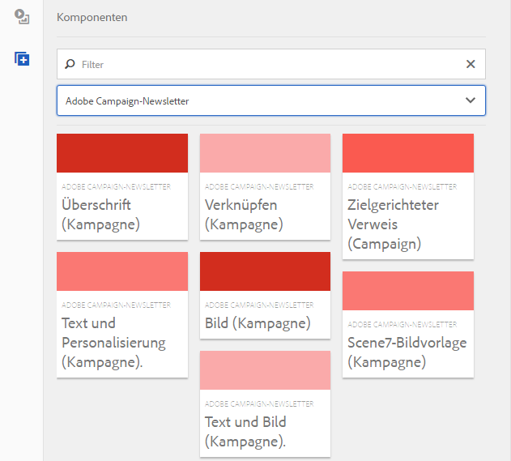

### Überschrift (Campaign) {#heading-campaign}

Die Titelkomponente kann entweder:

* Den Namen der aktuellen Seite anzeigen, indem Sie das Feld **Titel** leer lassen.
* Einen Text anzeigen, den Sie im Feld **Titel** angeben.

Sie bearbeiten die Komponente **Überschrift (Campaign)** direkt. Frei lassen, um den Seitentitel zu verwenden.

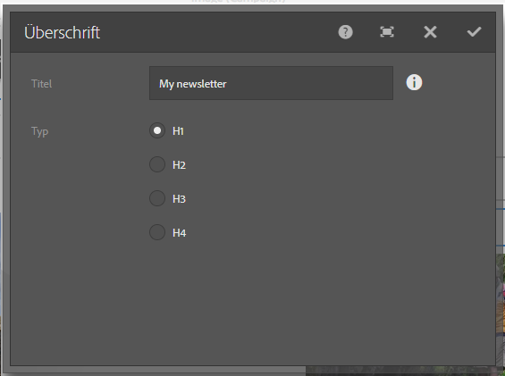

Sie können Folgendes konfigurieren:

* **Titel**
Wenn Sie einen anderen Namen als den Seitentitel verwenden möchten, geben Sie ihn hier ein.

* **Überschriftenebene (1, 2, 3, 4)**
Die Überschriftenebene basierend auf der HTML-Überschriftgröße (1–4).

Im folgenden Beispiel sehen Sie, wie die Komponente „Überschrift (Kampagne)“ dargestellt wird.

### Bild (Campaign) {#image-campaign}

Die Komponente „Bild (Campaign)“ zeigt ein Bild und begleitenden Text gemäß den festgelegten Parametern an.

Sie können ein Bild hochladen und dieses anschließend bearbeiten und anpassen (beispielsweise zuschneiden, drehen oder Links/Titel/Text hinzufügen).

Sie können ein Bild direkt aus dem [Asset-Browser](/help/sites-authoring/author-environment-tools.md#assetsbrowsertouchoptimizedui) per Drag-and-Drop auf die Komponente oder in deren [Konfigurationsdialogfeld](/help/sites-authoring/editing-content.md#editconfigurecopycutdeletepastetouchoptimizedui) ziehen und ablegen. Sie können ein Bild auch aus dem Dialogfeld „Konfigurieren“ hochladen. Dieses Dialogfeld steuert auch alle Definitionen und Bearbeitungen des Bildes:

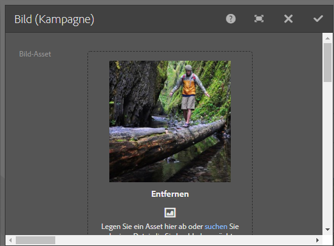

>[!NOTE]
>
>Sie müssen im Feld **ALT-Text** Informationen eingeben, da das Bild sonst nicht gespeichert werden kann.

Nachdem das Bild hochgeladen wurde (und nicht vorher), können Sie es mittels [Direktbearbeitung](/help/sites-authoring/editing-content.md#editcontenttouchoptimizedui) zuschneiden und drehen:

>[!NOTE]
>
>Der integrierte Editor zeigt bei der Bearbeitung die Originalgröße und das Seitenverhältnis des Bildes an. Sie können auch die Höhe und die Breite festlegen. Alle in den Eigenschaften definierten Beschränkungen der Größe und des Seitenverhältnisses werden angewendet, sobald Sie Ihre Änderungen speichern.
>
>Abhängig von Ihrer Instanz können Mindest- und Höchstbeschränkungen auch durch das [Design der Seite](/help/sites-developing/designer.md) vorgegeben sein. Diese werden bei der Implementierung des Projekts festgelegt.

Im Vollbildbearbeitungsmodus stehen verschiedene zusätzliche Optionen zur Verfügung, beispielsweise Karte und Zoom:

Wenn ein Bild geladen wird, können folgende Konfigurationen durchgeführt werden:

* **Zuweisen**
Wählen Sie „Zuweisen“ aus, um ein Bild zuzuweisen. Sie legen fest, wie die Imagemap (Rechteck, Polygon usw.) erstellt werden soll, und geben an, worauf der Bereich verweisen soll.

* **Zuschneiden**
Wählen Sie „Zuschneiden“ aus, um ein Bild zuzuschneiden. Verwenden Sie die Maus, um das Bild zuzuschneiden.

* **Drehen**
Wählen Sie „Drehen“ aus, um ein Bild zu drehen. Wiederholen Sie das Drehen so lange, bis das Bild die gewünschte Ausrichtung hat.

* **Entfernen**
Damit entfernen Sie das aktuelle Bild.

* Zoom-Leiste (nur klassische Benutzeroberfläche)
Verwenden Sie den Regler unter dem Bild (und über den Schaltflächen „OK“ und „Abbrechen“), um das Bild ein- und auszuzoomen.
* **Titel**
Der Titel des Bildes.

* **Alt-Text**
Ein alternativer Text, der für barrierefreie Inhalte verwendet wird.

* **Verknüpfen mit**
Erstellen Sie einen Link zu Assets oder anderen Seiten innerhalb Ihrer Website.

* **Beschreibung**
Eine Beschreibung des Bildes.

* **Größe**
Legt die Höhe und Breite des Bildes fest.

>[!NOTE]
>
>Sie müssen im Feld **ALT-Text** der Registerkarte **Erweitert** Informationen eingeben, da das Bild sonst nicht gespeichert werden kann und die folgende Fehlermeldung ausgegeben wird:
>
>`Validation failed. Verify the values of the marked fields.`
>

Im folgenden Beispiel sehen Sie, wie die Komponente „Bild (Kampagne)“ dargestellt wird.

### Link (Kampagne) {#link-campaign}

Mithilfe der Komponente „Link (Campaign)“ können Sie Ihrem Newsletter einen Link hinzufügen.

Folgendes können Sie in den Registerkarten **Anzeige**, **URL-Info** oder **Erweitert** konfigurieren:

* **Verknüpfungsbeschriftung**
Die Beschriftung des Links. Dies ist der Text, der den Benutzern angezeigt wird.

* **Link-QuickInfo**
Mit dieser Option werden weitere Informationen zur Verwendung des Links hinzugefügt.

* **LinkType**
Wählen Sie in der Dropdown-Liste zwischen **Benutzerdefinierte URL** und **Adaptives Dokument**. Dieses Feld ist obligatorisch. Wenn Sie „Benutzerdefinierte URL“ auswählen, können Sie die URL des Links angeben. Entscheiden Sie sich für ein adaptives Dokument, können Sie den Dokumentenpfad festlegen.

* **Zusätzlicher URL-Parameter**
Fügen Sie weitere URL-Parameter hinzu. Klicken Sie auf „Element hinzufügen“, um mehrere Elemente hinzuzufügen.

>[!NOTE]
>
>Sie müssen im Feld **Verknüpfungstyp** auf der Registerkarte **URL-Info** Daten eingeben, da die Komponente sonst nicht gespeichert werden kann und folgende Fehlermeldung ausgegeben wird:
>
>`Validation failed. Verify the values of the marked fields.`
>

Im folgenden Beispiel sehen Sie, wie die Komponente „Link (Kampagne)“ dargestellt wird.

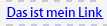

### Dynamic Media Classic (Scene7)-Bildvorlage (Kampagne) {#scene-image-template-campaign}

Dynamic Media Classic Scene7-Bildvorlagen sind in Schichten angeordnete Bilddateien, in denen Inhalte und Eigenschaften mit Parametern versehen werden können, um sie zu variieren. Mithilfe der Komponente **[!UICONTROL Bildvorlage]** können Sie Scene7-Vorlagen in Newslettern verwenden und die Werte der Vorlagenparameter bearbeiten. Darüber hinaus können Sie Adobe Campaign-Metadatenvariablen innerhalb der Parameter nutzen, sodass allen Benutzenden eine personalisierte Version des Bilds angezeigt wird.

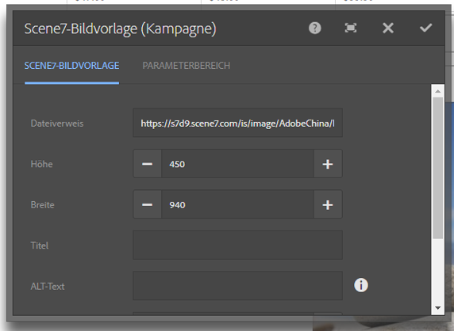

Klicken Sie auf **Bearbeiten**, um die Komponente zu konfigurieren. Die in diesem Abschnitt beschriebenen Einstellungen lassen sich anpassen. Diese Scene7-Bildvorlage wird im Abschnitt [Scene7-Bildvorlagen-Komponente](/help/assets/scene7.md#image-template) ausführlich beschrieben.

Darüber hinaus werden im Parameterbereich sämtliche Vorlagenparameter aufgeführt, die in Scene7 für die Vorlage festgelegt wurden. Für jeden dieser Parameter können Werte angepasst, Variablen eingefügt oder Standardwerte wiederhergestellt werden.

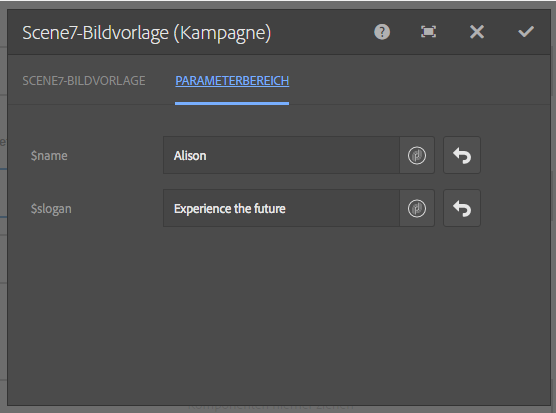

### Zielgerichteter Verweis (Campaign) {#targeted-reference-campaign}

Mithilfe der Komponente „Zielgerichteter Verweis (Campaign)“ können Sie einen Verweis auf einen zielgerichteten Abschnitt erstellen.

In dieser Komponente navigieren Sie zum zielgerichteten Absatz, um ihn auszuwählen.

Klicken Sie auf das Ordnersymbol, um zu dem Absatz zu navigieren, der referenziert werden soll. Klicken Sie abschließend auf das Häkchen.

### Text und Bild (Campaign). {#text-image-campaign}

Mit der Komponente „Text und Bild (Campaign)“ werden ein Textblock und ein Bild hinzugefügt.

Klicken Sie zur Konfiguration auf die Komponente und wählen Sie „Text“ oder „Bild“ aus.

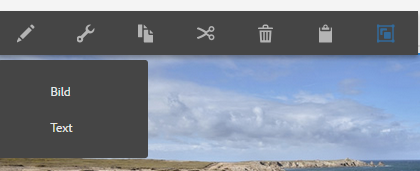

Durch Auswahl von **Text** wird ein Inline-Editor eingeblendet:

Durch Auswahl von **Bild** wird der Editor zur Bearbeitung im Kontext für Bilder eingeblendet:

Siehe [Komponente „Bild (Campaign)“](#image-campaign) für weitere Informationen zur Arbeit mit Bildern. Siehe [Komponente „Text und Personalisierung (Campaign)“](#text-personalization-campaign) für weitere Informationen zur Arbeit mit Text.

Wie bei den Komponenten „Text und Personalisierung (Kampagne)“ und „Bild (Kampagne)“ können Sie Folgendes konfigurieren:

* **Text**
Geben Sie einen Text ein. Verwenden Sie die Symbolleiste, um die Formatierung zu ändern, Listen zu erstellen und Links hinzuzufügen.

* **Bild**
Ziehen Sie ein Bild aus dem Content Finder oder klicken Sie, um zu einem Bild zu navigieren. Schneiden Sie es gegebenenfalls zu oder drehen Sie es.

* **Bildeigenschaften** (**Erweiterte Bildeigenschaften**) Hier können Sie Folgendes angeben:

   * **Titel**
Der Titel des Blocks, der durch Bewegen der Maus angezeigt wird.

   * **ALT-Text**
Alternativer Text, der angezeigt wird, wenn das Bild nicht dargestellt werden kann.

   * **Verknüpfen mit**
Erstellen Sie einen Link zu Assets oder anderen Seiten innerhalb Ihrer Website.

   * **Beschreibung**
Eine Beschreibung des Bildes.

   * **Größe**
Legt die Höhe und Breite des Bildes fest.

>[!NOTE]
>
>Das Feld **ALT-Text** auf der Registerkarte **Erweitert** muss ausgefüllt werden, da die Komponente anderenfalls nicht gespeichert werden kann und folgende Fehlermeldung ausgegeben wird:
>
>`Validation failed. Verify the values of the marked fields.`
>

Im folgenden Beispiel sehen Sie, wie die Komponente „Text und Bild (Kampagne)“ dargestellt wird.

### Text und Personalisierung (Kampagne) {#text-personalization-campaign}

Mit der Komponente „Text-und-Personalisierung (Kampagne)“ können Sie über einen WYSIWYG-Editor, dessen Funktionen der [Rich-Text-Editor](/help/sites-authoring/rich-text-editor.md) bereitstellt, einen Textblock eingeben. Darüber hinaus können Sie mit dieser Komponente die Kontextfelder und Personalisierungsblöcke verwenden, die in Adobe Campaign verfügbar sind. Siehe auch [Einfügen von Personalisierung](/help/sites-authoring/campaign.md#inserting-personalization).

Mithilfe der Symbole können Sie Ihren Text formatieren, einschließlich Schriftmerkmale, Ausrichtung, Links, Listen und Einzügen. Die Funktionalität ist für [beide Benutzeroberflächen](/help/sites-authoring/editing-content.md) grundsätzlich identisch, Aussehen und Verhalten unterscheiden sich jedoch:

Im Editor für die Bearbeitung im Kontext können Sie Text hinzufügen, die Ausrichtung ändern, Links hinzufügen und entfernen, Kontextfelder oder Gestaltungsbausteine hinzufügen und in den Vollbildmodus wechseln. Wenn Sie das Hinzufügen von Text oder die Personalisierung abgeschlossen haben, wählen Sie das Häkchen aus, um Ihre Änderungen zu speichern (oder „x“, um den Vorgang abzubrechen). Weitere Informationen finden Sie unter [Bearbeitung im Kontext](/help/sites-authoring/editing-content.md#editcontenttouchoptimizedui).

>[!NOTE]
>
>* Welche Personalisierungsfelder Ihnen zur Verfügung stehen, hängt davon ab, mit welcher Adobe Campaign-Vorlage Ihr Newsletter verknüpft ist.
>* Nach der Auswahl eines Profils im ContextHub werden die Personalisierungsfelder automatisch durch Daten des gewählten Profils ersetzt.
>
>Siehe [Personalisierung einfügen](/help/sites-authoring/campaign.md#inserting-personalization).

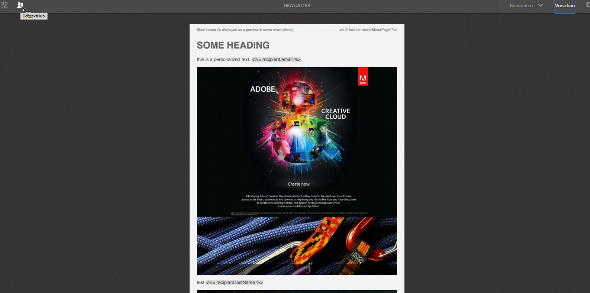

>[!NOTE]
>
>Nur die Felder, die im Schema **nms:seedMember** oder einer seiner Erweiterungen festgelegt wurden, werden berücksichtigt. Die Attribute der mit **nms:seedMember** verknüpften Tabellen stehen nicht zur Verfügung.

## Adobe Campaign-Formular-Komponenten {#adobe-campaign-form-components}

Sie können mithilfe der Adobe Campaign-Komponenten Formulare erstellen, die Benutzende ausfüllen können, um Newsletter zu abonnieren oder abzubestellen oder ihre Benutzerprofile zu aktualisieren. Siehe [Erstellen von Adobe Campaign-Formularen](/help/sites-authoring/adobe-campaign-forms.md) für weitere Informationen.

Jedes Komponentenfeld kann mit einem Adobe Campaign-Datenbankfeld verknüpft werden. Die verfügbaren Felder variieren je nach dem enthaltenen Datentyp. Eine genauere Beschreibung finden Sie im Abschnitt [Komponenten und Datentyp](#components-and-data-type). Wenn Sie Ihr Empfängerschema in Adobe Campaign erweitern, stehen die neuen Felder in den Komponenten zur Verfügung, deren Datentypen übereinstimmen.

Wenn Sie ein Formular öffnen, das für die Integration mit Adobe Campaign konfiguriert wurde, werden Ihnen im Abschnitt **Adobe Campaign** folgende Komponenten angezeigt:

* Kontrollkästchen (Campaign)
* „Datumsfeld (Kampagne)“ und „Datumsfeld/HTML 5 (Kampagne)“
* Verschlüsselter Primärschlüssel (Campaign)
* Fehleranzeige (Campaign)
* Ausgeblendeter Abstimmschlüssel (Kampagne)
* Numerisches Feld (Campaign)
* Optionsfeld (Campaign)
* Abonnement-Checkliste (Kampagne)
* Textfeld (Campaign)

Die Komponenten werden wie folgt angezeigt:

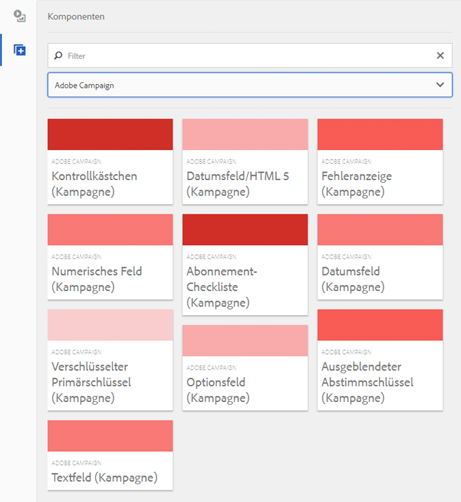

In diesem Abschnitt werden die einzelnen Komponenten detailliert beschrieben.

### Komponenten und Datentyp {#components-and-data-type}

In der folgenden Tabelle werden die Komponenten beschrieben, die zum Anzeigen und Ändern von Adobe Campaign-Profildaten verfügbar sind. Jede Komponente kann einem Adobe Campaign-Profilfeld zugeordnet werden, um den zugehörigen Wert anzuzeigen und das Feld beim Senden des Formulars zu aktualisieren. Die verschiedenen Komponenten können nur Feldern eines entsprechenden Datentyps zugeordnet werden.

<table>
 <tbody>
  <tr>
   <td>
<strong>Komponente</strong>
 </td>
   <td>
<strong>Datentyp des Adobe Campaign-Felds</strong>
 </td>
   <td>
<strong>Beispielfeld</strong>
 </td>
  </tr>
  <tr>
   <td>
Kontrollkästchen (Campaign)
 </td>
   <td>
Boolean (Boolesch)
 </td>
   <td>
Kein Kontakt mehr (egal über welchen Kanal)
 </td>
  </tr>
  <tr>
   <td>
Datumsfeld (Campaign)
 
Datumsfeld/HTML 5 (Kampagne)
 </td>
   <td>
Datum
 </td>
   <td>
Geburtsdatum
 </td>
  </tr>
  <tr>
   <td>
Numerisches Feld (Campaign)
 </td>
   <td>
Numerisch (byte, short, long, double)
 </td>
   <td>
Alter
 </td>
  </tr>
  <tr>
   <td>
Optionsfeld (Campaign)
 </td>
   <td>
Byte mit zugehörigen Werten
 </td>
   <td>
Geschlecht
 </td>
  </tr>
  <tr>
   <td>
Textfeld (Campaign)
 </td>
   <td>
Zeichenfolge
 </td>
   <td>
E-Mail
 </td>
  </tr>
 </tbody>
</table>

### Für die meisten Komponenten übliche Einstellungen {#settings-common-to-most-components}

Die Adobe Campaign-Komponenten verfügen über Einstellungen, die in allen Komponenten verwendet werden (mit Ausnahme der Komponenten &quot;Verschlüsselter Primärer Schlüssel&quot;und &quot;Ausgeblendeter Abstimmschlüssel&quot;).

In den meisten Komponenten können Sie Folgendes konfigurieren:

#### Titel und Text {#title-and-text}

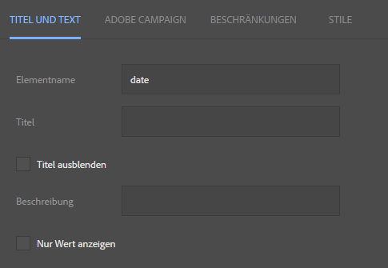

* **Titel**
Wenn Sie einen anderen Namen als Elementnamen verwenden möchten, geben Sie ihn hier ein.

* **Titel ausblenden**
Aktivieren Sie diese Option, wenn der Titel nicht angezeigt werden soll.

* **Beschreibung**
Fügen Sie eine Beschreibung des Felds hinzu, um Benutzern weitere Informationen zur Verfügung zu stellen.

* **Nur Wert anzeigen**
Zeigt nur den Wert an, falls dieser vorhanden ist.

#### Adobe Campaign {#adobe-campaign}

Sie können Folgendes konfigurieren:

* **Zuordnung**
Wählen Sie ein Adobe Campaign-Personalisierungsfeld aus, falls gewünscht.

* **Abstimmschlüssel**
Aktivieren Sie diese Option, wenn das Feld Teil des Abstimmschlüssels ist.

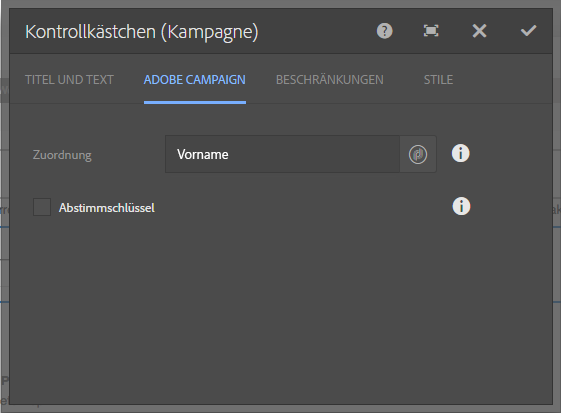

#### Begrenzungen {#constraints}

* **Erforderlich** Aktivieren Sie diese Option, wenn die Komponente als Pflichtangabe eingestellt werden soll und Benutzende einen Wert eingeben müssen.
* **Erforderliche Meldung** Sie können optional eine Meldung eingeben, mit der darauf hingewiesen wird, dass das Feld eine Pflichtangabe ist.

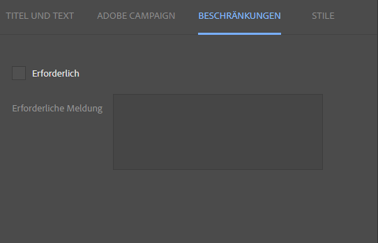

#### Stile {#styling}

* **CSS**
Geben Sie die CSS-Klassen ein, die Sie für diese Komponente verwenden möchten.

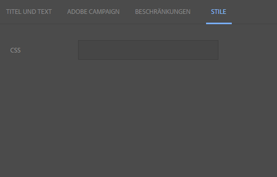

### Kontrollkästchen (Campaign) {#checkbox-campaign}

Die Komponente „Kontrollkästchen (Campaign)“ ermöglicht es Benutzenden, Adobe Campaign-Profilfelder zu ändern, die vom booleschen Datentyp sind. Beispielsweise können Sie über eine Komponente des Typs „Kontrollkästchen (Campaign)“ verfügen, mit der empfangende Personen angeben können, dass sie über keinen Kanal kontaktiert werden möchten.

Sie können in der Komponente „Kontrollkästchen (Campaign)“ [Einstellungen konfigurieren, die für die meisten Adobe Campaign-Komponenten üblich sind](#settings-common-to-most-components).

Im folgenden Beispiel sehen Sie, wie die Komponente „Kontrollkästchen (Campaign)“ dargestellt wird.

### „Datumsfeld (Campaign)“ und „Datumsfeld/HTML 5 (Campaign)“ {#date-field-campaign-and-date-field-html-campaign}

Verwenden Sie das Datumsfeld, um Empfängern ein Datum zu geben. Beispielsweise können Sie von den Empfängern verlangen, ihr Geburtsdatum anzugeben. Das Datumsformat entspricht dem Format, das in Ihrer Adobe Campaign-Instanz verwendet wird.

Neben den [von den meisten Adobe Campaign-Komponenten genutzten Einstellungen](#settings-common-to-most-components) können Sie auch Folgendes konfigurieren:

* **Beschränkungen**: Im Dropdown-Menü für Beschränkungen können Sie aus Folgendem wählen: **Keine** oder **Datum**, um ein Datum oder keine Beschränkung festzulegen. Wählen Sie „Datum“ aus, müssen Benutzende ihre Angaben im Datumsformat machen.

* **Beschränkungsmeldung** Außerdem können Sie eine Beschränkungsmeldung hinzufügen, die Benutzern mitteilt, wie Antworten richtig formatiert werden.
* **Stile – Breite** Passen Sie die Breite des Felds an, indem Sie auf **+** oder **-** tippen oder eine Zahl eingeben.

Im folgenden Beispiel sehen Sie, wie die Komponente „Datumsfeld (Kampagne)“ mit angepasster Breite angezeigt wird.

### Verschlüsselter Primärschlüssel (Campaign) {#encrypted-primary-key-campaign}

Diese Komponente definiert den Namen des URL-Parameters, der die Kennung eines Adobe Campaign-Profils enthält (**Hauptressourcenkennung** oder **Verschlüsselter Primärschlüssel** in Adobe Campaign Standard bzw. 6.1).

Jedes Formular, mit dem Adobe Campaign-Profildaten angezeigt und bearbeitet werden, **muss** den verschlüsselten Primärschlüssel enthalten.

In der Komponente „Verschlüsselter Primärschlüssel (Campaign)“ können Sie Folgendes konfigurieren:

* **Titel und Text – Elementname** Standardeinstellung: encryptedPK. Sie müssen den Elementnamen nur ändern, wenn er mit dem Namen eines anderen Elements im Formular in Konflikt steht. Zwei Formularfelder dürfen nicht denselben Elementnamen haben.
* **Adobe Campaign – URL-Parameter** Fügen Sie den URL-Parameter des EPK hinzu. Hierfür können Sie beispielsweise den Wert **epk** verwenden.

Im folgenden Beispiel sehen Sie, wie die Komponente „Verschlüsselter Primärschlüssel (Campaign)“ dargestellt wird.

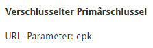

### Fehleranzeige (Campaign) {#error-display-campaign}

Mit dieser Komponente können Sie Backend-Fehler anzeigen. Damit die Komponente ordnungsgemäß funktioniert, muss die Fehlerhandhabung auf „Weiterleiten“ eingestellt werden.

Im folgenden Beispiel sehen Sie, wie die Komponente „Fehleranzeige (Campaign)“ dargestellt wird.

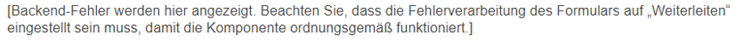

### Ausgeblendeter Abstimmschlüssel (Kampagne) {#hidden-reconciliation-key-campaign}

Mit der Komponente Ausgeblendeter Abstimmschlüssel (Kampagne) können Sie einem Formular ausgeblendete Felder als Teil des Abstimmschlüssels hinzufügen.

In der Komponente „Ausgeblendeter Abstimmschlüssel (Kampagne)“ können Sie Folgendes konfigurieren:

* **Titel und Text – Elementname** Standardeinstellung: reconcilKey. Sie müssen den Elementnamen nur ändern, wenn er mit dem Namen eines anderen Elements im Formular in Konflikt steht. Zwei Formularfelder dürfen nicht denselben Elementnamen haben.
* **Adobe Campaign – Zuordnung** Zuordnung zu einem Personalisierungsfeld von Adobe Campaign.

Im folgenden Beispiel sehen Sie, wie die Komponente „Ausgeblendeter Abstimmschlüssel (Kampagne)“ dargestellt wird.

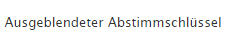

### Numerisches Feld (Campaign) {#numeric-field-campaign}

Verwenden Sie das numerische Feld, damit Empfänger Zahlen eingeben können, z. B. ihr Alter.

Neben den [von den meisten Adobe Campaign-Komponenten genutzten Einstellungen](#settings-common-to-most-components) können Sie auch Folgendes konfigurieren:

* **Beschränkungen – Dropdown „Beschränkung“**
Sie können **Keine** oder **Numerisch** auswählen, um eine Zahlenbeschränkung oder keine Beschränkung hinzuzufügen. Wählen Sie die numerische Beschränkung, können Benutzende ausschließlich Zahlen in das Feld eingeben.

* **Beschränkungsmeldung** Außerdem können Sie eine Beschränkungsmeldung hinzufügen, die Benutzern mitteilt, wie Antworten richtig formatiert werden.
* **Stile – Breite** Passen Sie die Breite des Felds an, indem Sie auf **+** oder **-** tippen oder eine Zahl eingeben.

Im folgenden Beispiel sehen Sie, wie die Komponente „Numerisches Feld (Kampagne)“ mit konfigurierter Breite angezeigt wird.

### Optionsfeld (Campaign) {#option-field-campaign}

In dieser Dropdown-Liste können Sie eine Option auswählen. z. B. das Geschlecht oder den Status einer Empfängerin bzw. eines Empfängers.

Sie können in der Komponente „Optionsfeld (Campaign)“ [Einstellungen konfigurieren, die für die meisten Adobe Campaign-Komponenten üblich sind](#settings-common-to-most-components). Um die Dropdown-Liste zu füllen, wählen Sie das entsprechende Feld in den Adobe Campaign-Personalisierungsfeldern aus, indem Sie auf das Adobe Campaign-Symbol klicken oder tippen und zum entsprechenden Feld navigieren.

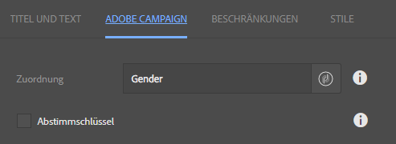

Im folgenden Beispiel sehen Sie, wie die Komponente „Optionsfeld (Kampagne)“ dargestellt wird.

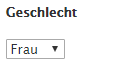

### Abonnement-Checkliste (Kampagne) {#subscriptions-checklist-campaign}

Mithilfe der Komponente **Abonnement-Checkliste (Kampagne)** können Sie die mit einem Adobe Campaign-Profil verknüpften Abonnements bearbeiten.

Wird die Komponente einem Formular hinzugefügt, werden alle verfügbaren Abonnements als Kontrollkästchen angezeigt, aus denen die Benutzer das gewünschte auswählen können. Wenn Benutzer das Formular senden, sorgt diese Komponente für ein Abonnement oder die Beendigung eines Abonnements der vom Benutzer ausgewählten Services. Dies hängt vom Formularaktionstyp ab (**Adobe Campaign: Services abonnieren** oder **Adobe Campaign: Abonnement von Services beenden**).

>[!NOTE]
>
>Von der Komponente wird nicht geprüft, welche Services der Benutzer bereits abonniert oder abbestellt hat und welche nicht.

Sie können in der Komponente „Abonnement-Checkliste (Campaign)“ [Einstellungen konfigurieren, die für die meisten Adobe Campaign-Komponenten üblich sind](#settings-common-to-most-components). (Für diese Komponente sind keine Adobe Campaign-Konfigurationen verfügbar.)

Im folgenden Beispiel sehen Sie, wie die Komponente „Abonnement-Checkliste (Campaign)“ dargestellt wird.

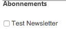

### Textfeld (Campaign) {#text-field-campaign}

Die Komponente „Textfeld (Campaign)“ ermöglicht Ihnen die Eingabe von Daten im Zeichenfolgenformat, etwa Vornamen, Nachnamen, Adressen, E-Mail-Adressen usw.

Neben den [von den meisten Adobe Campaign-Komponenten genutzten Einstellungen](#settings-common-to-most-components) können Sie auch Folgendes konfigurieren:

* **Beschränkungen**: Im Dropdown-Menü
für Beschränkungen können Sie **Keine**, **E-Mail** oder **Name** (keine Umlaute) auswählen, um keine Beschränkung festzulegen oder die Eingabe auf E-Mail-Adressen und Namen einzugrenzen. Entscheiden Sie sich für „E-Mail“, können Benutzende ausschließlich E-Mail-Adressen in das Feld eingeben. Entscheiden Sie sich für „Name“, muss ein Name eingegeben werden (hierbei sind jedoch keine Umlaute gestattet).

* **Beschränkungsmeldung** Außerdem können Sie eine Beschränkungsmeldung hinzufügen, die Benutzern mitteilt, wie Antworten richtig formatiert werden.
* **Stile – Breite** Passen Sie die Breite des Felds an, indem Sie auf **+** oder **-** tippen oder eine Zahl eingeben.

Im folgenden Beispiel sehen Sie, wie die Komponente „Textfeld (Kampagne)“ dargestellt wird.

