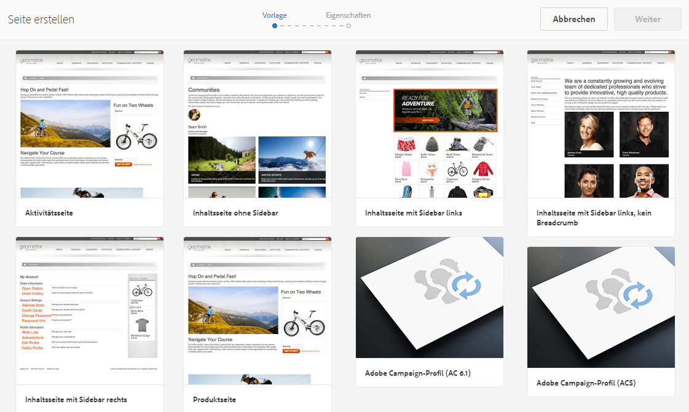
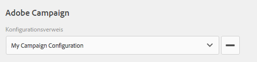
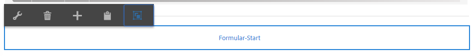
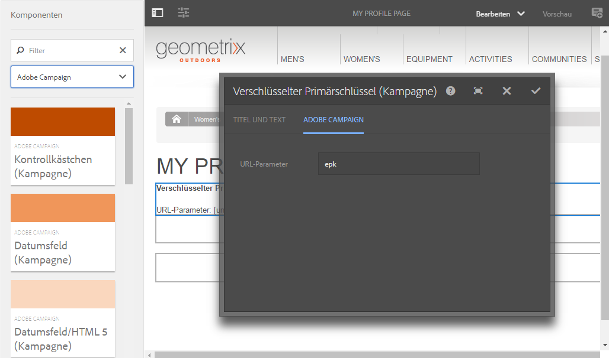
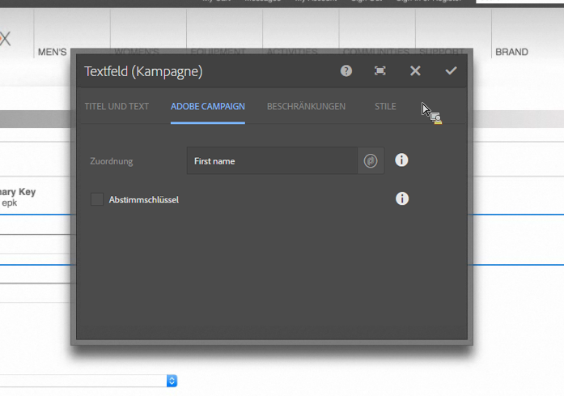

# Erstellen von Adobe Campaign-Formularen in AEM {#creating-adobe-campaign-forms-in-aem}

Mit AEM können Sie Formulare erstellen und bearbeiten, mit denen Sie auf Ihrer Website mit Adobe Campaign interagieren können. Sie können bestimmte Felder in Ihre Formulare einfügen und sie mit der Adobe Campaign-Datenbank verknüpfen.

Zudem können Sie Abonnements neuer Kontakte, Abmeldungen aus Abonnements und Benutzerprofildaten verwalten und diese zeitgleich in die Adobe Campaign-Datenbank integrieren.

Möchten Sie Adobe Campaign-Formulare in AEM nutzen, folgen Sie den in diesem Dokument beschriebenen Schritten:

1. Stellen Sie eine Vorlage bereit.
1. Erstellen Sie ein Formular.
1. Bearbeiten Sie den Formularinhalt.

Drei Formulartypen, die speziell für Adobe Campaign erstellt wurden, sind standardmäßig verfügbar:

* Profil speichern
* Service abonnieren
* Serviceabonnements beenden

Mit diesen Formularen wird ein URL-Parameter definiert, der den verschlüsselten Primärschlüssel eines Adobe Campaign-Profils akzeptiert. Basierend auf diesem URL-Parameter werden die Daten des zugehörigen Adobe Campaign-Profils aktualisiert.

Sie erstellen diese Formulare zwar einzeln, doch werden in typischen Anwendungsfällen personalisierte Verknüpfungen mit einer Formularseite im Newsletterinhalt generiert, sodass Benutzer den Link öffnen und Anpassungen an den Profildaten vornehmen können (beispielsweise Aktualisierung des Benutzerprofils, Abschließen oder Kündigen eines Abonnements).

Das Formular aktualisiert sich, basierend auf dem Benutzer, selbstständig. Weitere Informationen hierzu finden Sie unter [Bearbeiten von Formularinhalt](#editing-form-content).

## Verfügbarmachen von Vorlagen  {#making-a-template-available}

Bevor Sie für Adobe Campaign spezifische Formulare erstellen können, müssen Sie verschiedene Vorlagen in Ihrer AEM-Anwendung verfügbar machen.

Weitere Informationen finden Sie in der [Dokumentation zu Vorlagen](/help/sites-developing/templates.md#template-availability).

## Erstellen von Formularen {#creating-a-form}

Zunächst müssen Sie prüfen, ob die Verbindung zwischen Autoren- und Veröffentlichungsinstanz in Adobe Campaign funktioniert. Weitere Informationen hierzu finden Sie unter [Integrieren mit Adobe Campaign Standard](/help/sites-administering/campaignstandard.md) und [Integrieren mit Adobe Campaign Classic](/help/sites-administering/campaignonpremise.md).

>[!NOTE]
>
>Stellen Sie sicher, dass die Eigenschaft **acMapping** im Knoten **jcr:content** der Seite auf den Wert **mapRecipient** bzw. **profile** eingestellt ist, wenn Sie mit Adobe Campaign Classic oder Adobe Campaign Standard arbeiten.

1. Navigieren Sie in AEM unter „Sites“ an den Ort, an dem Sie eine neue Seite erstellen möchten.
1. Erstellen Sie eine Seite, wählen Sie **Adobe Campaign Classic-Profil** oder **Adobe Campaign Standard-Profil** und klicken Sie auf **Weiter**.

   

   >[!NOTE]
   >
   >Wenn die gewünschte Vorlage nicht verfügbar ist, lesen Sie [Vorlagenverfügbarkeit](/help/sites-developing/templates.md#template-availability).

1. Fügen Sie im Feld **Name** den Namen der Seite ein. Sie müssen einen gültigen JCR-Namen verwenden.
1. Geben Sie in das Feld **Titel** einen Titel ein und klicken Sie auf **Erstellen**.
1. Öffnen Sie die Seite und wählen Sie **Eigenschaften öffnen** aus. Fügen Sie in den Cloud-Services die Adobe Campaign-Konfiguration hinzu und klicken Sie auf das Häkchen, um die Änderungen zu übernehmen.

   

1. Klicken Sie auf der Seite auf die Komponente **Formular-Start** und wählen Sie den Formulartyp (**abonnieren, Abonnement kündigen** oder **Profil speichern**) aus. Pro Formular kann nur ein Typ gewählt werden. Sie können den [Inhalt des Formulars nun bearbeiten](#editing-form-content).

## Bearbeiten von Formularinhalt {#editing-form-content}

Für Adobe Campaign erstellte Formulare verfügen über bestimmte Komponenten. Diese Komponenten ermöglichen es Ihnen, jedes Formularfeld mit einem Feld der Adobe Campaign-Datenbank zu verknüpfen.

>[!NOTE]
>
>Wenn die gewünschte Vorlage nicht verfügbar ist, finden Sie weitere Informationen unter [Verfügbar machen einer Vorlage](/help/sites-authoring/adobe-campaign.md).

In diesem Abschnitt werden nur für Adobe Campaign spezifische Verknüpfungen behandelt. Weitere Informationen zur Verwendung von Formularen in Adobe Experience Manager finden Sie unter [Bearbeitungsmodus-Komponenten](/help/sites-authoring/default-components-foundation.md).

1. Wählen Sie **Eigenschaften öffnen** aus. Fügen Sie den Cloud-Services die Adobe Campaign-Konfiguration hinzu und klicken Sie auf das Häkchen, um die Änderungen zu übernehmen.

   

1. Klicken Sie auf der Seite in der Komponente **Formular-Start** auf das Symbol Konfiguration .

   

1. Klicken Sie auf die Registerkarte **Erweitert** und wählen Sie den Formulartyp **Abonnieren, Abmelden,** oder **Profil speichern** aus und klicken Sie auf **OK.** Pro Formular kann nur ein Typ gewählt werden.

   * **Adobe Campaign: Profil speichern**: Mit dieser Option können Sie Empfänger in Adobe Campaign erstellen oder aktualisieren (Standardeinstellung).
   * **Adobe Campaign: Services abonnieren**: Mit dieser Option können Sie Abonnements eines Empfängers in Adobe Campaign verwalten.
   * **Adobe Campaign: Abonnement von Services beenden**: Mit dieser Einstellung können Sie die Abonnements eines Empfängers in Adobe Campaign beenden.

1. Jedes Formular muss über die Komponente **Verschlüsselter Primärschlüssel** verfügen. Mit dieser Komponente wird festgelegt, welcher URL-Parameter für die Annahme des verschlüsselten Primärschlüssels eines Adobe Campaign-Profils verwendet wird. Wählen Sie aus den Komponenten Adobe Campaign aus, sodass nur die entsprechenden Komponenten angezeigt werden.
1. Ziehen Sie die Komponente **Verschlüsselter Primärer Schlüssel** in das Formular (an einer beliebigen Stelle) und klicken oder tippen Sie auf das Symbol **Konfiguration**. Geben Sie auf der Registerkarte **Adobe Campaign** einen Namen für den URL-Parameter an. Klicken oder tippen Sie auf das Häkchen, um die Änderungen zu übernehmen.

   Die generierten Links, die auf dieses Formular verweisen, müssen diesen URL-Parameter verwenden und ihn dem verschlüsselten Primärschlüssel eines Adobe Campaign-Profils zuweisen. Der verschlüsselte Primärschlüssel muss ordnungsgemäß für die URL codiert sein (Prozent).

   

1. Fügen Sie dem Formular die gewünschten Komponenten hinzu (beispielsweise Text-, Daten-, Kontrollkästchen-, Optionsfeld usw.) hinzu. Weitere Informationen zu den Komponenten finden Sie unter [Adobe Campaign-Formular-Komponenten](/help/sites-authoring/adobe-campaign-components.md).
1. Klicken Sie auf das Symbol für die Konfiguration, um die Komponente zu öffnen. Ändern Sie beispielsweise in der Komponente **Textfeld (Kampagne)** den Titel und den Text.

   Klicken Sie auf **Adobe Campaign**, um das Formularfeld mit einer Adobe Campaign-Metadatenvariable zu verknüpfen. Beim Senden des Formulars wird das Feld in Adobe Campaign aktualisiert. Es stehen in der Auswahl nur Felder mit entsprechenden Datentypen zur Verfügung (beispielsweise Zeichenfolgenvariablen für Textfelder).

   

   >[!NOTE]
   >
   >Sie können Felder, die in der Empfängertabelle angezeigt werden, wie hier beschrieben hinzufügen/entfernen: [https://blogs.adobe.com/experiencedelivers/experience-management/aem-campaign-integration/](https://blogs.adobe.com/experiencedelivers/experience-management/aem-campaign-integration/)

1. Klicken Sie auf **Seite veröffentlichen**. Die Seite wird auf Ihrer Site aktiviert. Sie können sie anzeigen, indem Sie zur AEM-Veröffentlichungsinstanz navigieren. Sie können zudem [Formulare testen](#testing-a-form).

   >[!CAUTION]
   >
   >Sie müssen dem anonymen Benutzer im Cloud-Service Leserechte zuweisen, damit Sie in der Veröffentlichungsumgebung mit Formularen arbeiten können. Berücksichtigen Sie jedoch die potenziellen Sicherheitsrisiken, die durch die Zuweisung von Leserechten an anonyme Benutzer entstehen, und schränken Sie diese beispielsweise durch Konfiguration des Dispatchers ein.

## Testen von Formularen {#testing-a-form}

Nach der Erstellung und Bearbeitung eines Formulars möchten Sie dieses möglicherweise manuell prüfen, um sicherzustellen, dass es wie gewünscht funktioniert.

>[!NOTE]
>
>Sie müssen in jedem Formular über eine Komponente **Verschlüsselter Primärer Schlüssel** verfügen. Wählen Sie aus den Komponenten Adobe Campaign aus, sodass nur die entsprechenden Komponenten angezeigt werden.
>
>Obwohl Sie bei diesem Verfahren die EPK-Nummer manuell eingeben, würden Benutzer in der Praxis im Newsletter einen Link zur Seite erhalten (auf der sie Abonnements abschließen oder beenden und ihr Profil aktualisieren können). Der EPK wird – basierend auf dem Benutzer – automatisch aktualisiert.
>
>Um diesen Link zu erstellen, verwenden Sie die Variable **Hauptressourcenkennung**(Adobe Campaign Standard) oder **Verschlüsselte Kennung** (Adobe Campaign Classic) (z. B. in einer Komponente **Text und Personalisierung (Kampagne)** ), die mit dem EPK in Adobe Campaign verknüpft ist.

Hierfür müssen Sie den EPK eines Adobe Campaign-Profils manuell abrufen und an die URL anhängen:

1. So rufen Sie den verschlüsselten Primärschlüssel (EPK) eines Adobe Campaign-Profils ab:

   * Navigieren Sie in Adobe Campaign Standard zu **Profile und Zielgruppen** > **Profile**, in dem die vorhandenen Profile aufgelistet werden. Stellen Sie sicher, dass in der Tabelle das Feld **Hauptressourcenkennung** in einer Spalte angezeigt wird (dies kann durch Klicken/Tippen auf **Liste konfigurieren** konfiguriert werden). Kopieren Sie die Hauptressourcenkennung des gewünschten Profils.
   * Navigieren Sie in Adobe Campaign Classic zu **Profile und Zielgruppen** > **Empfänger** , in dem die vorhandenen Profile aufgelistet werden. Stellen Sie sicher, dass in der Tabelle das Feld **Verschlüsselte Kennung** in einer Spalte angezeigt wird (dies kann konfiguriert werden, indem Sie mit der rechten Maustaste auf einen Eintrag klicken und **Liste konfigurieren.. auswählen.**). Kopieren Sie die verschlüsselte Kennung des gewünschten Profils.

1. Öffnen Sie AEM die Formularseite in der Veröffentlichungsinstanz und hängen Sie das EPK aus Schritt 1 als URL-Parameter an: Verwenden Sie denselben Namen, den Sie zuvor in der EPK-Komponente definiert haben, wenn Sie das Formular erstellen (z. B.: `?epk=...`)
1. Das Formular kann jetzt verwendet werden, um die Daten und Abonnements zu ändern, die dem verknüpften Adobe Campaign-Profil zugeordnet sind. Nach der Bearbeitung einiger Felder und dem Absenden des Formulars können Sie in Adobe Campaign prüfen, ob die Daten entsprechend aktualisiert wurden. 

Die Daten der Adobe Campaign-Datenbank werden nach Validierung eines Formulars aktualisiert.
