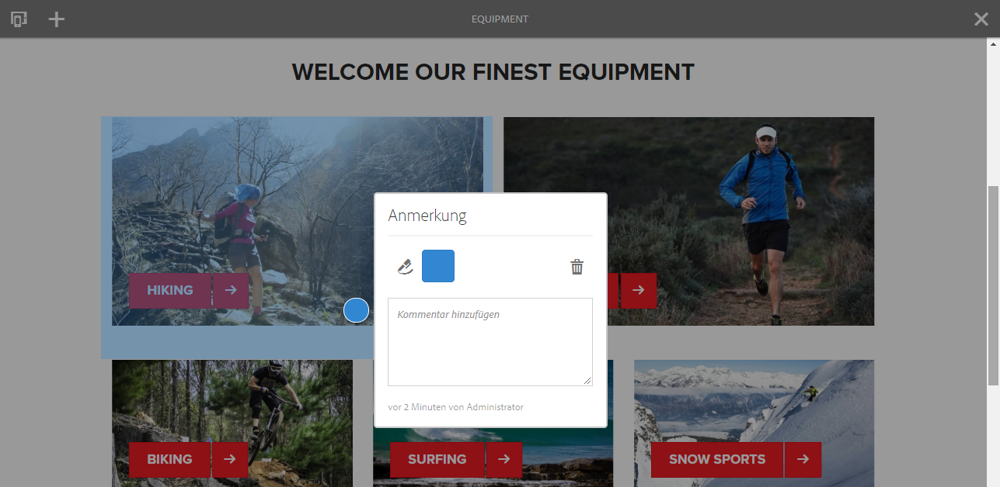
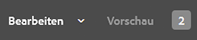

# Anmerkungen beim Bearbeiten einer Seite{#annotations-when-editing-a-page}

Oft muss das Hinzufügen von Inhalten zu den Seiten Ihrer Website vor der tatsächlichen Veröffentlichung besprochen werden. Um diesen Vorgang zu erleichtern, können Sie in vielen Komponenten, die direkt mit Inhalt (und nicht mit dem Layout) in Verbindung stehen, Anmerkungen hinzufügen.

Bei einer Anmerkung wird eine farbige Markierung/Haftnotiz auf der Seite platziert. Mit einer Anmerkung können Sie (oder andere Benutzer) Kommentare und/oder Fragen für andere Autoren/Prüfer hinterlassen.

>[!NOTE]
>
>Die Definition einer einzelnen Komponente bestimmt, ob Anmerkungen in Instanzen dieser Komponente möglich sind oder nicht.

>[!NOTE]
>
>Die in der klassischen Benutzeroberfläche erstellten Anmerkungen werden in der Touch-optimierten Benutzeroberfläche angezeigt. Zeichnungen sind jedoch benutzeroberflächenspezifisch und werden nur in der Benutzeroberfläche dargestellt, in der sie erstellt wurden.

>[!CAUTION]
>
>Durch Löschen einer Ressource (z. B. eines Absatzes) werden alle Anmerkungen und Zeichnungen gelöscht, die mit dieser Ressource verbunden sind (unabhängig von ihrer Position auf der Seite als Ganzes).

>[!NOTE]
>
>Je nach Ihren Anforderungen können Sie auch einen Workflow erstellen, damit Benachrichtigungen gesendet werden, wenn Anmerkungen hinzugefügt, aktualisiert oder gelöscht werden.

## Anmerkungen {#annotations}

Zum Erstellen und Ansehen von Anmerkungen wird ein spezieller [Modus](/help/sites-authoring/author-environment-tools.md#page-modes) verwendet.

>[!NOTE]
>
>Beachten Sie, dass Sie auch mithilfe von [Kommentaren](/help/sites-authoring/basic-handling.md#timeline) Feedback zu einer Seite geben können.

>[!NOTE]
>
>Sie können Anmerkungen zu einer Vielzahl von Ressourcen anfügen: 
>
>* [Anmerkungen zu Assets](/help/assets/manage-assets.md#annotating)
* [Kommentieren von Video-Assets](/help/assets/managing-video-assets.md#annotate-video-assets)

### Hinzufügen von Anmerkungen zu Komponenten {#annotating-a-component}

Im Anmerkungsmodus können Sie Anmerkungen für Ihre Inhalte erstellen, bearbeiten, verschieben oder löschen.

1. Sie können den Anmerkungsmodus über das Symbol in der Symbolleiste (rechts oben) aufrufen, wenn Sie eine Seite bearbeiten:

   

   Sie können nun vorhandene Anmerkungen anzeigen.

   >[!NOTE]
   Zum Beenden des Anmerkungsmodus tippen/klicken Sie auf das Anmerkungssymbol (x-Symbol) oben rechts in der Symbolleiste.

1. Klicken/tippen Sie auf das Symbol „Anmerkung hinzufügen“ (Plussymbol links in der Symbolleiste), um mit dem Hinzufügen von Anmerkungen zu beginnen.

   >[!NOTE]
   Wenn Sie keine weiteren Anmerkungen hinzufügen möchten (und zur Anzeige zurückkehren wollen), tippen/klicken Sie auf das Symbol „Abbrechen“ (x-Symbol in einem weißen Kreis) links in der Symbolleiste oben.

1. Tippen/klicken Sie auf die erforderliche Komponente (Komponenten, denen eine Anmerkung hinzugefügt werden kann, sind mit einem blauen Rand gekennzeichnet), um die Anmerkung hinzuzufügen und das Dialogfeld zu öffnen:

   

   Hier können Sie das entsprechende Feld und/oder Symbol für folgende Aktionen wählen:

   * Einen Anmerkungstext eingeben.
   * Eine Zeichnung (Linien und Formen) erstellen, um den Bereich der Komponente hervorzuheben.

      Der Mauszeiger ändert sich in ein Fadenkreuz, wenn Sie eine Zeichnung erstellen. Sie können mehrere separate Linien zeichnen. Die Zeichnungslinie hat dieselbe Farbe wie die Anmerkung und kann ein Pfeil, ein Kreis oder ein Oval sein.
   

   * Farbe wählen/ändern:

   

   * Die Anmerkung löschen.

   

1. Sie können das Dialogfeld für die Anmerkungen schließen, indem Sie außerhalb des Dialogfelds. Eine abgeschnittene Ansicht (das erste Wort) der Anmerkung wird zusammen mit sämtlichen Zeichnungen angezeigt:

   

1. Wenn Sie mit dem Bearbeiten einer bestimmten Anmerkung fertig sind, können Sie Folgendes tun:

   * Klicken/tippen Sie auf die Textmarkierung, um die Anmerkung zu öffnen. Sobald sie geöffnet ist, können Sie den vollständigen Text sehen, Änderungen vornehmen oder die Anmerkung löschen.

      * Zeichnungen können nicht unabhängig von der Anmerkung gelöscht werden.
   * Positionieren Sie die Textmarkierung neu.
   * Klicken/tippen Sie auf eine Zeichnung, um diese Zeichnung auszuwählen und sie auf die gewünschte Position zu ziehen.
   * Verschieben oder kopieren Sie eine Komponente.

      * Alle damit verbundenen Anmerkungen und deren Zeichnungen werden ebenfalls verschoben oder kopiert, ihre Position in Relation zum Absatz bleibt gleich.

1. Um den Anmerkungsmodus zu beenden und zum vorher verwendeten Modus zurückzukehren, tippen/klicken Sie auf das Anmerkungssymbol (x-Symbol) oben rechts in der Symbolleiste.

>[!NOTE]
Anmerkungen können nicht zu einer Seite hinzugefügt werden, die von einem anderen Benutzer gesperrt wurde.

### Kennzeichnung von Anmerkungen {#annotation-indicator}

Anmerkungen werden nicht im Bearbeitungsmodus angezeigt, doch die Kennzeichnung oben rechts in der Symbolleiste gibt an, wie viele Anmerkungen auf der aktuellen Seite vorhanden sind. Die Kennzeichnung ersetzt das standardmäßige Anmerkungssymbol, dient jedoch ebenfalls als schneller Link, mit dem Sie den Anmerkungsmodus aktivieren/deaktivieren können:

