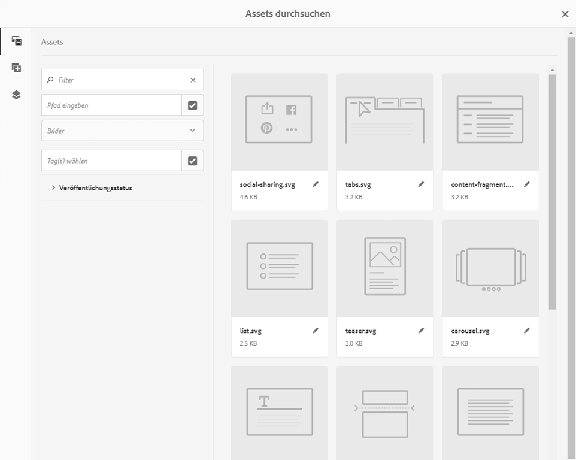

# Bearbeiten: Umgebung und Tools{#authoring-the-environment-and-tools}

Die Autorenumgebung von AEM bietet verschiedene Mechanismen für das Organisieren und Bearbeiten von Inhalten. Die verfügbaren Tools können über verschiedene Konsolen und Seiteneditoren aufgerufen werden.

## Verwalten Ihrer Site {#managing-your-site}

Die **Sites-Konsole** bietet Ihnen die Möglichkeit, auf Ihrer Website zu navigieren und diese zu verwalten. Hierfür stehen neben der Kopfzeilen- und Symbolleiste auch Aktionssymbole (für die jeweils ausgewählte Ressource) sowie Breadcrumbs und ggf. sekundäre Leisten (z. B. für Zeit und Verweise) zur Verfügung.

Zum Beispiel in der Spaltenansicht:

## Bearbeiten des Seiteninhalts {#editing-page-content}

Sie können eine Seite mit dem Seiteneditor bearbeiten. Beispiel:

`https://localhost:4502/editor.html/content/we-retail/us/en/equipment.html`

>[!NOTE]
>
>Wenn Sie eine Seite zum ersten Mal zur Bearbeitung öffnen, werden Sie in einer Bildschirmpräsentation durch die Funktionen geführt.
>
>Sie können diese Tour überspringen und jederzeit wiederholen, indem Sie sie im Menü **Seiteninformationen** auswählen.

## Aufrufen der Hilfe {#accessing-help}

Wenn Sie eine Seite bearbeiten, können Sie folgendermaßen auf die **Hilfe** zugreifen:

* über den Selektor [**Seiteninformationen**](/help/sites-authoring/editing-page-properties.md#page-properties), der die Einführungsfolien (wie beim erstmaligen Zugriff auf den Editor) anzeigt.
* über das [Konfigurationsdialogfeld](/help/sites-authoring/editing-content.md#edit-configure-copy-cut-delete-paste) für bestimmte Komponenten (mithilfe des Symbols „?“ in der Symbolleiste des Dialogfelds), das die kontextsensitive Hilfe anzeigt.

In den Konsolen stehen weitere [Hilferessourcen zur Verfügung](/help/sites-authoring/basic-handling.md#accessing-help).

## Komponenten-Browser  {#components-browser}

Der Komponenten-Browser enthält alle Komponenten, die zur Verwendung auf der aktuellen Seite verfügbar sind. Sie können diese an die gewünschte Position ziehen und dann bearbeiten, um Inhalte hinzuzufügen.

Der Komponenten-Browser befindet sich auf einer Registerkarte im seitlichen Bedienfeld (zusammen mit dem [Asset-Browser](/help/sites-authoring/author-environment-tools.md#assets-browser) und der [Inhaltsstruktur](/help/sites-authoring/author-environment-tools.md#content-tree)). Um das Bedienfeld zu öffnen (oder zu schließen), verwenden Sie das Symbol links oben in der Symbolleiste:

Wenn Sie das Bedienfeld öffnen, wird es von der linken Seite aus eingeblendet. Wählen Sie hier ggf. die Registerkarte **Komponenten**. Wenn diese geöffnet ist, können Sie alle für die Seite verfügbaren Komponenten durchsuchen.

Das tatsächliche Aussehen und die Nutzung hängen vom verwendeten Gerätetyp ab:

>[!NOTE]
>
>Ein Mobilgerät wird erkannt, wenn die Breite weniger als 1024 Pixel beträgt. Dies kann auch bei einem kleinen Desktop-Fenster der Fall sein.

* **Mobilgerät (z. B. iPad)**

   Der Komponenten-Browser deckt die gesamte bearbeitete Seite ab.

   Um der Seite eine Komponente hinzuzufügen, berühren und halten Sie die gewünschte Komponente und verschieben Sie sie nach rechts. Der Komponenten-Browser wird geschlossen und die Seite wird erneut angezeigt. Sie können die Komponente jetzt dort platzieren.

   

* **Desktop-Gerät**

   Der Komponenten-Browser wird auf der linken Seite des Fensters geöffnet.

   Um der Seite eine Komponente hinzuzufügen, klicken Sie auf die gewünschte Komponente und ziehen Sie sie an die gewünschte Position.

   

   Komponenten werden wie folgt dargestellt:

   * Komponentenname
   * Komponentengruppe (in grau)
   * Symbol oder Abkürzung

      * Die Symbole für die Standardkomponenten sind monochrom dargestellt.
      * Für die Abkürzungen werden immer die ersten zwei Buchstaben des Komponentennamens verwendet.

   In der oberen Symbolleiste des **Komponenten-Browsers** haben Sie folgende Möglichkeiten:

   * Komponenten nach Namen filtern
   * mittels Dropdown-Auswahl die Anzeige auf eine bestimmte Gruppe begrenzen

   Für eine detailliertere Beschreibung der Komponente können Sie im Browser **Komponenten** auf das Informationssymbol neben der Komponente tippen/klicken (falls verfügbar). Beispiel für den **Layout-Container**:

   

   Weiterführende Informationen zu den verfügbaren Komponenten finden Sie unter [Komponenten-Konsole](/help/sites-authoring/default-components-console.md).

## Asset-Browser {#assets-browser}

Der Asset-Browser enthält alle [Assets](/help/assets/home.md), die auf Ihrer aktuellen Seite direkt verwendet werden können.

Der Asset-Browser befindet sich auf einer Registerkarte im seitlichen Bedienfeld (zusammen mit dem [Komponenten-Browser](/help/sites-authoring/author-environment-tools.md#components-browser) und der [Inhaltsstruktur](/help/sites-authoring/author-environment-tools.md#content-tree)). Um das Bedienfeld zu öffnen (oder zu schließen), verwenden Sie das Symbol links oben in der Symbolleiste:

Wenn Sie das Bedienfeld öffnen, wird es von der linken Seite aus eingeblendet. Wählen Sie hier ggf. die Registerkarte **Assets**.

Wenn der Asset-Browser geöffnet ist, können Sie alle für die Seite verfügbaren Assets durchsuchen. Bei Bedarf können Sie die Liste durch Scrollen unendlich erweitern.

Um ein Asset zu der Seite hinzuzufügen, wählen Sie es aus und ziehen Sie es an die gewünschte Position. Dabei kann es sich um Folgendes handeln:

* Eine vorhandene Komponente des entsprechenden Typs.

   * Sie können beispielsweise ein Asset des Typs „Bild“ auf eine Bildkomponente ziehen.

* Ein [Platzhalter](/help/sites-authoring/editing-content.md#component-placeholder) im Absatzsystem zum Erstellen einer neuen Komponente des entsprechenden Typs.

   * Sie können beispielsweise ein Asset des Typs „Bild“ in das Absatzsystem ziehen, um eine Bildkomponente zu erstellen.

>[!NOTE]
>
>Dies ist für spezielle Assets und Komponententypen verfügbar. Weitere Einzelheiten finden Sie unter [Einfügen einer Komponente mit dem Asset-Browser](/help/sites-authoring/editing-content.md#inserting-a-component-using-the-assets-browser).

In der Symbolleiste des Asset-Browsers können Sie Assets nach folgenden Kriterien filtern:

* Name
* Pfad
* Asset-Typ (d. h. Bilder, Manuskripte, Dokumente, Videos, Seiten, Absätze oder Produkte)
* Asset-Eigenschaften wie Ausrichtung (Hochformat, Querformat, Quadrat) und Stil (Farbe, Schwarzweiß, Graustufen)

   * Nur für bestimmte Asset-Typen verfügbar

Das tatsächliche Aussehen und die Nutzung hängen vom verwendeten Gerätetyp ab:

>[!NOTE]
>
>Ein Mobilgerät wird erkannt, wenn die Breite geringer als 1.024 Pixel ist, d. h. auch bei einem kleinen Desktop-Fenster.

* **Mobilgerät, z. B. iPad**

   Der Asset-Browser deckt die gesamte bearbeitete Seite ab.

   Um der Seite ein Asset hinzuzufügen, berühren und halten Sie das gewünschte Asset und verschieben Sie es nach rechts. Der Asset-Browser wird geschlossen und die Seite wird erneut angezeigt. Jetzt können Sie das Asset der gewünschten Komponente hinzufügen.

   

* **Desktop-Gerät**

   Der Asset-Browser wird auf der linken Seite des Fensters geöffnet.

   Um ein Asset zu Ihrer Seite hinzuzufügen, klicken Sie auf das gewünschte Asset und ziehen Sie es auf die benötigte Komponente oder Stelle.

   

Wenn Sie eine Änderung an einem der Assets vornehmen möchten, können Sie den [Asset-Editor](/help/assets/manage-assets.md) auch direkt über den Browser starten. Klicken Sie dazu einfach auf das Bearbeitungssymbol neben dem Asset-Namen.

## Inhaltsstruktur  {#content-tree}

Die **Inhaltsstruktur** bietet einen Überblick über alle auf der Seite verwendeten Komponenten in einer hierarchischen Darstellung, sodass Sie direkt feststellen können, wie die Seite aufgebaut ist.

Die Inhaltsstruktur befindet sich auf einer Registerkarte im seitlichen Bedienfeld (zusammen mit dem Asset-Browser). Um das Bedienfeld zu öffnen (oder zu schließen), verwenden Sie das Symbol links oben in der Symbolleiste:

Wenn Sie das Bedienfeld öffnen, wird es von der linken Seite aus eingeblendet. Wählen Sie ggf. die Registerkarte **Inhaltsstruktur**. Mit dieser Strukturansicht Ihrer Seite oder Vorlage können Sie leicht nachvollziehen, wie die darauf verwendeten Komponenten hierarchisch strukturiert sind. Auf einer komplexer gestalteten Seite können Sie so zudem einfacher zwischen Komponenten auf der Seite wechseln.

Da eine Seite häufig zahlreiche Komponenten desselben Typs enthält, wird in der Komponentenstruktur (Inhalt) neben dem Namen des Komponententyps (schwarz dargestellt) zusätzlich eine Beschreibung angezeigt (grau dargestellt). Der Text für diese Beschreibung wird aus den allgemeinen Eigenschaften der Komponente (z. B. Titel oder Text) entnommen.

Die Komponententypen werden in der für die Benutzeroberfläche ausgewählten Sprache angezeigt, die Beschreibung dagegen in der Sprache, die für die Seite verwendet wird.

Durch Klicken auf den Richtungspfeil neben einer Komponente wird die entsprechende Ebene ein- bzw. ausgeblendet.

>[!NOTE]
>
>Beim Bearbeiten einer Seite auf einem Mobilgerät ist die Inhaltsstruktur nicht verfügbar (wenn die Browser-Breite weniger als 1.024 Pixel beträgt).

Durch Klicken auf die Komponente wird diese im Seiteneditor markiert. Die verfügbaren Aktionen hängen vom Status der Seite ab:

* Zum Beispiel bei einer einfachen Seite:

   `https://localhost:4502/editor.html/content/we-retail/language-masters/en/equipment.html`

   

   Wenn Sie in der Struktur auf eine Komponente klicken, die bearbeitbar ist, wird rechts neben ihrem Namen ein Schraubenschlüssel-Symbol angezeigt. Durch Klicken auf dieses Symbol können Sie das Dialogfeld für die Bearbeitung der Komponente direkt aufrufen.

   

* Oder bei einer Seite, die Teil einer [Live Copy](/help/sites-administering/msm.md) ist, wobei Komponenten von einer anderen Seite übernommen werden. Beispiel: 

   `https://localhost:4502/editor.html/content/we-retail/us/en/equipment.html`

   

## Fragmente: Browser für zugehörige Inhalte {#fragments-associated-content-browser}

Wenn Ihre Seite Inhaltsfragmente enthält, haben Sie auch Zugriff auf den [Browser für zugehörige Inhalte](/help/sites-authoring/content-fragments.md#using-associated-content).

## Verweise {#references}

**Verweise** zeigen Verbindungen zur ausgewählten Seite an:

* Blueprints
* Launches
* Live Copies
* Sprachkopien
* Eingehende Links
* Verwendung der Referenzkomponente: geliehener und verliehener Inhalt
* Verweise auf Produktseiten (auf der Konsole „E-Commerce - Produkte“)

Öffnen Sie die gewünschte Konsole, navigieren Sie zur gewünschten Ressource und öffnen Sie **Verweise** wie folgt:

[Wählen Sie die gewünschte Ressource aus](/help/sites-authoring/basic-handling.md#viewing-and-selecting-resources), um eine Liste der Verweistypen anzuzeigen, die für diese Ressource relevant sind:

Wählen Sie den gewünschten Verweistyp, um weitere Informationen anzuzeigen: In bestimmten Situationen sind weitere Aktionen verfügbar, wenn Sie einen bestimmten Verweis auswählen:

* **Eingehende Links** enthält eine Liste der Seiten, die auf die Seite verweisen, und bietet direkten Zugriff zum **Bearbeiten** einer dieser Seiten, wenn Sie einen bestimmten Link auswählen.

* Instanzen von geliehenen und verliehenen Inhalten, die die **Referenz**-Komponente verwenden. Sie können von hier aus zur referenzierten Seite navigieren.

* [Verweise auf Produktseiten](/help/commerce/cif-classic/administering/generic.md#showing-product-references) (verfügbar in der Konsole „E-Commerce - Produkte“)
* [Launches](/help/sites-authoring/launches.md) bietet Zugriff auf zugehörige Launches.
* [Live Copies](/help/sites-administering/msm.md) zeigt die Pfade aller Live Copies an, die auf der gewählten Ressource basieren.
* [Blueprint](/help/sites-administering/msm-best-practices.md) bietet Details und verschiedene Aktionen.
* [Sprachenkopien](/help/sites-administering/tc-manage.md#creating-translation-projects-using-the-references-panel) bietet Details und verschiedene Aktionen

Sie können beispielsweise einen beschädigten Verweis innerhalb einer Verweiskomponente reparieren:

## Ereignisse: Zeitleiste {#events-timeline}

Bei bestimmten Ressourcen (z. B. Seiten aus der **Sites-Konsole** oder Assets aus der **Asset-Konsole**) kann die [Zeitleiste dazu verwendet werden, die zuletzt durchgeführten Aktivitäten für ausgewählte Elemente anzuzeigen](/help/sites-authoring/basic-handling.md#timeline).

Öffnen Sie die gewünschte Konsole, navigieren Sie zur gewünschten Ressource und öffnen Sie die **Zeitleiste** wie folgt:

[Wählen Sie die gewünschte Ressource ](/help/sites-authoring/basic-handling.md#viewing-and-selecting-resources)und danach entweder **Alle anzeigen** oder **Aktivitäten** aus, um die auf die ausgewählten Ressourcen zuletzt ausgeführten Aktionen aufzulisten:

## Seiteninformationen {#page-information}

Mit „Seiteninformationen“ (Equalizer-Symbol) öffnen Sie ein Menü, das auch Details zur letzten Bearbeitung und zur letzten Aktivierung enthält. Abhängig von den Eigenschaften der Seite (und der Website, zu der sie gehört) sind u. U. weitere Optionen verfügbar:

* [Eigenschaften öffnen](/help/sites-authoring/editing-page-properties.md)
* [Seiten-Rollout](/help/sites-administering/msm.md#msm-from-the-ui)
* [Workflow starten](/help/sites-authoring/workflows-applying.md#starting-a-workflow-from-the-page-editor)
* [Sperren einer Seite](/help/sites-authoring/editing-content.md#locking-a-page)
* [Seite veröffentlichen](/help/sites-authoring/publishing-pages.md#main-pars-title-10)
* [Veröffentlichen einer Seite rückgängig machen](/help/sites-authoring/publishing-pages.md#main-pars-title-5)
* [Vorlage bearbeiten](/help/sites-authoring/templates.md), wenn die Seite auf einer [bearbeitbaren Vorlage](/help/sites-authoring/templates.md#editable-and-static-templates) basiert.

* [Als veröffentlicht anzeigen](/help/sites-authoring/editing-content.md#view-as-published)
* [In Admin anzeigen](/help/sites-authoring/basic-handling.md#viewing-and-selecting-resources)
* [Hilfe](/help/sites-authoring/basic-handling.md#accessing-help)

Beispielsweise stehen unter **Seiteninformationen** ggf. auch folgende Optionen zur Verfügung:

* [Launch bewerben](/help/sites-authoring/launches-promoting.md), wenn die Seite ein Launch ist.
* [In klassischer ](/help/sites-authoring/select-ui.md#switching-to-classic-ui-when-editing-a-page) Benutzeroberfläche öffnen, wenn diese Optionen von einem Administrator  [aktiviert wurden](/help/sites-administering/enable-classic-ui-editor.md)

Darüber hinaus können über die **Seiteninformationen** ggf. auch Analysen und Empfehlungen aufgerufen werden.

## Seitenmodi  {#page-modes}

Für die Bearbeitung von Seiten stehen verschiedene Modi zur Verfügung, über die jeweils unterschiedliche Aktionen durchgeführt werden können:

* [Bearbeiten:](/help/sites-authoring/editing-content.md) Der Modus zum Bearbeiten des Seiteninhalts.
* [Layout](/help/sites-authoring/responsive-layout.md): Ermöglicht es Ihnen, Ihr responsives Layout gerätespezifisch zu erstellen und zu bearbeiten (wenn die Seite auf einem Layout-Container basiert).

* [Strukturvorlage:](/help/sites-authoring/scaffolding.md) Hilft Ihnen bei der Erstellung einer großen Anzahl von Seiten, die unterschiedliche Inhalte, aber eine einheitliche Struktur aufweisen sollen.
* [Entwickler](/help/sites-developing/developer-mode.md): Ermöglicht die Durchführung verschiedener Aktionen (Berechtigungen erforderlich), zu denen die Untersuchung der technischen Details einer Seite und von deren Komponenten gehört.

* [Design](/help/sites-authoring/default-components-designmode.md): Hierüber können Sie Komponenten auf einer Seite aktivieren bzw. deaktivieren und das Design der auf der Seite verwendeten Komponenten konfigurieren (wenn die Seite auf einer [statischen Vorlage](/help/sites-authoring/templates.md#editable-and-static-templates) basiert).

* [Zielsetzung:](/help/sites-authoring/content-targeting-touch.md) Steigerung der Inhaltsrelevanz durch Zielsetzung und Messung über alle Kanäle hinweg.
* [Activity Map](/help/sites-authoring/page-analytics-using.md#analyticsvisiblefromthepageeditor) - zeigt Analytics-Daten für die Seite an.

* [Timewarp](/help/sites-authoring/working-with-page-versions.md#timewarp): Ermöglicht es, eine Seite in dem Zustand anzuzeigen, den sie zu einem früheren Zeitpunkt aufgewiesen hat.
* [Live Copy-Status:](/help/sites-authoring/editing-content.md#live-copy-status) Für einen schnellen Überblick über den Live Copy-Status und darüber, welche Komponenten übernommen oder nicht übernommen wurden.
* [Vorschau](/help/sites-authoring/editing-content.md#previewing-pages): Dient zur Anzeige der Darstellung der Seite in der Veröffentlichungsumgebung oder zur Navigation anhand der Links im Inhalt.

* [Anmerken](/help/sites-authoring/annotations.md): In diesem Modus können Sie Anmerkungen auf der Seite hinzufügen oder anzeigen.

Sie können darauf über das Symbol oben rechts im Bildschirm zugreifen. Das Symbol ändert sich je nach verwendetem Modus:

>[!NOTE]
>
>* Abhängig von den Merkmalen der Seite sind einige Modi ggf. nicht verfügbar.
>* Für den Zugriff auf einige Modi sind die entsprechenden Berechtigungen erforderlich.
>* Aus Platzgründen steht der Entwicklermodus auf Mobilgeräten nicht zur Verfügung.
>* Mit dem [Tastaturbefehl](/help/sites-authoring/page-authoring-keyboard-shortcuts.md) `Ctrl-Shift-M` (Strg+Umschalt+M) können Sie zwischen der **Vorschau** und dem aktuell ausgewählten Modus (z. B. **Bearbeiten**, **Layout** usw.) wechseln.

>

## Pfadauswahl {#path-selection}

Oft muss bei der Bearbeitung einer Seite eine andere Ressource ausgewählt werden (z. B. zum Definieren eines Links zu einer anderen Seite/Ressource oder zum Auswählen eines Bilds). Zur Vereinfachung der Pfadauswahl werden Eingaben in den [Pfad-Feldern](/help/sites-authoring/author-environment-tools.md#path-fields) automatisch ausgefüllt. Ergänzend dazu stehen zudem leistungsstarke Auswahlfunktionen im [Pfad-Browser](/help/sites-authoring/author-environment-tools.md#path-browser) zur Verfügung.

### Pfadfelder {#path-fields}

Im vorliegenden Beispiel wird zur Verdeutlichung die Bildkomponente verwendet. Weitere Informationen zur Verwendung und Bearbeitung von Komponenten finden Sie unter [Komponenten für die Seitenbearbeitung](/help/sites-authoring/default-components.md).

Die Pfad-Felder bieten jetzt auch automatisches Ausfüllen und Vorausschau auf Eingaben, um die Suche nach einer Ressource zu vereinfachen.

Durch Klicken auf die Schaltfläche **Auswahl-Dialogfeld öffnen** auf dem Pfadfeld wird das Dialogfeld [Pfad-Browser](/help/sites-authoring/author-environment-tools.md#path-browser) geöffnet, in dem Optionen für eine präzisere Auswahl zur Verfügung stehen.

Alternativ können Sie etwas in das Pfadfeld eingeben und AEM schlägt Ihrer Eingabe entsprechend passende Pfade vor.

### Pfad-Browser {#path-browser}

Der Pfad-Browser ist wie die [Spaltenansicht](/help/sites-authoring/basic-handling.md#column-view) der Sites-Konsole aufgebaut und ermöglicht eine präzisere Auswahl der Ressourcen.

* Sobald eine Ressource ausgewählt wird, wird die Schaltfläche **Auswählen** oben rechts im Dialogfeld aktiviert. Klicken/tippen Sie darauf, um die Auswahl zu bestätigen, oder heben Sie die Auswahl über **Abbrechen** auf.
* Wenn der Kontext die Auswahl mehrerer Ressourcen zulässt, wird bei Auswahl einer Ressource auch die Schaltfläche **Auswählen** aktiviert, aber auch die Anzahl der ausgewählten Ressourcen wird oben rechts im Fenster angezeigt. Klicken Sie auf das **X** neben der Zahl, um die Auswahl für alle aufzuheben.
* Wenn Sie durch den Baum navigieren, wird Ihre Position in den Breadcrumbs am oberen Rand des Dialogfelds angezeigt. Mithilfe der Breadcrumbs können Sie innerhalb der Ressourcenhierarchie schnell von einem Punkt zu einem anderen wechseln.
* Darüber hinaus können Sie auch jederzeit das Suchfeld oben im Dialogfeld verwenden. Klicken Sie im Suchfeld auf **X**, wenn Sie die Suche löschen möchten.
* Sie können Ihre Suche auch eingrenzen, indem Sie die Filteroptionen einblenden und die Ergebnisse nach Pfad filtern.

   

## Tastaturbefehle {#keyboard-shortcuts}

Für die Bedienung stehen verschiedene [Tastaturbefehle](/help/sites-authoring/page-authoring-keyboard-shortcuts.md) zur Verfügung.
