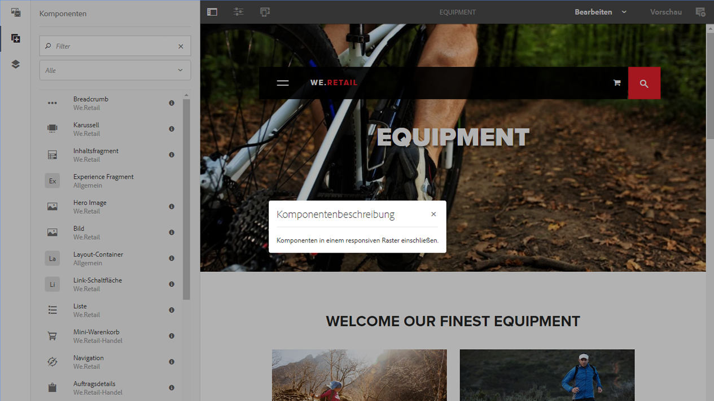

# Bearbeiten: Umgebung und Tools{#authoring-the-environment-and-tools}

Die Autorenumgebung von AEM bietet verschiedene Mechanismen für das Organisieren und Bearbeiten von Inhalten. Die verfügbaren Tools können über verschiedene Konsolen und Seiteneditoren aufgerufen werden.

## Verwalten Ihrer Site {#managing-your-site}

Die **Sites** Mit der Konsole können Sie auf Ihrer Website navigieren und diese verwalten. Verwenden Sie dazu die Kopfzeilenleiste, Symbolleiste, Aktionssymbole (für die ausgewählte Ressource zutreffend), Breadcrumbs und ggf. sekundäre Leisten (z. B. Timeline und Verweise).

Zum Beispiel in der Spaltenansicht:

## Bearbeiten des Seiteninhalts {#editing-page-content}

Sie können eine Seite mit dem Seiteneditor bearbeiten. Beispiel:

`https://localhost:4502/editor.html/content/we-retail/us/en/equipment.html`

>[!NOTE]
>
>Wenn Sie eine Seite zum ersten Mal zur Bearbeitung öffnen, bietet Ihnen eine Reihe von Folien eine Übersicht über die Funktionen.
>
>Sie können diese Tour überspringen und jederzeit wiederholen, indem Sie sie im Menü **Seiteninformationen** auswählen.

## Aufrufen der Hilfe   {#accessing-help}

Wenn Sie eine Seite bearbeiten, können Sie folgendermaßen auf die **Hilfe** zugreifen:

* die [**Seiteninformationen**](/help/sites-authoring/editing-page-properties.md#page-properties) selector; zeigt die Einführungsfolien an (wie beim ersten Zugriff auf den Editor gezeigt).
* die [Konfiguration](/help/sites-authoring/editing-content.md#edit-configure-copy-cut-delete-paste) Dialogfeld für bestimmte Komponenten (mit dem Fragezeichen (?) -Symbol in der Symbolleiste des Dialogfelds); dies zeigt kontextsensitive Hilfe.

In den Konsolen stehen weitere [Hilferessourcen zur Verfügung](/help/sites-authoring/basic-handling.md#accessing-help).

## Komponenten-Browser {#components-browser}

Der Komponenten-Browser enthält alle Komponenten, die zur Verwendung auf der aktuellen Seite verfügbar sind. Sie können diese an die gewünschte Position ziehen und dann bearbeiten, um Inhalte hinzuzufügen.

Der Komponenten-Browser befindet sich auf einer Registerkarte im seitlichen Bedienfeld (zusammen mit dem [Asset-Browser](/help/sites-authoring/author-environment-tools.md#assets-browser) und der [Inhaltsstruktur](/help/sites-authoring/author-environment-tools.md#content-tree)). Um das Seitenbedienfeld zu öffnen (oder zu schließen), verwenden Sie das Symbol links oben in der Symbolleiste:

Wenn Sie den Seitenbereich öffnen, wird er von der linken Seite aus eingeblendet (wählen Sie die **Komponenten** Registerkarte, falls erforderlich). Wenn Sie geöffnet sind, können Sie alle für Ihre Seite verfügbaren Komponenten durchsuchen.

Das tatsächliche Erscheinungsbild und die Handhabung hängen vom verwendeten Gerätetyp ab:

>[!NOTE]
>
>Ein Mobilgerät wird erkannt, wenn die Breite weniger als 1024 Pixel beträgt. Dies kann auch bei einem kleinen Desktop-Fenster der Fall sein.

* **Mobilgerät (z. B. iPad)**

  Der Komponenten-Browser deckt die gesamte bearbeitete Seite ab.

  Um eine Komponente zu Ihrer Seite hinzuzufügen, halten Sie die gewünschte Komponente gedrückt und verschieben Sie sie nach rechts - der Komponenten-Browser wird geschlossen, um die Seite erneut anzuzeigen - wo Sie die Komponente platzieren können.

  

* **Desktop-Gerät**

  Der Komponenten-Browser wird auf der linken Seite des Fensters geöffnet.

  Um Ihrer Seite eine Komponente hinzuzufügen, klicken Sie auf die gewünschte Komponente und ziehen Sie sie an die gewünschte Position.

  

  Komponenten werden wie folgt dargestellt:

   * Komponentenname
   * Komponentengruppe (in grau)
   * Symbol oder Abkürzung

      * Die Symbole für die Standardkomponenten sind monochrom dargestellt.
      * Für die Abkürzungen werden immer die ersten zwei Buchstaben des Komponentennamens verwendet.

  In der oberen Symbolleiste in der **Komponenten** -Browser verwenden, können Sie Folgendes tun:

   * Komponenten nach Namen filtern
   * Begrenzen Sie die Anzeige mithilfe der Dropdown-Auswahl auf eine bestimmte Gruppe.

  Für eine detailliertere Beschreibung der Komponente können Sie im Browser **Komponenten** auf das Informationssymbol neben der Komponente tippen/klicken (falls verfügbar). Beispiel für den **Layout-Container**:

  

  Weitere Informationen zu den verfügbaren Komponenten finden Sie unter [Komponentenkonsole](/help/sites-authoring/default-components-console.md).

## Asset-Browser {#assets-browser}

Der Asset-Browser enthält alle [Assets](/help/assets/home.md), die auf Ihrer aktuellen Seite direkt verwendet werden können.

Der Asset-Browser befindet sich auf einer Registerkarte im seitlichen Bedienfeld (zusammen mit dem [Komponenten-Browser](/help/sites-authoring/author-environment-tools.md#components-browser) und der [Inhaltsstruktur](/help/sites-authoring/author-environment-tools.md#content-tree)). Um das Seitenbedienfeld zu öffnen oder zu schließen, verwenden Sie das Symbol links oben in der Symbolleiste:

Wenn Sie den Seitenbereich öffnen, wird er von der linken Seite aus eingeblendet. Wählen Sie die **Assets** bei Bedarf.

Wenn der Asset-Browser geöffnet ist, können Sie alle für Ihre Seite verfügbaren Assets durchsuchen. Bei Bedarf können Sie die Liste durch Scrollen unendlich erweitern.

Um ein Asset zu der Seite hinzuzufügen, wählen Sie es aus und ziehen Sie es an die gewünschte Position. Dabei kann es sich um Folgendes handeln:

* Eine vorhandene Komponente des entsprechenden Typs.

   * Sie können beispielsweise ein Asset des Typs „Bild“ auf eine Bildkomponente ziehen.

* A [Platzhalter](/help/sites-authoring/editing-content.md#component-placeholder) im Absatzsystem, um eine Komponente des entsprechenden Typs zu erstellen.

   * Sie können beispielsweise ein Asset des Typs „Bild“ in das Absatzsystem ziehen, um eine Bildkomponente zu erstellen.

>[!NOTE]
>
>Dies ist für spezielle Assets und Komponententypen verfügbar. Weitere Einzelheiten finden Sie unter [Einfügen einer Komponente mit dem Asset-Browser](/help/sites-authoring/editing-content.md#inserting-a-component-using-the-assets-browser).

In der Symbolleiste des Asset-Browsers können Sie Assets nach folgenden Kriterien filtern:

* Name
* Pfad
* Asset-Typ: Bilder, Manuskripte, Dokumente, Videos, Seiten, Absätze und Produkte
* Asset-Merkmale, z. B. Ausrichtung (Hochformat, Querformat, quadratisch) und Stil (farbig, monochrom, Graustufen)

   * Nur für bestimmte Asset-Typen verfügbar

Das tatsächliche Erscheinungsbild und die Handhabung hängen vom verwendeten Gerätetyp ab:

>[!NOTE]
>
>Ein Mobilgerät wird erkannt, wenn die Breite weniger als 1024 Pixel beträgt, d. h. auch bei einem kleinen Desktop-Fenster.

* **Mobilgerät, z. B. iPad**

  Der Asset-Browser deckt die gesamte bearbeitete Seite ab.

  Um ein Asset zur Seite hinzuzufügen, berühren und halten Sie das gewünschte Asset und verschieben Sie es dann nach rechts. Der Asset-Browser wird geschlossen, um die Seite erneut anzuzeigen, wo Sie das Asset zur gewünschten Komponente hinzufügen können.

  

* **Desktop-Gerät**

  Der Asset-Browser wird auf der linken Seite des Fensters geöffnet.

  Um ein Asset zu Ihrer Seite hinzuzufügen, klicken Sie auf das Asset und ziehen Sie es auf die gewünschte Komponente oder Position.

  

Wenn Sie ein Asset schnell ändern müssen, können Sie die [Asset-Editor](/help/assets/manage-assets.md) durch Klicken auf das Bearbeitungssymbol neben dem Asset-Namen.

## Inhaltsstruktur {#content-tree}

Die **Inhaltsstruktur** gibt einen Überblick über alle Komponenten auf der Seite in einer Hierarchie, sodass Sie auf einen Blick sehen können, wie die Seite aufgebaut ist.

Die Inhaltsstruktur befindet sich auf einer Registerkarte im seitlichen Bedienfeld (zusammen mit dem Asset-Browser). Um das Seitenbedienfeld zu öffnen oder zu schließen, verwenden Sie das Symbol links oben in der Symbolleiste:

Wenn Sie den Seitenbereich öffnen, wird er von der linken Seite aus eingeblendet. Wählen Sie ggf. die Registerkarte **Inhaltsstruktur**. Mit dieser Strukturansicht Ihrer Seite oder Vorlage können Sie leicht nachvollziehen, wie die darauf verwendeten Komponenten hierarchisch strukturiert sind. Auf einer komplexen Seite ist es außerdem einfacher, zwischen den Komponenten der Seite zu springen.

Da eine Seite häufig zahlreiche Komponenten desselben Typs enthält, wird in der Komponentenstruktur (Inhalt) neben dem Namen des Komponententyps (schwarz dargestellt) zusätzlich eine Beschreibung angezeigt (grau dargestellt). Der Text für diese Beschreibung wird aus den allgemeinen Eigenschaften der Komponente (z. B. Titel oder Text) entnommen.

Komponententypen werden in der Benutzersprache angezeigt, während der Text für die Komponentenbeschreibung aus der Seitensprache stammt.

Wenn Sie auf den Pfeil neben einer Komponente klicken, wird diese Ebene reduziert oder erweitert.

>[!NOTE]
>
>Beim Bearbeiten einer Seite auf einem Mobilgerät ist die Inhaltsstruktur nicht verfügbar (wenn die Browser-Breite weniger als 1.024 Pixel beträgt).

Durch Klicken auf die Komponente wird die Komponente im Seiteneditor hervorgehoben. Die verfügbaren Aktionen hängen vom Seitenstatus ab:

* Zum Beispiel bei einer einfachen Seite:

  `https://localhost:4502/editor.html/content/we-retail/language-masters/en/equipment.html`

  

  Wenn die Komponente, auf die Sie in der Struktur klicken, bearbeitbar ist, wird rechts neben dem Namen ein Schraubenschlüsselsymbol angezeigt. Durch Klicken auf dieses Symbol wird das Dialogfeld &quot;Bearbeiten&quot;für die Komponente geöffnet.

  

* Oder bei einer Seite, die Teil einer [Live Copy](/help/sites-administering/msm.md) ist, wobei Komponenten von einer anderen Seite übernommen werden, zum Beispiel

  `https://localhost:4502/editor.html/content/we-retail/us/en/equipment.html`

  

## Fragmente: Browser für zugehörige Inhalte {#fragments-associated-content-browser}

Wenn Ihre Seite Inhaltsfragmente enthält, können Sie auf die [Browser für zugehörige Inhalte](/help/sites-authoring/content-fragments.md#using-associated-content).

## Verweise {#references}

**Verweise** Anzeigen von Verbindungen zur ausgewählten Seite:

* Blueprints
* Launches
* Live Copies
* Sprachkopien
* Eingehende Links
* Verwendung der Referenzkomponente: geliehener und verliehener Inhalt
* Verweise auf Produktseiten (auf der Konsole „E-Commerce - Produkte“)

Öffnen Sie die gewünschte Konsole, navigieren Sie zur gewünschten Ressource und öffnen Sie **Verweise** wie folgt:

[Auswählen der erforderlichen Ressource](/help/sites-authoring/basic-handling.md#viewing-and-selecting-resources) zeigt eine Liste der Verweistypen an, die für diese Ressource relevant sind:

Wählen Sie den gewünschten Verweistyp, um weitere Informationen anzuzeigen: In bestimmten Situationen sind weitere Aktionen verfügbar, wenn Sie einen bestimmten Verweis auswählen, einschließlich:

* **Eingehende Links** bietet eine Liste der Seiten, die auf die Seite verweisen, sowie direkten Zugriff auf **Bearbeiten** eine dieser Seiten, wenn Sie einen bestimmten Link auswählen.

   * Dies kann nur statische Links anzeigen, nicht dynamisch generierte Links, z. B. aus der Listenkomponente.

* Instanzen von geliehenen und verliehenen Inhalten, die die **Referenz**-Komponente verwenden. Sie können von hier aus zur referenzierten Seite navigieren.

* [Verweise auf Produktseiten](/help/commerce/cif-classic/administering/generic.md#showing-product-references) (verfügbar in der Konsole „E-Commerce - Produkte“)
* [Launches](/help/sites-authoring/launches.md) bietet Zugriff auf zugehörige Launches.
* [Live Copies](/help/sites-administering/msm.md) zeigt die Pfade aller Live Copies an, die auf der gewählten Ressource basieren.
* [Blueprint](/help/sites-administering/msm-best-practices.md) bietet Details und verschiedene Aktionen.
* [Sprachkopien](/help/sites-administering/tc-manage.md#creating-translation-projects-using-the-references-panel) bietet Details und verschiedene Aktionen.

Sie können beispielsweise einen beschädigten Verweis innerhalb einer Verweiskomponente reparieren:

## Ereignisse: Zeitleiste {#events-timeline}

Bei bestimmten Ressourcen (z. B. Seiten aus der **Sites**-Konsole oder Assets aus der **Asset**-Konsole) kann die [Timeline dazu verwendet werden, die zuletzt durchgeführten Aktivitäten für ausgewählte Elemente anzuzeigen](/help/sites-authoring/basic-handling.md#timeline).

Öffnen Sie die gewünschte Konsole, navigieren Sie zur gewünschten Ressource und öffnen Sie die **Zeitleiste** wie folgt:

[Wählen Sie die gewünschte Ressource ](/help/sites-authoring/basic-handling.md#viewing-and-selecting-resources)und danach entweder **Alle anzeigen** oder **Aktivitäten** aus, um die mit den ausgewählten Ressourcen zuletzt ausgeführten Aktionen aufzulisten:

## Seiteninformationen {#page-information}

Mit der Schaltfläche „Seiteninformationen“ (Equalizer-Symbol) öffnen Sie ein Menü, das auch Details zur letzten Bearbeitung und zur letzten Aktivierung enthält. Abhängig von den Eigenschaften der Seite (und der Website, zu der sie gehört) sind u. U. weitere Optionen verfügbar:

* [Eigenschaften öffnen](/help/sites-authoring/editing-page-properties.md)
* [Seiten-Rollout](/help/sites-administering/msm.md#msm-from-the-ui)
* [Workflow starten](/help/sites-authoring/workflows-applying.md#starting-a-workflow-from-the-page-editor)
* [Sperren einer Seite](/help/sites-authoring/editing-content.md#locking-a-page)
* [Seite veröffentlichen](/help/sites-authoring/publishing-pages.md#main-pars-title-10)
* [Veröffentlichen einer Seite aufheben](/help/sites-authoring/publishing-pages.md#main-pars-title-5)
* [Vorlage bearbeiten](/help/sites-authoring/templates.md), wenn die Seite auf einer [bearbeitbaren Vorlage](/help/sites-authoring/templates.md#editable-and-static-templates) basiert.

* [Als veröffentlicht anzeigen](/help/sites-authoring/editing-content.md#view-as-published)
* „In Admin anzeigen“ öffnet die Seite in der [Sites-Konsole](/help/sites-authoring/basic-handling.md#viewing-and-selecting-resources)
* [Hilfe](/help/sites-authoring/basic-handling.md#accessing-help)

Zum Beispiel hat **Seiteninformation** gegebenenfalls auch die Optionen:

* [Launch bewerben](/help/sites-authoring/launches-promoting.md), wenn die Seite ein Launch ist
* [In klassischer Benutzeroberfläche öffnen](/help/sites-authoring/select-ui.md#switching-to-classic-ui-when-editing-a-page) wenn diese Option [von einem Administrator aktiviert](/help/sites-administering/enable-classic-ui-editor.md)

Darüber hinaus können über die **Seiteninformationen** ggf. auch Analysen und Empfehlungen aufgerufen werden.

## Seitenmodi {#page-modes}

Für die Bearbeitung von Seiten stehen verschiedene Modi zur Verfügung, über die jeweils unterschiedliche Aktionen durchgeführt werden können:

* [Bearbeiten](/help/sites-authoring/editing-content.md) - Verwenden Sie diesen Modus beim Bearbeiten des Seiteninhalts.
* [Layout](/help/sites-authoring/responsive-layout.md) - ermöglicht Ihnen, Ihr responsives Layout gerätespezifisch zu erstellen und zu bearbeiten (wenn die Seite auf einem Layout-Container basiert)

* [Strukturvorlage](/help/sites-authoring/scaffolding.md) - hilft Ihnen bei der Erstellung einer großen Gruppe von Seiten, die eine gemeinsame Struktur aufweisen, aber unterschiedliche Inhalte haben.
* [Entwickler](/help/sites-developing/developer-mode.md) - ermöglicht die Durchführung verschiedener Aktionen (erfordert Berechtigungen). Dazu gehört die Überprüfung der technischen Details einer Seite und ihrer Komponenten.

* [Design](/help/sites-authoring/default-components-designmode.md) - ermöglicht es Ihnen, Komponenten für die Verwendung auf einer Seite zu aktivieren bzw. zu deaktivieren und das Design der Komponente zu konfigurieren (wenn die Seite auf einer [statische Vorlage](/help/sites-authoring/templates.md#editable-and-static-templates)).

* [Zielsetzung:](/help/sites-authoring/content-targeting-touch.md) Steigerung der Inhaltsrelevanz durch Zielsetzung und Messung über alle Kanäle hinweg.
* [Activity Map:](/help/sites-authoring/page-analytics-using.md#analyticsvisiblefromthepageeditor) Zeigt Analytics-Daten für die Seite an.

* [Timewarp](/help/sites-authoring/working-with-page-versions.md#timewarp) - ermöglicht die Anzeige des Seitenstatus zu einem bestimmten Zeitpunkt.
* [Live Copy-Status:](/help/sites-authoring/editing-content.md#live-copy-status) Für einen schnellen Überblick über den Live Copy-Status und darüber, welche Komponenten übernommen oder nicht übernommen wurden.
* [Vorschau](/help/sites-authoring/editing-content.md#previewing-pages) - wird verwendet, um die Seite so anzuzeigen, wie sie in der Veröffentlichungsumgebung angezeigt wird, oder um mithilfe von Links im Inhalt zu navigieren.

* [Anmerken](/help/sites-authoring/annotations.md): In diesem Modus können Sie Anmerkungen auf der Seite hinzufügen oder anzeigen.

Auf diese können Sie über die Symbole oben rechts zugreifen. Das tatsächliche Symbol ändert sich entsprechend dem derzeit verwendeten Modus:

>[!NOTE]
>
>* Je nach den Eigenschaften der Seite sind einige Modi möglicherweise nicht verfügbar.
>* Für den Zugriff auf einige Modi sind die entsprechenden Berechtigungen erforderlich.
>* Aus Platzgründen steht der Entwicklermodus auf Mobilgeräten nicht zur Verfügung.
>* Es gibt eine [Tastaturbefehl](/help/sites-authoring/page-authoring-keyboard-shortcuts.md) ( `Ctrl-Shift-M`) zum Umschalten zwischen **Vorschau** und dem derzeit ausgewählten Modus (z. B. **Bearbeiten**, und **Layout**).
>

## Pfadauswahl {#path-selection}

Oft muss bei der Bearbeitung einer Seite eine andere Ressource ausgewählt werden (z. B. zum Definieren eines Links zu einer anderen Seite/Ressource oder zum Auswählen eines Bilds). Zur Vereinfachung der Pfadauswahl werden Eingaben in den [Pfad-Feldern](/help/sites-authoring/author-environment-tools.md#path-fields) automatisch ausgefüllt. Ergänzend dazu stehen zudem leistungsstarke Auswahlfunktionen im [Pfad-Browser](/help/sites-authoring/author-environment-tools.md#path-browser) zur Verfügung.

### Pfadfelder {#path-fields}

Im vorliegenden Beispiel wird zur Verdeutlichung die Bildkomponente verwendet. Weitere Informationen zur Verwendung und Bearbeitung von Komponenten finden Sie unter [Komponenten für die Seitenbearbeitung](/help/sites-authoring/default-components.md).

Die Pfadfelder bieten jetzt auch automatisches Ausfüllen und Vorausschau auf Eingaben, um die Suche nach Ressourcen zu vereinfachen.

Durch Klicken auf die Schaltfläche **Auswahl-Dialogfeld öffnen** auf dem Pfadfeld wird das Dialogfeld [Pfad-Browser](/help/sites-authoring/author-environment-tools.md#path-browser) geöffnet, in dem Optionen für eine präzisere Auswahl zur Verfügung stehen.

Alternativ können Sie mit der Eingabe in das Pfadfeld beginnen und AEM bietet passende Pfade während der Eingabe an.

### Pfad-Browser {#path-browser}

Der Pfad-Browser ist wie die [Spaltenansicht](/help/sites-authoring/basic-handling.md#column-view) der Sites-Konsole aufgebaut und ermöglicht eine präzisere Auswahl der Ressourcen.

* Sobald eine Ressource ausgewählt wird, wird die Schaltfläche **Auswählen** oben rechts im Dialogfeld aktiviert. Klicken/tippen Sie darauf, um die Auswahl zu bestätigen, oder heben Sie die Auswahl über **Abbrechen** auf.
* Wenn der Kontext die Auswahl mehrerer Ressourcen zulässt, wird bei Auswahl einer Ressource auch die Schaltfläche **Auswählen** aktiviert, aber auch die Anzahl der ausgewählten Ressourcen wird oben rechts im Fenster angezeigt. Klicks **X** neben der Zahl, um die Auswahl für alle aufzuheben.
* Wenn Sie durch den Baum navigieren, wird Ihre Position in den Breadcrumbs am oberen Rand des Dialogfelds angezeigt. Mithilfe der Breadcrumbs können Sie innerhalb der Ressourcenhierarchie schnell von einem Punkt zu einem anderen wechseln.
* Sie können das Suchfeld jederzeit oben im Dialogfeld verwenden. Klicken Sie im Suchfeld auf **X**, wenn Sie die Suche löschen möchten.
* Sie können Ihre Suche auch eingrenzen, indem Sie die Filteroptionen einblenden und die Ergebnisse nach Pfad filtern.

  

## Tastaturbefehle {#keyboard-shortcuts}

Für die Bedienung stehen verschiedene [Tastaturbefehle](/help/sites-authoring/page-authoring-keyboard-shortcuts.md) zur Verfügung.
