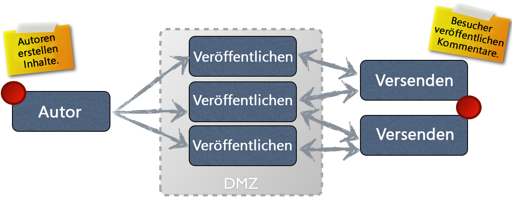

# Bearbeiten{#authoring}

## Die Begriffe des Authoring und Publishing (Bearbeiten und Veröffentlichen)  {#concept-of-authoring-and-publishing}

AEM bietet Ihnen zwei Umgebungen:

* Autor
* Veröffentlichung

Diese interagieren miteinander und bieten Ihnen die Möglichkeit, Inhalt auf Ihrer Website verfügbar zu machen, sodass Ihre Besucher ihn lesen können.

Die Autorenumgebung bietet die Mechanismen zum Erstellen, Aktualisieren und Überprüfen dieses Inhalts, bevor er tatsächlich veröffentlicht wird.

* Ein Autor erstellt und überprüft den Inhalt (dabei kann es sich um verschiedene Inhaltstypen handeln, z. B. Seiten, Assets, Veröffentlichungen usw.),
* der zu einem späteren Zeitpunkt auf Ihrer Website veröffentlicht wird.

In der Autorenumgebung werden die Funktionen von AEM in zwei Benutzeroberflächen bereitgestellt. In der Veröffentlichungsumgebung entwerfen Sie das Aussehen der Oberfläche, die Sie Ihren Benutzern zur Verfügung stellen.

### Autorenumgebung {#author-environment}

Der Autor arbeitet in der sogenannten **Autorenumgebung**. Diese bietet eine einfach zu verwendende Oberfläche (grafische Benutzeroberfläche (GUI oder UI)) zum Erstellen von Inhalt. Normalerweise befindet sich diese hinter der Firewall eines Unternehmens, die vollen Schutz bietet und eine Anmeldung des Autors mit einem Konto mit entsprechenden Zugriffsrechten erfordert.

>[!NOTE]
>
>Ihr Konto muss über die entsprechenden Zugriffsrechte verfügen, um Inhalt erstellen, bearbeiten oder veröffentlichen zu können.

Je nachdem, wie die jeweilige Instanz und die entsprechenden Benutzerrechte konfiguriert sind, können Autoren für Inhalte unter anderem die folgenden Aufgaben durchführen:

* Erstellen neuer Inhalte oder Bearbeiten vorhandener Inhalte auf einer Seite
* Verwenden vordefinierter Vorlagen zum Erstellen neuer Inhaltsseiten
* Erstellen, Bearbeiten und Verwalten von Assets und Sammlungen
* Erstellen, Bearbeiten und Verwalten von Veröffentlichungen
* Entwickeln von Kampagnen und damit zusammenhängenden Ressourcen
* Entwickeln und Verwalten von Community-Sites
* Verschieben, Kopieren oder Löschen von Inhaltsseiten, Assets usw.
* Veröffentlichen (oder Rückgängigmachen der Veröffentlichung) von Seiten, Assets usw.

Außerdem gibt es administrative Aufgaben, die Sie beim Verwalten des Inhalts unterstützen:

* Workflows für die Verwaltung von Änderungen, zum Beispiel: Anfordern einer Prüfung vor der Veröffentlichung
* Projekte zur Koordinierung einzelner Aufgaben

>[!NOTE]
>
>AEM wird außerdem aus der Autorenumgebung [verwaltet](/help/sites-administering/home.md) (für eine Vielzahl von Aufgaben).

#### Veröffentlichungsumgebung {#publish-environment}

Wenn der Inhalt der AEM Site fertig ist, wird er in der **Veröffentlichungsumgebung** veröffentlicht. Hier werden die Seiten der Website in Übereinstimmung mit dem Aussehen der entworfenen Oberfläche der vorgesehenen Zielgruppe bereitgestellt.

Normalerweise befindet sich die Veröffentlichungsumgebung innerhalb der DMZ, d. h. es besteht die Möglichkeit des Zugriffs vom Internet aus und der vollständige Schutz durch das eigene Netzwerk ist nicht mehr gewährleistet.

Handelt es sich bei der AEM-Site um eine [Community-Site](/help/communities/overview.md) oder enthält sie [Community-Komponenten](/help/communities/author-communities.md), können alle angemeldeten Besucher der Site (Mitglieder) die Community-Funktionen nutzen. Sie können beispielsweise in einem Forum posten, einen Kommentar posten oder anderen Mitgliedern folgen. Mitglieder erhalten möglicherweise die Berechtigung, Aktivitäten durchzuführen, die normalerweise nur in der Autorenumgebung verfügbar sind. Hierzu gehören unter anderem das Erstellen neuer Seiten (Community-Gruppen) oder Blog-Beiträge oder die Moderation der Beiträge anderer Mitglieder.

>[!NOTE]
>
>Leider gibt es bei der verwendeten Terminologie gelegentlich Überschneidungen. Dies ist bei folgenden Begriffen möglich:
>
>* **Veröffentlichen/Veröffentlichung rückgängig machen**
   >  Dies sind die Hauptbegriffe für die Aktionen, mit denen Sie Ihren Inhalt in Ihrer Publishing-Umgebung verfügbar machen (oder dies rückgängig machen).
   >
   >
* **Aktivieren/Deaktivieren**
   >  Diese Begriffe sind Synonyme für das Veröffentlichen/Rückgängigmachen der Veröffentlichung.
   >
   >
* **Replizieren/Replikation**
   >  Hierbei handelt es sich um technische Begriffe, die die Verschiebung von Daten (z. B. Seiteninhalt, Dateien, Code, Benutzerkommentare) von einer Umgebung zur anderen anzeigen. d. h. beim Veröffentlichen oder bei der umgekehrten Replizierung von Benutzerkommentaren.
>

#### Dispatcher {#dispatcher}

Um eine optimale Nutzung der Website durch Ihre Besucher zu gewährleisten, führt der **[Dispatcher](https://helpx.adobe.com/experience-manager/dispatcher/user-guide.html) Lastverteilung und Caching durch.**
