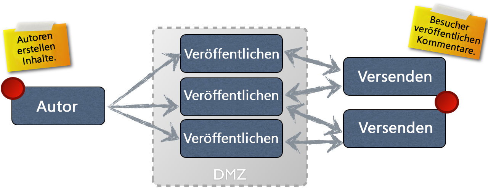

# Authoring{#authoring}

## Konzept des Authoring (und des Veröffentlichens) {#concept-of-authoring-and-publishing}

AEM bietet Ihnen zwei Umgebungen:

* Autor
* Veröffentlichung

Diese interagieren miteinander und bieten Ihnen die Möglichkeit, Inhalte auf Ihrer Website verfügbar zu machen, sodass Ihre Besucherinnen und Besucher sie lesen können.

Die Autorenumgebung bietet die Mechanismen zum Erstellen, Aktualisieren und Überprüfen dieser Inhalte, bevor sie tatsächlich veröffentlicht werden.

* Eine Autorin oder ein Autor erstellt und überprüft die Inhalte (dabei kann es sich um verschiedene Inhaltstypen handeln, z. B. Seiten, Assets oder Veröffentlichungen),
* die zu einem späteren Zeitpunkt auf Ihrer Website veröffentlicht werden.

In der Autorenumgebung werden die Funktionen von AEM auf zwei Benutzeroberflächen bereitgestellt. In der Publishing-Umgebung entwerfen Sie das Aussehen der Oberfläche, die Sie Ihren Benutzenden zur Verfügung stellen.

### Authoring-Umgebung {#author-environment}

Die Autorin bzw. der Autor arbeitet in der sogenannten **Authoring-Umgebung**. Darin steht eine einfach zu verwendende grafische Benutzeroberfläche (GUI oder UI) für das Erstellen der Inhalte zur Verfügung. Diese befindet sich hinter der Firewall eines Unternehmens, die vollen Schutz bietet und eine Anmeldung der Autorin bzw. des Autors über ein Konto mit entsprechenden Zugriffsrechten erfordert.

>[!NOTE]
>
>Ihr Konto muss über die entsprechenden Zugriffsrechte verfügen, um Inhalte zu erstellen, zu bearbeiten oder zu veröffentlichen.

Je nachdem, wie Ihre Instanz und Ihre persönlichen Zugriffsrechte konfiguriert sind, können Sie viele Aufgaben in Bezug auf Ihre Inhalte durchführen, unter anderem:

* Erstellen neuer Inhalte oder Bearbeiten vorhandener Inhalte auf einer Seite
* Verwenden vordefinierter Vorlagen zum Erstellen neuer Inhaltsseiten
* Erstellen, Bearbeiten und Verwalten von Assets und Sammlungen
* Erstellen, Bearbeiten und Verwalten von Veröffentlichungen
* Entwickeln von Kampagnen und damit zusammenhängenden Ressourcen
* Entwickeln und Verwalten von Community-Sites
* Verschieben, Kopieren oder Löschen von Inhaltsseiten und Assets
* Veröffentlichen (oder Aufheben der Veröffentlichung) von Seiten und Assets

Außerdem gibt es administrative Aufgaben, die Sie beim Verwalten der Inhalte unterstützen:

* Workflows für die Verwaltung von Änderungen, zum Beispiel: Anfordern einer Prüfung vor der Veröffentlichung
* Projekte zur Koordinierung einzelner Aufgaben

>[!NOTE]
>
>AEM wird außerdem (für die meisten Aufgaben) von der Autorenumgebung aus [verwaltet](/help/sites-administering/home.md).

#### Veröffentlichungsumgebung {#publish-environment}

Wenn die Inhalte der AEM-Site fertig sind, werden sie in der **Veröffentlichungsumgebung** veröffentlicht. Hier werden die Seiten der Website in Übereinstimmung mit dem Aussehen der entworfenen Oberfläche der vorgesehenen Zielgruppe bereitgestellt.

Normalerweise befindet sich die Veröffentlichungsumgebung innerhalb der „entmilitarisierten Zone“, mit anderen Worten: für das Internet verfügbar, aber nicht mehr unter dem vollständigen Schutz des internen Netzwerks.

Wenn die AEM-Site eine [&#x200B; Community-Site](/help/communities/overview.md) ist oder [Community-Komponenten](/help/communities/author-communities.md) beinhaltet, können angemeldete Besucherinnen und Besucher der Site (Mitglieder) mit Community-Funktionen interagieren. Sie können beispielsweise in einem Forum posten, Kommentare abgeben oder anderen Mitgliedern folgen. Mitglieder erhalten möglicherweise die Berechtigung, Aktivitäten durchzuführen, die normalerweise nur in der Autorenumgebung verfügbar sind. Hierzu gehören unter anderem das Erstellen von neuen Seiten (Community-Gruppen) oder Blog-Beiträgen oder die Moderation der Beiträge anderer Mitglieder.

>[!NOTE]
>
>Leider gibt es manchmal Überschneidungen in der verwendeten Terminologie. Dies kann bei Folgendem vorkommen:
>
>* **Veröffentlichen/Veröffentlichung aufheben**
>  Dies sind die Hauptbegriffe für die Aktionen, mit denen Sie Ihren Inhalt in Ihrer Veröffentlichungsumgebung öffentlich verfügbar machen (oder nicht).
>
>* **Aktivieren/Deaktivieren**
>  Diese Begriffe sind gleichbedeutend mit Veröffentlichen/Rückgängigmachen der Veröffentlichung.
>
>* **Replizieren/Replikation**
>  Dies sind die technischen Begriffe, die verwendet werden, um das Verschieben von Daten (z. B. Seiteninhalte, Dateien, Code, Benutzerkommentare) von einer Umgebung in eine andere anzugeben, d. h. beim Veröffentlichen oder Rückwärtsreplizieren von Benutzerkommentaren.
>

#### Dispatcher {#dispatcher}

Um eine optimale Nutzung der Website durch Ihre Besucherinnen und Besucher zu gewährleisten, sorgt der **[Dispatcher](https://experienceleague.adobe.com/docs/experience-manager-dispatcher/using/dispatcher.html?lang=de)** für eine Lastverteilung und Caching.
