# Arbeiten mit Adobe Campaign Classic und Adobe Campaign Standard{#working-with-adobe-campaign-classic-and-adobe-campaign-standard}

Sie können E-Mail-Inhalte in AEM erstellen und diese in Adobe Campaign-E-Mails verarbeiten. Gehen Sie dazu wie folgt vor:

1. Erstellen Sie in AEM mithilfe einer für Adobe Campaign spezifischen Vorlage einen neuen Newsletter.
1. Wählen Sie [einen Adobe Campaign-Service](#selecting-the-adobe-campaign-cloud-service-and-template) aus, bevor Sie die Inhalte bearbeiten, um Zugriff auf alle Funktionen zu erhalten.
1. Bearbeiten Sie den Inhalt.
1. Überprüfen Sie den Inhalt. 

Der Inhalt kann anschließend mit einer Bereitstellung in Adobe Campaign synchronisiert werden. Eine ausführliche Anleitung finden Sie in diesem Dokument.

Weitere Informationen finden Sie unter [Erstellen von Adobe Campaign-Formularen in AEM](/help/sites-authoring/adobe-campaign-forms.md).

>[!NOTE]
>
>Bevor Sie diese Funktion verwenden können, müssen Sie AEM so konfigurieren, dass es sich entweder mit [Adobe Campaign](/help/sites-administering/campaignonpremise.md) oder [Adobe Campaign Standard](/help/sites-administering/campaignstandard.md) integrieren lässt.

## Versenden von E-Mail-Inhalten mit Adobe Campaign  {#sending-email-content-via-adobe-campaign}

Nach der Konfiguration von AEM und Adobe Campaign können Sie E-Mail-Inhalte direkt in AEM erstellen und sie anschließend in Adobe Campaign verarbeiten.

Wenn Sie Adobe Campaign-Inhalte in AEM erstellen, müssen Sie einen Link zu einem Adobe Campaign-Dienst erstellen, bevor Sie den Inhalt bearbeiten, um auf alle Funktionen zugreifen zu können.

Es gibt zwei mögliche Fälle:

* Der Inhalt kann mit einer Bereitstellung in Adobe Campaign synchronisiert sein. So lassen sich AEM-Inhalte in einer Bereitstellung verwenden.
* (Nur Adobe Campaign Classic) Inhalte können direkt an Adobe Campaign gesendet werden, wodurch automatisch eine neue E-Mail-Bereitstellung generiert wird. Diese Methode hat jedoch Einschränkungen.

Eine ausführliche Anleitung finden Sie in diesem Dokument.

### Erstellen neuer E-Mail-Inhalte  {#creating-new-email-content}

>[!NOTE]
>
>Stellen Sie beim Hinzufügen von E-Mail-Vorlagen sicher, dass Sie sie unter **/content/campaigns** hinzufügen, um sie verfügbar zu machen.

#### Erstellen neuer E-Mail-Inhalte {#creating-new-email-content-1}

1. Wählen Sie AEM **Sites**, dann **Kampagnen** und navigieren Sie dann zu dem Ort, an dem Ihre E-Mail-Kampagnen verwaltet werden. Im folgenden Beispiel lautet der Pfad **Sites** > **Kampagnen** > **Geometrixx Outdoors** > **E-Mail-Kampagnen**.

   >[!NOTE]
   >
   >[E-Mail-Muster stehen nur in Geometrixx zur Verfügung](/help/sites-developing/we-retail.md). Laden Sie Geometrixx-Beispielinhalt von Package Share herunter.

   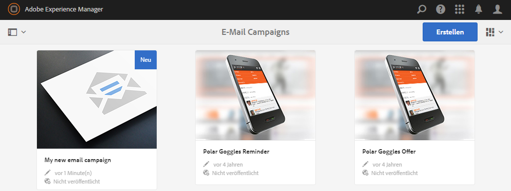

1. Wählen Sie dann **Erstellen** und **Seite erstellen** aus.
1. Wählen Sie je nach der Adobe-Kampagne, mit der Sie sich verbinden möchten, eine der verfügbaren Vorlagen aus und klicken Sie auf **Weiter**. Standardmäßig sind drei Vorlagen verfügbar:

   * **Adobe Campaign Classic Email**: fügt Inhalte zu einer vordefinierten Vorlage (zwei Spalten) hinzu, bevor sie zur Bereitstellung an Adobe Campaign Classic gesendet wird.
   * **Adobe Campaign Standard Email**: fügt Inhalte zu einer vordefinierten Vorlage (zwei Spalten) hinzu, bevor sie zur Bereitstellung an Adobe Campaign Standard gesendet wird.

1. Füllen Sie den **Titel** und optional den **Beschreibung** aus und klicken Sie auf **Erstellen**. Der Titel wird als Betreff des Newsletters/der E-Mail verwendet, falls er beim Bearbeiten der E-Mail nicht überschrieben wird.

### Auswählen von Adobe Campaign-Cloud-Service und Vorlagen {#selecting-the-adobe-campaign-cloud-service-and-template}

Möchten Sie eine Integration mit Adobe Campaign durchführen, müssen Sie der Seite einen Adobe Campaign-Service hinzufügen. Somit verfügen Sie über Zugriff auf Personalisierung und andere Daten aus Adobe Campaign.

Des Weiteren müssen Sie möglicherweise auch eine Adobe Campaign-Vorlage auswählen und den Betreff ändern und normalen Text für Benutzer einfügen, die die E-Mail nicht im HTML-Format anzeigen.

Sie können den Cloud-Service entweder über die Registerkarte **Sites** oder innerhalb des Newsletters/der E-Mail auswählen, nachdem Sie ihn/sie erstellt haben.

Die Auswahl des Cloud-Service über die Registerkarte **Sites** wird hierfür empfohlen. Die Auswahl des Cloud-Service über die E-Mail/den Newsletter ist ein deutlich komplizierteres Verfahren.

Auf der Seite **Sites**:

1. Wählen Sie in AEM die E-Mail-Seite aus und klicken Sie auf **Eigenschaften anzeigen**.

   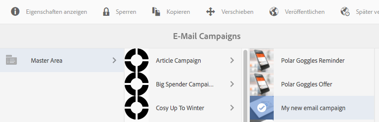

1. Wählen Sie **Bearbeiten** und dann die Registerkarte **Cloud-Services** aus, blättern Sie nach unten und klicken Sie auf das Pluszeichen (+), um eine Konfiguration hinzuzufügen. Wählen Sie dann **Adobe Campaign** aus.

   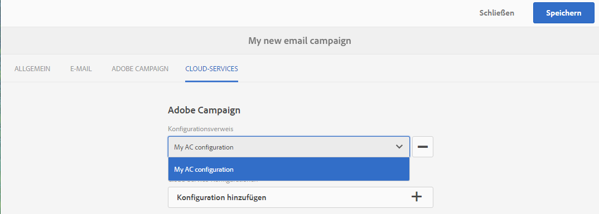

1. Wählen Sie aus einer Dropdown-Liste die Konfiguration aus, die Ihrer Adobe Campaign-Konfiguration entspricht, und bestätigen Sie Ihre Auswahl durch einen Klick auf **Speichern**.
1. Sie können die auf die E-Mail angewendete Vorlage anzeigen, indem Sie auf die Registerkarte **Adobe Campaign** klicken. Möchten Sie die Vorlage wechseln, können Sie diese während der Bearbeitung in der E-Mail selbst ändern.

   Wenn Sie eine andere als die Standard-E-Mail-Versandvorlage (aus Adobe Campaign) anwenden möchten, wählen Sie in **Eigenschaften** den Tab **Adobe Campaign** aus. Geben Sie den internen Namen der E-Mail-Vorlage in die jeweilige Adobe Campaign-Instanz ein.

   Welche Vorlage Sie wählen bestimmt, welche Personalisierungsfelder in Adobe Campaign verfügbar sind.

   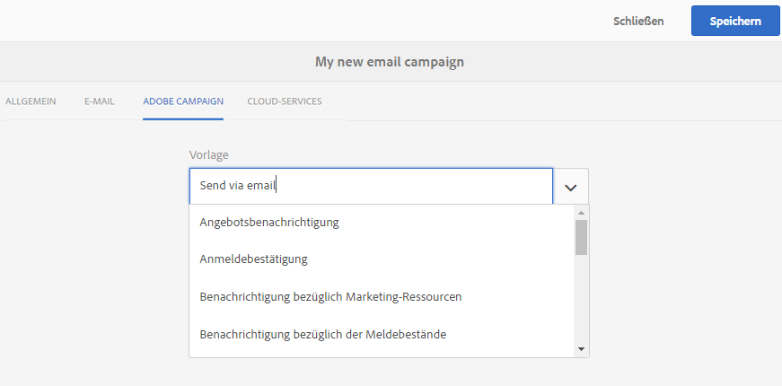

Möglicherweise können Sie bei der Bearbeitung des Newsletters/der E-Mail aufgrund eines Layoutproblems den Adobe Campaign-Cloud-Service nicht direkt unter **Seiteneingenschaften** auswählen. Stattdessen können Sie dieses Problem wie folgt umgehen:

1. Wählen Sie in AEM die E-Mail-Seite aus und klicken Sie auf **Bearbeiten**. Klicken Sie auf **Eigenschaften öffnen**.

   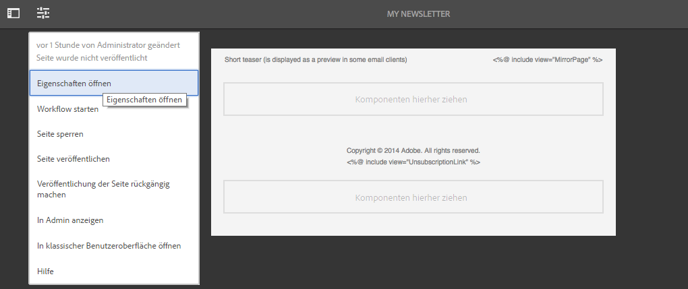

1. Wählen Sie **Cloud Services** und klicken Sie auf **+** , um eine Konfiguration hinzuzufügen. Wählen Sie eine sichtbare Konfiguration aus (es spielt keine Rolle welche). Klicken oder tippen Sie auf das **+**, um eine weitere Konfiguration hinzuzufügen, und wählen Sie dann **Adobe Campaign** aus.

   >[!NOTE]
   >
   >Alternativ können Sie die Cloud-Services durch Auswahl der Option **Eigenschaften anzeigen** auf der Registerkarte **Sites** auswählen.

1. Wählen Sie in der Dropdownliste die Ihrer Adobe Campaign-Instanz entsprechende Konfiguration aus, löschen Sie die erste von Ihnen erstellte Konfiguration, die nicht für Adobe Campaign vorgesehen war, und bestätigen Sie dann durch Klicken auf das Häkchen.
1. Fahren Sie nun mit Schritt 4 des zuvor beschriebenen Verfahrens fort, um eine Vorlage auszuwählen und einfachen Text hinzuzufügen.

### Bearbeiten von E-Mail-Inhalten {#editing-email-content}

So bearbeiten Sie E-Mail-Inhalte:

1. Beim Öffnen der E-Mail wechseln Sie automatisch in den Bearbeitungsmodus.

   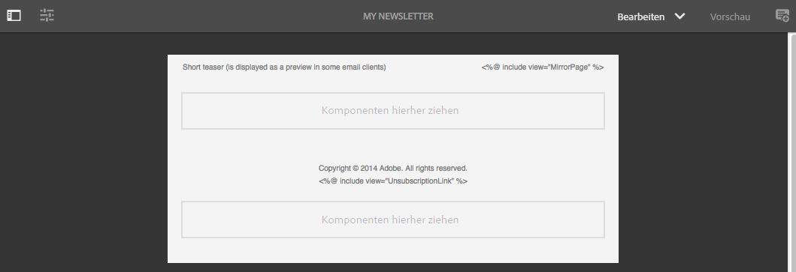

1. Wenn Sie den Betreff der E-Mail ändern oder Text für Benutzer hinzufügen möchten, die die E-Mail nicht im HTML-Format ansehen, wählen Sie **E-Mail** aus und fügen Sie einen Betreff und Text hinzu. Wählen Sie das Seitensymbol aus, um automatisch aus der HTML-Version eine Version mit einfachem Text zu generieren. Klicken Sie zum Abschluss auf das Häkchen.

   Sie können den Newsletter mithilfe der Personalisierungsfelder von Adobe Campaign individueller gestalten. Möchten Sie ein Personalisierungsfeld hinzufügen, klicken Sie auf die Schaltfläche mit dem Adobe Campaign-Logo, um die Auswahl für Personalisierungsfelder zu öffnen. Sie können aus allen Feldern auswählen, die für diese Newsletter verfügbar sind.

   >[!NOTE]
   >
   >Sind die Personalisierungsfelder in Eigenschaften innerhalb des Editors ausgegraut, muss die Konfiguration überprüft werden.

   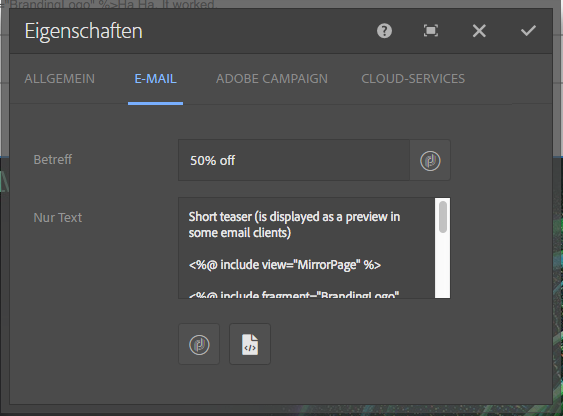

1. Öffnen Sie das Komponentenbedienfeld auf der linken Bildschirmseite und wählen Sie **Adobe Campaign Newsletter** aus dem Dropdown-Menü aus, um diese Komponenten zu finden.

   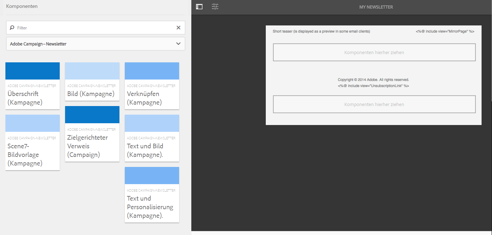

1. Die Komponenten direkt auf die Seite ziehen und entsprechend bearbeiten. Sie können beispielsweise eine Komponente des Typs **Text und Personalisierung (Kampagne)** auf die Seite ziehen und personalisierten Text einfügen.

   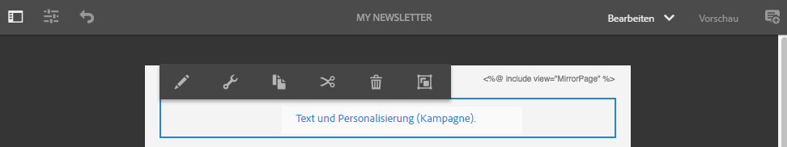

   Eine detaillierte Beschreibung der einzelnen Komponenten finden Sie unter [Adobe Campaign Components](/help/sites-authoring/adobe-campaign-components.md) .

   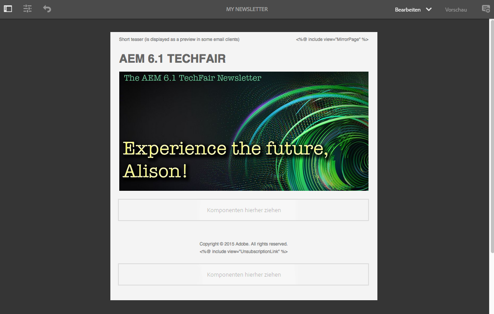

### Einfügen von Personalisierung {#inserting-personalization}

Beim Bearbeiten Ihres Inhalts können Sie Folgendes einfügen:

* Adobe Campaign-Kontextfelder. Hierbei handelt es sich um Felder, die Sie in Ihren Text einfügen können und die entsprechend den Empfängerdaten angepasst werden (z. B. Vorname, Nachname oder beliebige Daten der Zieldimension).
* Adobe Campaign-Personalisierungsblöcke. Hierbei handelt es sich um Blöcke vordefinierter Inhalte, die nicht mit den Empfängerdaten in Zusammenhang stehen, wie z. B. ein Markenlogo oder ein Link zu einer Mirrorseite.

Detaillierte Beschreibungen der Komponenten von Adobe Campaign finden Sie unter [Adobe Campaign-Komponenten](/help/sites-authoring/adobe-campaign-components.md).

>[!NOTE]
>
>* Es werden nur die Felder der Adobe Campaign-**Profile** der Targeting-Dimension berücksichtigt.
>* Beim Anzeigen von Eigenschaften über **Sites** haben Sie keinen Zugriff auf die Adobe Campaign-Kontextfelder. Sie können bei deren Bearbeitung direkt aus E-Mails darauf zugreifen.

So fügen Sie Personalisierung ein:

1. Fügen Sie eine neue Komponente **Newsletter** > **Text und Personalisierung (Kampagne)** ein, indem Sie sie auf die Seite ziehen.

   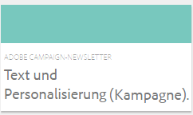

1. Öffnen Sie die Komponente, indem Sie auf das Stiftsymbol klicken. Der Editor für die Bearbeitung im Kontext wird geöffnet.

   

   >[!NOTE]
   >
   >**Adobe Campaign Standard:**
   >
   >* Die verfügbaren Kontextfelder entsprechen den **Profilen** der Targeting-Dimension in Adobe Campaign.
   >* Siehe [Verknüpfen einer AEM Seite mit einer Adobe Campaign-E-Mail](#linking-an-aem-page-to-an-adobe-campaign-email-adobe-campaign-standard).

   >
   >**Adobe Campaign Standard:**
   >
   >* Verfügbare Kontextfelder werden dynamisch aus dem Adobe Campaign-Schema **nms:seedMember** abgerufen. Target-Erweiterungsdaten werden dynamisch aus dem Workflow abgerufen, der die mit dem Inhalt synchronisierte Bereitstellung enthält. (Siehe Abschnitt [Synchronisieren von in AEM erstellten Inhalten mit einem Versand von Adobe Campaign](#synchronizing-content-created-in-aem-with-a-delivery-from-adobe-campaign-classic) ).
      >
      >
   * Informationen zum Hinzufügen oder Ausblenden von Personalisierungselementen finden Sie unter [Verwalten von Personalisierungsfeldern und -blöcken](/help/sites-administering/campaignonpremise.md#managing-personalization-fields-and-blocks).
   >* **Wichtig**: Sämtliche Tabellenfelder müssen sich auch in der Empfängertabelle (oder der entsprechenden Kontakttabelle) befinden.

1. Geben Sie Text ein. Fügen Sie Kontextfelder oder Personalisierungsblöcke ein, indem Sie auf die Adobe Campaign-Komponenten klicken und diese auswählen. Wählen Sie nach Abschluss das Häkchen aus.

   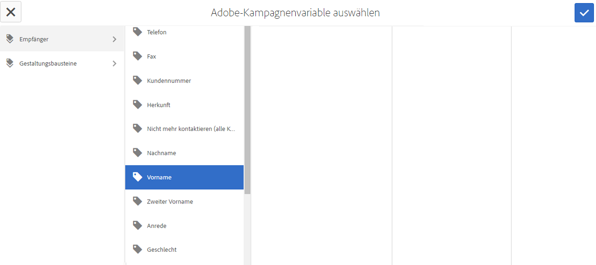

   Nach dem Einfügen der Kontextfelder und Personalisierungsblöcke können Sie eine Vorschau des Newsletters anzeigen und die Felder prüfen. Siehe [Vorschau eines Newsletters](#previewing-a-newsletter).

### Newslettervorschau {#previewing-a-newsletter}

Sie können sich eine Vorschau des Newsletters und der Personalisierung anzeigen lassen.

1. Klicken Sie bei geöffnetem Newsletter oben rechts in AEM auf **Vorschau.** In AEM wird nun angezeigt, wie der Newsletter für Empfänger aussieht.

   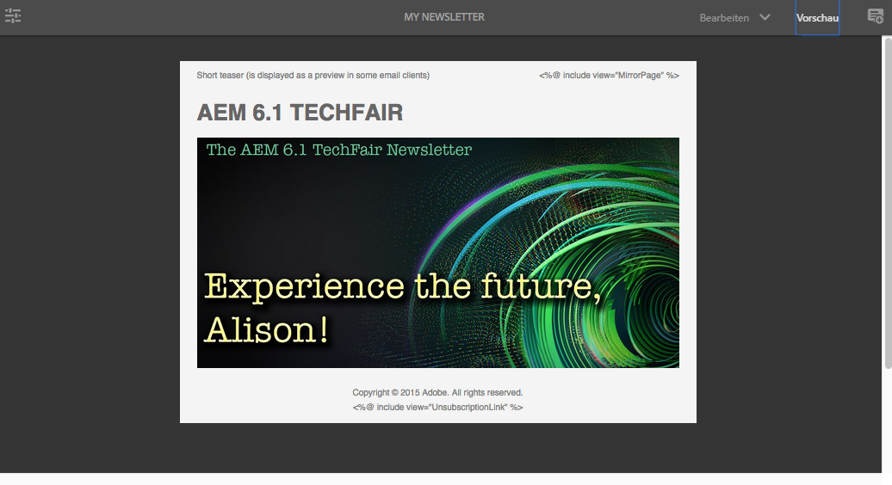

   >[!NOTE]
   >
   >Verwenden Sie Adobe Campaign Standard sowie die Beispielvorlage, führen zwei Personalisierungsblöcke mit anfänglichem Inhalt – **&quot;&lt;%@ include view=&quot;MirrorPage&quot; %>&quot;** und **&quot;&lt;%@ include view=&quot;UnsubscriptionLink&quot; %>&quot;** – zu Fehlermeldungen, wenn der Inhalt für die Bereitstellung importiert wird. Dies lässt sich anpassen, indem Sie bei der Auswahl der Personalisierungsblöcke die entsprechenden Blöcke auswählen.

1. Möchten Sie eine Vorschau der Personalisierung anzeigen, öffnen Sie durch Klicken oder Tippen auf das entsprechende Symbol in der Symbolleiste ContextHub. Die Tags der Personalisierungsfelder werden nun durch die Seed-Daten des ausgewählten Profils ersetzt. Wenn Sie ein anderes Profil auswählen, können Sie beobachten, wie die Variablen angepasst werden.

   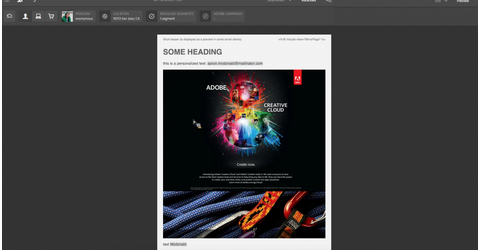

1. Die Seed-Daten von Adobe Campaign, die mit dem aktuell gewählten Profil verknüpft sind, können eingesehen werden. Klicken oder tippen Sie hierzu in der ContextHub-Leiste auf das Adobe Campaign-Modul. Es wird ein Dialogfeld eingeblendet, in dem alle Seed-Daten des aktuell gewählten Profils aufgeführt sind. Die Daten ändern sich entsprechend, wenn ein neues Profil gewählt wird.

   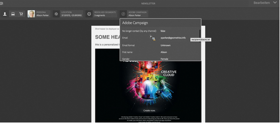

### Genehmigen von Inhalten in AEM {#approving-content-in-aem}

Nach der Bearbeitung der Inhalte kann mit deren Genehmigung begonnen werden. Gehen Sie zur Registerkarte **Workflow** der Toolbox und wählen Sie den Workflow **Für Adobe Campaign genehmigen** aus.

Dieser Standardarbeitsablauf besteht aus zwei Schritten: Prüfung und Genehmigung oder Prüfung und Ablehnung. Der Arbeitsablauf kann jedoch auch ausgeweitet oder an komplexere Prozesse angepasst werden.

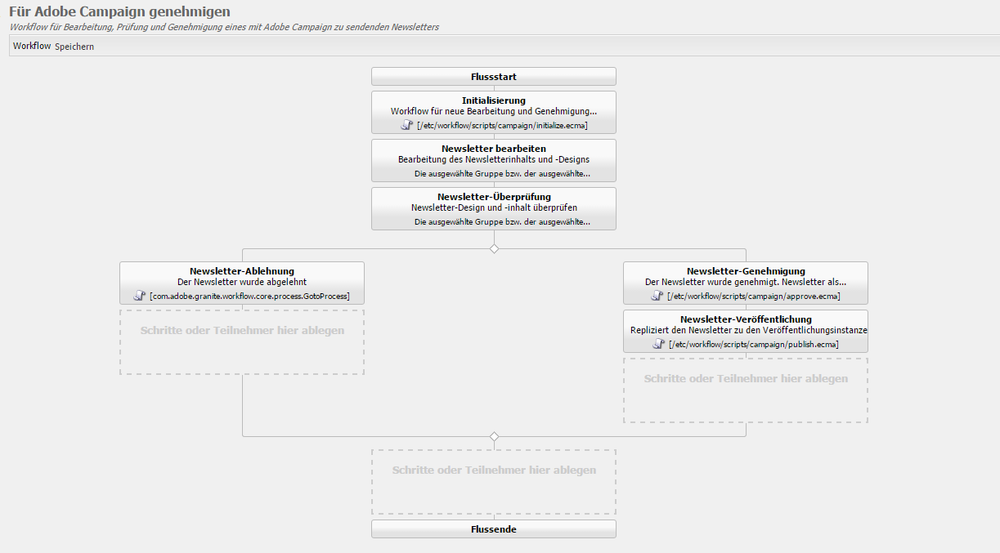

Um Inhalte für Adobe Campaign zu genehmigen, wenden Sie den Workflow an, indem Sie **Workflow** auswählen und **Für Adobe Campaign genehmigen** auswählen und auf **Workflow starten** klicken. Führen Sie die vorgegebenen Schritte aus und genehmigen Sie den Inhalt. Sie können Inhalte auch ablehnen, indem Sie im letzten Schritt des Arbeitsablaufs statt **Genehmigen** die Option **Ablehnen** wählen.

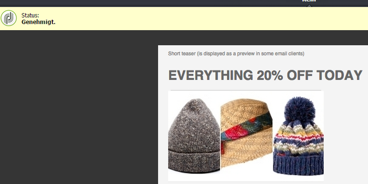

Nach der Genehmigung des Inhalts wird dieser in Adobe Campaign als genehmigt gekennzeichnet. Die E-Mail kann nun verschickt werden.

In Adobe Campaign Standard:

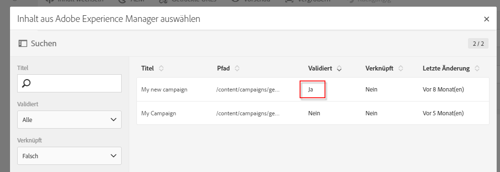

Adobe Campaign Classic:

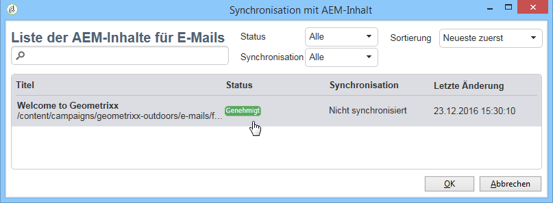

>[!NOTE]
Nicht genehmigte Inhalte können in Adobe Campaign mit einer Bereitstellung synchronisiert werden, diese Bereitstellung lässt sich jedoch nicht durchführen. Mit Campaign-Bereitstellungen lassen sich nur genehmigte Inhalte versenden.

## Verknüpfen von AEM mit Adobe Campaign Standard und Adobe Campaign Classic  {#linking-aem-with-adobe-campaign-standard-and-adobe-campaign-classic}

Wie Sie AEM mit Adobe Campaign verknüpfen oder synchronisieren hängt davon ab, ob Sie das Adobe Campaign Standard-Abonnement oder die On-Premise-Version von Adobe Campaign Classic verwenden.

Weitere Informationen basierend auf Ihrer Adobe Campaign-Version finden Sie in folgenden Abschnitten:

* [Verknüpfen von AEM-Seiten mit Adobe Campaign-E-Mails (Adobe Campaign Standard)](#linking-an-aem-page-to-an-adobe-campaign-email-adobe-campaign-standard)
* [Synchronisieren von in AEM erstelltem Inhalt mit einer Bereitstellung von Adobe Campaign Classic](#synchronizing-content-created-in-aem-with-a-delivery-from-adobe-campaign-classic)

### Verknüpfen von AEM-Seiten mit Adobe Campaign-E-Mails (Adobe Campaign Standard) {#linking-an-aem-page-to-an-adobe-campaign-email-adobe-campaign-standard}

In Adobe Campaign Standard können Sie in AEM erstellte Inhalte mithilfe der folgenden Optionen verknüpfen und wiederherstellen:

* E-Mail
* E-Mail-Vorlage

Diese Optionen ermöglichen die Bereitstellung von Inhalten. Aus dem auf der Seite angezeigten Code ist ersichtlich, ob ein Newsletter mit einer einzelnen Bereitstellung verknüpft ist.

>[!NOTE]
Wenn ein Newsletter mit mehreren Sendungen verknüpft ist, wird die Anzahl der verknüpften Sendungen (aber nicht jede Kennung) angezeigt.

So verknüpfen Sie in AEM erstellte Seiten mit Adobe Campaign-E-Mails:

1. Erstellen Sie eine neue E-Mail, die auf einer AEM-spezifischen E-Mail-Vorlage beruht. Weitere Informationen finden Sie unter [Erstellen von E-Mails in Adobe Campaign Standard](https://helpx.adobe.com/campaign/standard/channels/using/creating-an-email.html) .

   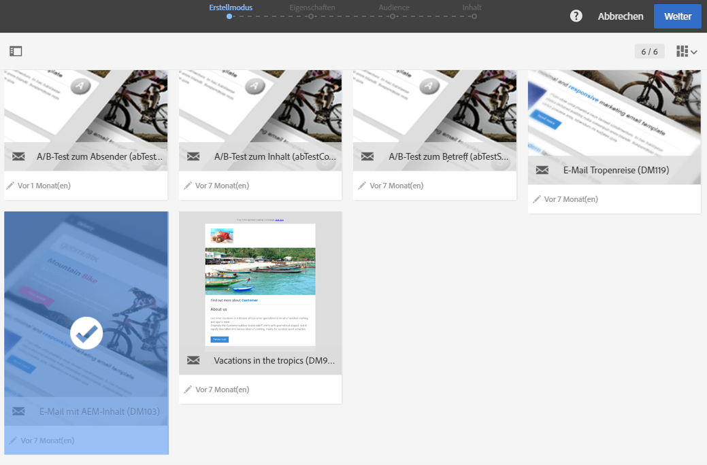

1. Öffnen Sie den **Inhaltsblock** über das Bereitstellungs-Dashboard.

   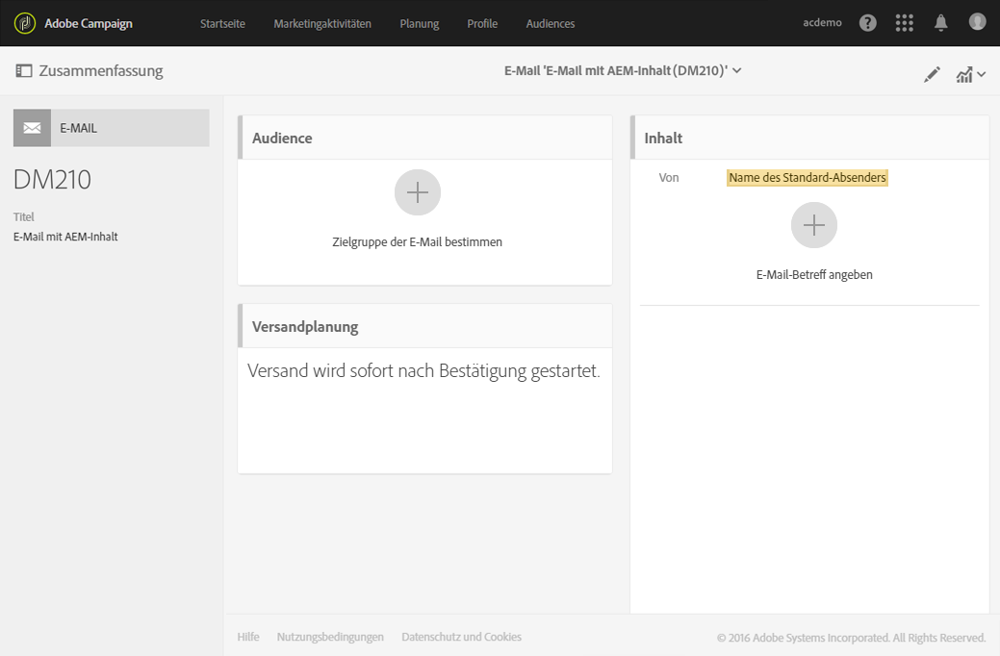

1. Wählen Sie **Link mit Adobe Experience Manager-Inhalt** in der Symbolleiste aus, um auf die in AEM verfügbare Inhaltsliste zuzugreifen.

   >[!NOTE]
   Wenn die Option **Link mit einer Adobe Experience Manager** nicht in der Aktionsleiste angezeigt wird, überprüfen Sie, ob der **Inhaltsbearbeitungsmodus** in den E-Mail-Eigenschaften korrekt auf **Adobe Experience Manager** konfiguriert ist.

   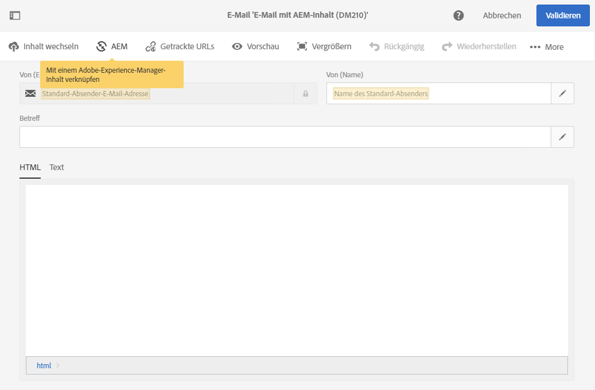

1. Wählen Sie den Inhalt aus, den Sie in Ihrer E-Mail verwenden möchten.

   In dieser Liste wird Folgendes angegeben:

   * Die Beschriftung des Inhalts in AEM.
   * Der Genehmigungsstatus des Inhalts in AEM. Wurde der Inhalt nicht genehmigt, können Sie den Inhalt synchronisieren, der vor der Bereitstellung jedoch zuerst genehmigt werden muss. Sie können jedoch bestimmte Optionen verwenden, beispielsweise Versenden eines Nachweises oder die Vorschau.
   * Das Datum der letzten Änderung des Inhalts.
   * Inhalte, die bereits mit einer Bereitstellung verknüpft wurden.

   >[!NOTE]
   Standardmäßig werden Inhalte, die bereits mit einer Bereitstellung synchronisiert wurden, ausgeblendet. Sie können diese jedoch einblenden und verwenden. Beispielsweise dann, wenn Sie den Inhalt als Vorlage für mehrere Bereitstellungen nutzen möchten.

   Wurde die E-Mail mit AEM-Inhalten verknüpft, können ihre Inhalte nicht in Adobe Campaign bearbeitet werden.

1. Geben Sie andere E-Mail-Parameter (Zielgruppen, Ausführungsplan) im Dashboard an.
1. Stellen Sie die E-Mail zu. Während der Bereitstellungsanalyse werden die aktuellsten AEM-Inhalte abgerufen.

   >[!NOTE]
   Werden Inhalte in AEM bearbeitet, während sie mit einer E-Mail verknüpft sind, werden die Inhalte während der Analyse automatisch in Adobe Campaign aktualisiert. Die Synchronisierung kann auch manuell mithilfe der Option **Adobe Experience Manager-Inhalt aktualisieren** in der Inhaltsaktionsleiste durchgeführt werden.
   Sie können die Verknüpfung einer E-Mail mit AEM-Inhalten löschen, indem Sie **Verknüpfung mit Adobe Experience Manager-Inhalt löschen** aus der Inhaltsaktionsleiste auswählen. Diese Schaltfläche steht nur zur Verfügung, wenn der Inhalt bereits mit der Bereitstellung verknüpft ist. Soll anderer Inhalt mit einer Bereitstellung verknüpft werden, müssen Sie zunächst den aktuellen Inhaltslink löschen, bevor Sie eine neue Verknüpfung erstellen.
   Ist die Verknüpfung gelöscht, werden lokale Inhalte beibehalten und diese können in Adobe Campaign bearbeitet werden. Wird der Inhalt nach vorgenommenen Änderungen wieder verknüpft, gehen sämtliche Änderungen verloren.

### Synchronisieren von in AEM erstelltem Inhalt mit einer Bereitstellung von Adobe Campaign Classic  {#synchronizing-content-created-in-aem-with-a-delivery-from-adobe-campaign-classic}

In Adobe Campaign können Sie in AEM erstellte Inhalte mithilfe der folgenden Optionen synchronisieren und wiederherstellen:

* eine Kampagnenbereitstellung
* eine Bereitstellungsaktivität in einem Kampagnenarbeitsablauf
* eine wiederholte Bereitstellung
* eine permanente Bereitstellung
* eine Bereitstellung über das Message Center
* eine Bereitstellungsvorlage

Ist ein Newsletter in AEM mit einer Bereitstellung verknüpft, wird der Bereitstellungscode auf der Seite angezeigt.

>[!NOTE]
Wenn der Newsletter mit mehreren Sendungen verknüpft ist, wird die Anzahl der verknüpften Sendungen (aber nicht jede Kennung) angezeigt.
[!NOTE]
Der Arbeitsablaufschritt **In Adobe Campaign veröffentlichen** ist veraltet und ab AEM 6.1 nicht länger Teil des Arbeitsablaufs. In den Versionen AEM 6.0 und älter diente dieser Schritt der Integration mit Adobe Campaign, er wird in neueren Versionen nicht mehr benötigt.

So synchronisieren Sie in AEM erstellte Inhalte mit Bereitstellungen in Adobe Campaign:

1. Erstellen Sie einen Versand oder fügen Sie einem Kampagnen-Workflow eine Versandaktivität hinzu, indem Sie die Versandvorlage **E-Mail-Versand mit AEM Inhalt (mailAEMContent)** auswählen.

   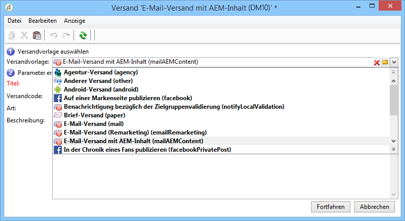

1. Wählen Sie **Synchronisieren** in der Symbolleiste aus, um auf die in AEM verfügbare Inhaltsliste zuzugreifen.

   >[!NOTE]
   Wenn die Option **Synchronisieren** nicht in der Symbolleiste des Versands angezeigt wird, überprüfen Sie, ob das Feld **Inhaltsbearbeitungsmodus** in **AEM** korrekt konfiguriert ist, indem Sie **Eigenschaften** > **Erweitert** auswählen.

   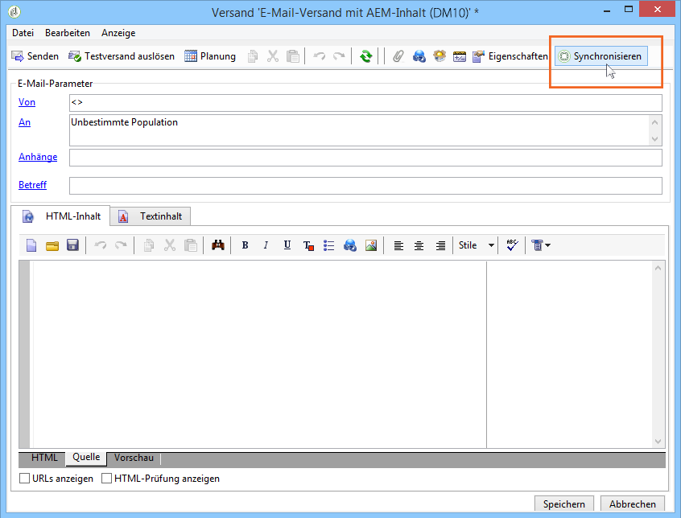

1. Wählen Sie den Inhalt aus, den Sie mit der Bereitstellung synchronisieren möchten.

   In dieser Liste wird Folgendes angegeben:

   * Die Beschriftung des Inhalts in AEM.
   * Der Genehmigungsstatus des Inhalts in AEM. Wurde der Inhalt nicht genehmigt, können Sie den Inhalt synchronisieren, der vor der Bereitstellung jedoch zuerst genehmigt werden muss. Sie können jedoch bestimmte Optionen verwenden, beispielsweise Versenden eines BAT oder die Vorschau.
   * Das Datum der letzten Änderung des Inhalts.
   * Inhalte, die bereits mit einer Bereitstellung verknüpft wurden.

   >[!NOTE]
   Standardmäßig werden Inhalte, die bereits mit einer Bereitstellung synchronisiert wurden, ausgeblendet. Sie können diese jedoch einblenden und verwenden. Beispielsweise dann, wenn Sie den Inhalt als Vorlage für mehrere Bereitstellungen nutzen möchten.

   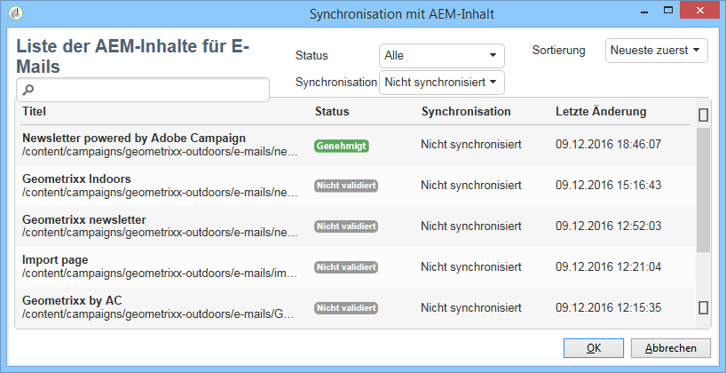

1. Geben Sie die übrigen Parameter Ihrer Bereitstellung (Ziel usw.) an.
1. Starten Sie, falls erforderlich, den Genehmigungsprozess für Bereitstellungen in Adobe Campaign. Zusätzlich zu in Adobe Campaign konfigurierten Genehmigungen (Budget, Ziel usw.) müssen Inhalte zunächst in AEM genehmigt werden. Eine Inhaltsgenehmigung in Adobe Campaign ist nur möglich, wenn die Inhalte bereits in AEM genehmigt wurden.
1. Stellen Sie die Inhalte bereit. Während der Bereitstellungsanalyse werden die aktuellsten AEM-Inhalte wiederhergestellt.

   >[!NOTE]
   * Nach der Synchronisierung von Bereitstellung und Inhalten können die Inhalte in Adobe Campaign nur noch gelesen werden. Betreff und Inhalt der E-Mail lassen sich nicht länger bearbeiten.
   * Wenn der Inhalt in AEM bearbeitet wird, während eine Verknüpfung mit einer Bereitstellung in Adobe Campaign besteht, wird dieser während der Analyse mit der Bereitstellung aktualisiert. Die Synchronisation kann auch manuell über die Schaltfläche **Inhalt jetzt aktualisieren** ausgeführt werden.
   * Sie können die Synchronisation zwischen einem Versand und AEM Inhalt mithilfe der Schaltfläche **Synchronisation aufheben** abbrechen. Diese Schaltfläche steht nur zur Verfügung, wenn der Inhalt bereits mit der Bereitstellung synchronisiert wurde. Soll anderer Inhalt mit einer Bereitstellung synchronisiert werden, müssen Sie zunächst die aktuelle Synchronisierung abbrechen, bevor eine neue eingerichtet wird.
   * Wurde die Synchronisierung der Bereitstellung aufgehoben, werden die Inhalte lokal gespeichert und lassen sich in Adobe Campaign bearbeiten. Wird der Inhalt nach einer Bearbeitung wieder synchronisiert, gehen sämtliche Änderungen verloren.
   * Bei wiederholten oder permanenten Bereitstellungen wird die Synchronisierung mit AEM-Inhalten jeweils bei der Durchführung der Bereitstellung unterbrochen.

