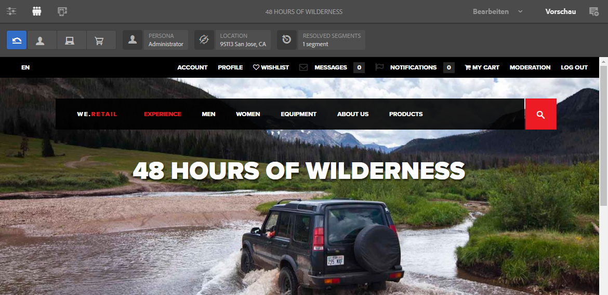
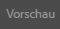

# Vorschau von Seiten mit ContextHub-Daten {#previewing-pages-using-contexthub-data}

In der [ContextHub](/help/sites-developing/contexthub.md)-Symbolleiste werden Daten aus ContextHub Stores angezeigt. Außerdem können mithilfe der Leiste Store-Daten bearbeitet werden. Die ContextHub-Symbolleiste eignet sich besonders für die Vorschau von Inhalten, die durch Daten im ContextHub Store gesteuert werden.

Diese Symbolleiste besteht aus einer Reihe Benutzeroberflächenmodi, die eines oder mehrere Oberflächenmodule enthalten.

* Benutzeroberflächenmodi werden durch die Symbole links in der Symbolleiste dargestellt. Klicken oder tippen Sie auf ein solches Symbol, zeigt die Symbolleiste die im Modus enthaltenen Benutzeroberflächenmodule an.
* In den Oberflächenmodulen werden Daten aus einem oder mehreren ContextHub Stores dargestellt. Einige Oberflächenmodule ermöglichen die Bearbeitung von Store-Daten.

Es werden verschiedene Benutzeroberflächenmodi und -module von ContextHub installiert. Möglicherweise hat Ihr Administrator [ContextHub so konfiguriert](/help/sites-developing/ch-configuring.md), dass andere Module als die hier gezeigten dargestellt werden.

## Einblenden der ContextHub-Symbolleiste {#revealing-the-contexthub-toolbar}

Die ContextHub-Symbolleiste ist im Vorschaumodus verfügbar. Die Symbolleiste wird nur für Autoreninstanzen angezeigt, wenn diese Funktion zuvor vom Administrator aktiviert wurde.

1. Klicken oder tippen Sie bei zur Bearbeitung geöffneter Seite auf die Vorschauoption.

   

1. Klicken oder tippen Sie auf das ContextHub-Symbol, um die Symbolleiste einzublenden.

   

## Benutzeroberflächenmodul-Funktionen {#ui-module-features}

Jedes Benutzeroberflächenmodul verfügt über eigene Funktionen, es stehen jedoch auch folgende gemeinsam genutzte Funktionen zur Verfügung. Da sich die Benutzeroberflächenmodule erweitern lassen, können Entwickler je nach Wunsch weitere Funktionen einbauen.

### Inhalt der Symbolleiste   {#toolbar-content}

Mit den Benutzeroberflächenmodulen können in der Symbolleiste Daten aus einem oder mehr ContextHub-Stores eingeblendet werden. Benutzeroberflächenmodule lassen sich anhand ihres Symbols oder Titels identifizieren.

### Popup-Inhalt {#popup-content}

In einigen Benutzeroberflächenmodulen wird ein Popup-Overlay angezeigt, wenn darauf geklickt oder getippt wird. In der Regel enthält das Popup zusätzlich zu den in der Symbolleiste verfügbaren Informationen weitere Daten.

### Popup-Formulare {#popup-forms}

In einigen Popup-Overlays der Benutzeroberflächenmodule befinden sich Formularelemente, mit deren Hilfe Sie Daten im ContextHub Store bearbeiten können. Steuern diese Store-Daten Seiteninhalte, können Sie mit dem Formular Änderungen vornehmen, die sich dann in den Seiteninhalten widerspiegeln.

### Vollbildmodus   {#fullscreen-mode}

Die Popup-Überlagerung kann ein Symbol enthalten, auf das Sie klicken oder tippen können, um den Popup-Inhalt so zu erweitern, dass er das gesamte Browser-Fenster oder den Bildschirm einnimmt.

