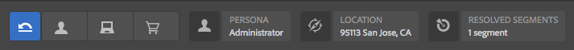

# Vorschau von Seiten mit ContextHub-Daten{#previewing-pages-using-contexthub-data}

Die [ContextHub](/help/sites-developing/contexthub.md) in der Symbolleiste werden Daten aus ContextHub-Stores angezeigt und Sie können Store-Daten ändern. Die ContextHub-Symbolleiste ist für die Vorschau von Inhalten nützlich, die durch Daten in einem ContextHub-Store bestimmt werden.

Die Symbolleiste besteht aus einer Reihe von Benutzeroberflächenmodi, die ein oder mehrere Benutzeroberflächenmodule enthalten.

* Benutzeroberflächenmodi sind Symbole, die links in der Symbolleiste angezeigt werden. Wenn Sie auf ein Symbol klicken oder tippen, zeigt die Symbolleiste die darin enthaltenen UI-Module an.
* Benutzeroberflächenmodule zeigen Daten aus einem oder mehreren ContextHub-Stores an. Einige Benutzeroberflächenmodule ermöglichen es Ihnen auch, gespeicherte Daten zu bearbeiten.

Es werden verschiedene Benutzeroberflächenmodi und -module von ContextHub installiert. Möglicherweise hat Ihr Admin [ContextHub so konfiguriert](/help/sites-developing/ch-configuring.md), dass andere Module als die hier gezeigten dargestellt werden.

## Einblenden der ContextHub-Symbolleiste {#revealing-the-contexthub-toolbar}

Die ContextHub-Symbolleiste ist im Vorschaumodus verfügbar. Die Symbolleiste wird nur für Autoreninstanzen angezeigt, wenn diese Funktion zuvor vom Admin aktiviert wurde.

1. Klicken oder tippen Sie bei zur Bearbeitung geöffneter Seite auf die Vorschauoption.

   

1. Klicken oder tippen Sie auf das ContextHub-Symbol, um die Symbolleiste einzublenden.

   

## Benutzeroberflächenmodul-Funktionen {#ui-module-features}

Jedes UI-Modul bietet unterschiedliche Funktionen, die folgenden Arten von Funktionen sind jedoch üblich. Da UI-Module erweiterbar sind, kann Ihr Entwickler nach Bedarf andere Funktionen implementieren.

### Inhalt der Symbolleiste {#toolbar-content}

Mit den Benutzeroberflächenmodulen können in der Symbolleiste Daten aus einem oder mehr ContextHub-Stores eingeblendet werden. Benutzeroberflächenmodule lassen sich anhand ihres Symbols oder Titels identifizieren.

### Popup-Inhalt {#popup-content}

Einige UI-Module zeigen ein Popup-Overlay an, wenn darauf geklickt oder getippt wird. In der Regel enthält das Popup zusätzlich zu den in der Symbolleiste verfügbaren Informationen weitere Daten.

### Popup-Formulare {#popup-forms}

In einigen Popup-Overlays der Benutzeroberflächenmodule befinden sich Formularelemente, mit deren Hilfe Sie Daten im ContextHub Store bearbeiten können. Wenn der Seiteninhalt durch die Speicherdaten bestimmt wird, können Sie das Formular verwenden und Änderungen am Seiteninhalt beobachten.

### Vollbildmodus {#fullscreen-mode}

Die Popup-Überlagerung kann ein Symbol enthalten, auf das Sie klicken oder tippen können, um den Popup-Inhalt so zu erweitern, dass er das gesamte Browser-Fenster oder den Bildschirm einnimmt.

