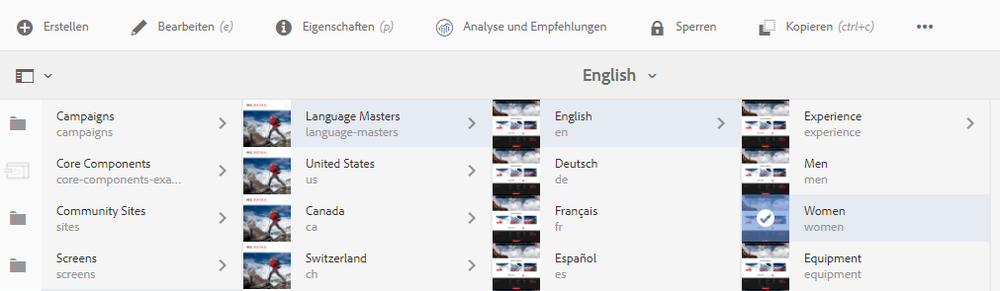
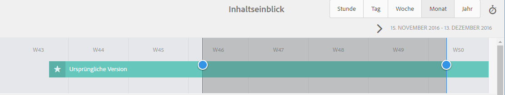
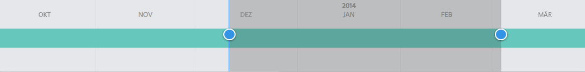
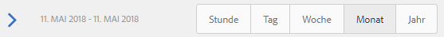

# Analysieren der Seitenleistung{#analyzing-page-performance}

Öffnen Sie die Seite [Inhaltseinblick](/help/sites-authoring/content-insights.md), um die Leistung der Seite zu analysieren, die Sie bearbeiten. Konfigurieren Sie den Berichtszeitraum, um Ihre Analyse zu fokussieren.

## Öffnen von Analytics und Empfehlungen für eine Seite  {#opening-analytics-and-recommendations-for-a-page}

Führen Sie die folgenden Schritte aus, um Analysen und Empfehlungen für eine Seite anzuzeigen:

1. Navigieren Sie zu der Seite, die Sie analysieren möchten.
1. Klicken oder tippen Sie in der Symbolleiste auf **Analysen und Empfehlungen**.

   >[!NOTE]
   >
   >Analysen und Empfehlungen für eine Seite werden nur dann angezeigt, wenn AEM zur [Integration mit Adobe Analytics](/help/sites-administering/adobeanalytics-connect.md) konfiguriert wurde.

   

### Ändern des Berichtszeitraums {#changing-the-reporting-period}

Ändern Sie die folgenden zeitbezogenen Aspekte der Analyseberichte:

* Der Zeitraum, für den der Bericht erstellt werden soll.
* Die Granularität der Daten.

Die Tools zum Ändern der zeitbezogenen Aspekte der Berichte werden oben auf der Inhaltseinblick-Seite angezeigt. 

#### Ändern des Berichtszeitraums {#changing-the-reporting-period-1}

Ändern Sie den Berichtszeitraum der Inhaltseinblick-Seite, um Ihre Analyse der Seitenaktivität auf einen bestimmten Zeitraum zu fokussieren. Wenn Sie den Berichtszeitraum ändern, wird der Bericht automatisch aktualisiert. Der schattierte Bereich im Zeitraum stellt den Berichtszeitraum dar. Die Daten im Zeitraum erhöhen sich von links nach rechts.

So ändern Sie den Berichtszeitraum einer Inhaltseinblick-Seite:

1. Wenn der Zeitraum nicht am oberen Rand der Seite angezeigt wird, klicken oder tippen Sie auf das Symbol „Zeitraum umschalten“.

   

1. Um das Startdatum des Berichtszeitraums zu ändern, ziehen Sie den Kreis an der linken Seite des schattierten Bereichs zum gewünschten Startdatum.

   Wenn Sie die linke Seite des schattierten Bereichs nicht sehen können, verwenden Sie die Bildlaufleiste, um sie anzuzeigen.

1. Um das Enddatum des Berichtszeitraums zu ändern, ziehen Sie den Kreis an der rechten Seite des schattierten Bereichs zum gewünschten Enddatum.

#### Ändern der Granularität des Berichtszeitraums  {#changing-the-granularity-of-the-reporting-period}

Ändern Sie die Zeitdauer für jeden Datenpunkt in einem Bericht. Beispiel: Wenn die Wochengranularität ausgewählt ist, stellt jeder Datenpunkt im Bericht „Ansichten“ die Anzahl der Ansichten für eine Woche dar.

Die Granularität wirkt sich auf die Berichte aus, die Daten in Bezug auf die Zeit darstellen, z. B. die Berichte „Ansichten“ und „Durchschnittliche Aufenthaltsdauer auf der Seite in Minuten“. Granularität wirkt sich auch auf die Skalierung des Zeitraums aus.

1. Wenn das Granularitätssteuerelement nicht angezeigt wird, klicken oder tippen Sie auf das Symbol „Granularität umschalten“.

   

1. Klicken oder tippen Sie auf die gewünschte Granularität. Nach Auswahl wird der Bericht automatisch aktualisiert, um die Granularität widerzuspiegeln.

### Zuweisen von Aufgaben für SEO-Empfehlungen  {#assigning-tasks-for-seo-recommendations}

Verwenden Sie den Bericht „SEO-Empfehlungen“, um Aufgaben zur Verbesserung der Seitensichtbarkeit für Suchmaschinen zu erstellen. Für jede Empfehlung im Bericht ohne Häkchen können Sie eine Aufgabe erstellen, die Sie einem Benutzer zuweisen, um die erforderliche Arbeit auszuführen.

Der Status der SEO-Empfehlung gibt an, wenn die Aufgabe erstellt, aber noch nicht abgeschlossen ist.

Wenn sie erstellt wurde, wird die Aufgabe in der Aufgabenliste des Benutzers angezeigt. Weitere Informationen zu Aufgaben finden Sie unter [Arbeiten mit Aufgaben](/help/sites-authoring/task-content.md).

Führen Sie die folgenden Schritte aus, um eine Aufgabe für eine SEO-Empfehlung zu erstellen.

1. Klicken oder tippen Sie auf das Informationssymbol für die SEO-Empfehlung.

   

1. Klicken Sie auf das umkreiste Dreieck neben dem Informationssymbol.

   

1. Füllen Sie die angezeigten Formularfelder aus und tippen Sie dann auf „Erstellen“.

   * Projekt: Wählen Sie das Projekt aus, in dem die Aufgabe erstellt werden soll.
   * Name: Der Name, der die Aufgabe identifiziert. Der Standardname ist der Titel der SEO-Empfehlung.
   * Zuweisen zu: Wählen Sie den Benutzer aus, dem die Aufgabe zugewiesen werden soll. Beginnen Sie mit der Eingabe des Namens des Benutzers, um die Liste zu filtern.
   * Beschreibung: Eine Beschreibung der Aktivität, die erforderlich ist, um die Aufgabe abzuschließen. Bei der Standardbeschreibung handelt es sich um die Informationen, die die SEO-Empfehlung begleiten.
   * Aufgabenpriorität: Die Priorität der Aufgabe.
   * Fälligkeitsdatum: Das Datum, nach dem die Aufgabe erledigt sein soll.

   **Hinweis:** Die Aufgabe, die erstellt wird, enthält den Pfad zu der Seite, für die die SEO-Empfehlung gilt.

1. Klicken oder tippen Sie auf „Fertig“, um die Meldung „Aufgabe erstellt“ zu schließen.
