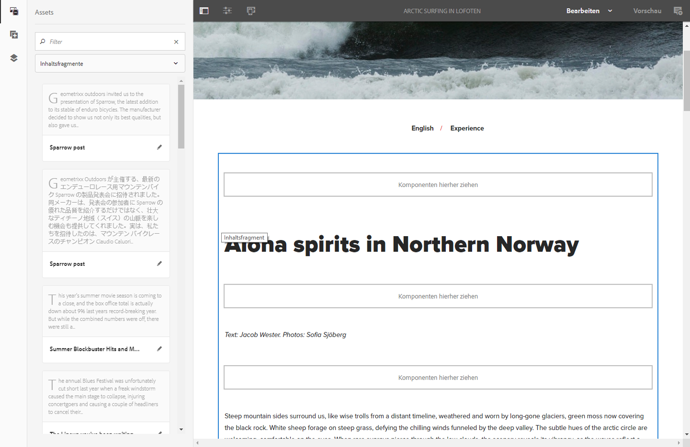
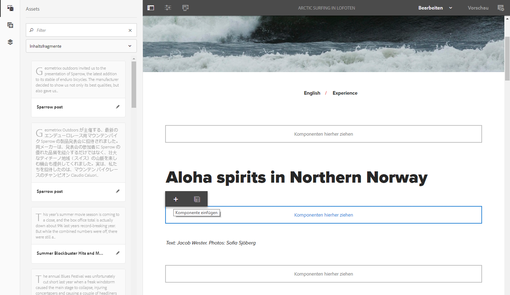
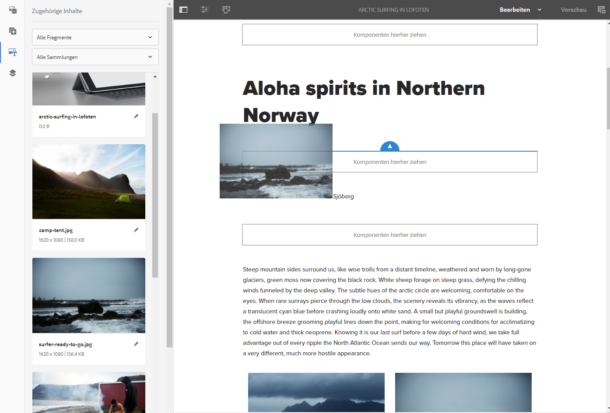

# Seitenbearbeitung mit Inhaltsfragmenten{#page-authoring-with-content-fragments}

Inhaltsfragmente für Adobe Experience Manager (AEM) werden [als seitenunabhängige Assets erstellt und verwaltet](/help/assets/content-fragments/content-fragments.md).

Damit können Sie kanalneutrale Inhalte zusammen mit (möglicherweise kanalspezifischen) Varianten erstellen. Sie können diese Fragmente und ihre Varianten bei der Erstellung Ihrer Inhaltsseiten verwenden.

In Verbindung mit dem aktualisierten JSON Exporter können strukturierte Inhaltsfragmente auch verwendet werden, um AEM-Inhalte über Content Services anderen Kanälen als AEM-Seiten bereitzustellen.

>[!NOTE]
>
>**Inhaltsfragmente** und **[Experience Fragments](/help/sites-authoring/experience-fragments.md)** sind unterschiedliche Funktionen in AEM:
>
>* **Inhaltsfragmente** sind redaktionelle Inhalte, in erster Linie Text und zugehörige Bilder. Sie sind reine Inhalte ohne Design und Layout.
>* **Experience Fragments** sind vollständig gestaltete Inhalte und stellen Teile von Web-Seiten dar.
>
>Experience Fragments können Inhalte in Form von Inhaltsfragmenten enthalten, aber nicht umgekehrt.

>[!CAUTION]
>
>Lesen Sie diese Seite gemeinsam mit [Arbeiten mit Inhaltsfragmenten](/help/assets/content-fragments/content-fragments.md) (und den zugehörigen Seiten), da dort grundlegende Termini und Konzepte sowie die Erstellung und Verwaltung von Fragmenten erklärt werden.

Die Inhaltsfragmente ermöglichen Folgendes:

* **Marketing- und Kampagnenstrategie**

   * Überprüfen von Inhalten über zentral verwaltete Inhaltsfragmente.

* **Creative Pro**

   * Tracking von Kreativ-Assets über Sammlungen, die mit Inhaltsfragmenten verknüpft sind.

* **Copywriter**

   * Schreiben im Inhaltsfragment-Editor von AEM.
   * Können Inhaltsvarianten erstellen.
   * Können relevante Inhalte mit dem Inhaltsfragment verknüpfen.
   * Können Versionierung/Workflow verwenden.
   * Können Inhaltsfragmente freigeben.
   * Können Übersetzungen zentral verwalten.

* **Produzenten und Journey-Manager**

   * Auswahl aus vordefinierten Fragmenten und Varianten mit Authoring in AEM.
   * Können sich darauf verlassen, dass Fragmente und verknüpfte Inhalte immer aktuell sind, da Copywriter und Kreative ihre Aktualisierungen in zentral verwalteten Fragmenten und Assets vornehmen.
   * Können sich darauf verlassen, dass verknüpfte Medieninhalte im Hinblick auf ihre Relevanz kuratiert werden.
   * Können spontan Ad-hoc-Inhaltsvarianten erstellen und gleichzeitig sicherstellen, dass diese Varianten zentral im Fragment verwaltet werden.

## Hinzufügen eines Inhaltsfragments zu Ihrer Seite {#adding-a-content-fragment-to-your-page}

1. Öffnen Sie Ihre Seite zum Bearbeiten.

1. Fügen Sie die **Inhaltsfragmentkomponente** hinzu; entweder aus dem **Komponenten-Browser** oder mit **Neue Komponente einfügen**.

1. Wählen Sie eine der folgenden Möglichkeiten:

   * Öffnen Sie den **Assets**-Browser und filtern Sie nach der Option **Inhaltsfragmente** (die Standardeinstellung ist „Bilder“). Ziehen Sie dann das gewünschte Fragment auf die entsprechende Komponente.

   * Wählen Sie die Inhaltsfragmentkomponente und dann **Konfigurieren** aus der Symbolleiste. Im daraufhin angezeigten Dialogfeld können Sie das Auswahldialogfeld zum Durchsuchen und Auswählen des gewünschten **Inhaltsfragments** öffnen.

   >[!NOTE]
   >
   >Eine alternative Methode besteht darin, ein bestimmtes Inhaltsfragment direkt auf die Seite zu ziehen. Dabei wird automatisch die zugehörige Komponente (Inhaltsfragment) erstellt.

1. Anfangs wird der Inhalt aus den Elementen **Allgemein** und **Primär** (Variante) angezeigt. Sie können nach Bedarf aber [auch andere Elemente und/oder Varianten auswählen](#selecting-the-element-or-variation).

   

   >[!NOTE]
   >
   >Weitere Informationen zur Bearbeitungsfunktion finden Sie unter:
   >
   >
   >
   >    * [Responsives Layout](/help/sites-authoring/responsive-layout.md)
   >    * [Bearbeiten des Seiteninhalts](/help/sites-authoring/editing-content.md)
   >
   >

### Auswählen des Elements oder der Variante {#selecting-the-element-or-variation}

Öffnen Sie das Dialogfeld **Konfiguration** des Fragments, um das Fragment für die Verwendung auf der aktuellen Seite zu konfigurieren. Das Dialogfeld kann von der verwendeten Komponente abhängen.

Im entsprechenden Konfigurationsdialogfeld können Sie die verfügbaren Parameter auswählen, darunter:

* **Inhaltsfragment**

  Geben Sie das zu verwendende Fragment an.

* **Anzeigemodus**:

   * **Einzelnes Textelement**

   * **Mehrfachelement**

* **Element**

   * Die Standardoption **Primär** ist immer verfügbar.
   * Eine Auswahl ist verfügbar, wenn das Fragment mit einer entsprechenden Vorlage erstellt wurde.

  >[!NOTE]
  >
  >Die verfügbaren Elemente hängen von der verwendeten Vorlage ab.

* **Variante**

   * Die Standardversion **Primär** ist immer verfügbar.
   * Eine Auswahl ist verfügbar, wenn Varianten für das Fragment erstellt wurden.

* **Absätze**: Geben Sie den Bereich der Absätze an, die einbezogen werden sollen:

   * **Alle**
   * **Bereich**: Zum Beispiel `1`, `3-5`, `9-*`

      * **Überschriften als separate Absätze behandeln**

* **Überschriften als separate Absätze behandeln**

### Schnelle Verbindung zum Fragmenteditor     {#quick-connection-to-fragment-editor}

Sie können die Fragmentquelle zur Bearbeitung (das Asset) mithilfe des Symbols **Bearbeiten** in der Komponenten-Symbolleiste öffnen. Dadurch können Sie [Inhaltsfragment bearbeiten und verwalten](/help/assets/content-fragments/content-fragments.md).

>[!CAUTION]
>
>Wie immer hat die Bearbeitung der Fragmentquelle Auswirkungen auf alle Seiten, auf die diese Inhaltsfragmente verweisen.

### Hinzufügen von Zwischeninhalten {#adding-in-between-content}

Wenn ein bestimmtes Inhaltsfragment zur Seite hinzugefügt wird, gibt es einen Platzhalter **Komponenten hierher ziehen** zwischen jedem HTML-Absatz (und am oberen/unteren Rand) des Fragments.

Damit können Sie zusätzlichen Inhalt hinzufügen [Zwischeninhalt (d. h. Zwischeninhalt)](/help/assets/content-fragments/content-fragments.md#in-between-content-when-page-authoring-with-content-fragments) den Fragmentinhalt (an einem der verfügbaren Punkte), ohne das Stammfragment ändern zu müssen.

Für Zwischeninhalte haben Sie folgende Möglichkeiten:

* Hinzufügen von Komponenten aus dem [Komponenten-Browser](/help/sites-authoring/author-environment-tools.md#components-browser).
* Hinzufügen von Assets aus dem [Asset-Browser](/help/sites-authoring/author-environment-tools.md#assets-browser).
* [Zugehörige Inhalte](#using-associated-content) als Quelle für Zwischeninhalte verwenden.

>[!CAUTION]
>
>Bei Zwischeninhalten handelt es sich um Seiteninhalte. Sie werden nicht im Inhaltsfragment gespeichert.

>[!NOTE]
>
>Sie können auch [visuelle Assets (Bilder) in das Fragment selbst einfügen](/help/assets/content-fragments/content-fragments-variations.md#inserting-assets-into-your-fragment).
>
>Die in das Inhaltsfragment eingefügten visuellen Assets werden mit dem vorangehenden Absatz verbunden. Deshalb können Zwischeninhalte nicht zwischen einem visuellen Asset und dem vorangehenden Absatz platziert werden.

>[!CAUTION]
>
>Wenn Sie Zwischeninhalte zu einem Inhaltsfragment auf Ihrer Seite hinzugefügt haben, kann das Ändern der Struktur des zugrunde liegenden Inhaltsfragments (im Fragment-Editor) zu fehlerhaften/unerwarteten Ergebnissen führen.
>
>Wenn dies eintritt, wird der Zwischeninhalt unverändert beibehalten:
>
>* Zwischenkomponenten haben eine absolute Position innerhalb der Komponentensequenz im Fragmentfluss. Diese Position ändert sich nicht, auch wenn sich der Inhalt der Absätze im Fragment ändert.
>
>  Dies kann den Eindruck erwecken, als hätte sich die relative Position geändert, da Zwischenabsätze keinen kontextuellen Bezug zu den Absätzen (des Fragments) haben, neben denen sie sich befinden.
>* Wenn zwischen zwei Absatzstrukturen ein Konflikt besteht, wird der Zwischeninhalt nicht angezeigt (obwohl er intern noch vorhanden ist).
>

### Verwenden von zugehörigen Inhalten {#using-associated-content}

Wenn Sie [verknüpften Inhalt](/help/assets/content-fragments/content-fragments-assoc-content.md) für das [Inhaltsfragment](/help/assets/content-fragments/content-fragments.md) haben, stehen diese Elemente im Seitenbedienfeld zur Verfügung (nachdem Sie das Fragment auf der Inhaltsseite platziert haben). Verknüpfte Inhalte sind im Grunde eine besondere Inhaltsquelle für [dazwischen liegende Inhalte](#adding-in-between-content).

>[!NOTE]
>
>Es gibt verschiedene Methoden zum Hinzufügen von [visuellen Assets (z. B. Bildern)](/help/assets/content-fragments/content-fragments.md#fragments-with-visual-assets) zu einem Fragment und/oder zu einer Seite.

>[!NOTE]
>
>Wenn Sie mehrere Inhaltsfragmente auf einer Seite haben, werden auf der Registerkarte **Zugehörige Inhalte** die zu allen Fragmenten gehörenden Assets angezeigt.

Nachdem Sie ein Fragment mit verknüpftem Inhalt zu Ihrer Seite hinzugefügt haben, wird eine neue Registerkarte (**Verknüpfte Inhalte**) im Seitenbereich geöffnet.

Von hier aus können Sie die Assets an die gewünschte Position ziehen (entweder zu einer vorhandenen Komponente oder an die gewünschte Position, an der die entsprechende Komponente erstellt wird):

### In das Fragment eingefügte Assets {#assets-inserted-into-the-fragment}

Wenn Assets (z. B. Bilder) in das Fragment eingefügt wurden, sind die Optionen zum Bearbeiten dieser Assets im Seiteneditor eingeschränkt. <!-- Removed link as it was a 404 on helpx -->

Beispielsweise haben Sie zur Bearbeitung eines Bildes folgende Möglichkeiten:

* Zuschneiden, Drehen oder Spiegeln des Bildes.
* Fügen Sie einen Titel oder alternativen Text hinzu.
* Geben Sie eine Größe an.
* Sie können auch das Layout konfigurieren.

Andere Änderungen wie Verschieben, Kopieren und Löschen müssen im Fragmenteditor vorgenommen werden.

### Veröffentlichung {#publishing}

Fragmente müssen zuerst veröffentlicht werden, damit sie auf Ihren veröffentlichten Web-Seiten verwendet werden können:

* Ein Fragment kann veröffentlicht werden, nachdem es [in der Asset-Konsole erstellt wurde](/help/assets/content-fragments/content-fragments.md#publishingandreferencingafragment).
* Wenn ein *unveröffentlichtes Fragment* auf einer Seite verwendet wird, die veröffentlicht wird, kann das Fragment ebenfalls zu diesem Zeitpunkt veröffentlicht werden.
