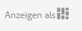

# Verfassen zielgerichteter Inhalte im Targeting-Modus {#authoring-targeted-content-using-targeting-mode}

Verfassen von zielgerichteten Inhalten im Targeting-Modus von AEM. Im Targeting-Modus und in der Targeting-Komponente stehen verschiedene Werkzeuge zur Verfügung, mit deren Hilfe sich Inhalte für Erlebnisse erstellen lassen:

* Erkennen Sie problemlos zielgerichtete Inhalte auf einer Seite. Zielgerichtete Inhalte werden mit einer gepunkteten Linie umrandet.
* Wählen Sie eine Marke und Aktivität aus, um deren Erlebnisse anzuzeigen.
* Fügen Sie einer Aktivität Erlebnisse hinzu oder entfernen Sie diese.
* Führen Sie A/B-Tests durch und konvertieren Sie die Kampagnen mit den besten Ergebnissen (nur Adobe Target).
* Fügen Sie Erlebnissen Angebote hinzu, indem Sie Angebote erstellen oder Angebote aus einer Bibliothek verwenden.
* Konfigurieren Sie Ziele und überwachen Sie die Leistung.
* Simulieren Sie Benutzererlebnisse.
* Für weitere Anpassungsmöglichkeiten muss zunächst die Target-Komponente konfiguriert werden.

Als Targeting-Engine können Sie entweder AEM oder Adobe Target einsetzen (möchten Sie Adobe Target nutzen, benötigen Sie ein aktives Adobe Target-Konto). Wenn Sie Adobe Target verwenden, müssen Sie zunächst die Integration konfigurieren. Siehe [Anweisungen zur Integration mit Adobe Target](/help/sites-administering/target.md).

Die im Target-Modus sichtbaren Aktivitäten und Erlebnisse spiegeln die Optionen der [Aktivitätskonsole](/help/sites-authoring/activitylib.md) wider:

* Änderungen, die Sie im Targeting-Modus an den Aktivitäten und Erlebnissen vornehmen, werden in die Aktivitätskonsole übernommen.
* Änderungen, die in der Aktivitätskonsole vorgenommen werden, werden in den Targeting-Modus übernommen.

>[!NOTE]
>
>Wenn Sie eine Kampagne in Adobe Target erstellen, wird jeder Kampagne eine Eigenschaft mit dem Namen `thirdPartyId` hinzugefügt. Sollten Sie die Kampagne in Adobe Target löschen, wird die Eigenschaft „thirdPartyId“ jedoch nicht gelöscht. Die `thirdPartyId` kann nicht für Kampagnen unterschiedlicher Typen (A/B, XT) wiederverwendet werden und lässt sich nicht manuell löschen. Möchten Sie dieses Problem umgehen, geben Sie jeder Kampagne einen eindeutigen Namen. Kampagnennamen lassen sich somit nicht für verschiedene Kampagnentypen wiederverwenden.
>
>Wenn Sie denselben Namen im selben Kampagnentyp verwenden, wird die vorhandene Kampagne überschrieben.
>
>Sollte Ihnen beim Synchronisieren die Fehlermeldung „Anforderung fehlgeschlagen. `thirdPartyId` ist bereits vorhanden“ angezeigt werden, ändern Sie den Kampagnennamen und synchronisieren Sie erneut.

>[!NOTE]
>
>Beim Targeting bleibt die Kombination aus Branding und Aktivität auf Benutzerebene gleich, nicht auf Kanalebene.

## Wechseln in den Modus „Targeting“   {#switching-to-targeting-mode}

Wechseln Sie in den Targeting-Modus, um auf die Werkzeuge für die Erstellung von zielgerichtetem Inhalt zuzugreifen.

So wechseln Sie in den Targeting-Modus:

1. Öffnen Sie die Seite, auf der Sie zielgerichtete Inhalte veröffentlichen möchten.
1. Klicken oder tippen Sie in der Symbolleiste oben auf der Seite auf das Dropdown-Menü für den Modus, um die verfügbaren Modustypen anzuzeigen.

   

1. Klicken oder tippen Sie auf **Targeting**. Die Targeting-Optionen werden daraufhin oben auf der Seite eingeblendet.

   

## Hinzufügen von Aktivitäten im Targeting-Modus {#adding-an-activity-using-targeting-mode}

Verwenden Sie den Targeting-Modus, um einer Marke eine Aktivität hinzuzufügen. Eine von Ihnen hinzugefügte Aktivität enthält automatisch das Standarderlebnis. Nach dem Hinzufügen der Aktivität können Sie mit dem Targeting-Verfahren für deren Inhalt beginnen.

Außerdem haben Sie die Möglichkeit, Adobe Target-Aktivitäten mit AEM zu erstellen und zu verwalten, indem Sie die entsprechende Targeting-Engine (AEM oder Adobe Target) und den Aktivitätstyp (Erlebnis-Targeting oder A/B-Test) auswählen.

Darüber hinaus können Sie Ziele und Metriken aller Adobe Target-Aktivitäten sowie Ihre Adobe Target-Zielgruppen verwalten. Zu guter Letzt steht Ihnen auch die Aktivitätsberichterstellung von Adobe Target zur Verfügung, die unter anderem auch die Konvertierung der im A/B-Test am besten abschneidenden Erlebnisse umfasst.

Fügen Sie eine Aktivität hinzu, erscheint diese auch in der [Aktivitätskonsole](/help/sites-authoring/activitylib.md).

So fügen Sie eine Aktivität hinzu:

1. Wählen Sie im Dropdown-Menü **Marke** diejenige Marke aus, für die Sie eine Aktivität erstellen möchten.

   >[!NOTE]
   >
   >Es wird empfohlen, [Marken über die Aktivitätskonsole zu erstellen](/help/sites-authoring/activitylib.md#creating-a-brand-using-the-activities-console).
   >
   >
   >Wenn Sie eine Marke auf andere Weise erstellen, stellen Sie sicher, dass der Knoten `/campaigns/<brand>/master` vorhanden ist. Sonst führt der Versuch, eine Aktivität zu erstellen, zu einem Fehler.

1. Klicken oder tippen Sie neben dem Dropdown-Menü **Aktivität** auf das Plus-Zeichen (+).
1. Geben Sie einen Namen für die Aktivität ein.

   >[!NOTE]
   >
   >Wenn Sie eine neue Aktivität erstellen und der Seite oder einer der ihr übergeordneten Seiten eine Adobe Target-Cloud-Konfiguration angehängt ist, wird Adobe Target von AEM automatisch als Targeting-Engine festgelegt.

1. Wählen Sie aus dem Dropdown-Menü **Targeting** die gewünschte Targeting-Engine aus.

   * Wählen Sie **ContextHub AEM** aus, werden die übrigen Felder als nicht verfügbar ausgegraut. Klicken oder tippen Sie auf **Erstellen**.

   * Wenn Sie **Adobe Target** auswählen, können Sie eine Konfiguration (standardmäßig ist die Konfiguration festgelegt, die Sie bei der [Konfiguration des Kontos](/help/sites-administering/opt-in.md) angelegt haben) und einen Aktivitätstyp auswählen.

   * Sollten Sie mit der Integration von AEM und Adobe Campaign arbeiten und zielgerichtete Inhalte (Newsletter) versenden, wählen Sie **Adobe Campaign** aus. Weitere Informationen finden Sie unter [Integration mit Adobe Campaign](/help/sites-administering/campaign.md).

1. Wählen Sie im Aktivitätsmenü entweder **Erlebnis-Targeting** oder **A/B-Test** aus.

   * Erlebnis-Targeting – Verwalten Sie Adobe Target-Aktivitäten in AEM.
   * A/B-Test – Erstellen und Verwalten von A/B-Testaktivitäten für Adobe Target in AEM.

## Der Targeting-Prozess: Erstellen, Targeting, Ziele und Einstellungen   {#the-targeting-process-create-target-and-goals-settings}

Im Targeting-Modus haben Sie die Möglichkeit, verschiedene Aspekte von Aktivitäten zu konfigurieren. Folgen Sie den unten stehenden drei Schritten, um Targeting-Inhalte für Markenaktivitäten zu erstellen:

1. [Erstellen](#create-authoring-the-experiences): Sie können Erlebnisse hinzufügen oder entfernen und jedem Erlebnis Angebote hinzufügen.
1. [Ziel](#diagramtargetconfiguringtheaudiences): Geben Sie die Zielgruppe an, an die sich die jeweiligen Erlebnisse richten. Sie können bestimmte Zielgruppen ansprechen und mittels A/B-Tests bestimmen, welcher Anteil des Traffics an welches Erlebnis weitergeleitet wird.
1. [Ziele und Einstellungen](#settingsgoalssettingsconfiguringtheactivityandsettinggoals): Planen Sie die Aktivität und legen Sie Prioritäten fest. Außerdem lassen sich auch Ziele für Erfolgsmetriken bestimmen.

Gehen Sie wie folgt vor, um mit dem Inhalts-Targeting einer Aktivität zu beginnen.

>[!NOTE]
>
>Möchten Sie Targeting verwenden, müssen Sie zunächst Mitglied der Autorenbenutzergruppe für Target-Aktivitäten sein.

So fügen Sie eine Aktivität hinzu:

1. Wählen Sie aus dem Dropdown-Menü **Marke** diejenige Marke aus, die die zu bearbeitende Aktivität enthält.
1. Wählen Sie aus dem Dropdown-Menü **Aktivität** diejenige Aktivität aus, für die zielgerichtete Inhalte verfasst werden sollen.
1. Möchten Sie die Steuerungen einblenden, mit denen Sie durch das Targeting-Verfahren navigieren können, klicken oder tippen Sie auf **Targeting starten**.

   

   >[!NOTE]
   >
   >Möchten Sie die Aktivität bearbeiten, mit der Sie sich aktuell befassen, klicken oder tippen Sie auf **Zurück**.

## Erstellen: Verfassen der Erlebnisse   {#create-authoring-the-experiences}

Im Erstellungsschritt des Inhalts-Targetings werden Erlebnisse geschaffen. Während dieses Schrittes lassen sich Erlebnisse für Aktivitäten erstellen oder löschen sowie Angebote hinzufügen.

### Anzeigen von Erlebnisangeboten im Targeting-Modus   {#seeing-experience-offers-in-targeting-mode}

Wählen Sie nach [Beginn des Targeting-Verfahrens](/help/sites-authoring/content-targeting-touch.md#the-targeting-process-create-target-and-goals-settings) ein Erlebnis aus, um die ihm zugeordneten Angebote anzuzeigen. Bei der Auswahl eines Erlebnisses ändern sich die auf der Seite angezeigten Targeting-Komponenten so, dass das Angebot des Erlebnisses angezeigt wird.

>[!CAUTION]
>
>Gehen Sie beim Deaktivieren des Targetings für eine Komponente mit Bedacht vor, wenn für diese bereits in der Autoreninstanz Targeting durchgeführt wurde. Die entsprechende Aktivität wird automatisch auch aus der Veröffentlichungsinstanz gelöscht.

>[!NOTE]
>
>Angebote sind die Inhalte von Targeting-Komponenten.

Erlebnisse werden im Bereich „Zielgruppen“ angezeigt. Im folgenden Beispiel finden sich unter anderem die Erlebnisse **Standard**, **Frauen**, **Frauen über 30** und **Frauen unter 30**. In diesem Beispiel wird das Standardangebot einer Targeting-**Bild**-Komponente dargestellt.

Bei Auswahl eines anderen Erlebnisses wird in der Bild-Komponente das Angebot des entsprechenden Erlebnisses gezeigt.

Wenn ein Erlebnis ausgewählt wurde und die Targeting-Komponente kein Angebot für dieses Erlebnis enthält, wird in der Komponente **Angebot hinzufügen** angezeigt. Diese Option wird auf dem halbtransparenten Standardangebot überlagert. Wenn für ein Erlebnis kein Angebot erstellt wurde, wird das **Standardangebot** für das Segment angezeigt, das dem Erlebnis zugeordnet ist.

Das Standardereignis wird ebenfalls angezeigt, wenn die Besuchereigenschaften nicht mit Erlebnissen zugeordneten Segmenten übereinstimmen. Informationen hierzu finden Sie unter [Erlebnisse im Targeting-Modus hinzufügen](#adding-and-removing-experiences-using-targeting-mode).

### Individuelle Angebote und Bibliotheksangebote {#custom-offers-and-library-offers}

Angebote, die [auf der Seite verfasst](/help/sites-authoring/content-targeting-touch.md#adding-a-custom-offer) und nur für ein einziges Erlebnis verwendet werden, werden als individuelle Angebote bezeichnet. Das folgende Bild wurde über dem Inhalt eines individuellen Angebots platziert:

Angebote, die [aus einer Angebotsbibliothek hinzugefügt werden](/help/sites-authoring/content-targeting-touch.md#adding-an-offer-from-an-offer-library), werden mit dem folgenden Bild platziert:

Individuelle Angebote können in einer Angebotsbibliothek gespeichert werden, falls Sie sich dazu entscheiden, sie erneut zu verwenden. Sie können Bibliotheksangebote andererseits auch in individuelle Angebote umwandeln, wenn Sie den Inhalt eines Erlebnisses bearbeiten. Im Anschluss an die Bearbeitung kann das Angebot dann erneut in der Bibliothek gespeichert werden.

### Hinzufügen und Entfernen von Erlebnissen im Targeting-Modus {#adding-and-removing-experiences-using-targeting-mode}

Im Erstellungsschritt des [Targeting-Verfahrens](/help/sites-authoring/content-targeting-touch.md#the-targeting-process-create-target-and-goals-settings) können Sie Inhalte hinzufügen und entfernen. Darüber hinaus können Sie ein Erlebnis kopieren und es umbenennen.

#### Hinzufügen von Erlebnissen im Targeting-Modus   {#adding-experiences-using-targeting-mode}

So fügen Sie Erlebnisse hinzu:

1. Um ein Erlebnis hinzuzufügen, klicken oder tippen Sie auf **+** **Erlebnis-Targeting hinzufügen**. Diese Option befindet sich unter den bereits bestehenden Erlebnissen im Bereich **Zielgruppen**.
1. Wählen Sie eine Zielgruppe aus. Standardmäßig wird der Name des Erlebnisses übernommen. Falls gewünscht, können Sie jedoch auch einen anderen Namen eingeben. Klicken oder tippen Sie auf **OK**.

#### Erlebnisse im Targeting-Modus entfernen   {#removing-experiences-using-targeting-mode}

So löschen Sie Erlebnisse:

1. Klicken oder tippen Sie auf den Pfeil neben dem Erlebnisnamen.

   

1. Klicken Sie auf **Löschen**.

#### Umbenennen von Erlebnissen im Targeting-Modus   {#renaming-experiences-using-targeting-mode}

So benennen Sie Erlebnisse im Targeting-Modus um:

1. Klicken oder tippen Sie auf den Pfeil neben dem Erlebnisnamen.
1. Klicken Sie auf **Erlebnis umbenennen** und geben Sie den neuen Namen ein.
1. Klicken oder tippen Sie auf einen anderen Bereich des Bildschirms, um die Änderungen zu übernehmen.

#### Bearbeiten von Zielgruppen im Targeting-Modus {#editing-audiences-using-targeting-mode}

So bearbeiten Sie im Targeting-Modus Zielgruppen:

1. Klicken oder tippen Sie auf den Pfeil neben dem Erlebnisnamen.
1. Klicken Sie auf **Zielgruppe bearbeiten** und wählen Sie eine neue Zielgruppe aus.
1. Klicken Sie auf **OK**.

#### Duplizieren von Erlebnissen im Targeting-Modus   {#duplicating-experiences-using-targeting-mode}

So duplizieren Sie Erlebnisse im Targeting-Modus:

1. Klicken oder tippen Sie auf den Pfeil neben dem Erlebnisnamen.
1. Klicken Sie auf **Duplizieren** und wählen Sie die Zielgruppe aus.
1. Benennen Sie das Erlebnis, falls gewünscht, um und klicken Sie auf **OK**.

### Erstellen von Angeboten im Targeting-Modus   {#creating-offers-using-targeting-mode}

Erstellen Sie mit Komponenten-Targeting Angebote für Ihre Erlebnisse. Mit Targeting-Komponenten lassen sich Inhalte bereitstellen, die als Angebote für Erlebnisse genutzt werden können.

* [Führen Sie Targeting einer bestehenden Komponente durch](/help/sites-authoring/content-targeting-touch.md#creating-a-default-offer-by-targeting-an-existing-component). Der Inhalt dieser Komponente wird dann zum Angebot für das Standarderlebnis.
* [Fügen Sie eine Target-Komponente hinzu](/help/sites-authoring/content-targeting-touch.md#creating-an-offer-by-adding-a-target-component) und versehen Sie diese anschließend mit Inhalt.

Nach dem Targeting der Komponente können für jedes Erlebnis Angebote hinzugefügt werden:

* [Fügen Sie kundenspezifische Angebote hinzu](/help/sites-authoring/content-targeting-touch.md#adding-a-custom-offer).
* [Fügen Sie Angebote aus einer Bibliothek hinzu](/help/sites-authoring/content-targeting-touch.md#adding-an-offer-from-an-offer-library).

Für die Arbeit mit Angeboten stehen Ihnen folgende Werkzeuge zur Verfügung:

* [Fügen Sie kundenspezifische Angebote einer Angebotsbibliothek hinzu](/help/sites-authoring/content-targeting-touch.md#adding-a-custom-offer-to-a-library).
* [Wandeln Sie ein Bibliotheksangebot in ein kundenspezifisches Angebot um](/help/sites-authoring/content-targeting-touch.md#converting-a-library-offer-to-a-custom-library).
* [Öffnen Sie ein Bibliotheksangebot und bearbeiten Sie den Inhalt](/help/sites-authoring/content-targeting-touch.md#editing-a-library-offer).

#### Erstellen von Standardangeboten durch Targeting bestehender Komponenten   {#creating-a-default-offer-by-targeting-an-existing-component}

Führen Sie Targeting einer Komponente auf Ihrer Seite durch, um die Komponente als Angebot für das Standarderlebnis der Aktivität einzustellen. Beim Targeting einer Komponente wird diese in eine Target-Komponente eingeschlossen und ihr Inhalt wird zum Inhalt des Standarderlebnisses gemacht.

Beim Targeting einer Komponente kann nur diese Komponente für das Angebot verwendet werden. Die Komponente kann nicht aus dem Angebot entfernt und keine weitere Komponente dem Angebot hinzugefügt werden.

Gehen Sie folgendermaßen vor, wenn Sie mit dem [Targeting begonnen haben](/help/sites-authoring/content-targeting-touch.md#the-targeting-process-create-target-and-goals-settings).

1. Klicken oder tippen Sie auf die Komponente, deren Targeting Sie durchführen möchten. Es wird die Symbolleiste der Komponente eingeblendet, die der hier gezeigten Leiste ähnelt.

   

1. Klicken oder tippen Sie auf das Target-Symbol.

   

   Der Komponenteninhalt ist das Angebot für das Standarderlebnis. Beim Festlegen einer Komponente wird der zugehörige Standardknoten für jedes Erlebnis repliziert. Dies ist zum Modifizieren des richtigen Inhaltsknotens beim erlebnisspezifischen Bearbeiten erforderlich. Diesen Ereignissen, die nicht dem Standardereignis entsprechen, können Sie entweder [ein individuelles Angebot](/help/sites-authoring/content-targeting-touch.md#adding-a-custom-offer) oder [ein Bibliotheksangebot](/help/sites-authoring/content-targeting-touch.md#adding-an-offer-from-an-offer-library) hinzufügen.

#### Erstellen eines Angebots durch Hinzufügen einer Target-Komponente {#creating-an-offer-by-adding-a-target-component}

Fügen Sie eine Target-Komponente hinzu, um ein Angebot für das Standarderlebnis zu erstellen. Bei der Target-Komponente handelt es sich um einen Container für andere Komponenten. Komponenten, die in diesem Container platziert werden, werden zu Target-Komponenten. Sollten Sie die Target-Komponente verwenden, können Sie ein Angebot durch Hinzufügen mehrerer Komponenten erstellen. Außerdem können Sie für jedes Erlebnis verschiedene Komponenten verwenden, um unterschiedliche Angebote zu erstellen.

Weitere Informationen zur Anpassung dieser Komponente finden Sie unter [Konfigurieren von Target-Komponentenoptionen](/help/sites-authoring/content-targeting-touch.md#configuring-target-component-options).

>[!NOTE]
>
>Angebote, die Sie mithilfe der [Angebotskonsole](/help/sites-authoring/offerlib.md) erstellen, können ebenfalls über mehrere Komponenten verfügen. Diese Angebote gehören zu einer Angebotsbibliothek und lassen sich für mehrere Erlebnisse einsetzen.

Da es sich bei der Target-Komponente um einen Container handelt, wird diese als Ablagebereich für andere Komponenten dargestellt.

Im Targeting-Modus wird die Target-Komponente mit blauem Rahmen dargestellt und die Ablagezielnachricht kennzeichnet Komponenten mit Targeting.

Im Bearbeitungsmodus wird die Target-Komponente mit Zielscheibensymbol dargestellt.

Ziehen Sie Komponenten in die Target-Komponente, werden diese zu Targeting-Komponenten.

Fügen Sie der Target-Komponente eine Komponente hinzu, stellt diese Inhalte für ein bestimmtes Erlebnis bereit. Zur Festlegung des Erlebnisses müssen Sie dieses vor dem Hinzufügen der Komponenten auswählen.

Sie können eine Target-Komponente sowohl im Bearbeitungs- als auch im Targeting-Modus zur Seite hinzufügen. Sie können jedoch nur im Targeting-Modus Komponenten zur Target-Komponente hinzufügen. Die Target-Komponente ist Teil der Personalisierungs-Komponentengruppe.

Möchten Sie Targeting-Inhalte bearbeiten, müssen Sie zunächst auf **Targeting starten** tippen oder klicken.

1. Ziehen Sie die Target-Komponente auf die Seite, auf der das Angebot angezeigt werden soll.
1. Standardmäßig ist keine Orts-ID festgelegt. Klicken oder tippen Sie auf das Zahnrad (Konfiguration), um den Ort festzulegen.

   >[!NOTE]
   >
   >Sollte diese Einstellung vom Administrator gefordert werden, müssen Sie den Ort möglicherweise genau angeben.
   >
   >
   >Administratoren können unter **festlegen, ob diese Einstellung zwingend vorgenommen werden muss.https://&lt;Host>:&lt;Port>/system/console/configMgr/com.day.cq.personalization.impl.servlets.TargetingConfigurationServlet**
   Wenn Sie von Benutzern verlangen möchten, einen Ort einzugeben, aktivieren Sie das Kontrollkästchen &quot;Ortsangabe erzwingen&quot;.

1. Wählen Sie das Erlebnis aus, für das ein Angebot erstellt werden soll.
1. So erstellen Sie das Angebot:

   * Ziehen Sie für das Standarderlebnis Komponenten in den Targeting-Ablagebereich und bearbeiten Sie die Komponenteneigenschaften wie gewohnt, um Inhalte für das Angebot zu erstellen.
   * Für Erlebnisse, die nicht dem Standarderlebnis entsprechen, können Sie entweder [individuelle Angebote](#adding-a-custom-offer) oder [Bibliotheksangebote](/help/sites-authoring/content-targeting-touch.md#adding-an-offer-from-an-offer-library) hinzufügen.

#### Hinzufügen individueller Angebote   {#adding-a-custom-offer}

Erstellen Sie ein Angebot, indem Sie den Inhalt einer Targeting-Komponente im Targeting-Modus bearbeiten. Wenn Sie ein individuelles Angebot erstellen, wird dieses als Angebot für ein bestimmtes, einzelnes Erlebnis verwendet.

Sollten Sie sich dazu entschließen, das Angebot auch für andere Erlebnisse nutzen zu wollen, können Sie ein individuelles Angebot erstellen und es [der Bibliothek hinzufügen](/help/sites-authoring/content-targeting-touch.md#adding-a-custom-offer-to-a-library). Weitere Informationen zur Verwendung der Angebotskonsole für die Erstellung wiederverwendbarer Angebote finden Sie unter [Hinzufügen von Angeboten zu Angebotsbibliotheken](/help/sites-authoring/offerlib.md#add-an-offer-to-an-offer-library).

1. Wählen Sie das Erlebnis aus, dem das Angebot hinzugefügt werden soll.
1. Möchten Sie das Komponentenmenü einblenden, klicken oder tippen Sie auf die Targeting-Komponente, der das Angebot hinzugefügt wird.

   

1. Klicken oder tippen Sie auf das Plus-Zeichen (+).

   Der Inhalt des Standardangebots wird als Angebot des aktuellen Erlebnisses genutzt.

1. Klicken oder tippen Sie auf das Angebot, um das Angebotsmenü einzublenden, und klicken oder tippen Sie auf die Bearbeitungsschaltfläche.

   

1. Bearbeiten Sie den Inhalt der Komponente.

#### Hinzufügen eines Angebots aus einer Angebotsbibliothek   {#adding-an-offer-from-an-offer-library}

Fügen Sie einem Erlebnis ein Angebot aus der [Angebotsbibliothek](/help/sites-authoring/offerlib.md) hinzu. Sie können beliebige Angebote aus der Bibliothek der Marke auswählen, die Sie derzeit bearbeiten.

Dem Standarderlebnis lassen sich keine Bibliotheksangebote hinzufügen.

1. Wählen Sie das Erlebnis aus, dem das Angebot hinzugefügt werden soll.
1. Möchten Sie das Komponentenmenü einblenden, klicken oder tippen Sie auf die Targeting-Komponente, der das Angebot hinzugefügt wird.

   

1. Klicken oder tippen Sie auf das Ordnersymbol.

   

1. Wählen Sie das gewünschte Angebot aus der Bibliothek aus und klicken oder tippen Sie auf das entsprechende Häkchen.

   

   Mit der Angebotswahl können Sie die Angebote durchsuchen oder filtern. Beim Durchsuchen oder Filtern der Angebote können diese zudem sortiert und deren Anzeige angepasst werden. Die oben rechts gezeigte Zahl gibt an, wie viele Angebote in der aktuellen Bibliothek verfügbar sind.

   * Klicken oder tippen Sie auf **Durchsuchen**, um zu einem anderen Ordner zu navigieren. Es öffnet sich ein Navigationsfenster, in dem Sie durch Klicken auf die Pfeile tiefer in die Ordnerstruktur vordringen können. Klicken oder tippen Sie erneut auf **Durchsuchen**, um das Navigationsfenster zu schließen.

   

   * Klicken oder tippen Sie auf **Filter**, um die Angebote nach Stichwörtern oder Tags zu filtern. Stichwörter werden manuell eingegeben, während sich Tags aus dem entsprechenden Dropdown-Menü auswählen lassen. Klicken oder tippen Sie erneut auf **Filter**, um das Filterfenster zu schließen.

   

   * Durch Klicken oder Tippen auf den Pfeil neben **Von neu nach alt** können Sie anpassen, wie die Angebote sortiert werden sollen. Angebote können von neu nach alt oder von alt nach neu sortiert werden.

   

   Klicken oder tippen Sie auf das Symbol neben **Anzeigen als**, um Angebote als Kacheln oder Liste anzuzeigen.

   

#### Hinzufügen individueller Angebote zu einer Bibliothek {#adding-a-custom-offer-to-a-library}

Fügen Sie ein individuelles Angebot der [Angebotsbibliothek](/help/sites-authoring/offerlib.md) hinzu, wenn Sie es für weitere Erlebnisse einsetzen möchten. Sie können Angebote der Bibliothek derjenigen Marke hinzufügen, deren Targeting Sie gerade bearbeiten.

Weitere Informationen zur Verwendung der Angebotskonsole für die Erstellung wiederverwendbarer Angebote finden Sie unter [Hinzufügen von Angeboten zu Angebotsbibliotheken](/help/sites-authoring/offerlib.md#add-an-offer-to-an-offer-library).

1. Wählen Sie das gewünschte Erlebnis aus, um das individuelle Angebot anzuzeigen.
1. Klicken oder tippen Sie auf das individuelle Angebot, um das Angebotsmenü einzublenden, und klicken oder tippen Sie auf das Symbol **Angebot in Angebotsbibliothek speichern**.

   

1. Geben Sie einen Angebotsnamen ein und wählen Sie die Bibliothek aus, der das Angebot hinzugefügt werden soll. Klicken oder tippen Sie abschließend auf das Häkchen.

#### Umwandeln von Bibliotheksangeboten in individuelle Angebote   {#converting-a-library-offer-to-a-custom-library}

Wandeln Sie ein Bibliotheksangebot in ein individuelles Angebot um, um das Angebot des aktuellen Erlebnisses zu ändern, ohne dass sich hierbei die Angebote anderer Erlebnisse ändern.

1. Wählen Sie das Erlebnis aus, um das Bibliotheksangebot anzuzeigen.
1. Klicken oder tippen Sie auf das Bibliotheksangebot, um das Angebotsmenü einzublenden, und klicken oder tippen Sie auf das Symbol „In Inline-Angebot konvertieren“.

   

#### Überarbeiten eines Bibliothekangebots {#editing-a-library-offer}

Öffnen Sie im Targeting-Modus das Bibliotheksangebot eines Erlebnisses, um dieses zu bearbeiten. Die von Ihnen vorgenommenen Änderungen werden von allen Erlebnissen übernommen, die dieses Angebot nutzen.

1. Wählen Sie das Erlebnis aus, um das Bibliotheksangebot anzuzeigen.
1. Wandeln Sie das Bibliotheksangebot in ein lokales/individuelles Angebot um. Weitere Informationen finden Sie unter [Umwandeln von Bibliotheksangeboten in individuelle Angebote](#converting-a-library-offer-to-a-custom-library).
1. Bearbeiten Sie den Inhalt des Angebots.

1. Speichern Sie es erneut in der Bibliothek. Weitere Informationen finden Sie unter [Hinzufügen individueller Angebote zu einer Bibliothek](#adding-a-custom-offer-to-a-library).

## Target: Konfigurieren der Zielgruppen {#target-configuring-the-audiences}

Im Target-Schritt des [Targeting-Verfahrens](/help/sites-authoring/content-targeting-touch.md#the-targeting-process-create-target-and-goals-settings) werden Zielgruppen mit den Erlebnissen verknüpft, die Sie während des Erstellungsschritts bearbeitet haben. Auf der Target-Seite sind die Zielgruppen aufgeführt, die durch das Erlebnis angesprochen werden sollen. Sie können die Zielgruppen für jedes Erlebnis festlegen und ändern. Sollten Sie mit Adobe Target arbeiten, können Sie zudem A/B-Tests erstellen, die es Ihnen ermöglichen, einen bestimmten Anteil des Traffics einer Zielgruppe auf ein bestimmtes Erlebnis umzuleiten.

### Wenn Sie AEM-Targeting oder Adobe Target (Erlebnis-Targeting) verwenden …     {#if-you-are-using-aem-targeting-or-adobe-target-experience-targeting}

werden Zielgruppen auf der linken Seite des Zuordnungsdiagramms angezeigt, Erlebnisse auf der rechten Seite.

Legen Sie mithilfe eines Segments eine Zielgruppe fest. Durch die Cloud-Konfiguration auf der Seite wird bestimmt, welche Segmente Ihnen zur Verfügung stehen. Wurde die Seite nicht mit einer Adobe Target-Cloud-Konfiguration verknüpft, stehen für die Definition der Zielgruppen AEM-Segmente zur Verfügung. Wurde die Seite hingegen mit einer Adobe Target-Cloud-Konfiguration verknüpft, werden Target-Segmente verwendet.

Weitere Informationen zu Targeting-Engines finden Sie unter [Targeting-Engine](/help/sites-authoring/personalization.md#targeting-engine).

Eine Zielgruppe darf nicht mehr als einem Erlebnis zugewiesen werden. Wenn ein Erlebnis einer Zielgruppe zugewiesen wird, die mit einem anderen Erlebnis verknüpft ist, erscheint neben dem Erlebnis ein Warnsymbol.

### Verknüpfen von Erlebnissen und Zielgruppen (AEM oder Adobe Target) {#associating-experiences-with-audiences-aem-or-adobe-target}

Gehen Sie wie folgt vor, um in AEM Targeting (oder dem Erlebnis-Targeting von Adobe Target) Erlebnissen entsprechende Zielgruppen zuzuweisen:

1. Klicken oder tippen Sie auf den Pfeil des Dropdown-Menüs neben dem Zielgruppenfeld, das dem Erlebnis zugeordnet ist.
1. (Optional) Klicken oder tippen Sie auf **Bearbeiten** und geben Sie ein Stichwort ein, nach dem das gewünschte Segment durchsucht werden soll.
1. Wählen Sie aus der Zielgruppenliste die gewünschte aus und klicken oder tippen Sie auf **OK**.

### Wenn Sie A/B-Tests (Adobe Target) verwenden …      {#if-you-are-using-a-b-testing-adobe-target}

befinden sich – sollten Sie über eine A/B-Testaktivität verfügen – die Zielgruppen links, der Anteil der Besucher, der auf das Erlebnis umgeleitet wird, in der Mitte und die Erlebnisse selbst rechts.

Sie können die Prozentwerte beliebig anpassen, solange sie in der Summe 100 % ergeben. Zielgruppen dürfen in A/B-Tests mehreren Erlebnissen zugewiesen werden.

### Zielgruppen in A/B-Tests Traffic-Anteilen zuordnen {#associating-audiences-and-traffic-percentages-with-a-b-testing}

1. Klicken oder tippen Sie auf das Dropdown-Feld neben der Zielgruppe, die dem Erlebnis zugeordnet ist.
1. (Optional) Klicken Sie auf **Bearbeiten** und geben Sie ein Stichwort ein, um nach dem gewünschten Segment zu suchen.
1. Klicken oder tippen Sie auf **OK**.
1. Geben Sie die Prozentsätze ein, nach denen der Zielgruppen-Traffic auf die verschiedenen Erlebnisse aufgeteilt werden soll. Ihre Summe muss 100 ergeben.
1. (Optional) Bearbeiten Sie den Erlebnisnamen, indem Sie daneben auf das Dropdown-Menü klicken.

## Ziele und Einstellungen: Konfigurieren der Aktivität und Festlegen von Zielen   {#goals-settings-configuring-the-activity-and-setting-goals}

Im Schritt „Ziele und Einstellungen“ des [Targeting-Verfahrens](/help/sites-authoring/content-targeting-touch.md#the-targeting-process-create-target-and-goals-settings) wird das Verhalten der Markenaktivität konfiguriert. Legen Sie hier fest, wann die Aktivität beginnt und endet und über welche Priorität sie verfügt. Des Weiteren können Sie auch Ziele verfolgen. Sie können insbesondere festlegen, welche Metriken mit Ihren Aktivitäten gemessen werden sollen.

Zielmetriken sind nur verfügbar, wenn Sie Adobe Target als Targeting-Engine einsetzen. Sie müssen mindestens eine Zielmetrik definieren. Sollte Adobe Analytics konfiguriert sein und sollten Sie über eine A4T Analytics-Cloud-Konfiguration verfügen, können Sie als Quelle der Berichtserstellung Adobe Target oder Adobe Analytics festlegen.

Zielmetriken werden nur für veröffentlichte Kampagnen gemessen.

Sollten Sie AEM als Targeting-Engine verwenden:

Sollten Sie Adobe Target als Targeting-Engine verwenden:

Wenn Sie Adobe Target als Targeting-Engine verwenden und A4T Analytics für das Konto konfiguriert wurde, wird Ihnen ein zusätzliches Dropdown-Menü für die **Berichtsquelle** angezeigt:

Es sind folgende Erfolgsmetriken verfügbar (nur für die Veröffentlichung einsetzbar):

<table>
 <tbody>
  <tr>
   <td><strong>Konversion</strong></td>
   <td>
Die Prozentzahl der Besucher, die auf einen beliebigen Teil des getesteten Erlebnisses geklickt haben. Eine Konversion kann entweder einmal pro Besucher oder jedes Mal, wenn ein Besucher eine Umrechnung durchführt, gezählt werden. Die Konversionsmetrik ist auf einen der folgenden Werte eingestellt:

    <ul>
     <li><strong>Seite angezeigt</strong>  - Sie können festlegen, welche Seite die Zielgruppe angezeigt hat, indem Sie entweder  <strong>URL auswählen </strong> und dann die URL oder mehrere URLs definieren oder indem Sie  <strong>URL-</strong> Container auswählen und dann einen Pfad oder einen Suchbegriff hinzufügen.</li>
     <li><strong>Mbox angezeigt</strong> – Sie können festlegen, welche Mbox Ihre Zielgruppe angezeigt haben muss, indem Sie deren Namen eingeben. Durch Klicken auf <strong>Mbox hinzufügen</strong> können Sie mehrere Mboxes bestimmen.</li>
    </ul> </td>
  </tr>
  <tr>
   <td><strong>Umsatz</strong></td>
   <td>
Durch den Besuch generierter Umsatz. Sie können aus den folgenden Umsatzmetriken auswählen:

    <ul>
     <li>Umsatz pro Besucher (RPV)</li>
     <li>Durchschnittlicher Bestellwert</li>
     <li>Gesamtverkäufe </li>
     <li>Aufträge</li>
    </ul> 
Sie können bei all diesen Optionen bestimmen, ob das Anzeigen einer Mbox bedeutet, dass das Ziel erreicht wurde. Es können eine oder mehrere Mboxes festgelegt werden.
 </td>
  </tr>
  <tr>
   <td><strong>Interaktion</strong></td>
   <td>
Es können drei Interaktionsarten erfasst werden:

    <ul>
     <li>Seitenansichten</li>
     <li>Individuelle Bewertung</li>
     <li>Besuchszeit pro Site</li>
    </ul> </td>
  </tr>
 </tbody>
</table>

Darüber hinaus gibt es erweiterte Einstellungen, in denen Sie festlegen können, wie Erfolgsmetriken gemessen werden. Die Optionen umfassen das Zählen der Metrik pro Anzeige oder pro Besucher sowie die Wahl, ob Benutzer in der Aktivität bleiben können oder entfernt werden.

Verwenden Sie die erweiterten Optionen, um festzulegen, was geschehen soll, **wenn** ein Benutzer die Sollmetrik vorfindet. In der folgenden Tabelle finden Sie die verfügbaren Optionen.

<table>
 <tbody>
  <tr>
   <td><strong>Ein Benutzer findet diese Sollmetrik vor …</strong></td>
   <td><strong>Sie wählen folgende Aktionen aus …</strong></td>
  </tr>
  <tr>
   <td><strong>Anzahl erhöhen und Benutzer in Aktivität belassen</strong></td>
   <td>Geben Sie an, wie die Anzahl erhöht wird:
    <ul>
     <li>Einmal pro Teilnehmer</li>
     <li>Bei jeder Impression, außer Seitenaktualisierungen</li>
     <li>Bei jeder Impression</li>
    </ul> </td>
  </tr>
  <tr>
   <td><strong>Anzahl erhöhen, Benutzer freigeben und Wiedereintritt erlauben</strong></td>
   <td>Wählen Sie das Erlebnis aus, das dem Besucher angezeigt wird, wenn er die Aktivität erneut aufruft:
    <ul>
     <li>Gleiches Erlebnis</li>
     <li>Zufälliges Erlebnis</li>
     <li>Unsichtbares Erlebnis</li>
    </ul> </td>
  </tr>
  <tr>
   <td><strong>Anzahl erhöhen, Benutzer freigeben und an Wiedereintritt hindern</strong></td>
   <td>Bestimmen Sie, was der Benutzer anstelle des Aktivitätsinhalts sieht:
    <ul>
     <li>Gleiches Erlebnis, ohne Tracking</li>
     <li>Standardinhalt oder Inhalt einer anderen Aktivität</li>
    </ul> </td>
  </tr>
 </tbody>
</table>

Weitere Informationen zu Erfolgsmetriken finden Sie in der [Adobe Target-Dokumentation](https://docs.adobe.com/content/help/de-DE/target/using/activities/success-metrics/success-metrics.html).

### Konfigurieren von Einstellungen (AEM Targeting)   {#configuring-settings-aem-targeting}

So werden die Einstellungen für AEM-Targeting konfiguriert:

1. Verwenden Sie das Dropdown-Menü **Start**, um festzulegen, wann die Aktivität beginnen soll. Wählen Sie einen der folgenden Werte aus:

   * **Ist diese Option aktiviert**, beginnt die Aktivität, sobald die Seite aktiviert wird, auf der sich der Targeting-Inhalt befindet.
   * **Angegeb. Datum und Zeit**: ein bestimmter Zeitpunkt. Wenn Sie diese Option auswählen, tippen/klicken Sie auf das Kalendersymbol, wählen Sie ein Datum aus und geben Sie die Zeit an, zu der die Aktivität gestartet werden soll.

1. Verwenden Sie das Dropdown-Menü **Ende**, um festzulegen, wann die Aktivität beendet werden soll. Wählen Sie einen der folgenden Werte aus:

   * **Ist diese Option deaktiviert**, endet die Aktivität, sobald die Seite deaktiviert wird, auf der sich der zielgerichtete Inhalt befindet.
   * **Angegeb. Datum und Zeit**: ein bestimmter Zeitpunkt. Wurde diese Option ausgewählt, klicken oder tippen Sie auf das Kalendersymbol, wählen Sie ein Datum aus und geben Sie die Uhrzeit an, zu der die Aktivität beendet werden soll.

1. Soll die Aktivität eine Priorität erhalten, wählen Sie mit dem Schieberegler entweder **Niedrig**, **Normal** oder **Hoch** aus.

### Konfigurieren von Zielen und Einstellungen (Adobe Target)   {#configuring-goals-settings-adobe-target}

So konfigurieren Sie bei Verwendung von Adobe Target Ziele und Einstellungen:

1. Verwenden Sie das Dropdown-Menü **Start**, um festzulegen, wann die Aktivität beginnen soll. Wählen Sie einen der folgenden Werte aus:

   * **Ist diese Option aktiviert**, beginnt die Aktivität, sobald die Seite aktiviert wird, auf der sich der Targeting-Inhalt befindet.
   * **Angegeb. Datum und Zeit**: ein bestimmter Zeitpunkt. Wenn Sie diese Option auswählen, tippen/klicken Sie auf das Kalendersymbol, wählen Sie ein Datum aus und geben Sie die Zeit an, zu der die Aktivität gestartet werden soll.

1. Verwenden Sie das Dropdown-Menü **Ende**, um festzulegen, wann die Aktivität beendet werden soll. Wählen Sie einen der folgenden Werte aus:

   * **Ist diese Option deaktiviert**, endet die Aktivität, sobald die Seite deaktiviert wird, auf der sich der zielgerichtete Inhalt befindet.
   * **Angegeb. Datum und Zeit**: ein bestimmter Zeitpunkt. Wurde diese Option ausgewählt, klicken oder tippen Sie auf das Kalendersymbol, wählen Sie ein Datum aus und geben Sie die Uhrzeit an, zu der die Aktivität beendet werden soll.

1. Soll die Aktivität eine Priorität erhalten, wählen Sie mit dem Schieberegler entweder **Niedrig**, **Normal** oder **Hoch** aus.
1. Sollten Sie Adobe Anaytics über Ihr Adobe Target-Konto konfiguriert haben, wird Ihnen zusätzlich das Dropdown-Menü **Berichtsquelle** angezeigt. Wählen Sie **Adobe Target** oder **Adobe Analytics** als Quelle.

   Sollten Sie sich für **Adobe Analytics** entscheiden, wählen Sie Organisation und Report Suite aus. Sollten Sie **Adobe Target** auswählen, muss keine weitere Auswahl getroffen werden.

   

1. Wählen Sie im Bereich **Zielmetrik** unter **Mein Hauptziel** die Erfolgsmetrik, die Sie verfolgen möchten – Umrechnung, Umsatz, Interaktion – und geben Sie an, wie diese Metrik gemessen wird (oder welche Aktion die Zielgruppe durchführt, um anzuzeigen, dass ein Ziel erreicht wurde). Siehe Definition der Zielmetriken in der vorherigen Tabelle und siehe [Adobe Target-Dokumentation](https://docs.adobe.com/content/help/en/target/using/activities/success-metrics/success-metrics.html) zu Erfolgsmetriken.

   Sie können das Ziel umbenennen, indem Sie auf die drei Punkte oben rechts klicken und **Umbenennen** auswählen.

   Möchten Sie die Inhalte aller Felder löschen, klicken Sie auf die drei Punkte oben rechts und wählen Sie **Alle Felder löschen** aus.

   Sämtliche Metriken verfügen zudem über von Ihnen festlegbare erweiterte Einstellungen. Diese finden Sie unter der Option **Erweiterte Einstellungen**. Weitere Informationen dazu, wie die Erfolgsmetriken in der oben stehenden Tabelle gemessen werden, finden Sie in der [Adobe Target-Dokumentation](https://docs.adobe.com/content/help/en/target/using/activities/success-metrics/success-metrics.html).

   >[!NOTE]
   Sie müssen mindestens eine Zielmetrik definieren.

   

   >[!NOTE]
   Sollten Daten Ihrer Metrik fehlen, wird die zugehörige Metrik rot umrandet.

1. Klicken Sie auf **Neue Metrik hinzufügen**, um weitere Erfolgsmetriken zu konfigurieren.

   

   >[!NOTE]
   Sie können andere Ziele entfernen, indem Sie entweder auf die drei Punkte oder auf **Löschen** klicken oder tippen. In AEM muss mindestens eine Zielmetrik definiert werden.

1. Möchten Sie weitere Steuermöglichkeiten für die Messung von Erfolgsmetriken nutzen, klicken oder tippen Sie auf **Erweiterte Einstellungen**.
1. Klicken Sie auf **Speichern**.

Nach abgeschlossener Konfiguration können Sie die [Leistung der Aktivitäten](/help/sites-authoring/activitylib.md#viewing-performance-and-converting-winning-experiences-a-b-test) anzeigen, die Adobe Target verwenden (Erlebnis-Targeting oder A/B-Tests). Bei A/B-Tests können Sie zusätzlich [die Gewinner konvertieren.](/help/sites-authoring/activitylib.md#viewing-performance-and-converting-winning-experiences-a-b-test)

## Simulieren eines Erlebnisses   {#simulating-an-experience}

Sie können Besuchererlebnisse simulieren, um sicherzustellen, dass die Seiteninhalte entsprechend dem Design der zielgerichteten Inhalte dargestellt werden. Beim Simulieren können Sie verschiedene Benutzerprofile laden und die jeweiligen zielgerichteten Inhalte anzeigen.

Die folgenden Kriterien bestimmen den Inhalt, der bei der Simulation des Besuchererlebnisses angezeigt wird:

* Die Daten im Sitzungs-Store des Benutzers (über ContextHub).
* Die [aktivierten Aktivitäten](/help/sites-authoring/activitylib.md).
* Die [Regeln, die die Segmente definieren](/help/sites-administering/campaign-segmentation.md).
* Der Inhalt der Erlebnisse in den Target-Komponenten.
* Die [Konfiguration der Targeting-Engine](/help/sites-authoring/activitylib.md).

Sollte auf der Seite unerwarteter Inhalt angezeigt werden, wenn Sie ein Profil laden, prüfen Sie die Konfiguration aller hier aufgeführter Elemente.

>[!NOTE]
Sollten Sie mit A/B-Tests arbeiten, basieren die Simulationen der Erlebnisse auf dem Traffic-Anteil. Dieser wird durch Adobe Target gesteuert, was für Autoren zu unerwarteten Ergebnissen führen kann. (Die Aktivität „_author“ wird mit bestimmten Eigenschaften synchronisiert, die während der Simulation eine Neubewertung ermöglichen.) Möglicherweise müssen Autoren die Seite aktualisieren, um andere auf Traffic-Einstellungen basierende Erlebnisse anzeigen zu können.

Mit den folgenden Werkzeugen lassen sich Besuchererlebnisse simulieren:

* Simulation der Aktivität im Targeting-Modus: Auf der Seite werden die Angebote angezeigt, die dem aktuell im ContextHub ausgewählten Benutzer zugeordnet sind. Sie können die Angebote bearbeiten, die auf den Benutzer zugeschnitten sind.
* Vorschaumodus: Wählen Sie in ContextHub die Benutzer und Orte aus, die die Kriterien derjenigen Segmente erfüllen, auf denen Ihre Erlebnisse aufbauen. Sollten sich Ihre ContextHub-Auswahlen ändern, ändern sich dementsprechend auch die zielgerichteten Inhalte.

1. Möchten Sie in den Vorschaumodus wechseln, klicken oder tippen Sie in der Symbolleiste auf **Vorschau**.
1. Klicken Sie in der Symbolleiste auf das ContextHub-Symbol.

   

1. Verwenden Sie ContextHub, um die Kontexteigenschaften zu bearbeiten. Klicken oder tippen Sie beispielsweise auf Personeneigenschaften, um einen anderen Benutzer auszuwählen.

   

   Die Seite ändert sich entsprechend und gibt nun die Inhalte wieder, die für den aktuellen Kontext erstellt wurden.

1. Möchten Sie Änderungen an den angezeigten Angeboten vornehmen, wechseln Sie in den Targeting-Modus. Bearbeiten Sie die ausgewählte, zuvor simulierte Aktivität und deren Angebote für den Kontext, der im Vorschaumodus konfiguriert wurde.

## Konfigurieren der Target-Komponentenoptionen   {#configuring-target-component-options}

Sie können die Komponente „Target“ anpassen, indem Sie auf eine von zwei möglichen Arten auf die Komponentenoptionen zugreifen:

1. Klicken oder tippen Sie nach abgeschlossenem Targeting der Komponente auf die Komponente und dann auf das Einstellungssymbol (Zahnrad).

   

   Sodann zeigt AEM das Fenster mit den Target-Optionen an.

   

1. Alternativ können Sie auf diese Einstellungen auch im Vollbildmodus zugreifen: Klicken oder tippen Sie dazu im Optionsfenster der Target-Komponente auf das Vollbildsymbol.

   

   AEM zeigt die Target-Komponentenoptionen daraufhin im Vollbildmodus an.

   

1. Konfigurieren Sie die Einstellungen der Target-Komponente, wie in den folgenden Tabellen beschrieben.

<table>
 <tbody>
  <tr>
   <td><strong>Option</strong></td>
   <td><strong>Beschreibung</strong></td>
  </tr>
  <tr>
   <td><strong>Ort</strong></td>
   <td>
Der Ort ist ein String, der den Ortsnamen des Targeting-Inhalts enthält und Angebote mit Orten (oder Orte und Komponenten) auf der Seite verknüpft, auf der diese Angebote platziert werden sollen.
 
Bei diesem Feld handelt es sich um einen allgemeinen Wert.
 
Platzieren Sie ein Angebot in einer Komponente, wird die Orts-ID in der Komponente gespeichert. Bei Ausführung der Seite beurteilt die Engine die Besuchersegmente und bestimmt auf dieser Basis die Erlebnisse der aktiven Kampagnen, die dem Besucher angezeigt werden sollen. Anschließend werden die Orts-IDs auf der Seite geprüft und Angebote mit den entsprechenden IDs gesucht.
 </td>
  </tr>
  <tr>
   <td><strong>Engine</strong></td>
   <td>Wählen Sie zwischen <strong>Client-seitige Regeln (ohne Tracking), Adobe Target, ContextHub, </strong>und<strong> Adobe Campaign </strong>aus, je nachdem, welche Engine Sie verwenden möchten.</td>
  </tr>
 </tbody>
</table>

Wenn Sie Adobe Target als Engine auswählen:

<table>
 <tbody>
  <tr>
   <td><strong>Option</strong></td>
   <td><strong>Beschreibung</strong></td>
  </tr>
  <tr>
   <td><strong>Präzise Zielgruppenerfassung</strong></td>
   <td>
Durch Aktivierung der genauen Verfolgung wird der Komponente mitgeteilt, auf verfügbare Client Context- oder Context-Hub-Daten zu warten, bevor eine Anfrage an Adobe Target gesendet wird. Dies kann die Ladezeit verlängern. Beim Verfassen ist stets die präzise Zielgruppenerfassung aktiviert.
 
Wenn Sie das Kontrollkästchen <strong>Präzise Zielgruppenerfassung</strong> aktivieren, führt die Mbox zunächst <code>mboxDefine</code> und anschließend <code>mboxUpdate</code> durch, was bei Verfügbarkeit der Daten zu einer Ajax-Anfrage führt.
 
Wenn Sie das Kontrollkästchen <strong>Präzise Zielgruppenerfassung</strong> nicht aktivieren, führt die Mbox sofort eine <code>mboxCreate</code> aus, was zu einer synchronen Anforderung führt (in diesem Fall sind möglicherweise noch nicht alle Kontextdaten verfügbar).
 
<strong>Hinweis:</strong> Das Aktivieren und Deaktivieren der präzisen Zielgruppenerfassung einer Komponente wirkt sich nicht auf globale Einstellungen aus. Globale Einstellungen lassen sich jederzeit außer Kraft setzen, indem Sie die präzise Zielgruppenerfassung in der Komponente aktivieren.
 </td>
  </tr>
  <tr>
   <td><strong>Einschließen gelöster Segmente</strong></td>
   <td>
Aktivieren Sie dieses Kontrollkästchen, werden alle gelösten Segmente im Mbox-Aufruf sowie in beliebigen auf der Seite konfigurierten Parametern und im Framework erfasst.
 
Dies funktioniert bei XML-APIs nur, wenn AEM-Segmente synchronisiert werden. Wenn Sie über Segmente in AEM verfügen, die nicht von Adobe Target verwaltet werden (beispielsweise Skriptsegmente), ermöglicht es Ihnen diese Option, das Segment in AEM auszuwählen und Adobe Target darüber zu informieren, dass das Segment aktiv ist.
 </td>
  </tr>
  <tr>
   <td><strong>Übernommene Kontextparameter</strong></td>
   <td>Listenkontextparameter, die (falls vorhanden) vom Adobe Target-Framework übernommen und mit der ausgewählten Seite verknüpft werden.</td>
  </tr>
  <tr>
   <td><strong>Kontextparameter</strong></td>
   <td>Klicken oder tippen Sie auf <strong>Feld</strong> hinzufügen , um zusätzliche Kontextparameter zu konfigurieren (genau wie im Target-Framework verfügbar). Kontextparameter, die der Komponente hinzugefügt wurden, gelten <i>nur</i> für die gewählte Komponente, nicht für andere Komponenten, wie dies der Fall wäre, wenn Kontextparameter direkt dem Framework hinzugefügt würden.</td>
  </tr>
  <tr>
   <td><strong>Statische Parameter</strong></td>
   <td>Klicken oder tippen Sie auf <strong>Feld</strong> hinzufügen , um weitere statische Parameter zu konfigurieren (entspricht den verfügbaren Parametern im Target-Framework). Statische Parameter, die zur Komponente hinzugefügt werden, wenden <i>nur</i> auf die Komponente an und nicht auf andere Komponenten, wie dies der Fall wäre, wenn Sie statische Parameter direkt zum Framework hinzufügen würden. Statische Parameter stammen nicht aus dem Kontext (Client Context des ContentHub).</td>
  </tr>
 </tbody>
</table>

>[!NOTE]
Wählen Sie eine Komponente aus und ermöglichen Sie deren Targeting, wird die Komponente auch von AEM ersetzt und eine Adobe Target-Komponente eingebettet. (Die Adobe Target-Komponente wird nicht nur dann verwendet, wenn Sie sie manuell auf der Seite einfügen, sondern auch dann, wenn Sie das Targeting einer vorhandenen Komponente durchführen.)

Wenn Sie Client Context (Client-Seite) als Engine auswählen:

<table>
 <tbody>
  <tr>
   <td><strong>Option</strong></td>
   <td><strong>Beschreibung</strong></td>
  </tr>
  <tr>
   <td><strong>Optionen für Client-Seite – Strategie</strong></td>
   <td>
Wählen Sie eines der folgenden Elemente aus:

    <ul>
     <li><strong>Erste(r)</strong>: das laut Sortierung der Kampagne an erster Stelle stehende Erlebnis.</li>
     <li><strong>Zufällig</strong>: Es wird ein beliebiges Erlebnis verwendet.</li>
     <li><strong>Clickstream-Ergebnis</strong>: Die Tags und zugehörigen Tag-Treffer, die im ClientContext verfolgt werden, werden verwendet. Die Trefferraten für Tags, die auf der Teaser-Seite definiert sind, werden verglichen.</li>
    </ul> </td>
  </tr>
 </tbody>
</table>

Wählen Sie **Adobe Campaign** als Engine aus, wenn Sie AEM mit Adobe Campaign integrieren. Weitere Informationen finden Sie unter [Integration von AEM mit Adobe Campaign](/help/sites-administering/campaign.md).

Wählen Sie **ContextHub** als Engine aus, wenn Sie ContextHub für das Targeting verwenden. Weitere Informationen finden Sie unter [Konfigurieren von ContextHub.](/help/sites-developing/ch-configuring.md)
