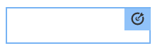

# Verfassen zielgerichteter Inhalte im Targeting-Modus{#authoring-targeted-content-using-targeting-mode}

Verfassen von zielgerichteten Inhalten im Targeting-Modus von AEM. Im Targeting-Modus und in der Targeting-Komponente stehen verschiedene Werkzeuge zur Verfügung, mit deren Hilfe sich Inhalte für Erlebnisse erstellen lassen:

* Erkennen Sie problemlos zielgerichtete Inhalte auf einer Seite. Zielgerichtete Inhalte werden mit einer gepunkteten Linie umrandet.
* Wählen Sie eine Marke und eine Aktivität aus, um die Erlebnisse anzuzeigen.
* Fügen Sie Erlebnisse zu einer Aktivität hinzu oder entfernen Sie Erlebnisse.
* Führen Sie A/B-Tests durch und konvertieren Sie die Gewinner (nur Adobe Target).
* Fügen Sie Erlebnissen Angebote hinzu, indem Sie Angebote erstellen oder Angebote aus einer Bibliothek verwenden.
* Konfigurieren Sie Ziele und überwachen Sie die Leistung.
* Simulieren Sie das Benutzererlebnis.
* Konfigurieren Sie die Target-Komponente für weitere Anpassungen.

Sie können entweder AEM oder Adobe Target als Targeting-Engine verwenden (für die Verwendung von Adobe Target benötigen Sie ein gültiges Adobe Target-Konto). Wenn Sie Adobe Target verwenden, müssen Sie zunächst die Integration konfigurieren. Informationen hierzu finden Sie unter [Anleitung für die Integration mit Adobe Target](/help/sites-administering/target.md).

Die im Targeting-Modus sichtbaren Aktivitäten und Erlebnisse spiegeln die Optionen der [Aktivitätskonsole](/help/sites-authoring/activitylib.md) wider:

* Änderungen, die Sie im Targeting-Modus an Aktivitäten und Erlebnissen vornehmen, werden in der Aktivitätskonsole angezeigt.
* Änderungen, die in der Aktivitätskonsole vorgenommen werden, werden im Targeting-Modus angezeigt.

>[!NOTE]
>
>Wenn Sie eine Kampagne in Adobe Target erstellen, wird jeder Kampagne eine Eigenschaft mit dem Namen `thirdPartyId` hinzugefügt. Sollten Sie die Kampagne in Adobe Target löschen, wird die Eigenschaft „thirdPartyId“ jedoch nicht gelöscht. Die `thirdPartyId` kann nicht für Kampagnen unterschiedlicher Typen (A/B, XT) wiederverwendet werden und lässt sich nicht manuell löschen. Um dieses Problem zu vermeiden, geben Sie jeder Kampagne einen eindeutigen Namen. Kampagnennamen können nicht in verschiedenen Kampagnentypen wiederverwendet werden.
>
>Wenn Sie denselben Namen im selben Kampagnentyp verwenden, überschreiben Sie die bestehende Kampagne.
>
>Sollte Ihnen beim Synchronisieren die Fehlermeldung „Anforderung fehlgeschlagen. `thirdPartyId` ist bereits vorhanden“ angezeigt werden, ändern Sie den Kampagnennamen und synchronisieren Sie erneut.

>[!NOTE]
>
>Beim Targeting bleibt die Kombination aus Branding und Aktivität auf Benutzerebene gleich, nicht auf Kanalebene.

## Wechseln in den Modus „Targeting“ {#switching-to-targeting-mode}

Wechseln Sie in den Targeting-Modus, um auf die Werkzeuge für die Erstellung von zielgerichtetem Inhalt zuzugreifen.

So wechseln Sie in den Targeting-Modus:

1. Öffnen Sie die Seite, für die Sie zielgerichtete Inhalte erstellen möchten.
1. Klicken Sie oben auf der Seite in der Symbolleiste auf das Dropdown-Menü Modus , um die verfügbaren Modustypen anzuzeigen.

   

1. Klicks **Targeting**. Die Targeting-Optionen werden daraufhin oben auf der Seite eingeblendet.

   

## Hinzufügen von Aktivitäten im Targeting-Modus {#adding-an-activity-using-targeting-mode}

Verwenden Sie den Targeting-Modus, um einer Marke eine Aktivität hinzuzufügen. Wenn Sie eine Aktivität hinzufügen, enthält sie das Standarderlebnis. Nach dem Hinzufügen der Aktivität können Sie mit dem Targeting-Verfahren für deren Inhalt beginnen.

Außerdem haben Sie die Möglichkeit, Adobe Target-Aktivitäten mit AEM zu erstellen und zu verwalten, indem Sie die entsprechende Targeting-Engine (AEM oder Adobe Target) und den Aktivitätstyp (Erlebnis-Targeting oder A/B-Test) auswählen.

Darüber hinaus können Sie Ziele und Metriken für alle Adobe Target-Aktivitäten verwalten und Ihre Adobe Target-Zielgruppen verwalten. Zu guter Letzt steht Ihnen auch das Aktivitäts-Reporting von Adobe Target zur Verfügung, die unter anderem auch die Konvertierung der im A/B-Test am besten abschneidenden Erlebnisse umfasst.

Fügen Sie eine Aktivität hinzu, erscheint diese auch in der [Aktivitätskonsole](/help/sites-authoring/activitylib.md).

So fügen Sie eine Aktivität hinzu:

1. Wählen Sie im Dropdown-Menü **Marke** die Marke aus, für die Sie eine Aktivität erstellen möchten.

   >[!NOTE]
   >
   >Adobe empfiehlt, dass Sie [Marken über die Aktivitätskonsole erstellen](/help/sites-authoring/activitylib.md#creating-a-brand-using-the-activities-console).
   >
   >
   >Wenn Sie eine Marke auf andere Weise erstellen, stellen Sie sicher, dass der Knoten `/campaigns/<brand>/master` vorhanden ist. Sonst führt der Versuch, eine Aktivität zu erstellen, zu einem Fehler.

1. Klicken Sie auf + neben **Aktivität** Dropdown-Menü.
1. Geben Sie einen Namen für die Aktivität ein.

   >[!NOTE]
   >
   >Wenn Sie eine Aktivität erstellen und eine Adobe Target-Cloud-Konfiguration an die Seite oder eine ihrer übergeordneten Seiten angehängt ist, nimmt AEM automatisch Adobe Target als Engine an.

1. Wählen Sie aus dem Dropdown-Menü **Targeting** die gewünschte Targeting-Engine aus.

   * Wählen Sie **ContextHub AEM** aus, werden die übrigen Felder als nicht verfügbar ausgegraut. Klicken Sie auf **Erstellen**.

   * Wenn Sie **Adobe Target** auswählen, können Sie eine Konfiguration (standardmäßig ist die Konfiguration festgelegt, die Sie bei der [Konfiguration des Kontos](/help/sites-administering/opt-in.md) angelegt haben) und einen Aktivitätstyp auswählen.

   * Wenn Sie die Integration zwischen AEM und Adobe Campaign verwenden und zielgerichtete Inhalte (Newsletter) senden, wählen Sie **Adobe Campaign**. Weitere Informationen finden Sie unter [Integrieren mit Adobe Campaign](/help/sites-administering/campaign.md).

1. Wählen Sie im Aktivitätsmenü entweder **Erlebnis-Targeting** oder **A/B-Test** aus.

   * Erlebnis-Targeting – Verwalten von Adobe Target-Aktivitäten in AEM.
   * A/B-Test – Erstellen und Verwalten von A/B-Testaktivitäten für Adobe Target in AEM.

## Der Targeting-Prozess: Erstellen, Targeting, Ziele und Einstellungen {#the-targeting-process-create-target-and-goals-settings}

Der Targeting-Modus ermöglicht die Konfiguration verschiedener Aspekte einer Aktivität. Verwenden Sie den folgenden dreistufigen Prozess zum Erstellen zielgerichteter Inhalte für eine Markenaktivität:

1. [Erstellen](#create-authoring-the-experiences): Fügen Sie Erlebnisse hinzu oder entfernen Sie welche und fügen Sie Angebote für jedes Erlebnis hinzu.
1. [Zielgruppe](#diagramtargetconfiguringtheaudiences): Geben Sie die Zielgruppe an, an die sich die jeweiligen Erlebnisse richten. Sie können eine bestimmte Zielgruppe ansprechen und bei Verwendung von A/B-Tests entscheiden, welcher Prozentsatz des Traffics auf welches Erlebnis ausgerichtet wird.
1. [Ziele und Einstellungen](#settingsgoalssettingsconfiguringtheactivityandsettinggoals): Planen Sie die Aktivität und legen Sie die Priorität fest. Außerdem lassen sich auch Ziele für Erfolgsmetriken bestimmen.

Führen Sie die folgenden Schritte aus, um den Targeting-Prozess für den Inhalt einer Aktivität zu starten.

>[!NOTE]
>
>Möchten Sie Targeting verwenden, müssen Sie zunächst Mitglied der Autorenbenutzergruppe für Target-Aktivitäten sein.

So fügen Sie eine Aktivität hinzu:

1. Wählen Sie im Dropdown-Menü **Marke** die Marke aus, die die Aktivität enthält, an der Sie gerade arbeiten.
1. Wählen Sie im Dropdown-Menü **Aktivität** die Aktivität aus, für die zielgerichtete Inhalte verfasst werden sollen.
1. Um die Steuerelemente anzuzeigen, die Sie durch den Zielgruppenbestimmungsprozess führen, klicken Sie auf **Targeting starten**.

   

   >[!NOTE]
   >
   >Um die Aktivität zu ändern, mit der Sie arbeiten, klicken Sie auf **Zurück**.

## Erstellen: Verfassen der Erlebnisse {#create-authoring-the-experiences}

Im Erstellungsschritt des Inhalts-Targetings werden Erlebnisse geschaffen. n diesem Schritt können Sie die Erlebnisse der Aktivität erstellen oder löschen und jedem Erlebnis Angebote hinzufügen.

### Anzeigen von Erlebnisangeboten im Targeting-Modus {#seeing-experience-offers-in-targeting-mode}

Nach dem [Starten des Targeting-Prozesses](/help/sites-authoring/content-targeting-touch.md#the-targeting-process-create-target-and-goals-settings) wählen Sie ein Erlebnis aus, um die Angebote anzuzeigen, die für dieses Erlebnis bereitgestellt werden. Bei der Auswahl eines Erlebnisses ändern sich die auf der Seite angezeigten Targeting-Komponenten so, dass das Angebot dieses Erlebnisses angezeigt wird.

>[!CAUTION]
>
>Gehen Sie beim Deaktivieren des Targetings für eine Komponente mit Bedacht vor, wenn für diese bereits in der Autoreninstanz Targeting durchgeführt wurde. Die entsprechende Aktivität wird automatisch auch aus der Publishing-Instanz gelöscht.

>[!NOTE]
>
>Ein Angebot ist der Inhalt einer Targeting-Komponente.

Erlebnisse werden im Bereich „Zielgruppen“ angezeigt. Im folgenden Beispiel finden sich unter anderem die Erlebnisse **Standard**, **Frauen**, **Frauen über 30** und **Frauen unter 30**. In diesem Beispiel wird das Standardangebot einer Targeting-**Bild**-Komponente dargestellt.

Bei Auswahl eines anderen Erlebnisses wird in der Bild-Komponente das Angebot des entsprechenden Erlebnisses gezeigt.

Wenn ein Erlebnis ausgewählt wurde und die Targeting-Komponente kein Angebot für dieses Erlebnis enthält, wird in der Komponente **Angebot hinzufügen** angezeigt. Diese Option wird auf dem halbtransparenten Standardangebot überlagert. Wenn für ein Erlebnis kein Angebot erstellt wurde, wird das **Standardangebot** für das Segment angezeigt, das dem Erlebnis zugeordnet ist.

Das Standardereignis wird ebenfalls angezeigt, wenn die Besuchereigenschaften nicht mit Erlebnissen zugeordneten Segmenten übereinstimmen. Informationen hierzu finden Sie unter [Erlebnisse im Targeting-Modus hinzufügen](#adding-and-removing-experiences-using-targeting-mode).

### Individuelle Angebote und Bibliotheksangebote {#custom-offers-and-library-offers}

Angebote, die [auf der Seite erstellt](/help/sites-authoring/content-targeting-touch.md#adding-a-custom-offer) und für ein einziges Erlebnis verwendet werden, werden als individuelle Angebote bezeichnet. Das folgende Bild wurde über dem Inhalt eines individuellen Angebots platziert:

Angebote, die [aus einer Angebotsbibliothek hinzugefügt werden](/help/sites-authoring/content-targeting-touch.md#adding-an-offer-from-an-offer-library), werden mit dem folgenden Bild platziert:

Sie können benutzerdefinierte Angebote in einer Angebotsbibliothek speichern, wenn Sie sie wiederverwenden möchten. Sie können auch ein Bibliotheksangebot in ein individuelles Angebot konvertieren, wenn Sie für ein Erlebnis den Inhalt ändern möchten. Im Anschluss an die Bearbeitung kann das Angebot dann erneut in der Bibliothek gespeichert werden.

### Hinzufügen und Entfernen von Erlebnissen im Targeting-Modus {#adding-and-removing-experiences-using-targeting-mode}

Im Erstellungsschritt des [Targeting-Prozesses](/help/sites-authoring/content-targeting-touch.md#the-targeting-process-create-target-and-goals-settings) können Sie Erlebnisse hinzufügen und entfernen. Darüber hinaus können Sie ein Erlebnis duplizieren und es auch umbenennen.

#### Hinzufügen von Erlebnissen im Targeting-Modus {#adding-experiences-using-targeting-mode}

So fügen Sie Erlebnisse hinzu:

1. Um ein Erlebnis hinzuzufügen, klicken Sie auf **+** **Hinzufügen von Erlebnis-Targeting** , das unterhalb der vorhandenen Erlebnisse in der **Zielgruppen** -Bereich.
1. Wählen Sie eine Zielgruppe aus. Standardmäßig ist dieser Name der Name des Erlebnisses. Sie können bei Bedarf einen anderen Namen eingeben. Klicken Sie auf **OK**.

#### Erlebnisse im Targeting-Modus entfernen {#removing-experiences-using-targeting-mode}

So löschen Sie Erlebnisse:

1. Klicken Sie auf den Pfeil neben dem Erlebnisnamen.

   

1. Klicken Sie auf **Löschen**.

#### Umbenennen von Erlebnissen im Targeting-Modus {#renaming-experiences-using-targeting-mode}

So benennen Sie Erlebnisse im Targeting-Modus um:

1. Klicken Sie auf den Pfeil neben dem Erlebnisnamen.
1. Klicken Sie auf **Erlebnis umbenennen** und geben Sie den neuen Namen ein.
1. Klicken Sie auf eine andere Stelle auf dem Bildschirm, um die Änderungen zu speichern.

#### Bearbeiten von Zielgruppen im Targeting-Modus {#editing-audiences-using-targeting-mode}

So bearbeiten Sie im Targeting-Modus Zielgruppen:

1. Klicken Sie auf den Pfeil neben dem Erlebnisnamen.
1. Klicken Sie auf **Zielgruppe bearbeiten** und wählen Sie eine neue Zielgruppe aus.
1. Klicken Sie auf **OK**.

#### Duplizieren von Erlebnissen im Targeting-Modus {#duplicating-experiences-using-targeting-mode}

So duplizieren Sie Erlebnisse im Targeting-Modus:

1. Klicken Sie auf den Pfeil neben dem Erlebnisnamen.
1. Klicken Sie auf **Duplizieren** und wählen Sie die Zielgruppe aus.
1. Benennen Sie das Erlebnis, falls gewünscht, um und klicken Sie auf **OK**.

### Erstellen von Angeboten im Targeting-Modus {#creating-offers-using-targeting-mode}

Erstellen Sie durch das Targeting einer Komponente Angebote für Ihre Erlebnisse. Targeting-Komponenten stellen die Inhalte bereit, die als Angebote für Erlebnisse verwendet werden.

* [Führen Sie das Targeting einer bestehenden Komponente durch](/help/sites-authoring/content-targeting-touch.md#creating-a-default-offer-by-targeting-an-existing-component). Der Inhalt wird zum Angebot des Standarderlebnisses.
* [Fügen Sie eine Target-Komponente hinzu](/help/sites-authoring/content-targeting-touch.md#creating-an-offer-by-adding-a-target-component) und versehen Sie diese anschließend mit Inhalt.

Nach dem Targeting der Komponente können für jedes Erlebnis Angebote hinzugefügt werden:

* [Fügen Sie individuelle Angebote hinzu](/help/sites-authoring/content-targeting-touch.md#adding-a-custom-offer).
* [Fügen Sie Angebote aus einer Bibliothek hinzu](/help/sites-authoring/content-targeting-touch.md#adding-an-offer-from-an-offer-library).

Für die Arbeit mit Angeboten stehen die folgenden Tools zur Verfügung:

* [Fügen Sie einer Angebotsbibliothek ein individuelles Angebot hinzu](/help/sites-authoring/content-targeting-touch.md#adding-a-custom-offer-to-a-library).
* [Konvertieren Sie ein Bibliotheksangebot in ein individuelles Angebot](/help/sites-authoring/content-targeting-touch.md#converting-a-library-offer-to-a-custom-library).
* [Öffnen Sie ein Bibliotheksangebot und bearbeiten Sie den Inhalt](/help/sites-authoring/content-targeting-touch.md#editing-a-library-offer).

#### Erstellen von Standardangeboten durch Targeting bestehender Komponenten {#creating-a-default-offer-by-targeting-an-existing-component}

Durch Targeting einer Komponente auf der Seite können Sie diese als Angebot für das Standarderlebnis der Aktivität verwenden. Beim Targeting einer Komponente wird diese in eine Target-Komponente integriert und ihr Inhalt wird zum Angebot für das Standarderlebnis.

Nach dem Targeting einer Komponente kann nur diese Komponente im Angebot verwendet werden. Sie können die Komponente nicht aus dem Angebot entfernen und dem Angebot auch keine anderen Komponenten hinzufügen.

Gehen Sie folgendermaßen vor, nachdem Sie den [Targeting-Prozess gestartet](/help/sites-authoring/content-targeting-touch.md#the-targeting-process-create-target-and-goals-settings) haben.

1. Klicken Sie auf die auszuwählende Komponente. Die Symbolleiste für die Komponente wird angezeigt, ähnlich wie im folgenden Beispiel.

   

1. Klicken Sie auf das Target -Symbol.

   

   Der Komponenteninhalt ist das Angebot für das Standarderlebnis. Beim Festlegen einer Komponente wird der zugehörige Standardknoten für jedes Erlebnis repliziert. Dies ist zum Modifizieren des richtigen Inhaltsknotens beim erlebnisspezifischen Bearbeiten erforderlich. Diesen Ereignissen, die nicht dem Standardereignis entsprechen, können Sie entweder [ein individuelles Angebot](/help/sites-authoring/content-targeting-touch.md#adding-a-custom-offer) oder [ein Bibliotheksangebot](/help/sites-authoring/content-targeting-touch.md#adding-an-offer-from-an-offer-library) hinzufügen.

#### Erstellen eines Angebots durch Hinzufügen einer Target-Komponente {#creating-an-offer-by-adding-a-target-component}

Fügen Sie eine Target-Komponente hinzu, um ein Angebot für das Standarderlebnis zu erstellen. Bei der Target-Komponente handelt es sich um einen Container für andere Komponenten. Komponenten, die in diesem Container platziert werden, werden zu Target-Komponenten. Sollten Sie die Target-Komponente verwenden, können Sie ein Angebot durch Hinzufügen mehrerer Komponenten erstellen. Außerdem können Sie für jedes Erlebnis verschiedene Komponenten verwenden, um unterschiedliche Angebote zu erstellen.

Weitere Informationen zur Anpassung dieser Komponente finden Sie unter [Konfigurieren von Target-Komponentenoptionen](/help/sites-authoring/content-targeting-touch.md#configuring-target-component-options).

>[!NOTE]
>
>Angebote, die Sie mithilfe der [Angebotskonsole](/help/sites-authoring/offerlib.md) erstellen, können ebenfalls über mehrere Komponenten verfügen. Diese Angebote gehören zu einer Angebotsbibliothek und können für mehrere Erlebnisse verwendet werden.

Da es sich bei der Target-Komponente um einen Container handelt, wird sie als Ablagebereich für andere Komponenten dargestellt.

Im Targeting-Modus hat die Target-Komponente einen blauen Rand und die Ablagezielmeldung gibt die Art der Komponente an.

Im Bearbeitungsmodus wird die Target-Komponente mit Zielscheibensymbol dargestellt.

Ziehen Sie Komponenten in die Target-Komponente, werden diese zu Targeting-Komponenten.

Wenn Sie der Target-Komponente eine Komponente hinzufügen, stellt diese Inhalte für ein bestimmtes Erlebnis bereit. Um das Erlebnis festzulegen, wählen Sie es aus, bevor Sie die Komponenten hinzufügen.

Sie können eine Target-Komponente zur Seite im Bearbeitungsmodus oder im Target-Modus hinzufügen. Sie können der Target-Komponente nur im Targeting-Modus Komponenten hinzufügen. Die Target-Komponente gehört zur Komponentengruppe „Personalisierung“.

Wenn Sie zielgerichtete Inhalte bearbeiten, müssen Sie auf **Targeting starten** bevor Sie dies tun können.

1. Ziehen Sie die Target-Komponente auf die Seite, auf der das Angebot angezeigt werden soll.
1. Standardmäßig ist keine Standort-ID festgelegt. Klicken Sie auf das Zahnradsymbol &quot;Konfigurieren&quot;, um den Standort festzulegen.

   >[!NOTE]
   >
   >Sollte diese Einstellung vom Administrator gefordert werden, müssen Sie den Ort möglicherweise genau angeben.
   >
   >
   >Administratoren können festlegen, ob diese Konfiguration unter **https://&lt;host>:&lt;port>/system/console/configMgr/com.day.cq.personalization.impl.servlets.TargetingConfigurationServlet**
   >
   >
   Um Benutzer zur Eingabe eines Pfads aufzufordern, aktivieren Sie das Kontrollkästchen **Ortsangabe erzwingen**.

1. Wählen Sie das Erlebnis aus, für das Sie das Angebot erstellen möchten.
1. Erstellen Sie das Angebot:

   * Ziehen Sie für das Standarderlebnis Komponenten in den Targeting-Ablagebereich und bearbeiten Sie die Komponenteneigenschaften wie gewohnt, um Inhalte für das Angebot zu erstellen.
   * Für Erlebnisse, die nicht dem Standarderlebnis entsprechen, können Sie entweder [individuelle Angebote](#adding-a-custom-offer) oder [Bibliotheksangebote](/help/sites-authoring/content-targeting-touch.md#adding-an-offer-from-an-offer-library) hinzufügen.

#### Hinzufügen individueller Angebote {#adding-a-custom-offer}

Erstellen Sie ein Angebot, indem Sie den Inhalt einer Targeting-Komponente im Targeting-Modus bearbeiten. Wenn Sie ein benutzerdefiniertes Angebot erstellen, wird es als Angebot für ein einzelnes Erlebnis verwendet.

Sollten Sie sich dazu entschließen, das Angebot auch für andere Erlebnisse nutzen zu wollen, können Sie ein individuelles Angebot erstellen und es [der Bibliothek hinzufügen](/help/sites-authoring/content-targeting-touch.md#adding-a-custom-offer-to-a-library). Weitere Informationen zur Verwendung der Angebotskonsole für die Erstellung wiederverwendbarer Angebote finden Sie unter [Hinzufügen von Angeboten zu Angebotsbibliotheken](/help/sites-authoring/offerlib.md#add-an-offer-to-an-offer-library).

1. Wählen Sie das Erlebnis aus, dem Sie das Angebot hinzufügen möchten.
1. Um das Komponentenmenü anzuzeigen, klicken Sie auf die Targeting-Komponente, der Sie das Angebot hinzufügen.

   

1. Klicken Sie auf das Symbol + .

   Der Inhalt des Standardangebots wird als Angebot für das aktuelle Erlebnis verwendet.

1. Klicken Sie auf das Angebot, um das Angebotsmenü anzuzeigen, und klicken Sie dann auf das Bearbeitungssymbol.

   

1. Bearbeiten Sie den Inhalt der Komponente.

#### Hinzufügen eines Angebots aus einer Angebotsbibliothek {#adding-an-offer-from-an-offer-library}

Fügen Sie einem Erlebnis ein Angebot aus der [Angebotsbibliothek](/help/sites-authoring/offerlib.md) hinzu. Sie können beliebige Angebote aus der Bibliothek der Marke auswählen, die Sie derzeit bearbeiten.

Sie können dem Standarderlebnis keine Bibliotheksangebote hinzufügen.

1. Wählen Sie das Erlebnis aus, dem Sie das Angebot hinzufügen möchten.
1. Um das Komponentenmenü anzuzeigen, klicken Sie auf die Targeting-Komponente, der Sie das Angebot hinzufügen.

   

1. Klicken Sie auf das Ordnersymbol.

   

1. Wählen Sie das Angebot aus der Bibliothek aus und klicken Sie auf das Häkchen-Symbol.

   

   Mit der Angebotsauswahl können Sie nach Angeboten suchen oder diese filtern. Beim Durchsuchen oder Filtern können Sie auch die Angebote sortieren und deren Ansicht ändern. Die Zahl oben rechts zeigt an, wie viele Angebote in der aktuellen Bibliothek verfügbar sind.

   * Klicks **Durchsuchen** , um zu einem anderen Ordner zu navigieren. Es öffnet sich ein Navigationsfenster, in dem Sie durch Klicken auf die Pfeile tiefer in die Ordnerstruktur vordringen können. Klicks **Durchsuchen** erneut, um den Navigationsbereich zu schließen.

   

   * Klicks **Filter** , um die Angebote nach Keywords oder Tags zu filtern. Sie geben Suchbegriffe ein und wählen Tags aus dem Dropdown-Menü aus. Klicks **Filter** erneut, um den Filterbereich zu schließen.

   

   * Durch Klicken oder Tippen auf den Pfeil neben **Von neu nach alt** können Sie anpassen, wie die Angebote sortiert werden sollen. Angebote können von neu nach alt oder von alt nach neu sortiert werden.

   

   Klicken Sie auf das Symbol neben **Anzeigen als** um Angebote als Kacheln oder Liste anzuzeigen.

   

#### Hinzufügen individueller Angebote zu einer Bibliothek {#adding-a-custom-offer-to-a-library}

Fügen Sie ein benutzerdefiniertes Angebot zur [Angebotsbibliothek](/help/sites-authoring/offerlib.md) hinzu, wenn Sie es als Angebot für mehrere Erlebnisse wiederverwenden möchten. Sie können zur Bibliothek der aktuellen Marke, die Sie als Ziel auswählen, Angebote hinzufügen.

Weitere Informationen zur Verwendung der Angebotskonsole für die Erstellung wiederverwendbarer Angebote finden Sie unter [Hinzufügen von Angeboten zu Angebotsbibliotheken](/help/sites-authoring/offerlib.md#add-an-offer-to-an-offer-library).

1. Wählen Sie das Erlebnis aus, um das benutzerdefinierte Angebot anzuzeigen.
1. Klicken Sie auf das benutzerdefinierte Angebot, um das Angebotsmenü anzuzeigen, und klicken Sie auf die Schaltfläche **Angebot in Angebotsbibliothek speichern** Symbol.

   

1. Geben Sie einen Namen für das Angebot ein, wählen Sie die Bibliothek aus, der Sie das Angebot hinzufügen möchten, und klicken Sie dann auf das Häkchen-Symbol.

#### Umwandeln von Bibliotheksangeboten in individuelle Angebote {#converting-a-library-offer-to-a-custom-library}

Konvertieren Sie ein Bibliotheksangebot in ein benutzerdefiniertes Angebot, um das Angebot für das aktuelle Erlebnis zu ändern, ohne das Angebot in anderen Erlebnissen zu ändern.

1. Wählen Sie das Erlebnis aus, um das Bibliotheksangebot anzuzeigen.
1. Klicken Sie auf das Bibliotheksangebot, um das Angebotsmenü anzuzeigen, und klicken Sie dann auf das Symbol In Inline-Angebot konvertieren .

   

#### Überarbeiten eines Bibliothekangebots {#editing-a-library-offer}

Öffnen Sie ein Bibliotheksangebot aus einem Erlebnis im Targeting-Modus, um das Angebot zu bearbeiten. Die vorgenommenen Änderungen werden in allen Erlebnissen angezeigt, die das Angebot verwenden.

1. Wählen Sie das Erlebnis aus, um das Bibliotheksangebot anzuzeigen.
1. Wandeln Sie das Bibliotheksangebot in ein lokales/individuelles Angebot um. Weitere Informationen finden Sie unter [Umwandeln von Bibliotheksangeboten in individuelle Angebote](#converting-a-library-offer-to-a-custom-library).
1. Bearbeiten Sie den Inhalt des Angebots.

1. Speichern Sie es erneut in der Bibliothek. Weitere Informationen finden Sie unter [Hinzufügen individueller Angebote zu einer Bibliothek](#adding-a-custom-offer-to-a-library).

## Target: Konfigurieren der Zielgruppen {#target-configuring-the-audiences}

Im Target-Schritt des [Targeting-Verfahrens](/help/sites-authoring/content-targeting-touch.md#the-targeting-process-create-target-and-goals-settings) werden Zielgruppen mit den Erlebnissen verknüpft, die Sie während des Erstellungsschritts bearbeitet haben. Auf der Target-Seite werden die Zielgruppen angezeigt, die von den einzelnen Erlebnissen angesprochen werden. Sie können die Zielgruppe für jedes Erlebnis festlegen oder ändern. Sollten Sie mit Adobe Target arbeiten, können Sie zudem A/B-Tests erstellen, die es Ihnen ermöglichen, einen bestimmten Anteil des Traffics einer Zielgruppe auf ein bestimmtes Erlebnis umzuleiten.

### Wenn Sie AEM-Targeting oder Adobe Target (Erlebnis-Targeting) verwenden … {#if-you-are-using-aem-targeting-or-adobe-target-experience-targeting}

werden Zielgruppen auf der linken Seite des Zuordnungsdiagramms angezeigt, Erlebnisse auf der rechten Seite.

Legen Sie mithilfe eines Segments eine Zielgruppe fest. Die Cloud-Konfiguration für die Seite bestimmt die Segmente, die Ihnen zur Verfügung stehen. Wenn die Seite nicht mit einer Adobe Target-Cloud-Konfiguration verknüpft ist, stehen AEM-Segmente zum Definieren von Zielgruppen zur Verfügung. Wenn die Seite mit einer Adobe Target-Cloud-Konfiguration verknüpft ist, verwenden Sie Target-Segmente.

Informationen zu Targeting-Engines finden Sie unter [Targeting-Engine](/help/sites-authoring/personalization.md#targeting-engine).

Verwenden Sie nicht mehr als ein Erlebnis für eine Zielgruppe. Neben einem Erlebnis wird ein Warnsymbol angezeigt, wenn es einer Zielgruppe zugeordnet ist, die einem anderen Erlebnis zugeordnet ist.

### Verknüpfen von Erlebnissen und Zielgruppen (AEM oder Adobe Target) {#associating-experiences-with-audiences-aem-or-adobe-target}

Gehen Sie wie folgt vor, um ein Erlebnis mit einer Zielgruppe zu verknüpfen, wenn Sie AEM-Targeting (oder Erlebnis-Targeting in Adobe Target) verwenden:

1. Klicken Sie auf den Dropdown-Pfeil neben dem Zielgruppenfeld, das dem Erlebnis zugeordnet ist.
1. (Optional) Klicken Sie auf **Bearbeiten** und geben Sie dann einen Suchbegriff ein, um nach dem gewünschten Segment zu suchen.
1. Wählen Sie in der Zielgruppenliste die gewünschte Audience aus und klicken Sie auf **OK**.

### Wenn Sie A/B-Tests (Adobe Target) verwenden …     {#if-you-are-using-a-b-testing-adobe-target}

Wenn Sie über eine A/B-Test-Aktivität verfügen, befinden sich die Zielgruppen auf der linken Seite, der Prozentsatz, in dem jedes Erlebnis angezeigt wird, befindet sich in der Mitte und die Erlebnisse befinden sich auf der rechten Seite.

Sie können die Prozentsätze ändern, solange sie in der Summe 100 Prozent ergeben. Eine Zielgruppe kann von mehreren Erlebnissen in A/B-Tests verwendet werden.

### Zielgruppen in A/B-Tests Traffic-Anteilen zuordnen {#associating-audiences-and-traffic-percentages-with-a-b-testing}

1. Klicken Sie auf das Dropdown-Feld neben der Zielgruppe, die dem Erlebnis zugeordnet ist.
1. (Optional) Klicken oder tippen Sie auf **Bearbeiten** und geben Sie den Suchbegriff ein, nach dem das gewünschte Segment durchsucht werden soll.
1. Klicks **OK.**
1. Geben Sie Prozentsätze ein, um zu konfigurieren, wie der Zielgruppen-Traffic zu den einzelnen Erlebnissen geleitet wird. Die Gesamtsumme muss 100 betragen.
1. (Optional) Bearbeiten Sie den Erlebnisnamen, indem Sie auf das Dropdown-Menü neben dem Erlebnisnamen klicken.

## Ziele und Einstellungen: Konfigurieren der Aktivität und Festlegen von Zielen {#goals-settings-configuring-the-activity-and-setting-goals}

Im Schritt „Ziele und Einstellungen“ des [Targeting-Verfahrens](/help/sites-authoring/content-targeting-touch.md#the-targeting-process-create-target-and-goals-settings) wird das Verhalten der Markenaktivität konfiguriert. Geben Sie an, wann die Aktivität beginnt und endet, und geben Sie die Aktivitätspriorität an. Darüber hinaus verfolgen Sie auch Ziele. Insbesondere können Sie entscheiden, was Sie mit Ihren Aktivitäten messen möchten.

Zielmetriken sind nur verfügbar, wenn Sie Adobe Target für Ihre Targeting-Engine verwenden. Definieren Sie mindestens eine Zielmetrik. Wenn Sie Adobe Analytics konfiguriert haben und eine A4T Analytics-Cloud-Konfiguration haben, können Sie auswählen, ob die Berichtsquelle Adobe Target oder Adobe Analytics sein soll.

Die Zielmetriken werden nur für die veröffentlichte Kampagne gemessen.

Bei Verwendung von AEM als Targeting-Engine:

Sollten Sie Adobe Target als Targeting-Engine verwenden:

Wenn Sie Adobe Target als Targeting-Engine verwenden und A4T Analytics für das Konto konfiguriert wurde, wird Ihnen ein zusätzliches Dropdown-Menü für die **Berichtsquelle** angezeigt:

Es sind folgende Erfolgsmetriken verfügbar (nur für die Veröffentlichung einsetzbar):

<table>
 <tbody>
  <tr>
   <td><strong>Konversion</strong></td>
   <td>
Der Prozentsatz der Besucherinnen und Besucher, die auf einen beliebigen Teil des getesteten Erlebnisses geklickt haben. Eine Konversion kann entweder einmal pro Besuch oder jedes Mal gezählt werden, wenn eine Besucherin bzw. ein Besucher eine Konversion durchführt. Die Konversionsmetrik ist auf einen der folgenden Werte eingestellt:

    <ul>
     <li><strong>Seite angesehen</strong>: Sie können festlegen, welche Seite die Zielgruppe angesehen haben muss, indem Sie entweder <strong>URL lautet</strong> auswählen und eine oder mehrere Ziel URLs eingeben oder <strong>URL enthält</strong> auswählen und einen Pfad oder ein Keyword hinzufügen.</li>
     <li><strong>Mbox angesehen</strong>: Sie können festlegen, welche Mbox für Ihre Zielgruppe sichtbar ist, indem Sie den Namen der Mbox eingeben. Sie können mehrere Mboxen eingeben, indem Sie auf <strong>Mbox hinzufügen</strong> klicken.</li>
    </ul> </td>
  </tr>
  <tr>
   <td><strong>Umsatz</strong></td>
   <td>
Durch den Besuch generierter Umsatz. Sie können aus den aufgelisteten Umsatzmetriken auswählen:

    <ul>
     <li>Umsatz pro Besucher (RPV)</li>
     <li>Durchschnittlicher Bestellwert (AOV)</li>
     <li>Gesamtverkäufe </li>
     <li>Bestellungen</li>
    </ul> 
Bei allen Optionen weist das Anzeigen einer Mbox darauf hin, dass das Ziel erreicht wurde. Es können eine oder mehrere Mboxes festgelegt werden.
 </td>
  </tr>
  <tr>
   <td><strong>Interaktion</strong></td>
   <td>
Sie können drei Interaktionstypen messen:

    <ul>
     <li>Seitenansichten</li>
     <li>Individuelle Bewertung</li>
     <li>Besuchszeit pro Site</li>
    </ul> </td>
  </tr>
 </tbody>
</table>

Darüber hinaus gibt es erweiterte Einstellungen, mit denen Sie bestimmen können, wie Erfolgsmetriken gezählt werden. Zu den Optionen gehören die Zählung der Metrik pro Impression oder einmal pro Person und die Auswahl, ob die Person in der Aktivität bleiben oder entfernt werden soll.

Verwenden Sie die erweiterten Einstellungen, um zu bestimmen, was passiert, **nachdem** eine Benutzerin bzw. ein Benutzer auf die Zielmetrik stößt. Die folgende Tabelle zeigt die verfügbaren Optionen.

<table>
 <tbody>
  <tr>
   <td><strong>Ein Benutzer findet diese Sollmetrik vor …</strong></td>
   <td><strong>Sie wählen folgende Aktionen aus …</strong></td>
  </tr>
  <tr>
   <td><strong>Anzahl erhöhen und Benutzer in Aktivität belassen</strong></td>
   <td>Geben Sie an, wie die Anzahl erhöht wird:
    <ul>
     <li>Einmal pro Eintritt</li>
     <li>Bei jeder Impression, außer bei Seitenaktualisierungen</li>
     <li>Bei jeder Impression</li>
    </ul> </td>
  </tr>
  <tr>
   <td><strong>Anzahl erhöhen, Benutzer freigeben und Wiedereintritt erlauben</strong></td>
   <td>Wählen Sie das Erlebnis aus, das dem Besucher angezeigt wird, wenn er erneut in die Aktivität eintritt.
    <ul>
     <li>Gleiches Erlebnis</li>
     <li>Zufallserlebnis</li>
     <li>Neues Erlebnis</li>
    </ul> </td>
  </tr>
  <tr>
   <td><strong>Anzahl erhöhen, Benutzer freigeben und Wiedereintritt von Balken verweigern</strong></td>
   <td>Bestimmen Sie, was der Benutzer anstelle des Aktivitätsinhalts sieht:
    <ul>
     <li>Gleiches Erlebnis, ohne Tracking</li>
     <li>Standard- oder sonstiger Aktivitätsinhalt</li>
    </ul> </td>
  </tr>
 </tbody>
</table>

Weitere Informationen zu Erfolgsmetriken finden Sie in der [Adobe Target-Dokumentation](https://experienceleague.adobe.com/docs/target/using/activities/success-metrics/success-metrics.html?lang=de).

### Konfigurieren von Einstellungen (AEM Targeting) {#configuring-settings-aem-targeting}

So konfigurieren Sie Einstellungen, falls Sie AEM-Targeting verwenden:

1. Um den Beginn der Aktivität festzulegen, wählen Sie im Dropdown-Menü **Start** einen der folgenden Werte:

   * **Bei Aktivierung**: Die Aktivität beginnt, wenn die Seite, die den zielgerichteten Inhalt enthält, aktiviert wird.
   * **Angegebenes Datum und Uhrzeit:** Ein bestimmter Zeitpunkt. Wenn Sie diese Option auswählen, klicken Sie auf das Kalendersymbol, wählen Sie ein Datum aus und geben Sie die Zeit an, zu der die Aktivität gestartet werden soll.

1. Verwenden Sie das Dropdown-Menü **Ende**, um festzulegen, wann die Aktivität beendet werden soll. Wählen Sie einen der folgenden Werte aus:

   * **Wenn deaktiviert**: Beendet die Aktivität, wenn die Seite, die den zielgerichteten Inhalt enthält, deaktiviert wird.
   * **Angegebenes Datum und Uhrzeit:** Ein bestimmter Zeitpunkt. Wenn Sie diese Option auswählen, klicken Sie auf das Kalendersymbol, wählen Sie ein Datum aus und geben Sie die Zeit zum Ende der Aktivität an.

1. Um eine Priorität für die Aktivität festzulegen, wählen Sie mit dem Schieberegler entweder **Niedrig**, **Normal**, oder **Hoch**.

### Konfigurieren von Zielen und Einstellungen (Adobe Target) {#configuring-goals-settings-adobe-target}

So konfigurieren Sie Ziele und Einstellungen, falls Sie Adobe Target verwenden:

1. Um den Beginn der Aktivität festzulegen, wählen Sie im Dropdown-Menü **Start** einen der folgenden Werte:

   * **Bei Aktivierung**: Die Aktivität beginnt, wenn die Seite, die den zielgerichteten Inhalt enthält, aktiviert wird.
   * **Angegebenes Datum und Uhrzeit:** Ein bestimmter Zeitpunkt. Wenn Sie diese Option auswählen, klicken Sie auf das Kalendersymbol, wählen Sie ein Datum aus und geben Sie die Zeit an, zu der die Aktivität gestartet werden soll.

1. Verwenden Sie das Dropdown-Menü **Ende**, um festzulegen, wann die Aktivität beendet werden soll. Wählen Sie einen der folgenden Werte aus:

   * **Wenn deaktiviert**: Beendet die Aktivität, wenn die Seite, die den zielgerichteten Inhalt enthält, deaktiviert wird.
   * **Angegebenes Datum und Uhrzeit:** Ein bestimmter Zeitpunkt. Wenn Sie diese Option auswählen, klicken Sie auf das Kalendersymbol, wählen Sie ein Datum aus und geben Sie die Zeit zum Ende der Aktivität an.

1. Um eine Priorität für die Aktivität festzulegen, wählen Sie mit dem Schieberegler entweder **Niedrig**, **Normal**, oder **Hoch**.
1. Wenn Sie Adobe Analytics für Ihr Adobe Target-Konto konfiguriert haben, wird das Dropdown-Menü **Berichtsquelle** angezeigt. Wählen Sie **Adobe Target** oder **Adobe Analytics** als Quelle.

   Wenn Sie **Adobe Analytics** auswählen, wählen Sie das Unternehmen und die Report Suite aus. Sollten Sie **Adobe Target** auswählen, muss keine weitere Auswahl getroffen werden.

   

1. Wählen Sie im Bereich **Zielmetrik** unter **Mein Hauptziel** die Erfolgsmetrik, die Sie verfolgen möchten – Umrechnung, Umsatz, Interaktion – und geben Sie an, wie diese Metrik gemessen wird (oder welche Aktion die Zielgruppe durchführt, um anzuzeigen, dass ein Ziel erreicht wurde). Siehe Definition der Zielmetriken in der vorherigen Tabelle und siehe [Adobe Target-Dokumentation](https://experienceleague.adobe.com/docs/target/using/activities/success-metrics/success-metrics.html?lang=de) zu Erfolgsmetriken.

   Sie können das Ziel umbenennen, indem Sie auf die drei Punkte oben rechts klicken und **Umbenennen** auswählen.

   Möchten Sie die Inhalte aller Felder löschen, klicken Sie auf die drei Punkte oben rechts und wählen Sie **Alle Felder löschen** aus.

   Alle Metriken verfügen auch über erweiterte Einstellungen, die Sie definieren können. Wählen Sie **Erweiterte Einstellungen** aus, um auf diese zuzugreifen. Weitere Informationen dazu, wie die Erfolgsmetriken in der oben stehenden Tabelle gemessen werden, finden Sie in der [Adobe Target-Dokumentation](https://experienceleague.adobe.com/docs/target/using/activities/success-metrics/success-metrics.html?lang=de).

   >[!NOTE]
   >
   Sie müssen mindestens eine Zielmetrik definieren.

   

   >[!NOTE]
   >
   Sollten Daten Ihrer Metrik fehlen, wird die zugehörige Metrik rot umrandet.

1. Klicken Sie auf **Neue Metrik hinzufügen**, um weitere Erfolgsmetriken zu konfigurieren.

   

   >[!NOTE]
   >
   Sie können andere Ziele entfernen, indem Sie entweder auf die drei Punkte oder auf **Löschen** klicken oder tippen. AEM erfordert, dass Sie mindestens ein Ziel definiert haben.

1. Wenn Sie mehr Kontrolle darüber haben möchten, wie Erfolgsmetriken gezählt werden, klicken Sie auf **Erweiterte Einstellungen** , um darauf zuzugreifen.
1. Klicken Sie auf **Speichern**.

Nach abgeschlossener Konfiguration können Sie die [Leistung der Aktivitäten](/help/sites-authoring/activitylib.md#viewing-performance-and-converting-winning-experiences-a-b-test) anzeigen, die Adobe Target verwenden (Erlebnis-Targeting oder A/B-Tests). Bei A/B-Tests können Sie zusätzlich [die Gewinner konvertieren.](/help/sites-authoring/activitylib.md#viewing-performance-and-converting-winning-experiences-a-b-test)

## Simulieren eines Erlebnisses {#simulating-an-experience}

Simulieren Sie das Erlebnis einer Besucherin bzw. eines Besuchers, um sicherzustellen, dass der Seiteninhalt entsprechend dem Design Ihres zielgerichteten Inhalts erwartungsgemäß angezeigt wird. Laden Sie bei der Simulation verschiedene Benutzerprofile und sehen Sie sich die zielgerichteten Inhalte für die jeweilige Person an.

Die folgenden Kriterien bestimmen den Inhalt, der bei der Simulation des Besuchererlebnisses angezeigt wird:

* die Daten im Sitzungsspeicher der Person (über ContextHub).
* die [Aktivitäten, die aktiviert sind](/help/sites-authoring/activitylib.md).
* die [Regeln, die die Segmente definieren](/help/sites-administering/campaign-segmentation.md).
* der Inhalt der Erlebnisse in den Target-Komponenten.
* die [Konfiguration der Targeting-Engine](/help/sites-authoring/activitylib.md).

Wenn beim Laden eines Profils unerwartete Inhalte auf der Seite angezeigt werden, überprüfen Sie die Konfiguration der einzelnen Elemente in dieser Liste.

>[!NOTE]
>
Wenn Sie A/B-Tests verwenden, werden Erlebnisse bei der Simulation basierend auf dem Traffic-Prozentsatz angezeigt. Dies wird von Adobe Target kontrolliert, was zu unerwarteten Ergebnissen für Autorinnen und Autoren führen kann. (Die Autorenaktivität wird mit bestimmten Einstellungen synchronisiert, die eine Neubewertung während der Simulation ermöglichen.) Autorinnen und Autoren müssen die Seite möglicherweise aktualisieren, um die anderen Erlebnisse basierend auf ihren Traffic-Einstellungen anzuzeigen.

Verwenden Sie die folgenden Tools, um das Besuchererlebnis zu simulieren:

* Die Simulationsaktivität im Targeting-Modus: Auf der Seite werden die Angebote für die Person angezeigt, die derzeit in ContextHub ausgewählt ist. Sie können die Angebote bearbeiten, die auf die Person ausgerichtet sind.
* Vorschaumodus: Verwenden Sie ContextHub, um Benutzerinnen und Benutzer sowie Orte auszuwählen, die den Kriterien der Segmente entsprechen, auf denen Ihre Erlebnisse basieren. Wenn sich Ihre ContextHub-Auswahl ändert, ändern sich die zielgerichteten Inhalte entsprechend.

1. Um in den Vorschaumodus zu wechseln, klicken Sie in der Symbolleiste auf **Vorschau**.
1. Klicken Sie in der Symbolleiste auf das Symbol ContextHub .

   

1. Verwenden Sie Context Hub, um die Kontexteigenschaften zu ändern. Klicken Sie beispielsweise auf die Eigenschaft Persona , um einen anderen Benutzer auszuwählen.

   

   Die Seite ändert sich, um den Inhalt anzuzeigen, der für den aktuellen Kontext angesprochen wird.

1. Um die angezeigten Angebote zu ändern, wechseln Sie in den Targeting-Modus. Bearbeiten Sie bei ausgewählter Simulationsaktivität die Angebote für den Kontext, den Sie im Vorschaumodus konfiguriert haben.

## Konfigurieren der Target-Komponentenoptionen {#configuring-target-component-options}

Sie können die Komponente „Target“ anpassen, indem Sie auf eine von zwei möglichen Arten auf die Komponentenoptionen zugreifen:

1. Nachdem Sie die Komponente als Ziel ausgewählt haben, klicken Sie in der Target-Komponente auf die Komponente und dann auf das Einstellungssymbol (Zahnrad).

   

   Sodann zeigt AEM das Fenster mit den Target-Optionen an.

   

1. Um alternativ auf diese Einstellungen im Vollbildmodus zuzugreifen, klicken Sie im Fenster mit den Target-Komponentenoptionen auf das Vollbildsymbol.

   

   AEM zeigt die Target-Komponentenoptionen daraufhin im Vollbildmodus an.

   

1. Konfigurieren Sie die Einstellungen der Target-Komponente, wie in den folgenden Tabellen beschrieben.

<table>
 <tbody>
  <tr>
   <td><strong>Option</strong></td>
   <td><strong>Beschreibung</strong></td>
  </tr>
  <tr>
   <td><strong>Ort</strong></td>
   <td>
Der Ort ist ein String, der den Ortsnamen des Targeting-Inhalts enthält und Angebote mit Orten (oder Orte und Komponenten) auf der Seite verknüpft, auf der diese Angebote platziert werden sollen.
 
Bei diesem Feld handelt es sich um einen allgemeinen Wert.
 
Wenn Sie ein Angebot in eine Komponente einfügen, speichert das Angebot die Speicherort-ID. Wenn die Seite ausgeführt wird, bewertet die Engine die Segmente der Benutzerin bzw. des Benutzers und ermittelt auf dieser Grundlage die Erlebnisse aus den aktiven Kampagnen, die angezeigt werden sollen. Anschließend werden die Standort-IDs auf der Seite überprüft und es wird versucht, Angebote mit diesen Standort-IDs abzugleichen.
 </td>
  </tr>
  <tr>
   <td><strong>Engine</strong></td>
   <td>Wählen Sie abhängig von der gewünschten Engine <strong>Client-seitige Regeln (ohne Tracking), Adobe Target, ContextHub </strong>und<strong> Adobe Campaign</strong> aus.</td>
  </tr>
 </tbody>
</table>

Wenn Sie Adobe Target als Engine auswählen:

<table>
 <tbody>
  <tr>
   <td><strong>Option</strong></td>
   <td><strong>Beschreibung</strong></td>
  </tr>
  <tr>
   <td><strong>Präzise Zielgruppenerfassung</strong></td>
   <td>
Durch die Aktivierung der präzisen Zielgruppenbestimmung wird die Komponente angewiesen, auf die Verfügbarkeit von Client-Kontext- oder ContextHub-Daten zu warten, bevor die Anfrage an Adobe Target gesendet wird. Dies kann die Ladezeit erhöhen. Beim Verfassen ist stets die präzise Zielgruppenerfassung aktiviert.
 
Wenn Sie das Kontrollkästchen <strong>Präzise Zielgruppenerfassung</strong> aktivieren, führt die Mbox zunächst <code>mboxDefine</code> und anschließend <code>mboxUpdate</code> durch, was bei Verfügbarkeit der Daten zu einer Ajax-Anfrage führt.
 
Wurde das Kontrollkästchen <strong>Präzise Zielgruppenerfassung</strong> nicht ausgewählt, wird von der Mbox zunächst ein <code>mboxCreate</code> ausgeführt, was zu einer sofortigen, zeitgleichen Anfrage führt (in diesem Fall stehen möglicherweise noch nicht alle Kontextdaten zur Verfügung).
 
<strong>Hinweis:</strong> Das Aktivieren und Deaktivieren der präzisen Zielgruppenbestimmung einer Komponente wirkt sich nicht auf globale Einstellungen aus. Globale Einstellungen lassen sich jederzeit außer Kraft setzen, indem Sie die präzise Zielgruppenerfassung in der Komponente aktivieren.
 </td>
  </tr>
  <tr>
   <td><strong>Einschließen gelöster Segmente</strong></td>
   <td>
Aktivieren Sie dieses Kontrollkästchen, werden alle gelösten Segmente im Mbox-Aufruf sowie in beliebigen auf der Seite konfigurierten Parametern und im Framework erfasst.
 
Dies funktioniert nur in Situationen mit der XML-API, in denen Sie AEM-Segmente synchronisieren. Wenn Sie über Segmente in AEM verfügen, die nicht von Adobe Target verwaltet werden (beispielsweise Skriptsegmente), ermöglicht es Ihnen diese Option, das Segment in AEM auszuwählen und Adobe Target darüber zu informieren, dass das Segment aktiv ist.
 </td>
  </tr>
  <tr>
   <td><strong>Übernommene Kontextparameter</strong></td>
   <td>Listenkontextparameter, die (falls vorhanden) vom Adobe Target-Framework übernommen und mit der ausgewählten Seite verknüpft werden.</td>
  </tr>
  <tr>
   <td><strong>Kontextparameter</strong></td>
   <td>Klicks <strong>Feld hinzufügen</strong> um zusätzliche Kontextparameter zu konfigurieren (identisch mit den verfügbaren Parametern im Target-Framework). Kontextparameter, die der Komponente hinzugefügt wurden, gelten <i>nur</i> für die gewählte Komponente, nicht für andere Komponenten, wie dies der Fall wäre, wenn Kontextparameter direkt dem Framework hinzugefügt würden.</td>
  </tr>
  <tr>
   <td><strong>Statische Parameter</strong></td>
   <td>Klicks <strong>Feld hinzufügen</strong> um zusätzliche statische Parameter zu konfigurieren (entspricht den verfügbaren Parametern im Target-Framework). Statische Parameter, die der Komponente hinzugefügt wurden, gelten <i>nur</i> für die gewählte Komponente, nicht für andere Komponenten, wie dies der Fall wäre, wenn statische Parameter direkt dem Framework hinzugefügt würden. Statische Parameter stammen nicht aus dem Kontext (Client Context des Content Hub).</td>
  </tr>
 </tbody>
</table>

>[!NOTE]
>
Wenn Sie eine Komponente auswählen und als Ziel verfügbar machen, ersetzt AEM auch die Komponente und fügt eine Adobe Target-Komponente ein. (Die Adobe Target-Komponente wird nicht nur verwendet, wenn Sie sie der Seite manuell hinzufügen, sondern auch, wenn Sie eine vorhandene Komponente als Ziel auswählen.)

Wenn Sie Client Context (clientseitig) als Engine auswählen:

<table>
 <tbody>
  <tr>
   <td><strong>Option</strong></td>
   <td><strong>Beschreibung</strong></td>
  </tr>
  <tr>
   <td><strong>Optionen für Client-Seite – Strategie</strong></td>
   <td>
Wählen Sie eine der folgenden Optionen aus:

    <ul>
     <li><strong>Erste(r)</strong>: Das oberste Erlebnis in der Liste entsprechend der Sortierung in der Kampagne.</li>
     <li><strong>Willkürlich</strong>: Ein beliebiges Erlebnis wird verwendet.</li>
     <li><strong>Clickstream-Wert</strong>: Trefferraten für im Kontext des Client überwachte Tags und zugehörige Tags werden verwendet. Die Trefferraten für Tags, die auf der Teaser-Seite definiert sind, werden verglichen.</li>
    </ul> </td>
  </tr>
 </tbody>
</table>

Wählen Sie **Adobe Campaign** als Engine aus, wenn Sie AEM mit Adobe Campaign integrieren. Weitere Informationen finden Sie unter [Integrieren von AEM mit Adobe Campaign](/help/sites-administering/campaign.md).

Wählen Sie **ContextHub** als Engine aus, wenn Sie ContextHub für das Targeting verwenden. Siehe [Konfigurieren von ContextHub.](/help/sites-developing/ch-configuring.md)
