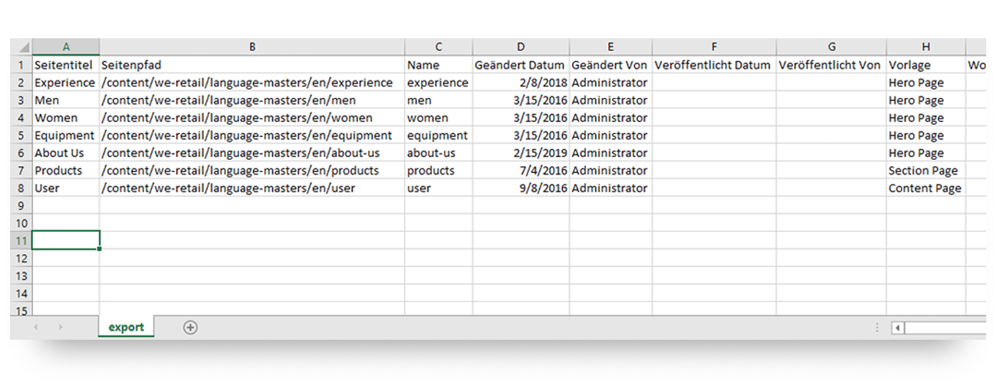
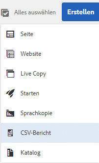
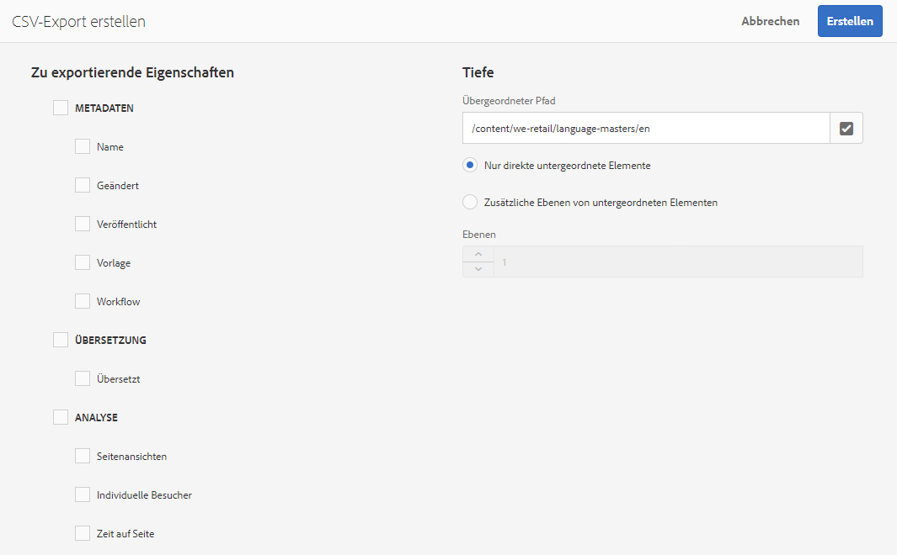

# Exportieren in CSV{#export-to-csv}

Mit **CSV-Bericht erstellen** können Sie Informationen über Ihre Seiten in eine CSV-Datei auf Ihrem lokalen System exportieren.

* Die heruntergeladene Datei erhält den Namen `export.csv`.
* Der Inhalt der Datei hängt davon ab, welche Eigenschaften Sie für den Export auswählen.
* Sie können den Pfad zusammen mit der Tiefe des Exports definieren.

>[!NOTE]
>
>Die Download-Funktion (und der Standard-Zielordner) Ihres Browsers werden verwendet.

Der Assistent zum **Erstellen von CSV**-Exporten bietet Ihnen folgende Auswahlmöglichkeiten:

* Zu exportierende Eigenschaften
   * Metadaten
      * Name
      * Geändert
      * Veröffentlicht
      * Vorlage
      * Workflow
   * Übersetzung
      * Übersetzt
   * Analyse
      * Seitenansichten
      * Individuelle Besucher
      * Zeit auf Seite
* Tiefe
   * Übergeordneter Pfad
   * Nur direkte untergeordnete Elemente
   * Zusätzliche Ebenen von untergeordneten Elementen
   * Ebenen

Die resultierende Datei `export.csv` kann in Excel (oder einer anderen kompatiblen Anwendung) geöffnet werden.

Die Option **CSV-Bericht erstellen** ist in der **Sites-Konsole** (in der Listenansicht) verfügbar: Sie finden die Option im Dropdown-Menü **Erstellen**:

So erstellen Sie einen CSV-Export:

1. Öffnen Sie die **Sites-Konsole** und wechseln Sie zum gewünschten Verzeichnis, falls erforderlich.
1. Wählen Sie in der Symbolleiste **Erstellen** und dann **CSV-Bericht** aus, um den Assistenten zu öffnen:

   

1. Wählen Sie die gewünschten Eigenschaften aus, die Sie exportieren möchten.
1. Wählen Sie **Erstellen**.
