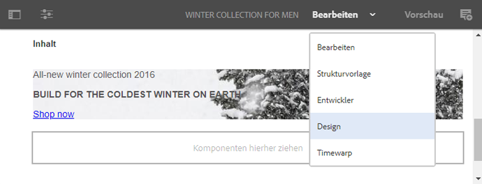
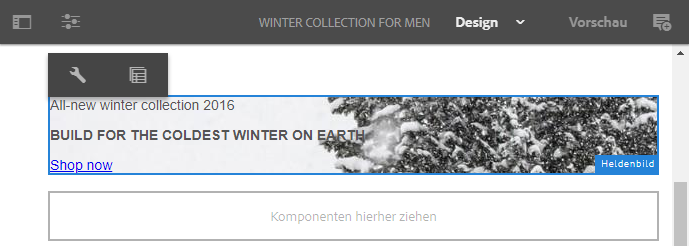
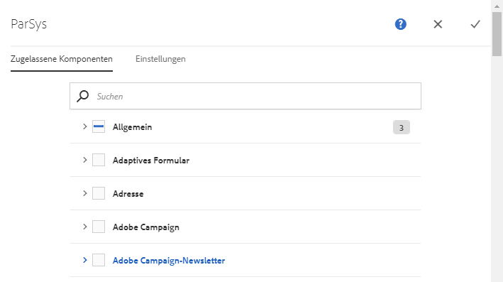
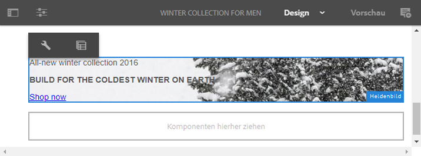
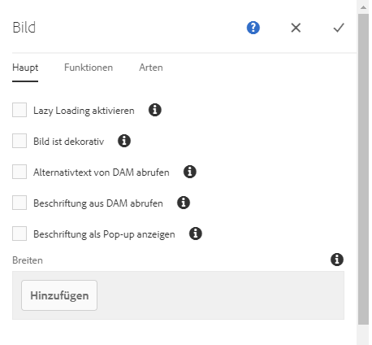
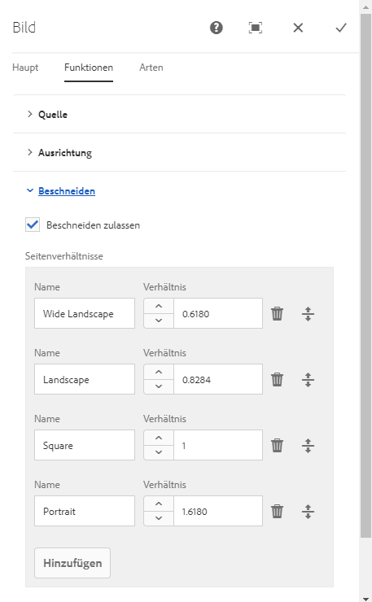

# Konfigurieren von Komponenten im Designmodus{#configuring-components-in-design-mode}

Wenn die AEM-Instanz direkt installiert wird, ist im Komponenten-Browser sofort eine Auswahl von Komponenten verfügbar.

Darüber hinaus sind auch verschiedene weitere Komponenten verfügbar. Mithilfe des [Designmodus](#enable-disable-components) können Sie diese Komponenten aktivieren bzw. deaktivieren. Wenn Sie den Designmodus aktivieren und sich auf der Seite befinden, können Sie damit [Aspekte des Komponentendesigns konfigurieren](#configuring-the-design-of-a-component), indem Sie die Attributparameter bearbeiten.

>[!NOTE]
>
>Bei der Bearbeitung dieser Komponenten ist Vorsicht geboten. Die Designeinstellungen sind häufig ein wesentlicher Bestandteil des Designs der gesamten Website. Daher sollten sie nur von einer Person mit den entsprechenden Berechtigungen (und der erforderlichen Erfahrung) geändert werden (meist ein Administrator oder Entwickler). Weitere Informationen finden Sie unter [Entwicklung von Komponenten](/help/sites-developing/components.md).

>[!NOTE]
>
>Der Designmodus steht nur für statische Vorlagen zur Verfügung. Vorlagen, die mit bearbeitbaren Vorlagen erstellt werden, sollten mithilfe des [Vorlagen-Editors](/help/sites-authoring/templates.md) bearbeitet werden.

>[!NOTE]
>
>Der Designmodus ist nur für Designkonfigurationen verfügbar, die als Inhalt unter ( `/etc`) gespeichert werden.
>
>Ab AEM 6.4 wird empfohlen, Entwürfe als Konfigurationsdaten unter `/apps` zu speichern, um kontinuierliche Bereitstellungsszenarien zu unterstützen. Entwürfe, die unter `/apps` gespeichert werden, können zur Laufzeit nicht bearbeitet werden, und der Designmodus steht Nichtadministratoren für solche Vorlagen nicht zur Verfügung.

Dazu müssen die zulässigen Komponenten im Absatzsystem für die Seite hinzugefügt oder entfernt werden. Das Absatzsystem (`parsys`) ist eine zusammengesetzte Komponente, die alle anderen Absatzkomponenten enthält. Mit dem Absatzsystem können Autoren Komponenten unterschiedlicher Typen zu einer Seite hinzufügen, da es alle anderen Absatzkomponenten enthält. Jeder Absatztyp wird als eine Komponente dargestellt.

Der Inhalt einer Produktseite kann beispielsweise ein Absatzsystem mit Folgendem enthalten:

* Ein Bild des Produkts (in Form eines image- oder textimage-Absatzes)
* Die Produktbeschreibung (als text-Absatz)
* Eine Tabelle mit technischen Daten (als table-Absatz)
* Ein Formular, das Benutzer ausfüllen (als forms begin-, forms element- und forms end-Absatz)

>[!NOTE]
>
>Unter [Entwicklung von Komponenten](/help/sites-developing/components.md) und [Richtlinien für die Verwendung von Vorlagen und Komponenten](/help/sites-developing/dev-guidelines-bestpractices.md#guidelines-for-using-templates-and-components) finden Sie weitere Informationen zu `parsys`.

>[!CAUTION]
>
>Bearbeiten des Designs im Designmodus wie in diesem Artikel beschrieben ist die empfohlene Vorgehensweise zum Definieren von Designs statischer Vorlagen
>
>Das Ändern von Designs in CRX DE ist beispielsweise nicht ratsam und die Anwendung derartiger Designs kann von erwarteten Verhaltensweisen abweichen. Weitere Informationen finden Sie im Entwicklerdokument [Seitenvorlagen – statisch](/help/sites-developing/page-templates-static.md#how-template-designs-are-applied).

## Aktivieren/Deaktivieren von Komponenten {#enable-disable-components}

So aktivieren oder deaktivieren Sie eine Komponente:

1. Wechseln Sie in den **Designmodus**.

   

1. Tippen oder klicken Sie auf eine Komponente. Diese Komponente wird mit einem blauen Rahmen versehen, wenn sie ausgewählt wird.

   

1. Klicken Sie auf das Symbol **Übergeordnetes Element** oder tippen Sie darauf.

   

   Dadurch wird das Absatzsystem mit der aktuellen Komponente ausgewählt.

1. Das Symbol **Konfigurieren** für das Absatzsystem wird in der Aktionsleiste für das übergeordnete Element angezeigt.

   

   Wählen Sie dieses Symbol, um das Dialogfeld anzuzeigen.

1. Legen Sie in diesem Dialogfeld fest, welche Komponenten im Komponenten-Browser verfügbar sein sollen, wenn die aktuelle Seite bearbeitet wird.

   

   Das Dialogfeld weist zwei Registerkarten auf:

   * Zugelassene Komponenten
   * Einstellungen

   **Zugelassene Komponenten**

   Auf der Registerkarte **Zulässige Komponenten** legen Sie fest, welche Komponenten für die Parsen verfügbar sind.

   * Die Komponenten werden anhand ihrer Komponentengruppen gruppiert, die sich ein- und ausblenden lassen.
   * Eine gesamte Gruppe kann durch Aktivieren des Gruppennamens ausgewählt werden und die Auswahl kann durch Deaktivieren aufgehoben werden.
   * Ein Minuszeichen zeigt an, dass mindestens eines, aber nicht alle Elemente in einer Gruppe ausgewählt sind.
   * Eine Suche zum Filtern einer Komponente nach Name ist verfügbar.
   * Die rechts neben dem Namen der Komponentengruppe aufgelisteten Werte stellen die Gesamtanzahl der ausgewählten Komponenten in diesen Gruppen dar (unabhängig vom Filter).

   Die Konfiguration wird pro Seitenkomponente definiert. Wenn untergeordnete Seiten dieselbe Vorlage und/oder Seitenkomponente verwenden (normalerweise ausgerichtet), wird dieselbe Konfiguration auf das zugehörige Absatzsystem angewendet.

   >[!NOTE]
   >
   >Adaptive Formularkomponenten sind so konzipiert, dass sie innerhalb von Adaptive Form Container verwendet werden können, um das Forms-Ökosystem zu nutzen. Entsprechend dürfen diese Komponenten nur im Editor für adaptive Formulare verwendet werden und funktionieren nicht im Seiten-Editor von Sites.

   **Einstellungen**

   Auf der Registerkarte **Einstellungen** können Sie zusätzliche Optionen festlegen und beispielsweise für jede Komponente einen Anker zeichnen oder den Textabstand für die einzelnen Container definieren.

1. Wählen Sie **Fertig** aus, um die Konfiguration zu speichern.

## Konfigurieren des Entwurfs einer Komponente {#configuring-the-design-of-a-component}

1. Wechseln Sie in den **Designmodus**.

   

1. Tippen oder klicken Sie auf eine Komponente mit einem blauen Rahmen In diesem Beispiel wird eine Hero-Image-Komponente ausgewählt.

   

1. Öffnen Sie das Dialogfeld, indem Sie das Symbol **Konfigurieren** verwenden.

   

   Im Designdialogfeld können Sie die Komponente entsprechend den verfügbaren Designparametern konfigurieren.

   

   Das Dialogfeld hat drei Registerkarten:

   * Allgemein
   * Funktionen
   * Stile

   **Eigenschaften**

   Auf der Registerkarte **Eigenschaften** können Sie die wichtigen Entwurfsparameter der Komponente konfigurieren. Beispielsweise können Sie für eine Bildkomponente die maximal und minimal zulässige Größe des Bildes festlegen.

   **Funktionen**

   Auf der Registerkarte **Funktionen** können Sie zusätzliche Eigenschaften einer Komponente aktivieren oder deaktivieren. Beispielsweise können Sie für eine Bildkomponente die Ausrichtung des Bildes und die verfügbaren Beschneidungsoptionen definieren und festlegen, ob ein Bild hochgeladen werden kann.

   **Stile**

   Mit der Registerkarte **Stile** können Sie die mit der Komponente zu verwendenden CSS-Klassen und -Stile definieren.

   

   Mit der Schaltfläche **Hinzufügen** können Sie zusätzliche Einträge zu einer Dialogfeldliste mit mehreren Einträgen hinzufügen.

   

   Verwenden Sie das Symbol** Löschen **um einen Eintrag aus einer Liste mit mehreren Einträgen zu entfernen.

   

   Verwenden Sie das Symbol **Verschieben**, um die Reihenfolge der Einträge in einer Dialogfeldliste mit mehreren Einträgen zu ändern.

   

1. Klicken oder tippen Sie auf das Symbol **Fertig**, um Ihre Änderungen zu speichern und das Dialogfeld zu schließen.

