# Foundation-Komponenten {#foundation-components}

>[!CAUTION]
>
>Die meisten Foundation-Komponenten sind jetzt mit AEM 6.5 veraltet. Weitere Informationen finden Sie in den [Versionshinweisen](/help/release-notes/deprecated-removed-features.md).
>
>Adobe empfiehlt die Nutzung der modern und erweiterbaren [Kernkomponenten](https://docs.adobe.com/content/help/de-DE/experience-manager-core-components/using/introduction.html) in AEM-Projekten. Diese sind Teil von [We.Retail-Beispielinhalt](/help/sites-developing/we-retail.md) und können auch [separat installiert und von Ihrem Administrator für die Entwicklung](https://docs.adobe.com/content/help/de-DE/experience-manager-core-components/using/get-started/using.html) verwendet werden.
>
>Sie können die [AEM Tools Suite modernisieren](https://opensource.adobe.com/aem-modernize-tools/) verwenden, um Ihre auf Foundation-Komponenten basierende Site für die Verwendung der Kernkomponenten umzugestalten.

Die Foundation-Komponenten wurden für die Verwendung beim Bearbeiten von Inhalten für eine Standardwebseite entworfen. Sie bilden eine Teilmenge der für eine Standardinstallation von AEM verfügbaren Komponenten.

Einige sind sofort über den Komponenten-Browser verfügbar, andere sind auch über [den Designmodus](/help/sites-authoring/default-components-designmode.md) verfügbar (wenn die Seite auf einer statischen Vorlage basiert) oder [indem Sie die Vorlage](/help/sites-authoring/templates.md) bearbeiten (wenn die Seite auf einer bearbeitbaren Vorlage basiert).

Die Verwendung von Foundation-Komponenten wird unterstützt, sie sind jedoch mehrheitlich nicht mehr in AEM enthalten und wurden durch die Kernkomponenten ersetzt, die mehr Erweiterbarkeit und Flexibilität bieten.

>[!NOTE]
>
>In diesem Abschnitt werden nur Komponenten behandelt, die direkt nach einer Standardinstallation von AEM verfügbar sind.
>
>Abhängig von Ihrer Instanz besitzen Sie möglicherweise benutzerdefinierte Komponenten, die speziell für Ihre Anforderungen entwickelt wurden. Möglicherweise haben diese sogar denselben Namen wie die hier behandelten Komponenten.

Die Komponenten sind im Seiten-Editor auf dem seitlichen Bedienfeld der Registerkarte **Komponenten** verfügbar, wenn Sie eine [Seite bearbeiten](/help/sites-authoring/editing-content.md).

Sie können eine Komponente auswählen und an die gewünschte Stelle auf Ihrer Seite ziehen. Danach können Sie sie wie folgt bearbeiten:

* [Eigenschaften konfigurieren](/help/sites-authoring/editing-page-properties.md)
* [Inhalt bearbeiten](/help/sites-authoring/editing-content.md)

* [Inhalt bearbeiten - Vollbildmodus](/help/sites-authoring/editing-content.md#edit-content-full-screen-mode)

Die Komponenten sind nach verschiedenen Kategorien (Komponentengruppen) sortiert. Diese umfassen:

* [Allgemein](#general): Enthält grundlegende Komponenten wie Text, Bilder, Tabellen und Diagramme.
* [Spalten](#columns): Enthält Komponenten, die für die Gestaltung des Inhalts-Layouts benötigt werden.
* [Formular](#formgroup): Enthält alle für das Erstellen eines Formulars benötigten Komponenten.

## Allgemein {#general}

Die allgemeinen Komponenten sind die grundlegenden Komponenten, mit denen Sie Inhalte erstellen.

### Kontoelement {#account-item}

>[!CAUTION]
>
>Diese Foundation-Komponente ist veraltet. Adobe empfiehlt stattdessen die Verwendung der [Kernkomponenten](https://docs.adobe.com/content/help/en/experience-manager-core-components/using/introduction.html). 

Sie können einen Link mit Titel und Beschreibung definieren.

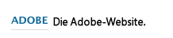

### Adaptives Bild {#adaptive-image}

>[!CAUTION]
>
>Diese Foundation-Komponente ist veraltet. Adobe empfiehlt stattdessen die Verwendung der [Kernkomponente „Bild“](https://docs.adobe.com/content/help/de-DE/experience-manager-core-components/using/components/image.html). 

Die Komponente der Adaptive Image Foundation erzeugt Bilder, die in das Fenster eingepasst werden, in dem die Webseite geöffnet wird. Um die Komponente zu verwenden, geben Sie eine Bildressource entweder im Dateisystem oder im DAM an. Wenn die Webseite geöffnet wird, lädt der Webbrowser eine Kopie des Bildes herunter, die so in der Größe angepasst wurde, dass sie in das aktuelle Fenster passt.

Die Größe des Fensters kann anhand der folgenden Eigenschaften bestimmt werden:

* Gerätedisplay: Auf Mobilgeräten werden Webseiten im Allgemeinen so angezeigt, dass das komplette Display ausgefüllt ist.
* Fenstergröße des Webbrowsers: Benutzer von Laptops und Desktop-Computern können die Größe von Webbrowser-Fenstern anpassen.

Die Komponente erzeugt zum Beispiel ein kleines Bild, wenn die Webseite auf einem Mobiltelefon geöffnet wird, und ein mittelgroßes Bild, wenn sie auf einem Tablet geöffnet wird. Auf einem Laptop erzeugt die Komponente ein großes Bild, wenn die Seite in einem maximierten Webbrowser geöffnet wird. Wenn der Webbrowser so angepasst wird, dass er nur noch einen Teil des Bildschirms ausfüllt, passt die Komponente das Bild in der Größe an und aktualisiert die Ansicht.

#### Unterstützte Bildformate {#supported-image-formats}

Sie können Bilddateien mit den folgenden Dateinamenerweiterungen mit der Adaptive Image-Komponente verwenden:

* .jpg
* .jpeg
* .png
* .gif **

>[!CAUTION]
>
>Animierte GIF-Dateien werden in AEM für adaptive Darstellungen nicht unterstützt.

#### Bildgrößen und Qualität {#images-sizes-and-quality}

In der folgenden Tabelle wird die Breite des Bildes aufgeführt, die für die jeweilige Anzeigebreite erzeugt wird. Die Höhe des erzeugten Bildes wird so berechnet, dass ein konstantes Seitenverhältnis erhalten bleibt und innerhalb des Bildrandes keine weißen Bereiche auftreten. Zur Vermeidung weißer Bereiche kann das Bild beschnitten werden.

Wenn es sich bei dem Bild um ein JPEG-Bild handelt, kann die Anzeigegröße sich auch auf die JPEG-Qualität auswirken. Die folgenden JPEG-Qualitäten sind möglich:

* Niedrig (0,42)
* Mittel (0,82)
* Hoch (1,00)

| **Breitenbereich für die Anzeige (Pixel)** | **Bildbreite (Pixel)** | **JPEG-Qualität** | **Ziel-Gerätetyp** |
|---|---|---|---|
| Breite &lt;= 319 | 320 | niedrig |  |
| Breite = 320 | 320 | mittel | Smartphone (Hochformat) |
| 320 &lt; Breite &lt; 481 | 480 | mittel | Smartphone (Querformat) |
| 480 &lt; Breite &lt; 769 | 476 | hoch | Tablet (Hochformat) |
| 768 &lt; Breite &lt; 1025 | 620 | hoch | Tablet (Querformat) |
| Breite &lt;= 1025 | komplett (Originalgröße) | hoch | Desktop |

#### Eigenschaften {#properties}

Das Dialogfeld erlaubt das Bearbeiten der Eigenschaften Ihrer Instanz der adaptiven Bildkomponente, von denen viele mit denen der Bild-Komponente übereinstimmen, auf der sie basieren. Die Eigenschaften werden auf zwei Registerkarten angezeigt:

* **Bild**

   * **Bild**
Ziehen Sie ein Bild aus dem Content Finder oder klicken Sie, um ein Browserfenster zu öffnen, in dem Sie ein Bild laden können. Nachdem das Bild geladen wurde, können Sie es beschneiden, drehen oder löschen. Verwenden Sie den Regler unter dem Bild (und über den Schaltflächen „OK“ und „Abbrechen“), um das Bild ein- und auszuzoomen.

   * **Beschneiden**
Beschneidet ein Bild. Ziehen Sie den Rahmen, um das Bild zu beschneiden.

   * **Drehen**
Klicken Sie mehrfach auf „Drehen“, bis das Bild in die gewünschte Ausrichtung gedreht ist.

   * **Entfernen**
Damit entfernen Sie das aktuelle Bild.

* **Erweitert**

   * **Titel**
Die Adaptive Image-Komponente nutzt diese Eigenschaft nicht.

   * **Alt-Text**
Der alternative Text für das Bild.

   * **Verknüpfung zu**
Die Adaptive Image-Komponente nutzt diese Eigenschaft nicht.

   * **Beschreibung**
Die Adaptive Image-Komponente nutzt diese Eigenschaft nicht.

#### Vergrößern der Adaptive Image-Komponente {#extending-the-adaptive-image-component}

Informationen zum Anpassen der Adaptive Image-Komponente finden Sie unter [Die Adaptive Image-Komponente](/help/sites-developing/responsive.md#using-adaptive-images).

### Karussell {#carousel}

>[!CAUTION]
>
>Diese Foundation-Komponente ist veraltet. Adobe empfiehlt stattdessen die Verwendung der [Kernkomponente „Karussell“](https://docs.adobe.com/content/help/de-DE/experience-manager-core-components/using/components/carousel.html). 

Mit der Karussell-Komponente können Sie Bilder anzeigen, die einzelnen Seiten zugeordnet sind:

* jeweils eines
* für eine kurze Zeit
* in einer von Ihnen festgelegten Reihenfolge
* mit einer von Ihnen festgelegten Zeitverzögerung

Mit klickbaren Steuerelementen können Benutzer bei Bedarf auch in Echtzeit durch die angezeigten Seiten gehen. Durch das Klicken auf das gegenwärtig sichtbare Seitenbild wechseln Sie zu dieser Seite. Anders ausgedrückt, das Karussell dient als Navigationssteuerung.

#### Eigenschaften {#properties-1}

Die Eigenschaften werden auf zwei Registerkarten angezeigt:

* **Karussell**
Hier geben Sie an wie das Karussell arbeitet:

   * Abspielgeschwindigkeit
Die Zeit in Millisekunden bis zur Anzeige des nächsten Dias.
   * Übergangszeit
Die Zeit in Millisekunden für den Übergang zwischen zwei Bildern.
   * Steuerelemente-Stil
Über ein Pulldown-Menü sind verschiedene Optionen verfügbar: z. B. Zurück-/Weiter-Schaltflächen, Schalter oben rechts.

* **Liste**

   Hier geben Sie an, wie Seiten in Ihr Karussell aufgenommen werden:

   * **Liste erstellen mittels**
Eine Seitenliste kann auf verschiedene Arten erstellt werden - „Untergeordnete Seiten“, „Liste fester Werte“ oder „Erweiterte Suche“ (alle unten beschrieben).
Beachten Sie, dass, unabhängig von der ausgewählten Methode, den Seiten, die Sie Ihrer Liste hinzufügen, bereits ein Bild zugeordnet worden sein muss. Dieses Bild wird dann im Karussell angezeigt. Wenn in den Seiteneigenschaften einer bestimmten Seite kein Bild vorhanden ist, sollten Sie der Seite ein Bild zuordnen, bevor Sie anfangen. Anderenfalls wird im Karussell eine leere (oder fast leere) Seite angezeigt Siehe [Bearbeiten der Seiteneigenschaften](/help/sites-authoring/editing-page-properties.md).
Abhängig von dem von Ihnen ausgewählten Element wird ein neues Fenster geöffnet:

      * **Optionen für untergeordnete Seiten**

         * **Übergeordnete Seite**
Geben Sie den Pfad entweder manuell oder mithilfe der Auswahl an. Wenn Sie nichts angeben, wird die aktuelle Seite als übergeordnete Seite verwendet.
      * **Optionen für Liste fester Werte**

         * **Seiten**
Wählen Sie eine Liste von Seiten aus. Verwendung 
`+` , um weitere Einträge und die Nach-oben-/Nach-unten-Schaltflächen hinzuzufügen, um die Reihenfolge anzupassen.
      * **Optionen für die Suche**

         * **Starten in**
Geben Sie einen Startpfad ein - manuell oder über die Auswahl.

         * **Suchanfrage**
Sie können eine Textsuchanfrage eingeben.
      * **Optionen für die erweiterte Suche**

         * **Querybuilder-Eigenschafts-Notation**
Geben Sie mit der Querybuilder-Eigenschafts-Notation eine Suchanfrage ein. Sie können beispielsweise „fulltext=Marketing“ eingeben, um alle Seiten, deren Inhalt das Wort „Marketing“ enthält, in Ihrem Karussell anzuzeigen.
Unter [QueryBuilder API](/help/sites-developing/querybuilder-api.md) finden Sie eine umfassende Übersicht über Abfrageausdrücke sowie weitere Beispiele.
   * **Reihenfolge**
nach Auswahl 
`jcr:title`,  `jcr:created`,  `cq:lastModified`oder  `cq:template` aus dem Dropdown-Menü.

   * **Begrenzung**
Die maximale Anzahl der Elemente, die Sie im Karussell verwenden möchten (optional).


>[!NOTE]
>
>Sie können eine individuelle Karussell-Komponente für Adobe Experience Manager erstellen, in der die im AEM DAM vorhandenen digitalen Assets angezeigt werden. Weitere Informationen finden Sie im Beitrag zum [Erstellen von benutzerdefinierten Karussellkomponenten für Adobe Experience Manager](https://helpx.adobe.com/experience-manager/using/custom-carousel-components.html).

### Diagramm  {#chart}

>[!CAUTION]
>
>Diese Foundation-Komponente ist veraltet. Adobe empfiehlt stattdessen die Verwendung der [Kernkomponenten](https://docs.adobe.com/content/help/en/experience-manager-core-components/using/introduction.html). 

Mit der Komponente „Diagramm“ können Sie ein Balken-, Linien- oder Tortendiagramm hinzufügen. AEM erstellt aus den von Ihnen zur Verfügung gestellten Daten ein Diagramm. Die Daten geben Sie direkt auf der Registerkarte „Daten“ ein oder fügen sie durch Kopieren aus einer Tabelle ein.

* **Daten**

   * **Diagrammdaten**
Geben Sie die Diagrammdaten im CSV-Format ein; das CSV-Format (kommagetrennte Werte) verwendet ein Komma (,) als Feldtrennzeichen.

* **Erweitert**

   * **Diagrammtyp**
Wählen Sie ein Torten-, Linien- oder Balkendiagramm aus.

   * **Alternativtext**
Alternativer Text, der anstelle des Diagramms angezeigt wird.

   * **Breite**
Breite des Diagramms in Pixel.

   * **Höhe**
Höhe des Diagramms in Pixel.

Im Folgenden sehen Sie ein Beispiel für Diagrammdaten und das daraus resultierende Balkendiagramm:

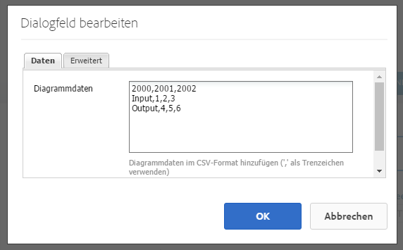 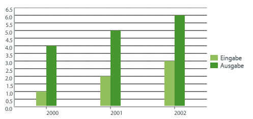

>[!NOTE]
>
>Sie können eine benutzerdefinierte Diagrammsteuerung für AEM erstellen, in der Daten aus dem AEM JCR angezeigt werden. Weitere Informationen finden Sie im Beitrag zum [Anzeigen von Adobe Experience Manager-Daten in einem Diagramm](https://helpx.adobe.com/experience-manager/using/displaying-experience-manager-data-chart.html).

### Inhaltsfragment {#content-fragment}

>[!CAUTION]
>
>Diese Foundation-Komponente ist veraltet. Adobe empfiehlt stattdessen die Verwendung der [Kernkomponente „Fragment“](https://docs.adobe.com/content/help/de/experience-manager-core-components/using/components/content-fragment-component.html). 

[Inhaltsfragmente](/help/sites-authoring/content-fragments.md) werden als seitenunabhängige Assets erstellt und verwaltet. Sie können diese Fragmente und ihre Varianten bei der Erstellung Ihrer Inhaltsseiten verwenden.

### Design-Import-Tool {#design-importer}

>[!CAUTION]
>
>Diese Foundation-Komponente ist veraltet. Adobe empfiehlt stattdessen die Verwendung der [Kernkomponenten](https://docs.adobe.com/content/help/en/experience-manager-core-components/using/introduction.html). 

Mit dem Design-Importtool können Sie eine ZIP-Datei mit einem Designpaket hochladen.

### Download {#download}

>[!CAUTION]
>
>Diese Foundation-Komponente ist veraltet. Adobe empfiehlt stattdessen die Verwendung der [Kernkomponenten](https://docs.adobe.com/content/help/en/experience-manager-core-components/using/introduction.html). 

Über die Download-Komponente wird auf der ausgewählten Webseite ein Link erstellt, über den eine spezifische Datei heruntergeladen werden kann. Sie können ein Asset entweder aus dem Content Finder ziehen oder eine Datei hochladen.

* **Download**

   * **Beschreibung**
Eine kurze Beschreibung, die mit dem Download-Link angezeigt wird.

   * **Datei**
Datei, die auf der aufgerufenen Website für den Download zur Verfügung steht. Ziehen Sie ein Asset aus dem Content Finder oder klicken Sie auf den Bereich, um die Datei hochzuladen, die zum Download zur Verfügung stehen soll.

Das folgende Beispiel zeigt die Download-Komponente in Geometrixx:


### Extern {#external}

>[!CAUTION]
>
>Diese Foundation-Komponente ist veraltet. Adobe empfiehlt stattdessen die Verwendung der [Kernkomponenten](https://docs.adobe.com/content/help/en/experience-manager-core-components/using/introduction.html). 

Die Komponente **Extern** ermöglicht es Ihnen, anhand von iframes externe Anwendungen in Ihre AEM-Seite einzubetten.

* **Extern**

   * **Zielgruppe**
applicationGeben Sie die URL der zu integrierenden Webanwendung an; Beispiel:

      ```
      https://en.wikipedia.org/wiki/Main_Page
      ```

   * **Parameter weiterleiten**
Aktivieren Sie das Kontrollkästchen für das Weiterleiten von Parametern an die Anwendung.

   * **Breite und Höhe
**Definieren der Größe des iframe

Die externe Anwendung wird in das Absatzsystem der AEM-Seite integriert. Beispiel: Wenn Sie als Zielanwendung `https://en.wikipedia.org/wiki/Main_Page` verwenden:


>[!NOTE]
>
>Abhängig von Ihrem Nutzungsszenario sind weitere Optionen für die Integration externer Anwendungen verfügbar, z. B.: die [Integration von Portlets](/help/sites-administering/aem-as-portal.md).

### Flash   {#flash}

>[!CAUTION]
>
>Diese Foundation-Komponente ist veraltet. Adobe empfiehlt stattdessen die Verwendung der [Kernkomponenten](https://docs.adobe.com/content/help/en/experience-manager-core-components/using/introduction.html). 

>[!CAUTION]
>
>Es wird nicht mehr erwartet, dass diese Komponente ohne umfangreiche Anpassungen auf Projektebene standardmäßig funktioniert.

Mithilfe der Flash-Komponente können Sie einen Flash-Film laden. Sie können ein Flash-Asset aus dem Content Finder auf die Komponente ziehen oder das folgende Dialogfeld verwenden:

* **Flash**

   * **Flash-Movie**

      Die Flash-Film-Datei. Ziehen Sie ein Asset aus dem Content Finder oder klicken Sie, um ein Browserfenster zu öffnen.

   * **Größe**

      Die Abmessungen des Anzeigebereichs für den Film in Pixel.

* **Alternativbild**

   Ein alternatives Bild, das angezeigt werden soll.

* **Erweitert**

   * **Kontextmenü**

      Gibt an, ob das Kontextmenü ein- oder ausgeblendet werden soll.

   * **Fenstermodus**

      Darstellung des Fensters, z B. deckend, transparent oder als klares (einfarbiges) Fenster.

   * **Hintergrundfarbe**

      Eine aus dem Farbdiagramm ausgewählte Hintergrundfarbe.

   * **Minimum-Version**

      Die zum Abspielen des Films erforderliche Mindestversion von Adobe Flash Player. Standard: 9.0.0.

   * **Attribute**

      Alle weiteren erforderlichen Attribute.

### Bild {#image}

>[!CAUTION]
>
>Diese Foundation-Komponente ist veraltet. Adobe empfiehlt stattdessen die Verwendung der [Kernkomponente „Bild“](https://docs.adobe.com/content/help/en/experience-manager-core-components/using/components/image.html). 

Die Bild-Komponente zeigt ein Bild und begleitenden Text gemäß den festgelegten Parametern an.

Sie können ein Bild hochladen und dieses anschließend bearbeiten und ändern (beispielsweise zuschneiden, drehen oder Links/Titel/Text hinzufügen).

Sie können ein Bild entweder aus dem [Asset-Browser](/help/sites-authoring/author-environment-tools.md#assets-browser) direkt auf die Komponente oder deren [Dialogfeld „Konfigurieren“](/help/sites-authoring/editing-content.md#component-edit-dialog) ziehen. Sie können auch ein Bild aus dem Dialogfeld „Konfigurieren“ hochladen. Dieses Dialogfeld steuert auch alle Definitionen und Bearbeitungen des Bildes:

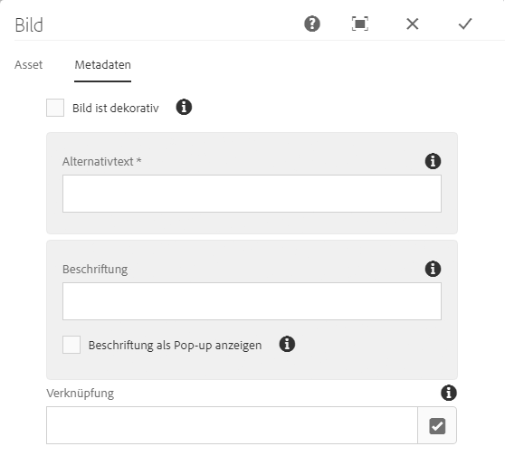

Nachdem das Bild hochgeladen wurde (und nicht vorher), können Sie es mit der [Direktbearbeitung](/help/sites-authoring/editing-content.md#edit-content) zuschneiden/drehen:


>[!NOTE]
>
>Der integrierte Editor zeigt bei der Bearbeitung die Originalgröße und das Seitenverhältnis des Bildes an. Sie können auch die Höhe und die Breite festlegen. Alle in den Eigenschaften definierten Beschränkungen der Größe und des Seitenverhältnisses werden angewendet, sobald Sie Ihre Änderungen speichern.
>
>Abhängig von Ihrer Instanz können Mindest- und Höchstbeschränkungen auch durch das [Design der Seite](/help/sites-developing/designer.md) vorgegeben sein. Diese werden bei der Implementierung des Projekts festgelegt.

Im Vollbildbearbeitungsmodus stehen verschiedene zusätzliche Optionen zur Verfügung, beispielsweise Karte und Zoom:


>[!NOTE]
>
>Der Upload-Fortschritt kann in Internet Explorer nicht verfolgt werden.
>
>Benutzer von Internet Explorer müssen das Bild hochladen und auf **OK** klicken und anschließend das Bild erneut öffnen, um die hochgeladene Datei in der Vorschau sehen und Änderungen (z. B. Zuschneiden) vornehmen zu können.
>
>Weitere Informationen zu den von AEM verwendeten HTML5-Funktionen finden Sie im Abschnitt [Zertifizierte Plattformen](/help/release-notes/release-notes.md#certifiedplatforms).

Wenn ein Bild geladen wird, können folgende Konfigurationen durchgeführt werden:

* **Map**

   Um ein Bild zuzuordnen, wählen Sie &quot;Map&quot;aus. Sie legen fest, wie die Imagemap (Rechteck, Polygon usw.) erstellt werden soll, und geben an, worauf der Bereich verweisen soll.

* **Zuschneiden**

   Wählen Sie &quot;Beschneiden&quot;, um ein Bild zu beschneiden. Verwenden Sie die Maus, um das Bild zuzuschneiden.

* **Drehen**

   Um ein Bild zu drehen, wählen Sie &quot;Drehen&quot;. Wiederholen Sie das Drehen so lange, bis das Bild die gewünschte Ausrichtung hat.

* **Entfernen**

   Damit entfernen Sie das aktuelle Bild.

* **Titel**

   Der Titel des Bildes.

* **ALT-Text**

   Ein alternativer Text, der beim Erstellen barrierefreier Inhalte verwendet wird.

* **Verknüpfung zu**

   Erstellen Sie einen Link zu Assets oder anderen Seiten Ihrer Website.

* **Beschreibung**

   Eine Beschreibung des Bildes.

* **Größe**

   Legt die Höhe und Breite des Bildes fest.

>[!NOTE]
>
>Einige Optionen sind nur im Vollbild-Bearbeitungsmodus verfügbar.

Das endgültige Bild (mit **Titel** und **Beschreibung**) sieht beispielsweise wie folgt aus:


### Layout-Container {#layout-container}

Diese Komponente liefert ein Rasterabsatzsystem, mit dem Sie Komponenten in einem [responsiven Raster](/help/sites-authoring/responsive-layout.md) hinzufügen und positionieren können. Damit können Sie verschiedene Inhaltslayouts definieren, die auf der Breite von Zielgeräten basieren, einschließlich für diverse Smartphones, Tablets und Desktops.

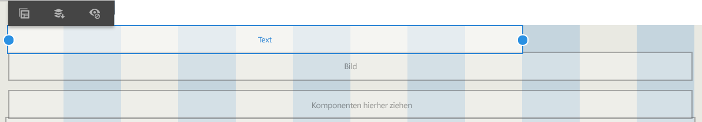

>[!NOTE]
>
>Diese Komponente ist mit [HTML Template Language (HTL)](https://docs.adobe.com/content/help/de-DE/experience-manager-htl/using/overview.html) implementiert.

### Liste {#list}

>[!CAUTION]
>
>Diese Foundation-Komponente ist veraltet. Adobe empfiehlt stattdessen die Verwendung der [Kernkomponente „Liste“](https://docs.adobe.com/content/help/de/experience-manager-core-components/using/components/list.html). 

Mit der Komponente „Liste“ können Sie Suchkriterien zur Anzeige einer Liste konfigurieren:

* **Liste**

   * **Liste erstellen mittels**

      Hier legen Sie fest, woher die Liste den Inhalt abruft. Es gibt verschiedene Methoden:

   * Abhängig von dem von Ihnen ausgewählten Element wird ein neues Fenster geöffnet:

      * **Optionen für untergeordnete Seiten**

         * **Untergeordnete Elemente**  (übergeordnete Seite)

            Geben Sie einen Pfad entweder manuell oder mithilfe der Auswahl an. Wenn Sie nichts angeben, wird die aktuelle Seite als übergeordnete Seite verwendet.
      * **Optionen für Liste fester Werte**

         * **Seiten**

            Wählen Sie eine Liste von Seiten aus. Fügen Sie mit + weitere Einträge hinzu und passen Sie mit den Schaltflächen nach oben und unten die Reihenfolge an.
      * **Optionen für die Suche**

         * Starten in

            Geben Sie einen Startpfad ein, entweder manuell oder mithilfe der Auswahl.

         * Suchanfrage

            Sie können eine Abfrage für die Textsuche eingeben.
      * **Optionen für die erweiterte Suche**

         * **Querybuilder-Eigenschafts-Notation**

            Sie können eine Abfrage mit der Querybuilder-Prädikatsschreibweise eingeben. Sie können beispielsweise „fulltext=Marketing“ eingeben, um alle Seiten, deren Inhalt das Wort „Marketing“ enthält, in Ihrem Karussell anzuzeigen.

            Unter [„QueryBuilder API“](/help/sites-developing/querybuilder-api.md) finden Sie eine umfassende Übersicht über Abfrageausdrücke sowie weitere Beispiele.
      * **Tags**

         Legen Sie die **übergeordnete Seite**, **Tags/Keywords** fest und gleichen Sie die Kriterien ab.
   * **Anzeigen als**

      Angabe, wie die Elemente aufgeführt werden sollen; umfasst Links, Teaser und Nachrichten.

   * **Sortieren nach**

      Gibt an, ob die Liste sortiert und nach welchen Kriterien sie sortiert sein soll. Sie können ein Kriterium eingeben oder eins aus der bereitgestellten Dropdown-Liste auswählen.

   * **Beschränkung**

      Legen Sie die maximale Anzahl an Elementen fest, die in der Liste angezeigt werden sollen.

   * **Feed aktivieren**

      Gibt an, ob für die Liste ein RSS-Feed aktiviert werden soll.

   * **Paginieren nach**

      Hier können Sie die Anzahl der Listenelemente festlegen, die gleichzeitig angezeigt werden sollen. Bei einer Liste mit mehr Elementen als festgelegt wird ein Seitenumbruch durchgeführt, um die Liste in mehrere Gruppen aufzuteilen.


Das folgende Beispiel zeigt eine **Listen-Komponente** auf die Art und Weise, wie eine Liste mit untergeordneten Seiten angezeigt werden würde, wobei das Layout durch die benutzerdefinierten CSS-Definitionen eines Site-Designs gesteuert wird.

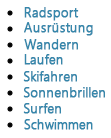

### Anmeldung {#login}

>[!CAUTION]
>
>Diese Foundation-Komponente ist veraltet. Adobe empfiehlt stattdessen die Verwendung der [Kernkomponenten](https://docs.adobe.com/content/help/en/experience-manager-core-components/using/introduction.html). 

>[!CAUTION]
>
>Es wird nicht mehr erwartet, dass diese Komponente ohne umfangreiche Anpassungen auf Projektebene standardmäßig funktioniert.

Stellt die Felder für den Benutzernamen und das Kennwort bereit.


Sie können Folgendes konfigurieren:

* Anmelden

   * Bereichsbeschriftung

      Interessententext für die Eingabefelder.

   * Benutzername-Beschriftung

      Text zur Beschriftung des Felds &quot;Benutzername&quot;.

   * Kennwortaufschrift

      Text zur Beschriftung des Kennwortfelds.

   * Beschriftung für Anmelde-Schaltfläche

      Text für die Anmelde-Schaltfläche.

   * Umleiten zu

      Sie können die Seite auf Ihrer Website angeben, die geöffnet werden soll, sobald sich der Benutzer angemeldet hat.

* Bereits angemeldet

   * Schaltflächenbeschriftung fortsetzen

      Text, der angibt, dass der Benutzer bereits angemeldet ist.

### Auftragsstatus {#order-status}

>[!CAUTION]
>
>Es wird nicht mehr erwartet, dass diese Komponente ohne umfangreiche Anpassungen auf Projektebene standardmäßig funktioniert.

* **Titel**

   * **Titel**

      Geben Sie den Titel an, der angezeigt werden soll.

   * **Verknüpfung**

      
Geben Sie die Seite (das Produkt) an, für das der Auftragsstatus angezeigt werden soll.

   * **Typ/Größe**

      Wählen Sie aus der bereitgestellten Auswahl aus.


### Verweis   {#reference}

>[!CAUTION]
>
>Diese Foundation-Komponente ist veraltet. Adobe empfiehlt stattdessen die Verwendung der [Kernkomponente „Fragment“](https://docs.adobe.com/content/help/en/experience-manager-core-components/using/components/content-fragment-component.html). 

Mit der Komponente **Verweis** können Sie auf Text in einem anderen Teil einer AEM-basierten Website (innerhalb der aktuellen Instanz) verweisen. Der Inhalt des referenzierten Absatzes wird dann so angezeigt, als wäre er auf der aktuellen Seite. Der Inhalt wird aktualisiert, wenn sich der Quellabsatz ändert (u. U. ist eine Seitenaktualisierung erforderlich).

* **Absatzverweis**

   * **Verweis**

      Geben Sie den Pfad zur Seite und zum Absatz an, auf den Sie verweisen möchten (einschließlich Inhalt).

Für den Pfad zu der Seite mit dem Absatz muss das folgende Suffix angegeben werden:

`.../jcr:content/par/<paragraph-ID>`

Beispiel:

`/content/geometrixx-outdoors/en/equipment/biking/cajamara/jcr:content/par/similar-products`

Anstatt auf einen bestimmten Absatz zu verweisen, kann der Pfad auch auf ein komplettes par-System verweisen. Hierzu muss der Pfad das folgenden Suffix erhalten:

`/jcr:content/par`

Beispiel:

`/content/geometrixx-outdoors/en/equipment/biking/cajamara/jcr:content/par`

Nach der Konfiguration wird der Inhalt exakt so angezeigt wie auf der Quellseite. Dass es sich um einen Verweis handelt, sehen Sie erst, wenn Sie die Komponente zur Bearbeitung öffnen:

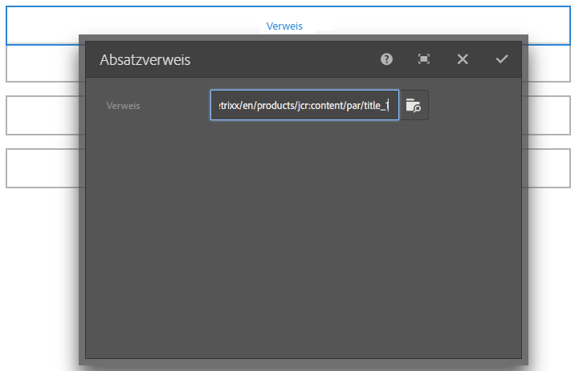

### Suche {#searching}

>[!CAUTION]
>
>Diese Foundation-Komponente ist veraltet. Adobe empfiehlt stattdessen die Verwendung der [Kernkomponente „Schnellsuche“](https://docs.adobe.com/content/help/de/experience-manager-core-components/using/components/quick-search.html). 

Die Komponente „Suche“ stellt für Ihre Seite eine Suchfunktion zur Verfügung.

Sie können Folgendes konfigurieren:

* Suchen

   * **Knotentypen**

      Wenn die Suche auf eine bestimmte Node-Typ-Liste beschränkt werden soll, können sie hier erfolgen. zum Beispiel `cq:Page`.

   * **Suchpfad**

      Geben Sie die Stammseite der Verzweigung an, die Sie suchen möchten.

   * **Text auf Such-Schaltfläche**

      Der auf der Suchschaltfläche tatsächlich angezeigte Name.

   * **Text für Statistiken**

      Der über den Suchergebnissen angezeigte Text.

   * **Text für Keine Ergebnisse**

      Wenn keine Ergebnisse vorliegen, wird der hier eingegebene Text angezeigt.

   * **Text für Rechtschreibprüfung**

      Wenn jemand einen ähnlichen Begriff eingibt, wird dieser Text vor dem Begriff angezeigt.
Wenn Sie beispielsweise „geometrixxe“ eingeben, zeigt das System „Meinten Sie: geometrixx?“ an.

   * **Text für Ähnliche Seiten**

      Der Text, der für ähnliche Seiten neben dem Ergebnis angezeigt wird. Klicken Sie auf diesen Link, um Seiten anzuzeigen, die ähnliche Inhalte haben.

   * **Text für Verwandte Suche**

      Der Text, der neben Suchen nach verwandten Begriffen und Themen angezeigt wird.

   * **Text für Such-Trends**

      Der Titel, der über den vom Benutzer eingegebenen Suchbegriffen angezeigt wird.

   * **Beschriftung: Ergebnisseiten**

      Der Text, der am Ende dieser Liste mit Links zu anderen Ergebnisseiten angezeigt wird.

   * **Beschriftung: Vorherige**

      Der Name, der für den Link zu vorherigen Suchseiten angezeigt wird.

   * **Beschriftung: Weiter**

      Der Name, der für den Link zu nachfolgenden Suchseiten angezeigt wird.

Das folgende Beispiel zeigt die Such-Komponente, nachdem im Stammverzeichnis der Standardinstallation das Wort *biking* gesucht wurde. Es zeigt außerdem die Paginierung der Ergebnisse:

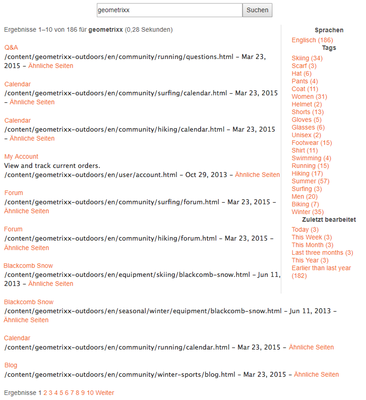

Das folgende Beispiel zeigt einen falsch geschriebenen und nicht verfügbaren Suchbegriff:


### Sitemap {#sitemap}

>[!CAUTION]
>
>Diese Foundation-Komponente ist veraltet. Adobe empfiehlt stattdessen die Verwendung der Hauptkomponenten [Navigation](https://docs.adobe.com/content/help/de/experience-manager-core-components/using/components/navigation.html), [Sprachnavigation](https://docs.adobe.com/content/help/de/experience-manager-core-components/using/components/language-navigation.html) und [Breadcrumb.](https://docs.adobe.com/content/help/de/experience-manager-core-components/using/components/breadcrumb.html)

Eine automatische Sitemap-Auflistung, in der (bei Standardeinstellungen) alle Seiten (als aktive Links) in der aktuellen Website aufgeführt werden: Beispiel:

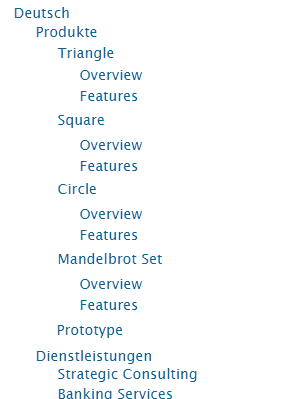

Sie können bei Bedarf Folgendes konfigurieren:

* **Sitemap**

   * **Stammverzeichnis**

      Pfad, von dem aus die Auflistung beginnen soll.

### Diashow  {#slideshow}

>[!CAUTION]
>
>Diese Foundation-Komponente ist veraltet. Adobe empfiehlt stattdessen die Verwendung der [Kernkomponente „Karussell“](https://experienceleague.adobe.com/docs/experience-manager-core-components/using/components/carousel.html). 

>[!CAUTION]
>
>Es wird nicht mehr erwartet, dass diese Komponente ohne umfangreiche Anpassungen auf Projektebene standardmäßig funktioniert.

Mit dieser Komponente können Sie mehrere Fotos laden, sodass sie als Diashow auf Ihrer Seite angezeigt werden. Sie können Bilder hinzufügen oder entfernen und jedem einen Titel zuweisen. Unter „Erweitert“ können Sie auch die Größe des Anzeigebereichs festlegen.

Sie können Folgendes konfigurieren:

* **Dias**

   * **Neue Folie**

      Sie können eine Auswahl von Folien mit den Schaltflächen **Hinzufügen** (und **Entfernen**) angeben.

   * **Titel**

      Geben Sie bei Bedarf einen Titel an. Dieser wird auf dem entsprechenden Dia überlagert.

* **Erweitert**

   * **Größe**

      Geben Sie die Breite und Höhe in Pixel an.

Die Bildschirmpräsentation-Komponente zeigt dann wiederholt die einzelnen Fotos der Reihe nach für kurze Zeit an und blendet zwischen diesen über:


### Tabelle {#table}

>[!CAUTION]
>
>Diese Foundation-Komponente ist veraltet. Adobe empfiehlt stattdessen die Verwendung der [Kernkomponente „Text“](https://docs.adobe.com/content/help/de-DE/experience-manager-core-components/using/components/text.html). 

>[!NOTE]
>
>Die Foundation-Komponente **Tabelle** basiert auf dem [Rich-Text-Editor](/help/sites-authoring/rich-text-editor.md) - genau wie die Foundation-Komponente **[Text](#text)**.

Die Komponente **Tabelle** ist so vorkonfiguriert, dass Sie damit eine Tabelle erstellen, ausfüllen und formatieren können. Im Dialogfeld können Sie Ihre Tabelle konfigurieren und die Inhalte wie folgt erstellen:

* Ganz neu
* Indem Sie ein Arbeitsblatt oder eine Tabelle aus einem externen Editor (wie Excel, OpenOffice, Editor usw.) kopieren und einfügen.

Mit dem Inline-Editor können Sie grundlegende Änderungen am Inhalt vornehmen:

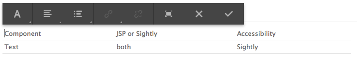

Im Vollbildmodus können Sie das Tabellenlayout konfigurieren:


Der folgende Screenshot zeigt ein Beispiel für den Einsatz der Tabellen-Komponente. Das Design wird durch das Site-spezifische CSS bestimmt:


### Tag-Cloud {#tag-cloud}

Eine Tag-Cloud zeigt eine grafisch dargestellte Auswahl der auf den Inhalt angewendeten Tags auf Ihrer Website:


Beim Konfigurieren der Tag-Cloud-Komponente können Sie Folgendes festlegen:

* **Tags für Anzeige**

   Ort, aus dem die anzuzeigenden Tags erfasst werden sollen. Wählen Sie dafür eine Seite, eine Seite mit allen untergeordneten Seiten oder alle Tags aus.

* **Seite**

   Wählen Sie die Seite aus, auf die verwiesen werden soll.

* **Keine Einschränkung bezüglich Tags**

   Ob die angezeigten Tags als Links fungieren sollen.

Weitere Informationen zur Verwendung von Tags finden Sie im Beitrag zum [Verwenden von Tags](/help/sites-authoring/tags.md).

### Text {#text}

>[!CAUTION]
>
>Diese Foundation-Komponente ist veraltet. Adobe empfiehlt stattdessen die Verwendung der [Kernkomponente „Text“](https://docs.adobe.com/content/help/en/experience-manager-core-components/using/components/text.html). 

>[!NOTE]
>
>Die Foundation-Komponente **Text** basiert auf dem [Rich-Text-Editor](/help/sites-authoring/rich-text-editor.md) - genau wie die Foundation-Komponente **Tabelle**.

Mit der Text-Komponente können Sie über einen WYSIWYG-Editor einen Textblock eingeben und die Funktionen nutzen, die der [Rich-Text-Editor](/help/sites-authoring/rich-text-editor.md) bereitstellt. Über mehrere Symbole können Sie den Text formatieren, darunter Schriftmerkmale, Ausrichtung, Links, Listen und Einzüge:

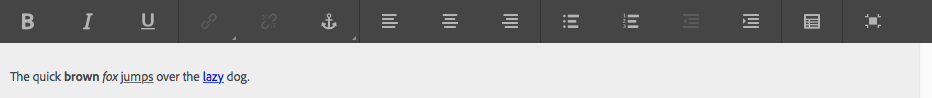

Wenn Sie das Dialogfeld **Konfigurieren** öffnen, können Sie auch Folgendes festlegen:

* **Abstand**
* **Textformat**

Der formatierte Text wird dann auf der Seite angezeigt, wobei das Design vom CSS der Site abhängt:


Weitere Informationen zur Text-Komponente und den vom Rich-Text-Editor bereitgestellten Funktionen finden Sie auf der Seite zum [Rich-Text-Editor.](/help/sites-authoring/rich-text-editor.md) 

#### Kontext-Bearbeitung {#inplace-editing}

Zusätzlich zu der Bearbeitung in Dialogfeldern durch den Rich-Text-Editor bietet AEM noch die Möglichkeit einer [Bearbeitung im Kontext](/help/sites-authoring/editing-content.md), bei der Sie den Text so bearbeiten, wie er im Layout der Seite erscheint.

### Text und Bild {#text-image}

>[!CAUTION]
>
>Diese Foundation-Komponente ist veraltet. Adobe empfiehlt stattdessen die Verwendung der [Kernkomponente „Bild“](https://docs.adobe.com/content/help/en/experience-manager-core-components/using/components/image.html) und [„Text“](https://docs.adobe.com/content/help/en/experience-manager-core-components/using/components/text.html).

Mit der Komponente „Text und Bild“ werden ein Textblock und ein Bild hinzugefügt. Außerdem können Sie Text und Bilder separat hinzufügen und bearbeiten. Einzelheiten hierzu finden Sie in den Beiträgen zu den Komponenten [Text](#text) und [Bild](#image).

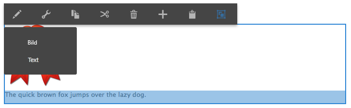

Sie können Folgendes konfigurieren:

* **Komponentenstile** (**Stile**)

   Mit dieser Option können Sie das Bild rechts- oder linksbündig ausrichten. Standardmäßig wird das Bild **linksbündig** ausgerichtet.

* **Bildeigenschaften** (**Erweiterte Bildeigenschaften**)

   Dies ermöglicht die Festlegung des Folgenden:

   * **Bild-Asset**

      Laden Sie das gewünschte Bild hoch.

   * **Titel**

      Der Titel des Blocks, der angezeigt wird, wenn Sie mit der Maus darauf zeigen.

   * **ALT-Text**

      Alternativer Text, der angezeigt wird, wenn das Bild nicht dargestellt werden kann. Wenn dies leer gelassen wird, wird der Titel verwendet.

   * **Verknüpfung zu**

      Geben Sie einen Pfad zur Zielgruppe an.

   * **Beschreibung**

      Eine Beschreibung des Bildes.

   * **Größe**

      Legt die Höhe und Breite des Bildes fest.

Das folgende Beispiel zeigt eine Text-Bild-Komponente, die das Bild linksbündig anzeigt:


### Titel {#title}

>[!CAUTION]
>
>Diese Foundation-Komponente ist veraltet. Adobe empfiehlt stattdessen die Verwendung der [Kernkomponente „Titel“](https://docs.adobe.com/content/help/en/experience-manager-core-components/using/components/list.html). 

Für die Titel-Komponente gilt Folgendes:

* Anzeige des Namens der aktuellen Seite, indem das Feld „Titel“ leer gelassen wird; oder
* Anzeige des Textes, der im Feld „Titel“ angegeben wurde.

Sie können Folgendes konfigurieren:

* **Titel**

   Wenn Sie einen anderen Namen als den Seitentitel verwenden möchten, geben Sie ihn hier ein.

* **Verknüpfung**

   Die URI, wenn der Titel als Link fungieren soll.

* **Typ/Größe**

   Wählen Sie aus der Dropdown-Liste die Option „Klein“ oder „Groß“. „Klein“ wird als Bild generiert. „Groß“ wird als Text generiert.

Das folgende Beispiel zeigt eine angezeigte **Titel**-Komponente; das Design wird durch das Site-spezifische CSS bestimmt.


### Video {#video}

>[!CAUTION]
>
>Diese Foundation-Komponente ist veraltet. Adobe empfiehlt stattdessen die Verwendung der [Kernkomponenten-Einbettungskomponente](https://experienceleague.adobe.com/docs/experience-manager-core-components/using/components/embed.html).

>[!CAUTION]
>
>Es wird nicht mehr erwartet, dass diese Komponente ohne umfangreiche Anpassungen auf Projektebene standardmäßig funktioniert.

Mit der **Video-Komponente** können Sie ein vordefiniertes und vorgefertigtes Videoelement auf einer Seite platzieren.

Sie können auch HTML5-Elemente verwenden. Einzelheiten hierzu finden Sie unter [Konfigurieren von Videoprofilen](/help/sites-administering/config-video.md#configuringvideoprofiles).

Nachdem Sie eine Instanz der Komponente auf Ihrer Seite platziert haben, können Sie Folgendes konfigurieren:

* Video

   * **Video-Asset**

      Laden Sie das Video-Asset hoch oder legen Sie es ab.

   * **Größe**

      Die systemeigene Größe des Videos (Breite x Höhe in Pixel) wird in den Feldern neben der Größe angezeigt (siehe oben). Geben Sie die Breite und Höhe hier manuell ein, wenn Sie die systemeigenen Abmessungen des Videos überschreiben möchten. Klicken Sie auf **OK**, um das Dialogfeld zu schließen.

>[!NOTE]
>
>Unterstützte Formate:
>
>* `.mp4`
>* `Ogg`
>* `FLV` (Flash-Video)


## Columns {#columns}

Das Layout des Inhalts in AEM wird über Spalten gesteuert. In einer Standardinstallation stehen Komponenten zum Erstellen von zwei und/oder drei Spalten bereit.

Das folgende Beispiel zeigt die Verwendung der 2-Spalten-Komponente. Sie können die Platzhalter für neue Komponenten verwenden:

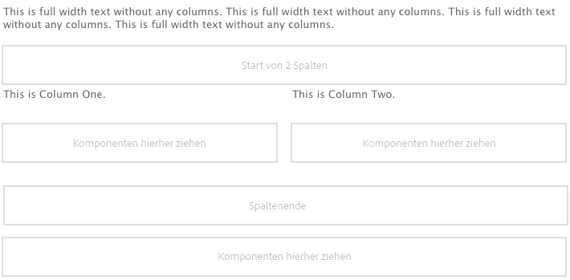

### 2 Spalten {#columns-1}

Eine Spalten-Steuerung-Komponente mit standardmäßig 2 gleich großen Spalten.

### 3 Spalten  {#columns-2}

Eine Spalten-Steuerung-Komponente mit standardmäßig 3 gleich großen Spalten.

### Spalten-Steuerung {#column-control}

Mit der Spalten-Steuerung-Komponente können Benutzer auswählen, wie sie den Inhalt des Hauptbereichs der Website in mehrere Spalten aufteilen möchten. Benutzer wählen die Anzahl der erforderlichen Spalten aus einer vordefinierten Liste aus und erstellen, löschen und verschieben dann den Inhalt in den einzelnen Spalten.

* **Spalten-Steuerung**

   * **Spalten-Layout**

      Wählen Sie die Anzahl der Spalten aus, die dargestellt werden sollen. Nach der Erstellung verfügt jede Spalte über einen eigenen Link, um Inhalt hinzuzufügen, indem Komponenten oder Assets dorthin gezogen werden.

## Formular  {#form}

>[!CAUTION]
>
>Der Foundation-Komponente aus Komponenten wird nicht mehr unterstützt. Adobe empfiehlt stattdessen die Verwendung der [Kernkomponenten](https://docs.adobe.com/content/help/en/experience-manager-core-components/using/introduction.html). 

Mit Formular-Komponenten können Sie Formulare erstellen, damit Besucher Eingaben vornehmen können. Formulare und Formular-Komponenten können dazu genutzt werden, Informationen, einschließlich Benutzer-Feedback (z. B. ein Fragebogen zur Kundenzufriedenheit), und Benutzerinformationen (z. B. Benutzerregistrierung) zu sammeln.

>[!NOTE]
>
>Weitere Informationen zu AEM Forms finden Sie in der [AEM Forms-Hilfe](/help/forms/home.md).

Formulare bestehen aus mehreren verschiedenen Komponenten:

* **Form**

   Die Formular-Komponente definiert den Beginn und das Ende eines neuen Formulars auf einer Seite. Andere Komponenten können dann zwischen diesen Elementen eingefügt werden, z.&amp;nbsp;B. Tabellen, Downloads usw.

* **Formularfelder und -elemente**

   Formularfelder und -elemente können Textfelder, Optionsschaltflächen, Bilder usw. umfassen. Der Benutzer führt oft eine Aktion in einem Formularfeld aus, z.&amp;nbsp;B. Eingabe von Text. Unter den Abschnitten für die einzelnen Formularelemente finden Sie weitere Informationen.

* **Profilkomponenten**

   Profilkomponenten beziehen sich auf Besucherprofile, die für die soziale Zusammenarbeit und andere Bereiche verwendet werden, für die eine Personalisierung erforderlich ist.

Das folgende Beispiel zeigt ein Beispielformular. Es besteht aus der **Formular-Komponente** (Start und Ende) und umfasst zwei **Formular****textfelder** für eine Eingabe sowie ein **allgemeines** **Textfeld** für einführenden Text und eine **Senden**-Schaltfläche.

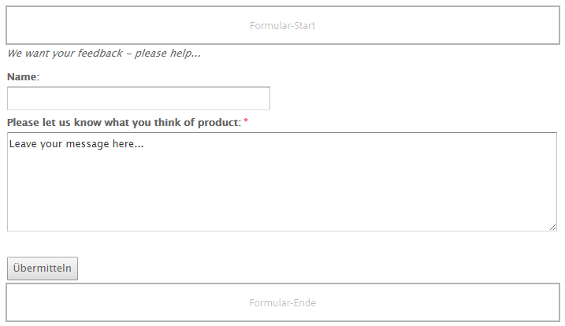

>[!NOTE]
>
>Informationen dazu, wie Sie Ihre Formulare weiter entwickeln und anpassen können, finden Sie auf der Seite zum [Entwickeln von Formularen](/help/sites-developing/developing-forms.md). Dies betrifft das Hinzufügen von Aktionen und Beschränkungen, das Vorabladen von Feldern und die Verwendung von Scripts, um z. B. einen Service aufzurufen, der eine Aktion ausführt.

### Gemeinsame Einstellungen vieler Formular-Komponenten {#settings-common-to-many-form-components}

Zwar dient jede Formular-Komponente einem anderen Zweck, viele enthalten jedoch ähnliche Optionen und Parameter.

Wenn Sie eine beliebige Formular-Komponente konfigurieren, sind im Dialogfeld die folgenden Registerkarten verfügbar:

* **Titel und Text**

   Hier müssen Sie grundlegende Informationen angeben, wie Titel des Formulars und begleitenden Text. Gegebenenfalls können Sie hier auch andere Schlüsselinformationen definieren, z. B. ob für das Feld mehrere Auswahlen möglich sind und welche Elemente ausgewählt werden können.

* **Anfangswerte**

   Ermöglicht Ihnen das Festlegen eines Standardwerts.

* **Einschränkungen**

   Hier können Sie angeben, ob ein Feld erforderlich ist, und diese Beschränkungen für dieses Feld platzieren (z.&amp;nbsp;B. ob nur numerische Werte zulässig sind).

* **Stile**

   Gibt die Größe und den Stil der Felder an.

>[!NOTE]
>
>Die angezeigten Felder können je nach Komponente sehr unterschiedlich sein.

Diese Registerkarten stellen die erforderlichen Parameter bereit. Diese können vom Typ der einzelnen Komponenten abhängen, können jedoch Folgendes enthalten:

* **Titel und Text**

   * **Elementname**

      Name des Formularelements. Gibt an, wo im Repository die Daten gespeichert werden.
Dies ist ein erforderliches Feld und sollte nur die folgenden Zeichen enthalten:

      * alphanumerische Zeichen
      * `_ . / : -`
   * **Titel**

      Der Titel wird mit dem Feld angezeigt. Wenn dies leer gelassen wird, wird der Standardtitel angezeigt.

   * **Beschreibung**

      Bietet Ihnen die Möglichkeit, bei Bedarf weitere Informationen für den Benutzer anzugeben. Auf dem Formular werden diese unter dem Feld in kleinerer Schrift als der Titel angezeigt.

   * **Einblenden/ausblenden**

      Legt fest, ob das Feld sichtbar ist.


* **Anfangswerte**

   * **Standardwert**

      Die beim Öffnen des Formulars im Feld angezeigten Werte, also bevor der Benutzer seine Eingabe vornimmt.

* **Einschränkungen**

   * **Erforderlich**

      Dies hängt vom Formularkomponententyp ab, stellt jedoch ein oder mehrere Klickfelder bereit, um anzugeben, dass dieses Feld oder bestimmte Teile dieses Felds erforderlich sind/sind.

   * **Erforderliche Meldung**

      eine Meldung, die die Benutzer darüber informiert, dass dieses Feld erforderlich ist; Ein erforderliches Feld wird auch mit und mit Sternchen gekennzeichnet.

   * **Beschränkung**

      Die zur Auswahl verfügbaren Einschränkungen hängen vom Formularkomponententyp ab.

   * **Beschränkungsmeldung**

      Eine Meldung, die Benutzer darüber informiert, was erforderlich ist.

* **Stile**

   * **Größe**

      In Zeilen und Spalten.

   * **Breite**

      In Pixeln.

   * **CSS**

### Formular (Komponente)  {#form-component}

>[!CAUTION]
>
>Diese Foundation-Komponente ist veraltet. Adobe empfiehlt stattdessen die Verwendung der [Kernkomponente „Formular-Container“](https://docs.adobe.com/content/help/de/experience-manager-core-components/using/components/forms/form-container.html). 

Die Formular-Komponente definiert den Beginn und das Ende eines Formulars mithilfe der Elemente **Formular-Start** und **Formular-Ende**. Diese treten immer gemeinsam auf, damit das Formular ordnungsgemäß definiert wird.

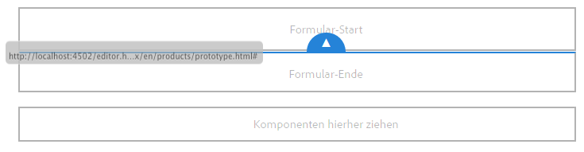

Zwischen dem Start und dem Ende eines Formulars können Sie Formular-Komponenten hinzufügen, die die eigentlichen Eingabefelder für die Benutzer definieren.

>[!NOTE]
>
>Die Formular-Komponente der Foundation-Komponenten unterstützt nur die Verwendung anderer Formular-Komponenten von Foundation-Komponenten (Schaltflächen, Text, ausgeblendet usw.). Die Verwendung von [Kernkomponenten](https://docs.adobe.com/content/help/en/experience-manager-core-components/using/introduction.html) in einem Foundation-Komponentenformular (und umgekehrt) wird nicht unterstützt.

#### Beginn des Formulars {#start-of-form}

Diese Komponente ist erforderlich, um den Beginn eines neuen Formulars auf einer Seite zu definieren. Sie können Folgendes konfigurieren:

* **Formular**

   * **Dankeseite**

      Die Seite, auf die verwiesen wird, um Besuchern für ihre Eingabe zu danken. Wenn dies leer gelassen wird, wird das Formular nach der Übermittlung erneut angezeigt.

   * **Workflow starten**

      Bestimmt, welcher Workflow ausgelöst wird, sobald ein Formular übermittelt wird.

* **Erweitert**

   * **Aktionstyp**

      Für ein Formular ist eine Aktion erforderlich. Die Aktion bestimmt den Vorgang, dessen Ausführung mit den vom Benutzer übermittelten Daten ausgelöst wird (ähnlich wie „action=“ in HTML). Teilweise erfordert dies eine entsprechende **Aktionskonfiguration**.
Einige Aktionstypen sind in einer Standard-AEM-Installation enthalten:

      * **Kontoabfrage**
      * **Inhalt erstellen**
      * **Lead erstellen**
      * **Konto erstellen und aktualisieren**
      * **E-Mail-Dienst: Abonnenten erstellen und zu Liste hinzufügen.**
      * **E-Mail-Dienst: Abwesenheitsnachricht senden**
      * **E-Mail-Dienst: Benutzer von Liste abmelden**
      * **Community bearbeiten**
      * **Ressource(n) bearbeiten**
      * **Im Workflow gesteuerte Ressource(n) bearbeiten**
      * **E-Mail**
      * **Details für platzierten Auftrag**
      * **Profilaktualisierung**
      * **Kennwort zurücksetzen**
      * **Kennwort festlegen**
      * **Inhalt speichern**

         Dies ist der Standard-Aktionstyp.

      * **Inhalt mit Uploads speichern**
      * **Bestellung absenden**
      * **Abonnenten löschen**
      * **Auftrag aktualisieren**
   * **Formular-ID**

      Mit der Formular-ID wird das Formular eindeutig gekennzeichnet. Verwenden Sie die Formular-ID, wenn sich mehrere Formulare auf einer Seite befinden. Achten Sie darauf, dass die Formulare unterschiedliche IDs haben.

   * **Ladepfad**

      Der Pfad zu den Knoteneigenschaften, mit denen vordefinierte Werte in die Formularfelder geladen werden.

      Dies ist ein optionales Feld, das den Pfad zu einem Knoten im Repository angibt. Wenn dieser Knoten Eigenschaften hat, die den Feldnamen entsprechen, werden die jeweiligen Felder im Formular vorab mit den Werten dieser Eigenschaften ausgefüllt. Wenn keine Übereinstimmung besteht, steht im Feld der Standardwert.

      Mit **Ladepfad** können Sie das Formular mit Werten in den erforderlichen Feldern vorab laden. Siehe den Beitrag zum [Vorabladen von Formularwerten](/help/sites-developing/developing-forms.md#preloading-form-values).

   * **Client-Validierung**

      Gibt an, ob für dieses Formular eine Client-Überprüfung erforderlich ist (eine Server-Überprüfung findet *immer* statt). Dies kann in Zusammenarbeit mit der **Captcha-Formularkomponente** geschehen.

   * **Validierungsressourcentyp**

      Hiermit wird der Formularvalidierungsressourcentyp definiert, wenn Sie das gesamte Formular (anstelle von einzelnen Feldern) überprüfen möchten. Wenn Sie das gesamte Formular überprüfen, führen Sie auch eine der folgenden Aufgaben aus:

      * Ein Skript zur Client-Überprüfung:

         `/apps/<*myApp*>/form/<*myValidation*>/formclientvalidation.jsp`

      * Ein Skript zur Überprüfung auf der Server-Seite:

         `/apps/<*myApp*>/form/<*myValidation*>/formservervalidation.jsp`
   * **Aktionskonfiguration**

      Die unter **Aktionskonfiguration** verfügbaren Optionen hängen von der ausgewählten **Aktionstyp** ab:

      * **Kontoabfrage**

         * **Konto erstellen (Seite)**

            Die Seite, die beim Erstellen eines neuen Kontos verwendet wird.
      * **Inhalt erstellen**

         * Inhalts-Pfad

            Der Inhaltspfad zu Inhalten, die aus dem Formular ausgegeben werden. Geben Sie einen Pfad ein, der mit einem Schrägstrich `/` endet. Der Schrägstrich zeigt an, dass für jeden Formular-Port ein neuer Knoten unter dem angegebenen Verzeichnis erstellt wird. Beispiel:

            `/forms/feedback/`

         * **Typ**

            Wählen Sie den erforderlichen Typ aus.

         * **Formular**

            Geben Sie das Formular an.

         * **Wiedergeben mit**

            Wählen Sie in der Liste die gewünschte Option aus.

         * **Ressourcentyp**

            Wenn festgelegt, wird dies jedem Kommentar als `sling:resourceType` hinzugefügt

         * **Ansichtselektor**
      * **Lead erstellen**

         * **Lead wird dieser Liste hinzugefügt**

            Geben Sie die erforderliche Liste für den Interessenten an.
      * **Konto erstellen und aktualisieren**

         * **Anfangsgruppe**

            Gruppe, der der neue Benutzer zugewiesen werden soll.

         * **Home**

            Seite, die nach erfolgreicher Anmeldung angezeigt werden soll.

         * **Pfad**

            Der (relative) Pad, in dem das neue Konto erstellt und gespeichert wird.

         * **Daten anzeigen...**

            Klicken Sie auf diese Schaltfläche, um in der Massenbearbeitung auf die Informationen zu den Formularergebnissen zuzugreifen. Von hier aus können Sie die Informationen in eine `.tsv`-Datei (tabulatorgetrennt) exportieren (z. B. in eine Excel-Tabelle).
      * **E-Mail**

         * **From**

            Geben Sie die E-Mail-Adresse ein, von der aus die E-Mail gesendet werden soll.

         * **Mailto**

            Geben Sie die E-Mail-Adresse(n) ein, an die das Formular gesendet wird.

         * **CC**

            Geben Sie die CC-E-Mail-Adresse(n) ein.

         * **BCC**

            Geben Sie die BCC-E-Mail-Adresse(n) ein.

         * **Betreff**

            Geben Sie einen Betreff für die E-Mail ein.
      * **Kennwort zurücksetzen**

         * **Kennwort ändern (Seite)**

            Die Seite, die beim Ändern des Kennworts verwendet wird.
      * **Inhalt speichern**

         * **Inhalts-Pfad**

            Der Inhaltspfad zu Inhalten, die aus dem Formular ausgegeben werden. Geben Sie einen Pfad ein, der mit einem Schrägstrich `/` endet. Der Schrägstrich zeigt an, dass für jeden Formular-Port ein neuer Knoten unter dem angegebenen Verzeichnis erstellt wird. Beispiel:
            `/forms/feedback/`

         * **Daten anzeigen...**

            Klicken Sie auf diese Schaltfläche, um in der Massenbearbeitung auf die Informationen zu den Formularergebnissen zuzugreifen. Von hier aus können Sie die Informationen in eine TSV-Datei (durch Tabulatoren getrennt) exportieren, die Sie z. B. in einer Excel-Tabelle öffnen können.
      * **Inhalt mit Uploads speichern**

         Diese Option hat die gleichen Optionen wie **Inhalt speichern**.

      * **Abonnenten löschen**

         * **Lead wird aus dieser Liste gelöscht**

            Geben Sie die erforderliche Liste für den Interessenten an.


#### Ende des Formulars {#end-of-form}

Hiermit wird das Ende des Formulars gekennzeichnet. Sie können Folgendes konfigurieren:

* **Formular-Ende**

   * **Senden-Schaltfläche einblenden**

      Gibt an, ob eine Senden-Schaltfläche angezeigt werden soll.

   * **Senden-Name**

      Eine ID, die erforderlich ist, wenn Sie mehrere Senden-Schaltflächen in einem Formular verwenden.

   * **Senden-Titel**

      Der Name, der auf der Schaltfläche angezeigt wird, z.&amp;nbsp;B. „Senden“ oder „Übermitteln“.

   * **Zurücksetzen-Schaltfläche einblenden**

      Aktivieren Sie das Kontrollkästchen, um die Schaltfläche zum Zurücksetzen („Reset“) einzublenden.

   * **Titel zurücksetzen**

      Der Name, der auf der Schaltfläche zum Zurücksetzen angezeigt wird.

   * **Beschreibung**

      Informationen, die unter der Schaltfläche angezeigt werden.

### Kontoname {#account-name}

>[!CAUTION]
>
>Diese Foundation-Komponente ist veraltet. Adobe empfiehlt stattdessen die Verwendung der [Kernkomponente „Formulartext“](https://docs.adobe.com/content/help/de/experience-manager-core-components/using/components/forms/form-text.html). 

Hiermit kann der Benutzer einen Kontonamen eingeben:

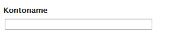

### Adresse {#address}

>[!CAUTION]
>
>Diese Foundation-Komponente ist veraltet. Adobe empfiehlt stattdessen die Verwendung der [Kernkomponente „Formulartext“](https://docs.adobe.com/content/help/en/experience-manager-core-components/using/components/forms/form-text.html). 

Hiermit können Sie ein Feld für internationale Adressen im folgenden Format hinzufügen:

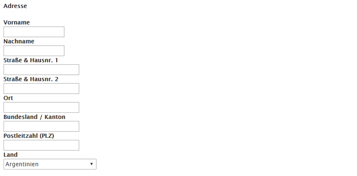

Die Komponente ist für den unmittelbaren Einsatz konfiguriert, Sie können die Konfiguration jedoch bei Bedarf ändern. Es können z. B. Beschränkungen für die einzelnen Elemente der Adresse hinzugefügt werden. Wenn Sie die Felder leer lassen, werden die Standardeinstellungen verwendet.

### Captcha  {#captcha}

>[!CAUTION]
>
>Diese Foundation-Komponente ist veraltet. Adobe empfiehlt stattdessen die Verwendung der [Kernkomponenten](https://docs.adobe.com/content/help/en/experience-manager-core-components/using/introduction.html). 

>[!CAUTION]
>
>Es wird nicht mehr erwartet, dass diese Komponente ohne umfangreiche Anpassungen auf Projektebene standardmäßig funktioniert.

Bei der Captcha-Komponente muss der Benutzer eine alphanumerische Zeichenfolge eingeben, die am Bildschirm angezeigt wird. Die Zeichenfolge ändert sich bei jeder Aktualisierung.

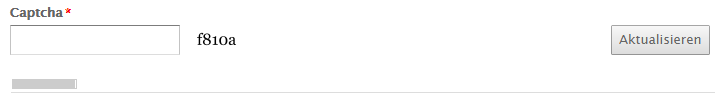

Sie können verschiedene Parameter für diese Komponente konfigurieren, darunter eine Meldung, die bei einer ungültigen Captcha-Zeichenfolge angezeigt wird.

### Kontrollkästchen-Gruppe  {#checkbox-group}

>[!CAUTION]
>
>Diese Foundation-Komponente ist veraltet. Adobe empfiehlt stattdessen die Verwendung der [Kernkomponente „Formularoptionen“](https://docs.adobe.com/content/help/de/experience-manager-core-components/using/components/forms/form-options.html). 

Mit einem Kontrollkästchen können Sie eine Liste aus einem oder mehreren Kontrollkästchen erstellen, von denen mehrere gleichzeitig aktiviert werden können.


Sie können verschiedene Parameter festlegen wie einen Titel, eine Beschreibung und einen Elementnamen. Mit den Schaltflächen „+“ und „–“ können Sie Elemente hinzufügen oder entfernen und sie dann mit den Nach-oben- und Nach-unten-Pfeilen positionieren.

>[!NOTE]
>
>Mit **Element-Ladepfad** können Sie die Kontrollkästchengruppen-Liste vorab mit Werten laden.
>
>Siehe [Vorabladen von Formularfeldern mit mehreren Werten](/help/sites-developing/developing-forms.md#preloading-form-fields-with-multiple-values).

### Kreditkartendetails {#credit-card-details}

>[!CAUTION]
>
>Diese Foundation-Komponente ist veraltet. Adobe empfiehlt stattdessen die Verwendung der [Kernkomponenten](https://docs.adobe.com/content/help/en/experience-manager-core-components/using/introduction.html). 

Hiermit können Sie Felder bereitstellen, in die Kreditkartendetails eingegeben werden können. Sie können die Typen der akzeptierten Kreditkarten und die benötigten Informationen konfigurieren (z. B. den Sicherheitscode).

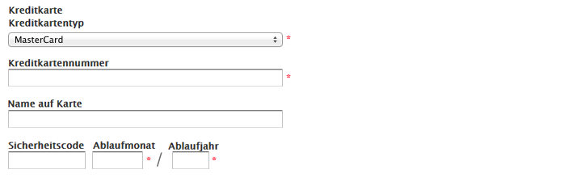

### Dropdown-Liste {#dropdown-list}

>[!CAUTION]
>
>Diese Foundation-Komponente ist veraltet. Adobe empfiehlt stattdessen die Verwendung der [Kernkomponente „Formularoptionen“](https://docs.adobe.com/content/help/en/experience-manager-core-components/using/components/forms/form-options.html). 

Eine Dropdown-Liste kann so konfiguriert werden, dass Sie eine Reihe von Auswahlwerten verwenden können:

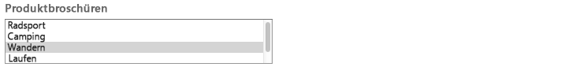

Sie können einen Titel und Elemente angeben, die in der Liste angezeigt werden. Mit den Schaltflächen „+“ und „-“ können Sie Listenelemente hinzufügen oder entfernen und sie dann mit den Nach-oben- und Nach-unten-Tasten positionieren. Sie können festlegen, ob Benutzer mehrere Elemente aus der Liste auswählen können, sowie alle Elemente, die automatisch ausgewählt werden sollen, wenn ein Benutzer die Liste zum ersten mal öffnet (Anfangswerte).

>[!NOTE]
>
>Mit dem **Element-Ladepfad** können Sie die Dropdown-Liste vorab mit Werten laden.
>
>Siehe [Vorabladen von Formularfeldern mit mehreren Werten](/help/sites-developing/developing-forms.md#preloading-form-fields-with-multiple-values).

### Datei-Upload {#file-upload}

>[!CAUTION]
>
>Diese Foundation-Komponente ist veraltet. Adobe empfiehlt stattdessen die Verwendung der [Kernkomponenten](https://docs.adobe.com/content/help/en/experience-manager-core-components/using/introduction.html). 

Die Komponente „Datei-Upload“ bietet Benutzern die Möglichkeit, eine Datei auszuwählen und hochzuladen.


>[!NOTE]
>
>Sie können eine individuelle Upload-Komponente erstellen, um Dateien in ein Sling Servlet hochzuladen. Weitere Informationen finden Sie unter [Hochladen von Dateien in Adobe Experience Manager](https://helpx.adobe.com/experience-manager/using/uploading-files-aem1.html).

### Ausgeblendetes Feld {#hidden-field}

>[!CAUTION]
>
>Diese Foundation-Komponente ist veraltet. Adobe empfiehlt stattdessen die Verwendung der [Kernkomponente „Ausgeblendetes Formular“](https://docs.adobe.com/content/help/de/experience-manager-core-components/using/components/forms/form-hidden.html). 

Mit dieser Komponente können Sie ein verstecktes Feld erstellen. Dieses Feld kann zu unterschiedlichen Zwecken verwendet werden. Wenn Sie z. B. nach dem Senden des Formulars eine Aktion durchführen müssen oder wenn für die Nachverarbeitung ausgeblendete Daten benötigt werden.


>[!NOTE]
>
>Sie können das Formular auch so anpassen, dass bestimmte Formular-Komponenten abhängig vom Wert anderer auf dem Formular befindlichen Felder ein- oder ausgeblendet werden. Das Ändern der Sichtbarkeit eines Formularfelds ist nützlich, wenn das Feld nur unter besonderen Bedingungen erforderlich ist.
>
>Siehe [Einblenden und Ausblenden von Formularkomponenten](/help/sites-developing/developing-forms.md#showing-and-hiding-form-components).

### Bild-Schaltfläche  {#image-button}

>[!CAUTION]
>
>Diese Foundation-Komponente ist veraltet. Adobe empfiehlt stattdessen die Verwendung der [Kernkomponente „Formularschaltfläche“](https://docs.adobe.com/content/help/de/experience-manager-core-components/using/components/forms/form-button.html). 

Mit einer Bild-Schaltfläche können Sie eine Schaltfläche mit Ihrem eigenem Bild und Text erstellen:

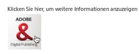

### Bild-Upload {#image-upload}

>[!CAUTION]
>
>Diese Foundation-Komponente ist veraltet. Adobe empfiehlt stattdessen die Verwendung der [Kernkomponenten](https://docs.adobe.com/content/help/en/experience-manager-core-components/using/introduction.html). 

Die Bild-Upload-Komponente bietet Benutzern die Möglichkeit, eine Bilddatei auszuwählen und hochzuladen.

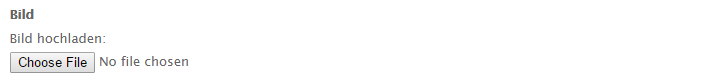

### Verknüpfungsfeld {#link-field}

>[!CAUTION]
>
>Diese Foundation-Komponente ist veraltet. Adobe empfiehlt stattdessen die Verwendung der [Kernkomponenten](https://docs.adobe.com/content/help/en/experience-manager-core-components/using/introduction.html). 

Im Link-Feld können Benutzer eine URL angeben:

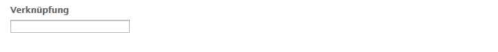

Dies wird am häufigsten für das Kalenderereignis-Formular verwendet, wo es für das URL/Link-Feld eines Ereignisses verwendet wird.

### Kennwort-Feld {#password-field}

>[!CAUTION]
>
>Diese Foundation-Komponente ist veraltet. Adobe empfiehlt stattdessen die Verwendung der [Kernkomponenten](https://docs.adobe.com/content/help/en/experience-manager-core-components/using/introduction.html). 

Dieses Feld ermöglicht dem Benutzer die Eingabe seines Kennworts:

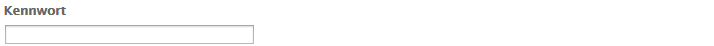

### Kennwort zurücksetzen {#password-reset}

>[!CAUTION]
>
>Diese Foundation-Komponente ist veraltet. Adobe empfiehlt stattdessen die Verwendung der [Kernkomponenten](https://docs.adobe.com/content/help/en/experience-manager-core-components/using/introduction.html). 

Diese Komponente bietet Benutzern zwei Felder für:

* die Eingabe eines Kennworts
* die wiederholte Eingabe des Kennworts zur Bestätigung der korrekten Eingabe

Die Standardeinstellungen der Komponente werden folgendermaßen angezeigt:

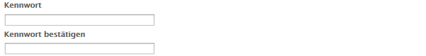

### Optionsfeldgruppe {#radio-group}

>[!CAUTION]
>
>Diese Foundation-Komponente ist veraltet. Adobe empfiehlt stattdessen die Verwendung der [Kernkomponente „Formularoptionen“](https://docs.adobe.com/content/help/en/experience-manager-core-components/using/components/forms/form-options.html). 

Eine Optionsfeldgruppe bietet Ihnen eine Liste mit einem oder mehreren Optionsschaltern, von denen nur jeweils einer ausgewählt werden kann.

Sie können den Elementnamen zusammen mit einem Titel und einer Beschreibung festlegen. Mit den Schaltflächen „+“ und „-“ können Sie Elemente hinzufügen oder entfernen und sie dann mit den Nach-oben- und Nach-unten-Tasten positionieren und gegebenenfalls einen Standardwert festlegen:


>[!NOTE]
>
>Mit dem **Element-Ladepfad** können Sie die Optionsfeld-Gruppe vorab mit Werten laden.
>
>Siehe [Vorabladen von Formularfeldern mit mehreren Werten](/help/sites-developing/developing-forms.md#preloading-form-fields-with-multiple-values).

### Schaltfläche „Übermitteln“{#submit-button}

>[!CAUTION]
>
>Diese Foundation-Komponente ist veraltet. Adobe empfiehlt stattdessen die Verwendung der [Kernkomponente „Formularschaltfläche“](https://docs.adobe.com/content/help/en/experience-manager-core-components/using/components/forms/form-button.html). 

Mit dieser Komponente können Sie eine Schaltfläche „Übermitteln“ mit Standardtext erstellen:


Oder Sie können Ihren eigenen Text eingeben:


### Feld „Tags“{#tags-field}

>[!CAUTION]
>
>Diese Foundation-Komponente ist veraltet. Adobe empfiehlt stattdessen die Verwendung der [Kernkomponenten](https://docs.adobe.com/content/help/en/experience-manager-core-components/using/introduction.html). 

Über dieses Feld können Sie Tags auswählen:


Sie können auf einer speziellen Registerkarte verschiedene Parameter angeben, darunter auch die Namespaces:

* **Tag-Feld**

   * **Zulässige Namespaces**

      * **Geometrixx Outdoors**
      * **Arbeitsablauf**
      * **Forum**
      * **Stockfotographie**
      * **Geometrixx Media**
      * **Standard-Tags**
      * **Marketing**
      * **Asset-Eigenschaften**
      * **Breite in Pixel**
      * **Popup-Größe**

### Textfeld {#text-field}

>[!CAUTION]
>
>Diese Foundation-Komponente ist veraltet. Adobe empfiehlt stattdessen die Verwendung der [Kernkomponente „Formulartext“](https://docs.adobe.com/content/help/en/experience-manager-core-components/using/components/forms/form-text.html). 

Das Standardtextfeld kann an die erforderliche Größe angepasst werden und kann den eigenen Lead in der Nachricht enthalten:

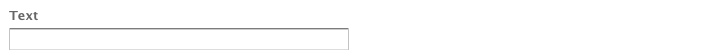

### Workflow-Sende-Schaltfläche(n) {#workflow-submit-button-s}

>[!CAUTION]
>
>Diese Foundation-Komponente ist veraltet. Adobe empfiehlt stattdessen die Verwendung der [Kernkomponente „Formularschaltfläche“](https://docs.adobe.com/content/help/en/experience-manager-core-components/using/components/forms/form-button.html). 

Damit können Sie eine Senden-Schaltfläche für die Verwendung in einem Workflow erstellen.


