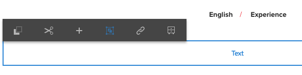

# Bearbeiten des Seiteninhalts {#editing-page-content}

Sobald Ihre Seite erstellt ist (neu oder im Rahmen eines Launch oder einer Live Copy), können Sie den Inhalt bearbeiten und die erforderlichen Aktualisierungen vornehmen.

Der Inhalt wird mit mithilfe von (zum Inhaltstyp passenden) [Komponenten](/help/sites-authoring/default-components-console.md) hinzugefügt, die auf die Seite gezogen werden können. Dort können sie dann bearbeitet, verschoben oder gelöscht werden.

>[!NOTE]
>
>Damit Sie Seiten bearbeiten können, muss Ihr Konto über die [entsprechenden Zugriffsrechte](/help/sites-administering/security.md) und [Berechtigungen](/help/sites-administering/security.md#permissions) verfügen.
>
>Wenn Sie auf Probleme stoßen, empfehlen wir Ihnen, sich an den Systemadministrator zu wenden.

>[!NOTE]
>
>Wenn Ihre Seite und/oder Vorlage entsprechend eingerichtet ist, können Sie das [responsive Layout](/help/sites-authoring/responsive-layout.md) für die Bearbeitung verwenden.

>[!NOTE]
>
>Im **Bearbeitungsmodus** werden Links in Ihrem Inhalt angezeigt, können jedoch **nicht aufgerufen werden**. Verwenden Sie den [Vorschaumodus](#previewingpagestouchoptimizedui), wenn Sie mithilfe von Links in Ihrem Inhalt navigieren möchten.

## Seitensymbolleiste {#page-toolbar}

Die Seite-Symbolleiste bietet Zugriff auf die entsprechenden Funktionen, die von der Seitenkonfiguration abhängig sind.

Die Symbolleiste bietet Zugriff auf eine Vielzahl von Optionen. Je nachdem, in welchem Kontext Sie gerade arbeiten und welche Konfiguration Sie aktuell verwenden, stehen einige Optionen u. U. nicht zur Verfügung.

* **Seitliches Bedienfeld ein/aus**

   Damit wird das seitliche Bedienfeld geöffnet bzw. geschlossen, das den [Asset-Browser](/help/sites-authoring/author-environment-tools.md#assets-browser), den [Komponenten-Browser](/help/sites-authoring/author-environment-tools.md#components-browser) und die [Inhaltsstruktur](/help/sites-authoring/author-environment-tools.md#content-tree) enthält.

   

* **Seiteninformationen**

   Hierüber wird das Menü [Seiteninformationen](/help/sites-authoring/author-environment-tools.md#page-information) aufgerufen, das Details zur Seite sowie Aktionen enthält, die auf der Seite ausgeführt werden können (z. B. das Anzeigen und Bearbeiten der Seiteninformationen oder die Veröffentlichung bzw. das Rückgängigmachen der Veröffentlichung der Seite).

   

* **Emulator**

   Blendet die [Emulator-Symbolleiste](/help/sites-authoring/responsive-layout.md#selecting-a-device-to-emulate) ein bzw. aus, über die das Look-and-Feel der Seite auf einem anderen Gerät emuliert werden kann. Im Layout-Modus wird sie automatisch eingeblendet.

   

* **ContextHub**

   Öffnet den [ContextHub](/help/sites-authoring/ch-previewing.md). Dieser ist nur im Vorschaumodus verfügbar.

   

* **Seitentitel**

   Dient nur zu Informationszwecken.

   

* **Modusauswahl**

   Zeigt den aktuellen [Modus](/help/sites-authoring/author-environment-tools.md#page-modes) an und ermöglicht die Auswahl eines anderen Modus, z. B. Bearbeiten, Layout, Timewarp oder Targeting.

   

* **Vorschau**

   Aktiviert den [Vorschaumodus](/help/sites-authoring/editing-content.md#preview-mode). Mit diesem wird die Seite so angezeigt, wie sie bei der Veröffentlichung dargestellt wird.

   

* **Anmerken**

   Hierüber können Sie die Seite mit [Anmerkungen](/help/sites-authoring/annotations.md) versehen (z. B. zu Prüfungszwecken). Nach der ersten Anmerkung wird anstelle des Symbols eine Zahl für die Anzahl der Anmerkungen auf der Seite angezeigt.

   

### Statusbenachrichtigung {#status-notification}

Wird eine Seite bearbeitet, die einem oder mehreren [Workflows](/help/sites-authoring/workflows.md) unterliegt, wird oben im Bildschirm eine Benachrichtigungsleiste mit einem entsprechenden Hinweis angezeigt.

>[!NOTE]
>
>Die Statusleiste wird nur für Benutzerkonten angezeigt, die über die entsprechenden Berechtigungen verfügen.

In der Benachrichtigung ist der Workflow aufgeführt, dem die Seite zugeordnet ist. Wenn der Benutzer am aktuellen Workflow-Schritt beteiligt ist, sind zusätzlich auch Optionen verfügbar, die sich [auf den Workflow-Status auswirken](/help/sites-authoring/workflows-participating.md) und die weitere Informationen zum Workflow liefern, darunter:

* **Abschließen**  - Öffnet das Dialogfeld  **Abschließen des** Arbeitsablaufs

* **Delegieren**  - Öffnet das  **Dialogfeld &quot;** Arbeitsablauf abschließen&quot;

* **Details anzeigen**: Öffnet das Fenster **Details** des entsprechenden Workflows.

Das Fertigstellen und Delegieren von Workflow-Schritten über die Benachrichtigungsleiste erfolgt auf die gleiche Art und Weise wie beim [Teilnehmen an Workflows](/help/sites-authoring/workflows-participating.md) über den Benachrichtigungs-Posteingang.

Wenn die Seite mehreren Workflows unterliegt, werden in der Benachrichtigung rechts außen die Anzahl der Workflows sowie Pfeilschaltflächen angezeigt, über die Sie durch die einzelnen Workflows scrollen können.

## Komponenten-Platzhalter {#component-placeholder}

Der Komponenten-Platzhalter zeigt an, wo eine Komponente platziert wird, wenn Sie sie per Drag-and-Drop ablegen – oberhalb der Komponente, über der sich der Mauszeiger gerade befindet:

* Wenn Sie eine neue Komponente zur Seite hinzufügen (die Sie aus dem Komponenten-Browser ziehen):

   

* Wenn Sie eine vorhandene Komponente verschieben:

   

## Einfügen einer Komponente {#inserting-a-component}

### Einfügen einer Komponente aus dem Komponenten-Browser {#inserting-a-component-from-the-components-browser}

Sie können eine neue Komponente mit dem [Komponenten-Browser](/help/sites-authoring/author-environment-tools.md#components-browser) hinzufügen. Der [Komponenten-Platzhalter](#component-placeholder) zeigt an, wo die Komponente platziert wird:

1. Öffnen Sie die Seite im Modus [**Bearbeiten**](/help/sites-authoring/author-environment-tools.md#page-modes).
1. Öffnen Sie den [Komponenten-Browser](/help/sites-authoring/author-environment-tools.md#components-browser).
1. Ziehen Sie die benötigte Komponente an die [passende Position](#component-placeholder).

1. [Bearbeiten](#editmovecopypastedelete) Sie die Komponente.

>[!NOTE]
>
>Auf Mobilgeräten nimmt der Komponenten-Browser den gesamten Bildschirm ein. Sobald Sie eine Komponente per Drag-and-Drop auswählen, wird der Browser geschlossen, sodass Sie die Komponente auf der Seite ablegen können.

### Einfügen einer Komponente aus dem Absatzsystem {#inserting-a-component-from-the-paragraph-system}

Sie können eine neue Komponente über das Feld **Komponenten hierher ziehen** des Absatzsystems hinzufügen.

1. Öffnen Sie die Seite im Modus [**Bearbeiten**](/help/sites-authoring/author-environment-tools.md#page-modes).
1. Neue Komponenten können auf zwei Arten aus dem Absatzsystem ausgewählt und hinzugefügt werden:

   * Wählen Sie die Option **Komponente einfügen** (+) in der Symbolleiste einer vorhandenen Komponente oder aus dem Feld **Komponenten hierher ziehen**.

   

   * Wenn Sie ein Desktop-Gerät verwenden, können Sie die Aktion per Doppelklick auf das Feld **Komponenten hierher ziehen** durchführen.

   Das Dialogfeld **Neue Komponente einfügen** wird geöffnet. Dort können Sie die erforderliche Komponente auswählen:

   

1. Die ausgewählte Komponente wird am Ende der Seite hinzugefügt. [Bearbeiten](#editmovecopypastedelete) Sie die Komponente.

### Einfügen einer Komponente mit dem Assets-Browser  {#inserting-a-component-using-the-assets-browser}

Sie können eine neue Komponente zur Seite hinzufügen, indem Sie ein Asset aus dem [Asset-Browser](/help/sites-authoring/author-environment-tools.md#assets-browser) ziehen. Dadurch wird automatisch eine neue Komponente des entsprechenden Typs erstellt, die das Asset enthält.

Dies gilt für folgende Asset-Typen (einige sind von der Seite/dem Absatzsystem abhängig):

<table>
 <tbody>
  <tr>
   <th><strong>Asset-Typ</strong></th>
   <th><strong>Resultierender Komponententyp</strong></th>
  </tr>
  <tr>
   <td>Bild</td>
   <td>Bild</td>
  </tr>
  <tr>
   <td>Dokument</td>
   <td>Download</td>
  </tr>
  <tr>
   <td>Produkt</td>
   <td>Produkt</td>
  </tr>
  <tr>
   <td>Video</td>
   <td>Flash</td>
  </tr>
  <tr>
   <td>Inhaltsfragment</td>
   <td>Inhaltsfragment  </td>
  </tr>
 </tbody>
</table>

>[!NOTE]
>
>Dieses Verhalten kann für Ihre Installation konfiguriert werden. Weitere Informationen finden Sie unter [Konfigurieren eines Absatzsystems zum Erstellen einer Komponenteninstanz infolge des Ziehens eines Assets](/help/sites-developing/developing-components.md#configuring-a-paragraph-system-so-that-dragging-an-asset-creates-a-component-instance).

So erstellen Sie eine Komponente, indem Sie einen der obigen Asset-Typen ziehen:

1. Öffnen Sie die Seite im Modus [**Bearbeiten**](/help/sites-authoring/author-environment-tools.md#page-modes).
1. Öffnen Sie den [Asset-Browser](/help/sites-authoring/author-environment-tools.md#assets-browser).
1. Ziehen Sie das benötigte Asset an die passende Position. Der [Komponenten-Platzhalter](#component-placeholder) zeigt an, wo die Komponente platziert wird.

   Am entsprechenden Ort wird eine zum Asset-Typ passende Komponente erstellt, die das ausgewählte Asset enthält.

1. [Bearbeiten](#editmovecopypastedelete) Sie die Komponente.

>[!NOTE]
>
>Auf Mobilgeräten nimmt der Asset-Browser den gesamten Bildschirm ein. Sobald Sie ein Asset per Drag-and-Drop auswählen, wird der Browser geschlossen, sodass Sie das Asset auf der Seite ablegen können.

Wenn Sie die Assets durchgehen und feststellen, dass Sie an einem der Assets eine Änderung vornehmen möchten, können Sie den [Asset-Editor](/help/assets/manage-assets.md) direkt über den Browser starten. Klicken Sie dazu einfach auf das Bearbeitungssymbol neben dem Asset-Namen.

## Bearbeiten/Konfigurieren/Kopieren/Ausschneiden/Löschen/Einfügen {#edit-configure-copy-cut-delete-paste}

Wenn Sie eine Komponente auswählen, wird die Symbolleiste geöffnet. Dort haben Sie Zugriff auf verschiedene Aktionen, die Sie auf die Komponente anwenden können.

Die tatsächlichen für den Benutzer verfügbaren Aktionen werden abhängig von der jeweiligen Situation angezeigt, sodass hier u. U. nicht alle möglichen Aktionen beschrieben werden.

* **Bearbeiten**

   [Abhängig vom Komponententyp](/help/sites-authoring/default-components.md) können Sie hierüber den [Inhalt der Komponente bearbeiten](#edit-content). Häufig wird eine Symbolleiste angezeigt.

   

* **Konfigurieren**

   [Abhängig vom Komponententyp](/help/sites-authoring/default-components.md) können Sie hierüber die Eigenschaften der Komponente bearbeiten und konfigurieren. Häufig wird ein Dialogfeld geöffnet.

   

* **Kopieren**

   Kopiert die Komponente in die Zwischenablage. Nach dem Einfügen bleibt die ursprüngliche Komponente weiter vorhanden.

   

* **Ausschneiden**

   Kopiert die Komponente in die Zwischenablage. Nach dem Einfügen wird die ursprüngliche Komponente entfernt.

   

* **Löschen**

   Löscht die Komponente von der Seite. Sie werden dazu aufgefordert, die Aktion zu bestätigen.

   

* **Komponente einfügen**

   Öffnet das Dialogfeld, in dem Sie eine [neue Komponente hinzufügen](/help/sites-authoring/editing-content.md#inserting-a-component-from-the-paragraph-system) können.

   

* **Einfügen**

   Fügt die Komponente aus der Zwischenablage in die Seite ein. Ob das Original erhalten bleibt, hängt davon ab, ob sie es kopiert oder ausgeschnitten haben.

   * Sie können die Komponente sowohl in die aktuelle Seite als auch in eine andere Seite einfügen.
   * Das Element wird über dem Element eingefügt, auf dem Sie die Einfügen-Aktion durchführen.
   * Die Option zum Einfügen wird nur angezeigt, wenn sich Inhalt in der Zwischenablage befindet.

   

   >[!NOTE]
   >
   >Wenn Sie eine Seite auf einer anderen Seite einfügen, die vor dem Ausschneiden/Kopieren geöffnet war, müssen Sie die Seite aktualisieren, damit der eingefügte Inhalt angezeigt wird.

* **Gruppe**

   Mit dieser Aktion können Sie mehrere Komponenten gleichzeitig auswählen. Auf einem Desktop-Gerät können Sie diese Aktion auch über die Tastenkombination **Strg+Mausklick** bzw. **Befehlstaste+Mausklick** durchführen.

   

* **Übergeordnet**

   Hierüber können Sie die Komponente auswählen, die der ausgewählten Komponente übergeordnet ist.

   

* **Layout**

   Hierüber können Sie das [Layout](/help/sites-authoring/editing-content.md#edit-component-layout) der ausgewählten Komponente ändern. Diese Aktion wird nur auf die ausgewählte Komponente angewendet, der [Layout-Modus](/help/sites-authoring/author-environment-tools.md#page-modes), mit dem das Layout der gesamten Seite bearbeitet wird, wird dabei nicht aktiviert.

   

* **In Experience Fragment-Variante umwandeln**

   Hierüber können Sie ein neues [Experience Fragment](/help/sites-authoring/experience-fragments.md) aus der ausgewählten Komponente erstellen oder einem bestehenden Experience Fragment hinzufügen.

   

## Bearbeiten (Inhalt) {#edit-content}

Für das Hinzufügen und/oder Bearbeiten von Inhalten in Komponenten sind zwei Verfahren verfügbar:

* Öffnen Sie das Dialogfeld [Komponente](#component-edit-dialog) für die Bearbeitung.
* [Ziehen Sie ein Asset](#draganddropintocomponent) aus dem Asset-Browser, um Inhalt direkt hinzuzufügen.

### Dialogfeld „Komponente bearbeiten“  {#component-edit-dialog}

Sie können eine Komponente öffnen, um den Inhalt zu bearbeiten, indem Sie das Symbol [„Bearbeiten“ (Stiftsymbol) in der Komponenten-Symbolleiste](#edit-configure-copy-cut-delete-paste) verwenden.

Welche Bearbeitungsoptionen verfügbar sind, hängt von der Komponente ab (und für einige Komponenten sind [alle Aktionen nur im Vollbildmodus verfügbar)](#edit-content-full-screen-mode). Beispiel:

* [Textkomponente](/help/sites-authoring/rich-text-editor.md#main-pars-title-24)

   

* Bildkomponente

   

   >[!NOTE]
   >
   >Die Bearbeitung funktioniert nicht bei leeren Bildkomponenten.
   >
   >
   >Sie müssen ein Bild [ziehen oder hochladen (über „Konfigurieren“)](/help/sites-authoring/default-components-foundation.md#image), bevor Sie die Bearbeitung starten.

* Bildkomponente – Vollbild

   Wenn Sie den [Vollbildmodus](/help/sites-authoring/editing-content.md#edit-content-full-screen-mode) für die Bildkomponente aufrufen, haben Sie mehr Platz zum Bearbeiten des Bildes und erhalten zusätzliche Bearbeitungsoptionen wie **Map starten** und **Zoom zurücksetzen**. Außerdem können im Vollbildmodus Zuschnittvoreinstellungen ausgewählt werden.

   

* Bei Komponenten, die aus mehr als einer grundlegenden Komponente bestehen, etwa die [Basiskomponente für Text und Bild](/help/sites-authoring/default-components-foundation.md#text-image), werden Sie zunächst dazu aufgefordert, die gewünschten Bearbeitungsoptionen zu bestätigen:

   

### Drag-and-Drop von Assets in Komponenten {#drag-and-drop-assets-into-component}

Für bestimmte Komponententypen können Sie Assets aus dem Asset-Browser direkt in die Komponente ziehen und ablegen, um den Inhalt zu aktualisieren:

| **Asset-Typ** | **Komponententyp** |
|---|---|
| Bild | Bild |
| Dokument | Download |
| Produkt | Produkt |
| Video | Flash |
| Inhaltsfragment | Inhaltsfragmente |

## Bearbeiten (Inhalt) Vollbildmodus  {#edit-content-full-screen-mode}

Für alle Komponenten kann der Vollbildmodus über das folgende Symbol gestartet und beendet werden:

Z. B. die Komponente **Text**:

>[!NOTE]
>
>Für einige Komponenten sind im Vollbildmodus mehr Optionen verfügbar, als im integrierten Editor.

## Verschieben einer Komponente {#moving-a-component}

So verschieben Sie eine Absatzkomponente:

1. Wählen Sie den zu verschiebenden Absatz durch Tippen/Klicken und Halten aus:
1. Ziehen sie den Absatz an die neue Position. AEM zeigt an, wo der Absatz abgelegt werden kann. Legen Sie den Absatz an der gewünschten Stelle ab.

   

1. Der Absatz wird verschoben.

>[!NOTE]
>
>Sie können eine Komponente auch durch [Ausschneiden und Einfügen](/help/sites-authoring/editing-content.md#edit-configure-copy-cut-delete-paste) verschieben.

## Bearbeiten des Komponenten-Layouts {#edit-component-layout}

Wenn Sie eine Komponente anpassen möchten, müssen Sie nicht ständig zwischen dem Bearbeitungs- und dem [Layout-Modus](/help/sites-authoring/responsive-layout.md) hin- und herwechseln. Mithilfe der **Layout**-Aktion können Sie das Layout einer Komponente ebenfalls ändern und dabei Zeit sparen, da Sie den Bearbeitungsmodus nicht verlassen müssen.

1. In der Sites-Konsole wird durch Auswählen einer Komponente im **Bearbeitungsmodus** die zugehörige Symbolleiste für die Komponente angezeigt.

   

   Klicken bzw. tippen Sie auf die **Layout**-Aktion, um das Layout der Komponente anzupassen.

   

1. Durch das Auswählen der Layout-Aktion stehen folgende Funktionen zur Verfügung:

   * Auf der Komponente werden die Ziehpunkte für die Größenanpassung angezeigt.
   * Oben im Bildschirm wird die Emulator-Symbolleiste angezeigt.
   * In der Komponenten-Symbolleiste stehen statt der Standard-Bearbeitungsaktionen nun Layout-Aktionen zur Verfügung.

   

   Jetzt können Sie Änderungen am Layout der Komponente auf die gleiche Art und Weise vornehmen wie im [Layout-Modus](/help/sites-authoring/responsive-layout.md#defining-layouts-layout-mode).

1. Wenn Sie alle Änderungen wie gewünscht vorgenommen haben, klicken Sie im Aktionsmenü der Komponente auf die Schaltfläche **Schließen**, um die Layout-Anpassung zu beenden. In der Komponenten-Symbolleiste stehen nun wieder die Standard-Bearbeitungsfunktionen zur Verfügung.

   

>[!NOTE]
>
>Die Layout-Aktion ist immer auf die jeweils ausgewählte Komponente beschränkt. Wenn Sie beispielsweise das Layout einer Komponente bearbeiten und dann auf eine andere Komponente klicken, wird die standardmäßige Bearbeitungssymbolleiste (nicht die Layout-Symbolleiste) für die neu ausgewählte Komponente angezeigt. Die Größenänderungs-Handles sowie die Emulator-Symbolleiste werden nicht mehr angezeigt.
>
>Um das Layout für die gesamte Seite, d. h. über mehrere Komponenten hinweg, zu bearbeiten, wechseln Sie in den [Layout-Modus](/help/sites-authoring/responsive-layout.md).

## Vererbte Komponenten {#inherited-components}

Vererbte Komponenten können sich aus diversen Szenarien ergeben, wie:

* [Multi-Site-Management](/help/sites-administering/msm.md)
* [Launch](/help/sites-authoring/launches.md) (wenn auf einer Live Copy basierend).
* Spezifische Komponenten, z. B. das vererbte Absatzsystem in Geometrixx.

Sie können die Vererbung deaktivieren (und dann wieder aktivieren). Abhängig von der Komponente ist dies wie folgt verfügbar:

* **Live Copy**

   Auf der Komponentensymbolleiste, wenn sich die Komponente auf einer Seite befindet, die Teil eines Live Copy- oder Launch-Vorgangs (auf Live Copy basierend) ist. Beispiel:

   

   Die Option „Vererbung abbrechen“ ist verfügbar:

   

   Oder aktivieren Sie die Vererbung erneut, wenn sie bereits abgebrochen wurde:

   

   Die Rollout-Aktion steht auch in der Blueprint oder in der Live Copy-Quelle zur Verfügung:

   

* **Vererbungs-Absatzsystem**

   Im Dialogfeld für die Konfiguration, wie z. B. beim vererbten Absatzsystem.

   

## Bearbeiten der Seitenvorlage {#editing-the-page-template}

Wenn die Seite auf einer [bearbeitbaren Vorlage](/help/sites-authoring/templates.md#editable-and-static-templates) basiert, können Sie schnell und einfach zum [Vorlagen-Editor](/help/sites-authoring/templates.md#editing-templates-template-authors) wechseln, indem Sie im Menü [Seiteninformationen](/help/sites-authoring/author-environment-tools.md#page-information) die Option **Vorlage bearbeiten** auswählen.

Wenn die Seite auf einer [statischen Vorlage](/help/sites-authoring/templates.md#editable-and-static-templates) basiert, können Sie mithilfe der [Seitenmodusauswahl](/help/sites-authoring/author-environment-tools.md#page-modes) in der Symbolleiste zum [Designmodus](/help/sites-authoring/default-components-designmode.md) wechseln, um Komponenten für die Verwendung auf der Seite zu aktivieren/deaktivieren.

Durch Auswählen der Seite in der [Spaltenansicht](/help/sites-authoring/basic-handling.md#column-view) oder [Listenansicht](/help/sites-authoring/basic-handling.md#list-view) können Sie schnell und einfach feststellen, auf welcher Vorlage die Seite basiert.

## Live Copy-Status {#live-copy-status}

Der [Seitenmodus „Live Copy-Status“](/help/sites-authoring/author-environment-tools.md#page-modes) bietet einen schnellen Überblick über den Live Copy-Status und darüber, welche Komponenten vererbt oder nicht vererbt wurden.

* Grüner Rahmen: Vererbt
* Pinkfarbener Rahmen: Vererbung wurde abgebrochen

Beispiel:

## Hinzufügen von Anmerkungen {#adding-annotations}

[Anmerkungen](/help/sites-authoring/annotations.md) bieten Reviewern und anderen Autoren die Möglichkeit, Feedback zu Ihrem Inhalt zu erteilen. Dies wird häufig zu Korrektur- oder Überprüfungszwecken verwendet.

## Anzeigen einer Seitenvorschau  {#previewing-pages}

Für die Anzeige einer Seitenvorschau stehen zwei Optionen zur Verfügung:

* [Vorschaumodus](#preview-mode) – für einen schnellen Blick auf die Seite im Kontext

* [Als veröffentlicht anzeigen](#view-as-published) – eine Vorschau, bei der die Seite in einer neuen Registerkarte geöffnet wird

>[!NOTE]
>
>* Verweise im Inhalt sind sichtbar, können im Bearbeitungsmodus jedoch nicht aufgerufen werden.
>* Verwenden Sie eine der Vorschauoptionen, wenn Sie mithilfe von Links navigieren möchten.
>* Verwenden Sie den [Tastaturbefehl](/help/sites-authoring/keyboard-shortcuts.md) `Ctrl-Shift-M` (Strg+Umschalt+M), um zwischen der Vorschau und dem zuletzt ausgewählten Modus zu wechseln.

>

>[!NOTE]
>
>Das WCM-Modus-Cookie ist für beide Optionen festgelegt.

### Vorschaumodus {#preview-mode}

Beim Bearbeiten von Inhalt können Sie mithilfe des [Vorschaumodus](/help/sites-authoring/author-environment-tools.md#page-modes) eine Vorschau der Seite anzeigen. Dieser Modus:

* Blendet diverse Bearbeitungsmechanismen aus, damit Sie einen schnellen Überblick darüber erhalten, wie die Seite veröffentlicht aussehen wird.
* Ermöglicht es Ihnen, mit Links zu navigieren.
* Aktualisiert den Seiteninhalt **nicht**.

Bei der Bearbeitung einer Seite können Sie den Vorschaumodus über das Symbol rechts oben im Seiteneditor aufrufen:

### Als veröffentlicht anzeigen {#view-as-published}

Die Option **Als veröffentlicht anzeigen** ist im Menü [Seiteninformationen](/help/sites-authoring/author-environment-tools.md#page-information) verfügbar. Mit dieser Option wird die Seite in einer neuen Registerkarte geöffnet, ihr Inhalt aktualisiert und die Seite so angezeigt, wie sie später in der Veröffentlichungsumgebung aussieht.

## Sperren einer Seite {#locking-a-page}

AEM bietet Ihnen die Möglichkeit, eine Seite zu sperren, sodass niemand außer Ihnen den Inhalt bearbeiten kann. Dies ist hilfreich, wenn Sie eine Vielzahl von Bearbeitungen an einer bestimmten Seite vornehmen oder wenn Sie eine Seite für eine kurze Zeit einfrieren möchten.

Eine Seite kann wie folgt gesperrt werden:

* **Sites-Konsole**

   1. Wählen Sie die Seite mit dem [Auswahlmodus](/help/sites-authoring/basic-handling.md#viewing-and-selecting-resources) aus.
   1. Wählen Sie das Sperrsymbol aus.

   

* **Seiteneditor**

   1. Wählen Sie das Symbol **Seiteninformationen** aus, um das Menü zu öffnen:
   1. Wählen Sie die Option **Seite sperren** aus.

Nach der Sperrung werden die Informationen der Konsolenansicht aktualisiert und beim Bearbeiten wird in der Symbolleiste ein Vorhängeschlosssymbol angezeigt.

>[!CAUTION]
>
>Seiten können gesperrt werden, wenn [anstelle eines Benutzers agiert wird](/help/sites-administering/security.md#impersonating-another-user). Eine auf diese Weise gesperrte Seite kann nur von dem Benutzer, für den stellvertretend agiert wurde, oder von einem Benutzer mit Administratorrechten entsperrt werden.
>
>Seiten lassen sich nicht entsperren, indem stellvertretend für den Benutzer agiert wird, der die Seite gesperrt hat.

## Entsperren einer Seite {#unlocking-a-page}

Das Entsperren einer Seite verläuft ähnlich wie das [Sperren der Seite](#locking-a-page) – nach dem Sperren der Seite werden die Sperroptionen durch Aktionen zum Entsperren ersetzt.

Im Menü „Seiteninformationen“ steht dann die Option **Entsperren** zur Verfügung und das Vorhängeschlosssymbol in der Sites-Konsole wird durch ein **Entsperren-Symbol** ersetzt.

>[!CAUTION]
>
>Seiten können gesperrt werden, wenn [anstelle eines Benutzers agiert wird](/help/sites-administering/security.md#impersonating-another-user). Eine auf diese Weise gesperrte Seite kann nur von dem Benutzer, für den stellvertretend agiert wurde, oder von einem Benutzer mit Administratorrechten entsperrt werden.
>
>Seiten lassen sich nicht entsperren, indem stellvertretend für den Benutzer agiert wird, der die Seite gesperrt hat.

## Rückgängigmachen und Wiederholen von Seitenbearbeitungen {#undoing-and-redoing-page-edits}

Mit den folgenden Symbolen können Sie eine Aktion rückgängig machen oder wiederholen. Diese werden gegebenenfalls in der Symbolleiste angezeigt:

>[!NOTE]
>
>Der [Tastaturbefehl](/help/sites-authoring/page-authoring-keyboard-shortcuts.md) `Ctrl-Z` ist auch verfügbar, um Seitenbearbeitungsaktionen rückgängig zu machen.
>
>Der Tastaturbefehl `Ctrl-Y` ist auch verfügbar, um Seitenbearbeitungsaktionen zu wiederholen.

>[!NOTE]
>
>Siehe [Rückgängigmachen und Wiederholen von Seitenbearbeitungen - Die Theorie](#undoing-and-redoing-page-edits-the-theory); dort erfahren Sie, was beim Rückgängigmachen und Wiederholen von Seitenbearbeitungen möglich ist.

## Rückgängigmachen und Wiederholen von Seitenbearbeitungen - Die Theorie {#undoing-and-redoing-page-edits-the-theory}

>[!NOTE]
>
>Ihr Systemadministrator kann [verschiedene Aspekte der Funktionen zum Rückgängig machen/Wiederholen](/help/sites-administering/config-undo.md) den Anforderungen Ihrer Instanz entsprechend konfigurieren.

AEM speichert einen Verlauf der Aktionen, die Sie ausführen, sowie die Reihenfolge der Ausführung. Sie können also mehrere Aktionen in der umgekehrten Reihenfolge ihrer Ausführung rückgängig machen und bei Bedarf die Aktionen wiederholen, wenn Sie eine oder mehrere davon erneut anwenden möchten.

Wenn ein Element auf der Inhaltsseite ausgewählt wird, gelten die Befehle „Rückgängig“ und „Wiederholen“ für das ausgewählte Element, also z. B. für eine Textkomponente.

Das Rückgängigmachen und Wiederholen von Befehlen funktioniert ähnlich wie in anderen Softwareprogrammen. Verwenden Sie die Befehle, um beim Treffen von Entscheidungen über den Inhalt ihrer Webseite zu einem vorherigen Zustand der Seite zurückzukehren. Wenn Sie beispielsweise einen Textabsatz an eine Stelle auf der Seite verschoben haben, können Sie ihn mithilfe des Befehls zum Rückgängigmachen wieder zurück an die ursprüngliche Stelle verschieben. Wenn Sie den Absatz dann doch wieder an die zuletzt verwendete Stelle verschieben möchten, können Sie mit dem Befehl zum Wiederholen quasi das „Rückgängigmachen rückgängig machen“.

>[!NOTE]
>
>Sie haben folgende Möglichkeiten:
>
>* Aktionen wiederholen, solange Sie seit dem letzten Rückgängigmachen einer Aktion keine Seitenbearbeitungen durchgeführt haben
>* maximal 20 Bearbeitungsaktionen rückgängig machen (Standardeinstellung)
>* für das Rückgängigmachen und Wiederholen auch [Tastaturbefehle](/help/sites-authoring/page-authoring-keyboard-shortcuts.md) verwenden

>

Die können die folgenden Arten von Seitenbearbeitungen rückgängig machen bzw. wiederholen:

* Hinzufügen, Bearbeiten, Entfernen und Verschieben von Absätzen
* Bearbeitung von Absatzinhalten im Kontext
* Kopieren, Ausschneiden und Einfügen von Elementen innerhalb einer Seite

Für Formularfelder, die durch Formular-Komponenten erzeugt werden, dürfen beim Erstellen von Seiten keine Werte angegeben werden. Folglich haben die Befehle „Rückgängig“ und „Wiederholen“ keine Auswirkungen auf Änderungen, die Sie an den Werten dieser Komponententypen vornehmen. Sie können z. B. nicht die Auswahl eines Wertes in einer Dropdown-Liste rückgängig machen.

>[!NOTE]
>
>Spezielle Berechtigungen sind erforderlich, um Änderungen rückgängig zu machen bzw. wiederherzustellen, die an Dateien und Bildern vorgenommen wurden.

>[!NOTE]
>
>Änderungen an Dateien und Bildern können für einen Verlauf von mindestens zehn Stunden rückgängig gemacht werden. Bei länger zurückliegenden Änderungen ist dies unter Umständen nicht mehr möglich. Ihr Administrator kann die Standarddauer von zehn Stunden ändern.
