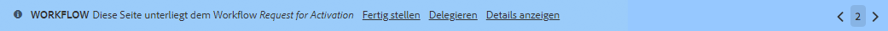
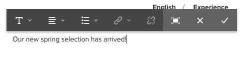
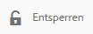

# Bearbeiten des Seiteninhalts{#editing-page-content}

Sobald Ihre Seite erstellt ist (neu oder im Rahmen eines Launch oder einer Live Copy), können Sie den Inhalt bearbeiten und die erforderlichen Aktualisierungen vornehmen.

Inhalt wird hinzugefügt mit [Komponenten](/help/sites-authoring/default-components-console.md) (entsprechend dem Inhaltstyp), der auf die Seite gezogen werden kann. Dort können sie dann bearbeitet, verschoben oder gelöscht werden.

>[!NOTE]
>
>Ihr Konto muss [angemessene Zugriffsberechtigungen](/help/sites-administering/security.md) und [Berechtigungen](/help/sites-administering/security.md#permissions) , um Seiten zu bearbeiten.
>
>Wenn Sie auf Probleme stoßen, empfehlen wir Ihnen, sich an den Systemadministrator zu wenden.

>[!NOTE]
>
>Wenn Ihre Seite und/oder Vorlage entsprechend eingerichtet ist, können Sie das [responsive Layout](/help/sites-authoring/responsive-layout.md) für die Bearbeitung verwenden.

>[!NOTE]
>
>Im **Bearbeitungsmodus** werden Links in Ihrem Inhalt angezeigt, können jedoch **nicht aufgerufen werden**. Verwenden Sie den [Vorschaumodus](#previewingpagestouchoptimizedui), wenn Sie mithilfe von Links in Ihrem Inhalt navigieren möchten.

## Seitensymbolleiste {#page-toolbar}

Die Seite-Symbolleiste bietet Zugriff auf die entsprechenden Funktionen, die von der Seitenkonfiguration abhängig sind.

Die Symbolleiste bietet Zugriff auf eine Vielzahl von Optionen. Je nach aktuellem Kontext und Ihrer Konfiguration sind einige Optionen möglicherweise nicht verfügbar.

* **Seitliches Bedienfeld ein/aus**

   Dadurch wird das seitliche Bedienfeld geöffnet/geschlossen, das die [Asset-Browser](/help/sites-authoring/author-environment-tools.md#assets-browser), [Komponenten-Browser](/help/sites-authoring/author-environment-tools.md#components-browser)und [Inhaltsstruktur](/help/sites-authoring/author-environment-tools.md#content-tree).

   

* **Seiteninformationen**

   Bietet Zugriff auf [Seiteninformationen](/help/sites-authoring/author-environment-tools.md#page-information) -Menü mit Seitendetails und Aktionen, die auf der Seite ausgeführt werden können, einschließlich Anzeigen und Bearbeiten von Seiteninformationen, Anzeigen von Seiteneigenschaften und Veröffentlichen/Rückgängigmachen der Veröffentlichung der Seite.

   

* **Emulator**

   Blendet die [Emulator-Symbolleiste](/help/sites-authoring/responsive-layout.md#selecting-a-device-to-emulate) ein bzw. aus, über die das Look-and-Feel der Seite auf einem anderen Gerät emuliert werden kann. Dies wird automatisch im Layout-Modus umgeschaltet.

   

* **ContextHub**

   Öffnet den [ContextHub](/help/sites-authoring/ch-previewing.md). Dieser ist nur im Vorschaumodus verfügbar.

   

* **Seitentitel**

   Das ist rein informativ.

   

* **Modusauswahl**

   Zeigt den aktuellen [mode](/help/sites-authoring/author-environment-tools.md#page-modes) und ermöglicht Ihnen die Auswahl eines anderen Modus wie Bearbeiten, Layout, Timewarp oder Targeting.

   

* **Vorschau**

   Aktiviert den [Vorschaumodus](/help/sites-authoring/editing-content.md#preview-mode). Dadurch wird die Seite so angezeigt, wie sie bei der Veröffentlichung erscheint.

   

* **Anmerken**

   Hierüber können Sie die Seite mit [Anmerkungen](/help/sites-authoring/annotations.md) versehen (z. B. zu Prüfungszwecken). Nach der ersten Anmerkung ändert sich das Symbol in eine Zahl, die die Anzahl der Anmerkungen auf der Seite angibt.

   

### Statusbenachrichtigung {#status-notification}

Wird eine Seite bearbeitet, die einem oder mehreren [Workflows](/help/sites-authoring/workflows.md) unterliegt, wird oben im Bildschirm eine Benachrichtigungsleiste mit einem entsprechenden Hinweis angezeigt.

>[!NOTE]
>
>Die Statusleiste ist nur für Benutzerkonten mit entsprechenden Berechtigungen sichtbar.

In der Benachrichtigung ist der Workflow aufgeführt, dem die Seite zugeordnet ist. Wenn der Benutzer am aktuellen Workflow-Schritt beteiligt ist, Optionen zum [auf den Workflow-Status](/help/sites-authoring/workflows-participating.md) und erhalten weitere Informationen zum Workflow, z. B.:

* **Fertigstellen**: Öffnet das Dialogfeld **Arbeitselement fertigstellen**.

* **Delegieren**: Öffnet das Dialogfeld **Arbeitselement fertigstellen**.

* **Details anzeigen**: Öffnet das Fenster **Details** des entsprechenden Workflows.

Das Fertigstellen und Delegieren von Workflow-Schritten über die Benachrichtigungsleiste erfolgt auf die gleiche Art und Weise wie beim [Teilnehmen an Workflows](/help/sites-authoring/workflows-participating.md) über den Benachrichtigungs-Posteingang.

Wenn die Seite mehreren Workflows unterliegt, werden in der Benachrichtigung rechts außen die Anzahl der Workflows sowie Pfeilschaltflächen angezeigt, über die Sie durch die einzelnen Workflows scrollen können.

## Komponenten-Platzhalter {#component-placeholder}

Der Komponenten-Platzhalter zeigt an, wo eine Komponente platziert wird, wenn Sie sie per Drag-and-Drop ablegen – oberhalb der Komponente, über der sich der Mauszeiger gerade befindet:

* Beim Hinzufügen einer neuen Komponente zur Seite (Ziehen aus dem Komponenten-Browser):

   

* Wenn Sie eine vorhandene Komponente verschieben:

   

## Einfügen einer Komponente {#inserting-a-component}

### Einfügen einer Komponente aus dem Komponenten-Browser {#inserting-a-component-from-the-components-browser}

Sie können eine neue Komponente mit dem [Komponenten-Browser](/help/sites-authoring/author-environment-tools.md#components-browser) hinzufügen. Der [Komponenten-Platzhalter](#component-placeholder) zeigt an, wo die Komponente platziert wird:

1. Öffnen Sie die Seite im Modus [**Bearbeiten**](/help/sites-authoring/author-environment-tools.md#page-modes).
1. Öffnen Sie den [Komponenten-Browser](/help/sites-authoring/author-environment-tools.md#components-browser).
1. Ziehen Sie die benötigte Komponente an die [passende Position](#component-placeholder).

1. [Bearbeiten](#editmovecopypastedelete) Sie die Komponente.

>[!NOTE]
>
>Auf Mobilgeräten nimmt der Komponenten-Browser den gesamten Bildschirm ein. Sobald Sie mit dem Ziehen einer Komponente beginnen, wird der Browser geschlossen, um die Seite erneut anzuzeigen, damit Sie die Komponente platzieren können.

### Einfügen einer Komponente aus dem Absatzsystem {#inserting-a-component-from-the-paragraph-system}

Sie können eine neue Komponente über das Feld **Komponenten hierher ziehen** des Absatzsystems hinzufügen.

1. Öffnen Sie die Seite im Modus [**Bearbeiten**](/help/sites-authoring/author-environment-tools.md#page-modes).
1. Es gibt zwei Möglichkeiten, eine neue Komponente aus dem Absatzsystem auszuwählen und hinzuzufügen:

   * Wählen Sie die **Komponente einfügen** Option (+) in der Symbolleiste einer vorhandenen Komponente oder der **Komponenten hierher ziehen** ankreuzen.

   

   * Wenn Sie ein Desktop-Gerät verwenden, können Sie die Aktion per Doppelklick auf das Feld **Komponenten hierher ziehen** durchführen.

   Das Dialogfeld **Neue Komponente einfügen** wird geöffnet. Dort können Sie die erforderliche Komponente auswählen:

   

1. Die ausgewählte Komponente wird unten auf der Seite hinzugefügt. [Bearbeiten](#editmovecopypastedelete) Sie bei Bedarf die Komponente.

### Einfügen einer Komponente mit dem Assets-Browser {#inserting-a-component-using-the-assets-browser}

Sie können auch eine neue Komponente zur Seite hinzufügen, indem Sie ein Asset aus dem [Asset-Browser](/help/sites-authoring/author-environment-tools.md#assets-browser). Dadurch wird automatisch eine neue Komponente des entsprechenden Typs erstellt (und das Asset enthält).

Dies gilt für folgende Asset-Typen (einige sind von der Seite/dem Absatzsystem abhängig):

<table>
 <tbody>
  <tr>
   <th><strong>Asset-Typ</strong></th>
   <th><strong>Resultierender Komponententyp</strong></th>
  </tr>
  <tr>
   <td>Bild</td>
   <td>Bild</td>
  </tr>
  <tr>
   <td>Dokument</td>
   <td>Download</td>
  </tr>
  <tr>
   <td>Produkt</td>
   <td>Produkt</td>
  </tr>
  <tr>
   <td>Video </td>
   <td>Flash</td>
  </tr>
  <tr>
   <td>Inhaltsfragment</td>
   <td>Inhaltsfragment  </td>
  </tr>
 </tbody>
</table>

>[!NOTE]
>
>Dieses Verhalten kann für Ihre Installation konfiguriert werden. Siehe [Konfigurieren eines Absatzsystems, sodass beim Ziehen eines Assets eine Komponenteninstanz erstellt wird](/help/sites-developing/developing-components.md#configuring-a-paragraph-system-so-that-dragging-an-asset-creates-a-component-instance) für weitere Informationen.

So erstellen Sie eine Komponente, indem Sie einen der obigen Asset-Typen ziehen:

1. Öffnen Sie die Seite im Modus [**Bearbeiten**](/help/sites-authoring/author-environment-tools.md#page-modes).
1. Öffnen Sie die [Asset-Browser](/help/sites-authoring/author-environment-tools.md#assets-browser).
1. Ziehen Sie das gewünschte Asset an die gewünschte Position. Der [Komponenten-Platzhalter](#component-placeholder) zeigt an, wo die Komponente platziert wird.

   Eine für den Asset-Typ geeignete Komponente wird am erforderlichen Speicherort erstellt und enthält das ausgewählte Asset.

1. [Bearbeiten](#editmovecopypastedelete) Sie bei Bedarf die Komponente.

>[!NOTE]
>
>Auf Mobilgeräten nimmt der Asset-Browser den gesamten Bildschirm ein. Sobald Sie mit dem Ziehen eines Assets beginnen, wird der Browser geschlossen, um die Seite erneut anzuzeigen, damit Sie das Asset platzieren können.

Wenn Sie beim Durchsuchen der Assets feststellen, dass Sie an einem Asset eine schnelle Änderung vornehmen müssen, können Sie die [Asset-Editor](/help/assets/manage-assets.md) durch Klicken auf das Bearbeitungssymbol neben dem Asset-Namen direkt aus dem Browser heraus.

## Bearbeiten/Konfigurieren/Kopieren/Ausschneiden/Löschen/Einfügen {#edit-configure-copy-cut-delete-paste}

Wenn Sie eine Komponente auswählen, wird die Symbolleiste geöffnet. Dort haben Sie Zugriff auf verschiedene Aktionen, die Sie auf die Komponente anwenden können.

Die tatsächlichen für den Benutzer verfügbaren Aktionen werden abhängig von der jeweiligen Situation angezeigt, sodass hier u. U. nicht alle möglichen Aktionen beschrieben werden.

* **Bearbeiten**

   [Abhängig vom Komponententyp](/help/sites-authoring/default-components.md) können Sie hierüber den [Inhalt der Komponente bearbeiten](#edit-content). Häufig wird eine Symbolleiste angezeigt.

   

* **Konfigurieren**

   [Abhängig vom Komponententyp](/help/sites-authoring/default-components.md) können Sie hierüber die Eigenschaften der Komponente bearbeiten und konfigurieren. Häufig wird ein Dialogfeld geöffnet.

   

* **Kopieren**

   Kopiert die Komponente in die Zwischenablage. Nach dem Einfügen bleibt die ursprüngliche Komponente erhalten.

   

* **Ausschneiden**

   Kopiert die Komponente in die Zwischenablage. Nach dem Einfügen wird die ursprüngliche Komponente entfernt.

   

* **Löschen**

   Dadurch wird die Komponente mit Ihrer Bestätigung von der Seite gelöscht.

   

* **Komponente einfügen**

   Dadurch wird das Dialogfeld geöffnet für [Hinzufügen einer neuen Komponente](/help/sites-authoring/editing-content.md#inserting-a-component-from-the-paragraph-system).

   

* **Einfügen**

   Fügt die Komponente aus der Zwischenablage in die Seite ein. Ob das Original erhalten bleibt, hängt davon ab, ob Sie die Kopie oder den Schnitt verwendet haben.

   * Sie können auf derselben Seite oder auf einer anderen Seite einfügen.
   * Das eingefügte Element wird über dem Element eingefügt, in dem Sie die Einfügeaktion auswählen.
   * Die Aktion Pate wird nur angezeigt, wenn sich Inhalt in der Zwischenablage befindet.

   

   >[!NOTE]
   >
   >Wenn Sie auf einer anderen Seite einfügen, die bereits vor dem Ausschneiden/Kopieren geöffnet war, müssen Sie die Seite aktualisieren, um den eingefügten Inhalt anzuzeigen.

* **Gruppe**

   Mit dieser Aktion können Sie mehrere Komponenten gleichzeitig auswählen. Dasselbe kann auf einem Desktop-Gerät durch ein **Strg+Klicken** oder **Befehl+Klicken**.

   

* **Übergeordnet**

   Ermöglicht die Auswahl der übergeordneten Komponente der ausgewählten Komponente.

   

* **Layout**

   Hierüber können Sie das [Layout](/help/sites-authoring/editing-content.md#edit-component-layout) der ausgewählten Komponente ändern. Dies gilt nur für die ausgewählte Komponente, nicht aber für die [Layout-Modus](/help/sites-authoring/author-environment-tools.md#page-modes) für die gesamte Seite.

   

* **In Experience Fragment-Variante umwandeln**

   Hierüber können Sie ein neues [Experience Fragment](/help/sites-authoring/experience-fragments.md) aus der ausgewählten Komponente erstellen oder einem bestehenden Experience Fragment hinzufügen.

   

## Bearbeiten (Inhalt) {#edit-content}

Für das Hinzufügen und/oder Bearbeiten von Inhalten in Komponenten sind zwei Verfahren verfügbar:

* Öffnen Sie die [Komponentendialogfeld für die Bearbeitung](#component-edit-dialog).
* [Ziehen Sie ein Asset](#draganddropintocomponent) aus dem Asset-Browser, um Inhalt direkt hinzuzufügen.

### Dialogfeld „Komponente bearbeiten“ {#component-edit-dialog}

Sie können eine Komponente öffnen, um den Inhalt zu bearbeiten, indem Sie das Symbol [„Bearbeiten“ (Stiftsymbol) in der Komponenten-Symbolleiste](#edit-configure-copy-cut-delete-paste) verwenden.

Welche Bearbeitungsoptionen verfügbar sind, hängt von der Komponente ab (und für einige Komponenten sind [alle Aktionen nur im Vollbildmodus verfügbar)](#edit-content-full-screen-mode). Beispiel:

* [Textkomponente](/help/sites-authoring/rich-text-editor.md#main-pars-title-24)

   

* Bildkomponente

   

   >[!NOTE]
   >
   >Die Bearbeitung funktioniert nicht bei leeren Bildkomponenten.
   >
   >
   >Sie müssen [Ziehen oder Hochladen eines Bildes (mithilfe von &quot;Konfigurieren&quot;)](/help/sites-authoring/default-components-foundation.md#image) bevor Sie mit der Bearbeitung beginnen können.

* Bildkomponente - Vollbild

   Wenn Sie den [Vollbildmodus](/help/sites-authoring/editing-content.md#edit-content-full-screen-mode) für die Bildkomponente aufrufen, haben Sie mehr Platz zum Bearbeiten des Bildes und erhalten zusätzliche Bearbeitungsoptionen wie **Map starten** und **Zoom zurücksetzen**. Außerdem können im Vollbildmodus Zuschnittvoreinstellungen ausgewählt werden.

   

* Bei Komponenten, die aus mehr als einer grundlegenden Komponente bestehen, etwa die [Basiskomponente für Text und Bild](/help/sites-authoring/default-components-foundation.md#text-image), werden Sie zunächst dazu aufgefordert, die gewünschten Bearbeitungsoptionen zu bestätigen:

   

### Drag-and-Drop von Assets in Komponenten {#drag-and-drop-assets-into-component}

Für bestimmte Komponententypen können Sie Assets aus dem Asset-Browser direkt in die Komponente ziehen, um den Inhalt zu aktualisieren:

| **Asset-Typ** | **Komponententyp** |
|---|---|
| Bild | Bild |
| Dokument | Download |
| Produkt | Produkt |
| Video  | Flash |
| Inhaltsfragment | Inhaltsfragment |

## Vollbildmodus &quot;Bearbeiten&quot;(Inhalt) {#edit-content-full-screen-mode}

Für alle Komponenten kann der Vollbildmodus über das folgende Symbol gestartet und beendet werden:

Z. B. die Komponente **Text**:

>[!NOTE]
>
>Bei einigen Komponenten stehen im Vollbildmodus mehr Optionen zur Verfügung als im integrierten Editor.

## Verschieben einer Komponente {#moving-a-component}

So verschieben Sie eine Absatzkomponente:

1. Wählen Sie den Absatz aus, der durch Tippen und Halten oder Klicken und Halten verschoben werden soll.
1. Ziehen Sie den Absatz an die neue Position. AEM gibt an, wo der Absatz hinterlegt werden kann. Legen Sie es an der gewünschten Position ab.

   

1. Der Absatz wird verschoben.

>[!NOTE]
>
>Sie können eine Komponente auch durch [Ausschneiden und Einfügen](/help/sites-authoring/editing-content.md#edit-configure-copy-cut-delete-paste) verschieben.

## Bearbeiten des Komponenten-Layouts {#edit-component-layout}

Wenn Sie eine Komponente anpassen möchten, müssen Sie nicht ständig zwischen dem Bearbeitungs- und dem [Layout-Modus](/help/sites-authoring/responsive-layout.md) hin- und herwechseln. Mithilfe der **Layout**-Aktion können Sie das Layout einer Komponente ebenfalls ändern und dabei Zeit sparen, da Sie den Bearbeitungsmodus nicht verlassen müssen.

1. In der Sites-Konsole wird durch Auswählen einer Komponente im **Bearbeitungsmodus** die zugehörige Symbolleiste für die Komponente angezeigt.

   

   Klicken bzw. tippen Sie auf die **Layout**-Aktion, um das Layout der Komponente anzupassen.

   

1. Sobald die Aktion Layout ausgewählt ist:

   * Die Größenänderungsgriffe für die Komponentenanzeige.
   * Die Emulator-Symbolleiste wird oben im Bildschirm angezeigt.
   * In der Komponenten-Symbolleiste werden Layout-Aktionen anstelle der standardmäßigen Bearbeitungsaktionen angezeigt.

   

   Jetzt können Sie Änderungen am Layout der Komponente auf die gleiche Art und Weise vornehmen wie im [Layout-Modus](/help/sites-authoring/responsive-layout.md#defining-layouts-layout-mode).

1. Wenn Sie alle Änderungen wie gewünscht vorgenommen haben, klicken Sie im Aktionsmenü der Komponente auf die Schaltfläche **Schließen**, um die Layout-Anpassung zu beenden. In der Komponenten-Symbolleiste stehen nun wieder die Standard-Bearbeitungsfunktionen zur Verfügung.

   

>[!NOTE]
>
>Die Layout-Aktion ist immer auf die jeweils ausgewählte Komponente beschränkt. Wenn Sie etwa bei einer Komponente das Layout bearbeiten und dann auf eine andere Komponente klicken, werden in der Standardsymbolleiste für die Bearbeitung (nicht in der Layout-Symbolleiste) für die neu ausgewählte Komponente angezeigt, und die Ziehpunkte für die Größenanpassung sowie die Emulator-Symbolleiste verschwinden.
>
>Um das Layout für die gesamte Seite, d. h. über mehrere Komponenten hinweg, zu bearbeiten, wechseln Sie in den [Layout-Modus](/help/sites-authoring/responsive-layout.md).

## Vererbte Komponenten {#inherited-components}

Vererbte Komponenten können sich aus diversen Szenarien ergeben, wie:

* [Multi-Site-Management](/help/sites-administering/msm.md)
* [Launch](/help/sites-authoring/launches.md) (wenn auf einer Live Copy basierend).
* Spezifische Komponenten, z. B. das vererbte Absatzsystem in Geometrixx.

Sie können die Vererbung deaktivieren (und dann wieder aktivieren). Abhängig von der Komponente kann dies über Folgendes verfügbar sein:

* **Live Copy**

   Auf der Komponentensymbolleiste, wenn sich die Komponente auf einer Seite befindet, die Teil eines Live Copy- oder Launch-Vorgangs (auf Live Copy basierend) ist. Beispiel:

   

   Die Option Vererbung abbrechen ist verfügbar:

   

   Oder aktivieren Sie die Vererbung erneut, wenn sie bereits abgebrochen wurde:

   

   Die Rollout-Aktion steht auch in der Blueprint oder in der Live Copy-Quelle zur Verfügung:

   

* **Ein geerbtes Absatzsystem**

   Das Konfigurationsdialogfeld. Beispielsweise wie beim geerbten Absatzsystem:

   

## Bearbeiten der Seitenvorlage {#editing-the-page-template}

Wenn die Seite auf einer [bearbeitbare Vorlage](/help/sites-authoring/templates.md#editable-and-static-templates)können Sie einfach zu [Vorlageneditor](/help/sites-authoring/templates.md#editing-templates-template-authors) durch Auswahl **Vorlage bearbeiten** im [Menü &quot;Seiteninformationen&quot;](/help/sites-authoring/author-environment-tools.md#page-information).

Wenn die Seite auf einer [statischen Vorlage](/help/sites-authoring/templates.md#editable-and-static-templates) basiert, können Sie auf der Symbolleiste die [Seitenmodusauswahl](/help/sites-authoring/author-environment-tools.md#page-modes) verwenden, um zum [Design-Modus](/help/sites-authoring/default-components-designmode.md) zu wechseln und Komponenten auf der Seite zu aktivieren oder zu deaktivieren.

Durch Auswählen der Seite in der [Spaltenansicht](/help/sites-authoring/basic-handling.md#column-view) oder [Listenansicht](/help/sites-authoring/basic-handling.md#list-view) können Sie schnell und einfach feststellen, auf welcher Vorlage die Seite basiert.

## Live Copy-Status {#live-copy-status}

Die [Seitenmodus &quot;Live Copy-Status&quot;](/help/sites-authoring/author-environment-tools.md#page-modes) bietet einen schnellen Überblick über den Live Copy-Status und darüber, welche Komponenten übernommen werden/nicht:

* Grüne Grenze: Übernommen
* Rosa Rahmen: Vererbung wurde abgebrochen

Beispiel:

## Hinzufügen von Anmerkungen {#adding-annotations}

[Anmerkungen](/help/sites-authoring/annotations.md) Reviewer und andere Autoren können Feedback zu Ihrem Inhalt geben. Sie werden häufig zu Überprüfungs- und Validierungszwecken verwendet.

## Anzeigen einer Seitenvorschau {#previewing-pages}

Für die Anzeige einer Seitenvorschau stehen zwei Optionen zur Verfügung:

* [Vorschaumodus](#preview-mode) – für einen schnellen Blick auf die Seite im Kontext

* [Als veröffentlicht anzeigen](#view-as-published) - eine vollständige Vorschau, die die Seite in einer neuen Registerkarte öffnet

>[!NOTE]
>
>* Links im Inhalt sind sichtbar, können jedoch nicht im Bearbeitungsmodus aufgerufen werden.
>* Verwenden Sie eine der Vorschauoptionen, wenn Sie mithilfe von Links navigieren möchten.
>* Verwenden Sie den [Tastaturbefehl](/help/sites-authoring/keyboard-shortcuts.md) `Ctrl-Shift-M` (Strg+Umschalt+M), um zwischen der Vorschau und dem zuletzt ausgewählten Modus zu wechseln.
>

>[!NOTE]
>
>Für beide Optionen wird das WCM-Modus-Cookie gesetzt.

### Vorschaumodus {#preview-mode}

Beim Bearbeiten von Inhalt können Sie mithilfe des [Vorschaumodus](/help/sites-authoring/author-environment-tools.md#page-modes) eine Vorschau der Seite anzeigen. Dieser Modus:

* Blendet diverse Bearbeitungsmechanismen aus, damit Sie einen schnellen Überblick darüber erhalten, wie die Seite veröffentlicht aussehen wird.
* Ermöglicht die Verwendung von Links zur Navigation.
* Does **not** den Seiteninhalt aktualisieren.

Bei der Bearbeitung einer Seite können Sie den Vorschaumodus über das Symbol rechts oben im Seiteneditor aufrufen:

### Als veröffentlicht anzeigen {#view-as-published}

Die **Als veröffentlicht anzeigen** -Option verfügbar über [Seiteninformationen](/help/sites-authoring/author-environment-tools.md#page-information) Menü. Dadurch wird die Seite in einer neuen Registerkarte geöffnet, der Inhalt aktualisiert und die Seite wird genau so angezeigt, wie sie in der Veröffentlichungsumgebung angezeigt wird.

## Sperren einer Seite   {#locking-a-page}

AEM bietet Ihnen die Möglichkeit, eine Seite zu sperren, sodass niemand außer Ihnen den Inhalt bearbeiten kann. Dies ist hilfreich, wenn Sie eine Vielzahl von Bearbeitungen an einer bestimmten Seite vornehmen oder wenn Sie eine Seite für eine kurze Zeit einfrieren möchten.

Eine Seite kann gesperrt werden von:

* **Sites** console

   1. Wählen Sie die Seite mit [Auswahlmodus](/help/sites-authoring/basic-handling.md#viewing-and-selecting-resources).
   1. Wählen Sie das Sperrsymbol aus.

   

* **Seiteneditor**

   1. Wählen Sie die **Seiteninformationen** -Symbol, um das Menü zu öffnen.
   1. Wählen Sie die **Seite sperren** -Option.

Nach der Sperrung werden die Informationen der Konsolenansicht aktualisiert und beim Bearbeiten wird in der Symbolleiste ein Vorhängeschlosssymbol angezeigt.

>[!CAUTION]
>
>Seiten können gesperrt werden, wenn [anstelle eines Benutzers agiert wird](/help/sites-administering/security.md#impersonating-another-user). Eine auf diese Weise gesperrte Seite kann jedoch nur dann von dem Benutzer, der stellvertretend agiert hat, oder vom Administrator entsperrt werden.
>
>Seiten lassen sich nicht stellvertretend für Benutzende entsperren, die die Seite gesperrt haben.

## Entsperren einer Seite {#unlocking-a-page}

Das Entsperren einer Seite verläuft ähnlich wie das [Sperren der Seite](#locking-a-page) – nach dem Sperren der Seite werden die Sperroptionen durch Aktionen zum Entsperren ersetzt.

Im Menü „Seiteninformationen“ steht dann die Option **Entsperren** zur Verfügung und das Vorhängeschlosssymbol in der Sites-Konsole wird durch ein **Entsperren-Symbol** ersetzt.

>[!CAUTION]
>
>Seiten können gesperrt werden, wenn [anstelle eines Benutzers agiert wird](/help/sites-administering/security.md#impersonating-another-user). Eine auf diese Weise gesperrte Seite kann jedoch nur dann von dem Benutzer, der stellvertretend agiert hat, oder vom Administrator entsperrt werden.
>
>Seiten lassen sich nicht stellvertretend für Benutzende entsperren, die die Seite gesperrt haben.

## Rückgängigmachen und Wiederholen von Seitenbearbeitungen {#undoing-and-redoing-page-edits}

Mit den folgenden Symbolen können Sie eine Aktion rückgängig machen oder wiederholen. Diese werden gegebenenfalls in der Symbolleiste angezeigt:

>[!NOTE]
>
>Mit dem [Tastaturbefehl](/help/sites-authoring/page-authoring-keyboard-shortcuts.md) `Ctrl-Z` (Strg+Z) können Sie Seitenbearbeitungen ebenfalls rückgängig machen.
>
>Analog dazu können Sie zum Wiederholen von Seitenbearbeitungen den Tastaturbefehl `Ctrl-Y` (Strg+Y) verwenden.

>[!NOTE]
>
>Siehe [Rückgängigmachen und Wiederholen von Seitenbearbeitungen - Die Theorie](#undoing-and-redoing-page-edits-the-theory); dort erfahren Sie, was beim Rückgängigmachen und Wiederholen von Seitenbearbeitungen möglich ist.

## Rückgängigmachen und Wiederholen von Seitenbearbeitungen - Die Theorie {#undoing-and-redoing-page-edits-the-theory}

>[!NOTE]
>
>Ihre bzw. Ihr Systemadmin kann [verschiedene Aspekte der Funktionen zum Rückgängig machen/Wiederholen](/help/sites-administering/config-undo.md) den Anforderungen Ihrer Instanz entsprechend konfigurieren.

AEM speichert einen Verlauf der Aktionen, die Sie ausführen, sowie die Reihenfolge der Ausführung. Sie können also mehrere Aktionen in der umgekehrten Reihenfolge ihrer Ausführung rückgängig machen und bei Bedarf die Aktionen wiederholen, wenn Sie eine oder mehrere davon erneut anwenden möchten.

Wenn ein Element auf der Inhaltsseite ausgewählt wird, gelten die Befehle „Rückgängig“ und „Wiederholen“ für das ausgewählte Element, also z. B. für eine Textkomponente.

Das Verhalten der Befehle &quot;Rückgängig&quot;und &quot;Wiederholen&quot;ähnelt dem in anderen Softwareprogrammen. Verwenden Sie die Befehle, um den aktuellen Status Ihrer Web-Seite wiederherzustellen, während Sie Entscheidungen über Inhalte treffen. Wenn Sie beispielsweise einen Textabsatz an eine Stelle auf der Seite verschoben haben, können Sie ihn mithilfe des Befehls zum Rückgängigmachen wieder zurück an die ursprüngliche Stelle verschieben. Wenn Sie dann entscheiden, dass die vorherige Position besser war, verwenden Sie den Befehl &quot;Wiederholen&quot;, um &quot;Rückgängig rückgängig zu machen&quot;.

>[!NOTE]
>
>Sie haben folgende Möglichkeiten:
>
>* Aktionen wiederholen, solange Sie seit dem Rückgängigmachen der Aktion keine Seitenbearbeitung vorgenommen haben.
>* Rückgängigmachen von maximal 20 Bearbeitungsaktionen (Standardeinstellung).
>* Auch verwenden [Tastaturbefehle](/help/sites-authoring/page-authoring-keyboard-shortcuts.md) zum Rückgängigmachen und Wiederholen.
>

Sie können die folgenden Arten von Seitenänderungen rückgängig machen und wiederholen:

* Hinzufügen, Bearbeiten, Entfernen und Verschieben von Absätzen
* Bearbeitung im Kontext von Absatzinhalten
* Kopieren, Ausschneiden und Einfügen von Elementen auf einer Seite

Für Formularfelder, die durch Formular-Komponenten erzeugt werden, dürfen beim Erstellen von Seiten keine Werte angegeben werden. Folglich haben die Befehle „Rückgängig“ und „Wiederholen“ keine Auswirkungen auf Änderungen, die Sie an den Werten dieser Komponententypen vornehmen. Sie können beispielsweise die Auswahl eines Werts in einer Dropdown-Liste nicht rückgängig machen.

>[!NOTE]
>
>Spezielle Berechtigungen sind erforderlich, um Änderungen rückgängig zu machen bzw. wiederherzustellen, die an Dateien und Bildern vorgenommen wurden.

>[!NOTE]
>
>Änderungen an Dateien und Bildern können für einen Verlauf von mindestens zehn Stunden rückgängig gemacht werden. Bei länger zurückliegenden Änderungen ist dies unter Umständen nicht mehr möglich. Ihr Administrator kann die Standardzeit von zehn Stunden ändern.
