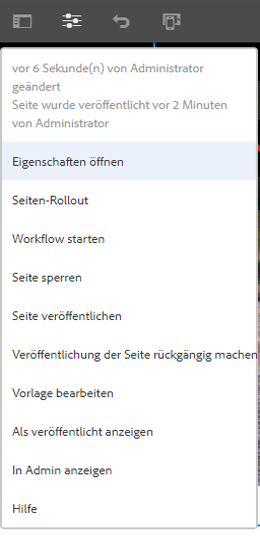
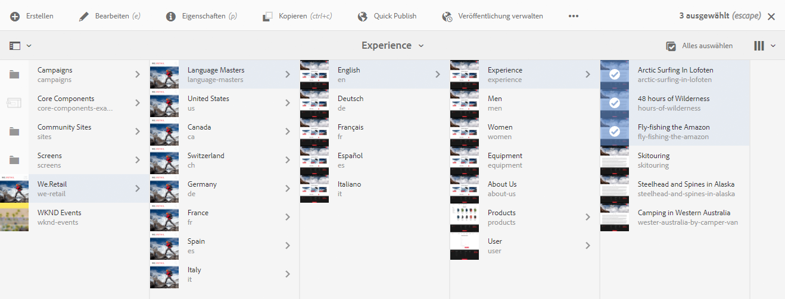
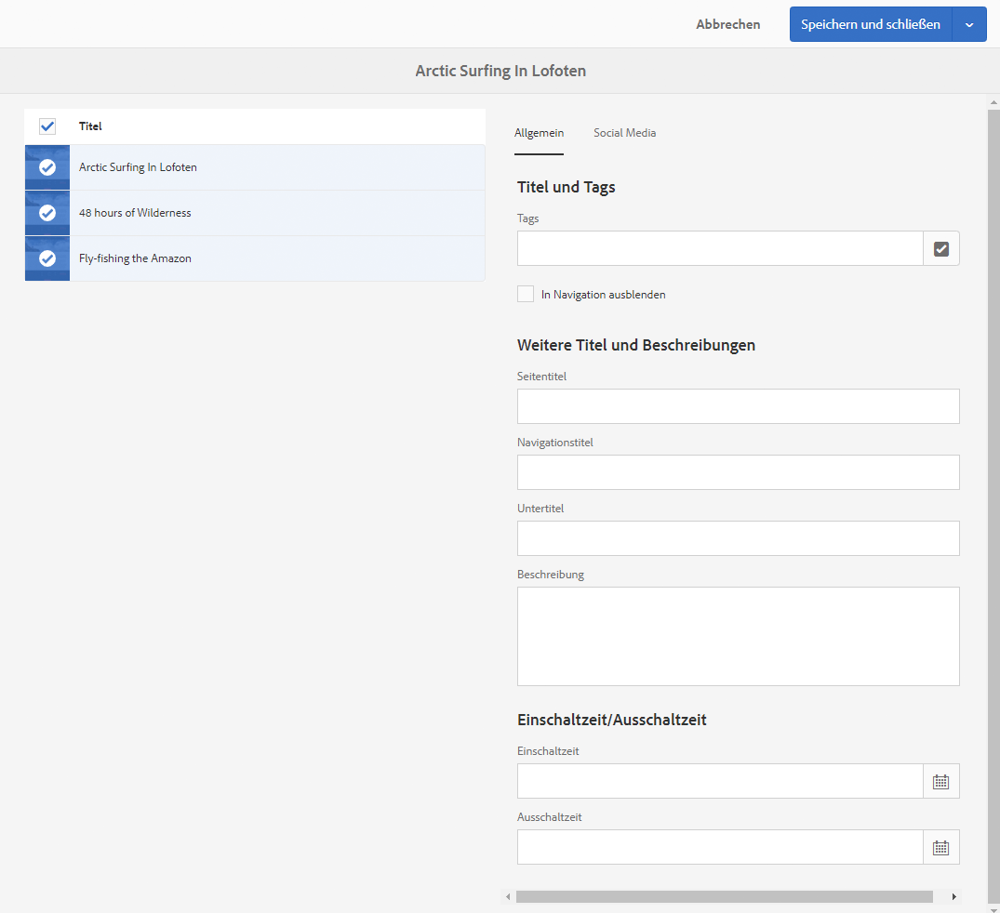

# Bearbeiten der Seiteneigenschaften{#editing-page-properties}

Sie können die erforderlichen Eigenschaften für eine Seite definieren. Diese können je nach Art der Seite variieren. Beispielsweise sind einige Seiten möglicherweise mit einer Live Copy verbunden und andere Seiten nicht. Entsprechend sind auch die Live Copy-Informationen verfügbar.

## Seiteneigenschaften {#page-properties}

Die Eigenschaften sind auf verschiedene Registerkarten verteilt.

### Allgemein {#basic}

* **Titel**

   Der Titel der Seite wird an verschiedenen Stellen angezeigt. Zum Beispiel in der Liste auf der Registerkarte **Websites** und in den Karten-/Listenansichten **Sites**.

   Dies ist ein Pflichtfeld.

* **Tags**

   Hier können Sie der Seite Tags hinzufügen (oder davon entfernen), indem Sie die Liste im Auswahlfeld aktualisieren:

   * Wenn Sie ein Tag ausgewählt haben, wird es unter dem Auswahlfeld aufgeführt. Sie können ein Tag mit dem „x“ aus dieser Liste entfernen.
   * Ein vollkommen neues Tag kann angegeben werden, indem Sie den Namen in ein leeres Auswahlfeld eingeben.

      * Das neue Tag wird erstellt, wenn Sie die Eingabetaste drücken.
      * Das neue Tag wird dann mit einem kleinen Stern auf der rechten Seite angezeigt, der es als neues Tag kennzeichnet.
   * In der Dropdown-Liste können Sie aus vorhandenen Tags auswählen.
   * Wenn Sie den Mauszeiger über ein Tag im Auswahlfeld halten, wird ein x angezeigt, mit dessen Hilfe Sie das Tag löschen können.

   Weitere Informationen zu Tags finden Sie unter [Verwenden von Tags](/help/sites-authoring/tags.md).

* **In Navigation ausblenden**

   Gibt an, ob die Seite in der Seitennavigation der resultierenden Seite ein- oder ausgeblendet sein soll.

* **Branding**

   Wenden Sie eine konsistente Markenidentität auf allen Seiten an, indem Sie einen Marken-Slug an jeden Seitentitel anhängen. Diese Funktion erfordert die Verwendung der Seitenkomponente ab Version 2.14.0 der [Kernkomponenten.](https://experienceleague.adobe.com/docs/experience-manager-core-components/using/introduction.html?lang=de)

   * **Überschreiben** – Aktivieren Sie diese Option, um den Marken-Slug auf dieser Seite zu definieren.
      * Der Wert wird von allen untergeordneten Seiten geerbt, es sei denn, deren **Überschreiben**-Werte sind auch eingestellt.
   * **Überschreibungswert** – Der Text des Marken-Slugs, der an den Seitentitel angehängt werden soll.
      * Der Wert wird nach einem Pipe-Zeichen an den Seitentitel angehängt, z. B. „Cycling Tuscany | Always ready for the WKND“.
* **Seitentitel**

   Ein Titel zur Verwendung auf der Seite. Dieser wird üblicherweise von Titel-Komponenten verwendet. Wenn dieses Feld leer bleibt, wird der **Titel** verwendet.

* **Navigationstitel**

   Sie können einen separaten Titel für die Verwendung in der Navigation angeben (z. B. wenn Sie eine kürzere Alternative wählen möchten). Wenn dieses Feld leer bleibt, wird der **Titel** verwendet.

* **Untertitel**

   Ein Untertitel zur Verwendung auf der Seite.

* **Beschreibung**

   Ihre Beschreibung der Seite, der Zweck oder beliebige andere Details, die Sie hinzufügen möchten.

* **Einschaltzeit**

   Datum und Uhrzeit der Aktivierung der veröffentlichten Seite. Nach der Veröffentlichung ruht die Seite bis zu diesem Zeitpunkt. 

   Lassen Sie diese Felder leer, wenn die Seite sofort veröffentlicht werden soll (der Normalfall).

* **Ausschaltzeit**

   Datum und Uhrzeit der Deaktivierung der veröffentlichten Seite.

   Lassen Sie diese Felder für sofortige Maßnahmen leer.

* **Vanity-URL**

   Ermöglicht die Eingabe einer Vanity-URL für diese Seite, sodass Sie eine kürzere bzw. aussagekräftigere URL verwenden können.

   Wenn die Vanity-URL beispielsweise auf `welcome`auf die Seite gesetzt ist, die durch den Pfad `/v1.0/startpage`für die Website `http://example.com,` identifiziert wird, wäre `http://example.com/welcome`die Vanity-URL von `http://example.com/content/v1.0/startpage`

   >[!CAUTION]
   >
   >Vanity-URLs:
   >
   >* müssen eindeutig sein, Sie müssen also darauf achten, dass der Wert nicht bereits von einer anderen Seite verwendet wird.
   >* unterstützen keine regex-Muster.
   >* sollten nicht auf eine vorhandene Seite eingestellt sein.

   Außerdem müssen Sie den Dispatcher konfigurieren, um den Zugriff auf Vanity-URLs zu ermöglichen. Weitere Informationen finden Sie unter [Aktivieren des Zugriffs auf Vanity-URLs](https://docs.adobe.com/content/help/en/experience-manager-dispatcher/using/configuring/dispatcher-configuration.html#enabling-access-to-vanity-urls-vanity-urls) .

* **Vanity-URL umleiten**

   Gibt an, ob für die Seite eine Vanity-URL verwendet werden soll.

### Erweitert {#advanced}

* **Sprache**

   Die Seitensprache.

* **Sprach-Stamm**

   Muss aktiviert werden, wenn die Seite als Stamm einer Sprachkopie fungiert.

* **Umleiten**

   Geben Sie eine Seite an, zu der die Seite automatisch umgeleitet werden soll.

* **Design**

   Geben Sie das [Design](/help/sites-developing/designer.md) an, das für diese Seite verwendet werden soll.

* **Alias**

   Geben Sie einen Alias an, der für diese Seite verwendet werden soll.

   * Wenn Sie beispielsweise den Alias `private` für die Seite `/content/wknd/us/en/magazine/members-only` definieren, kann auf diese Seite auch über `/content/wknd/us/en/magazine/private` zugegriffen werden.
   * Beim Erstellen eines Alias wird die `sling:alias`-Eigenschaft auf dem Seitenknoten festgelegt, die sich nur auf die Ressource und nicht auf den Repository-Pfad auswirkt.
   * Seiten, auf die über Alias im Editor zugegriffen wird, können nicht veröffentlicht werden. [Veröffentlichungsoptionen ](/help/sites-authoring/publishing-pages.md) im Editor sind nur für Seiten verfügbar, die über ihre tatsächlichen Pfade aufgerufen werden.
   * Weitere Informationen finden Sie unter [Lokalisierte Seitennamen unter Best Practices für SEO und URL-Verwaltung](/help/managing/seo-and-url-management.md#localized-page-names).

* **Vererbt von &lt;*Pfad*>**

   Gibt an, ob die Seite vererbt wurde und von wo.

* **Cloud-Konfiguration**

   Der Pfad zur Konfiguration.

* **Zugelassene Vorlagen**

   [Definieren Sie die Liste der Vorlagen, die in dieser](/help/sites-authoring/templates.md#allowingatemplate) Zweigstelle verfügbar sein werden.

* **Aktivieren** (Authentifizierungspflicht)

   Aktivieren (oder deaktivieren) Sie die Verwendung der Authentifizierung für den Zugriff auf die Seite.

   >[!NOTE]
   >
   >Geschlossene Benutzergruppen (CUGs) für die Seite werden auf der Registerkarte **[Berechtigungen](/help/sites-authoring/editing-page-properties.md#permissions)** definiert.

   >[!CAUTION]
   >
   >Die Registerkarte **[Berechtigungen](/help/sites-authoring/editing-page-properties.md#main-pars-procedure-949394300)** ermöglicht die Bearbeitung von CUG-Konfigurationen basierend auf dem Vorhandensein des `granite:AuthenticationRequired`-Mixins. Wenn Seitenberechtigungen mit veralteten CUG-Konfigurationen konfiguriert werden, die auf dem Vorhandensein der Eigenschaft `cq:cugEnabled` basieren, wird unter **Authentifizierungspflicht** eine Warnmeldung angezeigt und die Option kann nicht bearbeitet werden. Die Option [Berechtigungen](/help/sites-authoring/editing-page-properties.md#permissions) ist auch nicht bearbeitbar.
   >
   >
   >In diesem Fall müssen die CUG-Berechtigungen in der [klassischen Benutzeroberfläche](/help/sites-classic-ui-authoring/classic-page-author-edit-page-properties.md) bearbeitet werden.

* **Anmeldeseite**

   Die für die Anmeldung zu verwendende Seite.

* **Konfiguration exportieren**

   Geben Sie eine Exportkonfiguration an.

### Miniaturansicht  {#thumbnail}

Zeigt das Miniaturbild der Seite an. Sie haben folgende Möglichkeiten:

* **Vorschau generieren**

   Erstellen Sie eine Vorschau der Seite, die als Miniatur verwendet werden soll.

* **Bild hochladen**

   Laden Sie ein Bild hoch, das als Miniatur verwendet werden soll.

* **Bild auswählen**

   Wählen Sie ein vorhandenes Asset aus, das als Miniatur verwendet werden soll.

* **Zurück zur letzten Version**

   Diese Option wird verfügbar, nachdem Sie eine Änderung an der Miniatur vorgenommen haben. Wenn Sie Ihre Änderungen nicht behalten möchten, können Sie sie vor dem Speichern rückgängig machen.

### Social Media {#social-media}

* **Freigabe in Social Media**

   Definiert die auf der Seite verfügbaren Freigabeoptionen. Zeigt die Optionen an, die für die zentrale Komponente für die [Freigabe](https://helpx.adobe.com/experience-manager/core-components/using/sharing.html) zur Verfügung stehen.

   * **Benutzerfreigabe aktivieren für Facebook**
   * **Benutzerfreigabe aktivieren für Pinterest**
   * **Bevorzugte XF-Variante**
Definieren Sie die Experience Fragment-Variante, die zum Generieren von Metadaten für die Seite verwendet werden soll.

### Cloud Services {#cloud-services}

* **Cloud Services**

   Legen Sie Eigenschaften für [Cloud-Services](/help/sites-developing/extending-cloud-config.md) fest.

### Personalisierung {#personalization}

* **ContextHub-Konfigurationen**

   Wählen Sie [ContextHub Konfiguration](/help/sites-developing/ch-configuring.md) und [Segmentpfad](/help/sites-administering/segmentation.md).

* **Konfiguration für Targeting**

   Wählen Sie eine [Marke, um einen Bereich für das Targeting anzugeben](/help/sites-authoring/target-adobe-campaign.md).

   >[!NOTE]
   >Für diese Option muss das Benutzerkonto der `Target Adminstrators`-Gruppe angehören.

### Berechtigungen {#permissions}

* **Berechtigungen**

   Auf dieser Registerkarte haben Sie folgende Möglichkeiten:

   * [Berechtigungen hinzufügen](/help/sites-administering/user-group-ac-admin.md)
   * [Geschlossene Benutzergruppe bearbeiten](/help/sites-administering/cug.md#applying-your-closed-user-group-to-content-pages)

   * [Effektive Berechtigungen](/help/sites-administering/user-group-ac-admin.md) anzeigen 
   >[!CAUTION]
   >
   >Die Registerkarte **Berechtigungen** ermöglicht die Bearbeitung von CUG-Konfigurationen basierend auf dem Vorhandensein des `granite:AuthenticationRequired`-Mixins. Wenn Seitenberechtigungen mit veralteten CUG-Konfigurationen konfiguriert werden, die auf dem Vorhandensein der Eigenschaft `cq:cugEnabled` basieren, wird eine Warnmeldung angezeigt und die CUG-Berechtigungen sind nicht bearbeitbar, ebenso wenig wie die Authentifizierungspflicht auf der Registerkarte [Erweitert](/help/sites-authoring/editing-page-properties.md#advanced).
   >
   >
   >In diesem Fall müssen die CUG-Berechtigungen in der [klassischen Benutzeroberfläche](/help/sites-classic-ui-authoring/classic-page-author-edit-page-properties.md) bearbeitet werden.

   >[!NOTE]
   >
   >Die Registerkarte „Berechtigungen“ gestattet es nicht, leere CUG-Gruppen zu erstellen, was allerdings nützlich sein kann, um allen Benutzern den Zugriff zu verwehren. Verwenden Sie dazu stattdessen den CRX-Explorer. Weitere Informationen finden Sie im Dokument [Administration für Benutzer-, Gruppen- und Zugriffsberechtigungen](/help/sites-administering/user-group-ac-admin.md) .

### Blueprint {#blueprint}

* **Blueprint**

   Legen Sie Eigenschaften für eine Blueprint-Seite fest, die für die [Verwaltung mehrerer Websites](/help/sites-administering/msm.md) verwendet wird. Steuert die Umstände, unter denen Änderungen an die Live Copy propagiert werden.

### Live Copy  {#live-copy}

* **Live Copy**

   Legen Sie Eigenschaften für eine Live Copy-Seite fest, die für die [Verwaltung mehrerer Websites](/help/sites-administering/msm.md) verwendet wird. Steuert die Umstände, unter denen Änderungen von der Blueprint-Seite propagiert werden.

### Site-Struktur  {#site-structure}

* Geben Sie Links zu Seiten an, die Site-übergreifende Funktionalität bieten, z. B. **Anmeldungsseite**, **Offline-Seite** und andere.

## Bearbeiten der Seiteneigenschaften {#editing-page-properties-1}

Sie können Seiteneigenschaften an folgenden Stellen definieren:

* In der Konsole **Sites**:

   * [beim Erstellen einer neuen Seite](/help/sites-authoring/managing-pages.md#creating-a-new-page) (ein Teil der Eigenschaften)

   * durch Klicken oder Tippen auf **Eigenschaften**

      * für eine einzelne Seite
      * für mehrere Seiten (bei der Massenbearbeitung steht nur ein Teil der Eigenschaften zur Verfügung)

* Im Seiteneditor:

   * mithilfe der Option **Seiteninformationen** (anschließend **Eigenschaften öffnen**)

### In der Sites-Konsole (einzelne Seite)  {#from-the-sites-console-single-page}

durch Klicken oder Tippen auf **Eigenschaften**, um die Seiteneigenschaften festzulegen:

1. Navigieren Sie in der **Sites-Konsole** zu der Seite, für die Sie Eigenschaften anzeigen und bearbeiten möchten.

1. Wählen Sie die Option **Eigenschaften** für die gewünschte Seite aus, indem Sie wahlweise Folgendes verwenden:

   * [Schnellaktionen](/help/sites-authoring/basic-handling.md#quick-actions)
   * [Auswahlmodus](/help/sites-authoring/basic-handling.md#selectionmode)

   Die Seiteneigenschaften werden in den entsprechenden Registerkarten angezeigt.

1. Sie können die Eigenschaften nach Bedarf anzeigen oder bearbeiten.

1. Speichern Sie dann Ihre Aktualisierungen mit **Speichern** und klicken Sie danach auf **Schließen**, um zur Konsole zurückzukehren.

### Beim Bearbeiten einer Seite {#when-editing-a-page}

Beim Bearbeiten einer Seite können Sie mithilfe von **Seiteninformationen** die Seiteneigenschaften definieren:

1. Öffnen Sie die Seite, für die Sie Eigenschaften bearbeiten möchten.

1. Wählen Sie das Symbol **Seiteninformationen** aus, um das Auswahlmenü zu öffnen:

   

1. Wählen Sie **Eigenschaften öffnen** aus. Daraufhin wird ein Dialogfeld geöffnet, in dem Sie die Eigenschaften bearbeiten können, sortiert nach der entsprechenden Registerkarte. Die folgenden Schaltflächen stehen rechts in der Symbolleiste zur Verfügung:

   * **Abbrechen**
   * **Speichern und schließen**

1. Mit der Schaltfläche **Speichern und schließen** können Sie Änderungen speichern.

### In der Sites-Konsole (mehrere Seiten)  {#from-the-sites-console-multiple-pages}

In der **Sites** Console können Sie mehrere Seiten auswählen und dann die Seiteneigenschaften mithilfe der **Ansichtseigenschaften** anzeigen und/oder bearbeiten. Dies wird als Massenbearbeitung von Seiteneigenschaften bezeichnet.

>[!NOTE]
>
>Die Massenbearbeitung von Eigenschaften ist auch für Assets verfügbar. Dieses Verfahren ist sehr ähnlich, weicht aber in einigen Punkten ab. Weitere Informationen dazu finden Sie unter [Bearbeiten von Eigenschaften für mehrere Assets](/help/assets/metadata.md).
>
>Darüber hinaus steht Ihnen die [Massenbearbeitung](/help/sites-administering/bulk-editor.md) zur Verfügung. Damit können Sie mithilfe von GQL (Google Query Language) auf mehreren Seiten nach Inhalten suchen und die Inhalte anschließend direkt per Massenbearbeitung bearbeiten, bevor Sie die Änderungen an den Ursprungsseiten speichern.

Sie können mehrere Seiten zur Massenbearbeitung auf verschiedene Arten auswählen, einschließlich:

* Beim Navigieren in der **Sites-Konsole**
* Nach dem Verwenden der **Suche** zum Auffinden einer Gruppe aus Seiten

Nach Auswahl der Seiten und anschließendem Klicken oder Tippen auf die Option **Eigenschaften** werden die Masseneigenschaften angezeigt:

Sie können die Massenbearbeitung nur für Seiten durchführen, die:

* denselben Ressourcentyp verwenden
* nicht Teil einer Live Copy sind

   * Ist eine der Seiten Teil einer Live Copy, wird beim Öffnen der Eigenschaften eine Meldung angezeigt.

Nach dem Start der Massenbearbeitung können Sie folgende Aktionen ausführen:

* **Anzeigen**

   Beim Anzeigen der Seiteneigenschaften für mehrere Seiten wird Folgendes angezeigt:

   * Eine Liste der betroffenen Seiten

      * Sie können Seiten nach Bedarf auswählen/entfernen.
   * Registerkarten

      * Wie beim Anzeigen der Eigenschaften für eine einzelne Seite werden auch hier die Eigenschaften in Registerkarten angeordnet.
   * Eine Teilmenge der Eigenschaften

      * Eigenschaften, die auf allen ausgewählten Seiten verfügbar sind und explizit als für die Massenbearbeitung verfügbar definiert wurden, sind sichtbar.
      * Wenn Sie die Seitenauswahl auf eine Seite reduzieren, sind alle Eigenschaften sichtbar.
   * Gemeinsame Eigenschaften mit einem gemeinsamen Wert

      * Nur Eigenschaften mit einem gemeinsamen Wert werden im Ansichtsmodus angezeigt.
      * Wenn das Feld mehrwertig ist (z. B. Tags), werden nur Werte angezeigt, die *alle* gleich sind. Wenn nur einige gleich sind, werden diese nur bei der Bearbeitung angezeigt.

   Wenn keine Eigenschaften mit einem gemeinsamen Wert vorhanden sind, wird eine Meldung angezeigt.

* **Bearbeiten**

   Beim Bearbeiten von Seiteneigenschaften für mehrere Seiten, gilt Folgendes:

   * Sie können die Werte in den verfügbaren Feldern aktualisieren.

      * Die neuen Werte werden auf alle gewählten Seiten angewendet, wenn Sie **Fertig** wählen.
      * Wenn das Feld mehrwertig ist (z. B. Tags), können Sie einen neuen Wert anhängen oder einen gemeinsamen Wert entfernen.
   * Gemeinsame Felder, die unterschiedliche Werte auf den verschiedenen Seiten aufweisen, werden durch einen speziellen Wert angegeben, beispielsweise `<Mixed Entries>`. Bei der Bearbeitung dieser Felder ist Vorsicht geboten, um Datenverluste zu vermeiden.

>[!NOTE]
>
>Die Seitenkomponente kann so konfiguriert werden, dass die für die Massenbearbeitung verfügbaren Felder angegeben werden. Informationen dazu finden Sie unter [Konfigurieren der Seite für Massenbearbeitung von Seiteneigenschaften](/help/sites-developing/bulk-editing.md).
