# Experience Fragments{#experience-fragments}

Ein Experience Fragment ist eine Gruppe aus einer oder mehreren Komponenten (einschließlich Inhalt und Layout), die innerhalb von Seiten referenziert werden können. Diese Gruppen können jede beliebige Komponente enthalten.

Ein Experience Fragment:

* ist Teil eines Erlebnisses (Seite).
* kann übergreifend für mehrere Seiten verwendet werden.
* basiert auf einer (bearbeitbaren) Vorlage, die seine Struktur und Komponenten definiert.
* besteht aus einer oder mehreren Komponenten mit Layout innerhalb eines Absatzsystems.
* kann Experience Fragments enthalten.
* kann mit anderen Komponenten (einschließlich anderen Experience Fragments) zu einer vollständigen Seite (Erlebnis) kombiniert werden.
* kann verschiedene Varianten aufweisen, die Inhalte und/oder Komponenten gemeinsam nutzen.
* kann in Bausteine untergliedert werden, die sich übergreifend für mehrere Varianten des Fragments verwenden lassen.

Experience Fragments können in folgenden Fällen verwendet werden:

* Wenn Autoren die Teile einer Seite (die sogenannten Fragmente eines Erlebnisses) wiederverwenden möchten, müssen sie das entsprechende Fragment kopieren und an der gewünschten Stelle einfügen. Das Erstellen und Verwalten dieser zum Kopieren/Einfügen vorgesehenen Erlebnisse sind zeitaufwendige und fehleranfällige Verfahren. Mit Experience Fragments ersparen Sie sich das Kopieren/Einfügen.
* Zur Unterstützung des Nutzungsszenarios mit Headless-Content-Management-Systemen. Autoren sollten AEM nur zum Erstellen von Inhalten nutzen, jedoch nicht für deren Bereitstellung für Kunden. In diesem Fall würde das Erlebnis über ein System/einen Touchpoint eines Drittanbieters für den Endnutzer bereitgestellt.

>[!NOTE]
>
>Für den Schreibzugriff auf Experience Fragments muss das betreffende Benutzerkonto der folgenden Gruppe angehören:
>
>    `experience-fragments-editors`
Wenden Sie sich an Ihren Systemadministrator, falls Probleme auftreten.

## Wann ist die Verwendung von Experience Fragments sinnvoll?   {#when-should-you-use-experience-fragments}

Experience Fragments sollten in folgenden Fällen verwendet werden:

* Immer wenn Sie Erlebnisse wiederverwenden möchten.

   * Erlebnisse, die in Verbindung mit demselben oder ähnlichem Inhalt wiederverwendet werden

* Wenn Sie AEM als Inhaltsbereitstellungs-Plattform für Dritte nutzen möchten.

   * Nutzung durch beliebige Lösungen, bei denen AEM als Inhaltsbereitstellungs-Plattform fungieren soll
   * Einbetten von Inhalten in Touchpoints von Dritten

* Wenn ein Erlebnis verschiedene Varianten oder Ausgabeformate aufweist.

   * Kanal- oder kontextspezifische Varianten
   * Erlebnisse, die als Gruppe sinnvoll eingesetzt werden können (z. B. eine Kampagne, die abhängig vom jeweiligen Kanal unterschiedliche Erlebnisse liefert)

* Wenn Sie Omni-Channel-Commerce betreiben.

   * Skaliertes Teilen von Commerce-bezogenem Inhalt auf [Social-Media-Kanälen](/help/sites-developing/experience-fragments.md#social-variations)
   * Ermöglichen von Transaktionen an Touchpoints

## Organisieren von Experience Fragments {#organizing-your-experience-fragments}

Folgendes wird empfohlen:
* Verwenden von Ordnern zum Organisieren der Experience Fragments,

* [Konfigurieren der zulässigen Vorlagen für diese Ordner](#configure-allowed-templates-folder).

Mit dem Erstellen von Ordnern können Sie:

* eine aussagekräftige Struktur für Ihre Experience Fragments erstellen; zum Beispiel nach Klassifizierung

   >[!NOTE]
   Es ist nicht erforderlich, die Struktur Ihrer Experience Fragments an der Seitenstruktur Ihrer Site auszurichten.

* [Zuweisen der zulässigen Vorlagen auf Ordnerebene](#configure-allowed-templates-folder)

   >[!NOTE]
   Verwenden Sie den [Vorlagen-Editor](/help/sites-authoring/templates.md), wenn Sie eine eigene Vorlage erstellen möchten.

Das WKND-Projekt strukturiert einige Experience Fragments nach `Contributors`. Die verwendete Struktur zeigt auch, wie andere Funktionen, wie Multi-Site-Management (einschließlich Sprachkopien), verwendet werden können.

Siehe:

`http://localhost:4502/aem/experience-fragments.html/content/experience-fragments/wknd/language-masters/en/contributors/kumar-selveraj/master`

## Erstellen und Konfigurieren eines Ordners für Ihre Experience Fragments {#creating-and-configuring-a-folder-for-your-experience-fragments}

Um einen Ordner für Ihre Experience Fragments zu erstellen und zu konfigurieren, wird Folgendes empfohlen:

1. [Erstellen eines Ordners](/help/sites-authoring/managing-pages.md#creating-a-new-folder).

1. [Konfigurieren der die zulässigen Experience Fragment-Vorlagen für diesen Ordner](#configure-allowed-templates-folder).

>[!NOTE]
Es ist auch möglich, die [zulässigen Vorlagen für Ihre Instanz](#configure-allowed-templates-instance) zu konfigurieren. Diese Methode wird jedoch **nicht** empfohlen, da die Werte bei der Aktualisierung überschrieben werden können.

### Konfigurieren zulässiger Vorlagen für Ihren Ordner {#configure-allowed-templates-folder}

>[!NOTE]
Dies ist die empfohlene Methode zur Angabe der **zulässigen Vorlagen**, da die Werte bei der Aktualisierung nicht überschrieben werden.

1. Navigieren Sie zum gewünschten Ordner mit **Experience Fragments**.

1. Wählen Sie den Ordner und dann **Eigenschaften** aus.

1. Geben Sie den regulären Ausdruck zum Abrufen der erforderlichen Vorlagen im Feld **Zulässige Vorlagen** an.

   Beispiel:
   `/conf/(.*)/settings/wcm/templates/experience-fragment(.*)?`

   Siehe:
   `http://localhost:4502/mnt/overlay/cq/experience-fragments/content/experience-fragments/folderproperties.html/content/experience-fragments/wknd`

   

   >[!NOTE]
   Weitere Informationen finden Sie unter [Vorlagen für Experience Fragments](/help/sites-developing/experience-fragments.md#templates-for-experience-fragments).

1. Wählen Sie **Speichern und schließen** aus.

### Konfigurieren zulässiger Vorlagen für Ihre Instanz {#configure-allowed-templates-instance}

>[!CAUTION]
Es wird nicht empfohlen, die **zulässigen Vorlagen** mit dieser Methode zu ändern, da die angegebenen Vorlagen bei der Aktualisierung überschrieben werden können.
Verwenden Sie diesen Dialog nur zu Informationszwecken.

1. Navigieren Sie zur gewünschten Konsole **Experience Fragments**.

1. Wählen Sie **Konfigurationsoptionen** aus:

   

1. Geben Sie im Dialogfeld **Experience Fragments konfigurieren** die erforderlichen Vorlagen an:

   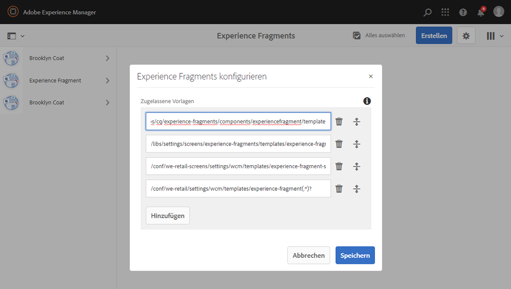

   >[!NOTE]
   Weitere Informationen finden Sie unter [Vorlagen für Experience Fragments](/help/sites-developing/experience-fragments.md#templates-for-experience-fragments).

1. Wählen Sie **Speichern** aus.

## Erstellen eines Experience Fragment {#creating-an-experience-fragment}

Gehen Sie zum Erstellen eines Experience Fragment folgendermaßen vor:

1. Wählen Sie in der globalen Navigation die Option Experience Fragments aus.

   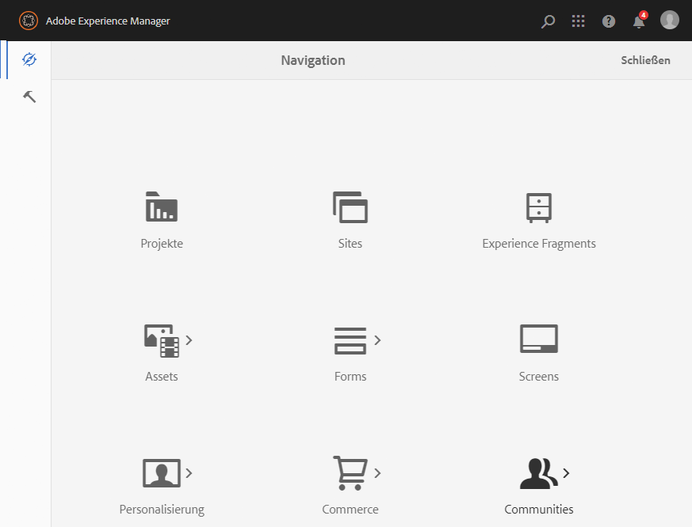

1. Navigieren Sie zum gewünschten Ordner und wählen Sie **Erstellen**.

   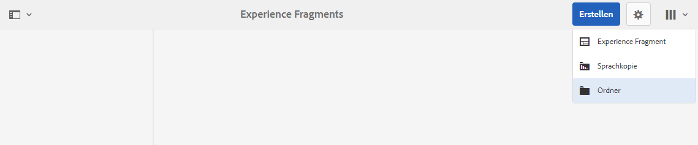

1. Wählen Sie **Experience Fragment** aus, um den Assistenten zum **Erstellen von Experience Fragments** zu öffnen.

   Wählen Sie die gewünschte Vorlage **** aus und klicken Sie auf **Weiter**:

   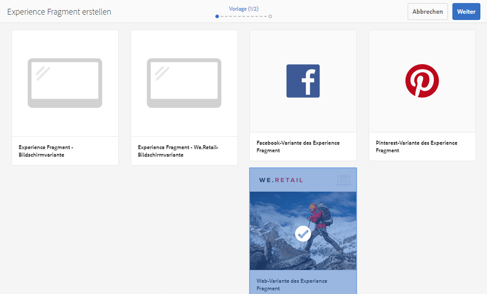

1. Geben Sie die **Eigenschaften** für das **Experience Fragment** ein.

   Sie müssen einen **Titel** angeben. Wenn Sie das Feld **Name** leer lassen, wird der Name vom **Titel** abgeleitet.

   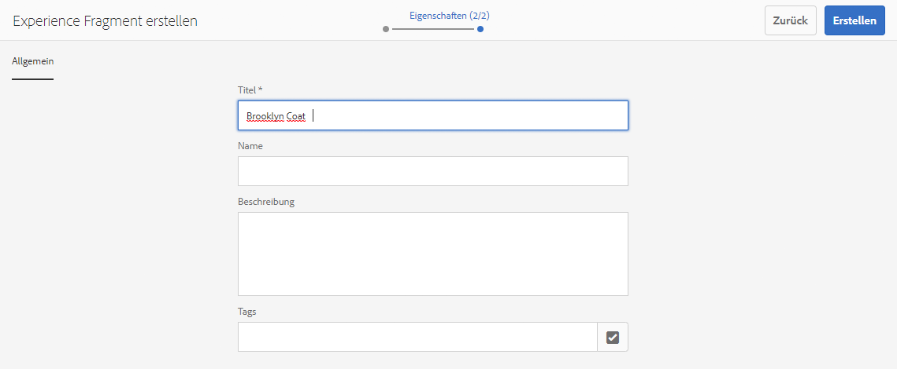

1. Klicken Sie auf **Erstellen**.

   Daraufhin wird eine Meldung angezeigt. Wählen Sie nun eine der folgenden Optionen aus:

   * **Fertig**, um zur Konsole zurückzukehren

   * **Öffnen**, um den Editor für Fragmente zu öffnen

## Bearbeiten eines Experience Fragment {#editing-your-experience-fragment}

Der Experience Fragment Editor bietet Ihnen ähnliche Funktionen wie der normale Seiten-Editor.

>[!NOTE]
Weiterführende Informationen zu dessen Verwendung finden Sie unter [Bearbeiten des Seiteninhalts](/help/sites-authoring/editing-content.md).

Die folgende Beispielvorgehensweise veranschaulicht, wie Sie Teaser für Produkte erstellen:

1. Ziehen Sie per Drag-and-Drop einen **Teaser** aus dem [Komponenten-Browser](/help/sites-authoring/author-environment-tools.md#components-browser).

   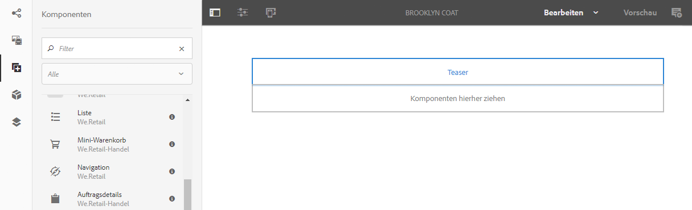

1. Wählen Sie in der Komponenten-Symbolleiste die Option **[Konfigurieren](/help/sites-authoring/editing-content.md#edit-configure-copy-cut-delete-paste)**.
1. Fügen Sie das **Asset** hinzu und definieren Sie die **Eigenschaften** nach Bedarf.
1. Bestätigen Sie die Definitionen mit der Option **Fertig** (Häkchen).
1. Fügen Sie bei Bedarf weitere Komponenten hinzu.

## Erstellen einer Experience Fragment-Variante {#creating-an-experience-fragment-variation}

Je nach Ihren Anforderungen können Sie Varianten eines Experience Fragment erstellen:

1. Öffnen Sie ein Fragment zur [Bearbeitung](/help/sites-authoring/experience-fragments.md#editing-your-experience-fragment).
1. Öffnen Sie die Registerkarte **Varianten**.

   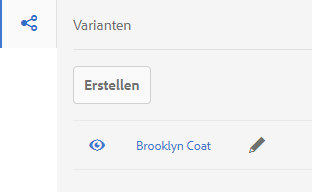

1. Die Option **Erstellen** ermöglicht es Ihnen, Folgendes zu erstellen:

   * **Variante**
   * **Variante als Live Copy**

1. Definieren Sie die gewünschten Eigenschaften:

   * **Vorlage**
   * **Titel**
   * **Name** (Wenn Sie das Feld leer lassen, wird der Name vom Titel abgeleitet.)
   * **Beschreibung**
   * **Varianten-Tags**

   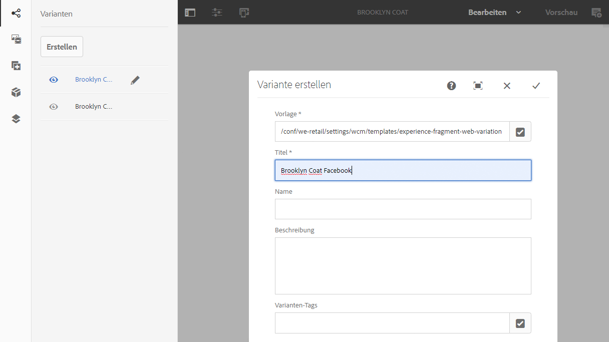

1. Bestätigen Sie Ihre Auswahl mit der Option **Fertig** (Häkchen). Daraufhin wird die neue Variante im Bedienfeld angezeigt:

   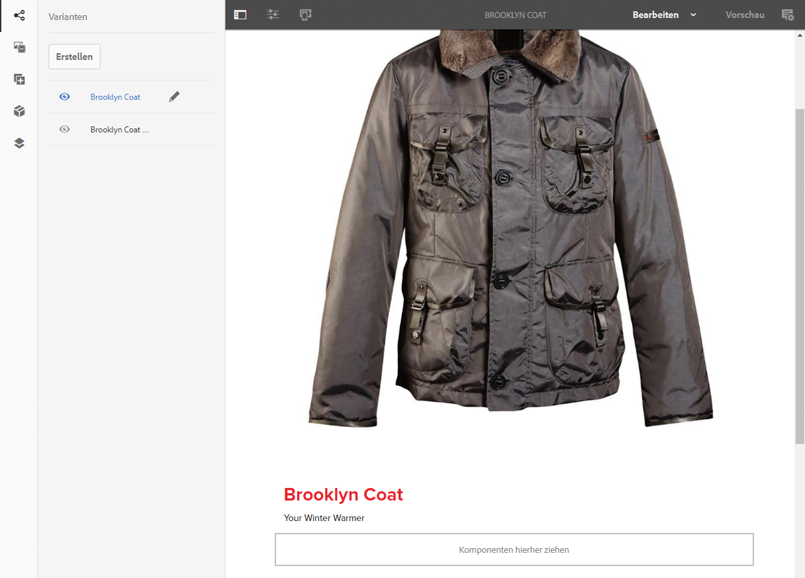

## Verwenden eines Experience Fragment {#using-your-experience-fragment}

Jetzt können Sie das Experience Fragment auf Ihren Seiten verwenden:

1. Öffnen Sie eine beliebige Seite, um sie zu bearbeiten.

   Beispiel: [https://localhost:4502/editor.html/content/we-retail/language-masters/en/products/men.html](https://localhost:4502/editor.html/content/we-retail/language-masters/en/products/men.html)

1. Erstellen Sie eine Instanz der Experience-Fragment-Komponente, indem Sie die Komponente aus dem Komponenten-Browser auf das Seitenabsatzsystem ziehen:

   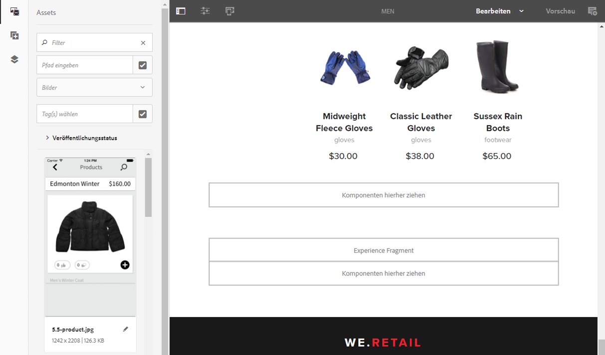

1. Fügen Sie das eigentliche Experience Fragment zur Komponenteninstanz hinzu, indem Sie einen der folgenden Schritte ausführen:

   * Ziehen Sie das gewünschte Fragment vom Asset-Browser auf die Komponente
   * Wählen Sie in der Komponenten-Symbolleiste die Option **Konfigurieren** und geben Sie das zu verwendende Fragment an. Bestätigen Sie Ihre Auswahl mit der Option **Fertig** (Häkchen).

   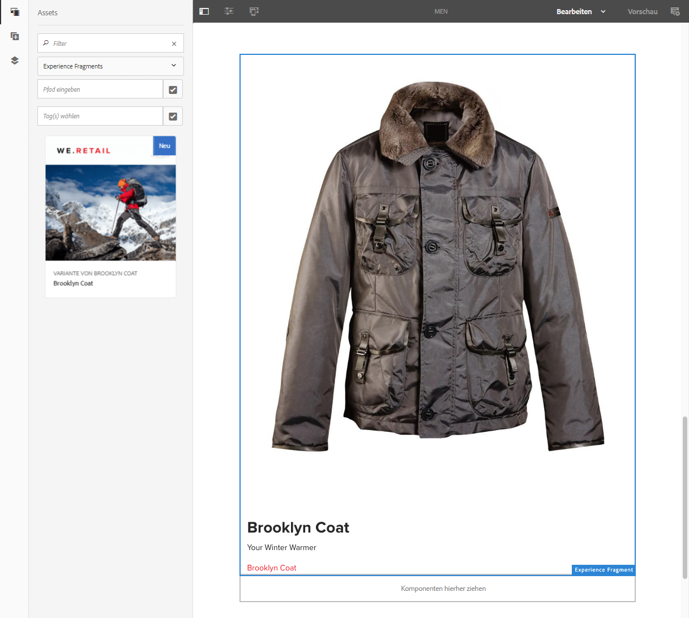

   >[!NOTE]
   In der Komponenten-Symbolleiste dient die Option „Bearbeiten“ als Kurzbefehl zum Öffnen eines Fragments im Editor für Fragmente.

## Bausteine {#building-blocks}

Sie können eine oder mehrere Komponenten auswählen, um einen Baustein zur Wiederverwendung in Ihrem Fragment zu erstellen:

### Erstellen eines Bausteins {#creating-a-building-block}

So erstellen Sie einen neuen Baustein:

1. Wählen Sie im Editor für Experience Fragments die Komponenten, die wiederverwendet werden sollen:

   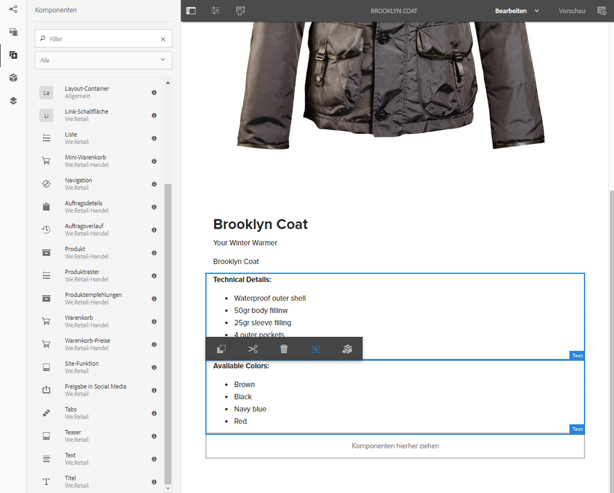

1. Wählen Sie in der Komponenten-Symbolleiste die Option **In Baustein umwandeln** aus:

   

1. Geben Sie den Namen des Bausteins **** ein und bestätigen Sie ihn mit der Option **Konvertieren**:

   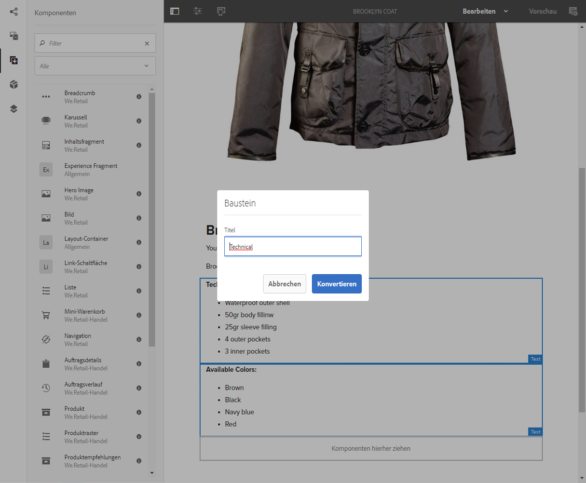

1. Der **Building-Block** wird auf der Registerkarte angezeigt und kann im Absatzsystem ausgewählt werden:

   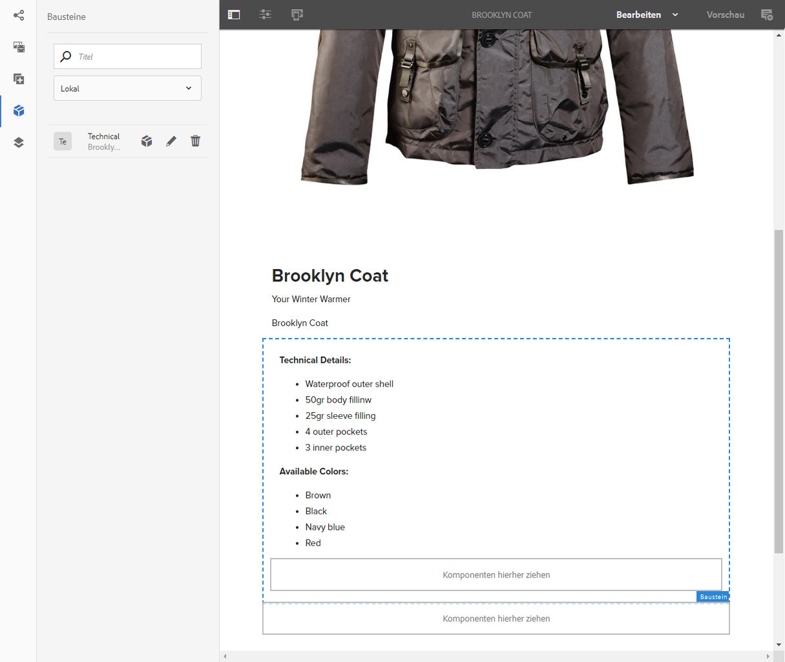

#### Verwalten eines Bausteins {#managing-a-building-block}

Der Baustein wird auf der Registerkarte **Bausteine** angezeigt. Für jeden Baustein sind die folgenden Aktionen verfügbar:

* Zum Master wechseln: zum Öffnen der Master-Variante in einer neuen Registerkarte
* Umbenennen
* Löschen

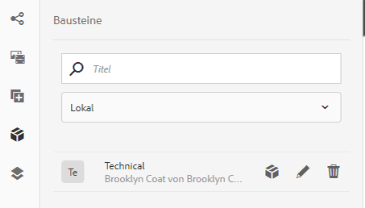

#### Verwenden eines Bausteins {#using-a-building-block}

Sie können den Baustein wie bei jeder anderen Komponente auch in das Absatzsystem eines beliebigen Fragments ziehen.

## Details Ihres Experience Fragment {#details-of-your-experience-fragment}

Details zu Ihrem Fragment können wie folgt angezeigt werden:

1. Details werden in allen Ansichten der Konsole **Experience Fragments** angezeigt. Dabei enthält die **Listenansicht**[ Details eines Exports nach Target](/help/sites-administering/experience-fragments-target.md):

   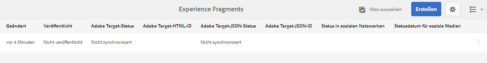

1. Beim Öffnen der **Eigenschaften** des Experience Fragment gilt Folgendes:

   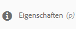

   Die Eigenschaften werden auf verschiedenen Registerkarten angezeigt:

   >[!CAUTION]
   Diese Registerkarten werden angezeigt, wenn Sie **Eigenschaften** in der Konsole „Experience Fragments“ öffnen.
   Wenn Sie beim Bearbeiten eines Experience Fragment **Eigenschaften öffnen**, werden die entsprechenden [Seiteneigenschaften](/help/sites-authoring/editing-page-properties.md) angezeigt.

   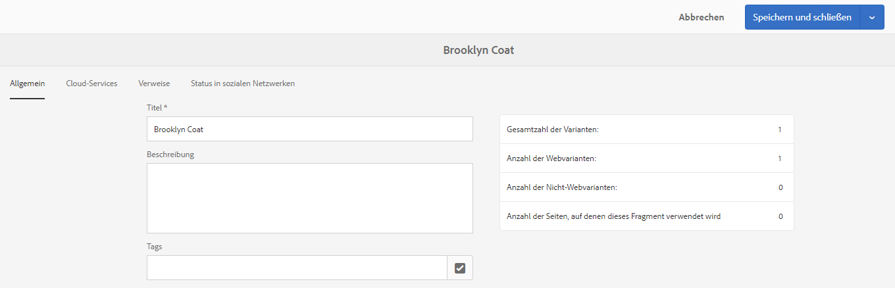

   * **Allgemein**

      * **Titel** – erforderlich

      * **Beschreibung**
      * **Tags**
      * **Gesamtanzahl der Varianten** – nur zur Information

      * **Anzahl der Web-Varianten** – nur zur Information
      * **Anzahl der Nicht-Webvarianten** – nur zur Information ****

      * **Anzahl der Seiten, auf denen dieses Fragment verwendet wird** – nur zur Information
   * **Cloud Services**

      * **Cloud-Konfiguration**
      * **Cloud Service-Konfigurationen**
      * **Facebook-Seiten-ID**
      * **Pinterest-Pinnwand**
   * **Verweise**

      * Eine Liste mit Verweisen.
   * **Social-Media-Status**

      * Details zu Social-Media-Varianten.

## Einfache HTML-Ausgabe {#the-plain-html-rendition}

Mit dem `.plain.`-Selektor in der URL können Sie auf die einfache HTML-Ausgabe des Browsers zugreifen.

>[!NOTE]
Diese ist zwar direkt über den Browser verfügbar, [aber ihr Hauptzweck ist es, anderen Applikationen (beispielsweise Web-Applikationen von Drittanbietern oder benutzerdefinierten mobilen Implementierungen) den direkten Zugriff auf den Inhalt des Experience Fragment zu ermöglichen, und zwar allein über die URL](/help/sites-developing/experience-fragments.md#the-plain-html-rendition).

## Exportieren von Experience Fragments    {#exporting-experience-fragments}

Standardmäßig werden Experience Fragments im HTML-Format bereitgestellt. Dies kann von AEM und Drittkanalanbietern gleichermaßen verwendet werden.

Für den Export nach Adobe Target kann JSON ebenfalls verwendet werden. Vollständige Informationen finden Sie unter [Target-Integration mit Experience Fragments](/help/sites-administering/experience-fragments-target.md).
