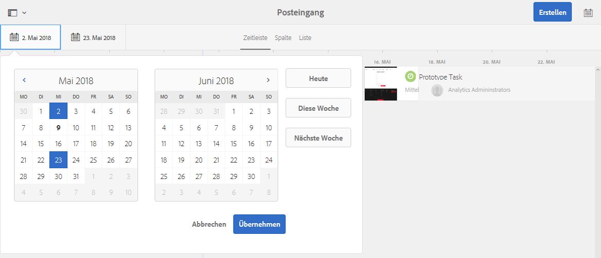

# Ihr Posteingang{#your-inbox}

Sie können Benachrichtigungen aus verschiedenen Bereichen von AEM (darunter auch aus Workflows und Projekten) u. a. zu folgenden Dingen erhalten:

* Aufgaben:

   * Diese können an diversen Stellen der Benutzeroberfläche von AEM erstellt worden sein, z. B. unter **Projekte**.
   * Sie können das Produkt eines Workflow-Schritts **Aufgabe erstellen** oder **Projektaufgabe erstellen** sein.

* Workflows:

   * Arbeitselemente, die Aktionen darstellen, die Sie für Seiteninhalte ausführen müssen.

      * Diese sind das Ergebnis von **Teilnehmer**-Workflow-Schritten

   * Fehlgeschlagene Elemente, um Admins zu ermöglichen, einen fehlgeschlagenen Schritt erneut auszuführen.

Sie erhalten diese Benachrichtigungen in Ihrem eigenen Posteingang, wo Sie sie anzeigen und dann Maßnahmen ergreifen können.

>[!NOTE]
>
>AEM enthält vorab installierte Verwaltungsaufgaben, die der Administrator-Benutzergruppe zugewiesen sind. Weitere Einzelheiten dazu finden Sie unter [Vorkonfigurierte Verwaltungsaufgaben](#out-of-the-box-administrative-tasks).

>[!NOTE]
>
>Weitere Informationen zu den Elementtypen finden Sie auch unter:
>
>* [Projekte](/help/sites-authoring/touch-ui-managing-projects.md)
>* [Projekte – Arbeiten mit Aufgaben](/help/sites-authoring/task-content.md)
>* [Workflows](/help/sites-authoring/workflows.md)
>* [Formulare](/help/forms/using/introduction-aem-forms.md)
>

## Posteingang in der Kopfzeile {#inbox-in-the-header}

In sämtlichen Konsolen wird in der Kopfzeile die Anzahl der aktuell in Ihrem Posteingang vorhandenen Elemente angezeigt. Sie können diese Anzeige auch öffnen, um schnell auf die Seiten zuzugreifen, auf denen Aktionen nötig sind, oder um den Posteingang aufzurufen.

>[!NOTE]
>
>Bestimmte Aktionen werden auch in der [Kartenansicht der jeweiligen Ressource](/help/sites-authoring/basic-handling.md#card-view) angezeigt.

## Vorkonfigurierte Verwaltungsaufgaben  {#out-of-the-box-administrative-tasks}

AEM wird mit vier vorkonfigurierten und geladenen Aufgaben ausgeliefert, die standardmäßig der Administrator-Benutzergruppe zugewiesen sind.

* [Analysen und Targeting konfigurieren](/help/sites-administering/opt-in.md)
* [AEM-Sicherheitsprüfliste anwenden](/help/sites-administering/security-checklist.md)
* Aggregierte Sammlung von Nutzungsstatistiken aktivieren
* [Konfigurieren von HTTPS](/help/sites-administering/ssl-by-default.md)

## Öffnen des Posteingangs {#opening-the-inbox}

So öffnen Sie den Benachrichtigungs-Posteingang in AEM:

1. Klicken Sie auf die Anzeige in der Symbolleiste.

1. Wählen Sie **Alle anzeigen** aus. Der **AEM-Posteingang** wird geöffnet. Im Posteingang werden Elemente aus den Bereichen Workflows, Projekte und Aufgaben angezeigt.
1. Die Standardansicht ist die [Listenansicht](#inbox-list-view), Sie können aber auch zur [Kalenderansicht ](#inbox-calendar-view)wechseln. Dies erfolgt mit der Ansichtsauswahl (Symbolleiste oben rechts).

   Für beide Ansichten können Sie auch die [Anzeigeeinstellungen](#inbox-view-settings) festlegen. Die verfügbaren Optionen hängen dabei von der aktuellen Ansicht ab.

   

>[!NOTE]
>
>Der Posteingang fungiert als Konsole. Verwenden Sie daher die [globale Navigation](/help/sites-authoring/basic-handling.md#global-navigation) oder die [Suche](/help/sites-authoring/search.md), um zu einer anderen Position zu navigieren, wenn Sie fertig sind.

### Posteingang – Listenansicht {#inbox-list-view}

In dieser Ansicht sind alle Elemente sowie deren wichtigste relevante Informationen aufgelistet:

### Posteingang – Kalenderansicht {#inbox-calendar-view}

In dieser Ansicht werden die Elemente nach Kalenderdatum und entsprechend der von Ihnen ausgewählten Kalenderansicht angezeigt.

Sie haben folgende Möglichkeiten:

* eine bestimmte Ansicht auswählen (**Zeitleiste**,**Spalte** oder **Liste**)

* festlegen, dass die Aufgaben gemäß einem **Zeitplan** angezeigt werden sollen (**Alle**, **Geplant**, **In Bearbeitung**, **Bald fällig** oder **Überfällig**)

* Drilldown für detailliertere Informationen zu einem bestimmten Element durchführen
* Einen Datumsbereich auswählen, um die Anzeige einzugrenzen:

### Posteingang – Einstellungen {#inbox-view-settings}

Für beide Ansichten (Liste und Kalender) können Sie Einstellungen festlegen:

* **Kalenderansicht**

  Für die **Kalenderansicht** können Sie Folgendes konfigurieren:

   * **Gruppieren nach**
   * **Zeitplan** oder **Ohne**
   * **Kartengröße**

  

* **Listenansicht**

  Für die **Listenansicht** können Sie den Sortiermechanismus konfigurieren:

   * **Sortierfeld**
   * **Sortierreihenfolge**

  

### Posteingang – Admin-Kontrolle {#inbox-admin-control}

Die Option „Admin-Kontrolle“ ermöglicht Admins Folgendes:

* Anpassen der Spalten des AEM-Posteingangs

* Anpassen von Kopfzeilentext und Logo

* Steuern der Anzeige von Navigations-Links in der Kopfzeile

Die Option „Admin-Kontrolle“ ist nur für die Mitglieder der Gruppen `administrators` oder `workflow-administrators` sichtbar.

* **Spaltenanpassung**: Passen Sie einen AEM-Posteingang an, indem Sie den Standardtitel einer Spalte ändern, eine Spalte neu anordnen und zusätzliche Spalten basierend auf den Daten eines Workflows anzeigen.
   * **Spalte hinzufügen**: Wählen Sie eine Spalte aus, die dem AEM-Posteingang hinzugefügt werden soll.
   * **Spalte bearbeiten**: Bewegen Sie den Mauszeiger über den Spaltentitel und wählen Sie das Symbol  aus, um einen Anzeigenamen für die Spalte einzugeben.
   * **Spalte löschen**: Wählen Sie das Symbol  aus, um die Spalte aus dem AEM-Posteingang zu löschen.
   * **Spalte verschieben**: Ziehen Sie das Symbol , um eine Spalte im AEM-Posteingang an eine neue Position zu verschieben.

  

* **Branding-Anpassung**

   * **Anpassen des Kopfzeilentextes:** Geben Sie den Text an, der in der Kopfzeile anstelle des Standardtextes **Adobe Experience Manager** angezeigt werden soll.

   * **Logo anpassen:** Geben Sie das Bild an, das in der Kopfzeile als Logo angezeigt werden soll. Laden Sie ein Bild in Digital Asset Management (DAM) hoch und verweisen Sie im Feld auf dieses Bild.

* **Benutzernavigation**
   * **Navigationsoptionen ausblenden:** Wählen Sie diese Option aus, um die Navigationsoptionen in der Kopfzeile auszublenden. Zu den Navigationsoptionen gehören Links zu anderen Lösungen, ein Hilfe-Link und die Bearbeitungsoptionen, die beim Tippen auf das Logo oder den Text „Adobe Experience Manager“ verfügbar sind.
* **Speichern:** Klicken Sie auf diese Option, um die Einstellungen zu speichern.

## Anwenden von Aktionen auf ein Element {#taking-action-on-an-item}

>[!NOTE]
>
>Obwohl es möglich ist, mehr als ein Element auszuwählen, können Aktionen immer nur für ein Element zur gleichen Zeit durchgeführt werden.

1. Um eine Aktion auf ein Element anzuwenden, wählen Sie die Miniatur des gewünschten Elements aus. In der Symbolleiste werden Symbole für die Aktionen angezeigt, die auf dieses Element anwendbar sind:

   

   Die entsprechend dem ausgewählten Element verfügbaren Aktionen können Folgendes umfassen:

   * **Fertigstellen**, z. B. eine Aufgabe oder ein Workflow-Element.
   * **Neu zuweisen**/**Delegieren** eines Elements.
   * **Öffnen** eines Elements. Je nach Elementtyp bewirkt diese Aktion Folgendes:

      * Anzeige der Elementeigenschaften
      * Öffnen des entsprechenden Dashboards oder Assistenten für weitere Aktionen
      * Aufrufen einer zugehörigen Dokumentation

   * **Schritt zurück** zu einem vorherigen Schritt.
   * Anzeigen der Payload eines Workflows.
   * Erstellen eines Projekts auf Basis des Elements.

   >[!NOTE]
   >
   >Weitere Informationen finden Sie unter:
   >
   >* Workflow-Elemente – [Teilnehmen an Workflows](/help/sites-authoring/workflows-participating.md)

1. Abhängig vom ausgewählten Element wird eine bestimmte Aktion gestartet, z. B.:

   * Ein Dialogfeld für die jeweilige Aktion wird geöffnet.
   * Ein Assistent für eine bestimmte Aktion wird gestartet.
   * Eine Dokumentationsseite wird geöffnet.

   Wird etwa die Aktion **Neu zuweisen** ausgeführt, öffnet sich ein Dialogfeld:

   

   Je nachdem, ob ein Dialogfeld, ein Assistent oder eine Dokumentationsseite geöffnet wurde, können Sie Folgendes durchführen:

   * Bestätigen Sie die entsprechende Aktion, z. B. „Neu zuweisen“.
   * Die Aktion abbrechen.
   * Den Rückwärtspfeil verwenden: Wenn beispielsweise ein Aktionsassistent oder eine Dokumentationsseite geöffnet wurde, können Sie zum Posteingang zurückkehren.

## Erstellen einer Aufgabe {#creating-a-task}

Im Posteingang können Sie Aufgaben erstellen:

1. Klicken Sie auf **Erstellen** und dann auf **Aufgabe**.
1. Füllen Sie die erforderlichen Felder auf den Registerkarten **Einfach** und **Erweitert** aus (nur der **Titel** ist obligatorisch, alle anderen Angaben sind optional):

   * **Allgemein**:

      * **Titel**
      * **Projekt**
      * **Bevollmächtigter**
      * **Inhalt**; dies dient, ähnlich wie bei der Payload, als Verweis von der Aufgabe auf eine Position im Repository.
      * **Beschreibung**
      * **Aufgabenpriorität**
      * **Startdatum**
      * **Fälligkeitsdatum**

   

   * **Erweitert**

      * **Name**: Daraus wird die URL gebildet. Wird kein Name angegeben, basiert sie auf dem **Titel**.

   

1. Klicken Sie auf **Übermitteln**.

## Erstellen eines Projekts {#creating-a-project}

Bei einigen Aufgaben besteht die Möglichkeit, auf deren Basis ein [Projekt](/help/sites-authoring/projects.md) zu erstellen.

1. Wählen Sie die entsprechende Aufgabe aus, indem Sie auf die Miniaturansicht tippen/klicken.

   >[!NOTE]
   >
   >Für die Erstellung eines Projekts können nur Aufgaben verwendet werden, die im **Posteingang** über die Option **Erstellen** erstellt wurden.
   >
   >Arbeitselemente (aus einem Workflow) können nicht für das Erstellen eines Projekts verwendet werden.

1. Wählen Sie **Projekt erstellen** aus der Symbolleiste aus, um den Assistenten zu öffnen.
1. Wählen Sie die entsprechende Vorlage aus und klicken Sie auf **Weiter**.
1. Geben Sie die erforderlichen Eigenschaften an:

   * **Allgemein**

      * **Titel**
      * **Beschreibung**
      * **Startdatum**
      * **Fälligkeitsdatum**
      * **Benutzer** und Rolle

   * **Erweitert**

      * **Name**

   >[!NOTE]
   >
   >Ausführliche Informationen finden Sie unter [Erstellen eines Projekts](/help/sites-authoring/touch-ui-managing-projects.md#creating-a-project).

1. Klicken Sie auf **Erstellen**, um die Aktion zu bestätigen.

## Filtern von Elementen im AEM-Posteingang {#filtering-items-in-the-aem-inbox}

Sie können die aufgeführten Elemente filtern:

1. Öffnen Sie den **AEM-Posteingang**.

1. Öffnen Sie die Filterauswahl:

   

1. Sie können die Elemente nach verschiedenen Kriterien filtern, wobei viele davon weiter eingegrenzt werden können, z. B.:

   

   >[!NOTE]
   >
   >Bei Verwendung der [Listenansicht](#inbox-list-view) können Sie außerdem über die [Anzeigeeinstellungen](#inbox-view-settings) die Sortierreihenfolge festlegen.
