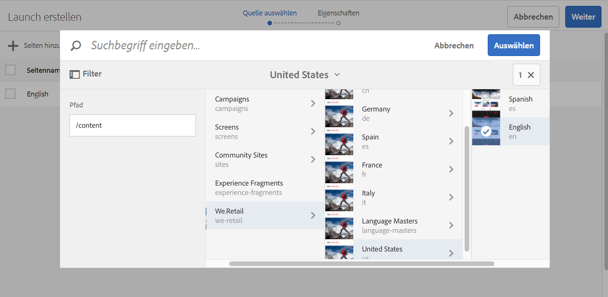
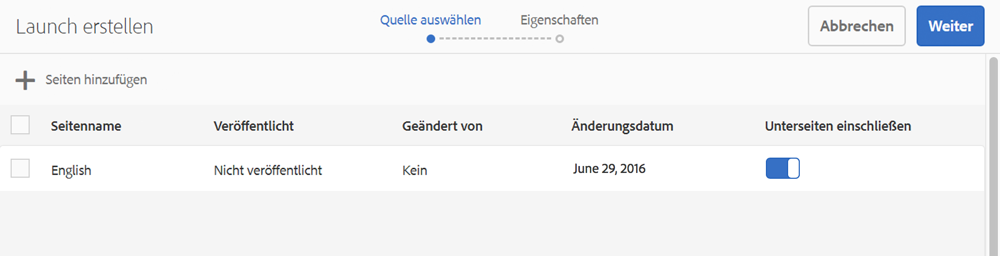
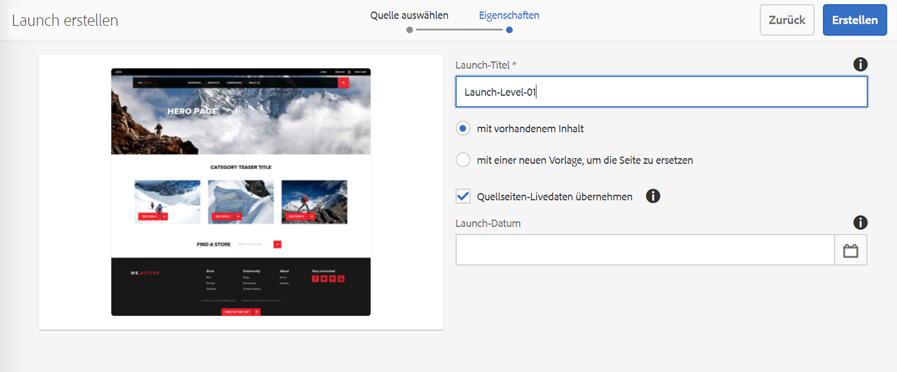
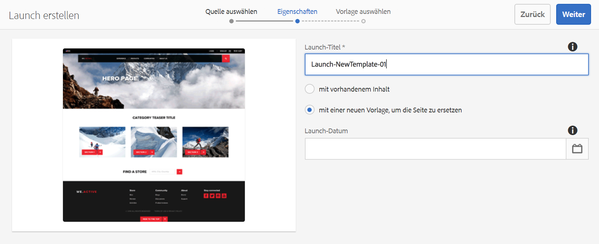
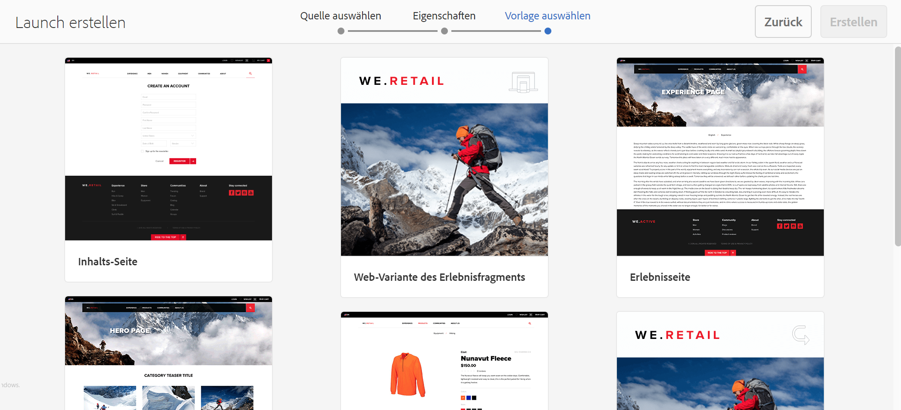
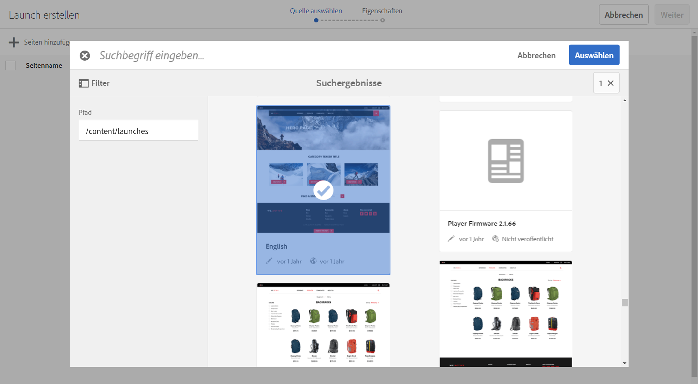
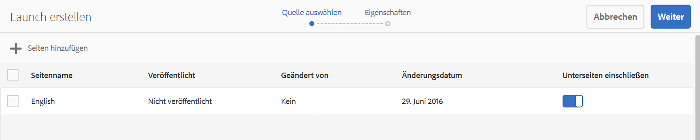

# Erstellen von Launches{#creating-launches}

Erstellen Sie einen Launch, um die Aktualisierung einer neuen Version bestehender Web-Seiten für die zukünftige Aktivierung zu aktivieren. Wenn Sie einen Launch erstellen, können Sie einen Titel und die Quellseite angeben:

* Der Titel wird in der Leiste [Verweise](/help/sites-authoring/author-environment-tools.md#references) angezeigt. Von dort aus haben Autoren Zugriff zur Bearbeitung.
* Die untergeordneten Seiten der Quellseiten werden standardmäßig in den Launch eingeschlossen. Sie können bei Bedarf nur die Quellseite verwenden.
* Standardmäßig [Live Copy](/help/sites-administering/msm.md) aktualisiert die Launch-Seiten automatisch, wenn sich die Quellseiten ändern. Zur Vermeidung automatischer Änderungen können Sie festlegen, dass eine statische Kopie erstellt wird.

Optional können Sie das **Launch-Datum** (und die Uhrzeit) für die Bewerbung und Aktivierung der Launch-Seiten angeben. Das **Launch-Datum** funktioniert allerdings nur in Kombination mit der Kennzeichnung **Produktionsbereit** (siehe [Bearbeiten einer Launch-Konfiguration](/help/sites-authoring/launches-editing.md#editing-a-launch-configuration)). Damit die Aktionen automatisch erfolgen, muss beides festgelegt werden.

## Erstellen eines Launches {#creating-a-launch}

Sie können den Launch über die Sites- oder Launches-Konsole erstellen oder starten:

1. Öffnen Sie die Konsole **Sites** oder die Konsole **Launches**.

   >[!NOTE]
   >
   >Bei Verwendung von **Sites** -Konsole ist es üblich, zum Speicherort der Quellseite zu navigieren. Dies ist jedoch nicht obligatorisch, da Sie beim Auswählen der **Launch-Quelle** im Assistenten.

1. Je nach verwendeter Konsole:

   * **Launches**:

      1. Auswählen **Launch erstellen** in der Symbolleiste, um den Assistenten zu öffnen.
   * **Sites**:

      1. Wählen Sie in der Symbolleiste **Erstellen** aus, um das Auswahlfeld zu öffnen.
      1. Wählen Sie dann **Launch erstellen** aus, um den Assistenten zu öffnen.

   >[!NOTE]
   >
   >In der **Sites**-Konsole können Sie auch den [Auswahlmodus](/help/sites-authoring/basic-handling.md#viewing-and-selecting-resources) verwenden, um eine Seite auszuwählen, bevor Sie **Erstellen** auswählen.
   >
   >Dadurch wird die ausgewählte Seite als Anfangsquellseite verwendet.

1. Im Schritt **Quelle auswählen** müssen Sie **Seiten hinzufügen**. Sie können mehrere Seiten auswählen, wobei jeweils der Pfad angegeben werden muss:

   * Navigieren Sie zur erforderlichen Position.
   * Wählen Sie die Quellseite(n) aus und bestätigen Sie (durch Häkchen).

   Wiederholen Sie dies nach Bedarf.

   

   >[!NOTE]
   >
   >Um Seiten und/oder Verzweigungen zu einem Launch hinzuzufügen, müssen sie sich auf einer Site befinden. d. h. unterhalb eines gemeinsamen Stammverzeichnisses der obersten Ebene.
   >
   >Wenn eine Site Sprachstämme unterhalb der obersten Ebene enthält, müssen die Seiten und Verzweigungen für einen Launch unter einem gemeinsamen Sprachstamm liegen.

1. Für jeden Eintrag können Sie angeben, ob:

   * **Unterseiten einschließen**:

      * Geben Sie an, ob der Launch mit den oder ohne die untergeordneten Seiten erstellt werden soll.  Standardmäßig werden Unterseiten eingeschlossen.

   Fahren Sie mit **Weiter** fort.

   

1. Im Schritt **Eigenschaften** des Assistenten können Sie Folgendes festlegen:

   * **Launch-Titel**: Der Name des Launches. Der Name sollte für Autoren aussagekräftig sein.
   * **mit vorhandenem Inhalt**: Der ursprüngliche Inhalt wird verwendet, um den Launch zu erstellen.
   * **mit einer neuen Vorlage, um die Seite zu ersetzen**: Weitere Einzelheiten erfahren Sie unter [Erstellen von Launches mit einer neuen Vorlage](#create-launch-with-new-template).
   * **Quellseiten-Live-Daten übernehmen**: Wählen Sie diese Option aus, um den Inhalt von Launch-Seiten automatisch zu aktualisieren, wenn die Quellseiten sich ändern. Zu diesem Zweck macht die Option den Launch zu einer [Live Copy](/help/sites-administering/msm.md).

      Standardmäßig ist diese Option aktiviert.

   * **Launch-Datum**: Das Datum und die Uhrzeit für die Aktivierung der Launch-Kopie (abhängig von der Markierung **Produktionsbereit**. Siehe [Launches: Reihenfolge von Ereignissen](/help/sites-authoring/launches.md#launches-the-order-of-events)).

   

1. Verwendung **Erstellen** , um den Prozess abzuschließen und Ihren neuen Launch zu erstellen. Im Bestätigungsdialogfeld werden Sie gefragt, ob Sie den Launch sofort öffnen möchten.

   Wenn Sie die Konsole zurückgeben (mit **Fertig**) können Sie Ihren Launch über Folgendes anzeigen (und darauf zugreifen):

   * in der [**Launch-Konsole**](/help/sites-authoring/launches.md#the-launches-console)
   * unter [**Verweise** in der Konsole **Sites**](/help/sites-authoring/launches.md#launches-in-references-sites-console)

### Erstellen von Launches mit einer neuen Vorlage {#create-launch-with-new-template}

Wann [Erstellen eines Launches](/help/sites-authoring/launches-creating.md#create-launch-with-new-template) Sie können auswählen, ob eine neue Vorlage verwendet werden soll:

**mit einer neuen Vorlage, um die Seite zu ersetzen**

>[!CAUTION]
>
>Diese Option ist nur verfügbar, wenn ein Launch über die Konsole **Sites** erstellt wird. Sie steht nicht zur Verfügung, wenn ein Launch über die Konsole **Launches** erstellt wird.

Die Auswahl dieser Option bewirkt Folgendes:

* die anderen verfügbaren Optionen werden aktualisiert,
* ein neuer Schritt wird einbezogen, mit dem Sie die gewünschte Vorlage auswählen können.

>[!CAUTION]
>
>Da eine andere Vorlage verwendet wird, ist die neue Seite leer. Aufgrund der unterschiedlichen Seitenstruktur wird kein Inhalt kopiert.
>
>Dieser Mechanismus kann verwendet werden, um die Vorlage einer [vorhandenen Seite](/help/sites-authoring/managing-pages.md#creating-a-new-page) zu ändern, wobei jedoch der Verlust von Inhalten zu berücksichtigen ist.

### Erstellen von verschachtelten Launches {#creating-a-nested-launch}

Das Erstellen eines verschachtelten Launches (eines Launches innerhalb eines Launches) bietet Ihnen die Möglichkeit, einen Launch aus einem vorhandenen Launch zu erstellen, sodass Autoren bereits vorgenommene Änderungen nutzen können, anstatt dieselben Änderungen für jeden Launch erneut vornehmen zu müssen.

>[!NOTE]
>
>Siehe auch [Weiterleiten eines verschachtelten Launches](/help/sites-authoring/launches-promoting.md#promoting-a-nested-launch).

#### Erstellen von verschachtelten Launches: Konsole „Launches“  {#creating-a-nested-launch-launches-console}

Das Erstellen eines verschachtelten Launches über die Konsole **Launches** ist im Wesentlichen das Gleiche wie das Erstellen jeder anderen Form eines Launches mit der Ausnahme, dass Sie zu der Launch-Verzweigung `/content/launches` navigieren müssen:

1. Wählen Sie in der Konsole **Launches** die Option **Erstellen** aus.
1. Wählen Sie **Seiten hinzufügen** aus und navigieren Sie zur Launch-Verzweigung, indem Sie `/content/launches` im Filter angeben. Wählen Sie den gewünschten Launch aus und bestätigen Sie mit **Auswählen**:

   

1. Klicken Sie auf **Weiter**, um fortzufahren. Geben Sie die **Eigenschaften** dann wie bei jedem anderen Launch an.

   

#### Erstellen von verschachtelten Launches: Konsole „Sites“  {#creating-a-nested-launch-sites-console}

So erstellen Sie einen verschachtelten Launch auf Grundlage eines vorhandenen Launches über die Konsole **Sites**:

1. Rufen Sie [Launches aus Verweisen (Konsole „Sites“)](/help/sites-authoring/launches.md#launches-in-references-sites-console) auf, um die verfügbaren Aktionen anzuzeigen.
1. Wählen Sie **Launch erstellen** aus, um den Assistenten zu öffnen (da die Quelle bereits ausgewählt wurde, wird der Schritt **Quelle auswählen** übersprungen).

1. Geben Sie den **Launch-Titel** und jegliche weiteren erforderlichen Details ein (wie bei einem normalen Launch).

1. Verwendung **Erstellen** , um den Prozess abzuschließen und Ihren neuen Launch zu erstellen. Im Bestätigungsdialogfeld werden Sie gefragt, ob Sie den Launch sofort öffnen möchten.

   Bei Auswahl von **Fertig** wird erneut die Leiste **Verweise** der Konsole **Sites** angezeigt. Bei Auswahl der entsprechenden Seite wird der neue Launch angezeigt.

### Löschen von Launches {#deleting-a-launch}

Sie können einen Launch aus dem [Launches-Konsole](/help/sites-authoring/launches.md#the-launches-console):

* Wählen Sie den Launch aus, indem Sie auf die Miniaturansicht tippen/klicken.
* Die Symbolleiste wird angezeigt. Wählen Sie Löschen aus.
* Bestätigen Sie die Aktion.

>[!CAUTION]
>
>Durch Löschen eines Launches werden der Launch selbst sowie alle nachfolgenden verschachtelten Launches entfernt.
