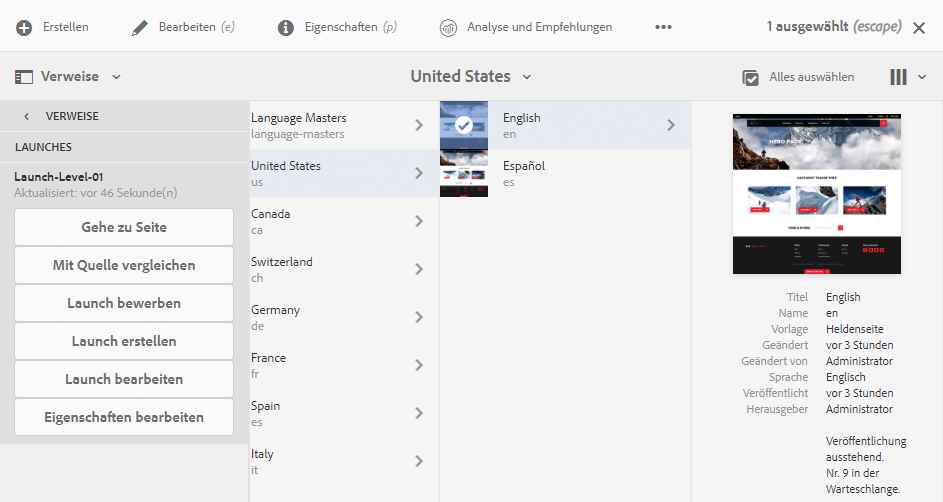

# Bearbeiten von Launches{#editing-launches}

## Bearbeiten von Launch-Seiten {#editing-launch-pages}

Wenn ein Launch für eine Seite (oder eine Reihe von Seiten) erstellt wurde, können Sie den Inhalt in der Launch Copy der Seiten bearbeiten.

1. Rufen Sie [Launches aus Verweisen (Konsole „Sites“)](/help/sites-authoring/launches.md#launches-in-references-sites-console) auf, um die verfügbaren Aktionen anzuzeigen.
1. Auswählen **Navigieren Sie zur Seite** , um die Seite zur Bearbeitung zu öffnen.

>[!NOTE]
>
>Es ist nicht zulässig, eine Seite innerhalb eines Launchs zu verschieben. Der Versuch, diese Aktion auszuführen, löst eine Warnmeldung aus:
>
>* Warnung: Bei dieser Seite handelt es sich um die Quellseite eines Launches. Das Verschieben der Seite ist nicht zulässig.

### Bearbeiten von Launch-Seiten auf der Basis einer Live Copy {#editing-launch-pages-subject-to-a-live-copy}

Wenn Ihr Launch auf einer [Live Copy](/help/sites-administering/msm.md) dann werden Sie:

* Schlosssymbole (kleine Vorhängeschlösser) beim Bearbeiten einer Komponente (Inhalt und/oder Eigenschaften) anzeigen.
* sehen Sie die **Live Copy** Registerkarte in **Seiteneigenschaften**

Eine Live Copy wird verwendet, um Inhalte *von* der Quellverzweigung *mit* Ihrer Launch-Verzweigung zu synchronisieren (um Ihren Launch mit den Änderungen an der Quelle zu aktualisieren).

Sie können Änderungen auf dieselbe Weise vornehmen wie eine standardmäßige Live Copy. Beispiel:

* Durch Klicken auf ein geschlossenes Schloss wird die Synchronisierung unterbrochen und Sie haben die Möglichkeit, neue Aktualisierungen am Inhalt Ihres Launches vorzunehmen. Nach dem Entsperren (Vorhängeschloss öffnen) werden Ihre Änderungen nicht durch Änderungen überschrieben, die an derselben Stelle innerhalb des Quellzweigs vorgenommen werden.
* Sie können die Vererbung für eine bestimmte Seite **aussetzen** (und **fortsetzen**).

Siehe [Ändern des Live-Copy-Inhalts](/help/sites-administering/msm-livecopy.md#changing-live-copy-content).

## Vergleichen einer Launch-Seite mit ihrer Quellseite {#comparing-a-launch-page-to-its-source-page}

Um die vorgenommenen Änderungen zu verfolgen, können Sie den Launch in **Referenzen** anzeigen und die Launch- mit der Quellseite vergleichen:

1. Im **Sites** Konsole, [Navigieren Sie zur Quellseite Ihres Launches und wählen Sie sie aus.](/help/sites-authoring/basic-handling.md#viewingandselectingyourresources).
1. Öffnen Sie die **[Verweise](/help/sites-authoring/basic-handling.md#references)** Bedienfeld und wählen Sie **Starts**.
1. Wählen Sie den gewünschten Launch aus und **Mit Quelle vergleichen**:

   

1. Die beiden Seiten (Start und Quelle) werden nebeneinander geöffnet.

   Umfassende Informationen zur Verwendung dieser Funktion finden Sie unter [Seitenvergleich](/help/sites-authoring/page-diff.md).

## Ändern der verwendeten Quellseiten {#changing-the-source-pages-used}

Sie können jederzeit Seiten zum Bereich der Quellseiten für einen Launch hinzufügen oder daraus entfernen:

1. Sie können auf den Launch wie folgt zugreifen und ihn auswählen:

   * über die [Konsole „Launches“](/help/sites-authoring/launches.md#the-launches-console):

      * Wählen Sie **Bearbeiten** aus.
   * [Verweise (Sites-Konsole)](/help/sites-authoring/launches.md#launches-in-references-sites-console) um die verfügbaren Aktionen anzuzeigen:

      * Wählen Sie **Launch bearbeiten** aus.

   Die Quellseiten werden angezeigt.

1. Nehmen Sie die erforderlichen Änderungen vor und bestätigen Sie dann mit **Speichern**.

   >[!NOTE]
   >
   >Um Seiten zu einem Launch hinzuzufügen, müssen sie sich unter einem gemeinsamen Sprachstamm befinden. d. h. innerhalb einer einzelnen Site.

## Bearbeiten einer Launch-Konfiguration {#editing-a-launch-configuration}

Sie können die Eigenschaften für einen Launch jederzeit bearbeiten:

1. Sie können auf den Launch wie folgt zugreifen und ihn auswählen:

   * über die [Konsole „Launches“](/help/sites-authoring/launches.md#the-launches-console):

      * Auswählen **Eigenschaften**.
   * [Verweise (Sites-Konsole)](/help/sites-authoring/launches.md#launches-in-references-sites-console) um die verfügbaren Aktionen anzuzeigen:

      * Wählen Sie **Eigenschaften bearbeiten** aus.

   Die Details werden angezeigt.

1. Nehmen Sie die erforderlichen Änderungen vor und bestätigen Sie dann mit **Speichern**.

   Unter [Launches – Reihenfolge der Ereignisse](/help/sites-authoring/launches.md#launches-the-order-of-events) finden Sie Informationen zum Zweck und zur Interaktion der Felder **Launch-Datum** und **Bereit für Produktion**.

## Ermitteln des Launch-Status einer Seite {#discovering-the-launch-status-of-a-page}

Der Status wird angezeigt, wenn Sie einen bestimmten Launch auf der Registerkarte „Verweise“ auswählen (siehe [Launches in Verweisen (Sites-Konsole))](/help/sites-authoring/launches.md#launches-in-references-sites-console).

