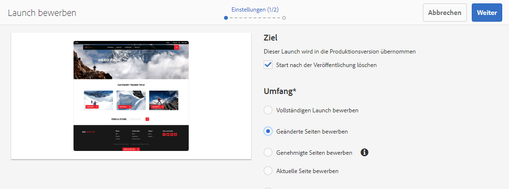
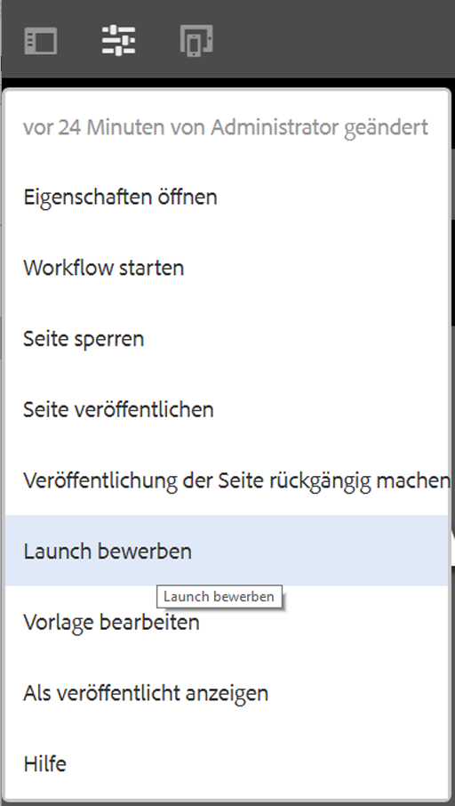
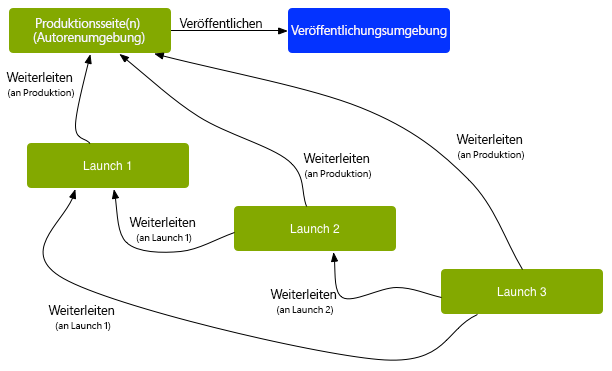
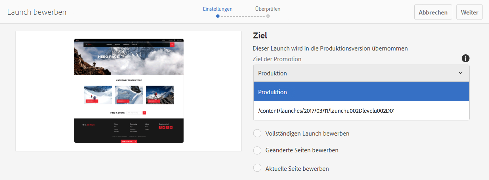
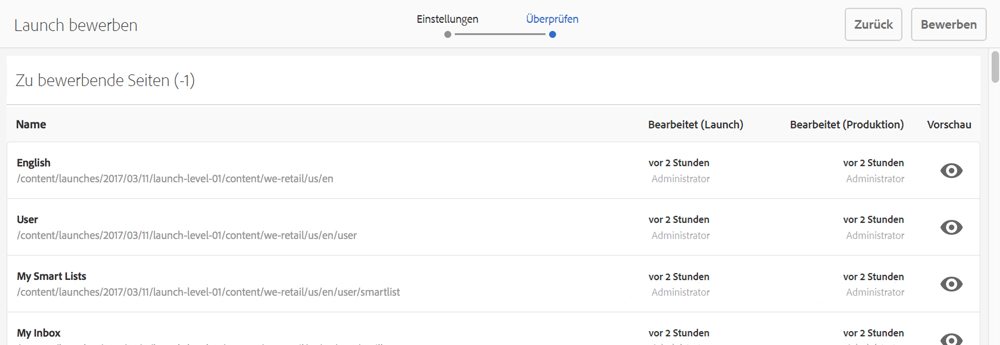
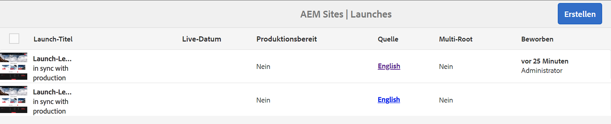
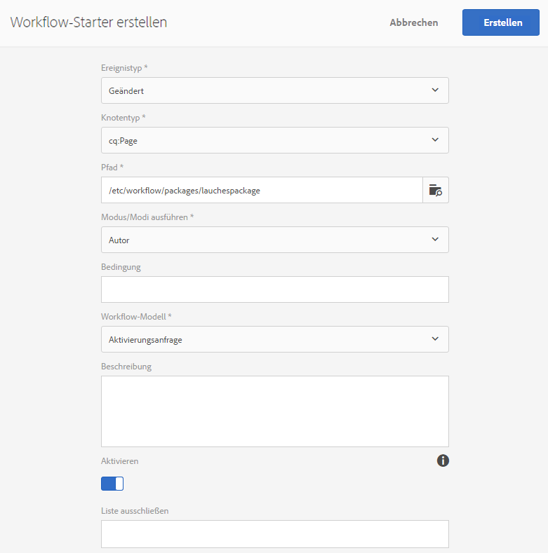

# Weiterleiten von Launches{#promoting-launches}

Sie müssen Launch-Seiten weiterleiten (bewerben), damit der Inhalt vor der Veröffentlichung wieder in die Quelle (Produktion) verschoben wird. Beim Weiterleiten einer Launch-Seite wird die entsprechende Seite der Quellseiten mit dem Inhalt der weitergeleiteten Seite aktualisiert. Die folgenden Optionen sind beim Weiterleiten einer Launch-Seite verfügbar:

* Soll nur die aktuelle Seite weitergeleitet werden oder der gesamte Launch?
* Sollen die untergeordneten Seiten der aktuellen Seite weitergeleitet werden?
* Soll der vollständige Launch weitergeleitet werden oder die nur Seiten, die geändert wurden?
* Ob der Launch nach der Promotion gelöscht werden soll.

>[!NOTE]
>
>Wenn Sie die Launch-Seiten an das Ziel (**Produktion**) weitergeleitet haben, können Sie die **Produktionsseiten** als Entität aktivieren (um den Vorgang zu beschleunigen). Fügen Sie die Seiten einem Workflow-Paket hinzu und verwenden Sie es als Payload für einen Workflow, der ein Paket mit Seiten aktiviert. Sie müssen das Workflow-Paket erstellen, bevor Sie den Launch weiterleiten. Siehe [Bearbeiten weitergeleiteter Seiten mit einem AEM-Workflow](#processing-promoted-pages-using-aem-workflow).

>[!CAUTION]
>
>Es ist nicht möglich, einen einzelnen Launch gleichzeitig mehrfach weiterzuleiten. Dies bedeutet, dass zwei gleichzeitig ausgeführte Weiterleitungen für denselben Launch einen Fehler verursachen können: `Launch could not be promoted` (zusammen mit Konfliktfehlern im Protokoll).

>[!CAUTION]
>
>Beim Weiterleiten von Launches für *geänderte* Seiten werden Anpassungen sowohl im Quell- als auch im Launch-Zweig berücksichtigt.

## Weiterleiten von Launch-Seiten {#promoting-launch-pages}

>[!NOTE]
>
>Informationen zur manuellen Weiterleitung von Launch-Seiten, wenn es nur eine Launch-Ebene gibt. Siehe:
>
>* [Weiterleiten eines verschachtelten Launches](#promoting-a-nested-launch), wenn die Struktur mehrere Launches enthält.
>* [Der Ablauf eines Launches](/help/sites-authoring/launches.md#launches-the-order-of-events) für weitere Informationen zur automatischen Weiterleitung und Veröffentlichung.

>

Sie können Launches entweder über die Konsole **Sites** oder die Konsole **Launches** weiterleiten:

1. Öffnen Sie:

   * die Konsole **Sites**:

      1. Öffnen Sie die Leiste [Verweise](/help/sites-authoring/author-environment-tools.md#showingpagereferences) und wählen Sie die gewünschte Quellseite mithilfe des [Auswahlmodus](/help/sites-authoring/basic-handling.md) aus. (Oder wählen Sie die Seite aus und öffnen die Verweisleiste. Die Reihenfolge ist nicht wichtig.) Alle Verweise werden angezeigt.

      1. Wählen Sie **Launches** aus (z. B. „Launches (1)“), um eine Liste der Launches anzuzeigen.
      1. Wählen Sie den gewünschten Launch aus, damit die verfügbaren Aktionen angezeigt werden.
      1. Wählen Sie **Launch bewerben** aus, um den Assistenten zu öffnen.
   * die Konsole **Launches**:

      1. Wählen Sie den Launch aus (indem Sie auf die Miniatur tippen/klicken).
      1. Wählen Sie **Bewerben** aus.

1. Im ersten Schritt können Sie folgende Optionen festlegen:

   * **Ziel**

      * **Launch nach der Veröffentlichung löschen**
   * **Umfang**

      * **Vollständigen Launch bewerben**
      * **Geänderte Seiten bewerben**
      * **Aktuelle Seite bewerben**
      * **Aktuelle Seite und Unterseiten bewerben**

   Wenn beispielsweise nur geänderte Seiten weitergeleitet werden sollen:

   

   >[!NOTE]
   >
   >Hier wird ein individueller Launch beschrieben. Informationen zu verschachtelten Launches finden Sie unter [Weiterleiten eines verschachtelten Launches](#promoting-a-nested-launch).

1. Klicken Sie auf **Weiter**, um den Vorgang fortzusetzen.
1. Sie können die weiterzuleitenden Seiten überprüfen. Diese Überprüfung hängt vom ausgewählten Seitenbereich ab:

   

1. Wählen Sie **Bewerben** aus.

## Weiterleiten von Launch-Seiten bei der Bearbeitung   {#promoting-launch-pages-when-editing}

Wenn Sie eine Launch-Seite bearbeiten, steht die Aktion **Launch bewerben** auch im Bereich **Seiteninformationen** zur Verfügung. Dadurch wird der Assistent geöffnet, um die benötigten Informationen zusammenzustellen.

>[!NOTE]
>
>Diese Option steht für einzelne und [verschachtelte Launches](#promoting-a-nested-launch) zur Verfügung.

## Weiterleiten eines verschachtelten Launches   {#promoting-a-nested-launch}

Wenn Sie einen verschachtelten Launch erstellt haben, können Sie ihn wieder an jede der Quellen weiterleiten, auch an die Stammquelle (Produktion).

1. Wie beim [Erstellen eines verschachtelten Starts](#creatinganestedlaunchlaunchwithinalaunch) navigieren Sie entweder über die Konsole **Launches** oder die Leiste **Verweise** zum gewünschten Launch und wählen diesen aus.
1. Wählen Sie **Launch bewerben** aus, um den Assistenten zu öffnen.

1. Geben Sie die erforderlichen Details ein:

   * **Ziel**

      * **Ziel der Promotion** Sie können an eine beliebige Quelle weiterleiten. 

      * **Launch nach der Veröffentlichung löschen** Nach der Promotion wird der ausgewählte Launch und alle darin enthaltenen Launches gelöscht.
   * **Bereich** Hier können Sie auswählen, ob der gesamte Launch weitergeleitet werden soll oder nur die Seiten, die bearbeitet wurden. Im zweiten Fall können Sie dann auswählen, welche Unterseiten einbezogen bzw. ausgeschlossen werden. In der Standardkonfiguration werden nur Seitenänderungen für die aktuelle Seite weitergeleitet:

      * **Vollständigen Launch bewerben**
      * **Geänderte Seiten bewerben**
      * **Aktuelle Seite bewerben**
      * **Aktuelle Seite und Unterseiten bewerben**

   

1. Wählen Sie **Weiter** aus.
1. Überprüfen Sie die Details, bevor Sie **Bewerben** auswählen:

   

   >[!NOTE]
   >
   >Welche Seiten angezeigt werden, hängt vom festgelegten **Bereich** und möglicherweise auch von den Seiten ab, die tatsächlich bearbeitet wurden.

1. Die Änderungen werden weitergeleitet und in der Konsole **Launches** dargestellt:

   

## Bearbeiten weitergeleiteter Seiten mit einem AEM-Workflow {#processing-promoted-pages-using-aem-workflow}

Verwenden Sie Workflow-Modelle, um eine Stapelverarbeitung weitergeleiteter Launch-Seiten durchzuführen:

1. Erstellen Sie ein Workflow-Paket.
1. Wenn Autoren Launch-Seiten weiterleiten, speichern sie sie in einem Workflow-Paket.
1. Starten Sie ein Workflow-Modell mit dem Paket als Payload.

Um einen Workflow automatisch zu starten, wenn Seiten weitergeleitet werden, [konfigurieren Sie einen Workflow-Starter](/help/sites-administering/workflows-starting.md#workflows-launchers) für den Paketknoten.

Sie können z. B. automatisch Seitenaktivierungsanfragen generieren, wenn Autoren Launches-Seiten weiterleiten. Konfigurieren Sie einen Workflow-Starter, um den Workflow zur Anfrageaktivierung zu starten, wenn der Paketknoten geändert wird.

