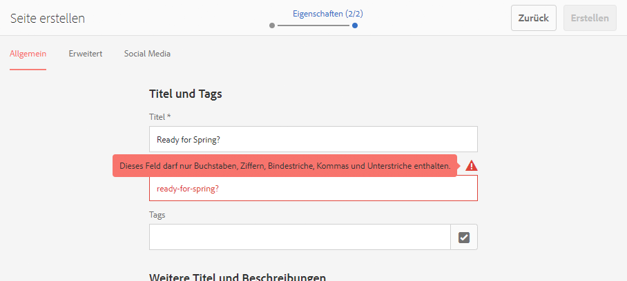

# Erstellen und Organisieren von Seiten {#creating-and-organizing-pages}

In diesem Abschnitt wird beschrieben, wie Sie mit Adobe Experience Manager (AEM) Seiten erstellen und verwalten, um auf diesen Seiten [Inhalte zu erstellen](/help/sites-authoring/editing-content.md).

>[!NOTE]
>
>Ihr Konto muss über die [erforderlichen Zugriffsrechte](/help/sites-administering/security.md) und [Berechtigungen](/help/sites-administering/security.md#permissions) verfügen, damit Sie Aktionen auf Seiten durchführen können, beispielsweise das Erstellen, Kopieren, Verschieben, Bearbeiten und Löschen.
>
>Wenn Sie auf Probleme stoßen, empfehlen wir Ihnen, sich an den Systemadministrator zu wenden.

>[!NOTE]
>
>Es steht eine Reihe von [Tastaturbefehlen](/help/sites-authoring/keyboard-shortcuts.md) in der Websites-Konsole zur Verfügung, die eine effizientere Seitenorganisation ermöglichen.

## Website-Organisation {#organizing-your-website}

Als Autor müssen Sie Ihre Website in AEM organisieren. Aus diesem Grund müssen Sie Ihre Inhaltsseiten entsprechend folgenden Richtlinien erstellen und benennen:

* Sie müssen leicht in der Autorenumgebung auffindbar sein.
* Besucher der Website müssen sie einfach in der Veröffentlichungsumgebung durchsuchen können.

Sie können Ihre Inhalte auch mithilfe von [Ordnern](#creating-a-new-folder) organisieren.

Die Struktur einer Website kann als Baumstruktur gesehen werden, die die Inhaltsseiten enthält. Die Namen dieser Inhaltsseiten werden zur Bildung der URLs verwendet. Der Titel wird zusammen mit dem Seiteninhalt angezeigt.

Im folgenden Beispiel sehen Sie ein Beispiel von der Site &quot;We.Retail&quot;, auf die eine Shortseite für Wanderungen ( `desert-sky-shorts`) aufgerufen wird:

* Autorenumgebung
   `https://localhost:4502/editor.html/content/we-retail/us/en/products/equipment/hiking/desert-sky-shorts.html`

* Veröffentlichungsumgebung
   `https://localhost:4503/content/we-retail/us/en/products/equipment/hiking/desert-sky-shorts.html`

Je nach Konfiguration Ihrer Instanz kann die Verwendung von `/content` in der Veröffentlichungsumgebung optional sein.

```xml
 /content
 /we-retail
  /us
   /en
    /products
     /equipment
      /hiking
       /desert-sky-shorts
       /hiking-poles
       /...
      /running...
      /surfing...
      /...
     /seasonal...
     /...
    /about-us
    /experience
    /...
   /es...
  /de...
  /fr...
  /...
 /...
```

Diese Struktur kann über die **Sites-Konsole** angezeigt werden. Von dort aus können Sie [durch die Seiten Ihrer Website navigieren](/help/sites-authoring/basic-handling.md#navigating) und Aktionen auf den Seiten durchführen. Sie können auch neue Sites und [neue Seiten](#creating-a-new-page) erstellen.

An jedem Punkt können Sie die Verzwigung nach oben in den Breadcrumbs in der Kopfzeilenleiste sehen:


### Seitenbenennungskonventionen {#page-naming-conventions}

Beim Erstellen einer neuen Seite gibt es zwei Schlüsselfelder:

* **[Titel](#title)**:

   * Dieses Feld wird dem Benutzer bei der Bearbeitung im oberen Teil des Seiteninhalts in der Konsole angezeigt.
   * Dieses Feld ist obligatorisch.

* **[Name](#name)**:

   * Mit diesem Wert wird der URI generiert.
   * Benutzereingaben sind für dieses Feld optional. Wenn kein Name angegeben ist, wird er vom Titel abgeleitet. Weitere Informationen finden Sie unter [Seitennamen-Einschränkungen und Best Practices](/help/sites-authoring/managing-pages.md#page-name-restrictions-and-best-practices).

#### Seitennamen-Einschränkungen und Best Practices {#page-name-restrictions-and-best-practices}

Der **Seitentitel** und der **Seitenname** können separat erstellt werden, sind aber verwandt:

* Beim Erstellen einer Seite ist nur das **Titelfeld** erforderlich. Wenn bei der Erstellung von Seiten kein **Name** angegeben wird, generiert AEM einen Namen aus den ersten 64 Zeichen des Titels (entsprechend der nachfolgenden Validierung). Nur die ersten 64 Zeichen werden verwendet, um gängige Best Practices für kurze Seitennamen zu unterstützen.

* Wenn ein Seitenname manuell vom Autor angegeben wird, gilt die Beschränkung von 64 Zeichen nicht, aber andere technische Einschränkungen gelten unter Umständen für die Länge des Seitennamens.

>[!NOTE]
>
>Beim Definieren eines Seitennamens ist es sinnvoll, den Seitennamen so kurz wie möglich zu halten, aber so ausdruckstark und erinnerungsstark wie möglich, um ihn für den Leser verständlich zu machen. Weitere Informationen zum `title`-Element finden Sie im [W3C-Styleguide](https://www.w3.org/Provider/Style/TITLE.html).
>
>Denken Sie auch daran, dass einige Browser (z. B. ältere Versionen von IE) nur URLs bis zu einer bestimmten Länge akzeptieren, sodass auch technisch Gründe für die Verwendung von kurzen Seitennamen bestehen.

Beim Erstellen einer neuen Seite [validiert AEM den Seitennamen entsprechend den AEM- und JCR-Konventionen](/help/sites-developing/naming-conventions.md).

Mindestens zulässig sind die folgenden Zeichen:

* „a“ bis „z“
* „A“ bis „Z“
* „0“ bis „9“
* `_` (Unterstrich)
* `-` (Bindestrich/Minus)

Umfassende Informationen zu allen zulässigen Zeichen finden Sie in den [Benennungskonventionen](/help/sites-developing/naming-conventions.md).

>[!NOTE]
>
>Wenn AEM auf einer [MongoMK-Persistenzmanager-Bereitstellung](/help/sites-deploying/recommended-deploys.md) ausgeführt wird, sind Seitennamen auf 150 Zeichen beschränkt.

#### Titel {#title}

Wenn Sie für eine neu erstellte Seite nur den **Titel** angeben, leitet AEM den **Namen** für die Seite von dieser Zeichenfolge ab und [validiert den Namen entsprechend den Konventionen von AEM und JCR. ](/help/sites-developing/naming-conventions.md) Im Feld **Titel** werden ungültige Zeichen akzeptiert, wobei die ungültigen Zeichen im abgeleiteten Namen jedoch ersetzt werden. Beispiel:

| Titel | Abgeleiteter Name |
|---|---|
| Schön | schoen.html |
| SC%&amp;*ç+ | sc---c-.html |

#### Name {#name}

Wenn Sie beim Erstellen einer neuen Seite einen **Namen** für die Seite angeben, [validiert AEM den Namen gemäß den AEM- und JCR-Konventionen](/help/sites-developing/naming-conventions.md). Die Eingabe von ungültigen Zeichen im Feld **Name** ist nicht zulässig. Wenn AEM ungültige Zeichen erkennt, wird das Feld mit einer erklärenden Meldung markiert.



>[!NOTE]
>
>Sie sollten es vermeiden, einen Zwei-Buchstaben-Code gemäß ISO-639-1 als Seitennamen zu verwenden, sofern es sich nicht um einen Sprachstamm handelt.
>
>Weitere Informationen finden Sie unter [Vorbereiten von Inhalten für die Übersetzung](/help/sites-administering/tc-prep.md).

### Vorlagen {#templates}

In AEM sind bestimmte Seitentypen in Vorlagen gespeichert. Eine Vorlage wird als Basis für jede neue erstellte Seite verwendet.

Die Vorlage definiert die Seitenstruktur, u. a. eine Miniaturansicht und andere Eigenschaften. Beispielsweise könnten Sie unterschiedliche Vorlagen für Produktseiten, Sitemaps und Kontaktangaben verwenden. Vorlagen bestehen aus [Komponenten](#components).

Im Lieferumfang von AEM sind diverse Vorlagen enthalten. Welche Vorlagen verfügbar sind, hängt von der jeweiligen Website ab. Die wichtigsten Felder sind:

* **Titel**
Der Titel, der auf der resultierenden Web-Seite angezeigt wird.

* **Name**
Wird beim Benennen der Seite verwendet.

* **Vorlage**
Eine Liste von Vorlagen, die für das Erstellen neuer Seiten verwendet werden können.

>[!NOTE]
>
>Sofern auf Ihrer Instanz konfiguriert, [können Vorlagenautoren Vorlagen mit dem Vorlageneditor erstellen](/help/sites-authoring/templates.md).

### Komponenten  {#components}

Komponenten sind die von AEM bereitgestellten Elemente, sodass Sie bestimmte Inhaltstypen hinzufügen können. AEM enthält eine Reihe von [vordefinierten Komponenten](/help/sites-authoring/default-components-console.md), die umfassende Funktionen bieten. Dazu gehören:

* Text
* Bild
* Diashow
* Video
* Und viele weitere

Nachdem Sie eine Seite erstellt und geöffnet haben, können Sie mithilfe der im [Komponenten-Browser](/help/sites-authoring/editing-content.md#insertinganewparagraph) verfügbaren Komponenten [Inhalte hinzufügen](/help/sites-authoring/author-environment-tools.md#componentbrowser).

>[!NOTE]
>
>Die [Komponentenkonsole](/help/sites-authoring/default-components-console.md) bietet einen Überblick über die Komponenten in Ihrer Instanz.

## Verwalten von Seiten {#managing-pages}

### Erstellen einer neuen Seite {#creating-a-new-page}

Sofern nicht alle Seiten für Sie im Voraus erstellt wurden, müssen Sie vor dem Einfügen von Inhalten zunächst eine Seite erstellen:

1. Öffnen Sie die Sites-Konsole (z. B. [https://localhost:4502/sites.html/content](https://localhost:4502/sites.html/content)).
1. Navigieren Sie zu der Position, an der Sie die neue Seite erstellen möchten.
1. Öffnen Sie das Dropdown-Menü über **Erstellen** in der Symbolleiste und wählen Sie in der Liste **Seite** aus:

   

1. Im ersten Schritt des Assistenten haben Sie folgende Möglichkeiten:

   * Wählen Sie die Vorlage, die Sie zum Erstellen der neuen Seite verwenden möchten, und klicken/tippen Sie auf **Weiter**, um fortzufahren.

   * Mit **Abbrechen** brechen Sie den Vorgang ab.

   

1. Im letzten Schritt des Assistenten haben Sie folgende Möglichkeiten:

   * Geben Sie auf den drei Registerkarten die [Seiteneigenschaften](/help/sites-authoring/editing-page-properties.md) ein, die Sie der neuen Seite zuweisen möchten, und klicken bzw. tippen Sie dann auf **Erstellen**, um die Seite zu erstellen.

   * Verwenden Sie **Zurück**, um zur Vorlagenauswahl zurückzukehren.

   Die Schlüsselfelder sind:

   * **Titel**:

      * Dieser wird dem Benutzer angezeigt und muss angegeben werden.
   * **Name**:

      * Mit diesem Wert wird der URI generiert. Wenn kein Name angegeben ist, wird er vom Titel abgeleitet.
      * Wenn Sie beim Erstellen einer neuen Seite einen **Namen** für die Seite angeben, [validiert AEM den Namen entsprechend den Konventionen von AEM und JCR](/help/sites-developing/naming-conventions.md).

      * Die **Eingabe von ungültigen Zeichen** im Feld **Name** ist nicht zulässig. Wenn AEM ungültige Zeichen erkennt, wird das Feld markiert und eine erklärende Meldung angezeigt, die auf zu entfernende/ersetzende Zeichen verweist.
   >[!NOTE]
   >
   >Weitere Informationen finden Sie unter [Benennungskonventionen für Seiten](#page-naming-conventions).

   Zum Erstellen einer neuen Seite muss zumindest der **Titel** angegeben werden.

   

1. Verwenden Sie **Erstellen**, um den Vorgang abzuschließen und die neue Seite zu erstellen. Im Bestätigungs-Dialogfeld werden Sie gefragt, ob Sie die Seite sofort **öffnen** oder zur Konsole zurückkehren möchten (**Fertig**):

   

   >[!NOTE]
   >
   >Wenn Sie eine Seite erstellen und dabei einen in diesem Verzeichnis bereits vorhandenen Namen verwenden, erstellt das System automatisch eine Variation des Namens, indem eine Zahl angehängt wird. Wenn beispielsweise `winter` bereits vorhanden ist, wird eine neue Seite `winter0` genannt.

1. Wenn Sie zur Konsole zurückkehren, wird die neue Seite angezeigt:

   

>[!CAUTION]
>
>Nachdem eine Seite erstellt wurde, kann ihre Vorlage nicht mehr geändert werden - es sei denn, Sie [erstellen einen Launch mit einer neuen Vorlage](/help/sites-authoring/launches-creating.md#create-launch-with-new-template), wobei aber der gesamte bereits vorhandene Inhalt verloren geht.

### Öffnen einer Seite zur Bearbeitung {#opening-a-page-for-editing}

Wenn Sie eine Seite erstellt haben bzw. in der Konsole zu einer bereits vorhandenen Seite navigiert sind, können Sie diese zur Bearbeitung öffnen:

1. Öffnen Sie die **Sites-Konsole**.
1. Navigieren Sie zu der Seite, die Sie bearbeiten möchten.
1. Wählen Sie die Seite aus, indem Sie wahlweise Folgendes verwenden:

   * [Schnellaktionen](/help/sites-authoring/basic-handling.md#quick-actions)
   * [Auswahlmodus](/help/sites-authoring/basic-handling.md#navigatingandselectionmode) und Symbolleiste

   Wählen Sie anschließend das Symbol **Bearbeiten** aus:

   

1. Die Seite wird geöffnet und Sie können [die Seite bearbeiten](/help/sites-authoring/editing-content.md#touchoptimizedui).

>[!NOTE]
>
>Das Navigieren zu anderen Seiten ist im Seiteneditor nur im Vorschaumodus möglich, da Links im Bearbeitungsmodus des Seiteneditors nicht aktiv sind.

### Kopieren und Einfügen einer Seite  {#copying-and-pasting-a-page}

Sie können eine Seite und alle zugehörigen Unterseiten an einen neuen Speicherort kopieren:

1. Navigieren Sie in der **Sites-Konsole** zu der Seite, die Sie kopieren möchten.
1. Wählen Sie die Seite aus, indem Sie wahlweise Folgendes verwenden:

   * [Schnellaktionen](/help/sites-authoring/basic-handling.md#quick-actions)
   * [Auswahlmodus](/help/sites-authoring/basic-handling.md#navigatingandselectionmode) und Symbolleiste

   Wählen Sie anschließend das Symbol **Seite kopieren** aus:

   

   >[!NOTE]
   >
   >Wenn Sie sich im Auswahlmodus befinden, wird dieser automatisch beendet, sobald die Seite kopiert wird.

1. Navigieren Sie zum Speicherort, an dem Sie die neue Kopie der Seite speichern möchten.
1. Das Symbol **Einfügen** ist mit einem Dropdown-Pfeil direkt rechts verfügbar:

   

   Wählen Sie eine der folgenden Möglichkeiten aus:
   * Wählen Sie das Symbol **Einfügen** aus: An dieser Stelle wird eine Kopie der Originalseite und etwaiger untergeordneter Seiten erstellt.
   * Wählen Sie den Dropdown-Pfeil aus, um die Option **Ohne untergeordnete Elemente einfügen** anzuzeigen. An dieser Stelle wird eine Kopie der Originalseite erstellt. Untergeordnete Seiten werden nicht kopiert.

   >[!NOTE]
   >
   >Wenn Sie die Seite an einen Speicherort kopieren, an dem sich bereits eine Seite befindet, deren Name mit dem der ursprünglichen Seite übereinstimmt, erstellt das System automatisch eine Variation des Namens, indem eine Zahl angehängt wird. Wenn `winter` beispielsweise bereits existiert, wird `winter` zu `winter1`.

### Verschieben oder Umbenennen einer Seite {#moving-or-renaming-a-page}

>[!NOTE]
>
>Beim Umbenennen einer Seite gelten ebenfalls die [Benennungskonventionen für Seiten](#page-naming-conventions), wenn der neue Seitenname angegeben wird.

>[!NOTE]
>
>Eine Seite kann nur an einen Speicherort verschoben werden, an dem die Vorlage zulässig ist, auf der die Seite basiert. Weitere Informationen finden Sie unter [Formularverfügbarkeit](/help/sites-developing/templates.md#template-availability).

Die Vorgehensweise beim Verschieben oder Umbenennen einer Seite ist im Großen und Ganzen gleich und wird von demselben Assistenten unterstützt. Dieser Assistent hilft Ihnen bei den folgenden Aktionen:

* Umbenennen einer Seite, ohne sie zu verschieben.
* Verschieben der Seite, ohne sie umzubenennen.
* Verschieben und gleichzeitiges Umbenennen der Seite.

AEM bietet die Möglichkeit, interne Links zu aktualisieren, die auf die Seite verweisen, die umbenannt oder verschoben wird. Dies kann seitenweise erfolgen, um die volle Flexibilität zu ermöglichen.

1. Navigieren Sie zu der Seite, die Sie verschieben möchten.
1. Wählen Sie die Seite aus, indem Sie wahlweise Folgendes verwenden:

   * [Schnellaktionen](/help/sites-authoring/basic-handling.md#quick-actions)
   * [Auswahlmodus](/help/sites-authoring/basic-handling.md#navigatingandselectionmode) und Symbolleiste

   Wählen Sie anschließend das Symbol **Verschieben** aus:

   

   Daraufhin wird der Assistent zum Verschieben von Seiten geöffnet.

1. Im Schritt des Assistenten für das **Umbenennen** haben Sie folgende Möglichkeiten:

   * Geben Sie den Namen an, den die Seite nach dem Verschieben aufweisen soll, und tippen/klicken Sie dann auf **Weiter**, um den Vorgang fortzusetzen.

   * Mit **Abbrechen** brechen Sie den Vorgang ab.

   

   Der Seitenname kann unverändert bleiben, wenn Sie die Seite nur verschieben.

   >[!NOTE]
   >
   >Wenn Sie die Seite an einen Speicherort verschieben, an dem sich bereits eine Seite befindet, deren Name mit dem der ursprünglichen Seite übereinstimmt, erstellt das System automatisch eine Variation des Namens, indem eine Zahl angehängt wird. Wenn `winter` beispielsweise bereits existiert, wird `winter` zu `winter1`.

1. Im Schritt **Ziel auswählen** des Assistenten können Sie entweder:

   * Die [Spaltenansicht](/help/sites-authoring/basic-handling.md#column-view) verwenden, um zum neuen Speicherort der Seite zu navigieren:

      * Wählen Sie das Ziel für die Seite aus, indem Sie auf die Miniaturansicht des Ziels klicken.
      * Klicken Sie auf **Weiter**, um fortzufahren.
   * Mit **Zurück** zur Angabe des Asset-Namens zurückkehren.

   >[!NOTE]
   >
   >Standardmäßig wird das übergeordnete Element der Seite, die Sie verschieben/umbenennen, als Ziel ausgewählt.

   

   >[!NOTE]
   >
   >Wenn Sie die Seite an einen Speicherort verschieben, an dem sich bereits eine Seite befindet, deren Name mit dem der ursprünglichen Seite übereinstimmt, erstellt das System automatisch eine Variation des Namens, indem eine Zahl angehängt wird. Wenn `winter` beispielsweise bereits existiert, wird `winter` zu `winter1`.

1. Wenn die Seite verknüpft ist oder darauf verwiesen wird, werden die Details im Schritt **Anpassen/Erneut veröffentlichen** aufgeführt.

   Sie können angeben, welche Verweise ggf. angepasst und neu veröffentlicht werden sollen.

   >[!NOTE]
   >
   >Wenn die Seite weder verknüpft ist noch darauf verwiesen wurde, ist dieser Schritt nicht verfügbar.

   

1. Wenn Sie **Verschieben** auswählen, wird der Vorgang abgeschlossen und Ihre Seite verschoben oder umbenannt.

>[!NOTE]
>
>Wenn die Seite bereits veröffentlicht wurde, wird das Veröffentlichen durch Verschieben der Seite automatisch rückgängig gemacht. Standardmäßig wird sie nach Abschluss des Verschiebevorgangs erneut veröffentlicht. Dies lässt sich jedoch ändern, indem Sie im Schritt **Anpassen/Erneut veröffentlichen** das Kontrollkästchen **Neu veröffentlichen** deaktivieren.

>[!NOTE]
>
>Wenn es keine Verweise auf die Seite gibt, wird der Schritt **Anpassen/Erneut veröffentlichen** übersprungen.

#### Asynchrone Aktionen {#asynchronous-actions}

Normalerweise wird eine Aktion zum Verschieben oder Umbenennen von Seiten sofort ausgeführt. Dies gilt als synchrone Verarbeitung und weitere Aktionen in der Benutzeroberfläche werden blockiert, bis die Aktion abgeschlossen ist.

Liegt die Anzahl der betroffenen Seiten jedoch über einer definierten Grenze, wird die Aktion asynchron verarbeitet, sodass der Benutzer die Inhaltserstellung in der Benutzeroberfläche fortsetzen kann, ohne von der Aktion zum Verschieben oder Umbenennen der Seite aufgehalten zu werden.

* Wenn Sie im letzten Schritt oben auf **Verschieben** klicken, prüft AEM die konfigurierte Beschränkung.
* Wenn die Anzahl der betroffenen Seiten unter der Grenze liegt, wird ein synchroner Vorgang ausgeführt.
* Wenn die Anzahl der betroffenen Seiten über der Grenze liegt, wird ein asynchroner Vorgang ausgeführt.
   * Der Benutzer muss definieren, wann der asynchrone Vorgang ausgeführt werden soll.
      * **Jetzt** startet die Ausführung des asynchronen Auftrags sofort.
      * **Später** erlaubt es dem Benutzer zu definieren, wann der asynchrone Auftrag starten wird.

         

Der Status asynchroner Aufträge kann im Dashboard [**Status asynchroner Aufträge**](/help/sites-administering/asynchronous-jobs.md#monitor-the-status-of-asynchronous-operations) unter **Globale Navigation** > **Tools** > **Vorgänge** > **Aufträge** überprüft werden.

>[!NOTE]
>
>Weitere Informationen zur asynchronen Auftragsverarbeitung und zum Konfigurieren der Begrenzung für Seitenverschiebungs-/Umbenennungsaktionen finden Sie im Dokument [Asynchrone Aufträge](/help/sites-administering/asynchronous-jobs.md) im Benutzerhandbuch zu Administration.

>[!NOTE]
>
>Für die asynchrone Seitenverschiebung ist AEM 6.5.3.0 oder höher erforderlich.

### Löschen einer Seite {#deleting-a-page}

1. Navigieren Sie zu der Seite, die Sie löschen möchten.
1. Wählen Sie mit dem [Auswahlmodus](/help/sites-authoring/basic-handling.md#viewing-and-selecting-resources) die gewünschte Seite aus, bevor Sie in der Symbolleiste die Option **Löschen** auswählen:

   

   >[!NOTE]
   >
   >Als Sicherheitsmaßnahme ist das Symbol **Löschen** nicht per Schnellzugriff verfügbar.

1. Es wird ein Bestätigungsdialogfeld angezeigt.

   * Mit **Abbrechen** können Sie den Vorgang abbrechen.
   * Mit **Löschen** bestätigen Sie die Aktion.

      * Wenn die Seite keine Referenzen aufweist, wird die Seite gelöscht.
      * Wenn die Seite Verweise enthält, werden Sie in einem Meldungsfeld darauf hingewiesen, dass **eine oder mehrere Seiten über einen Verweis verfügen**. Sie können **Löschen erzwingen** oder **Abbrechen** auswählen.

>[!NOTE]
>
>Wenn eine Seite bereits veröffentlicht ist, wird ihre Veröffentlichung vor dem Löschen automatisch rückgängig gemacht.

### Sperren einer Seite {#locking-a-page}

Sie können entweder in einer Konsole oder beim Bearbeiten einer Seite eine [Seite sperren/entsperren](/help/sites-authoring/editing-content.md#locking-a-page). Auch Angaben dazu, ob eine Seite gesperrt ist, werden in beiden Fällen angezeigt.

 

### Erstellen eines neuen Ordners {#creating-a-new-folder}

Sie können Ordner erstellen, um Ihre Dateien und Seiten zu organisieren.

>[!NOTE]
>
>Für Ordner gelten ebenfalls die [Benennungskonventionen für Seiten](#page-naming-conventions), wenn der neue Ordnername angegeben wird.

>[!CAUTION]
>
>* Ordner können nur direkt unter **Sites** oder unter anderen Ordnern erstellt werden. Sie können jedoch nicht unter einer Seite erstellt werden.
>* Für einen Ordner können folgende Standardaktionen ausgeführt werden: Verschieben, Kopieren, Einfügen, Löschen, Veröffentlichen, Rückgängigmachen der Veröffentlichung und Anzeigen/Bearbeiten von Eigenschaften.
>* Ordner sind in einer Live Copy nicht als Auswahl verfügbar.

>


1. Öffnen Sie die **Sites-Konsole** und navigieren Sie zum gewünschten Ort.
1. Um das Optionsmenü zu öffnen, wählen Sie **Erstellen** in der Symbolleiste.
1. Wählen Sie **Ordner**, um das Dialogfeld zu öffnen. Hier können Sie den **Namen** und den **Titel** eingeben:

   

1. Wählen Sie **Erstellen**, um den Ordner zu erstellen.
