# Creative Project und PIM-Integration{#creative-project-and-pim-integration}

Wenn Sie Marketing- oder Kreativprofi sind, können Sie die Kreativprojektwerkzeuge in Adobe Experience Manager (AEM) verwenden, um eCommerce-bezogene Produktfotografie und zugehörige Kreativprozesse in Ihrem Unternehmen zu verwalten.

Insbesondere können Sie Creative Project zur Optimierung der folgenden Aufgaben in Ihrem Fotoshooting-Workflow verwenden:

* Generieren einer Fotoshooting-Anfrage
* Hochladen eines Fotoshootings
* Zusammenarbeit an einem Fotoshooting
* Verpacken bestätigter Assets

>[!NOTE]
>
>Informationen zur Zuweisung von Benutzerrollen und Workflows zu bestimmen Benutzertypen finden Sie unter [Informationen zu Projekt-Benutzerrollen](/help/sites-authoring/projects.md#user-roles-in-a-project).

## Erkunden von Workflows für Produkt-Fotoshootings   {#exploring-product-photo-shoot-workflows}

Creative Project bietet mehrere Projektvorlagen, die unterschiedlichen Projektanforderungen gerecht werden. Die Vorlage **Projekt für Produkt-Fotoshooting** ist im Lieferumfang enthalten. Diese Vorlage stellt Fotoshooting-Workflows bereit, mit denen Sie Anfragen für Produkt-Fotoshootings einleiten und verwalten können. Sie enthält darüber hinaus eine Reihe von Aufgaben, die es Ihnen ermöglichen, digitale Bilder für Produkte anhand geeigneter Bewertungs- und Bestätigungsabläufe zu erhalten.

Die Vorlage beinhaltet die folgenden Workflows:

* Workflow **Produkt-Fotoshooting (Commerce-Integration)**: Dieser Workflow nutzt die Commerce-Integration in das Produktinformationsmanagement (PIM)-System zur automatischen Generierung einer Aufnahmenliste auf Grundlage der ausgewählten Produkte (Hierarchie). Sie können die Produktdaten als Teil der Asset-Metadaten anzeigen, nachdem der Workflow abgeschlossen wurde.
* Workflow **Produkt-Fotoshooting**: Dieser Workflow ermöglicht es Ihnen, eine Aufnahmenliste bereitzustellen, anstatt sich auf die Commerce-Integration zu verlassen. Dabei werden die hochgeladenen Bilder in einer CSV-Datei im Assets-Ordner des Projekts protokolliert.

>[!NOTE]
>
>Die CSV-Datei, die in der Aufgabe „Aufnahmenliste hochladen“ des Workflows „Produkt-Fotoshooting“ hochgeladen wird, sollte den Namen „shotlist.csv“ haben.

## Erstellen eines Projekts für Produkt-Fotoshootings  {#create-a-product-photo-shoot-project}

1. Tippen/klicken Sie in der Konsole **Projekte** auf **Erstellen** und wählen Sie dann **Projekt erstellen** aus der Liste aus.

   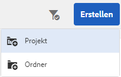

1. Wählen Sie auf der Seite **Projekt erstellen** die Vorlage für Fotoshooting-Projekte aus und klicken/tippen Sie auf **Weiter**.

   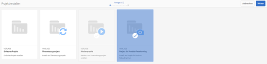

1. Geben Sie Details zum Projekt einschließlich Titel, Beschreibung und Fälligkeitsdaten ein. Fügen Sie Benutzer hinzu und weisen Sie ihnen verschiedene Rollen zu. Sie können auch ein Miniaturbild für das Projekt hinzufügen.

   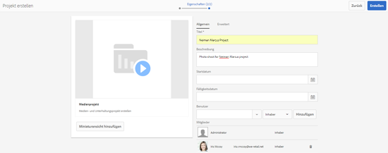

1. Tippen oder klicken Sie auf **Erstellen**. Eine Bestätigungsmeldung informiert Sie, dass das Projekt erstellt wurde.
1. Tippen/klicken Sie auf **Fertig** , um zur Konsole **Projekte** zurückzukehren. Tippen oder klicken Sie alternativ auf **Öffnen** , um die Assets im Fotoshooting-Projekt anzuzeigen.

## Beginn der Arbeit an einem Projekt für Produkt-Fotoshooting {#starting-work-in-a-product-photo-shoot-project}

Um eine Fotoshooting-Anfrage einzuleiten, klicken oder tippen Sie auf ein Projekt und klicken Sie danach auf der Seite mit den Projektdetails auf **Arbeit hinzufügen**, um einen Workflow zu starten.

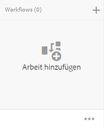

Im Lieferumfang eines Produkt-Fotoshooting-Projekts sind folgende Workflows enthalten:

* Workflow „Produkt-Fotoshooting (Commerce-Integration)“
* Workflow „Produkt-Fotoshooting“

Verwenden Sie den Workflow „Produkt-Fotoshooting (Commerce-Integration)“ zur Zuordnung von Bild-Assets zu den Produkten in AEM. Dieser Workflow nutzt Commerce-Integration zur Verknüpfung der bestätigten Bilder mit den vorhandenen Produktdaten unter dem Speicherort */etc/commerce*.

Der Workflow Produkt-Fotoshooting (Commerce-Integration) umfasst die folgenden Aufgaben:

* Aufnahmenliste erstellen
* Fotoshooting hochladen
* Fotoaufnahme retuschieren
* Bewerten und bestätigen
* Zu Produktionsaufgabe wechseln

Wenn in AEM keine Produktinformationen verfügbar sind, verwenden Sie den Produkt-Fotoshooting-Workflow, um Bild-Assets mit den Produkten auf der Basis der Informationen zuzuordnen, die Sie in eine CSV-Datei hochladen. Die CSV-Datei muss grundlegende Produktinformationen wie zum Beispiel Produkt-ID, Kategorie und Beschreibung enthalten. Der Workflow ruft bestätigte Assets für die Produkte ab.

Dieser Workflow umfasst die folgenden Aufgaben:

* Aufnahmenliste hochladen
* Fotoshooting hochladen
* Fotoaufnahme retuschieren
* Bewerten und bestätigen
* Zu Produktionsaufgabe wechseln

Sie können diesen Workflow mit der Workflow-Konfigurationsoption anpassen.

Beide Workflows umfassen Schritte zur Verknüpfung von Produkten mit ihren bestätigten Assets. Jeder Workflow umfasst die folgenden Schritte:

* Workflow-Konfiguration: Beschreibt die Optionen zur Anpassung des Workflows
* Starten eines Projekt-Workflows: Erläutert, wie ein Produkt-Fotoshooting gestartet wird
* Workflow-Aufgabendetails: Stellt Details von Aufgaben bereit, die im Workflow zur Verfügung stehen

## Verfolgen des Projektfortschritts    {#tracking-project-progress}

Sie können den Fortschritt eines Projekts verfolgen, indem Sie die aktiven/abgeschlossenen Aufgaben im Projekt überwachen.

Verwenden Sie Folgendes, um den Fortschritt eines Projekts zu überwachen:

* **Aufgabenkarte**  

* **Aufgabenliste**

Die Aufgabenkarte zeigt den Gesamtfortschritt des Projekts. Sie wird nur dann auf der Seite „Projektdetails“ angezeigt, wenn das Projekt zugehörige Aufgaben aufweist. Die Aufgabenkarte zeigt den aktuellen Abschlussstatus des Projekts auf der Basis der abgeschlossenen Aufgaben an. Zukünftige Aufgaben werden nicht berücksichtigt.

Die Aufgabenkarte stellt die folgenden Detailinformationen bereit:

* Prozentsatz der aktiven Aufgaben
* Prozentsatz der abgeschlossenen Aufgaben

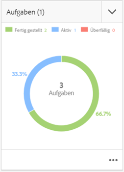

Die Aufgabenliste stellt detaillierte Information zur aktuell aktiven Workflow-Aufgabe für das Projekt bereit. Um die Liste anzuzeigen, tippen/klicken Sie auf die Aufgabenkarte. Die Aufgabenliste zeigt auch Metadaten, z. B. Startdatum, Fälligkeitsdatum, Beauftragter, Priorität und Status der Aufgabe an.

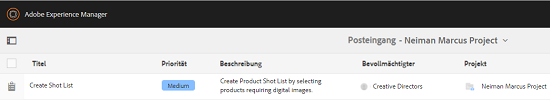

## Workflow-Konfiguration {#workflow-configuration}

Diese Aufgabe schließt die Zuweisung von Workflow-Schritten zu Benutzern auf Grundlage ihrer Rollen ein.

So konfigurieren Sie den Workflow **Produkt-Fotoshooting**:

1. Navigieren Sie zu **Tools** > **Workflows** und tippen Sie dann auf die Kachel **Modelle** , um die Seite **Workflow-Modelle** zu öffnen.
1. Wählen Sie den Workflow **Produkt-Fotoshooting** aus und tippen Sie in der Symbolleiste auf das Symbol **Bearbeiten** , um ihn im Bearbeitungsmodus zu öffnen.

   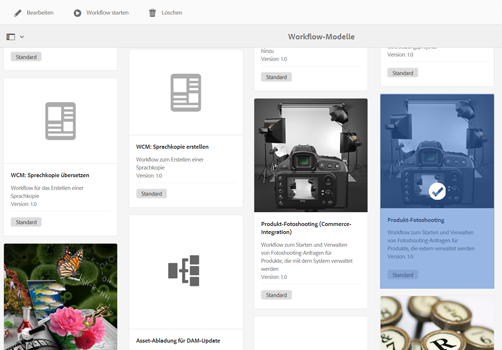

1. Öffnen Sie auf der Seite **Workflow für Produkt-Fotoshooting** eine Projektaufgabe. Öffnen Sie z. B. die Aufgabe **Aufnahmenliste hochladen**.

   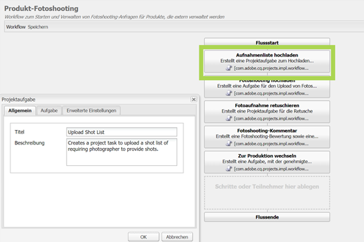

1. Klicken Sie auf die Registerkarte **Aufgabe**, um Folgendes zu konfigurieren:

   * Name der Aufgabe
   * Standardbenutzer(rolle), der/die die Aufgabe empfängt
   * Standardpriorität der Aufgabe, die in der Aufgabenliste des Benutzers angezeigt wird
   * Aufgabenbeschreibung, die angezeigt wird, wenn der Bevollmächtigte die Aufgabe öffnet
   * Fälligkeitsdatum für eine Aufgabe, das auf Grundlage des Zeitpunkts des Aufgabenbeginns berechnet wird

1. Klicken Sie auf **OK**, um die Konfigurationseinstellungen zu speichern.

   Auf ähnliche Weise können Sie die folgenden Aufgaben für den Workflow **Produkt-Fotoshooting** konfigurieren:

   * Fotoshooting hochladen
   * Produkt-Fotoshooting retuschieren
   * Fotoshooting-Bewertung
   * In Produktion verschieben

   Führen Sie ein ähnliches Verfahren aus, um die Aufgaben im Workflow **Produkt-Fotoshooting (Commerce-Integration)** zu konfigurieren.

In diesem Abschnitt wird beschrieben, wie das Produktinformationsmanagement in Ihr Creative-Projekt integriert wird.

## Starten eines Projekt-Workflows  {#starting-a-project-workflow}

1. Navigieren Sie zu einem Projekt mit einem Produkt-Fotoshooting und tippen/klicken Sie auf das Symbol **Arbeit hinzufügen** auf der Karte **Workflows** .
1. Wählen Sie die Workflow-Karte **Produkt-Fotoshooting (Commerce-Integration)** aus, um den entsprechenden Workflow zu starten. Wenn die Produktinformationen nicht unter /etc/commerce verfügbar sind, wählen Sie den Workflow **Produkt-Fotoshooting** aus und starten Sie den Workflow Produkt-Fotoshooting .

   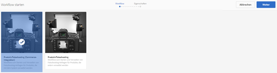

1. Tippen/klicken Sie auf **Weiter**, um den Workflow im Projekt einzuleiten.
1. Geben Sie auf der nächsten Seite Details zum Workflow ein.

   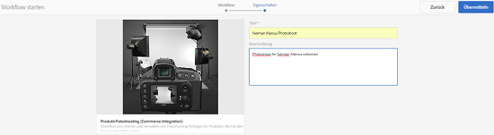

   Klicken Sie auf **Übermitteln**, um den Fotoshooting-Workflow zu starten. Die Seite mit den Details zum Fotoshooting-Projekt wird angezeigt.

   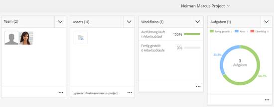

### Workflow-Aufgabendetails {#workflow-tasks-details}

Der Fotoshooting-Workflow umfasst mehrere Aufgaben. Jede Aufgabe wird auf Grundlage der für die Aufgabe definierten Konfiguration einer Benutzergruppe zugewiesen.

#### Aufnahmenlistenaufgabe erstellen  {#create-shot-list-task}

Die Aufgabe **Aufnahmenliste erstellen** ermöglicht dem Projekteigentümer die Auswahl von Produkten, für die Bilder benötigt werden. Je nach vom Benutzer ausgewählter Option wird eine CSV-Datei generiert, die grundlegende Produktinformationen enthält.

1. Tippen oder klicken Sie im Projektordner auf die Auslassungszeichen in der [Aufgabenkarte](#tracking-project-progress), um das Aufgabenelement im Workflow anzuzeigen.

   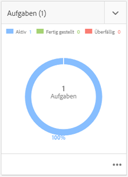

1. Wählen Sie die Aufgabe **Aufnahmenliste erstellen** aus und tippen/klicken Sie dann in der Symbolleiste auf das Symbol **Öffnen** .

   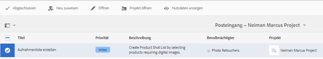

1. Überprüfen Sie die Aufgabendetails und tippen/klicken Sie dann auf die Schaltfläche **Aufnahmenliste erstellen**.

   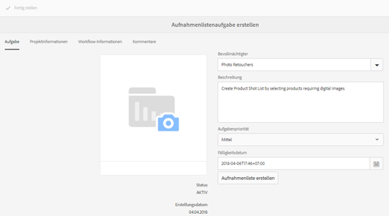

1. Wählen Sie Produkte, für die Produktdaten ohne verknüpfte Bilder vorhanden sind.

   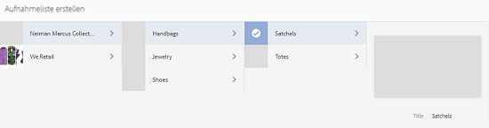

1. Tippen/klicken Sie auf das Symbol **Zur Aufnahmenliste hinzufügen** , um eine CSV-Datei zu erstellen, die eine Liste all dieser Produkte enthält. Eine Meldung betätigt, dass die Aufnahmenliste für die ausgewählten Produkte erstellt wird. Klicken Sie auf **Schließen**, um den Workflow abzuschließen.
1. Nach dem Erstellen einer Aufnahmenliste wird der Link **Aufnahmenliste anzeigen** angezeigt. Um weitere Produkte zur Aufnahmenliste hinzuzufügen, tippen/klicken Sie auf **Zur Aufnahmenliste hinzufügen**. In diesem Fall werden die Daten an die anfangs erstellte Aufnahmenliste angehängt.

   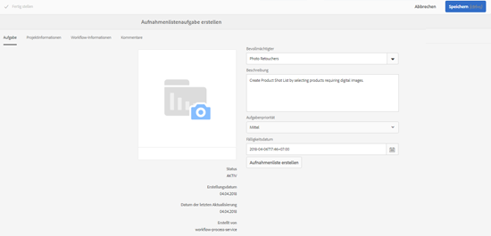

1. Tippen/klicken Sie auf **Aufnahmenliste anzeigen**, um die neue Aufnahmenliste anzuzeigen.

   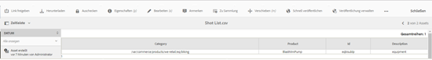

   Um die vorhandenen Daten zu bearbeiten oder neue Daten hinzuzufügen, tippen/klicken Sie in der Symbolleiste auf **Bearbeiten**. Nur die Felder **Produkt **und **Beschreibung** können bearbeitet werden.

   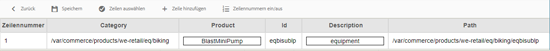

   Tippen oder klicken Sie nach dem Aktualisieren der Datei in der Symbolleiste auf **Speichern**, um die Datei zu speichern.

1. Tippen oder klicken Sie nach dem Hinzufügen der Produkte auf das Symbol **Complete** auf der Seite &quot;Aufnahmenliste erstellen&quot;, um die Aufgabe als abgeschlossen zu markieren. Sie können wahlweise einen Kommentar hinzufügen.

   Durch Abschluss der Aufgabe werden die folgenden Änderungen innerhalb des Projekts eingeführt:

   * Der Produkthierarchie entsprechende Assets werden in einem Ordner mit demselben Namen wie der Titel des Workflow erstellt.
   * Die Metadaten für die Assets werden in der Konsole „Assets“ bearbeitbar, sogar bevor der Fotograf die Bilder zur Verfügung stellt.
   * Es wird ein Fotoshooting-Ordner erstellt, in dem die vom Fotografen bereitgestellten Bilder gespeichert werden. Dieser Ordner enthält Unterordner für jeden Produkteintrag in der Aufnahmenliste.

   Für den Workflow „Produkt-Fotoshooting“ (ohne Commerce-Integration) ist „Aufnahmenliste hochladen“ die erste Aufgabe. Tippen/klicken Sie auf **Aufnahmenliste hochladen**, um eine Datei mit dem Namen **shotlist.csv** hochzuladen. Die CSV-Datei sollte die Produkt-ID enthalten. Die anderen Felder sind optional. Sie können sie für die Zuordnung von Assets zu Produkten verwenden.

### Aufnahmenlistenaufgabe hochladen  {#upload-shot-list-task}

Diese Aufgabe ist Teil des Produkt-Fotoshooting-Workflows. Diese Aufgabe führen Sie aus, wenn in AEM keine Produktinformationen verfügbar sind. In diesem Fall laden Sie eine Liste von Produkten in einer CSV-Datei hoch, für die Bild-Assets erforderlich sind. Basierend auf den Details in der CSV-Datei ordnen Sie Bild-Assets den Produkten zu.

Verwenden Sie den Link **Aufnahmenliste anzeigen** unter der Projektkarte im vorherigen Verfahren, um eine Beispieldatei im CSV-Format herunterzuladen. Überprüfen Sie die Beispieldatei, um sich mit dem üblichen Inhalt einer CSV-Datei vertraut zu machen.

Die Produktliste oder CSV-Datei kann Felder wie z. B. **Kategorie, Produkt, ID, Beschreibung** und **Pfad** enthalten. Das Feld **ID** ist obligatorisch und enthält die Produkt-ID. Die anderen Felder sind optional.

Ein Produkt kann zu einer bestimmten Kategorie gehören. Die Produktkategorie kann in der CSV-Datei unterhalb der Spalte **Kategorie** aufgeführt werden. Das Feld **Produkt** enthält den Namen des Produkts. Geben Sie im Feld **Beschreibung** die Produktbeschreibung oder Anleitungen für Fotografen ein.

>[!NOTE]
>
>Der Name der Bilder, die hochgeladen werden sollen, sollte mit &quot;**&lt;ProductId>_&quot;** beginnen, wobei die Produkt-ID aus dem Feld **Id** in der Datei *shotlist.csv* referenziert wird. Beispielsweise können Sie für ein Produkt in der Aufnahmenliste mit **Id 397122** Dateien mit den Namen **397122_highcontrast.jpg**, **397122_lowlight.png** und auf.

1. Tippen oder klicken Sie im Projektordner auf die Auslassungspunkte in der [Aufgabenkarte](#tracking-project-progress), um die Liste der Aufgaben im Workflow anzuzeigen.
1. Wählen Sie die Aufgabe **Aufnahmenliste hochladen** aus und tippen/klicken Sie dann in der Symbolleiste auf das Symbol **Öffnen** .

   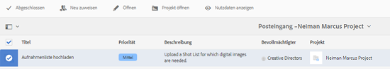

1. Überprüfen Sie die Aufgabendetails und tippen/klicken Sie dann auf die Schaltfläche **Aufnahmenliste hochladen** .

   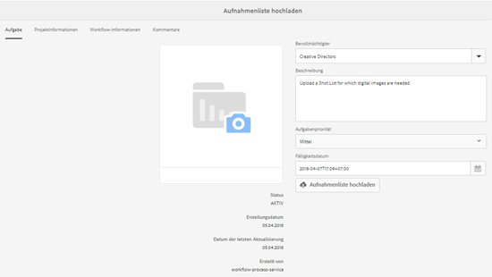

1. Tippen/klicken Sie auf die Schaltfläche **Aufnahmenliste hochladen** , um die CSV-Datei mit dem Dateinamen shotlist.csv hochzuladen. Der Workflow erkennt diese Datei als eine Quelle, die zum Extrahieren von Produktdaten für die nächste Aufgabe verwendet werden kann.
1. Laden Sie eine CSV-Datei hoch, die Produktinformationen im entsprechenden Format enthält. Der Link **Hochgeladene Assets anzeigen** wird nach dem Hochladen der CSV-Datei unter der Karte angezeigt.

   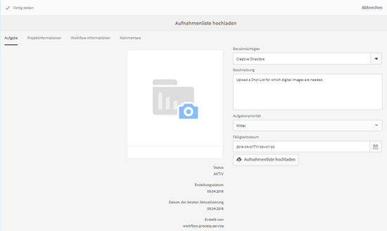

   Klicken Sie auf das Symbol **Fertig stellen**, um diese Aufgabe abzuschließen.

1. Tippen/klicken Sie auf das Symbol **Complete** , um die Aufgabe abzuschließen.

### Aufgabe „Fotoshooting hochladen“{#upload-photo-shoot-task}

Als Editor können Sie Aufnahmen für die Produkte hochladen, die in der Datei **shotlist.csv** aufgeführt sind, die in der vorherigen Aufgabe erstellt oder hochgeladen wurde.

Der Name der Bilder, die hochgeladen werden sollen, sollte mit **&quot;&lt;productId>_&quot;** beginnen, wobei die Produkt-ID aus dem Feld **Id** in der Datei **shotlist.csv** referenziert wird. Beispiel: Für ein Produkt mit der **ID 397122** in der Aufnahmenliste können Sie Dateien mit den Namen **397122_highcontrast.jpg**,**397122_lowlight.png** usw. hochladen.

Sie können entweder die Bilder direkt hochladen oder eine ZIP-Datei hochladen, die die Bilder enthält. Basierend auf ihren Namen werden die Bilder in entsprechenden Produktordnern innerhalb des Ordners **Fotoshooting** abgelegt.

1. Tippen oder klicken Sie unter dem Projektordner auf die Auslassungspunkte im Ordner [Task Card](#tracking-project-progress), um das Aufgabenelement im Workflow anzuzeigen.
1. Wählen Sie die Aufgabe **Fotoshooting** hochladen aus und tippen/klicken Sie dann in der Symbolleiste auf das Symbol **Öffnen** .

   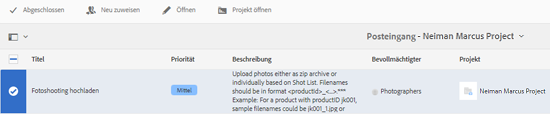

1. Tippen/klicken Sie auf **Fotoshooting** hochladen und laden Sie die Fotoshootbilder hoch.
1. Tippen/klicken Sie in der Symbolleiste auf das Symbol **Fertig stellen**, um die Aufgabe abzuschließen.

### Aufgabe „Fotoaufnahme retuschieren“  {#retouch-photo-shoot-task}

Wenn Sie Bearbeitungsrechte haben, führen Sie die Aufgabe „Fotoaufnahme retuschieren“ aus, um die in den Ordner „Fotoshooting“ hochgeladenen Bilder zu bearbeiten.

1. Tippen oder klicken Sie unter dem Projektordner auf die Auslassungspunkte im Ordner [Task Card](#tracking-project-progress), um das Aufgabenelement im Workflow anzuzeigen.
1. Wählen Sie die Aufgabe **Fotoaufnahme retuschieren** aus und tippen/klicken Sie dann in der Symbolleiste auf das Symbol **Öffnen** .

   

1. Tippen/klicken Sie auf den Link **Hochgeladene Assets anzeigen** auf der Seite **Fotoshooting wiederholen** , um die hochgeladenen Bilder zu durchsuchen.

   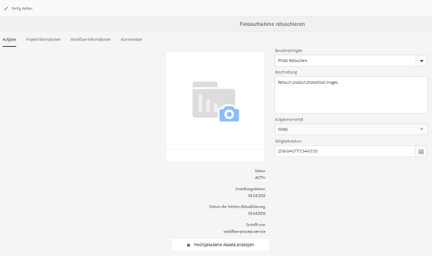

   Falls erforderlich, bearbeiten Sie die Bilder mit einer Adobe Creative Cloud-Applikation.

   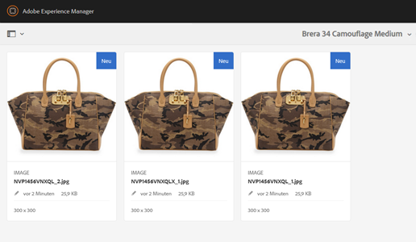

1. Tippen/klicken Sie in der Symbolleiste auf das Symbol **Fertig stellen**, um die Aufgabe abzuschließen.

### Aufgabe „Überprüfen und bestätigen“{#review-and-approve-task}

In dieser Aufgabe prüfen Sie die Fotoaufnahmen, die von einem Fotografen hochgeladen wurden, und markieren die Aufnahmen als für die Nutzung freigegeben.

1. Tippen oder klicken Sie unter dem Projektordner auf die Auslassungspunkte im Ordner [Task Card](#tracking-project-progress), um das Aufgabenelement im Workflow anzuzeigen.
1. Wählen Sie die Aufgabe **Überprüfen und genehmigen** aus und tippen/klicken Sie dann in der Symbolleiste auf das Symbol **Öffnen** .

   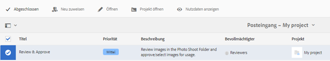

1. Weisen Sie auf der Seite **Überprüfen und Genehmigen** die Prüfungsaufgabe einer Rolle zu, z. B. &quot;Prüfer&quot;, und tippen/klicken Sie dann auf &quot;Überprüfen&quot;, um mit der Überprüfung der hochgeladenen Produktbilder zu beginnen.

   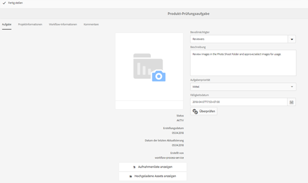

1. Wählen Sie ein Produktbild aus und tippen/klicken Sie dann in der Symbolleiste auf das Symbol „Genehmigen“, um das Produktbild als genehmigt zu markieren.

   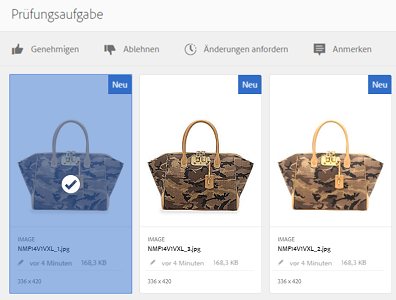

   Sobald Sie ein Bild genehmigt haben, wird darüber ein „Genehmigt“-Banner angezeigt.

   >[!NOTE]
   Sie können Produkte ohne Bilder übergehen. Zu einem späteren Zeitpunkt können Sie zur Aufgabe zurückkehren und sie nach Erledigung als abgeschlossen kennzeichnen.

1. Tippen/klicken Sie auf **Fertig stellen**. Die bestätigten Bilder werden mit den leeren Assets verknüpft, die erstellt wurden.

Mithilfe der Assets-Benutzeroberfläche können Sie zu den Projekt-Assets navigieren und die genehmigten Bilder überprüfen.

Klicken Sie auf die nächste Ebene, um Produkte entsprechend Ihrer Produktdatenhierarchie anzuzeigen.

Creative Project verbindet bestätigte Assets mit dem referenzierten Produkt. Die Asset-Metadaten werden mit dem Produktverweis und grundlegenden Informationen auf der Registerkarte **Produktdaten** unter den Asset-Eigenschaften aktualisiert. Sie werden im Abschnitt mit den AEM Assets-Metadaten angezeigt.

>[!NOTE]
Im Workflow „Produkt-Fotoshooting“ (ohne Commerce-Integration) sind die bestätigten Bilder mit keinen Produkten verbunden.

### Zu Produktionsaufgabe wechseln  {#move-to-production-task}

Mit dieser Aufgabe werden die bestätigten Assets in den produktionsbereiten Ordner verschoben, damit sie verwendet werden können.

1. Tippen oder klicken Sie unter dem Projektordner auf die Auslassungspunkte im Ordner [Task Card](#tracking-project-progress), um das Aufgabenelement im Workflow anzuzeigen.
1. Wählen Sie die Aufgabe **Zur Produktion wechseln** aus und tippen/klicken Sie dann in der Symbolleiste auf das Symbol **Öffnen** .

   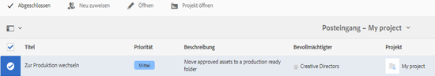

1. Um die bestätigten Assets für das Fotoshooting vor dem Verschieben in den produktionsbereiten Ordner anzuzeigen, klicken Sie auf den Link **Bestätigte Assets anzeigen** unter der Projektminiatur auf der Aufgabenseite **Zur Produktion wechseln**.

   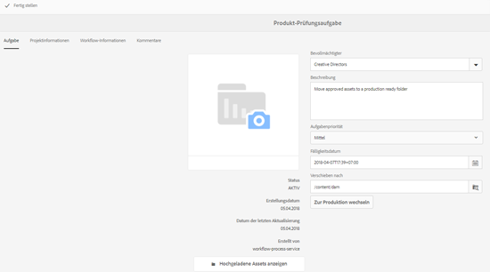

1. Geben Sie den Pfad des produktionsbereiten Ordners im Feld **Verschieben nach** ein.

   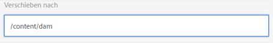

   Tippen/klicken Sie auf **Zur Produktion wechseln**. Schließen Sie die Bestätigungsmeldung. Die Assets werden in den angegebenen Pfad verschoben und es wird automatisch ein Rotationsset für die bestätigten Assets für jedes Produkt basierend auf der Ordnerhierarchie erstellt.

1. Tippen/klicken Sie in der Symbolleiste auf das Symbol **Fertig stellen**. Der Workflow wird mit Kennzeichnung des letzten Schritts als fertig gestellt abgeschlossen.

## Anzeigen von DAM-Asset-Metadaten  {#viewing-dam-asset-metadata}

Nach erfolgter Bestätigung werden die Assets mit den entsprechenden Produkten verknüpft. Die [Eigenschaftenseite](/help/assets/manage-assets.md#editing-properties) der bestätigten Assets weist nunmehr die zusätzliche Registerkarte **Produktdaten** (verknüpfte Produktinformationen) auf. Auf dieser Registerkarte werden die Produktdetails, SKU-Nummer und weitere produktbezogene Details angezeigt, die das Asset verknüpfen. Tippen/klicken Sie auf das Symbol **Bearbeiten**, um die Eigenschaften eines Assets zu aktualisieren. Die produktbezogenen Informationen sind stets schreibgeschützt.

Klicken Sie auf den angezeigten Link, um zur entsprechenden Produktdetailseite in der Produktekonsole zu navigieren, mit der das Asset verknüpft ist.

## Anpassen der Workflows für Projekt-Fotoshootings {#customizing-the-project-photo-shoot-workflows}

Sie können die Workflows für Projekt-Fotoshootings je nach Anforderung anpassen. Dies ist eine optionale rollenbasierte Aufgabe, die zum Festlegen des Werts einer Variablen innerhalb des Projekts durchgeführt wird. Sie können danach den konfigurierten Wert zur Entscheidungsfindung heranziehen.

1. Klicken/tippen Sie auf das AEM-Logo und navigieren Sie zu **Tools** > **Workflow** > **Modelle**, um die Seite &quot;Workflow-Modelle&quot;zu öffnen.
1. Wählen Sie den Workflow **Produkt-Fotoshooting (Commerce-Integration)** oder **Produkt-Fotoshooting** aus und klicken/tippen Sie in der Symbolleiste auf **Bearbeiten**, um den Workflow im Bearbeitungsmodus zu öffnen.
1. Öffnen Sie die Aufgaben **Projekte** im Sidekick und ziehen Sie den Schritt **Rollenbasierte Projektaufgabe erstellen** in den Workflow.

   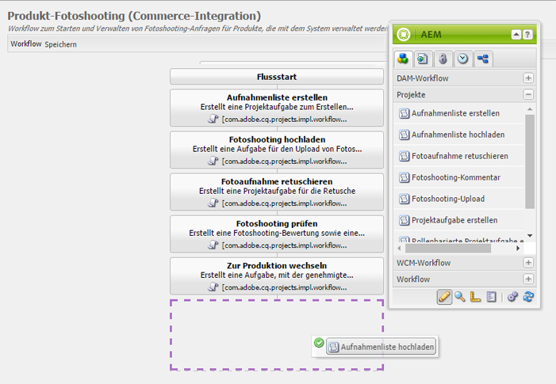

1. Öffnen Sie den Schritt **Rollenbasierte Aufgabe** .
1. Geben Sie auf der Registerkarte **Aufgabe** einen Namen für die Aufgabe ein, der in der Liste **Aufgabe** angezeigt wird. Sie können die Aufgabe auch einer Rolle zuweisen, die Standardpriorität festlegen, eine Beschreibung angeben und einen Zeitpunkt angeben, zu dem die Aufgabe fällig ist.

   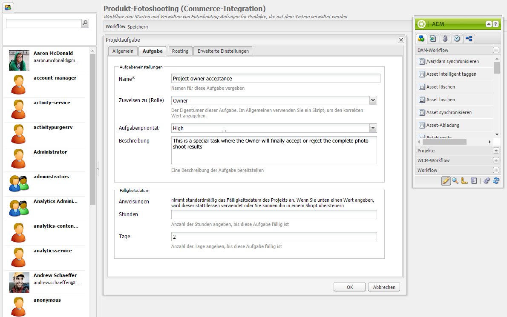

1. Geben Sie auf der Registerkarte **Routing** die Aktionen für die Aufgabe an. Um mehrere Aktionen hinzuzufügen, tippen/klicken Sie auf den Link &quot;Element hinzufügen&quot;.

   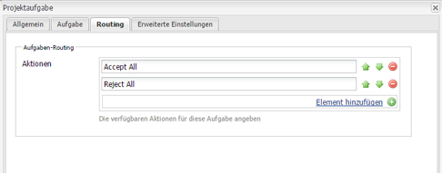

1. Klicken Sie nach dem Hinzufügen der Optionen auf **OK** , um die Änderungen zum Schritt hinzuzufügen.

   >[!NOTE]
   Durch Tippen/Klicken auf **OK** werden die Änderungen im Workflow nicht gespeichert. Tippen/klicken Sie zum Speichern der Änderungen im Workflow auf **Speichern**.

1. Öffnen Sie die Aufgaben **Workflow** aus dem Sidekick und fügen Sie eine Aufgabe **Gehe zu** hinzu.
1. Öffnen Sie die Aufgabe **Gehe zu** und tippen/klicken Sie auf die Registerkarte **Prozess**.
1. Geben Sie den folgenden Code im Feld **Skript** an:

```
   function check() {

   if (workflowData.getMetaDataMap().get("lastTaskAction","") == "Reject All") {

   return true

   }

   // set copywriter user in metadata

   var previousId = workflowData.getMetaDataMap().get("lastTaskCompletedBy", "");

   workflowData.getMetaDataMap().put("copywriter", previousId);

   return false;

   }
```

>[!NOTE]
Weitere Informationen zur Skripterstellung in Workflow-Schritten finden Sie unter [Definieren einer Regel für eine ODER-Teilung](/help/sites-developing/workflows-models.md).

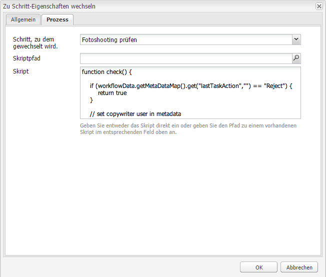

1. Tippen/klicken Sie auf **OK**.

1. Tippen/klicken Sie auf **Speichern**, um den Workflow zu speichern.

   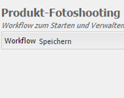

1. Eine neue Aufgabe zur Projekteigentümerakzeptanz wird nun ausgeführt, nachdem die [Aufgabe &quot;Zur Produktion wechseln](#move-to-production-task)&quot;abgeschlossen und dem Eigentümer zugewiesen wurde.

   Der Benutzer mit der Eigentümerrolle kann die Aufgabe abschließen und eine Aktion (in der Liste der in den Workflow-Schrittkonfigurationen hinzugefügten Aktionen) in der Liste im Kommentar-Popup auswählen.

   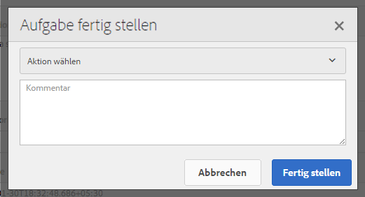

   Wählen Sie die geeignete Option aus und klicken Sie auf **Fertig stellen**, um den **Gehe-zu-Schritt** im Workflow auszuführen.

>[!NOTE]
Wenn Sie einen Server starten, speichert das Servlet für die Projektaufgabenliste die Zuordnungen zwischen Aufgabentypen und URLs zwischen, die unter `/libs/cq/core/content/projects/tasktypes` definiert sind. Anschließend können Sie die übliche Überlagerung durchführen und benutzerdefinierte Aufgabentypen hinzufügen, indem Sie sie unter `/apps/cq/core/content/projects/tasktypes` platzieren.
