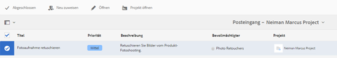

# Creative Project und PIM-Integration {#creative-project-and-pim-integration}

Wenn Sie Marketing- oder Kreativprofi sind, können Sie die Kreativprojektwerkzeuge in Adobe Experience Manager (AEM) verwenden, um eCommerce-bezogene Produktfotografie und zugehörige Kreativprozesse in Ihrem Unternehmen zu verwalten.

Sie können Creative Project verwenden, um die folgenden Aufgaben in Ihrem Fotoshooting-Workflow zu optimieren:

* Generieren einer Fotoshooting-Anfrage
* Hochladen eines Fotoshootings
* Zusammenarbeit an einem Fotoshooting
* Verpacken bestätigter Assets

>[!NOTE]
>
>Informationen zur Zuweisung von Benutzerrollen und Workflows zu bestimmen Benutzertypen finden Sie unter [Informationen zu Projekt-Benutzerrollen](/help/sites-authoring/projects.md#user-roles-in-a-project).

## Workflows für Produkt-Fotoshootings  {#exploring-product-photo-shoot-workflows}

Creative Project bietet mehrere Projektvorlagen, die unterschiedlichen Projektanforderungen gerecht werden. Die Vorlage **Projekt für Produkt-Fotoshooting** ist im Lieferumfang enthalten. Diese Vorlage stellt Fotoshooting-Workflows bereit, mit denen Sie Anfragen für Produkt-Fotoshootings einleiten und verwalten können. Sie enthält darüber hinaus eine Reihe von Aufgaben, die es Ihnen ermöglichen, digitale Bilder für Produkte anhand geeigneter Bewertungs- und Bestätigungsabläufe zu erhalten.

## Erstellen eines Projekts für Produkt-Fotoshooting {#create-a-product-photo-shoot-project}

1. Im **Projekte** Konsole, tippen oder klicken Sie auf **Erstellen** und wählen Sie dann **Projekt erstellen** aus der Liste.

   

1. Im **Projekt erstellen** Seite, wählen Sie die **Projekt für Produkt-Fotoshooting** Vorlage und Tippen oder klicken Sie auf **Nächste**.

   

1. Geben Sie Details zum Projekt einschließlich Titel, Beschreibung und Fälligkeitsdaten ein. Fügen Sie Benutzer hinzu und weisen Sie ihnen verschiedene Rollen zu. Sie können auch ein Miniaturbild für das Projekt hinzufügen.

   

1. Tippen oder klicken Sie auf **Erstellen**. Eine Bestätigungsmeldung informiert Sie, dass das Projekt erstellt wurde.
1. Tippen oder klicken Sie auf **Fertig** , um zur **Projekte** Konsole. Tippen oder klicken Sie alternativ auf **Öffnen** , um die Assets innerhalb des Projekts anzuzeigen.

## Beginn der Arbeit an einem Projekt für Produkt-Fotoshooting {#starting-work-in-a-product-photo-shoot-project}

Um eine Fotoshooting-Anfrage zu starten, tippen oder klicken Sie auf ein Projekt und dann auf **Arbeit hinzufügen** auf der Seite mit den Projektdetails , um einen Workflow zu starten.


A **Projekt für Produkt-Fotoshooting** umfasst die folgenden nativen Workflows:

* **Workflow &quot;Produkt-Fotoshooting (Commerce-Integration)&quot;**: Dieser Workflow nutzt die Commerce-Integration in das PIM-System (Product Information Management), um automatisch eine Aufnahmenliste für die ausgewählten Produkte (Hierarchie) zu erstellen. Sie können die Produktdaten als Teil der Asset-Metadaten anzeigen, nachdem der Workflow abgeschlossen wurde.
* **Workflow für Produkt-Fotoshooting**: Mit diesem Workflow können Sie eine Aufnahmenliste bereitstellen, anstatt von der Commerce-Integration abhängig zu sein. Dabei werden die hochgeladenen Bilder in einer CSV-Datei im Assets-Ordner des Projekts protokolliert.

Verwenden Sie die **Produkt-Fotoshooting (Commerce-Integration)** Workflow zum Zuordnen von Bild-Assets zu den Produkten in AEM. Dieser Workflow nutzt die Commerce-Integration, um die genehmigten Bilder mit den vorhandenen Produktdaten am Speicherort zu verknüpfen `/etc/commerce`.

Die **Produkt-Fotoshooting (Commerce-Integration)** Der Workflow umfasst die folgenden Aufgaben:

* Aufnahmenliste erstellen
* Fotoshooting hochladen
* Fotoaufnahme retuschieren
* Bewerten und bestätigen
* Zu Produktionsaufgabe wechseln

Wenn Produktinformationen in AEM nicht verfügbar sind, verwenden Sie die **Produkt-Fotoshooting** Workflow zum Zuordnen von Bild-Assets zu den Produkten basierend auf den Details, die Sie in eine CSV-Datei hochladen. Die CSV-Datei muss grundlegende Produktinformationen wie zum Beispiel Produkt-ID, Kategorie und Beschreibung enthalten. Der Workflow ruft bestätigte Assets für die Produkte ab.

Dieser Workflow umfasst die folgenden Aufgaben:

* Aufnahmenliste hochladen
* Fotoshooting hochladen
* Fotoaufnahme retuschieren
* Bewerten und bestätigen
* Zu Produktionsaufgabe wechseln

Sie können diesen Workflow mit der Workflow-Konfigurationsoption anpassen.

Beide Workflows umfassen Schritte zur Verknüpfung von Produkten mit ihren bestätigten Assets. Jeder Workflow umfasst die folgenden Schritte:

* Workflow-Konfiguration: Beschreibt die Optionen zur Anpassung des Workflows
* Starten eines Projekt-Workflows: Erklärt, wie ein Produkt-Fotoshooting gestartet wird
* Workflow-Aufgabendetails: Stellt Details von Aufgaben bereit, die im Workflow zur Verfügung stehen

## Verfolgen des Projektfortschritts {#tracking-project-progress}

Sie können den Fortschritt eines Projekts verfolgen, indem Sie die aktiven/abgeschlossenen Aufgaben im Projekt überwachen.

Verwenden Sie Folgendes, um den Fortschritt eines Projekts zu überwachen:

* Aufgabenkarte  
* Aufgabenliste

Die Aufgabenkarte zeigt den Gesamtfortschritt des Projekts. Sie wird nur dann auf der Seite mit den Projektdetails angezeigt, wenn das Projekt verwandte Aufgaben hat. Auf der Aufgabenkarte wird der aktuelle Abschlussstatus des Projekts basierend auf der Anzahl der abgeschlossenen Aufgaben angezeigt. Zukünftige Aufgaben werden nicht berücksichtigt.

Die Aufgabenkarte enthält die folgenden Details:

* Prozentsatz der aktiven Aufgaben
* Prozentsatz der abgeschlossenen Aufgaben


Die Aufgabenliste enthält detaillierte Informationen zur derzeit aktiven Workflow-Aufgabe für das Projekt. Um die Liste anzuzeigen, tippen oder klicken Sie auf die Aufgabenkarte. In der Aufgabenliste werden auch Metadaten wie Startdatum, Fälligkeitsdatum, Bevollmächtigter, Priorität und Status der Aufgabe angezeigt.


## Workflow-Konfiguration {#workflow-configuration}

Diese Aufgabe schließt die Zuweisung von Workflow-Schritten zu Benutzern auf Grundlage ihrer Rollen ein.

So konfigurieren Sie den Workflow **Produkt-Fotoshooting**:

1. Navigieren Sie zu **Instrumente** > **Workflows** und tippen Sie dann auf **Modelle** -Kachel zum Öffnen **Workflow-Modelle** Seite.
1. Wählen Sie die **Produkt-Fotoshooting** und tippen Sie auf **Bearbeiten** in der Symbolleiste, um sie im Bearbeitungsmodus zu öffnen.

   

1. Im **Workflow für Produkt-Fotoshooting** Seite, öffnen Sie eine Projektaufgabe. Öffnen Sie z. B. die Aufgabe **Aufnahmenliste hochladen**.

   

1. Tippen oder klicken Sie auf **Aufgabe** -Registerkarte, um Folgendes zu konfigurieren:

   * Name der Aufgabe
   * Standardbenutzer(rolle), der/die die Aufgabe empfängt
   * Standardpriorität der Aufgabe, die in der Aufgabenliste des Benutzers angezeigt wird
   * Aufgabenbeschreibung, die angezeigt wird, wenn der Bevollmächtigte die Aufgabe öffnet
   * Fälligkeitsdatum für eine Aufgabe, das auf Grundlage des Zeitpunkts des Aufgabenbeginns berechnet wird

1. Klicken Sie auf **OK**, um die Konfigurationseinstellungen zu speichern.

Sie können die zusätzlichen Aufgaben für die **Produkt-Fotoshooting** auf ähnliche Weise.

Führen Sie dieselben Schritte aus, um die Aufgaben im **Workflow &quot;Produkt-Fotoshooting (Commerce-Integration)&quot;**.

## Starten eines Projekt-Workflows {#starting-a-project-workflow}

In diesem Abschnitt wird beschrieben, wie das Produktinformationsmanagement in Ihr Creative-Projekt integriert wird.

1. Navigieren Sie zu einem Produkt-Fotoshooting-Projekt und tippen oder klicken Sie auf das **Arbeit hinzufügen** auf **Workflows** Karte.
1. Wählen Sie die **Produkt-Fotoshooting (Commerce-Integration)** Workflow-Karte zum Starten **Produkt-Fotoshooting (Commerce-Integration)** Arbeitsablauf. Wenn die Produktinformationen nicht verfügbar sind unter `/etc/commerce`, wählen Sie die **Produkt-Fotoshooting** und starten Sie **Produkt-Fotoshooting** Arbeitsablauf.

   

1. Tippen oder klicken Sie auf **Nächste** , um den Workflow im Projekt zu starten.
1. Geben Sie auf der nächsten Seite Details zum Workflow ein.

   

1. Tippen oder klicken Sie auf **Einsenden** , um den Fotoshooting-Workflow zu starten. Die Seite mit den Details zum Fotoshooting-Projekt wird angezeigt.

   

### Workflow-Aufgabendetails {#workflow-tasks-details}

Der Fotoshooting-Workflow umfasst mehrere Aufgaben. Jede Aufgabe wird auf Grundlage der für die Aufgabe definierten Konfiguration einer Benutzergruppe zugewiesen.

#### Aufnahmenlistenaufgabe erstellen {#create-shot-list-task}

Die Aufgabe **Aufnahmenliste erstellen** ermöglicht dem Projekteigentümer die Auswahl von Produkten, für die Bilder benötigt werden. Je nach vom Benutzer ausgewählter Option wird eine CSV-Datei generiert, die grundlegende Produktinformationen enthält.

1. Tippen oder klicken Sie im Projektordner unten rechts im [Aufgabenkarte](#tracking-project-progress) , um das Aufgabenelement im Workflow anzuzeigen.

   

1. Wählen Sie die **Aufnahmenliste erstellen** und tippen/klicken Sie dann auf die **Öffnen** in der Symbolleiste.

   

1. Überprüfen Sie die Aufgabendetails und tippen/klicken Sie dann auf die Schaltfläche **Aufnahmenliste erstellen**.

   

1. Wählen Sie Produkte, für die Produktdaten ohne verknüpfte Bilder vorhanden sind.

   

1. Tippen oder klicken Sie auf **Zu Aufnahmenliste hinzufügen** -Schaltfläche, um eine CSV-Datei zu erstellen, die eine Liste all dieser Produkte enthält. Eine Meldung betätigt, dass die Aufnahmenliste für die ausgewählten Produkte erstellt wird. Klicken Sie auf **Schließen**, um den Workflow abzuschließen.

1. Nach dem Erstellen einer Aufnahmenliste wird der Link **Aufnahmenliste anzeigen** angezeigt. Um weitere Produkte zur Aufnahmenliste hinzuzufügen, tippen oder klicken Sie auf **Zur Aufnahmenliste hinzufügen**. In diesem Fall werden die Daten an die anfangs erstellte Aufnahmenliste angehängt.

   

1. Tippen oder klicken Sie auf **Aufnahmenliste anzeigen** um die neue Aufnahmenliste anzuzeigen.

   

   Um die vorhandenen Daten zu bearbeiten oder neue Daten hinzuzufügen, tippen/klicken Sie in der Symbolleiste auf **Bearbeiten**. Nur das **Produkt **und **Beschreibung** -Felder können bearbeitet werden.

   

   Tippen oder klicken Sie nach dem Aktualisieren der Datei auf **Speichern** in der Symbolleiste, um die Datei zu speichern.

1. Tippen oder klicken Sie nach dem Hinzufügen der Produkte auf die **Fertig** auf **Aufnahmenliste erstellen** Aufgabendetailseite, um die Aufgabe als abgeschlossen zu markieren. Sie können wahlweise einen Kommentar hinzufügen.

Durch Abschluss der Aufgabe werden die folgenden Änderungen innerhalb des Projekts eingeführt:

* Der Produkthierarchie entsprechende Assets werden in einem Ordner mit demselben Namen wie der Titel des Workflow erstellt.
* Die Metadaten für die Assets werden in der Konsole „Assets“ bearbeitbar, sogar bevor der Fotograf die Bilder zur Verfügung stellt.
* Es wird ein Fotoshooting-Ordner erstellt, in dem die vom Fotografen bereitgestellten Bilder gespeichert werden. Der Fotoshooting-Ordner enthält Unterordner für jeden Produkteintrag in der Aufnahmenliste.

### Aufnahmenlistenaufgabe hochladen {#upload-shot-list-task}

Diese Aufgabe ist Teil des Produkt-Fotoshooting-Workflows. Diese Aufgabe führen Sie aus, wenn in AEM keine Produktinformationen verfügbar sind. In diesem Fall laden Sie eine Liste von Produkten in einer CSV-Datei hoch, für die Bild-Assets erforderlich sind. Basierend auf den Details in der CSV-Datei ordnen Sie Bild-Assets den Produkten zu. Die Datei muss eine CSV-Datei mit dem Namen `shotlist.csv`.

Verwenden Sie den Link **Aufnahmenliste anzeigen** unter der Projektkarte im vorherigen Verfahren, um eine Beispieldatei im CSV-Format herunterzuladen. Überprüfen Sie die Beispieldatei, um sich mit dem üblichen Inhalt einer CSV-Datei vertraut zu machen.

Die Produktliste oder CSV-Datei kann Felder wie z. B. **Kategorie, Produkt, ID, Beschreibung** und **Pfad** enthalten. Das Feld **ID** ist obligatorisch und enthält die Produkt-ID. Die anderen Felder sind optional.

Ein Produkt kann zu einer bestimmten Kategorie gehören. Die Produktkategorie kann in der CSV-Datei unterhalb der Spalte **Kategorie** aufgeführt werden. Das Feld **Produkt** enthält den Namen des Produkts. Geben Sie im Feld **Beschreibung** die Produktbeschreibung oder Anleitungen für Fotografen ein.

1. Tippen oder klicken Sie im Projektordner unten rechts im [Aufgabenkarte](#tracking-project-progress) um die Liste der Aufgaben im Workflow anzuzeigen.
1. Wählen Sie die **Aufnahmenliste hochladen** und tippen oder klicken Sie dann auf die **Öffnen** in der Symbolleiste.

   

1. Überprüfen Sie die Aufgabendetails und tippen oder klicken Sie dann auf die **Aufnahmenliste hochladen** Schaltfläche.

   

1. Tippen oder klicken Sie auf **Aufnahmenliste hochladen** Schaltfläche zum Hochladen der CSV-Datei. Der Workflow erkennt diese Datei als eine Quelle, die zum Extrahieren von Produktdaten für die nächste Aufgabe verwendet werden kann.
1. Laden Sie eine CSV-Datei hoch, die Produktinformationen im entsprechenden Format enthält. Die **Hochgeladene Assets anzeigen** wird unter der Karte angezeigt, nachdem die CSV-Datei hochgeladen wurde.

   

   Klicken Sie auf das Symbol **Fertig stellen**, um diese Aufgabe abzuschließen.

1. Tippen/klicken Sie auf **Fertig** -Symbol, um die Aufgabe abzuschließen.

### Aufgabe „Fotoshooting hochladen“ {#upload-photo-shoot-task}

Wenn Sie Bearbeiter sind, können Sie Aufnahmen für die Produkte hochladen, die im **shotlist.csv** -Datei, die in der vorherigen Aufgabe erstellt oder hochgeladen wurde.

Der Name der hochzuladenden Bilder muss mit `<ProductId_>` where `ProductId` wird über die **ID** im Feld `shotlist.csv` -Datei. Beispielsweise für ein Produkt in der Aufnahmenliste mit **ID** `397122`, würden Sie Dateien mit Namen hochladen `397122_highcontrast.jpg`, `397122_lowlight.png`usw.

Sie können entweder die Bilder direkt hochladen oder eine ZIP-Datei hochladen, die die Bilder enthält. Basierend auf ihren Namen werden die Bilder in den jeweiligen Produktordnern im Fotoshooting-Ordner abgelegt.

1. Tippen oder klicken Sie unter dem Projektordner auf die Schaltfläche mit den Auslassungspunkten unten rechts im [Aufgabenkarte](#tracking-project-progress) , um das Aufgabenelement im Workflow anzuzeigen.
1. Wählen Sie die **Fotoshooting hochladen** und tippen oder klicken Sie dann auf die **Öffnen** in der Symbolleiste.

   

1. Tippen oder klicken Sie auf **Fotoshooting hochladen** und laden Sie die Fotoshootbilder hoch.
1. Tippen oder klicken Sie auf **Fertig** in der Symbolleiste, um die Aufgabe abzuschließen.

### Aufgabe „Fotoaufnahme retuschieren“ {#retouch-photo-shoot-task}

Wenn Sie über Bearbeitungsrechte verfügen, führen Sie die **Fotoaufnahme retuschieren** Aufgabe, um die Bilder zu bearbeiten, die in den Fotoshooting-Ordner hochgeladen wurden.

1. Tippen oder klicken Sie unter dem Projektordner auf die Schaltfläche mit den Auslassungspunkten unten rechts im [Aufgabenkarte](#tracking-project-progress) , um das Aufgabenelement im Workflow anzuzeigen.
1. Wählen Sie die **Fotoaufnahme retuschieren** und tippen/klicken Sie dann auf die **Öffnen** in der Symbolleiste.

   

1. Tippen oder klicken Sie auf **Hochgeladene Assets anzeigen** im **Fotoaufnahme retuschieren** Seite, um die hochgeladenen Bilder zu durchsuchen.

   

   Falls erforderlich, bearbeiten Sie die Bilder mit einer Adobe Creative Cloud-Applikation.

   

1. Tippen oder klicken Sie auf **Fertig** in der Symbolleiste, um die Aufgabe abzuschließen.

### Aufgabe „Überprüfen und bestätigen“ {#review-and-approve-task}

In dieser Aufgabe prüfen Sie die Fotoaufnahmen, die von einem Fotografen hochgeladen wurden, und markieren die Aufnahmen als für die Nutzung freigegeben.

1. Tippen oder klicken Sie unter dem Projektordner auf die Schaltfläche mit den Auslassungspunkten unten rechts im [Aufgabenkarte](#tracking-project-progress) , um das Aufgabenelement im Workflow anzuzeigen.
1. Wählen Sie die **Überprüfen und genehmigen** und tippen oder klicken Sie dann auf die **Öffnen** in der Symbolleiste.

   

1. Im **Überprüfen und genehmigen** Seite, weisen Sie die Prüfungsaufgabe einer Rolle zu und tippen oder klicken Sie auf **Überprüfen** , um mit der Überprüfung der hochgeladenen Produktbilder zu beginnen.

   

1. Wählen Sie ein Produktbild aus und tippen oder klicken Sie auf das **Genehmigen** in der Symbolleiste, um sie als genehmigt zu markieren. Sobald Sie ein Bild genehmigt haben, wird darüber ein „Genehmigt“-Banner angezeigt.

   

1. Tippen oder klicken Sie auf **Fertig**. Die bestätigten Bilder werden mit den leeren Assets verknüpft, die erstellt wurden.

Sie können Produkte ohne Bilder übergehen. Zu einem späteren Zeitpunkt können Sie zur Aufgabe zurückkehren und sie nach Erledigung als abgeschlossen kennzeichnen.

Mithilfe der Assets-Benutzeroberfläche können Sie zu den Projekt-Assets navigieren und die genehmigten Bilder überprüfen.

Tippen oder klicken Sie auf die nächste Ebene, um Produkte gemäß Ihrer Produktdatenhierarchie anzuzeigen.

Creative Project verbindet bestätigte Assets mit dem referenzierten Produkt. Die Asset-Metadaten werden mit dem Produktverweis und grundlegenden Informationen auf der Registerkarte **Produktdaten** unter den Asset-Eigenschaften aktualisiert. Sie werden im Abschnitt mit den AEM Assets-Metadaten angezeigt.

>[!NOTE]
>
>Im **Workflow &quot;Produkt-Fotoshooting&quot;** (ohne Commerce-Integration) haben die genehmigten Bilder keine Verknüpfung mit Produkten.

### Zu Produktionsaufgabe wechseln {#move-to-production-task}

Mit dieser Aufgabe werden die bestätigten Assets in den produktionsbereiten Ordner verschoben, damit sie verwendet werden können.

1. Tippen oder klicken Sie unter dem Projektordner auf die Schaltfläche mit den Auslassungspunkten unten rechts im [Aufgabenkarte](#tracking-project-progress) , um das Aufgabenelement im Workflow anzuzeigen.
1. Wählen Sie die **Zur Produktion wechseln** und tippen oder klicken Sie dann auf die **Öffnen** in der Symbolleiste.

   

1. Um die bestätigten Assets für das Fotoshooting vor dem Verschieben in den produktionsbereiten Ordner anzuzeigen, klicken Sie auf den Link **Bestätigte Assets anzeigen** unter der Projektminiatur auf der Aufgabenseite **Zur Produktion wechseln**.

   

1. Geben Sie den Pfad des Ordners für produktionsbereite Dateien im **Verschieben nach** -Feld.

   

1. Tippen oder klicken Sie auf **Zur Produktion wechseln**. Schließen Sie die Bestätigungsmeldung. Die Assets werden in den genannten Pfad verschoben und für jedes Produkt wird basierend auf der Ordnerhierarchie automatisch ein Rotationsset für die genehmigten Assets erstellt.

1. Tippen/klicken Sie in der Symbolleiste auf das Symbol **Fertig stellen**. Der Workflow wird mit Kennzeichnung des letzten Schritts als fertig gestellt abgeschlossen.

## Anzeigen von DAM-Asset-Metadaten {#viewing-dam-asset-metadata}

Nach erfolgter Bestätigung werden die Assets mit den entsprechenden Produkten verknüpft. Die [Eigenschaftenseite](/help/assets/manage-assets.md#editing-properties) der bestätigten Assets weist nunmehr die zusätzliche Registerkarte **Produktdaten** (verknüpfte Produktinformationen) auf. Auf dieser Registerkarte werden die Produktdetails, SKU-Nummer und weitere produktbezogene Details angezeigt, die das Asset verknüpfen. Tippen oder klicken Sie auf **Bearbeiten** -Symbol, um eine Asset-Eigenschaft zu aktualisieren. Die produktbezogenen Informationen sind stets schreibgeschützt.

Tippen oder klicken Sie auf den angezeigten Link, um zur entsprechenden Produktdetailseite in der Produktkonsole zu navigieren, mit der das Asset verknüpft ist.

## Anpassen der Workflows für Projekt-Fotoshootings {#customizing-the-project-photo-shoot-workflows}

Sie können die **Projekt-Fotoshooting** Workflows auf Grundlage Ihrer Anforderungen. Dies ist eine optionale rollenbasierte Aufgabe, die zum Festlegen des Werts einer Variablen innerhalb des Projekts durchgeführt wird. Sie können danach den konfigurierten Wert zur Entscheidungsfindung heranziehen.

1. Klicken oder tippen Sie auf das AEM und navigieren Sie dann zu **Instrumente** > **Workflow** > **Modelle** , um **Workflow-Modelle** Seite.
1. Wählen Sie die **Produkt-Fotoshooting (Commerce-Integration)** oder **Produkt-Fotoshooting** und klicken oder tippen Sie auf **Bearbeiten** in der Symbolleiste, um den Workflow im Bearbeitungsmodus zu öffnen.
1. Öffnen Sie das seitliche Bedienfeld und suchen Sie die **Rollenbasierte Projektaufgabe erstellen** und ziehen Sie es in den Workflow.

   

1. Öffnen Sie die **Rollenbasierte Aufgabe** Schritt.
1. Im **Aufgabe** Geben Sie einen Namen für die Aufgabe an, die in der Aufgabenliste angezeigt werden soll. Sie können die Aufgabe auch einer Rolle zuweisen, die Standardpriorität festlegen, eine Beschreibung angeben und einen Zeitpunkt angeben, zu dem die Aufgabe fällig ist.

   

1. Im **Routing** Registerkarte die Aktionen für die Aufgabe angeben. Um mehrere Aktionen hinzuzufügen, tippen oder klicken Sie auf die **Element hinzufügen** Link.

   

1. Klicken Sie nach dem Hinzufügen der Optionen auf **OK** , um die Änderungen zum Schritt hinzuzufügen.

1. Zurück im **Workflow-Modell** Tippen oder Klicken auf ein Fenster **Synchronisieren** , um die Änderungen des gesamten Workflows zu speichern. Tippen oder Klicken **OK** für den Schritt speichert die Änderungen nicht im Workflow. Um Änderungen im Workflow zu speichern, tippen oder klicken Sie auf **Synchronisieren**.

1. Öffnen Sie das seitliche Bedienfeld und suchen Sie die **Zum Schritt wechseln** und ziehen Sie sie in den Workflow.

1. Öffnen Sie die **Goto** Aufgabe und tippen oder klicken Sie auf **Prozess** Registerkarte.

1. Wählen Sie die **Target-Schritt** , um zu wechseln und anzugeben, dass **Routing-Ausdruck** ist ECMA-Skript. Geben Sie dann den folgenden Code im **Skript** -Feld:

   ```javascript
   function check() {
   
   if (workflowData.getMetaDataMap().get("lastTaskAction","") == "Reject All") {
   
   return true
   
   }
   
   // set copywriter user in metadata
   
   var previousId = workflowData.getMetaDataMap().get("lastTaskCompletedBy", "");
   
   workflowData.getMetaDataMap().put("copywriter", previousId);
   
   return false;
   
   }
   ```

   >[!TIP]
   >
   >Weitere Informationen zur Skripterstellung in Workflow-Schritten finden Sie unter [Definieren einer Regel für eine ODER-Teilung](/help/sites-developing/workflows-models.md).

   

1. Tippen oder klicken Sie auf **OK**.

1. Tippen oder klicken Sie auf **Synchronisieren** , um den Workflow zu speichern.

Nach dem [Zur Produktionsaufgabe wechseln](#move-to-production-task) ist abgeschlossen und wird dem Eigentümer zugewiesen.

Der Benutzer im **Inhaber** Rolle kann die Aufgabe abschließen und eine Aktion (aus der Liste der Aktionen, die in den Workflow-Schrittkonfigurationen hinzugefügt werden) aus der Liste im Kommentar-Popup auswählen.

>[!NOTE]
>
>Wenn Sie einen Server starten, speichert das Servlet für die Projektaufgabenliste die Zuordnungen zwischen Aufgabentypen und URLs zwischen, die unter `/libs/cq/core/content/projects/tasktypes`. Anschließend können Sie die übliche Überlagerung durchführen und benutzerdefinierte Aufgabentypen hinzufügen, indem Sie sie unter `/apps/cq/core/content/projects/tasktypes`.
