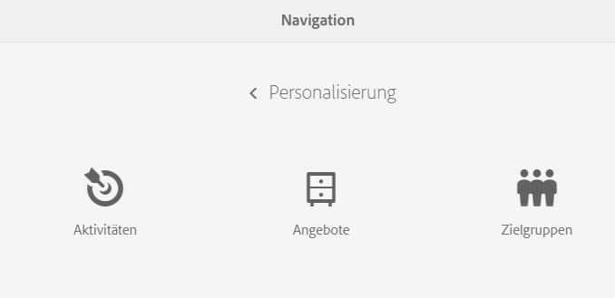
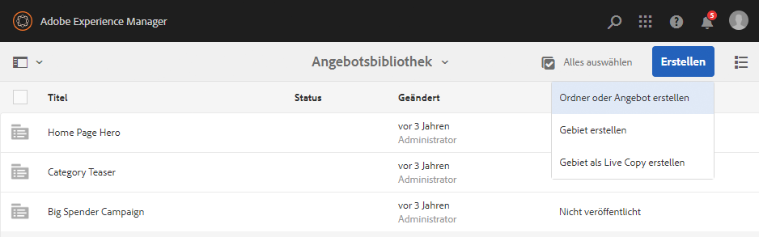
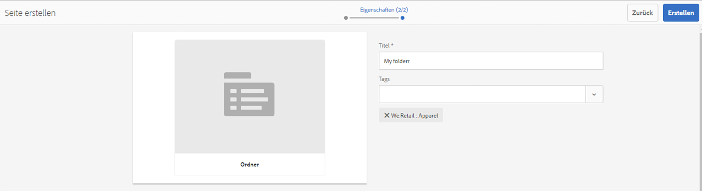
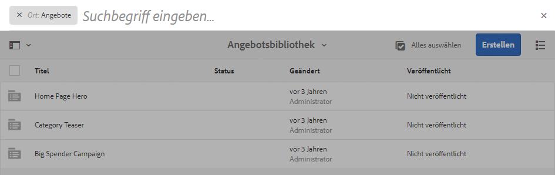

# Erstellen und Verwalten von Angeboten{#creating-and-managing-offers}

Mit der Angebotskonsole lassen sich Angebote erstellen, die für [Erlebnisse in Aktivitäten eingesetzt werden können](/help/sites-authoring/content-targeting-touch.md). Durch das Erstellen von Angeboten mithilfe der Konsole sparen Sie Zeit, wenn ein Angebot für mehrere Erlebnisse benötigt wird:

* Erstellen Sie das Angebot einmal in der Bibliothek und verwenden Sie es in mehreren Erlebnissen Ihrer Markenaktivitäten.
* Ändern Sie das Angebot in der Bibliothek, und die Änderung wirkt sich auf alle Erlebnisse aus, die es verwenden.

In der Angebotskonsole werden Angebote nach Marken sortiert. Jede Marke verfügt über eine Angebotsbibliothek, die für die Erlebnisse dieser Marke verwendet werden kann. Verwenden Sie Ordner, um eine hierarchische Struktur für die Organisation von Angeboten in den einzelnen Bibliotheken zu definieren. Mithilfe logischer Ordnerstrukturen können Autorinnen und Autoren Angebote beim Durchsuchen leichter auffinden. Tagging- und Such-Tools vereinfachen die Suche für Autorinnen und Autoren zusätzlich.

## Hinzufügen von Marken mithilfe der Angebotskonsole {#add-a-brand-using-the-offers-console}

Erstellen Sie eine Marke, mit der Angebote verknüpft werden sollen. Öffnen Sie eine Marke in der Angebotskonsole, um auf deren Angebotsbibliothek zuzugreifen, in der Sie Ordner und Angebote erstellen können.

Wenn Sie eine Marke mithilfe der Angebotskonsole erstellen, wird diese Marke auch in der [Aktivitätskonsole](/help/sites-authoring/activitylib.md) angezeigt, in der Sie Aktivitäten für die Marke hinzufügen und verwalten können.

1. Klicken Sie in der Navigationskonsole auf **Personalisierung** > **Angebote**.

   

1. Klicks **Erstellen** und dann **Erstellen** **Marke**.
1. Wählen Sie die Markenvorlage aus und klicken Sie auf **Weiter**.
1. Geben Sie den Namen der Marke an, der in Angebots- und Aktivitätskonsole angezeigt werden soll. Optional können Sie eins oder mehrere Tags eingeben oder auswählen, die mit der Marke verknüpft werden sollen.
1. Klicken Sie auf **Erstellen**.

## Hinzufügen von Ordnern zu Angebotsbibliotheken {#add-a-folder-to-an-offer-library}

Fügen Sie der Angebotsbibliothek einer Marke einen Ordner hinzu, um Angebote zu ordnen und zu speichern. Sie können einen Ordner unterhalb der Marke oder unter anderen Ordnern erstellen.

1. Navigieren Sie in der Angebotskonsole zu dem Speicherort, an dem der Ordner erstellt werden soll. Öffnen Sie beispielsweise die Marke, um einen Ordner auf der obersten Ebene zu erstellen, oder öffnen Sie einen anderen Ordner in der Bibliothek.
1. Klicks **Erstellen** > **Ordner oder Angebot erstellen**.

   

1. Wählen Sie **Ordner** aus und klicken Sie auf **Weiter**.
1. Geben Sie den Ordnernamen ein, der in der Angebotsbibliothek angezeigt werden soll, und geben Sie Tags ein oder wählen Sie diese aus.

   

1. Klicken Sie auf **Erstellen**.

## Hinzufügen von Angeboten zu Angebotsbibliotheken {#add-an-offer-to-an-offer-library}

Fügen Sie ein Angebot in der Angebotsbibliothek einer Marke hinzu, sodass es zu den Erlebnissen der Marke hinzugefügt werden kann. Wenn Sie ein Angebot hinzufügen, müssen Sie einen Titel eingeben. Sie können das Angebot auch mit einem oder mehreren Tags verknüpfen, damit einfacher danach gesucht werden kann.

Nach Erstellung des Angebots können Sie es öffnen, um Inhalte zu verfassen.

1. Navigieren Sie in der Angebotskonsole zu dem Speicherort, an dem das Angebot erstellt werden soll. Öffnen Sie beispielsweise eine Marke, um ein übergeordnetes Angebot zu erstellen, oder öffnen Sie einen Ordner der Bibliothek.
1. Klicks **Erstellen** > **Ordner oder Angebot erstellen**.

   

1. Wählen Sie die **Angebotsseite** Vorlage und klicken Sie auf **Nächste**.
1. Geben Sie einen Titel für das Angebot ein und wählen Sie optional ein oder mehrere Tags aus, die mit dem Angebot verknüpft werden sollen, und klicken Sie dann auf **Erstellen**.
1. Klicken Sie im Bestätigungsdialogfeld auf , um das Angebot zur Bearbeitung zu öffnen. **Seite öffnen**.

## Bearbeiten von Angeboten {#editing-an-offer}

Öffnen Sie ein Angebot und bearbeiten Sie den Inhalt so, wie er in den Erlebnissen, die es verwenden, erscheinen soll. Wenn Sie ein Angebot bearbeiten, das in beliebigen Erlebnissen verwendet wird, werden Ihre Änderungen in den Erlebnissen angezeigt.

Sie können Angebote über den Ordner in der Angebotsbibliothek oder direkt über die Suchergebnisse öffnen. Außerdem können Sie ein Angebot über das Erlebnis öffnen, mit dem es verknüpft ist.

1. Klicken Sie in der Angebotskonsole auf das Symbol neben dem Angebot und klicken Sie auf **Bearbeiten**.
1. Fügen Sie dem Angebot Komponenten hinzu und bearbeiten Sie den Komponenteninhalt wie üblich.

## Löschen von Angeboten {#deleting-an-offer}

Wird ein Angebot nicht länger benötigt, können Sie es löschen. Sollten Sie versuchen, ein Angebot zu löschen, das von einem Erlebnis verwendet wird, werden Sie zur Bestätigung des Löschvorgangs aufgefordert. Wenn Sie bestätigen, dass das Angebot gelöscht werden soll, wird es aus den entsprechenden Erlebnissen entfernt.

Sie können Angebote löschen, wenn Sie entweder Ordnerinhalte der Angebotsbibliothek oder Suchergebnisse anzeigen.

1. Klicken Sie in der Angebotskonsole auf das Symbol neben dem Angebot und klicken Sie auf **Löschen**.

   Wählen Sie das Angebot aus und klicken Sie auf **Löschen**.

1. Klicken Sie im angezeigten Dialogfeld auf **Löschen** , um den Löschvorgang zu bestätigen.
1. Wird das Angebot von einem oder mehreren Erlebnissen verwendet, sehen Sie ein Dialogfeld, das auf die Referenzierung des Angebots hinweist:

   * Um das Angebot zu löschen und aus den Erlebnissen zu entfernen, klicken Sie auf **Löschen erzwingen**.
   * Um das Angebot beizubehalten, klicken Sie auf **Abbrechen**.

## Suchen nach Angeboten {#searching-for-offers}

Suchen Sie in den Angeboten Ihrer Marken mithilfe von Keywords nach passenden Titeln.

Die derzeit angewendeten Suchkriterien werden neben den Suchergebnissen eingeblendet. Sie können die Ergebnisse zudem nach Spalten in auf- oder absteigender Reihenfolge sortieren. Sie können beliebige Ordner einer Bibliothek durchsuchen. Die Suchergebnisse sind unabhängig vom ausgewählten Ordner immer die gleichen.

So durchsuchen Sie Angebote:

1. Klicken Sie oben in der Angebotskonsole auf das Lupensymbol. Die Suche wird standardmäßig auf Angebote beschränkt.
1. Geben Sie einen Suchbegriff ein, um nach Angeboten zu suchen. Wählen Sie aus den Ergebnissen das passende aus.
