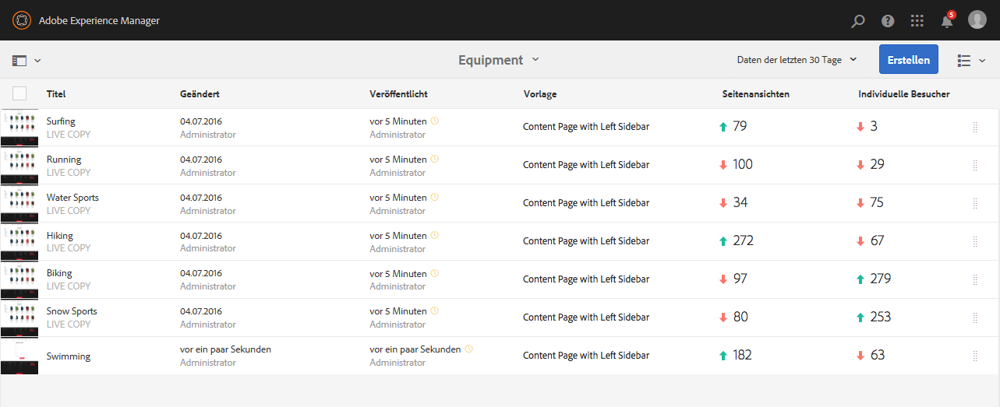
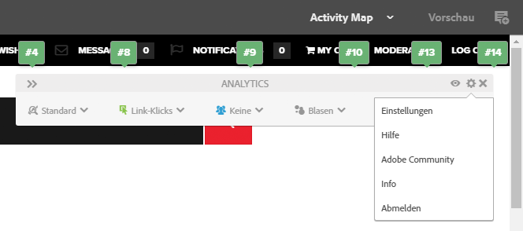
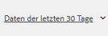
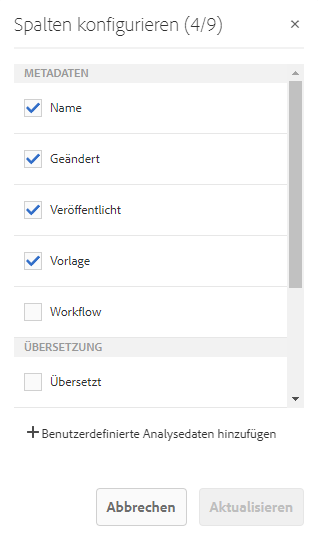
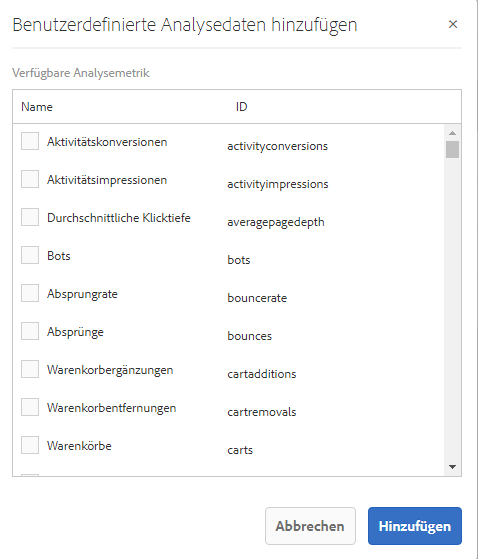
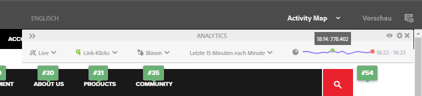
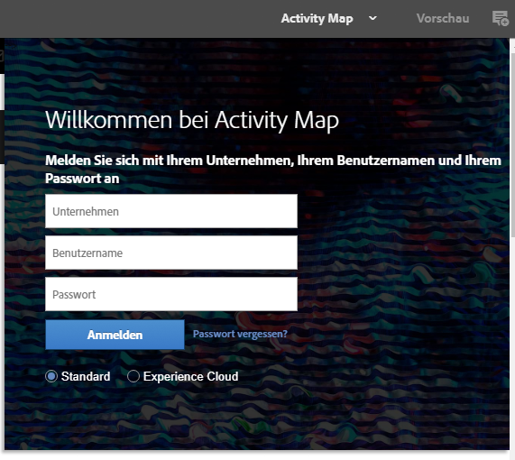
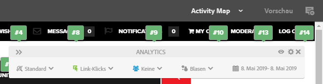
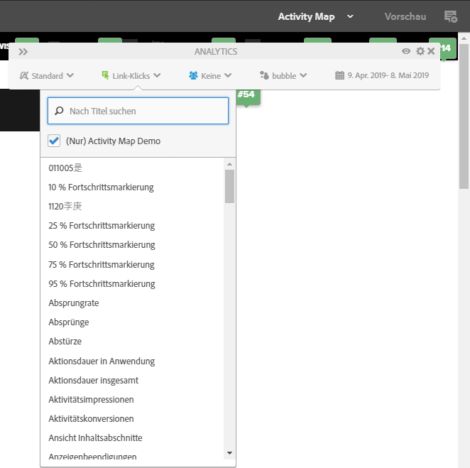
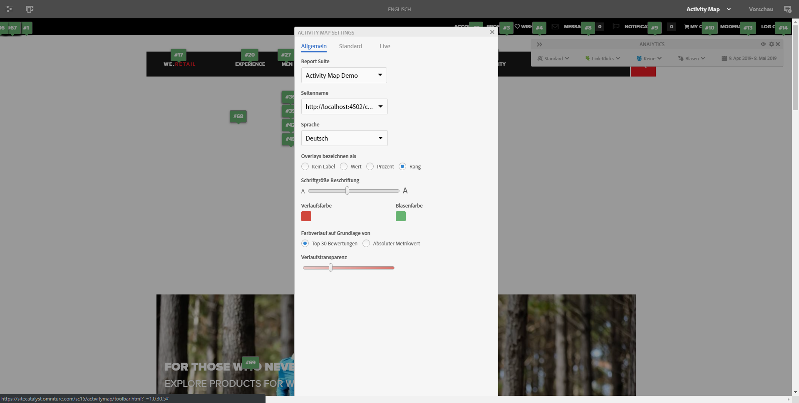

# Anzeigen von Seitenanalysedaten{#seeing-page-analytics-data}

Verwenden Sie Seitenanalysedaten, um die Wirkung des Seiteninhalts zu messen.

## In der Konsole sichtbare Analysedaten  {#analytics-visible-from-the-console}

Seitenanalysedaten werden in der [Listenansicht](/help/sites-authoring/basic-handling.md#list-view) der Konsole „Sites“ angezeigt. Wenn Seiten im Listenformat angezeigt werden, sind die folgenden Spalten standardmäßig verfügbar:

* Seitenansichten
* Individuelle Besucher
* Zeit auf Seite

Jede Spalte zeigt einen Wert für den aktuellen Berichtszeitraum an und gibt außerdem an, ob der Wert sich seit dem vorherigen Berichtszeitraum erhöht oder verringert hat. Die Daten, die Sie sehen, werden alle 12 Stunden aktualisiert.

>[!NOTE]
>
>Zum Ändern des Aktualisierungszeitraums [konfigurieren Sie das Importintervall](/help/sites-administering/adobeanalytics-connect.md#configuring-the-import-interval).

1. Öffnen Sie die Konsole **Sites**, z. B. [ http://localhost:4502/sites.html/content](http://localhost:4502/sites.html/content).
1. Klicken oder tippen Sie ganz rechts oben in der Symbolleiste auf das Symbol, um **Listenansicht** auszuwählen. (Das angezeigte Symbol ist von der [aktuellen Ansicht](/help/sites-authoring/basic-handling.md#viewing-and-selecting-resources) abhängig.)

1. Klicken oder tippen Sie wieder ganz rechts oben in der Symbolleiste auf das Symbol und wählen Sie dann **Anzeigeeinstellungen** aus. Das Dialogfeld **Spalten konfigurieren** wird geöffnet. Nehmen Sie die erforderlichen Änderungen vor und bestätigen Sie den Vorgang mit **Aktualisieren**.

   

### Auswählen des Berichtszeitraums {#selecting-the-reporting-period}

Wählen Sie den Berichtszeitraum aus, für den Analysedaten in der Konsole „Sites“ angezeigt werden:

* Daten der  Daten
* Daten der letzten 90 Tage
* Daten aus diesem Jahr

Der aktuelle Berichtszeitraum wird in der Symbolleiste der Konsole „Sites“ (rechts neben der oberen Symbolleiste) angezeigt. Wählen Sie den gewünschten Berichtszeitraum mit dem Dropdown aus.

### Konfigurieren der verfügbaren Datenspalten {#configuring-available-data-columns}

Mitglieder der Analyse-Administratorbenutzergruppe können die Konsole „Sites“ so konfigurieren, dass Autoren zusätzliche Analysespalten sehen können.

>[!NOTE]
>
>Wenn eine Struktur von Seiten untergeordnete Elemente enthält, die mit verschiedenen Adobe Analytics-Cloudkonfigurationen verbunden sind, können Sie die verfügbaren Datenspalten für die Seiten nicht konfigurieren.

1. Verwenden Sie in der Listenansicht die Ansichtsauswahl (rechts neben der Symbolleiste), wählen Sie **Ansichtseinstellungen** und dann **Benutzerdefinierte Analytics-Daten hinzufügen**.

   

1. Wählen Sie die Metriken aus, die Sie Autoren in der Sites-Konsole bereitstellen möchten, und klicken Sie dann auf **Hinzufügen**.

   Die angezeigten Spalten werden aus Adobe Analytics abgerufen.

   

### Öffnen von Inhaltseinblicken mithilfe von Sites {#opening-content-insights-from-sites}

Öffnen Sie [Content Insight](/help/sites-authoring/content-insights.md) in der Sites-Konsole, um die Seiteneffektivität weiter zu untersuchen.

1. Wählen Sie in der Konsole „Sites“ die Seite aus, für die Sie Inhaltseinblicke sehen möchten.
1. Klicken Sie in der Symbolleiste auf das Symbol „Analyse und Empfehlungen“.

   

## Im Seiteneditor sichtbare Analysedaten (Activity Map)  {#analytics-visible-from-the-page-editor-activity-map}

>[!NOTE]
>
>Dies wird angezeigt, wenn die [Activity Map für Ihre Website konfiguriert](/help/sites-administering/adobeanalytics-connect.md#configuring-for-the-activity-map) wurde.

>[!NOTE]
>
>Daten für die Activity Map werden aus Adobe Analytics übernommen.

Wenn Ihre Website für [Adobe Analytics konfiguriert](/help/sites-administering/adobeanalytics-connect.md) wurde, können Sie den Modus [Activity Map](/help/sites-authoring/author-environment-tools.md#page-modes) verwenden, um relevante Daten anzuzeigen. Beispiel:

### Zugriff auf die Activity Map {#accessing-the-activity-map}

Nachdem Sie den Modus [Activity Map ](/help/sites-authoring/author-environment-tools.md#page-modes) ausgewählt haben, müssen Sie Ihre Anmeldedaten für Adobe Analytics eingeben.  

Die bewegliche Symbolleiste von **Analytics** wird angezeigt. Hier haben Sie folgende Möglichkeiten:

* Ändern des Formats der Symbolleiste mit den doppelten Pfeilschaltflächen (**>>**)
* Ein- oder Ausblenden der Seitendetails (Augensymbol)
* Einstellungen der Activity Map konfigurieren (Zahnradsymbol)
* Anzuzeigende Analysedaten auswählen (verschiedene Dropdown-Selektoren)
* Activity Map beenden und Symbolleiste schließen (x)

### Auswahl der anzuzeigenden Analysedaten {#selecting-the-analytics-to-show}

Mithilfe der folgenden Kriterien können Sie auswählen, welche Analysedaten angezeigt werden sollen und wie sie angezeigt werden sollen:

* **Standard**/**Live**

* Ereignistyp
* Benutzergruppe
* **Blasen**/**Verlauf**/**Gewinner und Verlierer**/**Aus**

* Anzuzeigender Zeitraum

### Konfigurieren der Activity Map {#configuring-the-activity-map}

Verwenden Sie das Symbol **Einstellungen anzeigen**, um das Dialogfeld **Einstellungen für Activity Map** zu öffnen.    

Das Dialogfeld **Einstellungen für Activity Map** bietet auf drei Registerkarten eine Reihe von Optionen:  

* Allgemein

   * Report Suite
   * Seitenname
   * Sprache
   * Overlays bezeichnen als
   * Schriftgröße Beschriftung
   * Verlaufsfarbe
   * Blasenfarbe
   * Farbverlauf auf Grundlage von
   * Verlaufstransparenz

* Standard

   * Anzeige (Typ und Anzahl der Links)
   * Übergänge für Links ausblenden, die keine Treffer erhalten haben

* Live

   * Anzeige oben (Gewinner und Verlierer)
   * Unterste ausschließen %
   * Automatische Aktualisierung (Datum und Zeitraum)
