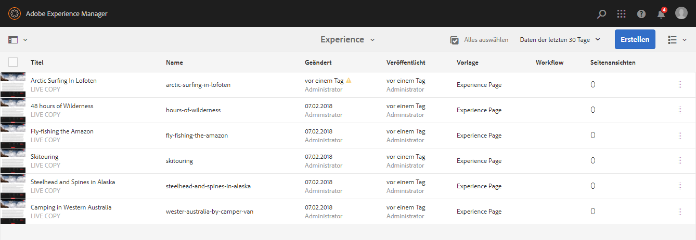
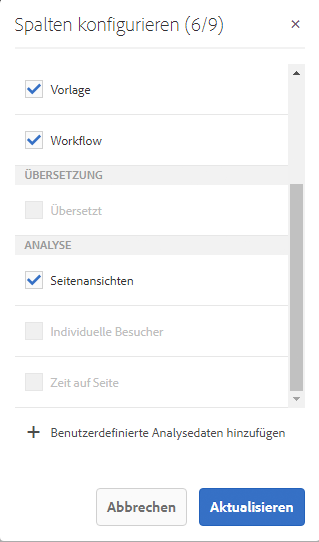

# Anzeigen von Seitenanalysedaten{#seeing-page-analytics-data}

Verwenden Sie Seitenanalysedaten, um die Effektivität des Seiteninhalts zu messen.

## In der Konsole sichtbare Analysen {#analytics-visible-from-the-console}

Seitenanalysedaten werden in der [Listenansicht](/help/sites-authoring/basic-handling.md#list-view) der Sites-Konsole angezeigt. Wenn die Seiten im Listenformat angezeigt werden, sind die folgenden Spalten standardmäßig verfügbar:

* Seitenansichten
* Unique Visitors
* Zeit auf Seite

Jede Spalte zeigt einen Wert für den aktuellen Berichtszeitraum an und zeigt dazu an, ob der Wert seit dem vorherigen Berichtszeitraum gestiegen oder gesunken ist. Die angezeigten Daten werden alle 12 Stunden aktualisiert.

>[!NOTE]
>
>Um den Aktualisierungszeitraum zu ändern, [konfigurieren Sie das Importintervall](/help/sites-administering/adobeanalytics-connect.md#configuring-the-import-interval).

1. Öffnen Sie die **Sites**-Konsole, z. B. [https://localhost:4502/sites.html/content](https://localhost:4502/sites.html/content).
1. Klicken oder tippen Sie ganz rechts in der Symbolleiste (obere rechte Ecke) auf das Symbol, um **Listenansicht** (Das angezeigte Symbol hängt von der [aktuelle Ansicht](/help/sites-authoring/basic-handling.md#viewing-and-selecting-resources)).

1. Klicken oder tippen Sie oben rechts in der Symbolleiste auf das Symbol und wählen Sie **Anzeigeeinstellungen**. Der Dialog **Spalten konfigurieren** wird geöffnet. Nehmen Sie die erforderlichen Änderungen vor und bestätigen Sie den Vorgang mit **Aktualisieren**.

   

### Auswählen des Berichtszeitraums {#selecting-the-reporting-period}

Wählen Sie den Berichtszeitraum aus, für den Analytics-Daten in der Sites-Konsole angezeigt werden:

* Daten der letzten 30   Daten
* Daten der letzten 90 Tage
* Daten aus diesem Jahr

Der aktuelle Berichtszeitraum wird in der Symbolleiste der Konsole „Sites“ (rechts neben der oberen Symbolleiste) angezeigt. Wählen Sie den gewünschten Berichtszeitraum mit dem Dropdown aus.

### Konfigurieren der verfügbaren Datenspalten {#configuring-available-data-columns}

Mitglieder der Benutzergruppe „Analytics-Administratoren“ können die Sites-Konsole konfigurieren, damit Autorinnen und Autoren zusätzliche Analytics-Spalten sehen können.

>[!NOTE]
>
>Wenn ein Seitenbaum untergeordnete Elemente enthält, die verschiedenen Cloud-Konfigurationen von Adobe Analytics zugeordnet sind, können Sie die verfügbaren Datenspalten für die Seiten nicht konfigurieren.

1. Verwenden Sie in der Listenansicht die Ansichtsselektoren (rechts neben der Symbolleiste) und wählen Sie **Anzeigeeinstellungen** und anschließend **Benutzerdefinierte Analysedaten hinzufügen** aus.

   

1. Wählen Sie die Metriken aus, die Sie Autoren in der Sites-Konsole bereitstellen möchten, und klicken Sie dann auf **Hinzufügen**.

   Die angezeigten Spalten werden aus Adobe Analytics abgerufen.

   

### Öffnen von Inhaltseinblicken mithilfe von Sites {#opening-content-insights-from-sites}

Öffnen Sie [Inhaltseinsicht](/help/sites-authoring/content-insights.md) von der Konsole „Sites“ aus, um die Seiteneffektivität weiter zu untersuchen.

1. Wählen Sie in der Sites-Konsole die Seite aus, für die Sie Inhaltseinblicke anzeigen möchten.
1. Klicken Sie in der Symbolleiste auf das Symbol „Analysen und Empfehlungen“.

   

## Im Seiten-Editor sichtbare Analysen (Activity Map) {#analytics-visible-from-the-page-editor-activity-map}

>[!CAUTION]
>
>Aufgrund von Sicherheitsänderungen in der Adobe Analytics-API ist es nicht mehr möglich, die in AEM enthaltene Version von Activity Map zu verwenden.
>
>Ab jetzt sollte das [über Adobe Analytics bereitgestellte Activity Map-Plug-in](https://experienceleague.adobe.com/docs/analytics/analyze/activity-map/getting-started/get-started-users/activitymap-install.html?lang=de) verwendet werden.
