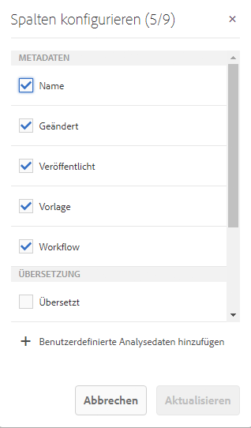

# Anzeigen von Seitenanalysedaten{#seeing-page-analytics-data}

Verwenden Sie Seitenanalysedaten, um die Wirkung des Seiteninhalts zu messen.

## In der Konsole sichtbare Analysedaten {#analytics-visible-from-the-console}

Seitenanalysedaten werden in der [Listenansicht](/help/sites-authoring/basic-handling.md#list-view) der Konsole „Sites“ angezeigt. Wenn Seiten im Listenformat angezeigt werden, sind die folgenden Spalten standardmäßig verfügbar:

* Seitenansichten
* Individuelle Besucher
* Zeit auf Seite

Jede Spalte zeigt einen Wert für den aktuellen Berichtszeitraum an und gibt außerdem an, ob der Wert sich seit dem vorherigen Berichtszeitraum erhöht oder verringert hat. Die Daten, die Sie sehen, werden alle 12 Stunden aktualisiert.

>[!NOTE]
>
>Zum Ändern des Aktualisierungszeitraums [konfigurieren Sie das Importintervall](/help/sites-administering/adobeanalytics-connect.md#configuring-the-import-interval).

1. Öffnen Sie die **Sites**-Konsole, z. B. [ https://localhost:4502/sites.html/content ](https://localhost:4502/sites.html/content).
1. Klicken oder tippen Sie ganz rechts oben in der Symbolleiste auf das Symbol, um **Listenansicht** auszuwählen. (Das angezeigte Symbol ist von der [aktuellen Ansicht](/help/sites-authoring/basic-handling.md#viewing-and-selecting-resources) abhängig.)

1. Klicken oder tippen Sie wieder ganz rechts oben in der Symbolleiste auf das Symbol und wählen Sie dann **Anzeigeeinstellungen** aus. Das Dialogfeld **Spalten konfigurieren** wird geöffnet. Nehmen Sie die erforderlichen Änderungen vor und bestätigen Sie den Vorgang mit **Aktualisieren**.

   

### Auswählen des Berichtszeitraums {#selecting-the-reporting-period}

Wählen Sie den Berichtszeitraum aus, für den Analysedaten in der Konsole „Sites“ angezeigt werden:

* Daten der letzten 30   Tage
* Daten der letzten 90 Tage
* Daten aus diesem Jahr

Der aktuelle Berichtszeitraum wird in der Symbolleiste der Konsole „Sites“ (rechts neben der oberen Symbolleiste) angezeigt. Wählen Sie den gewünschten Berichtszeitraum mit dem Dropdown aus.

### Konfigurieren der verfügbaren Datenspalten {#configuring-available-data-columns}

Mitglieder der Analyse-Administratorbenutzergruppe können die Konsole „Sites“ so konfigurieren, dass Autoren zusätzliche Analysespalten sehen können.

>[!NOTE]
>
>Wenn eine Struktur von Seiten untergeordnete Elemente enthält, die mit verschiedenen Adobe Analytics-Cloudkonfigurationen verbunden sind, können Sie die verfügbaren Datenspalten für die Seiten nicht konfigurieren.

1. Verwenden Sie in der Listenansicht die Ansichtsselektoren (rechts neben der Symbolleiste) und wählen Sie **Anzeigeeinstellungen** und anschließend **Benutzerdefinierte Analysedaten hinzufügen** aus.

   

1. Wählen Sie die Metriken aus, die Sie Autoren in der Sites-Konsole bereitstellen möchten, und klicken Sie dann auf **Hinzufügen**.

   Die angezeigten Spalten werden aus Adobe Analytics abgerufen.

   

### Öffnen von Inhaltseinblicken mithilfe von Sites {#opening-content-insights-from-sites}

Öffnen Sie [Inhaltseinsicht](/help/sites-authoring/content-insights.md) von der Konsole „Sites“ aus, um die Seiteneffektivität weiter zu untersuchen.

1. Wählen Sie in der Konsole „Sites“ die Seite aus, für die Sie Inhaltseinblicke sehen möchten.
1. Klicken Sie in der Symbolleiste auf das Symbol „Analyse und Empfehlungen“.

   

## Im Seiteneditor sichtbare Analysedaten (Activity Map) {#analytics-visible-from-the-page-editor-activity-map}

>[!CAUTION]
>
>Aufgrund von Sicherheitsänderungen in der Adobe Analytics-API ist es nicht mehr möglich, die in AEM enthaltene Version von Activity Map zu verwenden.
>
>Ab jetzt sollte das [über Adobe Analytics bereitgestellte Activity Map-Plug-in](https://experienceleague.adobe.com/docs/analytics/analyze/activity-map/getting-started/get-started-users/activitymap-install.html?lang=de) verwendet werden.
