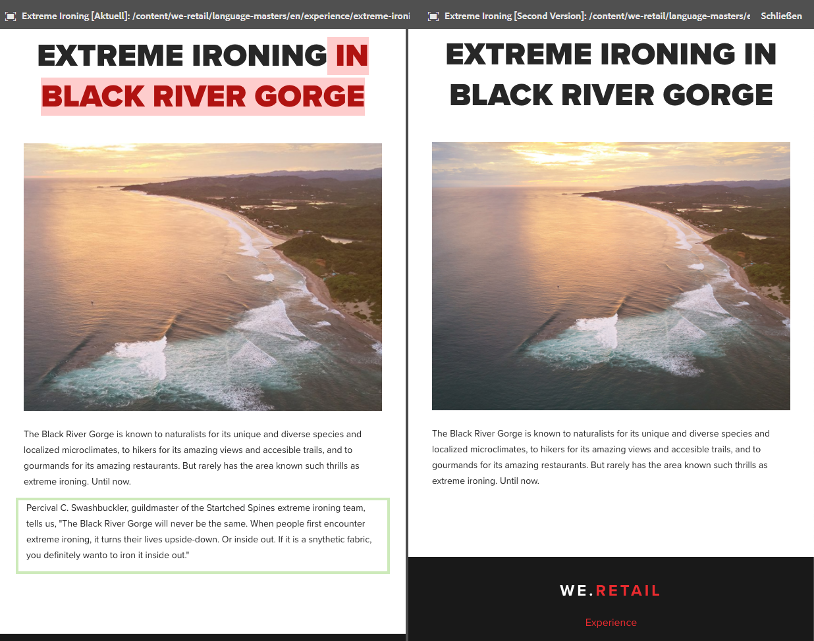
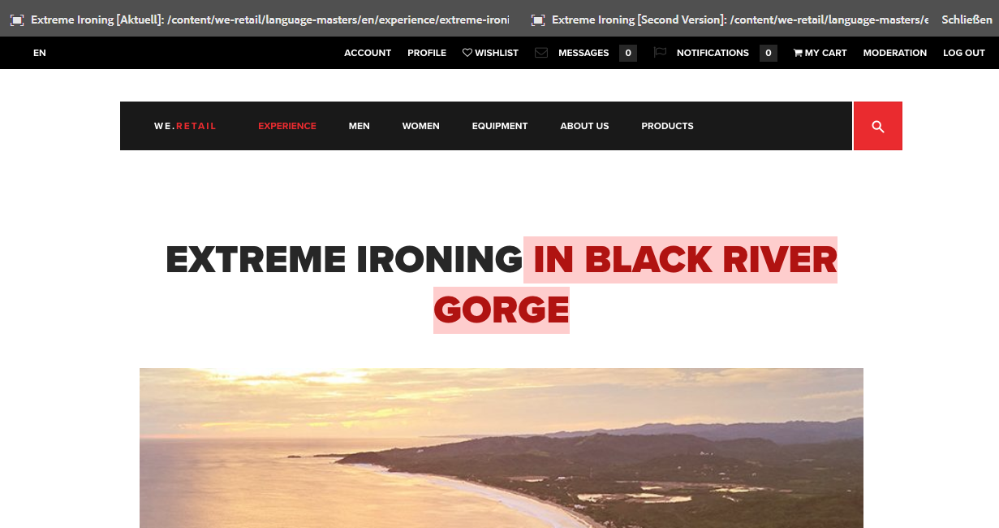

# Seitenvergleich{#page-diff}

## Einführung {#introduction}

Die Inhaltserstellung ist ein iterativer Prozess. Damit ein Autor effizient arbeiten kann, muss er sehen können, was sich von Iteration zu Iteration verändert hat. Es ist ineffizient und bringt Fehler mit sich, wenn eine Seitenversion und danach die andere geprüft wird. Eine Autorin bzw. ein Autor möchte die aktuelle Seite einfach nebeneinander mit einer anderen Version vergleichen können.

Die Seitenvergleichsfunktion ermöglicht einen bequemen Vergleich von zwei Seiten, indem sie nebeneinander angezeigt werden und die Unterschiede hervorgehoben sind.

>[!TIP]
>
>Weitere Informationen zu dieser Funktion finden Sie unter [Entwicklung und Seitenvergleich](/help/sites-developing/pagediff.md#operation-details).

## Verwenden Sie {#use}

Folgendes kann verglichen werden:

* [Versionen](/help/sites-authoring/working-with-page-versions.md#comparing-a-version-with-current-page) – frühere Version einer Seite mit ihrem aktuellen Status
* [Live Copies](/help/sites-administering/msm-livecopy.md#comparing-a-live-copy-page-with-a-blueprint-page) – Live Copy mit ihrer Blueprint
* [Launches](/help/sites-authoring/launches-editing.md#comparing-a-launch-page-to-its-source-page) – Launch mit seiner Quelle
* [Sprachkopien](/help/sites-administering/tc-manage.md#comparing-language-copies) – eine Seite vor und nach der (erneuten) Übersetzung

Informieren Sie sich unter den entsprechenden Themen, wie der Seitenvergleich im gegebenen Zusammenhang verwendet wird.

### Darstellung von Unterschieden {#presentation-of-differences}

Unabhängig vom verglichenen Inhalt bleibt die Darstellung der Unterschiede dieselbe.

* Nachdem Sie den Seitenvergleich gestartet haben, wird der ausgewählte Inhalt auf der linken Seite angezeigt (der Differenzeinstiegspunkt).
* Rechts wird der zu vergleichende Inhalt angezeigt (der mit dem ausgewählten Inhalt verglichen wird).

Wenn Sie beispielsweise Versionen vergleichen, wird die aktuelle Version auf der linken Seite und die vorherige Version auf der rechten Seite angezeigt.

Die Quelle beider Seiten wird deutlich in der Kopfzeile am oberen Rand des Browser-Fensters angezeigt.

Der Vergleich erkennt Änderungen auf Komponenten- und HTML-Ebene. Geänderte Elemente werden mit unterschiedlichen Farben hervorgehoben.

**Komponentenänderungen**

* Hellgrün – Komponente hinzugefügt
* Rosa – Komponente entfernt

**HTML-Änderungen**

* Dunkelgrün – HTML hinzugefügt
* Rot – HTML entfernt

>[!NOTE]
>
>Beim Vergleich von Sprachkopien ist die Hervorhebung deaktiviert, da sich in einer Übersetzung alles ändert und Hervorhebung nutzlos wäre.

### Vollbild und Beenden {#fullscreen-and-exiting}

Damit Sie sich auf einen bestimmten Inhalt konzentrieren können, haben Sie die Möglichkeit, auf jeder Seite des Seitenvergleichs auf das Vollbildsymbol zu klicken, um die Ansicht auf das ganze Browser-Fenster zu vergrößern.

Die gewählte Seite füllt dann das gesamte Fenster aus, aber die Leiste am oberen Rand bleibt weiterhin angezeigt und bietet Ihnen die Möglichkeit, zwischen den zwei Seiten zu wechseln.

Sie können die Vollbildansicht auch schließen, indem Sie auf das Symbol „Vollbildmodus beenden“ klicken.

Sie können den Seitenvergleich jederzeit beenden, indem Sie in der Kopfzeile auf die Schaltfläche „Schließen“ klicken.

## Beschränkungen {#limitations}

Es gibt Situationen, in denen der Seitenvergleich möglicherweise Unterschiede nicht wie erwartet erkennt.

* Beim Vergleich von Versionen und Launches berücksichtigt der Seitenvergleich keine dynamischen Komponenten wie Breadcrumbs, Menüs, Produktlisten oder Logos (Komponenten, die die Site-Struktur zur Darstellung ihres Inhalts nutzen).
* Bei Versionen erstellt der Vergleich die Richtlinien zur Zugriffssteuerung und die Live Copy-Beziehungen nicht neu.
* Wenn eine Seite verschoben wird, können Sie keinen Vergleich mehr mit Versionen durchführen, die vor dem Verschieben erstellt wurden. 

   * Wenn Probleme beim Vergleich auftreten, überprüfen Sie in der [Zeitleiste](/help/sites-authoring/basic-handling.md#timeline) der Seite, ob die Seite verschoben wurde.

>[!NOTE]
>
>Versionen können nicht miteinander verglichen werden. Nur die aktuelle Version kann mit anderen Versionen der Seite verglichen werden. Die aktuelle Version ist immer die Version, deren Änderungen hervorgehoben sind.

>[!NOTE]
>
>Weitere Informationen zum Ablauf des Seitenvergleichsmechanismus sowie Einschränkungen, die sich auf den Seitenvergleich auswirken können, finden Sie in der [Entwickler-Dokumentation](/help/sites-developing/pagediff.md) zu dieser Funktion.
