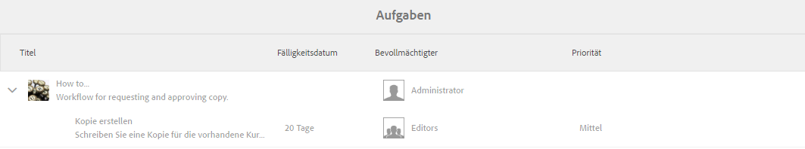
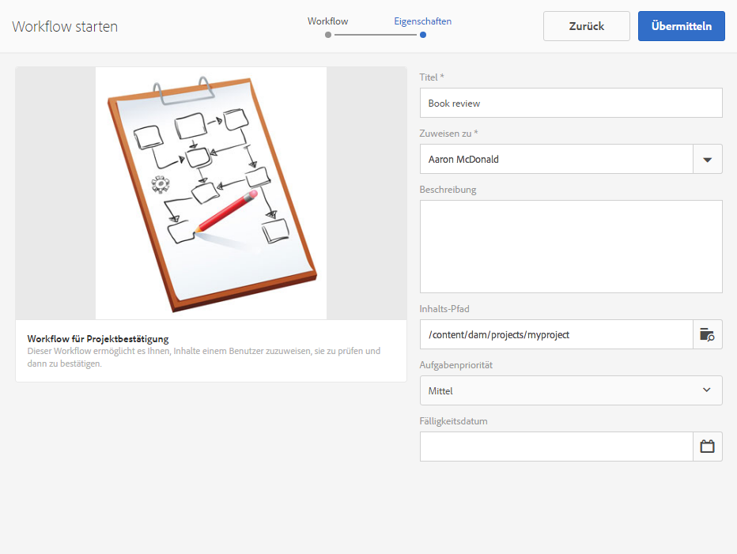
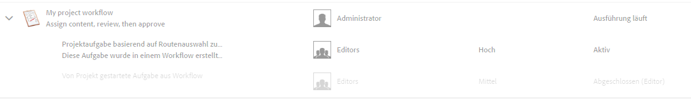
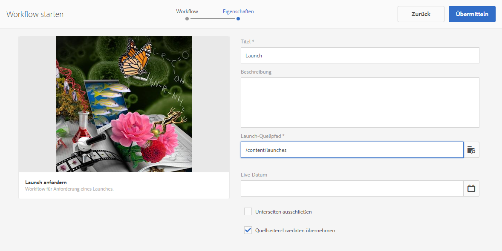
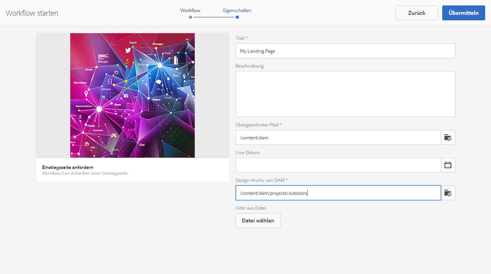
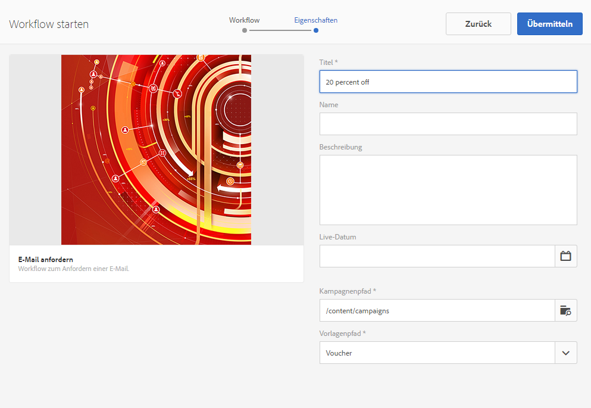
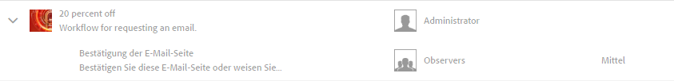

# Arbeiten mit Projekt-Workflows{#working-with-project-workflows}

Folgende Projekt-Workflows sind im Lieferumfang enthalten:

* **Workflow für Projektbestätigung** - Dieser Workflow ermöglicht es Ihnen, Inhalte einem Benutzer zuzuweisen, sie zu prüfen und dann zu bestätigen.
* **Launch anfordern** - Ein Workflow, der einen Launch anfordert.
* **Einstiegsseite anfordern** - Dieser Workflow fordert eine Landingpage an.
* **E-Mail anfordern** - Workflow zum Anfordern einer E-Mail.
* **Produkt-Fotoshooting und Produkt-Fotoshooting (Commerce)** - Ordnet Assets Produkten zu
* **DAM-Kopie erstellen und übersetzen und DAM-Sprachkopie erstellen** - Erstellt übersetzte Binärdateien, Metadaten und Tags für Assets und Ordner.

Je nachdem, welche Projektvorlage Sie auswählen, sind bestimmte Workflows verfügbar:

|  | **Einfaches Projekt** | **Medienprojekt** | **Projekt für Produkt-Fotoshooting** | **Übersetzungsprojekt** |
|---|:-:|:-:|:-:|:-:|
| Kopie anfordern |  | x |  |  |
| Produkt-Fotoshooting |  | x | x |  |
| Produkt-Fotoshooting (Commerce) |  |  | x |  |
| Projekt-Genehmigung | x |  |  |  |
| Launch anfordern | x |  |  |  |
| Einstiegsseite anfordern | x |  |  |  |
| E-Mail anfordern | x |  |  |  |
| DAM-Sprachkopie erstellen&amp;ast; |  |  |  | x |
| DAM-Sprachkopie erstellen und übersetzen&amp;ast; |  |  |  | x |

>[!NOTE]
>
>&amp;ast; Diese Workflows werden nicht auf der Kachel **Workflow** in Projekten gestartet. Weitere Informationen finden Sie unter [Erstellen von Sprachkopien für Assets](/help/sites-administering/tc-manage.md).

Das Starten und Abschließen eines Workflows ist unabhängig vom gewählten Workflow immer gleich. Nur die Schritte dazwischen ändern sich.

Sie starten einen Workflow direkt in Projekten (mit Ausnahme von „DAM-Sprachkopie erstellen“ bzw. „DAM-Sprachkopie erstellen und übersetzen“). Informationen über alle ausstehenden Aufgaben in einem Projekt werden in der Kachel **Aufgaben** aufgeführt. Benachrichtigungen für Aufgaben, die ausgeführt werden müssen, werden neben dem Benutzersymbol angezeigt.

Weitere Informationen zum Arbeiten mit Workflows in AEM finden Sie unter:

* [Teilnehmen an Workflows](/help/sites-authoring/workflows-participating.md)
* [Anwenden von Workflows auf Seiten](/help/sites-authoring/workflows-applying.md)
* [Konfigurieren von Workflows](/help/sites-administering/workflows.md)

Dieser Abschnitt beschreibt die Workflows, die für Projekte verfügbar sind.

## Workflow „Kopie anfordern“  {#request-copy-workflow}

Mit diesem Workflow können Sie ein Manuskript von einem Benutzer anfordern und es dann genehmigen. So starten Sie den Workflow „Kopie anfordern“:

1. Wählen Sie in Ihrem Medienprojekt das **Plussymbol** in der Kachel **Workflows** aus und wählen Sie dann **Workflow „Kopie anfordern“** aus.
1. Geben Sie einen Manuskripttitel und eine kurze Zusammenfassung dazu ein, was Sie anfordern. Geben Sie bei Bedarf eine Zielwortanzahl, eine Aufgabenpriorität und ein Fälligkeitsdatum ein.

   

1. Klicken Sie auf **Erstellen**. Der Workflow startet. Die Aufgabe wird in der Kachel **Aufgaben** angezeigt.

   

## Workflow „Produkt-Fotoshooting“{#product-photo-shoot-workflow}

Die Workflows „Produkt-Fotoshooting“ (mit oder ohne Commerce) werden in [Kreatives Projekt](/help/sites-authoring/managing-product-information.md) im Detail behandelt.

## Workflow für Projektbestätigung {#project-approval-workflow}

Im Workflow für Projektbestätigung weisen Sie Inhalte einem Benutzer zu, überprüfen diese und genehmigen sie dann.

1. Wählen Sie in Ihrem einfachen Projekt das **`+`**-Symbol in der Kachel **Workflows** aus und wählen Sie dann **Workflow für Projektbestätigung** aus.
1. Geben Sie einen Titel ein und wählen Sie aus, welchem Mitglied der Teamliste Sie den Workflow zuweisen möchten. Geben Sie bei Bedarf eine Beschreibung, einen Inhaltspfad, eine Aufgabenpriorität und ein Fälligkeitsdatum ein.

   

1. Klicken Sie auf **Erstellen**. Der Workflow startet. Die Aufgabe wird in der Kachel **Aufgaben** angezeigt.

   

## Workflow „Launch anfordern“ {#request-launch-workflow}

Mit diesem Workflow können Sie einen Launch anfordern.

1. Wählen Sie in Ihrem einfachen Projekt das **Plussymbol** in der Kachel **Workflows** aus und wählen Sie dann **Workflow „Launch anfordern“** aus.
1. Geben Sie einen Titel für den Launch ein und geben Sie den Launch-Quellpfad an. Sie können bei Bedarf auch eine Beschreibung und ein Live-Datum hinzufügen. Wählen Sie „Quellseiten-Live-Daten erben“ oder „Unterseiten ausschließen“ aus, je nachdem, wie der Launch sich verhalten soll.

   

1. Klicken Sie auf **Erstellen**. Der Workflow startet. Der Workflow wird in der Liste **Workflows** angezeigt (klicken Sie auf das Auslassungszeichen **…** auf der Kachel **Workflows**, um auf diese Liste zugreifen).

## Workflow „Einstiegsseite anfordern“{#request-landing-page-workflow}

Mit diesem Workflow können Sie eine Einstiegsseite anfordern.

1. Wählen Sie in Ihrem einfachen Projekt das **Plussymbol** in der Kachel **Workflows** aus und wählen Sie dann den Workflow „Einstiegsseite anfordern“ aus.
1. Geben Sie einen Titel für Ihre Einstiegsseite und den übergeordneten Pfad ein. Geben Sie bei Bedarf ein Live-Datum ein oder wählen Sie eine Datei für Ihre Einstiegsseite aus.

   

1. Klicken Sie auf **Erstellen**. Der Workflow startet. Die Aufgabe wird in der Kachel **Aufgabe** angezeigt.

## Workflow „E-Mail anfordern“  {#request-email-workflow}

Mit diesem Workflow können Sie eine E-Mail anfordern. Es ist der derselbe Workflow, der in der Kachel **E-Mails** angezeigt wird.

1. Wählen Sie in Ihrem Medien- oder einfachen Projekt das **Plussymbol** in der Kachel **Workflows** aus und wählen Sie dann den Workflow **E-Mail anfordern** aus.
1. Geben Sie einen E-Mail-Titel sowie den Kampagnen- und den Vorlagenpfad ein. Darüber hinaus können Sie einen Namen, eine Beschreibung und ein Live-Datum angeben.

   

1. Klicken Sie auf **Erstellen**. Der Workflow startet. Die Aufgabe wird in der Kachel **Aufgaben** angezeigt.

   

## Workflow „Sprachkopie erstellen (und übersetzen)“ für Assets {#create-and-translate-language-copy-workflow-for-assets}

Die Workflows **Sprachkopie erstellen** und **Sprachkopie erstellen und übersetzen** werden in [Erstellen von Sprachkopien für Assets](/help/assets/translation-projects.md) genauer erläutert. 
