# Projekte {#projects}

Mithilfe von Projekten können Sie Ressourcen zu einer Einheit gruppieren. Eine gemeinsam genutzte Umgebung erleichtert die Projektverwaltung. Die Ressourcentypen, die Sie mit einem Projekt verknüpfen können, werden in AEM als Kacheln bezeichnet. Kacheln können Projekt- und Team-Informationen, Assets, Workflows und andere Arten von Informationen sein. Ausführliche Informationen finden Sie unter [Projektkacheln](#project-tiles).

Als Benutzer haben Sie folgende Möglichkeiten:

* Erstellen und Löschen von Projekten
* Zuordnen von Inhalten und Asset-Ordnern zu einem Projekt
* Entfernen von Inhaltsverknüpfungen aus einem Projekt

## Zugriffsanforderungen {#access-requirements}

Erstellt eine standardmäßige AEM und erfordert keine zusätzliche Einrichtung.

Damit Benutzer in Projekten andere Benutzer/Gruppen sehen können, während sie Projekte wie Projekte erstellen, Aufgaben/Workflows erstellen oder das Team anzeigen und verwalten, müssen diese Benutzer jedoch Lesezugriff auf `/home/users` und `/home/groups`.

Am einfachsten ist es, die **projects-users** GruppenLesezugriff auf `/home/users` und `/home/groups`.

## Projektekonsole {#projects-console}

In der Projektekonsole können Sie innerhalb von AEM auf Ihre Projekte zugreifen und diese verwalten.

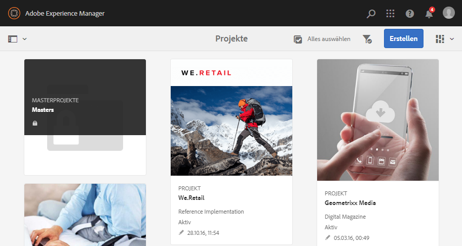

Die Projektekonsole ähnelt anderen Konsolen in AEM, ermöglicht eine Reihe von Aktionen für einzelne Projekte und passt Ihre Ansicht der Projekte an.

### Modus umschalten {#modes}

Sie können die Schienenauswahl verwenden, um zwischen den Konsolenmodi zu wechseln.

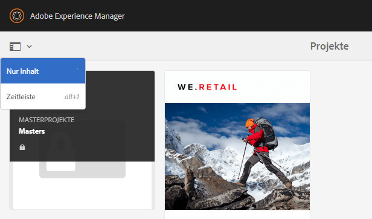

#### Nur Inhalt {#content-only}

Nur Inhalt ist der Standardmodus beim Öffnen der Konsole. Es zeigt alle Ihre Projekte.

#### Zeitleiste {#timeline}

In der Timeline-Ansicht können Sie ein einzelnes Projekt auswählen und die Aktivität darauf anzeigen. Verwenden der Schienenauswahl oder des Hotkeys `alt+1` , um zu dieser Ansicht zu wechseln.

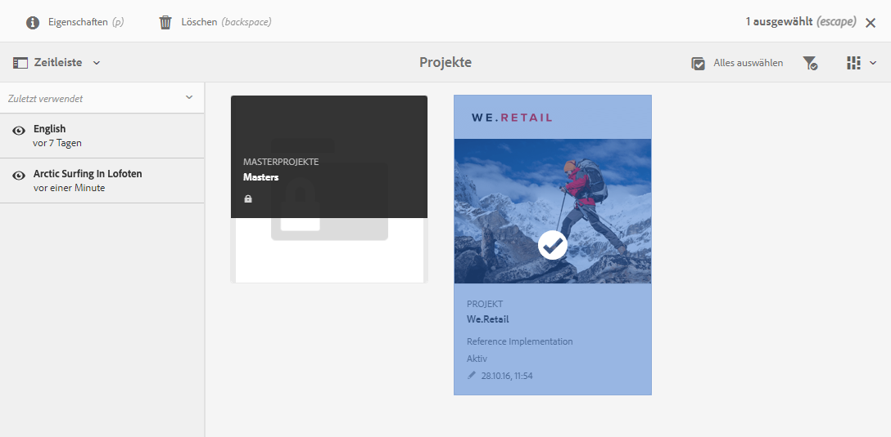

### Ansicht umschalten {#views}

Mit der Ansichtsauswahl können Sie zwischen der Anzeige von Projekten als große Kacheln (Standard), der Anzeige als Liste oder in einem Kalender wechseln.

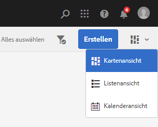

### Filtern Ihrer Ansicht {#filter}

Mit dem Filter können Sie zwischen allen Projekten und nur den aktiven wechseln.

### Auswählen und Anzeigen von Projekten {#selecting}

Wählen Sie ein Projekt aus, indem Sie den Mauszeiger über die Projektkachel bewegen und auf das Häkchen klicken.

Zeigen Sie die Details eines Projekts an, indem Sie darauf klicken, um eine detaillierte Ansicht zu erhalten.

### Erstellen neuer Projekte {#creating}

Klicken **Erstellen** , um ein neues Projekt hinzuzufügen.

## Projektkacheln {#project-tiles}

Projekte bestehen aus verschiedenen Arten von Informationen, die Sie gemeinsam verwalten möchten. Diese Informationen werden durch verschiedene **Kacheln**.

Sie können die folgenden Kacheln mit Ihrem Projekt verknüpfen.

* [Assets](#assets)
* [Asset-Sammlungen](#asset-collections)
* [Erlebnisse](#experiences)
* [Links](#links)
* [Projektinformationen](#project-info)
* [Team](#team)
* [Landing Pages](#landing-pages)
* [E-Mails](#emails)
* [Workflows](#workflows)
* [Launches](#launches)
* [Aufgaben](#tasks)

Klicken Sie oben rechts in einer Kachel auf das Dropdown-Menü, um der Kachel weitere Daten hinzuzufügen.

Klicken Sie auf die Schaltfläche mit den Auslassungspunkten unten rechts in einer beliebigen Kachel, um die Daten der Kachel in der zugehörigen Konsole zu öffnen.

### Assets {#assets}

In der Kachel **Assets** können Sie alle Assets zusammenstellen, die Sie für ein bestimmtes Projekt verwenden.

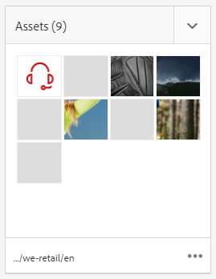

Laden Sie Assets direkt in die Kachel hoch.

### Asset-Sammlungen {#asset-collections}

[Asset-Sammlungen](/help/assets/manage-collections.md) können Ihrem Projekt ähnlich wie Assets direkt hinzugefügt werden. Sie definieren die Sammlungen unter „Assets“.

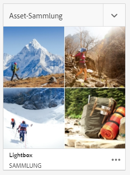

Fügen Sie eine Sammlung hinzu, indem Sie auf **Sammlung hinzufügen** klicken und die entsprechende Sammlung in der Liste auswählen.

### Erlebnisse {#experiences}

Die **Erlebnisse** Mit dieser Kachel können Sie eine mobile App, Website oder Veröffentlichung zum Projekt hinzufügen.

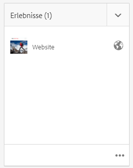

Die Symbole geben an, welche Art von Erlebnis dargestellt wird.

* Internetseite
* Mobile App

### Links {#links}

Die **Links** Mit dieser Kachel können Sie externe Links mit Ihrem Projekt verknüpfen.

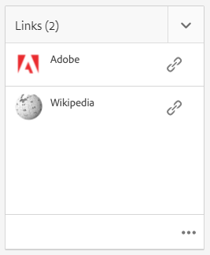

Sie können dem Link einen aussagekräftigen Namen geben und die Miniatur ändern.

### Projektinformationen {#project-info}

Die **Projektinformationen** Die Kachel enthält allgemeine Informationen zum Projekt, einschließlich einer Beschreibung, des Projektstatus (inaktiv oder aktiv), eines Fälligkeitsdatums und der Mitglieder. Darüber hinaus können Sie eine ProjektMiniatur hinzufügen, die auf der Hauptprojektseite angezeigt wird.

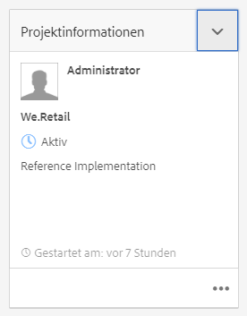

### Übersetzungsauftrag {#translation-job}

Die **Übersetzungsauftrag** ist der Bereich, in dem Sie eine Übersetzung starten und in dem Sie den Status Ihrer Übersetzungen sehen.

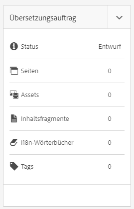

Informationen zum Einrichten der Übersetzung finden Sie im Dokument . [Erstellen von Übersetzungsprojekten.](/help/assets/translation-projects.md)

### Team {#team}

In dieser Kachel können Sie die Mitglieder des Projekt-Teams angeben. Geben Sie die Namen der Team-Mitglieder ein und weisen Sie Benutzerrollen zu.

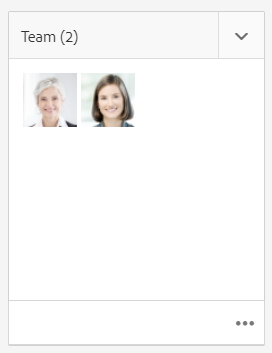

Sie können Team-Mitglieder zum Team hinzufügen und aus ihm löschen. Darüber hinaus können Sie die [Benutzerrolle](#userroles) bearbeiten, die dem jeweiligen Team-Mitglied zugewiesen ist.

### Landing Pages {#landing-pages}

Über die Kachel **** Einstiegsseiten können Sie eine neue Einstiegsseite anfordern.

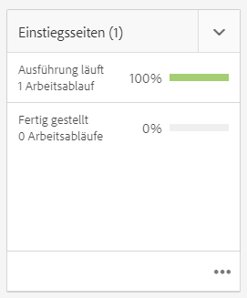

Dieser Workflow wird im Dokument beschrieben.[Erstellen Sie einen Landingpage-Workflow.](/help/sites-authoring/projects-with-workflows.md#request-landing-page-workflow)

### E-Mails {#emails}

In der Kachel **E-Mails** können Sie E-Mail-Anforderungen verwalten. Er startet **E-Mail-Anfrage** Arbeitsablauf.

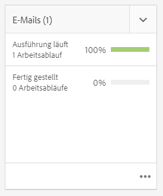

Weitere Informationen finden Sie unter [Workflow „E-Mail anfordern“](/help/sites-authoring/projects-with-workflows.md#request-email-workflow).

### Workflows {#workflows}

Sie können Workflows für Ihr Projekt starten. Wenn Workflows ausgeführt werden, wird ihr Status im **Workflows** Kachel.

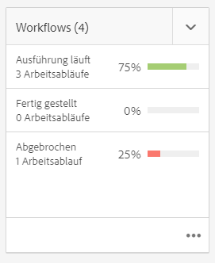

Je nachdem, welches Projekt Sie erstellen, sind unterschiedliche Workflows verfügbar.

Diese werden unter [Arbeiten mit Projekt-Workflows](/help/sites-authoring/projects-with-workflows.md) beschrieben.

### Starts {#launches}

Die **Starts** Die Kachel zeigt alle Launches an, die mit einer [Workflow &quot;Launch anfordern&quot;.](/help/sites-authoring/projects-with-workflows.md)

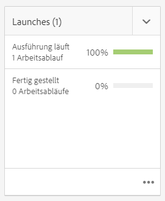

### Aufgaben {#tasks}

Mithilfe von Aufgaben können Sie den Status aller projektbezogenen Aufgaben überwachen, einschließlich Workflows. Aufgaben werden im Detail unter [Arbeiten mit Aufgaben](/help/sites-authoring/task-content.md) beschrieben.

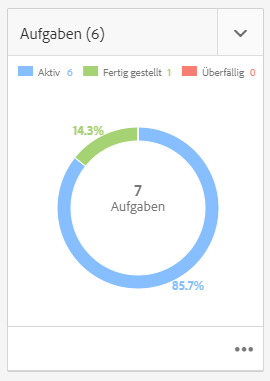

## Projektvorlagen {#project-templates}

Vorlagen dienen als Grundlage für den Projektstart. AEM stellt diese Standardprojektvorlagen bereit.

* **Medienprojekt** - Dies ist ein Referenzbeispielprojekt für medienbezogene Aktivitäten. Es enthält mehrere medienbezogene Projektrollen und auch Workflows, die mit Medieninhalten in Verbindung stehen.
* **[Projekt für Produkt-Fotoshooting](/help/sites-authoring/managing-product-information.md)** - Dies ist ein Referenzbeispiel für die Verwaltung der eCommerce-bezogenen Produktfotografie.
* **[Übersetzungsprojekt](/help/sites-administering/translation.md)** - Dies ist ein Referenzbeispiel für die Verwaltung von übersetzungsbezogenen Aktivitäten. Es enthält grundlegende Rollen und Workflows für die Verwaltung von Übersetzungen.
* **Einfaches Projekt** - Dies ist ein Referenzbeispiel für alle Projekte, die nicht in andere Kategorien passen. Es umfasst drei grundlegende Rollen und vier allgemeine AEM-Workflows.

Je nach ausgewählter Vorlage stehen Ihnen im Projekt verschiedene Optionen zur Verfügung, z. B. die Benutzerrollen und Workflows.

## Benutzerrollen in einem Projekt {#user-roles-in-a-project}

Die verschiedenen Benutzerrollen werden in der Projektvorlage definiert und aus zwei Hauptgründen verwendet:

1. Berechtigungen: Die Benutzerrollen lassen sich in eine der drei aufgeführten Kategorien einteilen: Beobachter, Bearbeiter, Inhaber. Beispielsweise hat ein Fotograf oder ein Texter dieselben Berechtigungen wie ein Redakteur. Über die Berechtigungen wird festgelegt, inwiefern ein Benutzer Inhalte in einem Projekt ändern kann.
1. Workflows: Die Workflows bestimmen, wem Aufgaben in einem Projekt zugewiesen werden. Die Aufgaben können einer Projektrolle zugeordnet werden. Beispielsweise kann Fotografen eine Aufgabe zugewiesen werden, sodass alle Teammitglieder, die die Rolle des Fotografen haben, die Aufgabe erhalten.

Alle Projekte unterstützen die folgenden Standardrollen, mit denen Sie Sicherheits- und Kontrollberechtigungen verwalten können.

| Rolle | Beschreibung | Berechtigungen | Gruppenmitgliedschaft |
|---|---|---|---|
| Beobachter | Ein Benutzer mit dieser Rolle kann Projektdetails, einschließlich des Projektstatus, anzeigen. | Nur-Lese-Zugriff auf ein Projekt | `workflow-users`-Gruppe |
| Bearbeiter | Ein Benutzer mit dieser Rolle kann Inhalt in ein Projekt hochladen und Projektinhalte bearbeiten. | Lese- und Schreibzugriff auf ein Projekt, zugehörige Metadaten und zugehörige Assets Berechtigungen zum Hochladen einer Aufnahmenliste, Fotoshootings sowie zum Überprüfen und Genehmigen von Assets Schreibberechtigung für `/etc/commerce` Berechtigung für ein bestimmtes Projekt ändern | `workflow-users`-Gruppe |
| Inhaber | Ein Benutzer mit dieser Rolle kann ein Projekt erstellen, die Arbeit an einem Projekt initiieren und genehmigte Assets in den Produktionsordner verschieben. Alle anderen Aufgaben im Projekt können auch vom Eigentümer angezeigt und ausgeführt werden. | Schreibberechtigung für `/etc/commerce` | `dam-users` -Gruppe, um ein Projekt erstellen zu können. `project-administrators` -Gruppe, um ein Projekt erstellen und Assets verschieben zu können. |

Für kreative Projekte stehen zusätzliche Rollen wie Fotografen zur Verfügung. Sie können diese Rollen verwenden, um auf deren Grundlage benutzerdefinierte Rollen für ein bestimmtes Projekt zu erstellen.

### Automatische Gruppenerstellung {#auto-group-creation}

Wenn Sie das Projekt erstellen und den verschiedenen Rollen Benutzer hinzufügen, werden mit dem Projekt verknüpfte Gruppen automatisch erstellt, um die zugehörigen Berechtigungen zu verwalten.

Ein Projekt mit dem Namen Myproject könnte z. B. drei Gruppen **Myproject-Eigentümer**, **MyProject-Editor**, **MyProject-Beobachter** haben.

Wenn das Projekt gelöscht wird, werden diese Gruppen nur gelöscht, wenn Sie die entsprechende Option auswählen [beim Löschen des Projekts.](/help/sites-authoring/touch-ui-managing-projects.md#deleting-a-project) Administratoren können die Gruppen in **Instrumente** > **Sicherheit** > **Gruppen**.

## Zusätzliche Ressourcen {#additional-resources}

Weitere Informationen zur Verwendung von Projekten finden Sie in den folgenden zusätzlichen Dokumenten:

* [Verwalten von Projekten](/help/sites-authoring/touch-ui-managing-projects.md)
* [Arbeiten mit Aufgaben](/help/sites-authoring/task-content.md)
* [Arbeiten mit Projekt-Workflows](/help/sites-authoring/projects-with-workflows.md)
* [Creative Project und PIM-Integration](/help/sites-authoring/managing-product-information.md)
